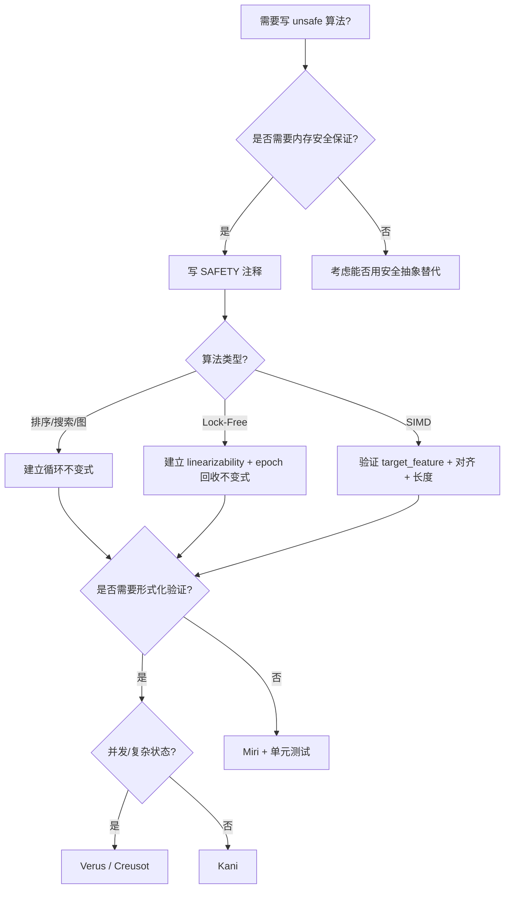
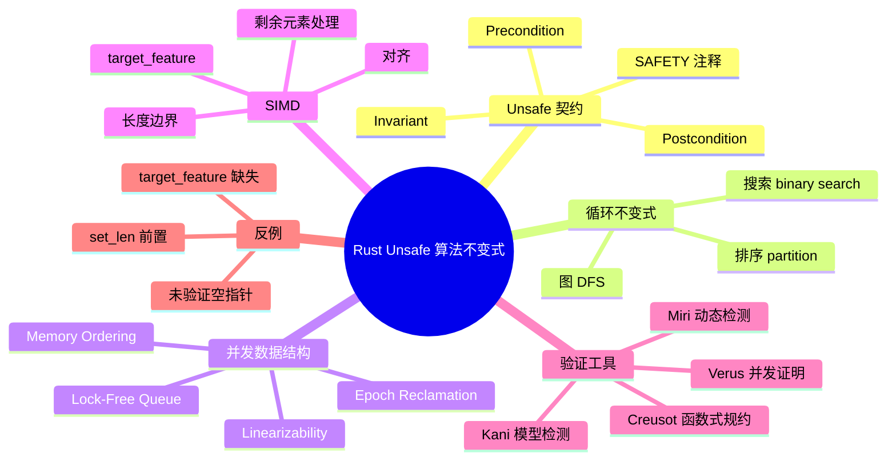

> **内容分级**: [专家级]
> **本节关键术语**: Unsafe Algorithm Invariants · SAFETY Comment · Loop Invariant · Lock-Free Queue · SIMD Preconditions · Miri · Kani · Verus · Creusot — [完整对照表](../../00_meta/01_terminology/01_terminology_glossary.md)

# Rust Unsafe 算法不变式

> **EN**: Unsafe Algorithm Invariants in Rust
> **Summary**: Engineering unsafe algorithm contracts in Rust: precondition/postcondition/invariant discipline, SAFETY comments, loop invariants in sorting/searching/graph algorithms, lock-free queue invariants, SIMD preconditions, and verification tool selection.
>
> **Rust 版本**: 1.97.0+ (Edition 2024)
> **受众**: [专家]
> **Bloom 层级**: L4-L6
> **权威来源**: 本文件为 `concept/06_ecosystem/11_domain_applications/` 应用视角权威页；通用形式化语义、Hoare 逻辑与内存模型权威来源见 [`concept/04_formal/08_algorithm_semantics/04_unsafe_algorithm_invariants.md`](../../04_formal/08_algorithm_semantics/04_unsafe_algorithm_invariants.md)。
> **A/S/P 标记**: **P+A** — Procedure + Application
> **定位**: 从算法工程角度讲解 unsafe 块的契约设计、循环不变式、并发数据结构与 SIMD 前置条件，并给出 Miri/Kani/Verus/Creusot 的选型建议。
> **前置概念**: [Unsafe Rust](../../03_advanced/02_unsafe/01_unsafe.md) · [Memory Model](../../03_advanced/02_unsafe/06_memory_model.md) · [并发](../../03_advanced/00_concurrency/01_concurrency.md) · [不安全算法的语义不变量](../../04_formal/08_algorithm_semantics/04_unsafe_algorithm_invariants.md)
> **后置概念**: [算法工程实践](08_algorithm_engineering_practice.md) · [并行算法](25_parallel_algorithms.md) · [高级数据结构 Rust 实现](24_advanced_data_structures_implementation.md)
> **L5 对比**: [Rust vs C++](../../05_comparative/01_systems_languages/01_rust_vs_cpp.md)

---

> **来源**: [The Rust Reference — Unsafe Rust](https://doc.rust-lang.org/reference/unsafe-blocks.html) · [The Rustonomicon](https://doc.rust-lang.org/nomicon/index.html) · [RustBelt](https://plv.mpi-sws.org/rustbelt/) · [Rust Atomics and Locks](https://marabos.nl/atomics/) · [Miri](https://github.com/rust-lang/miri) · [Kani](https://model-checking.github.io/kani/) · [Verus](https://verus-lang.github.io/verus/) · [Creusot](https://github.com/creusot-rs/creusot)

---

## 📑 目录

- [Rust Unsafe 算法不变式](#rust-unsafe-算法不变式)
  - [📑 目录](#-目录)
  - [一、Unsafe 块契约](#一unsafe-块契约)
    - [1.1 Precondition / Postcondition / Invariant](#11-precondition--postcondition--invariant)
    - [1.2 SAFETY 注释规范](#12-safety-注释规范)
  - [二、循环不变式在算法中的应用](#二循环不变式在算法中的应用)
    - [2.1 排序算法](#21-排序算法)
    - [2.2 搜索算法](#22-搜索算法)
    - [2.3 图算法](#23-图算法)
  - [三、并发数据结构 Unsafe 不变式](#三并发数据结构-unsafe-不变式)
    - [3.1 Lock-Free Queue 示例](#31-lock-free-queue-示例)
    - [3.2 内存序与 Linearizability](#32-内存序与-linearizability)
  - [四、SIMD 前置条件](#四simd-前置条件)
  - [五、验证工具选型](#五验证工具选型)
  - [六、反例与陷阱](#六反例与陷阱)
    - [反例 1：未验证指针非空](#反例-1未验证指针非空)
    - [反例 2：set\_len 在初始化之前](#反例-2set_len-在初始化之前)
    - [反例 3：SIMD target\_feature 误用](#反例-3simd-target_feature-误用)
  - [七、决策树](#七决策树)
  - [八、相关概念](#八相关概念)
  - [九、国际权威参考](#九国际权威参考)
  - [十、思维导图](#十思维导图)

---

## 一、Unsafe 块契约

Rust 的 `unsafe` 块不是「关闭安全检查」，而是把责任从编译器转移给程序员。一个安全的 unsafe 算法必须显式维护三类契约：

| 契约 | 含义 | 示例 |
|---|---|---|
| **前置条件 (Precondition)** | 进入 unsafe 块前调用者必须保证的事实 | 指针非空、已对齐、缓冲区足够大 |
| **后置条件 (Postcondition)** | unsafe 块返回后向调用者承诺的事实 | 输出已初始化、抽象屏障已恢复 |
| **不变式 (Invariant)** | 整个执行过程中持续成立的性质 | 循环中 `ptr[0..i)` 已初始化、红黑树颜色不变 |

### 1.1 Precondition / Postcondition / Invariant

```rust
/// # Safety
/// - `src` and `dst` must be valid for reads/writes of `count * size_of::<T>()` bytes.
/// - `src` and `dst` must be properly aligned to `align_of::<T>()`.
/// - The memory regions must not overlap.
unsafe fn copy_nonoverlapping_words<T: Copy>(src: *const T, dst: *mut T, count: usize) {
    // SAFETY: 调用者已保证上述 precondition。
    std::ptr::copy_nonoverlapping(src, dst, count);
}
```

### 1.2 SAFETY 注释规范

每个 `unsafe` 块上方必须写 `// SAFETY:` 注释，说明为什么当前调用是安全的。规范格式：

```text
// SAFETY: <precondition 已满足的原因>, <不会触发 UB 的额外论证>。
```

反例：

```rust,ignore
// ❌ 不好的注释
unsafe { *ptr }

// ✅ 好的注释
// SAFETY: `ptr` 来自合法 Box::into_raw，且本函数持有其唯一所有权，
//         此前已通过 null/align 检查。
unsafe { *Box::from_raw(ptr) }
```

---

## 二、循环不变式在算法中的应用

循环不变式是证明算法正确性的核心工具：每次迭代开始时成立，迭代过程中保持，循环终止时推出目标结论。

### 2.1 排序算法

以快速排序的 `partition` 为例，循环不变式可以表述为：

```text
Invariant:
  1. pivot 位于数组末尾（arr[len-1]）。
  2. arr[0..store) 中的所有元素 < pivot。
  3. arr[store..i) 中的所有元素 >= pivot。
  4. i <= len - 1。
```

```rust
fn partition<T: Ord>(arr: &mut [T]) -> usize {
    let len = arr.len();
    if len <= 1 { return 0; }
    arr.swap(len / 2, len - 1); // pivot 放末尾
    let mut store = 0;
    for i in 0..len - 1 {
        if arr[i] < arr[len - 1] {
            arr.swap(i, store);
            store += 1;
        }
    }
    arr.swap(store, len - 1);
    store
}
```

### 2.2 搜索算法

二分搜索的循环不变式：

```text
Invariant:
  1. arr 是有序的。
  2. 如果 target 在 arr 中，则 target 位于 arr[left..right] 内。
  3. left <= right。
```

```rust
fn binary_search(arr: &[i32], target: i32) -> Option<usize> {
    let mut left = 0;
    let mut right = arr.len();
    while left < right {
        let mid = left + (right - left) / 2;
        match arr[mid].cmp(&target) {
            std::cmp::Ordering::Equal => return Some(mid),
            std::cmp::Ordering::Less => left = mid + 1,
            std::cmp::Ordering::Greater => right = mid,
        }
    }
    None
}
```

### 2.3 图算法

DFS 递归中的隐式不变式：

```text
Invariant:
  1. visited[v] == true 表示节点 v 已被访问或正在访问栈中。
  2. 递归栈中的节点构成一条从起点到当前节点的路径。
```

在 unsafe 实现中（如使用 MaybeUninit 预分配访问标记数组），这些不变式必须被显式维护。

---

## 三、并发数据结构 Unsafe 不变式

Lock-free 数据结构的正确性依赖于原子操作与 carefully designed invariants。以 Michael-Scott 无锁队列为例，核心不变式包括：

1. **哨兵节点**：队列至少有一个哨兵头节点，enqueue/dequeue 不直接操作 head/tail 本身；
2. **tail 滞后**：tail 不一定指向真正的尾节点；enqueue 需要推进 tail；
3. **ABA 安全**：通过 epoch-based reclamation（如 crossbeam-epoch）避免已释放节点被复用。

### 3.1 Lock-Free Queue 示例

```rust,ignore
use std::sync::atomic::{AtomicPtr, Ordering};
use std::ptr;

struct Node<T> {
    value: T,
    next: AtomicPtr<Node<T>>,
}

struct LockFreeQueue<T> {
    head: AtomicPtr<Node<T>>,
    tail: AtomicPtr<Node<T>>,
}

impl<T> LockFreeQueue<T> {
    fn new() -> Self {
        let sentinel = Box::into_raw(Box::new(Node {
            value: unsafe { std::mem::zeroed() },
            next: AtomicPtr::new(ptr::null_mut()),
        }));
        Self {
            head: AtomicPtr::new(sentinel),
            tail: AtomicPtr::new(sentinel),
        }
    }

    unsafe fn enqueue(&self, value: T) {
        let new_node = Box::into_raw(Box::new(Node {
            value,
            next: AtomicPtr::new(ptr::null_mut()),
        }));

        loop {
            let tail = self.tail.load(Ordering::Acquire);
            let tail_next = (*tail).next.load(Ordering::Acquire);

            if tail == self.tail.load(Ordering::Acquire) {
                if tail_next.is_null() {
                    // SAFETY: tail_next 来自当前 tail 的快照，且我们持有独占修改权（CAS）。
                    if (*tail).next.compare_exchange(
                        tail_next,
                        new_node,
                        Ordering::Release,
                        Ordering::Relaxed,
                    ).is_ok() {
                        // 尝试推进 tail；即使失败，后续 enqueue 会处理。
                        let _ = self.tail.compare_exchange(
                            tail,
                            new_node,
                            Ordering::Release,
                            Ordering::Relaxed,
                        );
                        break;
                    }
                } else {
                    // tail 滞后，尝试推进
                    let _ = self.tail.compare_exchange(
                        tail,
                        tail_next,
                        Ordering::Release,
                        Ordering::Relaxed,
                    );
                }
            }
        }
    }
}
```

### 3.2 内存序与 Linearizability

Lock-free 算法的 correctness criteria 通常是 **linearizability**：每个操作看起来都在某个瞬间原子完成。

| Memory Ordering | 语义保证 | 典型用途 |
|---|---|---|
| `Relaxed` | 仅原子性，无 happens-before | 计数器内部状态 |
| `Acquire` / `Release` | 建立同步边 | 读取/写入共享指针 |
| `SeqCst` | 全局顺序 | 多线程 flag 状态机 |

> **建议**：默认使用 `Acquire`/`Release` 组合保护指针访问；仅在能证明全局顺序必要时使用 `SeqCst`，因为它会限制编译器/CPU 重排序。

---

## 四、SIMD 前置条件

SIMD intrinsics 大量依赖 unsafe。使用前应验证：

1. **目标特性可用**：`#[target_feature(enable = "avx2")]` 或运行时 `is_x86_feature_detected!("avx2")`；
2. **对齐**：`load` 通常要求 16/32/64 字节对齐；`loadu` 放宽对齐但仍要求地址有效；
3. **长度**：处理剩余元素，避免越界；
4. **类型宽度匹配**：`__m256` 对应 8×f32，`__m256d` 对应 4×f64。

```rust
#[cfg(target_arch = "x86_64")]
use std::arch::x86_64::*;

#[target_feature(enable = "avx2")]
unsafe fn simd_sum_avx2(values: &[f32]) -> f32 {
    // SAFETY: 调用者已通过 is_x86_feature_detected!("avx2") 确认支持。
    let chunks = values.len() / 8;
    let mut acc = _mm256_setzero_ps();
    for i in 0..chunks {
        let offset = i * 8;
        // SAFETY: offset..offset+8 在 values 范围内，且 values 指针有效。
        let v = _mm256_loadu_ps(values.as_ptr().add(offset));
        acc = _mm256_add_ps(acc, v);
    }

    let mut result = [0.0f32; 8];
    _mm256_storeu_ps(result.as_mut_ptr(), acc);
    let mut sum: f32 = result.iter().sum();

    // 处理剩余元素
    for i in (chunks * 8)..values.len() {
        sum += values[i];
    }
    sum
}

fn safe_simd_sum(values: &[f32]) -> f32 {
    #[cfg(target_arch = "x86_64")]
    {
        if is_x86_feature_detected!("avx2") {
            return unsafe { simd_sum_avx2(values) };
        }
    }
    values.iter().sum()
}
```

---

## 五、验证工具选型

| 工具 | 方法 | 适用场景 | 学习曲线 |
|---|---|---|---|
| **Miri** | 解释执行，动态检测 UB | 指针有效性、别名、未初始化内存、数据竞争 | 低 |
| **Kani** | 有界模型检测 | 验证 unsafe 块在有限输入下不违反内存契约 | 中 |
| **Verus** | 分离逻辑 + SMT | 验证并发算法、数据结构不变式 | 高 |
| **Creusot** | Why3 / Pearlite | 函数式规约、算法前后置条件 | 高 |

**建议工作流**：

1. 先用 Miri 跑测试用例，排除常见 UB；
2. 对核心 unsafe 块写 Kani harness，做有界验证；
3. 对关键并发数据结构或安全关键模块，考虑 Verus/Creusot 形式化证明。

---

## 六、反例与陷阱

### 反例 1：未验证指针非空

```rust,ignore
// ❌ 错误：未检查 ptr 是否为空
unsafe fn deref_bad<T>(ptr: *const T) -> &T {
    &*ptr
}

// ✅ 修正
unsafe fn deref_good<T>(ptr: *const T) -> Option<&T> {
    if ptr.is_null() {
        return None;
    }
    Some(&*ptr)
}
```

### 反例 2：set_len 在初始化之前

```rust,ignore
fn buggy_vec<T>() -> Vec<T> {
    let mut v = Vec::with_capacity(4);
    unsafe {
        // ❌ 错误：先 set_len，但元素未初始化
        v.set_len(4);
    }
    v
}
```

正确顺序：先写入，再 `set_len`。

### 反例 3：SIMD target_feature 误用

```rust,ignore
// ❌ 错误：在函数外部调用未启用 target_feature 的 SIMD 函数
unsafe fn avx_add(a: &[f32], b: &[f32], c: &mut [f32]) {
    // 使用了 AVX2 intrinsics，但没有 #[target_feature(enable = "avx2")]
}

// ✅ 修正
#[target_feature(enable = "avx2")]
unsafe fn avx_add_fixed(a: &[f32], b: &[f32], c: &mut [f32]) {
    // ...
}
```

---

## 七、决策树



---

## 八、相关概念

- [Rust vs C++](../../05_comparative/01_systems_languages/01_rust_vs_cpp.md) — L5 系统语言对比：unsafe 契约与内存安全边界的跨语言视角
- [不安全算法的语义不变量](../../04_formal/08_algorithm_semantics/04_unsafe_algorithm_invariants.md) — L4 形式化权威：Hoare 逻辑、内存不变量与抽象屏障
- [并行算法](25_parallel_algorithms.md) — L5-L6：lock-free、memory ordering 与并发算法实践

---

## 九、国际权威参考

> 依据 `AGENTS.md` §2「对齐网络国际化权威内容」补充：仅追加已验证可达的权威链接，不改动正文事实。

- **P0 官方**: [The Rust Reference — Unsafe Rust](https://doc.rust-lang.org/reference/unsafe-blocks.html)
- **P0 官方**: [The Rustonomicon](https://doc.rust-lang.org/nomicon/index.html)
- **P0 官方**: [Rust Unsafe Code Guidelines](https://rust-lang.github.io/unsafe-code-guidelines/)
- **P1 形式化**: [RustBelt](https://plv.mpi-sws.org/rustbelt/)
- **P1 并发**: [Rust Atomics and Locks](https://marabos.nl/atomics/)
- **P1 学术**: [Herlihy & Shavit — The Art of Multiprocessor Programming](https://dl.acm.org/doi/10.5555/2385452)
- **P2 工具**: [Miri](https://github.com/rust-lang/miri)
- **P2 工具**: [Kani](https://model-checking.github.io/kani/)
- **P2 工具**: [Verus](https://verus-lang.github.io/verus/)
- **P2 工具**: [Creusot](https://github.com/creusot-rs/creusot)

> **通用 unsafe 不变式形式化权威来源**: [concept/04_formal/08_algorithm_semantics/04_unsafe_algorithm_invariants.md](../../04_formal/08_algorithm_semantics/04_unsafe_algorithm_invariants.md)

---

## 十、思维导图



> **认知功能**: 本 mindmap 从 unsafe 算法契约出发，按算法类型（串行/并发/SIMD）与验证工具组织，帮助读者在写 unsafe 代码前明确需要证明的不变式，并选择匹配的验证手段。
