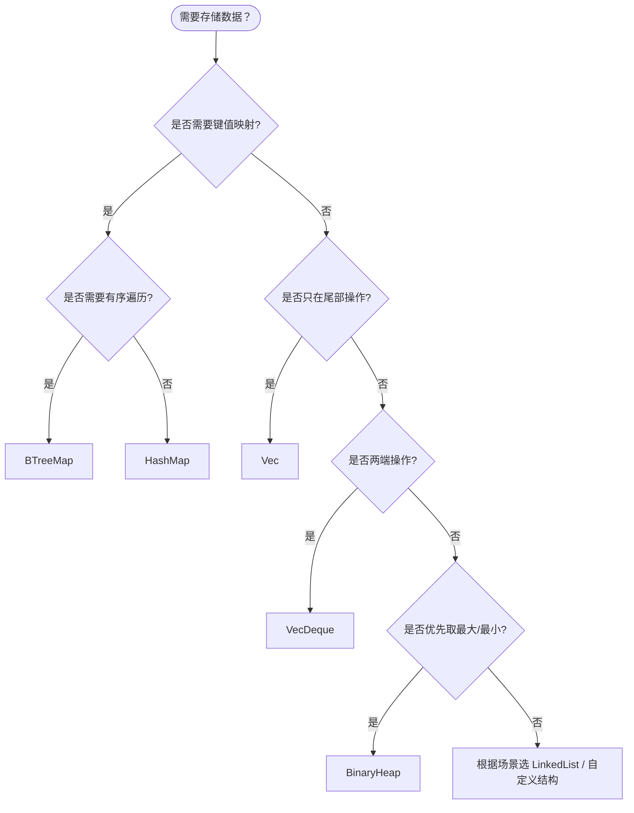

> **内容分级**: [进阶]
> **代码状态**: ✅ 含可编译示例
>
> # Rust 数据结构实践
>
> **EN**: Data Structures in Rust
> **Summary**: Core data structures in Rust's standard library and common custom implementations: vectors, queues, trees, hash tables, graphs, and advanced structures, with selection guidance and ownership-aware design patterns.
> **Rust 版本**: 1.97.0+ (Edition 2024)
>
> **受众**: [进阶]
> **权威来源**: 本文件为 `concept/` 权威页。
> **层级**: L6 应用主题
> **A/S/P 标记**: **A+S** — Application + Structure
> **前置概念**: [Ownership](../../01_foundation/01_ownership_borrow_lifetime/01_ownership.md) · [Borrowing](../../01_foundation/01_ownership_borrow_lifetime/02_borrowing.md) · [Generics](../../02_intermediate/01_generics/02_generics.md) · [Collections](../../01_foundation/05_collections/08_collections.md)
> **后置概念**: [算法工程实践](76_algorithm_engineering_practice.md) · [算法与竞赛编程](29_algorithms_competitive_programming.md)
>
> **权威来源**: [std::collections](https://doc.rust-lang.org/std/collections/) · [The Rust Programming Language](https://doc.rust-lang.org/book/title-page.html) · [Rust By Example](https://doc.rust-lang.org/rust-by-example/index.html)

---

## 1. 线性数据结构

### 1.1 `Vec<T>` — 动态数组

```rust
fn vec_demo() {
    let mut v = Vec::new();
    v.push(1);
    v.push(2);

    let first = v[0];               // O(1) 索引
    let second = v.get(1);          // 安全访问
    let mut v2 = Vec::with_capacity(1024); // 预分配
}
```

**复杂度**：索引 O(1)，尾部插入 O(1) 摊销，中间插入/删除 O(n)。

### 1.2 `VecDeque<T>` — 双端队列

```rust
use std::collections::VecDeque;

fn deque_demo() {
    let mut dq = VecDeque::new();
    dq.push_back(1);
    dq.push_front(2);
    dq.pop_back();
    dq.pop_front();
}
```

**复杂度**：两端插入/删除 O(1)，中间 O(n)。

### 1.3 `LinkedList<T>` — 双向链表

```rust
use std::collections::LinkedList;

fn list_demo() {
    let mut list = LinkedList::new();
    list.push_back(1);
    list.push_front(0);
    let mut tail = list.split_off(1);
    list.append(&mut tail);
}
```

**使用建议**：仅在需要频繁中间插入/删除且无需随机访问时考虑；现代 CPU 缓存下 `Vec` 往往更快。

## 2. 栈与队列

| 抽象 | 标准库实现 | 操作 |
| :--- | :--- | :--- |
| 栈（LIFO） | `Vec` | `push` / `pop` |
| 队列（FIFO） | `VecDeque` | `push_back` / `pop_front` |
| 优先队列 | `BinaryHeap` | `push` / `pop` |

## 3. 树结构

- **二叉搜索树（BST）**：可用 `Box<Node>` 自引用（Reference）实现，但 Rust 中更常用标准库的平衡树 `BTreeMap`/`BTreeSet`。
- **B 树**：`std::collections::BTreeMap` 和 `BTreeSet` 基于 B 树实现，支持有序遍历和范围查询。

```rust
use std::collections::BTreeMap;

fn btree_demo() {
    let mut map = BTreeMap::new();
    map.insert(3, "c");
    map.insert(1, "a");
    map.insert(2, "b");
    for (k, v) in map.range(1..=2) {
        println!("{} -> {}", k, v);
    }
}
```

## 4. 哈希表

```rust
use std::collections::{HashMap, HashSet};

fn hash_demo() {
    let mut map = HashMap::new();
    map.insert("key", 42);

    let mut set = HashSet::new();
    set.insert(1);
}
```

**复杂度**：平均查找/插入/删除 O(1)，最坏 O(n)。可通过自定义 `BuildHasher`（如 `ahash`）提升性能。

## 5. 图结构

常用邻接表表示：

```rust
use std::collections::HashMap;

type Graph = HashMap<usize, Vec<usize>>;

fn add_edge(graph: &mut Graph, u: usize, v: usize) {
    graph.entry(u).or_default().push(v);
}
```

对于稠密图或需要快速边查询的场景，可使用邻接矩阵 `Vec<Vec<bool>>` 或 `bitvec`。

### 带所有权图：使用 `Rc`/`RefCell` 或 Arena

```rust
use std::rc::{Rc, Weak};
use std::cell::RefCell;

#[derive(Default)]
struct Node {
    value: i32,
    neighbors: RefCell<Vec<Weak<Node>>>,
}

fn build_graph() {
    let a = Rc::new(Node { value: 1, ..Default::default() });
    let b = Rc::new(Node { value: 2, ..Default::default() });
    a.neighbors.borrow_mut().push(Rc::downgrade(&b));
}
```

## 6. 高级数据结构

| 数据结构 | Rust 实现方式 | 典型应用 |
| :--- | :--- | :--- |
| 跳表（Skip List） | 自定义或第三方 crate | 有序集合 |
| 红黑树 | `std::collections::BTreeMap` | 有序映射 |
| 可持久化线段树 | 自定义函数式结构 | 区间查询历史版本 |
| 布隆过滤器 | `bloom` / `bloomfilter` crate | 大数据去重 |
| 并查集（Union-Find） | 自定义数组 + 路径压缩 | 连通性判断 |

### 并查集示例

```rust
pub struct UnionFind {
    parent: Vec<usize>,
    rank: Vec<usize>,
}

impl UnionFind {
    pub fn new(n: usize) -> Self {
        Self {
            parent: (0..n).collect(),
            rank: vec![0; n],
        }
    }

    pub fn find(&mut self, x: usize) -> usize {
        if self.parent[x] != x {
            self.parent[x] = self.find(self.parent[x]);
        }
        self.parent[x]
    }

    pub fn union(&mut self, x: usize, y: usize) {
        let (rx, ry) = (self.find(x), self.find(y));
        if rx == ry { return; }
        match self.rank[rx].cmp(&self.rank[ry]) {
            std::cmp::Ordering::Less => self.parent[rx] = ry,
            std::cmp::Ordering::Greater => self.parent[ry] = rx,
            std::cmp::Ordering::Equal => {
                self.parent[ry] = rx;
                self.rank[rx] += 1;
            }
        }
    }
}
```

## 7. 集合选择决策树



## 8. 常用第三方 crate

| 用途 | crate | 说明 |
| :--- | :--- | :--- |
| 有序映射/集合 | `indexmap` / `indexset` | 保留插入顺序 |
| 稳定 ID 分配 | `slotmap` | 键类型安全、可删除 |
| 图算法 | `petgraph` | 有向/无向图、遍历、最短路径 |
| 并发哈希表 | `dashmap` | 无锁/细粒度锁并发访问 |
| 位集合 | `bitvec` | 紧凑位运算 |
| 高效哈希 | `ahash` / `fxhash` | 非加密快速哈希 |

## 9. 性能对比

| 数据结构 | 随机访问 | 插入 | 删除 | 查找 | 备注 |
| :--- | :--- | :--- | :--- | :--- | :--- |
| `Vec` | O(1) | O(1) 尾部 | O(n) | O(n) | 缓存友好 |
| `VecDeque` | O(1) | O(1) 两端 | O(1) 两端 | O(n) | 队列首选 |
| `LinkedList` | O(n) | O(1) | O(1) | O(n) | 缓存不友好 |
| `HashMap` | — | O(1) 平均 | O(1) 平均 | O(1) 平均 | 键值存储 |
| `BTreeMap` | — | O(log n) | O(log n) | O(log n) | 有序 |
| `BinaryHeap` | — | O(log n) | O(log n) 堆顶 | — | 优先队列 |

## 10. 所有权与数据结构设计

Rust 的所有权（Ownership）模型直接影响数据结构实现：

- **唯一所有权（Ownership）**：树形结构用 `Box<Node>` 即可表达父子关系。
- **共享可变图**：需要 `Rc<RefCell<T>>` 或 Arena + index。
- **并发共享**：使用 `Arc<Mutex<T>>` 或并发集合如 `DashMap`。
- **零拷贝切片（Slice）**：利用 `&[T]` 和 `Vec` 的 `drain`/`split_off` 避免克隆。

## 11. 最佳实践

- 默认使用 `Vec` 和 `HashMap`，它们经过高度优化。
- 需要有序遍历时选择 `BTreeMap`/`BTreeSet`。
- 避免在性能关键路径上使用 `LinkedList`。
- 利用 Rust 的所有权模型在编译期保证数据结构不变量。
- 对图、链表等自引用（Reference）结构，优先用 index/Arena 替代 `Rc<RefCell<T>>` 以提升性能与可维护性。

> **L5 对比**: [Rust vs C++](../../05_comparative/01_systems_languages/01_rust_vs_cpp.md) · [Rust vs Go](../../05_comparative/01_systems_languages/02_rust_vs_go.md)

---

> **来源**: [std::collections](https://doc.rust-lang.org/std/collections/) · [The Rust Programming Language](https://doc.rust-lang.org/book/title-page.html)

## 过渡段

> **过渡**: 从标准集合过渡到自定义数据结构，可以理解何时需要跳出 std 提供的抽象。
>
> **过渡**: 从所有权设计过渡到内存布局，可以建立缓存友好与零拷贝的实现思路。
>
> **过渡**: 从布局优化过渡到算法使用，可以选择最适合该结构的访问模式。
>

## 定理链

| 定理 | 前提 | 结论 |
|:---|:---|:---|
| 合适结构 ⟹ 算法效率 | 根据访问模式选择 | 时间/空间复杂度最优 |
| 所有权清晰 ⟹ 更少 bug | Rust 借用（Borrowing）规则约束 | 避免悬垂与数据竞争 |
| 缓存友好布局 ⟹ 吞吐提升 | 控制结构体（Struct）字段顺序 | 减少缓存未命中 |


---

## 国际权威参考 / International Authority References（P1 学术 · P2 生态）

> 依据 `AGENTS.md` §2「对齐网络国际化权威内容」补充：仅追加已验证可达的权威链接，不改动正文事实。

- **P2 生态/社区**: [docs.rs/itertools — 生态权威 API 文档](https://docs.rs/itertools) · [docs.rs/rayon — 生态权威 API 文档](https://docs.rs/rayon)
- **P1 学术/形式化**: [Skiena: The Algorithm Design Manual (2nd ed., Springer)](https://link.springer.com/book/10.1007/978-1-84800-070-4)
