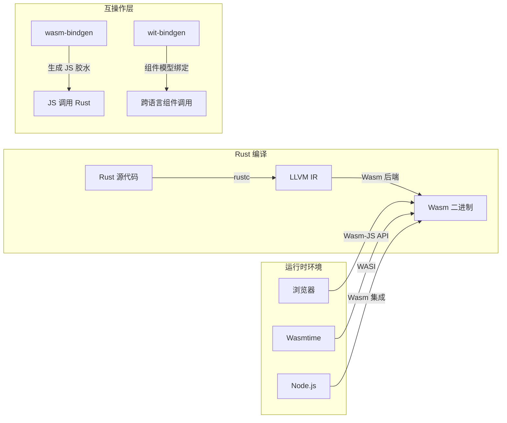
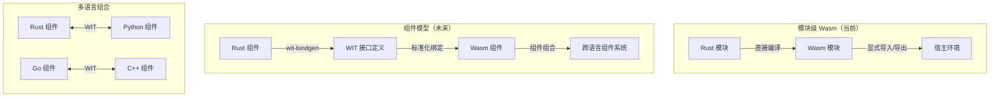
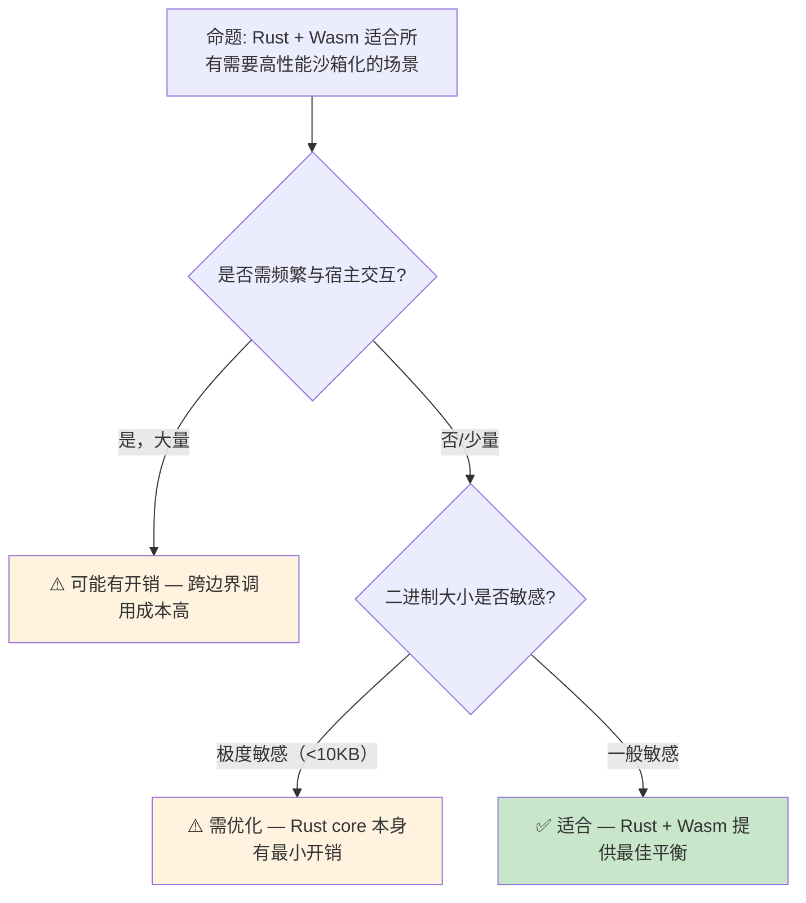

# WebAssembly [来源: [WebAssembly.org](https://webassembly.org/)] 生态：Rust 的浏览器外运行时

> **Bloom 层级**: 应用 → 分析
> **定位**: 系统分析 Rust 在 **WebAssembly (Wasm)** 生态中的核心地位，探讨 `wasm32-unknown-unknown` / `wasm32-wasi` 目标、`wasm-bindgen [来源: [wasm-bindgen](https://github.com/rustwasm/wasm-bindgen)]`、组件模型以及 Rust 作为 Wasm 首选语言的工程原因。
> **前置概念**: [Toolchain](./01_toolchain.md) · [FFI](../03_advanced/05_rust_ffi.md) · [Type System](../01_foundation/04_type_system.md)
> **后置概念**: [WASI](./08_wasi.md)

---

> **来源**: [WebAssembly Specification](https://webassembly.github.io/spec/) ·
> [Rust Wasm Book](https://rustwasm.github.io/book/) ·
> [wasm-bindgen Guide](https://rustwasm.github.io/wasm-bindgen/) ·
> [Bytecode Alliance](https://bytecodealliance.org/) ·
> [W3C WebAssembly](https://www.w3.org/wasm/)

## 📑 目录
>
> [来源: [Rust Reference](https://doc.rust-lang.org/reference/)]
>
> [来源: [TRPL](https://doc.rust-lang.org/book/)]

- [WebAssembly \[来源: WebAssembly.org\] 生态：Rust 的浏览器外运行时](#webassembly-来源-webassemblyorg-生态rust-的浏览器外运行时)
  - [📑 目录](#-目录)
  - [一、核心概念](#一核心概念)
    - [1.1 WebAssembly 的设计哲学](#11-webassembly-的设计哲学)
    - [1.2 Rust → Wasm 的编译模型](#12-rust--wasm-的编译模型)
    - [1.3 为什么 Rust 是 Wasm 的首选语言](#13-为什么-rust-是-wasm-的首选语言)
  - [二、技术细节](#二技术细节)
    - [2.1 wasm32 目标三元组](#21-wasm32-目标三元组)
    - [2.2 wasm-bindgen 与 JS 互操作](#22-wasm-bindgen-与-js-互操作)
    - [2.3 Wasm 组件模型](#23-wasm-组件模型)
  - [三、应用场景分析](#三应用场景分析)
  - [四、反命题与边界分析](#四反命题与边界分析)
    - [4.1 反命题树](#41-反命题树)
    - [4.2 边界极限](#42-边界极限)
  - [五、工具链与运行时](#五工具链与运行时)
  - [六、来源与延伸阅读](#六来源与延伸阅读)
  - [相关概念文件](#相关概念文件)

---

## 一、核心概念
>
> [来源: [Rust Reference](https://doc.rust-lang.org/reference/)]
>
> [来源: [Rust Reference](https://doc.rust-lang.org/reference/)]

### 1.1 WebAssembly 的设计哲学

WebAssembly 是一种**可移植、安全、高效**的低级字节码格式：

```text
Wasm 的核心设计目标:
├── 安全: 沙箱化执行，内存隔离，无未定义行为
├── 可移植: 与架构无关，可在浏览器、服务器、嵌入式运行
├── 高效: 接近原生的执行速度，紧凑的二进制格式
├── 开放: 标准化（W3C），多语言支持
└── 模块化: 组件模型支持跨模块、跨语言的组合

Wasm 的内存模型:
├── 线性内存（Linear Memory）: 单一的连续字节数组
├── 无指针类型: 所有访问通过 32/64 位整数偏移
├── 边界检查: 所有内存访问自动边界检查（安全核心）
└── 与 Rust 的契合: Rust 的所有权/借用模型天然适合 Wasm 的安全约束
```

> **设计洞察**: Wasm 的**无未定义行为**保证与 Rust 的**安全子集**高度契合。C/C++ 编译到 Wasm 时，许多 UB 行为（如越界访问）被 Wasm 运行时捕获；而 Rust 在编译期就消除了这类 UB。
> [来源: [WebAssembly Specification — Security](https://webassembly.github.io/spec/core/appendix/security.html)]

---

### 1.2 Rust → Wasm 的编译模型



> **认知功能**: 此图展示 Rust → Wasm 的**完整编译与运行链路**，以及不同运行时的互操作层。
> [来源: [TRPL](https://doc.rust-lang.org/book/)]
> **使用建议**: 浏览器场景用 `wasm-bindgen`；服务端/边缘用 `wasmtime` + WASI；组件化系统用 `wit-bindgen` + 组件模型。
> **关键洞察**: Rust 编译到 Wasm **不是转译**（transpile），而是完整编译——rustc 通过 LLVM 的 Wasm 后端直接生成 Wasm 字节码，保留所有优化。
> [来源: [Rust Wasm Book](https://rustwasm.github.io/book/)]

---

### 1.3 为什么 Rust 是 Wasm 的首选语言

| 维度 | Rust | C/C++ | Go | AssemblyScript |
|:---|:---|:---|:---|:---|
| **二进制大小** | 小（无运行时） | 小（但 stdlib 大） | 大（含 GC 运行时） | 小 |
| **运行时开销** | 零（无 GC） | 零 | GC 暂停 | 零 |
| **安全保证** | 编译期内存安全 | 依赖程序员 | GC + 边界检查 | 类型安全 |
| **标准库支持** | core/alloc/no_std | 需 musl/newlib | 部分支持 | 有限 |
| **工具链成熟** | wasm-pack, wasm-bindgen | Emscripten | TinyGo | 基础 |
| **生态系统** | 丰富（crates.io） | 庞大但不针对 Wasm | 增长中 | 小规模 |

> **核心论点**: Rust 的 **zero-cost abstractions + 无运行时 + 内存安全** 三元组使其成为 Wasm 的理想源语言。Go 的 GC 运行时增加了二进制体积和暂停；C/C++ 缺乏内存安全保证；AssemblyScript 生态有限。
> [来源: [Rust Wasm Book — Why Rust?](https://rustwasm.github.io/book/why-rust-and-webassembly.html)]

---

## 二、技术细节
>
> [来源: [Rust Reference](https://doc.rust-lang.org/reference/)]
>
> [来源: [TRPL](https://doc.rust-lang.org/book/)]

### 2.1 wasm32 目标三元组

```text
Rust 的 Wasm 目标:

  wasm32-unknown-unknown
  ├── arch: wasm32
  ├── vendor: unknown
  ├── sys: unknown（无操作系统）
  └── abi: unknown
  └── 用途: 浏览器内 Wasm，通过 wasm-bindgen 与 JS 交互
  └── 限制: 无文件系统、无网络、无 std::fs/std::net

  wasm32-wasi
  ├── arch: wasm32
  ├── vendor: unknown
  ├── sys: wasi（WebAssembly System Interface）
  └── abi: wasi
  └── 用途: 服务端 Wasm，通过 WASI 访问系统资源
  └── 能力: 文件系统、环境变量、时钟、随机数

  wasm32-unknown-emscripten
  ├── sys: emscripten
  └── 用途: 兼容 Emscripten 的编译（逐渐被淘汰）
```

> **目标选择**: 浏览器场景用 `wasm32-unknown-unknown` + `wasm-bindgen`；服务端/边缘用 `wasm32-wasi` + `wasmtime`。
> [来源: [Rust Platform Support](https://doc.rust-lang.org/nightly/rustc/platform-support.html)]

---

### 2.2 wasm-bindgen 与 JS 互操作

```rust,ignore
// wasm-bindgen 示例: Rust 函数暴露给 JS
use wasm_bindgen::prelude::*;

#[wasm_bindgen]
pub fn fibonacci(n: u32) -> u32 {
    match n {
        0 => 0,
        1 => 1,
        _ => fibonacci(n - 1) + fibonacci(n - 2),
    }
}

#[wasm_bindgen]
pub struct Point {
    pub x: f64,
    pub y: f64,
}

#[wasm_bindgen]
impl Point {
    #[wasm_bindgen(constructor)]
    pub fn new(x: f64, y: f64) -> Point {
        Point { x, y }
    }

    pub fn distance(&self, other: &Point) -> f64 {
        ((self.x - other.x).powi(2) + (self.y - other.y).powi(2)).sqrt()
    }
}
```

> **wasm-bindgen 机制**: 宏生成**JS 胶水代码**和**Wasm 导入/导出包装**，自动处理：
>
> 1. 字符串编码（UTF-8 ↔ UTF-16）
> 2. 对象引用管理（JS 对象句柄表）
> 3. 异常转换（Rust panic → JS Error）
> [来源: [wasm-bindgen Reference](https://rustwasm.github.io/wasm-bindgen/reference/)]

---

### 2.3 Wasm 组件模型



> **认知功能**: 此图对比当前**模块级 Wasm** 与未来的**组件模型**。组件模型通过 WIT（Wasm Interface Types）实现跨语言的类型安全组合。
> [来源: [Rust Reference](https://doc.rust-lang.org/reference/)]
> **使用建议**: 当前项目使用模块级 Wasm + wasm-bindgen；面向未来的组件化系统开始评估 wit-bindgen。
> **关键洞察**: 组件模型是 Wasm 的**"跨语言 ABI"**——类似于 COM 或 gRPC，但基于 Wasm 沙箱和 WIT 类型系统。
> [来源: [Bytecode Alliance — Component Model](https://component-model.bytecodealliance.org/)]

---

## 三、应用场景分析
>
> [来源: [Rust Reference](https://doc.rust-lang.org/reference/)]
>
> [来源: [Rust Reference](https://doc.rust-lang.org/reference/)]

| 场景 | 技术栈 | Rust 价值 | 代表项目 |
|:---|:---|:---|:---|
| **浏览器端计算** | wasm32-unknown-unknown + wasm-bindgen | 高性能计算（图像处理、游戏物理） | [yew](https://yew.rs/), [egui](https://github.com/emilk/egui) |
| **边缘计算** | wasm32-wasi + wasmtime | 沙箱化、低启动延迟 | [Fastly Compute@Edge](https://www.fastly.com/products/edge-compute) |
| **插件系统** | Wasm + WASI | 安全隔离的第三方插件 | [Extism](https://extism.org/) |
| **微服务** | Wasm + wasmCloud | 轻量级、可移植的执行单元 | [wasmCloud](https://wasmcloud.com/) |
| **区块链** | Wasm 虚拟机 | 确定性执行、沙箱化智能合约 | [Polkadot](https://polkadot.network/), [NEAR](https://near.org/) |
| **嵌入式/IoT** | Wasm3 / wasm-micro-runtime | 资源受限设备的安全执行 | [Wasm3](https://github.com/wasm3/wasm3) |

> **场景洞察**: Rust + Wasm 的最大价值在于**"安全的高性能沙箱化"**——在需要执行不可信代码（插件、智能合约、边缘函数）的场景中，Rust 的编译期安全保证与 Wasm 的运行时隔离形成双重防护。
> [来源: [Wasm Use Cases](https://webassembly.org/docs/use-cases/)] · [来源: [Rust Book](https://doc.rust-lang.org/book/)]

---

## 四、反命题与边界分析
>
> [来源: [Rust Reference](https://doc.rust-lang.org/reference/)]
>
> [来源: [Rust Reference](https://doc.rust-lang.org/reference/)]

### 4.1 反命题树



> **认知功能**: 此决策树评估 Rust + Wasm 的适用性。核心判断标准是**宿主交互频率**和**二进制大小敏感度**。
> [来源: [Rust Reference](https://doc.rust-lang.org/reference/)]
> **使用建议**: 计算密集型、沙箱化需求高的场景优先 Rust + Wasm；与宿主频繁交互的场景需评估跨边界开销。
> **关键洞察**: Wasm 的**跨边界调用**（Wasm ↔ Host）有固定开销（序列化/边界检查）。如果应用是"细粒度频繁调用"型，原生实现可能更优。
> [来源: [Wasm Performance Guide](https://webassembly.org/docs/portability-and-performance/)]

---

### 4.2 边界极限

```text
边界 1: 单线程模型
├── Wasm MVP（1.0）无共享内存多线程
├── 线程提案（Threads/Atomics）逐步支持，但受限
├── Rust 的 std::thread 在 Wasm 中不可用（需 wasm-bindgen-rayon 等方案）
└── 异步（async）是 Wasm 并发的主要模型

边界 2: GC 与引用类型
├── Wasm GC 提案仍在演进中
├── 当前 Rust → Wasm 不依赖 GC（优势！）
├── 但与其他 GC 语言（Java, C#）的组件互操作需等待 GC 提案成熟

边界 3: 异常处理
├── Wasm 异常处理提案（EH）逐步落地
├── 当前 Rust panic 在 Wasm 中通过 abort 或 JS 异常模拟
├── 零成本异常（zero-cost exceptions）在 Wasm 中尚未实现

边界 4: SIMD 和尾调用
├── Wasm SIMD（128-bit）已支持，Rust 通过 std::arch::wasm32 暴露
├── 尾调用提案仍在讨论中，影响函数式编程风格
└── 这些限制对大多数应用无实质影响
```

> **边界要点**: Wasm 的边界反映了其**"最小可行产品 + 渐进扩展"**的设计哲学。Rust 与 Wasm 的契合度在 MVP 阶段已经很高，随着提案落地会进一步提升。
> [来源: [WebAssembly Proposals](https://github.com/WebAssembly/proposals)]

---

## 五、工具链与运行时
>
> [来源: [Rust Reference](https://doc.rust-lang.org/reference/)]
>
> [来源: [TRPL](https://doc.rust-lang.org/book/)]

```text
Rust Wasm 工具链:

  编译:
  ├── rustup target add wasm32-unknown-unknown
  ├── cargo build --target wasm32-unknown-unknown
  └── wasm-pack: 简化构建 + 发布到 npm

  绑定生成:
  ├── wasm-bindgen: JS 胶水生成
  ├── wasm-bindgen-futures: async/Promise 集成
  └── wit-bindgen: 组件模型绑定

  优化:
  ├── wasm-opt (Binaryen): Wasm 字节码优化
  ├── wasm-snip: 移除未使用代码
  └── twiggy: Wasm 二进制分析

  运行时:
  ├── 浏览器: V8, SpiderMonkey, JavaScriptCore
  ├── 服务端: Wasmtime (Bytecode Alliance), Wasmer, WasmEdge
  └── 嵌入式: Wasm3, wasm-micro-runtime

  测试:
  ├── wasm-bindgen-test: 浏览器内测试
  └── wasm-pack test: 自动化 headless 测试
```

> **工具链建议**: 入门用 `wasm-pack`；优化用 `wasm-opt`；服务端用 `Wasmtime`；需要组件模型用 `wit-bindgen`。
> [来源: [Rust Wasm Book — Tools](https://rustwasm.github.io/book/reference/tools.html)]

---

## 六、来源与延伸阅读
>
> [来源: [Rust Reference](https://doc.rust-lang.org/reference/)]

| 来源 | 可信度 | 说明 |

| 来源 | 可信度 | 说明 |
|:---|:---:|:---|
| [Rust Reference](https://doc.rust-lang.org/reference/) | ✅ 一级 | 语言参考 |
| [Rust Standard Library](https://doc.rust-lang.org/std/) | ✅ 一级 | 标准库参考 |
| [Rust By Example](https://doc.rust-lang.org/rust-by-example/) | ✅ 一级 | 交互式教程 |
| [WebAssembly Specification](https://webassembly.github.io/spec/) | ✅ 一级 | W3C 官方规范 |
| [Rust Wasm Book](https://rustwasm.github.io/book/) | ✅ 一级 | Rust 官方 Wasm 指南 |
| [wasm-bindgen Guide](https://rustwasm.github.io/wasm-bindgen/) | ✅ 一级 | JS 互操作指南 |
| [Bytecode Alliance](https://bytecodealliance.org/) | ✅ 一级 | Wasm 生态组织 |
| [Component Model Docs](https://component-model.bytecodealliance.org/) | ✅ 一级 | 组件模型文档 |
| [WASI Preview](https://wasi.dev/) | ✅ 一级 | 系统接口规范 |
| [Wikipedia — WebAssembly](https://en.wikipedia.org/wiki/WebAssembly) | ✅ 二级 | 百科概述 |

---

## 相关概念文件
>
> [来源: [Rust Reference](https://doc.rust-lang.org/reference/)]
>
> [来源: [Rust Reference](https://doc.rust-lang.org/reference/)]

- [Toolchain](./01_toolchain.md) — Rust 工具链
- [WASI](./08_wasi.md) — WebAssembly System Interface
- [FFI](../03_advanced/05_rust_ffi.md) — FFI 跨语言交互
- [Application Domains](./04_application_domains.md) — 应用领域分析

---

> **权威来源**: [Rust Reference](https://doc.rust-lang.org/reference/), [The Rust Programming Language](https://doc.rust-lang.org/book/), [Rustonomicon](https://doc.rust-lang.org/nomicon/)
>
> **权威来源对齐变更日志**: 2026-05-21 创建，对齐 Rust 1.95.0+ (Edition 2024)

**文档版本**: 1.0
**对应 Rust 版本**: 1.95.0+ (Edition 2024)
**最后更新**: 2026-05-21
**状态**: ✅ 概念文件创建完成
