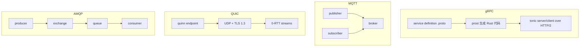
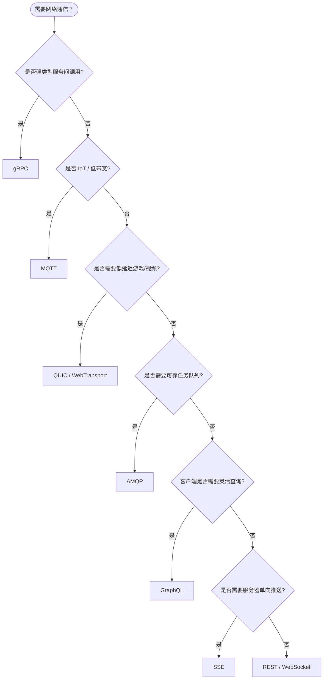

> **EN**: Advanced Network Protocols in Rust
> **Summary**: A canonical overview of gRPC, MQTT, QUIC, AMQP, GraphQL over HTTP, and Server-Sent Events, with selection guidance, architecture diagrams, and idiomatic Rust ecosystem examples.
> **Rust 版本**: 1.97.0+ (Edition 2024)
>
> **权威页地位**：本页为 Rust 生态中高级网络协议概念的 canonical 解释来源。
> **对应 crate 示例**：`crates/c10_networks/docs/09_rust_190_examples_part3_advanced_protocols.md` 现为摘要页，指向此处。
> **受众**: [进阶]
> **内容分级**: [综述级]
> **Bloom 层级**: L2-L4
> **权威来源**: 本文件为 `concept/` 权威页。
> **A/S/P 标记**: **A+S** — Application + Structure
> **前置概念**: [异步（Async）编程](../../03_advanced/01_async/01_async.md) · [并发模式](../../03_advanced/00_concurrency/03_concurrency_patterns.md) · [网络协议](../04_web_and_networking/07_network_protocols.md)
> **后置概念**: [高性能网络服务架构](../04_web_and_networking/08_high_performance_network_service_architecture.md) · [网络安全](02_network_security.md)

---

# Rust 高级网络协议概览

「Rust 高级网络协议概览」涉及协议分类与适用场景、协议栈架构图、gRPC、MQTT等15个方面，本节逐一说明其要点。

## 1. 协议分类与适用场景

| 协议 | 通信模型 | 最佳场景 | Rust 生态代表库 |
| :--- | :--- | :--- | :--- |
| **gRPC** | RPC / 双向流 | 微服务间高性能调用 | `tonic` + `prost` |
| **MQTT** | 发布/订阅 | IoT、低带宽、不可靠网络 | `rumqttc` |
| **QUIC** | 基于 UDP 的安全传输 | 实时游戏、0-RTT、多路复用 | `quinn` + `rustls` |
| **AMQP** | 消息队列 | 异步（Async）任务队列、企业集成 | `lapin` |
| **GraphQL** | 查询语言 over HTTP | 灵活 API 查询、减少过度获取 | `async-graphql`、`cynic` |
| **SSE** | 服务器推送 | 单向实时更新、日志流 | `tokio-stream`、`axum` |

## 2. 协议栈架构图



## 3. gRPC

gRPC 是基于 HTTP/2 和 Protocol Buffers 的高性能 RPC 框架，支持四种调用模式：

- **Unary RPC**：客户端一次请求，服务器一次响应。
- **Server Streaming RPC**：服务器返回多个响应。
- **Client Streaming RPC**：客户端发送多个请求，服务器返回一个响应。
- **Bidirectional Streaming RPC**：双向流式通信。

Rust 生态使用 `tonic` 作为服务端/客户端框架，`prost` 用于 Protocol Buffers 编解码。

```rust
use tonic::{transport::Server, Request, Response, Status};

pub mod hello_world {
    tonic::include_proto!("hello_world");
}

use hello_world::{greeter_server::{Greeter, GreeterServer}, HelloReply, HelloRequest};

#[derive(Default)]
pub struct MyGreeter;

#[tonic::async_trait]
impl Greeter for MyGreeter {
    async fn say_hello(
        &self,
        request: Request<HelloRequest>,
    ) -> Result<Response<HelloReply>, Status> {
        let reply = HelloReply {
            message: format!("Hello {}!", request.into_inner().name),
        };
        Ok(Response::new(reply))
    }
}
```

## 4. MQTT

MQTT 是轻量级发布/订阅协议，专为 IoT 设计：

- **QoS 0**：最多一次交付。
- **QoS 1**：至少一次交付。
- **QoS 2**：恰好一次交付。

Rust 中常用 `rumqttc` 实现客户端，支持自动重连、遗嘱消息、桥接等高级特性。

```rust
use rumqttc::{MqttOptions, Client, QoS};
use std::time::Duration;

let mut mqttoptions = MqttOptions::new("rumqtt-sync", "broker.hivemq.com", 1883);
mqttoptions.set_keep_alive(Duration::from_secs(5));

let (mut client, mut connection) = Client::new(mqttoptions, 10);
client.subscribe("hello/rust", QoS::AtMostOnce).unwrap();

for notification in connection.iter() {
    println!("{:?}", notification.unwrap());
}
```

## 5. QUIC

QUIC 是基于 UDP 的传输协议，内置 TLS 1.3，提供：

- 低连接建立延迟（0-RTT 或 1-RTT）。
- 内置多路复用，避免队头阻塞。
- 连接迁移能力。

Rust 中 `quinn` 是主流 QUIC 实现，常与 `rustls` 和 `rcgen` 配合使用。

```rust
use quinn::{Endpoint, ServerConfig};
use std::net::SocketAddr;
use std::sync::Arc;

async fn run_quic_server(addr: SocketAddr) -> anyhow::Result<()> {
    let server_config = configure_server()?;
    let endpoint = Endpoint::server(server_config, addr)?;
    while let Some incoming) = endpoint.accept().await {
        tokio::spawn(handle_connection(incoming.await?));
    }
    Ok(())
}
```

## 6. AMQP

AMQP 是面向消息中间件的应用层协议，支持：

- 队列、交换机、绑定等核心抽象。
- 生产者/消费者模式。
- 工作队列、发布/订阅、路由、主题等模式。

Rust 中 `lapin` 是常用的 AMQP 0.9.1 客户端。

```rust
use lapin::{Connection, ConnectionProperties, options::*, types::FieldTable};

let conn = Connection::connect("amqp://localhost:5672", ConnectionProperties::default()).await?;
let channel = conn.create_channel().await?;
channel.queue_declare("hello", QueueDeclareOptions::default(), FieldTable::default()).await?;
```

## 7. GraphQL over HTTP

GraphQL 允许客户端精确指定所需字段，减少过度获取。在 Rust 中可作为 HTTP 服务暴露，常与 `axum`、`async-graphql` 等库结合使用。

```rust
use async_graphql::{Schema, EmptyMutation, EmptySubscription, Object};

struct Query;

#[Object]
impl Query {
    async fn hello(&self, name: String) -> String {
        format!("Hello, {}!", name)
    }
}

type MySchema = Schema<Query, EmptyMutation, EmptySubscription>;
```

## 8. Server-Sent Events (SSE)

SSE 是服务器向客户端单向推送文本事件的 Web 标准，基于 HTTP：

- 自动重连。
- 事件 ID 与断点续传。
- 适合日志流、通知、实时仪表板。

```rust
use axum::{response::sse::{Event, Sse}, routing::get, Router};
use futures::stream::{self, Stream};
use std::convert::Infallible;

fn sse_stream() -> impl Stream<Item = Result<Event, Infallible>> {
    stream::iter(vec![Ok(Event::default().data("hello"))])
}

async fn handler() -> Sse<impl Stream<Item = Result<Event, Infallible>>> {
    Sse::new(sse_stream()).keep_alive(Default::default())
}
```

## 9. 技术选型决策树



## 10. 技术选型指南

| 场景 | 推荐协议 | 原因 |
| :--- | :--- | :--- |
| 微服务 RPC | gRPC | 高性能、类型安全、双向流 |
| IoT 设备通信 | MQTT | 轻量级、QoS 支持、低带宽 |
| 实时游戏 | QUIC | 低延迟、多路复用、0-RTT |
| 异步任务队列 | AMQP | 可靠消息传递、工作队列 |
| API 查询 | GraphQL | 灵活查询、减少过度获取 |
| 实时推送 | SSE / WebSocket | 服务器推送、实时更新 |

## 11. 学习路径

1. **初级**（1-2 周）
   - gRPC Unary RPC
   - MQTT 基础发布订阅
   - QUIC 基本通信
2. **中级**（2-3 周）
   - gRPC Streaming
   - MQTT QoS 和自动重连
   - QUIC 多路复用
   - AMQP 工作队列
3. **高级**（3-4 周）
   - gRPC 拦截器
   - MQTT 桥接
   - AMQP 高级模式
   - GraphQL 集成
   - SSE 实时通信
   - 微服务架构

## 12. 相关概念

- [并发模型](../../03_advanced/00_concurrency/01_concurrency.md)
- [异步编程](../../03_advanced/01_async/01_async.md)
- [并发模式](../../03_advanced/00_concurrency/03_concurrency_patterns.md)
- [网络协议](../04_web_and_networking/07_network_protocols.md)
- [设计模式](../03_design_patterns/01_patterns.md)
- [执行模型同构性：同步 · 异步 · 并发 · 并行](../../05_comparative/00_paradigms/02_execution_model_isomorphism.md)
- [高性能网络服务架构](../04_web_and_networking/08_high_performance_network_service_architecture.md)
- [网络安全](02_network_security.md)

---

> **L5 向下引用（Reference）**: 协议选型可结合 [Rust vs Go：线性所有权（Ownership） vs CSP 过程逻辑](../../05_comparative/01_systems_languages/03_rust_vs_go.md) 中的并发与通信模型对比进行理解。

---

> **权威来源**: [Rust Reference](https://doc.rust-lang.org/reference/), [The Rust Programming Language](https://doc.rust-lang.org/book/), [Rust Standard Library](https://doc.rust-lang.org/std/)

## 过渡段

> **过渡**: 从协议规范过渡到 Rust 类型，可以理解如何用类型状态机表达协议阶段。
>
> **过渡**: 从状态机实现过渡到 unsafe 边界，可以识别协议解析中需要手动管理的内存区域。
>
> **过渡**: 从实现过渡到模糊测试与验证，可以建立协议符合性的保障手段。
>

## 定理链

| 定理 | 前提 | 结论 |
|:---|:---|:---|
| 类型状态 ⟹ 更少运行时（Runtime）错误 | 将协议阶段编码为类型 | 非法状态转移被编译器拦截 |
| 零拷贝解析 ⟹ 高吞吐 | 直接引用（Reference）原始缓冲区 | 减少数据拷贝开销 |
| 属性测试 ⟹ 协议符合性 | 自动生成输入验证解析器 | 发现边界情况缺陷 |

---

## 国际权威参考 / International Authority References（P1 学术 · P2 生态）

> 依据 `AGENTS.md` §2「对齐网络国际化权威内容」补充：仅追加已验证可达的权威链接，不改动正文事实。

- **P2 生态/社区**: [docs.rs/tower — 生态权威 API 文档](https://docs.rs/tower) · [docs.rs/libp2p — 生态权威 API 文档](https://docs.rs/libp2p)
- **P1 学术/形式化**: [Hoare: Communicating Sequential Processes (CACM 1978)](https://dl.acm.org/doi/10.1145/359576.359585)
