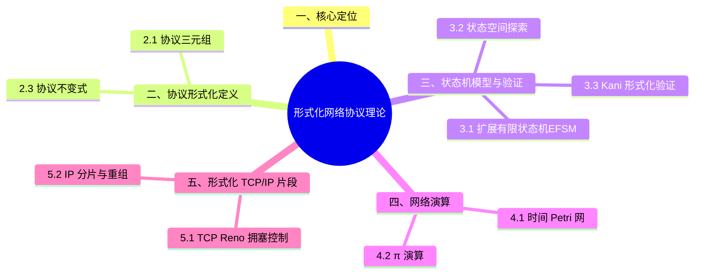

> **内容分级**: [专家级]
>

# 形式化网络协议理论
>
> **EN**: Formal Network Protocol Theory
> **Summary**: Modeling and verifying network protocols in Rust using finite state machines, invariants, model checking, process calculus, Petri nets, and phantom types to enforce protocol states at compile time.
>
> **受众**: [研究者]
> **层级**: L6 生态工程
> **Bloom 层级**: L4-L6
> **A/S/P 标记**: **S+P** — Structure + Procedure
> **双维定位**: T×Fml — 工具链与形式化验证
> **前置概念**: [网络协议](../04_web_and_networking/07_network_protocols.md) · [类型级编程](../../02_intermediate/01_generics/03_type_level_programming.md) · [Kani](../../04_formal/04_model_checking/09_kani.md)
> **后置概念**: [自定义协议实现](03_custom_protocol_implementation.md) · [网络安全](02_network_security.md)
>
> **主要来源**: [Rust Reference](https://doc.rust-lang.org/reference/introduction.html) · [The Rust Programming Language](https://doc.rust-lang.org/book/title-page.html) · [Kani 文档](https://model-checking.github.io/kani/) · [TCP RFC 793](https://tools.ietf.org/html/rfc793) · [RFC 8446 — TLS 1.3](https://tools.ietf.org/html/rfc8446)
>
> **Rust 版本**: 1.97.0+ (Edition 2024)
> **权威来源**: 本文件为 `concept/` 权威页。

---

> **来源**: 本文档由 `crates/*/docs/` 合规整改迁移而来。原始 crate 文档现为摘要页，指向本权威页：
> **权威来源**: [concept/06_ecosystem/12_networking/06_formal_network_protocol_theory.md](06_formal_network_protocol_theory.md)

---

## 一、核心定位

网络协议的正确性不仅依赖测试，还可以通过**形式化方法**在设计和实现阶段给出更强保证。Rust 的类型系统（Type System）与模型检查工具（如 Kani）为协议形式化提供了独特的工程路径：

- 用**有限状态机**精确描述协议生命周期（Lifetimes）。
- 用**不变式**约束合法状态集合。
- 用**模型检查**穷举状态空间。
- 用**进程演算 / Petri 网**建模并发与通信。
- 用**幽灵类型**在编译期强制协议状态转换合法。

---

## 二、协议形式化定义

协议形式化的基本框架是**协议三元组**：`〈消息语法, 状态机, 时序约束〉`。

- **消息语法**：帧格式与字段编码——Rust 中用 `#[repr(C)]` 结构体（Struct）或 `bitflags` 精确建模，类型大小由编译期 `const _: () = assert!(size_of::<Hdr>() == 20)` 钉死。
- **状态机**：如 TCP 的 11 状态（CLOSED→SYN_SENT→ESTABLISHED→…），Rust 直接映射为 `enum TcpState` + `fn step(self, event) -> (Self, Action)`——非法转换是无对应 `match` 臂的编译错误。
- **协议不变式**：如「ESTABLISHED 状态必有有效序列号窗口」，用类型编码（状态变体携带窗口字段）或 Kani 断言验证。

判定依据：协议实现的第一性产物应是状态机类型定义，而非处理函数——先建模再编码。

### 2.1 协议三元组

协议 $P$ 可形式化为三元组 $(S, M, T)$：

- $S$: 状态空间
- $M$: 消息空间
- $T: S \times M \rightarrow S \cup \{\text{Error}\}$: 状态转换函数

```rust
pub trait FormalProtocol {
    type State: Clone + PartialEq;
    type Message;
    type Error;

    fn initial_state(&self) -> Self::State;
    fn transition(&self, state: Self::State, msg: Self::Message) -> Result<Self::State, Self::Error>;
    fn is_terminal(&self, state: &Self::State) -> bool;
}
```

### 2.2 TCP 状态机示例

```rust
#[derive(Debug, Clone, Copy, PartialEq, Eq)]
pub enum TcpState {
    Closed, Listen, SynSent, SynReceived, Established,
    FinWait1, FinWait2, CloseWait, Closing, LastAck, TimeWait,
}

#[derive(Debug, Clone, Copy)]
pub enum TcpMessage { Syn, SynAck, Ack, Fin, FinAck, Data, Rst }

pub struct TcpProtocol;

impl FormalProtocol for TcpProtocol {
    type State = TcpState;
    type Message = TcpMessage;
    type Error = String;

    fn initial_state(&self) -> Self::State { TcpState::Closed }

    fn transition(&self, state: Self::State, msg: Self::Message) -> Result<Self::State, Self::Error> {
        use TcpMessage::*;
        use TcpState::*;
        match (state, msg) {
            (Closed, Syn) => Ok(SynSent),
            (Listen, Syn) => Ok(SynReceived),
            (SynSent, SynAck) => Ok(Established),
            (SynReceived, Ack) => Ok(Established),
            (Established, Fin) => Ok(CloseWait),
            (Established, Data) => Ok(Established),
            (FinWait1, Ack) => Ok(FinWait2),
            (FinWait2, Fin) => Ok(TimeWait),
            (CloseWait, Fin) => Ok(LastAck),
            (LastAck, Ack) => Ok(Closed),
            _ => Err(format!("illegal transition: {:?} -> {:?}", state, msg)),
        }
    }

    fn is_terminal(&self, state: &Self::State) -> bool {
        matches!(state, TcpState::Closed)
    }
}
```

### 2.3 协议不变式

不变式是在所有合法状态转换中保持为真的性质：

```rust,ignore
pub trait ProtocolInvariant<P: FormalProtocol> {
    fn check(&self, state: &P::State) -> bool;
    fn description(&self) -> &str;
}

/// TCP 序列号单调性不变式（简化示意）
pub struct TcpSeqMonotonic { last_seq: u32 }

impl TcpSeqMonotonic {
    pub fn new(initial_seq: u32) -> Self { Self { last_seq: initial_seq } }
    pub fn update(&mut self, seq: u32) -> bool {
        if seq >= self.last_seq {
            self.last_seq = seq;
            true
        } else {
            false
        }
    }
}
```

---

## 三、状态机模型与验证

协议验证的三级技术阶梯：

1. **扩展有限状态机（EFSM）**：在 FSM 上加变量与守卫条件（如序列号比较），是协议验证的标准模型；状态爆炸前兆是变量域无限——用抽象域（如只追踪模运算类）压缩。
2. **状态空间探索**：显式枚举（SPIN 风格）或有界模型检测；对 TCP 类协议，「两个端点状态机的乘积空间」是探索对象，典型不变量如「两端不能同时认为连接已建立而窗口不一致」。
3. **Kani 验证 Rust 实现**：把协议状态机的 `step` 函数作为 proof harness 对象，`kani::any::<Event>()` 生成任意事件序列（限界深度），验证 `assert!(invariant)`——这把「形式化模型」与「真实代码」合一，消除模型-实现漂移。

判定依据：设计期用 EFSM + TLA+/SPIN 探索；实现期用 Kani 在代码层复验关键不变量。

### 3.1 扩展有限状态机（EFSM）

```rust
pub struct Transition<S, M, C> {
    from: S,
    to: S,
    message: M,
    guard: fn(&C) -> bool,
    action: fn(&mut C),
}

pub struct ExtendedFsm<S, M, C> {
    transitions: Vec<Transition<S, M, C>>,
    context: C,
}

impl<S: Clone + PartialEq, M: Clone + PartialEq, C> ExtendedFsm<S, M, C> {
    pub fn transition(&mut self, current: S, message: M) -> Option<S> {
        for t in &self.transitions {
            if t.from == current && t.message == message && (t.guard)(&self.context) {
                (t.action)(&mut self.context);
                return Some(t.to.clone());
            }
        }
        None
    }
}
```

### 3.2 状态空间探索

```rust,ignore
use std::collections::{HashSet, VecDeque};

pub struct StateExplorer<P: FormalProtocol> { protocol: P, visited: HashSet<String> }

impl<P: FormalProtocol> StateExplorer<P>
where P::State: std::fmt::Debug + std::hash::Hash + Eq
{
    pub fn new(protocol: P) -> Self { Self { protocol, visited: HashSet::new() } }

    pub fn explore(&mut self, messages: &[P::Message]) -> Vec<P::State>
    where P::Message: Clone
    {
        let mut queue = VecDeque::new();
        let mut all = Vec::new();
        let initial = self.protocol.initial_state();
        queue.push_back(initial.clone());
        all.push(initial);

        while let Some(state) = queue.pop_front() {
            for msg in messages {
                if let Ok(next) = self.protocol.transition(state.clone(), msg.clone()) {
                    let key = format!("{:?}", next);
                    if self.visited.insert(key) {
                        all.push(next.clone());
                        queue.push_back(next);
                    }
                }
            }
        }
        all
    }

    pub fn verify_safety<F>(&mut self, messages: &[P::Message], property: F) -> bool
    where P::Message: Clone, F: Fn(&P::State) -> bool
    {
        self.explore(messages).iter().all(property)
    }
}
```

### 3.3 Kani 形式化验证

```rust,ignore
#[cfg(kani)]
#[kani::proof]
fn verify_tcp_transitions() {
    let protocol = TcpProtocol;
    let state: TcpState = kani::any();
    let msg: TcpMessage = kani::any();

    if let Ok(next) = protocol.transition(state, msg) {
        assert!(is_valid_transition(state, next));
    }
}
```

> **关键洞察**: Kani 可以枚举（Enum）状态与消息的所有组合，验证 `transition` 不会进入非法状态。对于协议实现，这比单元测试覆盖更全面。

---

## 四、网络演算

网络协议的形式化建模有两种互补演算，分别回答“系统会演化到哪些状态”与“进程如何交互”：

- **时间 Petri 网**：用位置、转移与令牌建模并发协议的状态机，附加时间区间后可分析时序性质——可达性分析能机械地发现死锁（无转移可触发）与活锁，代价是状态空间随并发度指数爆炸。本节给出 Rust 实现的 Petri 网执行器与死锁检测，可直接用于协议状态机的冒烟验证。
- **π 演算**：以通道传递通道名（高阶通信）为核心原语，适合建模动态拓扑的协议（连接建立后创建新会话通道）；其强/弱互模拟等价是“协议实现是否符合规约”的形式化定义。

工程用法：Petri 网做状态机穷尽检查，π 演算做交互正确性的纸面推理，二者与 Kani 的有界验证形成互补。

### 4.1 时间 Petri 网

Petri 网用**位置（Place）**、**转移（Transition）**和**令牌（Token）**建模并发系统：

```rust
#[derive(Debug, Clone)]
pub struct Place { id: usize, tokens: usize }

#[derive(Debug, Clone)]
pub struct NetTransition {
    id: usize,
    input_places: Vec<(usize, usize)>,  // (place_id, tokens_required)
    output_places: Vec<(usize, usize)>, // (place_id, tokens_produced)
}

#[derive(Debug, Clone)]
pub struct PetriNet { places: Vec<Place>, transitions: Vec<NetTransition> }

impl PetriNet {
    pub fn fire(&mut self, tid: usize) -> bool {
        let t = &self.transitions[tid];
        for &(pid, required) in &t.input_places {
            if self.places[pid].tokens < required { return false; }
        }
        for &(pid, required) in &t.input_places { self.places[pid].tokens -= required; }
        for &(pid, produced) in &t.output_places { self.places[pid].tokens += produced; }
        true
    }

    pub fn has_deadlock(&self) -> bool {
        self.transitions.iter().all(|t| {
            t.input_places.iter().any(|&(pid, required)| self.places[pid].tokens < required)
        })
    }
}
```

### 4.2 π 演算

π 演算用通道名传递通道名，适合建模动态网络拓扑：

```rust
#[derive(Debug, Clone)]
pub enum PiProcess {
    Nil,
    Send(String, String, Box<PiProcess>),
    Recv(String, Box<PiProcess>),
    Par(Box<PiProcess>, Box<PiProcess>),
    New(String, Box<PiProcess>),
}

impl PiProcess {
    pub fn reduce(&self) -> Option<Self> {
        match self {
            PiProcess::Par(p, q) => match (p.as_ref(), q.as_ref()) {
                (PiProcess::Send(ch1, data, cont1), PiProcess::Recv(ch2, cont2))
                    if ch1 == ch2 =>
                {
                    Some(PiProcess::Par(cont1.clone(), cont2.clone()))
                }
                _ => None,
            },
            _ => None,
        }
    }
}
```

---

## 五、形式化 TCP/IP 片段

把 TCP/IP 的片段形式化为可执行 Rust 模型，既能精确刻画协议行为，又能用测试/验证工具直接检验。本节选取两个最具教学价值的片段：

- **TCP Reno 拥塞控制**：用 `CongestionState` 枚举（Enum）（慢启动/拥塞避免/快速恢复）+ `cwnd`/`ssthresh` 状态机完整编码 Reno 算法——AIMD（加性增、乘性减）的每个分支都对应可测试的状态转移，重复 ACK 计数达到 3 触发快速重传的逻辑一目了然。
- **IP 分片与重组**：MTU 超过时的分片（标志位 + 片偏移）与接收端按偏移重组、超时丢弃不完整报文的过程，是自然适合用 `BTreeMap<offset, bytes>` 建模的协议片段。

这些模型可作为协议实现的“可执行规约”：真实实现与模型跑同一组输入，比对状态转移序列。

### 5.1 TCP Reno 拥塞控制

```rust
#[derive(Debug, Clone, Copy)]
pub enum CongestionState { SlowStart, CongestionAvoidance, FastRecovery }

pub struct TcpReno { cwnd: f64, ssthresh: f64, state: CongestionState, dup_acks: u32 }

impl TcpReno {
    pub fn new(cwnd: f64, ssthresh: f64) -> Self {
        Self { cwnd, ssthresh, state: CongestionState::SlowStart, dup_acks: 0 }
    }

    pub fn on_ack(&mut self, is_dup: bool) {
        if is_dup {
            self.dup_acks += 1;
            if self.dup_acks == 3 {
                self.ssthresh = self.cwnd / 2.0;
                self.cwnd = self.ssthresh + 3.0;
                self.state = CongestionState::FastRecovery;
            } else if matches!(self.state, CongestionState::FastRecovery) {
                self.cwnd += 1.0;
            }
        } else {
            self.dup_acks = 0;
            match self.state {
                CongestionState::SlowStart => {
                    self.cwnd += 1.0;
                    if self.cwnd >= self.ssthresh {
                        self.state = CongestionState::CongestionAvoidance;
                    }
                }
                CongestionState::CongestionAvoidance => self.cwnd += 1.0 / self.cwnd,
                CongestionState::FastRecovery => {
                    self.cwnd = self.ssthresh;
                    self.state = CongestionState::CongestionAvoidance;
                }
            }
        }
    }

    pub fn on_timeout(&mut self) {
        self.ssthresh = self.cwnd / 2.0;
        self.cwnd = 1.0;
        self.state = CongestionState::SlowStart;
        self.dup_acks = 0;
    }

    pub fn verify_invariants(&self) -> bool {
        self.cwnd > 0.0
            && self.ssthresh >= 1.0
            && (!matches!(self.state, CongestionState::FastRecovery) || self.cwnd >= self.ssthresh)
    }
}
```

### 5.2 IP 分片与重组

```rust
#[derive(Debug, Clone)]
pub struct Fragment { id: u16, offset: u16, more_fragments: bool, data: Vec<u8> }

pub struct IpFragmentation { mtu: usize }

impl IpFragmentation {
    pub fn fragment(&self, payload: &[u8], id: u16) -> Vec<Fragment> {
        let header_size = 20;
        let max_fragment_size = ((self.mtu - header_size) / 8) * 8;
        payload
            .chunks(max_fragment_size)
            .enumerate()
            .map(|(i, chunk)| Fragment {
                id,
                offset: (i * max_fragment_size / 8) as u16,
                more_fragments: (i + 1) * max_fragment_size < payload.len(),
                data: chunk.to_vec(),
            })
            .collect()
    }

    pub fn reassemble(&self, fragments: &mut [Fragment]) -> Option<Vec<u8>> {
        if fragments.is_empty() { return None; }
        fragments.sort_by_key(|f| f.offset);
        for window in fragments.windows(2) {
            let expected = window[0].offset + (window[0].data.len() / 8) as u16;
            if window[1].offset != expected { return None; }
        }
        Some(fragments.iter().flat_map(|f| f.data.clone()).collect())
    }
}
```

---

## 六、协议组合与 Rust 类型系统验证

协议栈组合与类型系统（Type System）验证是 Rust 网络编程的独特优势：

- **协议栈组合**：各层（Eth/IP/TCP/TLS/App）建模为 `trait Layer { type Upper; type Lower; }` 的关联类型链，层间帧的解封装用零拷贝切片（Slice）（`&[u8]` 逐层剥离头部）——类型参数保证「TLS 记录只能出现在 TCP 流之上」这类栈结构约束。
- **幽灵类型强制协议状态**：`struct Connection<S: ProtoState>` + `PhantomData<S>`，握手各阶段消费旧类型返回新类型（`Connection<SynSent> → Connection<Established>`）；「在未握手连接上发送数据」因无对应方法而编译失败——这是会话类型在 Rust 中的工程化落地。

判定依据：协议 bug 若源于「状态不符的操作」（如重复握手、提前发送），幽灵类型重构可将其整类消灭；运行时（Runtime） `assert_eq!(self.state, ...)` 检查是应被类型化替代的信号。

### 6.1 协议栈组合

```rust
pub trait ProtocolLayer {
    type UpperData;
    type LowerData;
    type Error;

    fn encapsulate(&self, upper: Self::UpperData) -> Result<Self::LowerData, Self::Error>;
    fn decapsulate(&self, lower: Self::LowerData) -> Result<Self::UpperData, Self::Error>;
}

pub struct ProtocolStack<L1, L2>
where
    L1: ProtocolLayer,
    L2: ProtocolLayer<UpperData = L1::LowerData>,
{
    upper: L1,
    lower: L2,
}

impl<L1, L2> ProtocolStack<L1, L2>
where
    L1: ProtocolLayer,
    L2: ProtocolLayer<UpperData = L1::LowerData>,
{
    pub fn new(upper: L1, lower: L2) -> Self { Self { upper, lower } }

    pub fn send(&self, data: L1::UpperData) -> Result<L2::LowerData, L1::Error> {
        let intermediate = self.upper.encapsulate(data)?;
        self.lower.encapsulate(intermediate).map_err(|_| unreachable!())
    }
}
```

### 6.2 幽灵类型强制协议状态

```rust
use std::marker::PhantomData;

pub mod state {
    pub struct Closed;
    pub struct Connected;
}

pub struct TypedConnection<S> {
    socket: std::net::TcpStream,
    _state: PhantomData<S>,
}

impl TypedConnection<state::Closed> {
    pub fn connect(addr: &str) -> std::io::Result<TypedConnection<state::Connected>> {
        Ok(TypedConnection {
            socket: std::net::TcpStream::connect(addr)?,
            _state: PhantomData,
        })
    }
}

impl TypedConnection<state::Connected> {
    pub fn send(&mut self, data: &[u8]) -> std::io::Result<()> {
        use std::io::Write;
        self.socket.write_all(data)
    }
}
```

> **关键洞察**: `TypedConnection<state::Closed>` 没有 `send` 方法，因此以下代码在编译期失败：
>
> ```rust,compile_fail
> let conn = TypedConnection::<state::Closed>::connect("127.0.0.1:80")?;
> conn.send(b"data"); // 错误：Closed 状态未实现 send
> ```
>
> 这是 Rust 类型系统（Type System）对协议状态机的最强保证形式。

---

## 七、HTTP 语义示例

```rust
use std::collections::HashMap;

#[derive(Debug, Clone)]
pub struct HttpRequest { method: String, path: String, headers: HashMap<String, String>, body: Vec<u8> }

#[derive(Debug, Clone)]
pub struct HttpResponse { status: u16, headers: HashMap<String, String>, body: Vec<u8> }

pub struct SimpleHttpSemantics;

impl SimpleHttpSemantics {
    pub fn eval(req: HttpRequest, mut state: HashMap<String, Vec<u8>>) -> (HttpResponse, HashMap<String, Vec<u8>>) {
        let resp = match req.method.as_str() {
            "GET" => {
                let body = state.get(&req.path).cloned().unwrap_or_default();
                HttpResponse { status: if body.is_empty() { 404 } else { 200 }, headers: HashMap::new(), body }
            }
            "POST" | "PUT" => {
                state.insert(req.path.clone(), req.body.clone());
                HttpResponse { status: if req.method == "POST" { 201 } else { 200 }, headers: HashMap::new(), body: Vec::new() }
            }
            "DELETE" => {
                state.remove(&req.path);
                HttpResponse { status: 204, headers: HashMap::new(), body: Vec::new() }
            }
            _ => HttpResponse { status: 405, headers: HashMap::new(), body: Vec::new() },
        };
        (resp, state)
    }

    pub fn is_idempotent(method: &str) -> bool {
        matches!(method, "GET" | "HEAD" | "PUT" | "DELETE" | "OPTIONS")
    }

    pub fn is_safe(method: &str) -> bool {
        matches!(method, "GET" | "HEAD" | "OPTIONS")
    }
}
```

---

## 八、选择形式化方法

| 目标 | 方法 | Rust 工具/技术 |
|:---|:---|:---|
| 协议规范正确性 | 协议三元组 + 不变式 | trait + 单元测试 |
| 状态空间验证 | 模型检查 | 手写 BFS / Kani |
| 并发通信语义 | π 演算 / Petri 网 | 手写解释器 |
| 类型安全保证 | 类型状态 / 幽灵类型 | `PhantomData` |
| 端到端正确性 | 组合验证 | 协议栈 trait + 不变式检查 |

---

> **权威来源**: [Rust Reference](https://doc.rust-lang.org/reference/introduction.html) · [The Rust Programming Language](https://doc.rust-lang.org/book/title-page.html) · [Kani 文档](https://model-checking.github.io/kani/) · [TCP RFC 793](https://tools.ietf.org/html/rfc793) · [RFC 8446](https://tools.ietf.org/html/rfc8446)
>
> **权威来源对齐变更日志**: 2026-07-09 由 `crates/c10_networks/docs/tier_04_advanced/01_formal_network_protocol_theory.md` 按 AGENTS.md §6.4 迁移至此

**文档版本**: 1.0
**最后更新**: 2026-07-09
**状态**: ✅ 权威来源对齐完成

## 过渡段

> **过渡**: 从非形式化规范过渡到形式模型，可以消除自然语言中的歧义与遗漏。
>
> **过渡**: 从形式模型过渡到 Rust 实现，可以建立模型与代码之间的精化关系。
>
> **过渡**: 从实现过渡到模型检查与证明，可以验证关键协议属性的正确性。
>

## 定理链

| 定理 | 前提 | 结论 |
|:---|:---|:---|
| 形式模型 ⟹ 无歧义规范 | 使用状态机或进程代数 | 精确描述协议行为 |
| 精化关系 ⟹ 实现正确性 | 证明代码满足模型 | 降低实现偏离规范的风险 |
| 模型检查 ⟹ 缺陷发现 | 自动遍历状态空间 | 暴露罕见交互路径中的 bug |

---

## 相关概念

- [Safety Boundaries](../../05_comparative/03_domain_comparisons/01_safety_boundaries.md) — 协议实现中安全/不安全边界的跨语言对比视角
- [Rust vs C++](../../05_comparative/01_systems_languages/01_rust_vs_cpp.md) — 协议栈实现在 C++ 与 Rust 中的类型约束差异

---

## 国际权威参考 / International Authority References（P1 学术 · P2 生态）

> 依据 `AGENTS.md` §2「对齐网络国际化权威内容」补充：仅追加已验证可达的权威链接，不改动正文事实。

- **P1 学术/形式化**: [RustHornBelt: A Semantic Foundation for Functional Verification of Rust Programs (PLDI 2022)](https://dl.acm.org/doi/10.1145/3519939.3523704) · [Aeneas: Rust Verification by Functional Translation (arXiv:2206.07185)](https://arxiv.org/abs/2206.07185)
- **P2 生态/社区**: [model-checking/kani — 模型检查器](https://github.com/model-checking/kani) · [model-checking/verify-rust-std](https://github.com/model-checking/verify-rust-std)

## ⚠️ 反例与陷阱

本节以协议状态机 `match` 不穷尽为反例，展示穷尽性检查如何强制处理新增状态。

### 反例：协议新增状态后 `match` 不穷尽（rustc 1.97.0 实测）

协议状态机扩展时，编译器强制处理新变体：

```rust,compile_fail,E0004
enum State { Init, Syn, Established, Closed }

fn next(s: State) -> State {
    match s {
        State::Init => State::Syn,
        State::Syn => State::Established,
        State::Established => State::Closed,
        // ❌ 缺少 State::Closed 分支
    }
}
```

**错误**：`E0004 non-exhaustive patterns: State::Closed not covered`。

### ✅ 修正：补全终态分支

```rust
enum State { Init, Syn, Established, Closed }

fn next(s: State) -> State {
    match s {
        State::Init => State::Syn,
        State::Syn => State::Established,
        State::Established => State::Closed,
        State::Closed => State::Closed, // 终态自循环
    }
}
```

## 🧭 思维导图（Mindmap）


