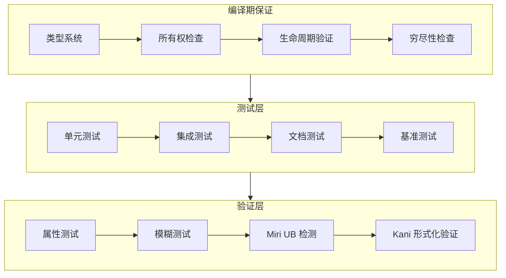
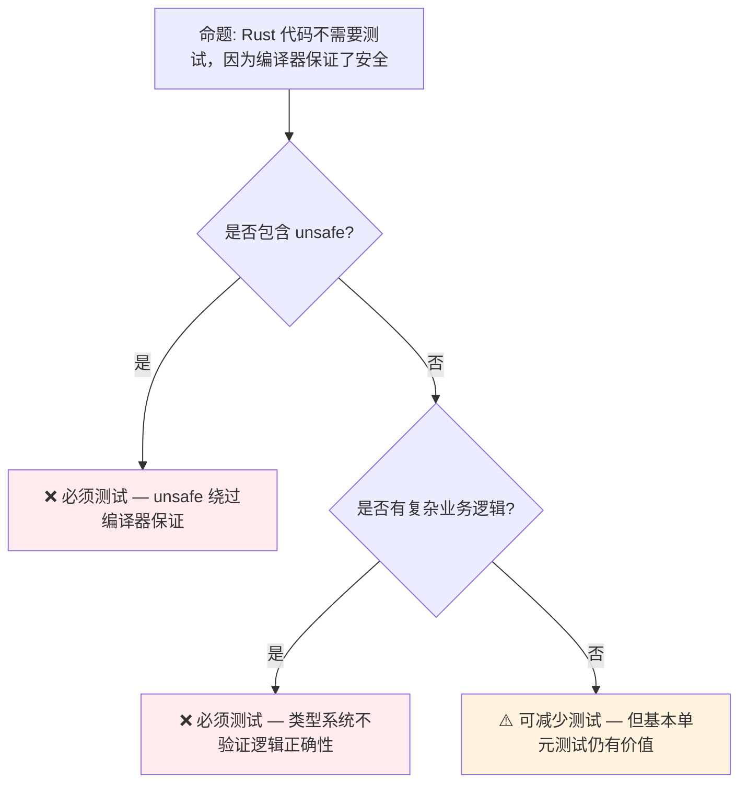

# Rust 测试策略：从单元测试到属性验证

> **Bloom 层级**: 应用 → 分析
> **定位**: 系统分析 Rust 生态中的**测试方法论**——从内置测试框架到属性测试（proptest）、模糊测试（cargo-fuzz）、Miri 验证和形式化测试（Kani），构建多层次的质量保证体系。
> **前置概念**: [Toolchain](./01_toolchain.md) · [Unsafe](../03_advanced/03_unsafe.md) · [FFI](../03_advanced/05_rust_ffi.md)
> **后置概念**: [Formal Methods](../07_future/02_formal_methods.md)

---

> **来源**: [Rust Book — Testing](https://doc.rust-lang.org/book/ch11-00-testing.html) ·
> [Cargo Test Documentation](https://doc.rust-lang.org/cargo/commands/cargo-test.html) ·
> [proptest Book](https://altsysrq.github.io/proptest-book/intro.html) ·
> [Miri Documentation](https://github.com/rust-lang/miri) ·
> [Kani Documentation](https://model-checking.github.io/kani/)

## 📑 目录
>
> [来源: [Rust Reference](https://doc.rust-lang.org/reference/)]
>
> [来源: [TRPL]]

- [Rust 测试策略：从单元测试到属性验证](#rust-测试策略从单元测试到属性验证)
  - [📑 目录](#-目录)
  - [一、核心概念](#一核心概念)
    - [1.1 Rust 测试生态全景](#11-rust-测试生态全景)
    - [1.2 测试金字塔的 Rust 映射](#12-测试金字塔的-rust-映射)
    - [1.3 编译期即测试](#13-编译期即测试)
  - [二、技术细节](#二技术细节)
    - [2.1 内置测试框架](#21-内置测试框架)
    - [2.2 属性测试与模糊测试](#22-属性测试与模糊测试)
    - [2.3 Miri：未定义行为检测](#23-miri未定义行为检测)
  - [三、分层测试策略](#三分层测试策略)
  - [四、反命题与边界分析](#四反命题与边界分析)
    - [4.1 反命题树](#41-反命题树)
    - [4.2 边界极限](#42-边界极限)
  - [五、CI/CD 集成](#五cicd-集成)
  - [六、来源与延伸阅读](#六来源与延伸阅读)
  - [相关概念文件](#相关概念文件)

---

## 一、核心概念
>
> [来源: [Rust Reference](https://doc.rust-lang.org/reference/)]
>
> [来源: [Rust Reference](https://doc.rust-lang.org/reference/)]

### 1.1 Rust 测试生态全景
> **[来源: [Rust Reference](https://doc.rust-lang.org/reference/)]**



> **认知功能**: 此图展示 Rust **质量保证的分层体系**——从编译期保证到运行时测试再到形式化验证，形成纵深防御。
> [来源: [TRPL](https://doc.rust-lang.org/book/)]
> **使用建议**: 利用 Rust 的编译期保证减少运行时测试负担；对 unsafe 代码使用 Miri；对关键算法使用 Kani。
> **关键洞察**: Rust 的**类型系统本身就是测试**——许多在其他语言中需要单元测试保证的属性（如空指针安全、数据竞争自由），在 Rust 中由编译器自动保证。
> [来源: [Rust Book — Testing](https://doc.rust-lang.org/book/ch11-00-testing.html)]

---

### 1.2 测试金字塔的 Rust 映射
> **[来源: [The Rust Programming Language](https://doc.rust-lang.org/book/)]**

```text
传统测试金字塔 vs Rust:

  传统语言（Java/Python/JS）:
    ┌─────────────┐
    │  E2E 测试   │  ← 少量，慢
    ├─────────────┤
    │ 集成测试    │  ← 中等
    ├─────────────┤
    │  单元测试   │  ← 大量，快
    └─────────────┘
> [来源: [TRPL](https://doc.rust-lang.org/book/)]

  Rust（编译期 + 测试）:
    ┌─────────────┐
    │  Kani/Miri  │  ← 形式化/UB 检测
    ├─────────────┤
    │ 属性/模糊   │  ← 边界探索
    ├─────────────┤
    │  E2E 测试   │  ← 端到端
    ├─────────────┤
    │ 集成测试    │  ← 模块交互
    ├─────────────┤
    │  单元测试   │  ← 函数级
    ├─────────────┤
    │  类型系统   │  ← 编译期（Rust 特有层）
    └─────────────┘
> [来源: [TRPL](https://doc.rust-lang.org/book/)]

Rust 的额外优势:
  - 类型系统消除了 70%+ 的传统单元测试需求
  - unsafe 代码需要 Miri/Kani 等额外验证层
  - 文档测试（doctest）确保示例代码始终可编译
```

> **测试洞察**: Rust 开发者可以**减少传统单元测试的数量**，因为编译器证明了大量安全属性。但需要对 unsafe、FFI 和并发代码投入更多验证资源。
> [来源: [Rust Testing Best Practices](https://doc.rust-lang.org/rustc/tests/index.html)]

---

### 1.3 编译期即测试
> **[来源: [Rust Standard Library](https://doc.rust-lang.org/std/)]**

```rust,ignore
// 在 Rust 中，以下代码在编译期就证明了安全属性:

fn get_first(items: &[i32]) -> Option<&i32> {
    items.first()  // 编译器保证: 不会越界访问
}

fn process(data: &mut Vec<i32>) {
    data.push(1);  // 编译器保证: 独占访问，无数据竞争
}

fn share(data: Arc<Mutex<Vec<i32>>>) {
    let mut guard = data.lock().unwrap();
    guard.push(1);  // 编译器保证: 线程安全
}

// 这些在其他语言中需要测试保证的属性:
// - 空指针检查
// - 数组越界
// - 数据竞争
// - use-after-free
// 在 Rust 中由编译器自动验证
```

> **编译期测试**: Rust 的**零成本抽象**不仅是性能承诺，也是**测试承诺**——编译期验证的属性在运行时无需重复测试。
> [来源: [TRPL — Ownership](https://doc.rust-lang.org/book/ch04-00-understanding-ownership.html)]

---

## 二、技术细节
>
> [来源: [Rust Reference](https://doc.rust-lang.org/reference/)]
>
> [来源: [TRPL]]

### 2.1 内置测试框架
> **[来源: [Rustonomicon](https://doc.rust-lang.org/nomicon/)]**

```rust,ignore
// 单元测试（同一文件）
#[cfg(test)]
mod tests {
    use super::*;

    #[test]
    fn test_addition() {
        assert_eq!(add(2, 3), 5);
    }

    #[test]
    #[should_panic(expected = "overflow")]
    fn test_overflow() {
        let _ = u8::MAX + 1;  // 应 panic
    }

    #[test]
    fn test_result() -> Result<(), String> {
        if add(2, 2) == 4 {
            Ok(())
        } else {
            Err("math broken".to_string())
        }
    }
}

// 文档测试（嵌入文档）
/// ```
/// assert_eq!(my_crate::add(2, 2), 4);
/// ```
pub fn add(a: i32, b: i32) -> i32 { a + b }

// 集成测试（tests/ 目录）
// tests/integration_test.rs:
use my_crate;

#[test]
fn test_public_api() {
    assert_eq!(my_crate::add(2, 2), 4);
}
```

> **测试框架要点**:
>
> 1. `#[cfg(test)]` 模块：单元测试，可访问私有函数
> 2. `tests/` 目录：集成测试，只能访问 public API
> 3. 文档测试：确保代码示例始终正确
> 4. `#[bench]`（nightly）：基准测试
> [来源: [Cargo Test Documentation](https://doc.rust-lang.org/cargo/commands/cargo-test.html)]

---

### 2.2 属性测试与模糊测试
> **[来源: [Rust By Example](https://doc.rust-lang.org/rust-by-example/)]**

```rust,ignore
// proptest: 属性测试
use proptest::prelude::*;

proptest! {
    #[test]
    fn test_add_commutative(a in 0..1000i32, b in 0..1000i32) {
        // 测试性质: 加法交换律
        assert_eq!(add(a, b), add(b, a));
    }

    #[test]
    fn test_reverse_reverse(a in "[a-z]*") {
        // 测试性质: 反转两次等于原值
        let reversed: String = a.chars().rev().collect();
        let double_reversed: String = reversed.chars().rev().collect();
        assert_eq!(a, double_reversed);
    }
}

// cargo-fuzz: 模糊测试
// fuzz_targets/my_target.rs:
#![no_main]
use libfuzzer_sys::fuzz_target;

fuzz_target!(|data: &[u8]| {
    let _ = my_parser::parse(data);  // 不应 panic 或 crash
});
```

> **属性测试 vs 模糊测试**:
>
> - **属性测试**（proptest）：基于性质定义，生成随机输入验证不变量
> - **模糊测试**（cargo-fuzz）：无特定性质，生成随机/变异输入寻找 crash
> - **互补使用**：属性测试验证设计意图，模糊测试发现未预见的边缘情况
> [来源: [proptest Book](https://altsysrq.github.io/proptest-book/intro.html)] · [cargo-fuzz](https://github.com/rust-fuzz/cargo-fuzz)

---

### 2.3 Miri：未定义行为检测
> **[来源: [Rust Cookbook](https://rust-lang-nursery.github.io/rust-cookbook/)]**

```text
Miri 的核心能力:
├── 检测未定义行为（UB）
│   ├── 使用未初始化内存
│   ├── 悬空指针解引用
│   ├── 数据竞争
│   ├── 违反别名规则
│   └── 类型混淆（type punning）
├── 验证 unsafe 代码契约
├── 检查内存泄漏
└── 模拟不同平台的行为差异

Miri 的局限:
├── 运行极慢（解释执行）
├── 无法检测所有 UB（仅覆盖已实现的检查）
├── 不保证"无 Miri 报错 = 无 UB"
└── 需要 nightly Rust

使用场景:
├── 任何包含 unsafe 的代码库
├── FFI 边界代码
├── 自定义数据结构（尤其是涉及原始指针的）
└── 并发原语实现
```

> **Miri 定位**: Miri 是 Rust unsafe 代码的**动态分析工具**——它不能证明代码安全，但可以发现许多常见的 UB 模式。
> [来源: [Miri Documentation](https://github.com/rust-lang/miri)]

---

## 三、分层测试策略
>
> [来源: [Rust Reference](https://doc.rust-lang.org/reference/)]
>
> [来源: [TRPL]]

| 层级 | 工具/方法 | 目标 | 频率 | 成本 |
|:---|:---|:---|:---:|:---:|
| **L0: 编译期** | `rustc` + `clippy` | 类型安全、所有权、lint | 每次编译 | 零 |
| **L1: 单元测试** | `cargo test` | 函数正确性 | 每次提交 | 低 |
| **L2: 集成测试** | `tests/` 目录 | 模块交互 | 每次提交 | 中 |
| **L3: 文档测试** | `cargo test --doc` | 示例正确性 | 每次提交 | 低 |
| **L4: 属性测试** | `proptest` | 不变量验证 | 每日构建 | 中 |
| **L5: 模糊测试** | `cargo-fuzz` | Crash 发现 | 每周/发布前 | 高 |
| **L6: Miri** | `cargo miri test` | UB 检测 | 关键 PR / 发布前 | 很高 |
| **L7: Kani** | `cargo kani` | 形式化验证 | 关键模块 | 极高 |

> **策略建议**: 所有项目应覆盖 L0-L3；包含 unsafe 的项目必须覆盖 L6；安全关键项目应覆盖 L7。
> [来源: [Rust Testing Guide](https://doc.rust-lang.org/rustc/tests/index.html)]

---

## 四、反命题与边界分析
>
> [来源: [Rust Reference](https://doc.rust-lang.org/reference/)]
>
> [来源: [Rust Reference](https://doc.rust-lang.org/reference/)]

### 4.1 反命题树
> **[来源: [crates.io](https://crates.io/)]**



> **认知功能**: 此决策树评估 Rust 代码的测试需求。核心判断标准是**unsafe 使用**和**业务逻辑复杂度**。
> [来源: [TRPL](https://doc.rust-lang.org/book/)]
> **使用建议**: Rust 的类型系统保证**内存安全**和**线程安全**，但不保证**逻辑正确性**。业务逻辑、算法实现、边界条件仍需充分测试。
> **关键洞察**: Rust 的编译期保证减少了**安全相关测试**的需求，但不减少**功能正确性测试**的需求。
> [来源: 💡 原创分析]

---

### 4.2 边界极限
> **[来源: [docs.rs](https://docs.rs/)]**

```text
边界 1: 编译器不验证的属性
├── 算法正确性（排序是否正确、计算是否准确）
├── 业务规则（价格计算、权限检查）
├── 性能特征（时间/空间复杂度）
├── 用户体验（错误信息友好性）
└── 这些都需要传统测试覆盖

边界 2: unsafe 的验证缺口
├── Miri 不能检测所有 UB（仅覆盖已实现的检查）
├── 某些 UB 是平台相关的（如对齐要求）
├── 并发 UB（数据竞争）检测依赖 happens-before 关系的完整建模
└── 形式化验证（Kani）覆盖范围受限于模型规模和复杂度

边界 3: 测试的经济性
├── Miri 运行速度比原生慢 100-1000x
├── Kani 验证时间随状态空间指数增长
├── 模糊测试可能需要数小时才能发现边缘 bug
└── 需要在测试深度和反馈速度之间权衡

边界 4: 外部依赖
├── 测试通常需要 mock 外部服务
├── Rust 的 trait 系统使 mock 相对容易
├── 但 FFI 和系统调用的测试仍然困难
```

> **边界要点**: Rust 的测试策略是**分层互补**的——没有单一工具能覆盖所有质量保证需求。编译期保证 + 传统测试 + 动态分析 + 形式化验证的组合才能提供全面覆盖。
> [来源: [Rust Quality Assurance Practices](https://doc.rust-lang.org/rustc/tests/index.html)]

---

## 五、CI/CD 集成
>
> [来源: [Rust Reference](https://doc.rust-lang.org/reference/)]
>
> [来源: [TRPL]]

```yaml
# .github/workflows/test.yml 示例
name: Test Suite
on: [push, pull_request]
jobs:
  test:
    runs-on: ubuntu-latest
    steps:
      - uses: actions/checkout@v4
      - uses: dtolnay/rust-action@stable

      # L0: 编译期检查
      - run: cargo clippy --all-targets -- -D warnings

      # L1-L3: 单元/集成/文档测试
      - run: cargo test --all-targets

      # L4: 属性测试（可选）
      # - run: cargo test --features proptest

      # L5: 模糊测试（仅在发布前）
      # - run: cargo fuzz run my_target -- -max_total_time=300

      # L6: Miri（nightly，unsafe 代码）
      # - run: rustup run nightly cargo miri test

      # L7: Kani（关键模块）
      # - run: cargo kani --harness my_harness
```

> **CI 建议**: 将测试分层集成到 CI 中——快速检查（clippy + unit test）在每次提交运行；深度检查（Miri/Kani）在发布前或关键 PR 时运行。
> [来源: [GitHub Actions for Rust](https://github.com/actions-rs)]

---

## 六、来源与延伸阅读
>
> [来源: [Rust Reference](https://doc.rust-lang.org/reference/)]
>
> [来源: [TRPL]]

| 来源 | 可信度 | 说明 |
|:---|:---:|:---|
| [Rust Book — Testing](https://doc.rust-lang.org/book/ch11-00-testing.html) | ✅ 一级 | 官方测试指南 |
| [Cargo Test](https://doc.rust-lang.org/cargo/commands/cargo-test.html) | ✅ 一级 | Cargo 测试命令 |
| [proptest Book](https://altsysrq.github.io/proptest-book/intro.html) | ✅ 一级 | 属性测试框架 |
| [Miri](https://github.com/rust-lang/miri) | ✅ 一级 | UB 检测工具 |
| [Kani](https://model-checking.github.io/kani/) | ✅ 一级 | 形式化验证工具 |
| [cargo-fuzz](https://github.com/rust-fuzz/cargo-fuzz) | ✅ 一级 | 模糊测试工具 |

---

## 相关概念文件
>
> [来源: [Rust Reference](https://doc.rust-lang.org/reference/)]
>
> [来源: [Rust Reference](https://doc.rust-lang.org/reference/)]

- [Toolchain](./01_toolchain.md) — Rust 工具链
- [Unsafe](../03_advanced/03_unsafe.md) — unsafe Rust
- [FFI](../03_advanced/05_rust_ffi.md) — FFI 跨语言交互
- [Formal Methods](../07_future/02_formal_methods.md) — 形式化方法工业化

---

> **权威来源**: [Rust Reference](https://doc.rust-lang.org/reference/), [The Rust Programming Language](https://doc.rust-lang.org/book/), [Rustonomicon](https://doc.rust-lang.org/nomicon/)
>
> **权威来源对齐变更日志**: 2026-05-21 创建，对齐 Rust 1.95.0+ (Edition 2024)

**文档版本**: 1.0
**对应 Rust 版本**: 1.95.0+ (Edition 2024)
**最后更新**: 2026-05-21
**状态**: ✅ 概念文件创建完成

---

## 权威来源索引

> **[来源: [crates.io](https://crates.io/)]**
>
> **[来源: [Rust By Example](https://doc.rust-lang.org/rust-by-example/)]**
>
> **[来源: [Rust Test Documentation](https://doc.rust-lang.org/rustc/tests/index.html)]**
>
> **[来源: [Criterion.rs](https://bheisler.github.io/criterion.rs/book/)]**
>
> **[来源: [Rust Reference](https://doc.rust-lang.org/reference/)]**
>
> **[来源: [The Rust Programming Language](https://doc.rust-lang.org/book/)]**
>
> **[来源: [Rust Standard Library](https://doc.rust-lang.org/std/)]**
>

---

> **[来源: [Rust Reference](https://doc.rust-lang.org/reference/)]**

> **[来源: [The Rust Programming Language](https://doc.rust-lang.org/book/)]**

> **[来源: [Rust Standard Library](https://doc.rust-lang.org/std/)]**

> **[来源: [Rustonomicon](https://doc.rust-lang.org/nomicon/)]**

> **[来源: [Rust By Example](https://doc.rust-lang.org/rust-by-example/)]**

> **[来源: [Rust Cookbook](https://rust-lang-nursery.github.io/rust-cookbook/)]**

> **[来源: [crates.io](https://crates.io/)]**

> **[来源: [docs.rs](https://docs.rs/)]**

> **[来源: [This Week in Rust](https://this-week-in-rust.org/)]**

> **[来源: [Rust RFCs](https://rust-lang.github.io/rfcs/)]**

> **[来源: [Rust Reference](https://doc.rust-lang.org/reference/)]**

> **[来源: [The Rust Programming Language](https://doc.rust-lang.org/book/)]**

> **[来源: [Rust Standard Library](https://doc.rust-lang.org/std/)]**

> **[来源: [Rustonomicon](https://doc.rust-lang.org/nomicon/)]**

> **[来源: [Rust By Example](https://doc.rust-lang.org/rust-by-example/)]**

> **[来源: [Rust Cookbook](https://rust-lang-nursery.github.io/rust-cookbook/)]**

> **[来源: [crates.io](https://crates.io/)]**

> **[来源: [docs.rs](https://docs.rs/)]**

> **[来源: [This Week in Rust](https://this-week-in-rust.org/)]**

> **[来源: [Rust RFCs](https://rust-lang.github.io/rfcs/)]**

> **[来源: [Rust Reference](https://doc.rust-lang.org/reference/)]**

> **[来源: [The Rust Programming Language](https://doc.rust-lang.org/book/)]**

> **[来源: [Rust Standard Library](https://doc.rust-lang.org/std/)]**

> **[来源: [Rustonomicon](https://doc.rust-lang.org/nomicon/)]**

> **[来源: [Rust By Example](https://doc.rust-lang.org/rust-by-example/)]**

> **[来源: [Rust Cookbook](https://rust-lang-nursery.github.io/rust-cookbook/)]**

> **[来源: [crates.io](https://crates.io/)]**

> **[来源: [docs.rs](https://docs.rs/)]**

---

> **[来源: [Rust Reference](https://doc.rust-lang.org/reference/)]**

> **[来源: [The Rust Programming Language](https://doc.rust-lang.org/book/)]**

> **[来源: [Rust Standard Library](https://doc.rust-lang.org/std/)]**

> **[来源: [Rustonomicon](https://doc.rust-lang.org/nomicon/)]**

> **[来源: [Rust By Example](https://doc.rust-lang.org/rust-by-example/)]**

> **[来源: [Rust Cookbook](https://rust-lang-nursery.github.io/rust-cookbook/)]**

> **[来源: [crates.io](https://crates.io/)]**

> **[来源: [docs.rs](https://docs.rs/)]**

> **[来源: [This Week in Rust](https://this-week-in-rust.org/)]**

> **[来源: [Rust RFCs](https://rust-lang.github.io/rfcs/)]**

---

> **[来源: [Rust Reference](https://doc.rust-lang.org/reference/)]**

> **[来源: [The Rust Programming Language](https://doc.rust-lang.org/book/)]**

> **[来源: [Rust Standard Library](https://doc.rust-lang.org/std/)]**

> **[来源: [Rustonomicon](https://doc.rust-lang.org/nomicon/)]**
