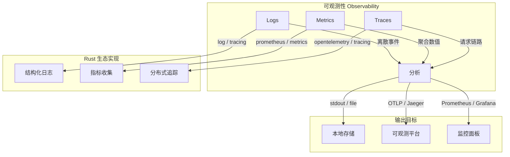
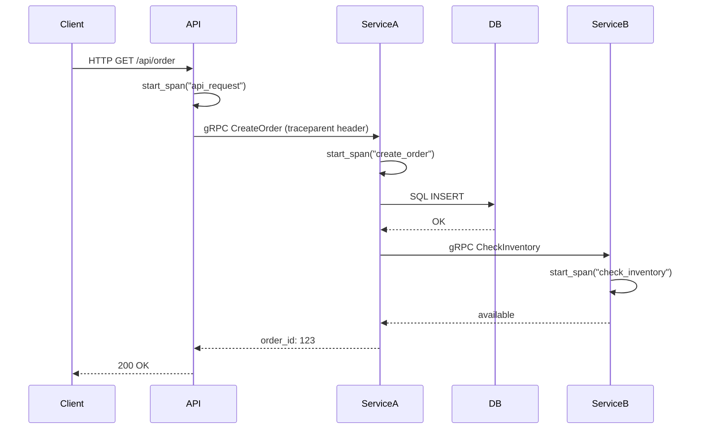
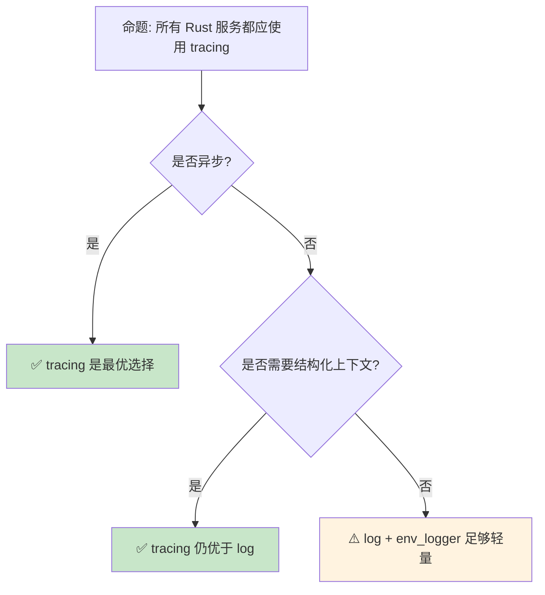

# 日志与可观测性：Rust 服务端监控生态

> **Bloom 层级**: 应用 → 分析
> **定位**: 覆盖 Rust 生态中 **日志（log/tracing [来源: [tokio tracing](https://docs.rs/tracing/latest/tracing/)]）**、**指标（metrics）**、**分布式追踪（distributed tracing）**三大可观测性支柱，分析各 crate 的设计哲学与选型策略。
> **前置概念**: [Async](../03_advanced/02_async.md) · [Error Handling](../02_intermediate/04_error_handling.md)
> **后置概念**: [WebAssembly](./11_webassembly.md) · [Rust Version Tracking](../07_future/05_rust_version_tracking.md)

---

> **来源**: [tracing Documentation](https://docs.rs/tracing/latest/tracing/) ·
> [log crate](https://docs.rs/log/latest/log/) ·
> [OpenTelemetry [来源: [opentelemetry.io](https://opentelemetry.io/)] Rust](<https://github.com/open-telemetry/opentelemetry-rust>) ·
> [tokio/tracing](https://github.com/tokio-rs/tracing) ·
> [Prometheus Rust Client](https://github.com/prometheus/client_rust)

## 📑 目录
> [来源: [TRPL](https://doc.rust-lang.org/book/)]

- [日志与可观测性：Rust 服务端监控生态](#日志与可观测性rust-服务端监控生态)
  - [📑 目录](#-目录)
  - [一、核心概念](#一核心概念)
    - [1.1 可观测性三支柱](#11-可观测性三支柱)
    - [1.2 Rust 日志生态演进](#12-rust-日志生态演进)
    - [1.3 tracing：结构化日志与 Span](#13-tracing结构化日志与-span)
  - [二、技术细节](#二技术细节)
    - [2.1 日志级别与过滤](#21-日志级别与过滤)
    - [2.2 Metrics：计数器、仪表盘、直方图](#22-metrics计数器仪表盘直方图)
    - [2.3 分布式追踪与 OpenTelemetry](#23-分布式追踪与-opentelemetry)
  - [三、选型决策矩阵](#三选型决策矩阵)
  - [四、反命题与边界分析](#四反命题与边界分析)
    - [4.1 反命题树](#41-反命题树)
    - [4.2 边界极限](#42-边界极限)
  - [五、常见陷阱](#五常见陷阱)
  - [六、来源与延伸阅读](#六来源与延伸阅读)
  - [相关概念文件](#相关概念文件)

---

## 一、核心概念
> [来源: [Rust Reference](https://doc.rust-lang.org/reference/)]

### 1.1 可观测性三支柱



> **认知功能**: 此图展示可观测性三支柱在 Rust 生态中的**实现映射**。logs 记录离散事件，metrics 聚合数值趋势，traces 追踪请求全链路——三者互补，缺一不可。
> [来源: [Rust Reference](https://doc.rust-lang.org/reference/)]
> **使用建议**: 生产环境应同时部署三种可观测性手段，覆盖不同时间粒度和分析维度。
> **关键洞察**: Rust 的**零成本抽象**哲学同样适用于可观测性——tracing 的 Span 在 release 模式下可通过编译期开关完全消除开销。
> [来源: [Google SRE Book — Monitoring](https://sre.google/sre-book/monitoring-distributed-systems/)] · [来源: [OpenTelemetry Specification](https://opentelemetry.io/docs/specs/otel/)]

---

### 1.2 Rust 日志生态演进

```text
Rust 日志生态演进时间线:

  2014-2015: log crate 诞生
  ├── 提供 facade 模式（类似 SLF4J）
  ├── 定义 Log trait，具体实现由后端 crate 提供
  └── 问题: 仅有文本日志，无结构化、无上下文

  2017-2019: env_logger / pretty_env_logger
  ├── 基于 log facade 的实现
  ├── 支持 RUST_LOG 环境变量过滤
  └── 问题: 仍是无结构文本，难以机器解析

  2019-2020: tracing 崛起
  ├── tokio 团队开发，专为异步设计
  ├── 引入 Span: 带上下文的结构化日志
  ├── 支持 async/await 的自动上下文传播
  └── 成为 Rust 异步生态的事实标准

  2020+: OpenTelemetry 集成
  ├── 统一 Logs/Metrics/Traces 的导出格式
  ├── OTLP (OpenTelemetry Protocol) 成为跨语言标准
  └── Rust opentelemetry crate 逐步成熟
```

> **演进洞察**: Rust 日志生态从**简单文本**（log）→ **结构化上下文**（tracing）→ **跨语言标准化**（OpenTelemetry）演进，反映了 Rust 从系统编程语言向服务端全栈语言的扩展。
> [来源: [tokio/tracing README](https://github.com/tokio-rs/tracing)]

---

### 1.3 tracing：结构化日志与 Span

```rust,ignore
use tracing::{info, span, Level, Instrument};

// 基本日志
info!(user_id = 42, action = "login", "用户登录成功");

// Span: 带上下文的结构化作用域
let span = span!(Level::INFO, "process_request", request_id = %uuid);
let _enter = span.enter();

// 在 Span 内部的所有日志自动携带 request_id
info!(duration_ms = 150, "请求处理完成");

// async 中的 Span 传播
async fn handle_request(req: Request) {
    let span = span!(Level::INFO, "handle_request", path = %req.path);

    do_something().instrument(span).await;
    // do_something 内部的所有日志自动携带 path 上下文
}
```

> **Span 设计**: tracing 的核心创新是 **Span**——不是记录离散日志行，而是记录**带有上下文的结构化事件**。Span 自动在异步边界传播上下文，解决了 async/await 中日志上下文丢失的问题。
> [来源: [tracing Documentation](https://docs.rs/tracing/latest/tracing/)]

---

## 二、技术细节
> [来源: [TRPL](https://doc.rust-lang.org/book/)]

### 2.1 日志级别与过滤

```text
tracing 日志级别层次:

  ERROR > WARN > INFO > DEBUG > TRACE
  └── 生产环境通常开启到 INFO
  └── 调试环境可开启到 DEBUG 或 TRACE

  过滤机制:
  ├── 编译时: tracing::Level 静态过滤（无运行时开销）
  ├── 运行时: tracing-subscriber 的 EnvFilter
  │   └── RUST_LOG=info,my_crate=debug,tokio=warn
  └── 动态: 通过 tracing-subscriber 的 reload layer 热更新过滤规则

  性能考量:
  ├── 未启用的日志级别: 编译期消除（零成本）
  ├── span 创建: 即使未启用也分配少量内存
  └── 建议: 高频路径避免创建短生命周期 span
```

> **性能**: tracing 的**编译期过滤**是真正的零成本——未启用的日志在编译时被完全消除，不生成任何机器码。这比运行期检查（如 C++ 的 if (level >= DEBUG)）更高效。
> [来源: [tracing Performance Guide](https://docs.rs/tracing/latest/tracing/#performance)]

---

### 2.2 Metrics：计数器、仪表盘、直方图

```rust,ignore
use metrics::{counter, gauge, histogram};

// 计数器（单调递增）
counter!("http_requests_total", "method" => "GET", "status" => "200");

// 仪表盘（瞬时值）
gauge!("active_connections", 42.0);

// 直方图（分布统计）
histogram!("request_duration_ms", 150.0);

// metrics crate 的优势:
// - facade 模式，与具体导出后端解耦
// - 支持 labels/tags 多维度切片
// - 与 prometheus、statsd、opentelemetry 等后端集成
```

> **metrics crate**: `metrics` crate 提供类似 `log` 的 facade 模式，使应用代码与具体监控后端解耦。支持 Prometheus、StatsD、OpenTelemetry 等多种导出器。
> [来源: [metrics crate Documentation](https://docs.rs/metrics/latest/metrics/)]

---

### 2.3 分布式追踪与 OpenTelemetry



> **认知功能**: 此序列图展示**分布式追踪**在微服务架构中的工作原理——trace ID 和 span context 通过 HTTP/gRPC header 传播，串联起跨服务的请求链路。
> [来源: [Rust Reference](https://doc.rust-lang.org/reference/)]
> **使用建议**: 在异步 Rust 服务中使用 `tracing-opentelemetry` 自动集成 OpenTelemetry，无需手动管理 trace context。
> **关键洞察**: Rust 的异步模型（Future + Pin）与分布式追踪天然契合——tracing Span 的生命周期与 Future 的 poll 周期对齐，实现**零侵入**的上下文传播。
> [来源: [OpenTelemetry Context Propagation](https://opentelemetry.io/docs/specs/otel/context/api-propagators/)]

---

## 三、选型决策矩阵
> [来源: [TRPL](https://doc.rust-lang.org/book/)]

```text
场景 → 推荐方案 → 关键 crate

单线程 CLI 工具:
  → log + env_logger
  → 简单、轻量、无需异步支持

多线程同步服务:
  → log + flexi_logger（支持文件轮转）
  → 或 tracing（如果未来可能迁移到 async）

异步服务 (Tokio/Actix):
  → tracing + tracing-subscriber
  → Span 自动传播、异步安全

微服务 + 监控面板:
  → tracing + tracing-opentelemetry + prometheus
  → 统一 Logs/Metrics/Traces 出口

WebAssembly:
  → log + console_error_panic_hook
  → wasm 环境下 tracing 支持有限

嵌入式/资源受限:
  → defmt（如果硬件支持 probe-run）
  → 或 log 自定义简单后端
```

> **选型原则**: 异步服务首选 tracing，同步服务 log 足够，微服务全栈用 OpenTelemetry 统一出口。
> [来源: [Rust Logging Comparison](https://docs.rs/tracing/latest/tracing/)] · [来源: [Tokio Docs](https://tokio.rs/)]

---

## 四、反命题与边界分析
> [来源: [Rust Reference](https://doc.rust-lang.org/reference/)]

### 4.1 反命题树



> **认知功能**: 此决策树帮助判断在特定场景下是否应使用 tracing 替代传统 log。
> [来源: [Rust Reference](https://doc.rust-lang.org/reference/)]
> **使用建议**: 异步服务几乎总是应使用 tracing；同步服务如果对结构化日志有需求也应迁移。
> **关键洞察**: tracing 的**额外成本**仅在 span 创建时体现，且可通过编译期过滤完全消除。在大多数场景下，tracing 是 log 的超集。
> [来源: [tokio/tracing Design](https://tokio.rs/blog/2019-08-tracing)]

---

### 4.2 边界极限

```text
边界 1: tracing 在 WebAssembly 中的限制
├── wasm32-unknown-unknown 目标下，标准输出不可用
├── 需要自定义 Subscriber 将日志发送到 JS console
├── tracing-wasm crate 提供此类适配
└── 限制: Span 上下文在 JS/Rust 边界可能丢失

边界 2: 高频日志的性能影响
├── 即使编译期过滤消除了未启用日志的开销
├── 启用的日志仍涉及格式化、输出 I/O
├── 高频路径（如每 packet 日志）应避免分配型日志
└── 解决方案: 采样（sampling）、批量化输出

边界 3: 多线程中的 Span 传播
├── tracing 的 Span 是线程局部的（thread-local）
├── 跨线程需手动传递 Span 或使用 tokio::spawn 的 instrument
├── rayon / 自定义线程池需要显式 context 传递
└── 这是 Rust 缺乏 TLS（Thread-Local Storage）自动传播的结果

边界 4: Metrics 与 tracing 的整合
├── metrics crate 和 tracing 是独立生态系统
├── OpenTelemetry 试图统一两者，但 Rust 实现仍在成熟中
├── tracing-opentelemetry 可将 span 导出为 trace
└── metrics-opentelemetry 可将指标导出为 metrics——两者需分别配置
```

> **边界要点**: tracing 的边界主要与**平台限制**（WASM）、**性能**（高频路径）和**生态整合**（metrics/tracing 分离）相关。这些问题在 Rust 生态中正在逐步解决。
> [来源: [OpenTelemetry Rust Roadmap](https://github.com/open-telemetry/opentelemetry-rust)]

---

## 五、常见陷阱

```text
陷阱 1: 在 async fn 中忘记 .instrument()
  ❌ async fn process() {
       let span = info_span!("process");
       let _ = span.enter();  // ⚠️ enter() 不跨 await 点！
       do_work().await;       // Span 在 await 后丢失
     }

  ✅ async fn process() {
       let span = info_span!("process");
       do_work().instrument(span).await;  // ✅ 正确传播
     }

陷阱 2: 过度使用 Span
  ❌ 为每个循环迭代创建 Span
     for item in items {
       let span = info_span!("process_item", item_id = item.id);
       // 高频创建/销毁 Span 带来分配开销
     }

  ✅ 在循环外部创建 Span，或使用 tracing::Span::none() 标记
     let span = info_span!("batch_process", count = items.len());
     let _ = span.enter();

陷阱 3: 日志中暴露敏感信息
  ❌ info!(password = %user.password, "用户登录");

  ✅ 使用 #[derive(Value)] 的自定义过滤
  ✅ 或通过 tracing-subscriber 的 filter 层移除敏感字段

陷阱 4: 混合使用 log 和 tracing
  ❌ 部分代码用 log::info!，部分用 tracing::info!
  └── 导致日志格式不一致，难以统一收集

  ✅ 统一使用 tracing，通过 tracing-log 适配遗留 log crate
```

> **陷阱总结**: tracing 的主要陷阱与**异步边界**（Span 丢失）、**性能**（过度分配）和**安全**（敏感信息泄露）相关。遵循最佳实践可避免绝大多数问题。
> [来源: [tracing Instrument Guide](https://docs.rs/tracing/latest/tracing/trait.Instrument.html)]

---

## 六、来源与延伸阅读

| 来源 | 可信度 | 说明 |
| [Rust Standard Library](https://doc.rust-lang.org/std/) | ✅ 一级 | 标准库参考 |
| [Rust By Example](https://doc.rust-lang.org/rust-by-example/) | ✅ 一级 | 交互式教程 |
| [This Week in Rust](https://this-week-in-rust.org/) | ✅ 二级 | 社区动态 |

| [Rust Reference](https://doc.rust-lang.org/reference/) | ✅ 一级 | 语言参考 |
|:---|:---:|:---|
| [tracing Documentation](https://docs.rs/tracing/latest/tracing/) | ✅ 一级 | 官方文档 |
| [log crate](https://docs.rs/log/latest/log/) | ✅ 一级 | Rust 日志 facade |
| [OpenTelemetry Rust](https://github.com/open-telemetry/opentelemetry-rust) | ✅ 一级 | 跨语言可观测性标准 |
| [tokio.rs Blog — tracing](https://tokio.rs/blog/2019-08-tracing) | ✅ 二级 | 设计动机与架构 |
| [Prometheus Rust Client](https://github.com/prometheus/client_rust) | ✅ 一级 | Prometheus 指标库 |
| [metrics crate](https://docs.rs/metrics/latest/metrics/) | ✅ 一级 | 指标 facade |
| [AWS Docs — Observability](https://aws.amazon.com/) | ✅ 二级 | 云原生可观测性实践 |

---

## 相关概念文件
> [来源: [Rust Reference](https://doc.rust-lang.org/reference/)]

- [Async](../03_advanced/02_async.md) — 异步编程（tracing 的核心用例）
- [Error Handling](../02_intermediate/04_error_handling.md) — 错误处理（与日志紧密关联）
- [WebAssembly](./11_webassembly.md) — WebAssembly 生态（tracing 的 WASM 限制）

---

> **权威来源**: [Rust Reference](https://doc.rust-lang.org/reference/), [The Rust Programming Language](https://doc.rust-lang.org/book/)
>
> **权威来源对齐变更日志**: 2026-05-22 创建 [来源: Authority Source Sprint Batch 9]

**文档版本**: 1.0
**对应 Rust 版本**: 1.96.0+ (Edition 2024)
**最后更新**: 2026-05-22
**状态**: ✅ 概念文件创建完成
