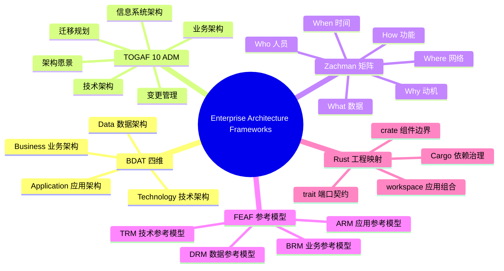

> **内容分级**: [专家级]
>
# 企业架构框架（Enterprise Architecture Frameworks）

> **EN**: Enterprise Architecture Frameworks
> **Summary**: Enterprise architecture frameworks — TOGAF 10, Zachman, FEAF, and BDAT — mapped to Rust engineering semantics, governance, and standards alignment.

> **Rust 版本**: 1.97.0+ (Edition 2024)
> **Bloom 层级**: L5-L6
> **权威来源**: 本文件为 `concept/` 权威页。
> **定位**: 从企业级视角对齐 TOGAF 10、Zachman Framework、FEAF 与 BDAT 四维矩阵，建立业务、数据、应用、技术架构与 Rust 工程结构的映射。
> **前置概念**: [Software Architecture Formalization](../../04_formal/10_architecture_semantics/01_software_architecture_formalization.md) · [Architecture Patterns](../03_design_patterns/08_architecture_patterns.md) · [System Design Principles](../03_design_patterns/03_system_design_principles.md)
> **后置概念**: [Architecture Governance and ADRs](02_architecture_governance_and_adrs.md) · [Architecture Standards Alignment](03_architecture_standards_alignment.md) · [Safety Boundaries](../../05_comparative/03_domain_comparisons/01_safety_boundaries.md)

---

> **来源**: [The Open Group — TOGAF Standard, 10th Edition](https://www.opengroup.org/togaf) · [Zachman Framework](https://www.zachman.com/) · [FEAF](https://www.whitehouse.gov/omb/management/egov/federal-enterprise-architecture/) · [ISO/IEC/IEEE 42010:2022](https://www.iso.org/standard/74296.html) · [IEEE 1471-2000](https://standards.ieee.org/standard/1471-2000.html)

> **权威来源 / Provenance**: 本节企业架构框架（TOGAF ADM、BDAT 四维矩阵、Zachman/FEAF 参考模型）与 The Open Group 的 *TOGAF Standard, 10th Edition* 对齐。
>
> - **The Open Group** — *TOGAF Standard, 10th Edition*. [https://www.opengroup.org/togaf](https://www.opengroup.org/togaf)
>
> **国际权威来源**
>
> - **IEEE** — *IEEE Std 1471-2000, Recommended Practice for Architectural Description of Software-Intensive Systems*. [https://standards.ieee.org/standard/1471-2000.html](https://standards.ieee.org/standard/1471-2000.html)
> - **ISO/IEC/IEEE** — *ISO/IEC/IEEE 42010:2022, Software, systems and enterprise — Architecture description*. [https://doi.org/10.1109/IEEESTD.2022.9938446](https://doi.org/10.1109/IEEESTD.2022.9938446)
> - **arXiv** — Soares Palma et al., *Evolving reference architecture description: Guidelines based on ISO/IEC/IEEE 42010*. [https://arxiv.org/abs/2209.14714](https://arxiv.org/abs/2209.14714)
> - **The Rust Project** — *The Cargo Book: Workspaces*. [https://doc.rust-lang.org/cargo/reference/workspaces.html](https://doc.rust-lang.org/cargo/reference/workspaces.html)

---

TOGAF ADM 阶段到 Cargo workspace 决策表：

```text
| ADM 阶段 | 企业架构关注点       | Rust workspace 动作                  | 输出制品                     |
|----------|----------------------|--------------------------------------|------------------------------|
| A 愿景   | 边界与利益相关方     | 定义 workspace members 与 crate 职责 | Cargo.toml [workspace]       |
| B 业务   | 能力、领域事件       | 识别 bounded context、领域事件类型   | crates/*/domain 事件枚举     |
| C 信息   | 数据/应用拆分        | 设计 struct/enum 与 trait 契约       | 共享 kernel crate            |
| D 技术   | 平台、部署、MSRV     | 配置 target、CI、容器镜像            | rust-toolchain.toml          |
| E/F 迁移 | 债务、版本、路线图   | 制定 SemVer/MSRV 升级计划            | ROADMAP.md、ADR              |
| G 治理   | 合规、质量门         | 配置 CI 阻断门、架构测试             | .github/workflows/*.yml      |
| H 变更   | 补丁、依赖、安全响应 | 执行 cargo update、RUSTSEC 响应      | 变更记录、更新 Cargo.lock    |
```

> 说明：该表把 TOGAF ADM 的迭代周期映射到 Rust monorepo 的日常治理动作；ADM 的“裁剪”原则意味着小型项目可合并阶段，但需显式记录。

---

## 📑 目录

- [企业架构框架（Enterprise Architecture Frameworks）](#企业架构框架enterprise-architecture-frameworks)
  - [📑 目录](#-目录)
  - [一、权威定义（Definition）](#一权威定义definition)
    - [1.1 企业架构（Enterprise Architecture, EA）](#11-企业架构enterprise-architecture-ea)
    - [1.2 BDAT 四维矩阵](#12-bdat-四维矩阵)
  - [二、TOGAF ADM 生命周期](#二togaf-adm-生命周期)
    - [2.1 ADM 阶段](#21-adm-阶段)
    - [2.2 与 Rust 工程的映射](#22-与-rust-工程的映射)
  - [三、Zachman 分类矩阵](#三zachman-分类矩阵)
  - [四、FEAF 参考模型](#四feaf-参考模型)
  - [五、Rust 工程映射](#五rust-工程映射)
    - [5.1 workspace → 应用/技术架构](#51-workspace--应用技术架构)
    - [5.2 crate → 组件/配置边界](#52-crate--组件配置边界)
    - [5.3 trait → 端口与服务契约](#53-trait--端口与服务契约)
  - [六、反命题与边界](#六反命题与边界)
    - [反命题：企业架构是“文档工作”，不直接产生工程价值](#反命题企业架构是文档工作不直接产生工程价值)
    - [边界：EA 框架不能替代具体的设计模式与形式化验证](#边界ea-框架不能替代具体的设计模式与形式化验证)
    - [反例：EA 框架的常见误解](#反例ea-框架的常见误解)
  - [七、嵌入式测验（Embedded Quiz）](#七嵌入式测验embedded-quiz)
    - [测验 1：BDAT 四维分别指什么？（记忆层）](#测验-1bdat-四维分别指什么记忆层)
    - [测验 2：TOGAF ADM 中哪个阶段负责定义技术平台？（理解层）](#测验-2togaf-adm-中哪个阶段负责定义技术平台理解层)
    - [测验 3：Zachman 框架的核心贡献是什么？（理解层）](#测验-3zachman-框架的核心贡献是什么理解层)
    - [测验 4：在 Rust 工程中，Cargo workspace 对应企业架构的哪个概念？（应用层）](#测验-4在-rust-工程中cargo-workspace-对应企业架构的哪个概念应用层)
    - [测验 5：为什么说 EA 框架不能替代形式化验证？（分析层）](#测验-5为什么说-ea-框架不能替代形式化验证分析层)
  - [八、🧭 思维导图（Mindmap）](#八-思维导图mindmap)
  - [补充国际权威来源（P1/P2 覆盖）](#补充国际权威来源p1p2-覆盖)

---

## 一、权威定义（Definition）

### 1.1 企业架构（Enterprise Architecture, EA）

**企业架构**是对组织业务能力与 IT 能力之间结构关系的系统化描述，目标是使业务战略与系统实现保持一致（alignment）。ISO/IEC/IEEE 42010:2022 将架构描述（Architecture Description, AD）定义为“以关注点和利益相关方为中心的、对系统的架构的表达”。企业架构把这一概念从单一系统扩展到组织级系统组合。

核心目标：

- **对齐（Alignment）**：业务目标、数据资产、应用组合、技术平台四者一致。
- **集成（Integration）**：消除烟囱系统，统一接口与数据语义。
- **演进（Evolution）**：在变更中保持可审计、可回退、可衡量的架构轨迹。
- **治理（Governance）**：通过原则、标准、决策记录约束设计选择。

### 1.2 BDAT 四维矩阵

BDAT 是企业架构最常用的四维分类，对应组织中四个互补的架构视角：

| 维度 | 关注点 | 典型制品 | Rust 工程映射 |
|---|---|---|---|
| **Business** 业务架构 | 业务能力、价值链、流程、组织单元 | 业务流程图、能力地图 | 产品 backlog、领域事件、 bounded context |
| **Data** 数据架构 | 数据实体、数据流、主数据、数据治理 | 数据模型、数据字典、 lineage | 领域类型（struct/enum）、schema、事件日志 |
| **Application** 应用架构 | 应用系统、服务边界、接口契约 | 应用组合图、服务蓝图 | workspace members、crate 职责、API trait |
| **Technology** 技术架构 | 平台、运行时、部署、基础设施 | 技术栈图、部署拓扑 | target triple、CI/CD、容器、依赖版本 |

四维不是层级，而是**正交的投影**：同一系统同时具有业务含义、数据含义、应用含义和技术含义。EA 框架提供将这些投影整合到统一描述中的规则。

> **来源**: [The Open Group — TOGAF Standard, 10th Edition](https://www.opengroup.org/togaf) · [ISO/IEC/IEEE 42010:2022](https://www.iso.org/standard/74296.html)

---

## 二、TOGAF ADM 生命周期

### 2.1 ADM 阶段

TOGAF 10 的 **Architecture Development Method (ADM)** 是一个可裁剪的迭代周期，用于开发和治理企业架构。核心阶段如下：

| 阶段 | 目标 | 关键制品 |
|---|---|---|
| **A. 架构愿景** | 定义利益相关方、业务目标、架构范围 | 架构工作声明、愿景草案 |
| **B. 业务架构** | 描述当前与目标业务能力 | 业务功能图、流程模型、组织映射 |
| **C. 信息系统架构** | 划分为数据架构与应用架构 | 数据实体图、应用组合图 |
| **D. 技术架构** | 定义技术平台与基础设施 | 技术参考模型、部署拓扑 |
| **E. 机会与解决方案** | 识别差距、制定迁移路线 | 差距分析、迁移规划 |
| **F. 迁移规划** | 排序项目、分配资源 | 实施路线图、投资计划 |
| **G. 实施治理** | 监督实施与架构一致性 | 合规评估、例外审批 |
| **H. 架构变更管理** | 持续跟踪变更并更新架构 | 变更请求、架构更新 |
| **预备阶段 / 需求管理** | 裁剪方法、管理需求 | 裁剪配置、需求库 |

ADM 的关键设计哲学是**迭代与裁剪**：不是每个项目都需要走完所有阶段，但必须显式声明哪些阶段被裁剪、为什么。

### 2.2 与 Rust 工程的映射

将 ADM 阶段映射到 Rust 工程实践：

| ADM 阶段 | Rust 工程活动 | 工具/制品 |
|---|---|---|
| A. 架构愿景 | 定义 workspace 边界与 crate 职责 | `Cargo.toml` workspace members |
| B. 业务架构 | 领域事件识别、bounded context 划分 | 事件风暴输出、领域模型 |
| C. 信息系统架构 | 数据模型设计、服务接口设计 | `struct`/`enum`、trait 契约、API schema |
| D. 技术架构 | target 选择、部署形态、依赖策略 | `rust-toolchain.toml`、CI、容器镜像 |
| E. 机会与解决方案 | 技术债务评估、迁移计划 | `cargo audit`、MSRV 路线图 |
| F. 迁移规划 | 版本发布计划、兼容策略 | SemVer、edition 迁移 |
| G. 实施治理 | CI 质量门、架构测试 | `cargo check`、ArchUnitRust、clippy |
| H. 变更管理 | 依赖升级、安全补丁响应 | `cargo update`、RUSTSEC 响应 |

> **来源**: [The Open Group — TOGAF Standard, 10th Edition](https://www.opengroup.org/togaf)

---

## 三、Zachman 分类矩阵

Zachman Framework 是一个 **6 × 6 的分类矩阵**，从两个维度描述企业架构：

- **列（抽象维度）**：What（数据）、How（功能）、Where（网络）、Who（人员）、When（时间）、Why（动机）。
- **行（视角维度）**：Scope（规划者）、Business Model（所有者）、System Model（设计者）、Technology Model（构建者）、Detailed Representation（分包商）、Functioning Enterprise（实际运行）。

Zachman 的核心贡献不是过程，而是**分类法**：任何架构制品都可以定位到矩阵中的一个单元格，从而判断描述是否完整、是否存在视角缺口。

| 视角 \ 抽象 | What（数据） | How（功能） | Where（网络） | Who（人员） | When（时间） | Why（动机） |
|---|---|---|---|---|---|---|
| Scope | 资产清单 | 业务流程列表 | 位置列表 | 组织角色 | 事件周期 | 业务目标 |
| Business Model | 实体关系模型 | 业务功能模型 | 业务位置模型 | 人员/工作流 | 业务事件 | 业务规则 |
| System Model | 数据模型 | 应用架构 | 系统拓扑 | 用户接口 | 处理时序 | 系统目标 |
| Technology Model | 数据 schema | 系统设计 | 网络架构 | 接口设计 | 控制结构 | 设计约束 |
| Detailed Repr. | 物理 schema | 代码/模块 | 节点配置 | 屏幕/交互 | 调度规则 | 规则实现 |
| Functioning Enterprise | 实际数据 | 实际流程 | 实际网络 | 实际用户 | 实际时序 | 实际 KPI |

Rust 工程映射示例：

- **System Model / What**：领域模型 `struct Order`、`enum OrderStatus`。
- **Technology Model / How**：`crate` 模块划分、`trait` 接口设计。
- **Detailed Representation / How**：具体 `impl`、工作空间 crate 依赖。
- **Functioning Enterprise / What**：运行时（Runtime）数据库中的真实订单数据。

> **来源**: [Zachman Framework](https://www.zachman.com/)

---

## 四、FEAF 参考模型

**FEAF（Federal Enterprise Architecture Framework）** 是美国联邦政府的企业架构框架，其核心是**参考模型（Reference Models）**，用于跨部门标准化架构描述：

| 参考模型 | 关注点 | 对应 BDAT |
|---|---|---|
| **BRM** Business Reference Model | 业务线、业务能力、服务 | Business |
| **DRM** Data Reference Model | 数据分类、数据共享、数据标准 | Data |
| **ARM** Application Reference Model | 应用组合、接口、互操作 | Application |
| **TRM** Technology Reference Model | 技术标准、平台、基础设施 | Technology |
| **PSRM** Performance Reference Model | 绩效指标、成果衡量 | 跨四维 |
| **SRM** Security Reference Model | 安全控制、风险管理 | 跨四维 |

FEAF 的实用价值在于**强制跨组织使用统一语义**：如果多个部门都使用相同的 DRM 分类，数据交换成本会显著降低。在 Rust 工程中，这相当于：

- **BRM** 对应产品能力与用户故事；
- **DRM** 对应共享领域类型与事件 schema；
- **ARM** 对应 workspace 中 crate 职责与 API 契约；
- **TRM** 对应 MSRV、依赖白名单、target triple 策略。

> **来源**: [FEAF](https://www.whitehouse.gov/omb/management/egov/federal-enterprise-architecture/)

---

## 五、Rust 工程映射

### 5.1 workspace → 应用/技术架构

Cargo workspace 是企业架构中“应用组合”与“技术平台”概念在代码库层面的直接映射：

```text
enterprise-system/
├── Cargo.toml          # workspace 定义 = 应用组合清单
├── crates/
│   ├── order-domain/   # 业务架构：领域能力
│   ├── order-app/      # 应用架构：用例编排
│   ├── order-api/      # 应用架构：外部接口
│   ├── order-infra/    # 技术架构：基础设施实现
│   └── shared-kernel/  # 数据架构：共享语义
```

### 5.2 crate → 组件/配置边界

每个 crate 是企业架构中的**部署单元**和**变更单元**。Cargo 拒绝循环依赖，因此 crate 边界天然强制架构的依赖方向：

| EA 概念 | Rust 机制 | 治理含义 |
|---|---|---|
| 应用组件 | `crate` | 独立编译、测试、版本化 |
| 组件契约 | `pub` API | 显式暴露，隐藏内部 |
| 组件依赖 | `Cargo.toml` `[dependencies]` | 可审计、可检查 |
| 配置/拓扑 | workspace `members` + `dependencies` | 架构描述可机器验证 |

### 5.3 trait → 端口与服务契约

在企业架构的应用架构层，**端口（port）** 是组件之间的抽象契约。Rust 的 `trait` 与端口概念同构：

```rust
// 应用架构层定义的端口（服务契约）
pub trait OrderRepository: Send + Sync {
    async fn find_by_id(&self, id: Uuid) -> Option<Order>;
    async fn save(&self, order: &Order) -> Result<(), OrderError>;
}

// 技术架构层的具体适配器
pub struct PostgresOrderRepository { pool: PgPool }

impl OrderRepository for PostgresOrderRepository {
    async fn find_by_id(&self, id: Uuid) -> Option<Order> {
        todo!()
    }
    async fn save(&self, _order: &Order) -> Result<(), OrderError> {
        Ok(())
    }
}
```

`trait` 定义了应用架构与服务实现的边界，使技术架构的变更（如从 PostgreSQL 切换到 DynamoDB）不影响应用架构。

---

## 六、反命题与边界

### 反命题：企业架构是“文档工作”，不直接产生工程价值

这是最常见的误解。企业架构的价值不是产生更多文档，而是：

1. **降低决策成本**：通过 BDAT 矩阵快速定位变更影响范围。
2. **提供审计轨迹**：ADR、原则、标准使决策可复盘。
3. **强制一致性**：参考模型和架构治理避免团队各自为政。
4. **连接业务与技术**：确保技术投资决策可追溯回业务目标。

如果没有企业架构，技术决策会退化为“当前最方便的局部优化”，长期导致技术债务和系统烟囱化。

### 边界：EA 框架不能替代具体的设计模式与形式化验证

EA 框架提供**分类法和治理语言**，但不提供：

- 如何设计一个线程安全的组件 → 需要并发模式与类型系统知识。
- 如何证明协议正确性 → 需要形式化方法（TLA+、session types）。
- 如何选择 async 与多线程 → 需要工程权衡与基准测试。

因此，本目录的 EA 内容应与 `concept/04_formal/10_architecture_semantics/` 的形式化架构语义、`concept/06_ecosystem/03_design_patterns/` 的设计模式、`concept/03_advanced/00_concurrency/` 的并发模型联合使用。

### 反例：EA 框架的常见误解

| 误解 | 反例场景 | 为什么错误 |
|---|---|---|
| "采用 TOGAF 就能保证项目成功" | 某团队完整执行 ADM 各阶段并产出大量文档，却未验证核心并发协议，上线后出现数据竞争 | TOGAF 提供分类法和治理语言，不保证实现正确性；并发协议仍需形式化验证或测试 |
| "一个框架适合所有组织" | 初创团队照搬 FEAF 的六参考模型和完整合规流程，治理开销超过工程收益 | EA 框架必须裁剪；ADM 的"裁剪"原则要求显式声明哪些阶段被省略及原因 |
| "企业架构只是文档工作" | 架构师独立绘制 diagrams 后归档，未与产品 backlog、CI 质量门或 ADR 关联 | EA 的价值在于决策约束、影响范围分析和审计轨迹，而非文档本身 |

---

## 七、嵌入式测验（Embedded Quiz）

### 测验 1：BDAT 四维分别指什么？（记忆层）

**题目**: 企业架构中 BDAT 四维分别代表哪四个架构视角？

<details>
<summary>✅ 答案与解析</summary>

BDAT 四维是 Business（业务架构）、Data（数据架构）、Application（应用架构）、Technology（技术架构）。它们分别关注业务能力、数据资产、应用系统组合和技术平台。
</details>

---

### 测验 2：TOGAF ADM 中哪个阶段负责定义技术平台？（理解层）

**题目**: 在 TOGAF ADM 生命周期中，哪个阶段主要负责技术架构的定义？

<details>
<summary>✅ 答案与解析</summary>

阶段 D（Technology Architecture）负责定义技术平台、基础设施、部署拓扑和运行时（Runtime）环境。它承接业务架构和信息系统架构，将目标架构落地为可实施的技术决策。
</details>

---

### 测验 3：Zachman 框架的核心贡献是什么？（理解层）

**题目**: Zachman Framework 与 TOGAF ADM 的最大区别是什么？

<details>
<summary>✅ 答案与解析</summary>

Zachman 框架的核心贡献是分类法（6 × 6 矩阵），用于检查架构描述是否覆盖了必要的抽象维度和利益相关方视角；TOGAF ADM 则是一个过程方法，用于迭代开发架构。Zachman 回答“描述是否完整”，TOGAF 回答“如何开发架构”。
</details>

---

### 测验 4：在 Rust 工程中，Cargo workspace 对应企业架构的哪个概念？（应用层）

**题目**: Cargo workspace 的企业架构映射最贴近哪两个维度？

<details>
<summary>✅ 答案与解析</summary>

Cargo workspace 最贴近 Application Architecture（应用组合）和 Technology Architecture（技术平台）：它定义了 crate 成员、共享依赖和构建配置，是应用组合与平台约束在代码库中的直接表达。
</details>

---

### 测验 5：为什么说 EA 框架不能替代形式化验证？（分析层）

**题目**: 企业架构框架能直接保证并发协议的正确性吗？为什么？

<details>
<summary>✅ 答案与解析</summary>

不能。EA 框架提供分类、治理和决策语言，但不提供组件行为的精确语义或证明方法。并发协议正确性需要类型系统（Send/Sync）、形式化方法（TLA+、session types）或模型检查等更精确的技术手段。
</details>

---

## 八、🧭 思维导图（Mindmap）



---

> **来源**: [The Open Group — TOGAF Standard, 10th Edition](https://www.opengroup.org/togaf) · [Zachman Framework](https://www.zachman.com/) · [FEAF](https://www.whitehouse.gov/omb/management/egov/federal-enterprise-architecture/) · [ISO/IEC/IEEE 42010:2022](https://www.iso.org/standard/74296.html)

## 补充国际权威来源（P1/P2 覆盖）

- [axum on crates.io](https://crates.io/crates/axum)
- [axum docs](https://docs.rs/axum/latest/axum/)
- [serde on crates.io](https://crates.io/crates/serde)
