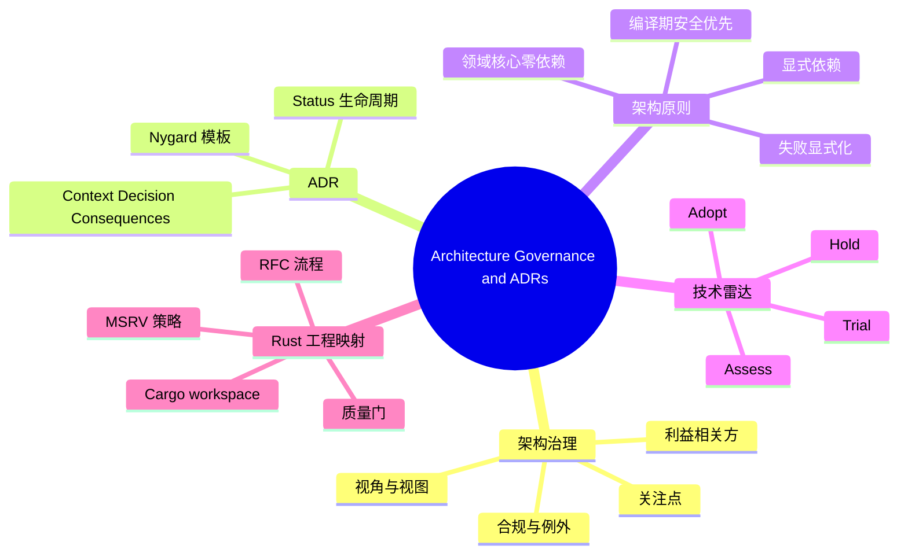

> **内容分级**: [专家级]
>
# 架构治理与架构决策记录（Architecture Governance and ADRs）

> **EN**: Architecture Governance and Architecture Decision Records
> **Summary**: Architecture governance, decision records, principles, and technology radar — mapped to Rust workspace governance, MSRV policy, RFC process, and quality gates.

> **Rust 版本**: 1.97.0+ (Edition 2024)
> **Bloom 层级**: L5-L6
> **权威来源**: 本文件为 `concept/` 权威页。
> **定位**: 从架构治理视角建立 ADR、架构原则、技术雷达与企业级 Rust 工程实践（workspace、MSRV、RFC、质量门）的映射。
> **前置概念**: [Enterprise Architecture Frameworks](01_enterprise_architecture_frameworks.md) · [Software Architecture Formalization](../../04_formal/10_architecture_semantics/01_software_architecture_formalization.md)
> **后置概念**: [Architecture Standards Alignment](03_architecture_standards_alignment.md) · [System Design Principles](../03_design_patterns/03_system_design_principles.md) · [Safety Boundaries](../../05_comparative/03_domain_comparisons/01_safety_boundaries.md)

---

> **来源**: [ISO/IEC/IEEE 42010:2022](https://www.iso.org/standard/74296.html) · [IEEE 1471-2000](https://standards.ieee.org/standard/1471-2000.html) · [Rust RFCs](https://github.com/rust-lang/rfcs) · [SEI ATAM](https://www.sei.cmu.edu/research-capabilities/all-work/display.cfm?customel_datapageid_4050=21306) · [Nygard ADR Template](https://github.com/joelparkerhenderson/architecture-decision-record) · [ThoughtWorks Tech Radar](https://www.thoughtworks.com/radar) · [Jansen & Bosch 2005, Architecture Decisions](https://doi.org/10.1109/WICSA.2005.61) · [Rust Edition Guide](https://doc.rust-lang.org/edition-guide/) · [Rust RFCs Book](https://rust-lang.github.io/rfcs/) · [The Rust Blog](https://blog.rust-lang.org/)

---

## 📑 目录

- [架构治理与架构决策记录（Architecture Governance and ADRs）](#架构治理与架构决策记录architecture-governance-and-adrs)
  - [📑 目录](#-目录)
  - [一、架构治理的定义](#一架构治理的定义)
  - [二、架构决策记录（ADR）](#二架构决策记录adr)
    - [2.1 Nygard ADR 模板](#21-nygard-adr-模板)
    - [2.2 ADR 与 Rust 工程](#22-adr-与-rust-工程)
  - [三、架构原则](#三架构原则)
    - [3.1 原则示例](#31-原则示例)
    - [3.2 原则与 Cargo 约束的结合](#32-原则与-cargo-约束的结合)
  - [四、技术雷达](#四技术雷达)
    - [4.1 ThoughtWorks Tech Radar 四象限](#41-thoughtworks-tech-radar-四象限)
    - [4.2 Rust 生态雷达示例](#42-rust-生态雷达示例)
  - [五、Rust 工程映射](#五rust-工程映射)
    - [5.1 Cargo workspace 治理](#51-cargo-workspace-治理)
    - [5.2 RFC 与 ADR 的关系](#52-rfc-与-adr-的关系)
    - [5.3 MSRV 作为架构策略](#53-msrv-作为架构策略)
  - [六、反命题与边界](#六反命题与边界)
    - [反命题：ADR 是“写完之后再也不看”的文档](#反命题adr-是写完之后再也不看的文档)
    - [边界：治理不能替代工程判断](#边界治理不能替代工程判断)
  - [七、嵌入式测验（Embedded Quiz）](#七嵌入式测验embedded-quiz)
    - [测验 1：Nygard ADR 模板包含哪五个核心字段？（记忆层）](#测验-1nygard-adr-模板包含哪五个核心字段记忆层)
    - [测验 2：架构原则与 ADR 的主要区别是什么？（理解层）](#测验-2架构原则与-adr-的主要区别是什么理解层)
    - [测验 3：技术雷达的四个象限是什么？（记忆层）](#测验-3技术雷达的四个象限是什么记忆层)
    - [测验 4：在 Rust workspace 中，如何落地“领域核心零外部依赖”原则？（应用层）](#测验-4在-rust-workspace-中如何落地领域核心零外部依赖原则应用层)
    - [测验 5：为什么说 MSRV 是一种架构策略？（分析层）](#测验-5为什么说-msrv-是一种架构策略分析层)
  - [八、🧭 思维导图（Mindmap）](#八-思维导图mindmap)

---

## 一、架构治理的定义

**架构治理**是确保 IT 系统设计与组织目标、原则、标准保持一致的一套流程、角色和机制。根据 ISO/IEC/IEEE 42010:2022，治理关注：

- **利益相关方（stakeholder）**：谁关心架构决策？
- **关注点（concern）**：他们关心什么？
- **视角（viewpoint）**：用什么规则描述和评估？
- **视图（view）**：实际产出的架构描述。

在企业环境中，架构治理通常通过以下机制落地：

| 机制 | 作用 |
|---|---|
| 架构原则 | 长期约束决策方向 |
| 架构决策记录（ADR） | 记录具体决策及其上下文 |
| 技术雷达 | 可视化技术采纳状态 |
| 合规检查 | 验证实现与架构描述的一致性 |
| 例外流程 | 在必要时允许偏离标准 |

---

## 二、架构决策记录（ADR）

### 2.1 Nygard ADR 模板

ADR 是轻量级文档，记录“影响深远的架构决策”。Michael Nygard 提出的经典模板包含五个部分：

| 字段 | 含义 |
|---|---|
| **Title** | 决策标题，形如“ADR-042: 使用 PostgreSQL 作为订单持久化存储” |
| **Status** | proposed / accepted / deprecated / superseded |
| **Context** | 迫使我们必须做出决策的背景和约束 |
| **Decision** | 我们决定做什么 |
| **Consequences** | 正面与负面后果 |

扩展模板还可加入：

- **Alternatives Considered**：被否决的选项及其原因。
- **Compliance**：如何验证该决策被遵循。
- **Notes**：相关会议、链接、利益相关方。

### 2.2 ADR 与 Rust 工程

在 Rust 工程中，ADR 应聚焦于跨 crate、跨团队、长期影响的设计选择：

| 决策主题 | ADR 示例 |
|---|---|
| 并发模型 | 选择 `tokio` 而非 `async-std` |
| 错误处理策略 | 使用 `thiserror` + `anyhow` 分层 |
| 持久化抽象 | 采用六边形架构中的 `OrderRepository` trait |
| 部署形态 | 容器化 vs Serverless |
| 依赖策略 | 允许/禁止的 crate 白名单 |

以下是一个最小 ADR 骨架：

```markdown
# ADR-007: 使用 Workspace Crate 边界强制分层架构

## Status
accepted

## Context
order-service 需要同时支持 Web API、批处理任务和未来可能的 gRPC 接口。
不同入口共享领域逻辑，但基础设施实现各异。

## Decision
将代码库拆分为 workspace，其中：
- `order-domain`：零外部依赖，承载业务规则。
- `order-app`：编排用例，依赖 domain。
- `order-api` / `order-batch`：不同入口，依赖 app。
- `order-infra`：实现仓储、消息等端口。

## Consequences
- 正：Cargo 强制依赖方向，分层违规在编译期暴露。
- 负：crate 数量增加，初次构建和发布流程更复杂。
```

> **来源**: [Nygard ADR Template](https://github.com/joelparkerhenderson/architecture-decision-record)

---

## 三、架构原则

### 3.1 原则示例

架构原则是比 ADR 更持久的约束声明，通常以“我们优先……而非……”的格式书写：

| 原则 | 含义 | Rust 工程体现 |
|---|---|---|
| **编译期安全优先** | 优先使用类型系统和借用检查捕获错误 | Safe Rust 为默认；`unsafe` 需 ADR |
| **显式依赖优于隐式** | 所有组件依赖必须可审计 | 通过 `Cargo.toml` 声明，禁止通配 `*` |
| **领域核心零外部依赖** | 领域 crate 不依赖框架 | `order-domain` 仅使用 `std` |
| **失败显式化** | 错误必须作为类型传播 | 公共 API 返回 `Result<T, E>` |
| **可测试性内建** | 核心逻辑不依赖 I/O | trait 边界、mock 实现 |

### 3.2 原则与 Cargo 约束的结合

原则若不能落地为工程约束，终将变成口号。Rust 工程可通过以下方式将原则编码：

```toml
# workspace Cargo.toml：统一 MSRV、edition、license
[workspace.package]
version = "1.0.0"
edition = "2024"
rust-version = "1.97.0"
license = "MIT OR Apache-2.0"

[workspace.dependencies]
# 白名单：只有经过 ADR 审批的依赖才允许出现在成员 crate 中
tokio = { version = "1.43", features = ["full"] }
serde = { version = "1.0", features = ["derive"] }
```

```toml
# order-domain/Cargo.toml：原则“领域核心零外部依赖”
[package]
name = "order-domain"
version.workspace = true
edition.workspace = true
rust-version.workspace = true

[dependencies]
# 仅保留无 I/O 的工具库；禁止 sqlx、tokio、axum 等框架
```

---

## 四、技术雷达

### 4.1 ThoughtWorks Tech Radar 四象限

ThoughtWorks Tech Radar 是技术治理的常用可视化工具，将技术按采纳状态分为四类：

| 象限 | 含义 | 治理动作 |
|---|---|---|
| **Adopt** 采纳 | 经过验证，可默认使用 | 纳入标准技术栈 |
| **Trial** 试验 | 有前景，可在非核心场景试点 | 需 ADR 和风险评估 |
| **Assess** 评估 | 值得关注，但尚未成熟 | 个人调研、PoC |
| **Hold** 暂缓 | 风险高或有更好替代 | 新项目避免使用 |

### 4.2 Rust 生态雷达示例

一个假想的 Rust 团队技术雷达：

| 象限 | 技术 |
|---|---|
| Adopt | `tokio`, `serde`, `axum`, `thiserror`, `tracing` |
| Trial | `ractor` (Actor 框架), `wasmtime` (WASM runtime) |
| Assess | `crux` (Rust/C++ interop), `verus` (形式化验证) |
| Hold | `unsafe` 裸指针优化（无基准证明）、未维护的实验性语言特性 |

技术雷达的价值在于**统一团队对技术风险的认知**，避免每个项目重复争论相同技术选型。

> **来源**: [ThoughtWorks Tech Radar](https://www.thoughtworks.com/radar)

---

## 五、Rust 工程映射

### 5.1 Cargo workspace 治理

Cargo workspace 是 Rust 工程治理的核心单元：

```text
治理机制                Cargo / Rust 工具
────────────────────────────────────────────────────────
架构原则               workspace 配置、clippy lint
ADR 合规               code review、架构测试
依赖白名单             [workspace.dependencies]
版本策略               workspace.package.version
MSRV 策略              rust-version.workspace = true
质量门                 scripts/run_quality_gates.sh
```

### 5.2 RFC 与 ADR 的关系

| 文档 | 范围 | 生命周期 | Rust 社区对应 |
|---|---|---|---|
| **RFC** | 影响广泛、需多方共识 | 长，需社区评审 | Rust RFC 流程 |
| **ADR** | 影响具体项目或子系统 | 短，团队内部即可 | workspace 内部决策 |

Rust 语言本身的 RFC 流程是 ADR 的放大版：RFC 决定语言特性（如 `async/await`），ADR 决定具体项目如何使用这些特性。

### 5.3 MSRV 作为架构策略

**MSRV（Minimum Supported Rust Version）** 不仅是工具链版本，更是架构治理中的**兼容性策略**：

- **激进策略**：紧跟 stable，使用最新 edition 特性；适合内部服务。
- **保守策略**：MSRV 锁定在发行版 LTS；适合库作者或长期维护系统。
- **对齐策略**：与关键依赖的 MSRV 保持一致，避免编译矩阵爆炸。

在 workspace 中统一 MSRV 可避免成员 crate 之间的版本漂移：

```toml
[workspace.package]
rust-version = "1.97.0"
```

---

## 六、反命题与边界

### 反命题：ADR 是“写完之后再也不看”的文档

如果 ADR 只是写完后归档，它确实没有价值。ADR 的生命力来自：

1. **与代码关联**：在相关 crate 的 README 或模块注释中引用 ADR 编号。
2. **定期复盘**：每个季度检查 deprecated/superseded 状态。
3. **与 CI 绑定**：例如 ADR 规定“领域 crate 零外部依赖”，则通过脚本检查 `crates/domain/Cargo.toml`。
4. **onboarding 材料**：新成员通过阅读 ADR 理解系统演化历史。

### 边界：治理不能替代工程判断

架构原则、ADR 和技术雷达是**约束框架**，不是**决策自动机**。在以下场景中，治理应让位于具体工程判断：

- 性能关键路径需要临时使用 `unsafe`，经评审后可作为例外。
- 新技术虽在雷达的 Assess 象限，但项目有强烈业务理由提前试用。
- 标准依赖在目标平台上不可用时，需要替代方案。

治理的目标不是消除判断，而是让判断在一致的框架内进行。

---

## 七、嵌入式测验（Embedded Quiz）

### 测验 1：Nygard ADR 模板包含哪五个核心字段？（记忆层）

**题目**: Michael Nygard 提出的 ADR 模板核心字段有哪些？

<details>
<summary>✅ 答案与解析</summary>

Title、Status、Context、Decision、Consequences。扩展模板还可能包含 Alternatives Considered、Compliance、Notes 等字段。
</details>

---

### 测验 2：架构原则与 ADR 的主要区别是什么？（理解层）

**题目**: 架构原则和 ADR 在持久性和适用范围上有什么区别？

<details>
<summary>✅ 答案与解析</summary>

架构原则是长期、跨项目的约束方向；ADR 是针对具体决策的记录，有生命周期（proposed/accepted/deprecated/superseded）。原则回答“我们一贯如何决策”，ADR 回答“这个具体决策是什么”。
</details>

---

### 测验 3：技术雷达的四个象限是什么？（记忆层）

**题目**: ThoughtWorks Tech Radar 将技术分为哪四个采纳状态？

<details>
<summary>✅ 答案与解析</summary>

Adopt（采纳）、Trial（试验）、Assess（评估）、Hold（暂缓）。它们分别对应成熟可用、试点使用、关注研究、避免使用四种治理动作。
</details>

---

### 测验 4：在 Rust workspace 中，如何落地“领域核心零外部依赖”原则？（应用层）

**题目**: 要通过工程约束保证领域 crate 不依赖基础设施框架，应使用哪些 Cargo 机制？

<details>
<summary>✅ 答案与解析</summary>

通过 Cargo workspace 将领域逻辑放在独立 crate 中，并在该 crate 的 `Cargo.toml` 中不声明任何 I/O 或框架依赖；同时通过 code review 或脚本检查禁止引入外部依赖。Cargo 的编译依赖机制会自然阻止隐式依赖。
</details>

---

### 测验 5：为什么说 MSRV 是一种架构策略？（分析层）

**题目**: MSRV 除了工具链版本外，还反映了什么架构决策？

<details>
<summary>✅ 答案与解析</summary>

MSRV 反映了兼容性、维护成本和特性激进程度之间的权衡。激进策略跟进最新 stable 特性；保守策略锁定长期支持版本；对齐策略与关键依赖保持一致。统一 MSRV 还能避免 workspace 内成员 crate 的版本漂移。
</details>

---

## 八、🧭 思维导图（Mindmap）



---

> **来源**: [ISO/IEC/IEEE 42010:2022](https://www.iso.org/standard/74296.html) · [SEI ATAM](https://www.sei.cmu.edu/research-capabilities/all-work/display.cfm?customel_datapageid_4050=21306) · [Nygard ADR Template](https://github.com/joelparkerhenderson/architecture-decision-record) · [ThoughtWorks Tech Radar](https://www.thoughtworks.com/radar)
