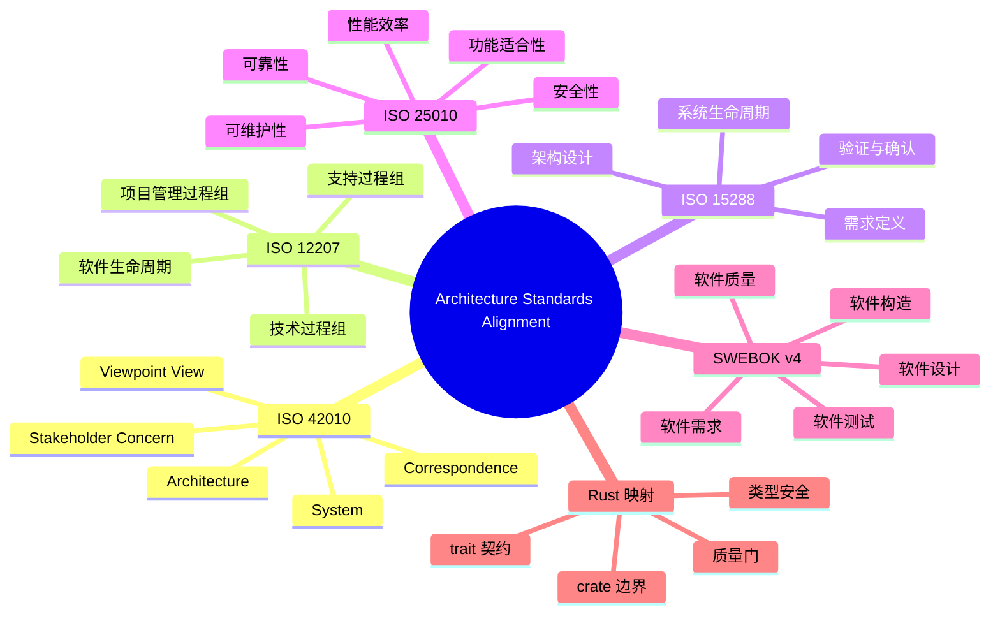

> **内容分级**: [专家级]
>
# 架构标准对齐（Architecture Standards Alignment）

> **EN**: Architecture Standards Alignment
> **Summary**: Alignment of ISO/IEC/IEEE 42010, 12207, 15288, 25010, and SWEBOK v4 with Rust concepts, engineering practices, and quality gates.

> **Rust 版本**: 1.97.0+ (Edition 2024)
> **Bloom 层级**: L5-L6
> **权威来源**: 本文件为 `concept/` 权威页。
> **定位**: 将 ISO/IEC/IEEE 42010、12207、15288、25010 与 SWEBOK v4 等国际标准映射到 Rust 工程概念、工具和质量门。
> **前置概念**: [Enterprise Architecture Frameworks](01_enterprise_architecture_frameworks.md) · [Architecture Governance and ADRs](02_architecture_governance_and_adrs.md) · [Software Architecture Formalization](../../04_formal/10_architecture_semantics/01_software_architecture_formalization.md)
> **后置概念**: [System Design Principles](../03_design_patterns/03_system_design_principles.md) · [Systems Engineering Standards](../../04_formal/09_system_semantics/06_systems_engineering_standards.md) · [Safety Boundaries](../../05_comparative/03_domain_comparisons/01_safety_boundaries.md)

---

> **来源**: [ISO/IEC/IEEE 42010:2022](https://www.iso.org/standard/74296.html) · [IEEE 1471-2000](https://standards.ieee.org/standard/1471-2000.html) · [Rust API Guidelines](https://rust-lang.github.io/api-guidelines/) · [ISO/IEC/IEEE 12207:2017](https://www.iso.org/standard/63712.html) · [ISO/IEC/IEEE 15288:2023](https://www.iso.org/standard/63711.html) · [ISO/IEC 25010:2023](https://www.iso.org/standard/78175.html) · [SWEBOK v4](https://www.computer.org/education/bodies-of-knowledge/software-engineering)

---

## 📑 目录

- [架构标准对齐（Architecture Standards Alignment）](#架构标准对齐architecture-standards-alignment)
  - [📑 目录](#-目录)
  - [一、标准概览](#一标准概览)
  - [二、ISO/IEC/IEEE 42010 架构描述概念](#二isoiecieee-42010-架构描述概念)
    - [2.1 核心概念模型](#21-核心概念模型)
    - [2.2 Rust 工程映射](#22-rust-工程映射)
  - [三、ISO/IEC/IEEE 12207 软件生命周期过程](#三isoiecieee-12207-软件生命周期过程)
  - [四、ISO/IEC/IEEE 15288 系统生命周期过程](#四isoiecieee-15288-系统生命周期过程)
  - [五、ISO/IEC 25010 质量模型](#五isoiec-25010-质量模型)
  - [六、SWEBOK v4 知识领域](#六swebok-v4-知识领域)
  - [七、Rust 映射矩阵](#七rust-映射矩阵)
  - [八、反命题与边界](#八反命题与边界)
    - [反命题：遵循标准等于高质量](#反命题遵循标准等于高质量)
    - [边界：标准无法覆盖实现细节](#边界标准无法覆盖实现细节)
  - [九、嵌入式测验（Embedded Quiz）](#九嵌入式测验embedded-quiz)
    - [测验 1：ISO/IEC/IEEE 42010 中，viewpoint 和 view 的关系是什么？（记忆层）](#测验-1isoiecieee-42010-中viewpoint-和-view-的关系是什么记忆层)
    - [测验 2：ISO/IEC/IEEE 12207 与 15288 的主要区别是什么？（理解层）](#测验-2isoiecieee-12207-与-15288-的主要区别是什么理解层)
    - [测验 3：ISO/IEC 25010 中，Rust 的所有权系统主要对应哪个质量特性？（应用层）](#测验-3isoiec-25010-中rust-的所有权系统主要对应哪个质量特性应用层)
    - [测验 4：SWEBOK v4 中，哪些知识领域与 Rust 的 trait 系统最直接相关？（应用层）](#测验-4swebok-v4-中哪些知识领域与-rust-的-trait-系统最直接相关应用层)
    - [测验 5：为什么说标准遵循不等于高质量？（分析层）](#测验-5为什么说标准遵循不等于高质量分析层)
  - [十、🧭 思维导图（Mindmap）](#十-思维导图mindmap)

---

## 一、标准概览

| 标准 | 全称 | 核心关注点 | 与 Rust 工程的关系 |
|---|---|---|---|
| **ISO/IEC/IEEE 42010:2022** | Systems and software engineering — Architecture description | 架构描述的概念、视图、视角、利益相关方 | 连接 Rust crate/module/workspace 与架构描述 |
| **ISO/IEC/IEEE 12207:2017** | Software life cycle processes | 软件开发、运维、退役全过程 | 映射到需求、设计、编码、测试、交付流程 |
| **ISO/IEC/IEEE 15288:2023** | System life cycle processes | 系统级生命周期过程 | 从系统视角补充 12207，强调需求、验证、集成 |
| **ISO/IEC 25010:2023** | Systems and software Quality Requirements and Evaluation (SQuaRE) | 软件产品质量模型 | 与 Rust 的类型安全、性能、可靠性、安全性对齐 |
| **SWEBOK v4** | Software Engineering Body of Knowledge | 软件工程知识体系 | 与 Rust 生态知识领域建立映射 |

这些标准共同构成企业级软件工程的“参考坐标系”。Rust 工程实践可以定位到这些坐标系中，从而与国际标准互操作、互审计。

---

## 二、ISO/IEC/IEEE 42010 架构描述概念

### 2.1 核心概念模型

ISO/IEC/IEEE 42010:2022 定义了架构描述的核心概念：

| 概念 | 定义 | 作用 |
|---|---|---|
| **System** 系统 | 通过其元素、元素之间的关系以及环境来界定的实体 | 被描述的对象 |
| **Architecture** 架构 | 系统的基本组织方式，体现在其组件、关系、原则与演进中 | 核心关注点 |
| **Stakeholder** 利益相关方 | 对系统或其架构有利益或关注的个人、团队或组织 | 需求来源 |
| **Concern** 关注点 | 利益相关方对系统感兴趣的主题 | 驱动视图选择 |
| **Viewpoint** 视角 | 创建视图的约定、规则与技术的规范 | 视图模板 |
| **View** 视图 | 从特定视角对架构的表达 | 架构描述制品 |
| **Correspondence** 对应关系 | 两个或多个架构元素之间的映射或关系 | 保证一致性 |
| **Architecture Description (AD)** 架构描述 | 记录架构的工件集合 | 最终交付物 |

概念关系可概括为：

```text
Stakeholder ──has──→ Concern
Concern ──addressed by──→ Viewpoint
Viewpoint ──defines──→ View
View ──expresses──→ Architecture of System
Multiple Views ──related by──→ Correspondence
Architecture Description = Views + Correspondences + Rationale
```

### 2.2 Rust 工程映射

| 42010 概念 | Rust 工程对应 | 说明 |
|---|---|---|
| System | Rust workspace / 应用系统 | 被架构描述的对象 |
| Architecture | crate 职责、模块边界、trait 契约 | 系统的基本组织 |
| Stakeholder | 产品经理、安全团队、运维、库用户 | 不同角色关注不同 |
| Concern | 性能、安全、可维护性、合规 | 驱动架构决策 |
| Viewpoint | “模块依赖视角”“API 契约视角”“依赖审计视角” | 约定视图规则 |
| View | `cargo tree` 输出、crate 图、API 文档 | 具体视图制品 |
| Correspondence | 代码与 ADR 的链接、测试与需求的追踪 | 一致性保证 |
| AD | README + ADR + 架构图 + CI 配置 | 架构描述集合 |

> **来源**: [ISO/IEC/IEEE 42010:2022](https://www.iso.org/standard/74296.html)

---

## 三、ISO/IEC/IEEE 12207 软件生命周期过程

ISO/IEC/IEEE 12207:2017 将软件生命周期过程分为四大类：

| 过程组 | 关键过程 | Rust 工程映射 |
|---|---|---|
| **协议过程组** | 采购、供应 | 依赖选型、`cargo` 依赖管理 |
| **技术过程组** | 需求、设计、实现、集成、验证、转换、确认 | `cargo test`、CI、code review |
| **项目管理过程组** | 策划、评估、控制 | Sprint 计划、里程碑、风险登记 |
| **组织/支持过程组** | 质量保证、配置管理、文档、培训 | 质量门、`git` 分支策略、文档 |

关键技术过程与 Rust 工具链的对应：

| 12207 过程 | Rust 活动 | 工具 |
|---|---|---|
| 需求分析 | 类型驱动设计、错误类型设计 | Rust 类型系统 |
| 设计 | 模块/crate/trait 设计 | `cargo check`, clippy |
| 实现 | 编码 | `rustc`, `cargo build` |
| 集成 | workspace 构建、crate 联编 | `cargo build --workspace` |
| 验证 | 单元/集成/属性测试 | `cargo test`, `cargo fuzz`, Kani |
| 确认 | 用户验收、基准测试 | `criterion`, 生产影子流量 |

---

## 四、ISO/IEC/IEEE 15288 系统生命周期过程

ISO/IEC/IEEE 15288:2023 是系统工程的顶层标准，与 12207 形成“系统-软件”互补关系：

| 15288 过程 | 关注点 | Rust 工程体现 |
|---|---|---|
| **系统需求定义** | 利益相关方需求、系统需求 | 产品 backlog、架构需求 |
| **系统架构设计** | 系统元素、接口、集成策略 | workspace 划分、crate 接口 |
| **实现** | 元素生产 | crate 实现 |
| **集成** | 元素组装 | workspace 联编、CI |
| **验证** | 系统是否满足需求 | 测试、形式化验证 |
| **确认** | 系统是否满足利益相关方 | 用户验收、生产监控 |
| **运行与维护** | 部署、监控、演化 | CI/CD、可观测性、MSRV 升级 |

15288 强调**系统思维**：软件不是孤立存在的，必须与硬件、人员、流程、数据一起考虑。Rust 工程中的系统边界可能跨越：

- 嵌入式目标（`no_std`、`embedded-hal`）
- 部署平台（容器、Serverless、WASM）
- 外部系统接口（HTTP、gRPC、消息队列）

---

## 五、ISO/IEC 25010 质量模型

ISO/IEC 25010:2023 定义了软件产品质量的八大特性：

| 特性 | 子特性（示例） | Rust 机制 |
|---|---|---|
| **功能适合性** | 功能完整性、正确性 | 类型系统、测试 |
| **性能效率** | 时间行为、资源利用 | 零成本抽象、`no_std` |
| **兼容性** | 共存、互操作 | FFI、C ABI、WASM |
| **交互性（易用性）** | 可学习性、可操作性 | API 设计、文档 |
| **可靠性** | 成熟性、可用性、容错性 | `Result`、RAII、panic 隔离 |
| **安全性** | 保密性、完整性、抗抵赖 | 所有权、`unsafe` 边界、类型安全 |
| **可维护性** | 模块化、可测试性、可修改性 | crate 边界、trait、测试 |
| **可移植性** | 适应性、可安装性 | target triple、静态链接 |

Rust 的内存安全与并发安全直接对应 **安全性** 和 **可靠性** 特性；零成本抽象对应 **性能效率**；crate 和 trait 系统对应 **可维护性**。

> **来源**: [ISO/IEC 25010:2023](https://www.iso.org/standard/78175.html)

---

## 六、SWEBOK v4 知识领域

SWEBOK v4 将软件工程知识划分为 15 个知识领域（KAs）：

| 知识领域 | 核心内容 | Rust 映射 |
|---|---|---|
| 软件需求 | 需求获取、分析、规格说明、验证 | 类型即规格、`cargo test` |
| 软件设计 | 架构设计、详细设计 | crate/module/trait 设计 |
| 软件构造 | 编码、调试、重构 | `rustc`, `rustfmt`, clippy |
| 软件测试 | 测试层级、技术 | `cargo test`, `proptest`, Kani |
| 软件维护 | 演化、再工程 | 版本管理、edition 迁移 |
| 软件配置管理 | 版本控制、变更管理 | `git`, `cargo` |
| 软件工程管理 | 计划、度量、风险 | 项目管理、质量门 |
| 软件过程 | 生命周期模型、过程改进 | ADM、12207/15288 |
| 软件工程模型与方法 | 形式化、仿真、原型 | TLA+、类型系统 |
| 软件质量 | 质量模型、保证 | 25010、质量门 |
| 软件安全 | 安全工程、威胁建模 | `unsafe` 审计、cargo-audit |
| 软件工程专业实践 | 伦理、沟通、团队 | 工程文化 |
| 软件工程经济学 | 成本、价值分析 | ROI、技术雷达 |
| 计算基础 | 算法、数据结构、复杂度 | Rust 标准库 |
| 数学基础 | 逻辑、集合、图论 | 形式化方法基础 |

---

## 七、Rust 映射矩阵

将 ISO 标准与 SWEBOK 映射到 Rust 概念和工具：

| 标准 / 知识领域 | Rust 概念 | Rust 工具/机制 | 质量门 |
|---|---|---|---|
| 42010 架构描述 | crate, module, trait | `cargo doc`, workspace | `check_metadata_consistency.py` |
| 12207 实现 | 类型、泛型、错误处理 | `rustc`, `cargo build` | `cargo check --workspace` |
| 15288 验证 | 属性测试、形式化验证 | `proptest`, Kani, Miri | `check_concept_code_blocks.py` |
| 25010 安全性 | 所有权、借用、`unsafe` | `cargo audit`, clippy | `cargo audit --no-fetch` |
| 25010 可靠性 | `Result`, RAII, panic 边界 | `cargo test`, `catch_unwind` | `cargo test --workspace` |
| 25010 性能效率 | 零成本抽象、`no_std` | `criterion`, `cargo bench` | 基准测试 |
| SWEBOK 软件设计 | 架构模式、设计原则 | workspace, trait | `check_canonical_uniqueness.py` |
| SWEBOK 软件质量 | 质量模型、静态分析 | clippy, `cargo vet` | `cargo clippy`, `cargo vet --locked` |

---

## 八、反命题与边界

### 反命题：遵循标准等于高质量

遵循标准是**必要条件**，不是**充分条件**。标准提供描述框架和检查清单，但不能替代：

- 对具体业务领域的理解；
- 对 Rust 类型系统和并发模型的深入掌握；
- 对性能、安全、可靠性进行定量验证的实际工作。

一个通过了 ISO 文档审查的项目，仍可能写出线程不安全的代码；一个 Rust 项目即使完全符合 MSRV 策略，仍可能在 unsafe 边界处引入未定义行为。

### 边界：标准无法覆盖实现细节

ISO 标准和 SWEBOK 停留在**过程**和**概念**层面，不会规定：

- 应该用 `tokio` 还是 `async-std`；
- 某个具体算法应使用泛型还是 trait object；
- 错误处理应使用 `thiserror` 还是手写枚举。

这些属于工程判断，应由 ADR、技术雷达和团队规范来补充。

---

## 九、嵌入式测验（Embedded Quiz）

### 测验 1：ISO/IEC/IEEE 42010 中，viewpoint 和 view 的关系是什么？（记忆层）

**题目**: 在 42010 中，viewpoint 与 view 有何区别？

<details>
<summary>✅ 答案与解析</summary>

Viewpoint 是创建视图的约定、规则和技术规范（模板）；view 是根据 viewpoint 实际产出的架构表达（制品）。一个 viewpoint 可以实例化多个 view。
</details>

---

### 测验 2：ISO/IEC/IEEE 12207 与 15288 的主要区别是什么？（理解层）

**题目**: 12207 和 15288 分别关注哪个层次的生命周期？

<details>
<summary>✅ 答案与解析</summary>

12207 关注软件生命周期过程；15288 关注系统生命周期过程，范围更广，涵盖硬件、人员、流程等系统元素。二者互补，15288 提供系统视角，12207 提供软件视角。
</details>

---

### 测验 3：ISO/IEC 25010 中，Rust 的所有权系统主要对应哪个质量特性？（应用层）

**题目**: Rust 的内存安全与并发安全机制主要对应 25010 的哪两个质量特性？

<details>
<summary>✅ 答案与解析</summary>

主要对应**安全性**（Security，包含完整性、保密性）和**可靠性**（Reliability，包含成熟性、容错性）。所有权和借用检查在编译期排除 UAF、DF 和数据竞争，直接支撑这两个特性。
</details>

---

### 测验 4：SWEBOK v4 中，哪些知识领域与 Rust 的 trait 系统最直接相关？（应用层）

**题目**: SWEBOK v4 的哪两个知识领域与 Rust 的 trait / crate 设计最直接对应？

<details>
<summary>✅ 答案与解析</summary>

**软件设计**（架构设计、详细设计）和**软件构造**（编码、重构）。Trait 对应设计中的接口契约与多态；crate/module 边界对应架构设计与构造中的模块化组织。
</details>

---

### 测验 5：为什么说标准遵循不等于高质量？（分析层）

**题目**: 一个项目的文档完全符合 ISO 42010，是否意味着它的代码一定没有安全漏洞？为什么？

<details>
<summary>✅ 答案与解析</summary>

不一定。标准关注架构描述的完整性和过程规范，而安全漏洞往往出现在实现细节（如 unsafe 使用、FFI 边界、并发协议错误）。标准遵循是必要但不充分条件，必须与代码级验证（测试、审计、形式化方法）结合。
</details>

---

## 十、🧭 思维导图（Mindmap）



---

> **来源**: [ISO/IEC/IEEE 42010:2022](https://www.iso.org/standard/74296.html) · [ISO/IEC/IEEE 12207:2017](https://www.iso.org/standard/63712.html) · [ISO/IEC/IEEE 15288:2023](https://www.iso.org/standard/63711.html) · [ISO/IEC 25010:2023](https://www.iso.org/standard/78175.html) · [SWEBOK v4](https://www.computer.org/education/bodies-of-knowledge/software-engineering)
