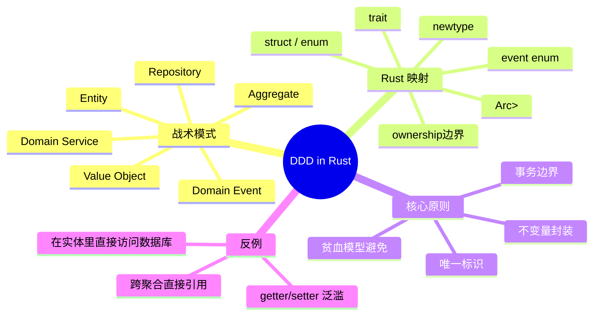

> **Summary**: A practical mapping of DDD tactical patterns — entities, value objects, aggregates, domain services, repositories, and domain events — to Rust's ownership, type system, and trait mechanisms.
> **内容分级**: [专家级]

# 领域驱动设计（DDD）在 Rust 中的战术模式

**EN**: Domain-Driven Design Tactical Patterns in Rust

> **Rust 版本**: 1.97.0+ (Edition 2024)
> **Bloom 层级**: L5-L6
> **权威来源**: 本文件为 `concept/` 权威页。
> **定位**: 将 Eric Evans 与 Vaughn Vernon 的 DDD 战术设计模式与 Rust 的类型系统、所有权和错误处理模型对齐，提供可在生产代码中落地的实现策略。
> **前置概念**: [Enterprise Architecture Frameworks](01_enterprise_architecture_frameworks.md) · [Architecture Governance and ADRs](02_architecture_governance_and_adrs.md) · [Type System](../../01_foundation/02_type_system/01_type_system.md) · [Error Handling](../../01_foundation/08_error_handling/01_error_handling_basics.md) · [Paradigm Matrix](../../05_comparative/00_paradigms/01_paradigm_matrix.md)
> **后置概念**: [System Design Principles](../03_design_patterns/03_system_design_principles.md) · [Microservice Template](../../../examples/microservice_template.rs) · [CQRS and Event Sourcing](../03_design_patterns/07_cqrs_event_sourcing.md)

---

> **来源**: [Evans 2003 — *Domain-Driven Design*](https://www.oreilly.com/library/view/domain-driven-design-tackling/0321125215/) · [Vernon 2016 — *Implementing Domain-Driven Design*](https://www.oreilly.com/library/view/implementing-domain-driven-design/9780133039900/) · [Fowler 2005 — Anemic Domain Model](https://martinfowler.com/bliki/AnemicDomainModel.html) · [Rust Design Patterns](https://rust-unofficial.github.io/patterns/)

> **权威来源 / Provenance**: 本节领域驱动设计战术模式与 Eric Evans (2003) 的 *Domain-Driven Design* 对齐；核心概念（限界上下文、聚合、领域事件、仓储）的免费摘要参见 InfoQ minibook。
>
> - **Evans (2003)** — *Domain-Driven Design: Tackling Complexity in the Heart of Software*. Addison-Wesley. [O'Reilly](https://www.oreilly.com/library/view/domain-driven-design-tackling/0321125215/) · [InfoQ summary](https://www.infoq.com/minibooks/domain-driven-design-quickly/)

---

DDD bounded context → Cargo workspace 映射决策表：

```text
| DDD 概念         | 组织含义               | Rust workspace 映射                | 边界规则                              |
|------------------|------------------------|------------------------------------|---------------------------------------|
| Bounded Context  | 独立语义与发布边界     | 一个 workspace member crate        | 跨 context 仅通过共享事件/ID 通信     |
| Aggregate        | 一致性边界             | crate 内的一个模块 + 聚合根 struct | 外部只持有根 ID，不引用内部实体       |
| Domain Event     | 跨聚合/上下文通信      | enum OrderEvent + message bus      | 事件类型定义在共享契约 crate          |
| Repository       | 持久化抽象             | trait OrderRepository              | 端口定义在领域 crate，适配器在外围 crate|
| Shared Kernel    | 跨 context 共享子域    | 独立的 shared-kernel crate         | 变更需所有 context 维护者同意         |
```

> 说明：该表说明 Evans 提出的战略/战术模式可自然映射到 Rust workspace 的 crate 边界与 trait 端口；bounded context 对应独立编译与发布单元。

---

## 🧠 知识结构图



---

## 一、核心模式映射

### 1.1 值对象（Value Object）

值对象由属性定义，没有概念上的标识，**不可变**且通过相等比较。

```rust
#[derive(Debug, Clone, Copy, PartialEq, Eq, Hash)]
pub struct Money {
    amount: i64, // 以最小货币单位存储，避免浮点误差
    currency: Currency,
}

#[derive(Debug, Clone, Copy, PartialEq, Eq, Hash)]
pub enum Currency {
    Cny,
    Usd,
    Eur,
}

impl Money {
    pub fn new(amount: i64, currency: Currency) -> Self {
        Self { amount, currency }
    }

    pub fn add(self, other: Money) -> Result<Money, &'static str> {
        if self.currency != other.currency {
            return Err("currency mismatch");
        }
        Ok(Money::new(self.amount + other.amount, self.currency))
    }
}
```

> **Rust 优势**: `#[derive(PartialEq, Eq, Hash, Copy, Clone)]` 让值对象天然满足不变性和值语义。

### 1.2 实体（Entity）

实体有唯一标识，即使属性相同也不相等。

```rust,ignore
#[derive(Debug, Clone)]
pub struct Order {
    id: OrderId,
    items: Vec<OrderLine>,
}

#[derive(Debug, Clone, PartialEq, Eq, Hash)]
pub struct OrderId(uuid::Uuid);

impl OrderId {
    pub fn new() -> Self { Self(uuid::Uuid::new_v4()) }
}

impl Order {
    pub fn new() -> Self {
        Self { id: OrderId::new(), items: vec![] }
    }

    pub fn add_item(&mut self, product: ProductId, qty: u32, price: Money) {
        self.items.push(OrderLine { product, qty, price });
    }

    pub fn total(&self) -> Result<Money, &'static str> {
        self.items.iter()
            .map(|line| line.price.multiply(line.qty))
            .reduce(|acc, next| acc?.add(next?))
            .unwrap_or(Ok(Money::new(0, Currency::Cny)))
    }
}

pub struct OrderLine {
    product: ProductId,
    qty: u32,
    price: Money,
}

#[derive(Debug, Clone, PartialEq, Eq, Hash)]
pub struct ProductId(uuid::Uuid);
```

### 1.3 聚合（Aggregate）与聚合根

聚合是一致性边界，外部对象只能引用聚合根。Rust 的所有权系统天然支持这一边界。

```rust,ignore
pub struct OrderAggregate {
    root: Order,
    // 领域事件在事务边界内累积，提交后清空
    domain_events: Vec<OrderEvent>,
}

impl OrderAggregate {
    pub fn new() -> Self {
        let root = Order::new();
        let id = root.id.clone();
        let mut agg = Self { root, domain_events: vec![] };
        agg.record_event(OrderEvent::OrderCreated { order_id: id });
        agg
    }

    pub fn add_item(&mut self, product: ProductId, qty: u32, price: Money) {
        self.root.add_item(product, qty, price);
        self.record_event(OrderEvent::ItemAdded {
            order_id: self.root.id.clone(),
            product,
            qty,
        });
    }

    pub fn take_events(&mut self) -> Vec<OrderEvent> {
        std::mem::take(&mut self.domain_events)
    }

    fn record_event(&mut self, event: OrderEvent) {
        self.domain_events.push(event);
    }
}

#[derive(Debug, Clone)]
pub enum OrderEvent {
    OrderCreated { order_id: OrderId },
    ItemAdded { order_id: OrderId, product: ProductId, qty: u32 },
}
```

### 1.4 仓储（Repository）

仓储抽象持久化，使聚合不依赖具体存储技术。

```rust,ignore
use std::collections::HashMap;

pub trait OrderRepository {
    fn by_id(&self, id: &OrderId) -> Option<Order>;
    fn save(&mut self, order: OrderAggregate);
}

pub struct InMemoryOrderRepository {
    store: HashMap<OrderId, Order>,
}

impl OrderRepository for InMemoryOrderRepository {
    fn by_id(&self, id: &OrderId) -> Option<Order> {
        self.store.get(id).cloned()
    }

    fn save(&mut self, aggregate: OrderAggregate) {
        let events = aggregate.take_events();
        // 真实系统：持久化事件 + 快照
        self.store.insert(aggregate.root.id.clone(), aggregate.root);
    }
}
```

### 1.5 领域服务（Domain Service）

当领域逻辑不属于某个实体或值对象时，使用无状态领域服务。

```rust,ignore
pub struct PricingService;

impl PricingService {
    pub fn discount_for_vip(order: &Order, customer: &Customer) -> Money {
        let total = order.total().unwrap_or(Money::new(0, Currency::Cny));
        if customer.is_vip() {
            total.multiply_percent(90) // 9 折
        } else {
            total
        }
    }
}

pub struct Customer { vip: bool }
impl Customer {
    pub fn is_vip(&self) -> bool { self.vip }
}
```

---

## 二、Rust 特有事宜

### 2.1 错误处理与领域不变量

使用 `Result` 而非异常表达领域规则违反。

```rust,compile_fail
// 非法：把不变量交给调用者维护。
impl Order {
    pub fn set_items(&mut self, items: Vec<OrderLine>) {
        self.items = items; // 可能破坏不变量
    }
}
```

正确做法：把不变量封装在构造/修改方法中。

```rust,ignore
impl Order {
    pub fn approve(&mut self) -> Result<(), &'static str> {
        if self.items.is_empty() {
            return Err("cannot approve an empty order");
        }
        // ...
        Ok(())
    }
}
```

### 2.2 跨聚合引用

聚合之间通过 ID 引用，避免直接持有所有权。

```rust,compile_fail
// 非法：聚合根直接持有另一个聚合根。
pub struct Order {
    customer: Customer, // 应该是 CustomerId
}
```

正确做法：

```rust,ignore
pub struct Order {
    customer_id: CustomerId,
}
```

---

## 三、反命题与边界

- **反命题 1**：DDD 只适用于微服务。事实：单体代码同样需要聚合边界。
- **反命题 2**：所有业务逻辑都应放进实体。事实：跨实体的协调逻辑应放入领域服务。
- **边界**：DDD 不解决技术选型，只提供问题空间与解空间的对齐语言。

---

## 四、国际权威参考

- **P1 学术/方法学**
  - [Evans 2003 — *Domain-Driven Design*](https://www.oreilly.com/library/view/domain-driven-design-tackling/0321125215/)
  - [Vernon 2016 — *Implementing Domain-Driven Design*](https://www.oreilly.com/library/view/implementing-domain-driven-design/9780133039900/)
  - [Fowler 2005 — Anemic Domain Model](https://martinfowler.com/bliki/AnemicDomainModel.html)

- **P0 官方/生态**
  - [Rust Design Patterns](https://rust-unofficial.github.io/patterns/)
  - [Rust By Example — Enums](https://doc.rust-lang.org/rust-by-example/custom_types/enum.html)

- **P2 社区**
  - [DDD Crew GitHub](https://github.com/ddd-crew)
  - [Rust Internals — Domain Modeling](https://internals.rust-lang.org/)
  - [ddd — crates.io](https://crates.io/crates/ddd)
  - [ddd — docs.rs](https://docs.rs/ddd)

- **P1 学术/方法学（扩展）**
  - [Patterns on Deriving APIs and their Endpoints from Domain Models](https://dl.acm.org/doi/fullHtml/10.1145/3489449.3489976) — ACM, 2021（基于战略/战术 DDD 模式进行 API 端点推导）
  - [Domain-Driven Design for Microservices Architecture Systems Development: A Systematic Mapping Study](https://ieeexplore.ieee.org/document/10568262/) — IEEE, 2023

---

## 嵌入式测验

> **Q1**. DDD 中值对象与实体的根本区别是什么？
>
> - A. 值对象有 ID
> - B. 实体有唯一标识
> - C. 实体不可变
> - D. 没有区别
>
> <details><summary>答案</summary>B. 实体通过唯一标识区分；值对象通过属性值相等区分。</details>

> **Q2**. 在 Rust 中实现聚合根时，领域事件通常如何管理？
>
> - A. 直接写入数据库
> - B. 在聚合内部累积，提交后取出
> - C. 通过全局变量广播
> - D. 用 `unsafe` 修改
>
> <details><summary>答案</summary>B. 聚合内部累积事件，仓储保存时取出并分发/持久化。</details>
