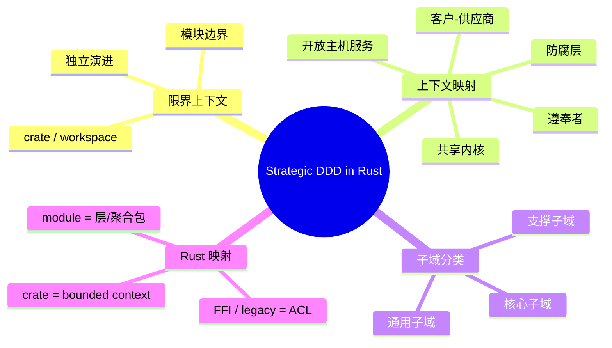

> **内容分级**: [专家级]

# 战略领域驱动设计（Strategic DDD）在 Rust 中的实践

**EN**: Strategic Domain-Driven Design in Rust
**Summary**: A practical mapping of Strategic DDD patterns — bounded context, context mapping, subdomain classification, and anti-corruption layers — to Rust crates, workspaces, modules, and FFI boundaries.

> **Rust 版本**: 1.97.1+ (Edition 2024)
> **Bloom 层级**: L5-L7
> **权威来源**: 本文件为 `concept/` 权威页。
> **定位**: 与 [`04_domain_driven_design_in_rust.md`](04_domain_driven_design_in_rust.md)（战术模式）互补，聚焦 DDD 战略设计在 Rust 工程结构中的落地。
> **前置概念**: [Enterprise Architecture Frameworks](01_enterprise_architecture_frameworks.md) · [Architecture Governance and ADRs](02_architecture_governance_and_adrs.md) · [Software Architecture Formalization](../../04_formal/10_architecture_semantics/01_software_architecture_formalization.md) · [Language Semantic Model Matrix](../../05_comparative/00_paradigms/05_language_semantic_model_matrix.md) · [Domain-Driven Design Tactical Patterns](04_domain_driven_design_in_rust.md) · [Modules and Paths](../../01_foundation/07_modules_and_items/01_modules_and_paths.md)
> **后置概念**: [System Design Principles](../03_design_patterns/03_system_design_principles.md) · [CQRS and Event Sourcing](../03_design_patterns/07_cqrs_event_sourcing.md) · [Rust FFI](../../03_advanced/04_ffi/01_rust_ffi.md)

---

> **来源**: [Evans 2003 — *Domain-Driven Design*](https://www.oreilly.com/library/view/domain-driven-design-tackling/0321125215/) · [Vernon 2016 — *Implementing Domain-Driven Design*](https://www.oreilly.com/library/view/implementing-domain-driven-design/9780133039900/) · [DDD Crew — Bounded Context Canvas](https://github.com/ddd-crew/bounded-context-canvas) · [ISO/IEC/IEEE 42010:2022](https://www.iso.org/standard/74296.html) · [TOGAF Standard 10th Edition](https://www.opengroup.org/togaf)

---

## 🧠 知识结构图



---

## 一、限界上下文（Bounded Context）

**限界上下文**是语义一致性的边界。在同一个边界内，领域术语（ubiquitous language）具有精确、无歧义的含义；跨边界时，同一词汇可能对应不同模型。

### 1.1 为什么需要显式边界？

| 问题 | 无边界时 | 有限界上下文时 |
|---|---|---|
| 术语冲突 | `Order` 在销售、库存、物流中含义不同，导致数据库表/结构体被滥用 | 每个上下文有自己的 `sales::Order`、`inventory::Order`、`shipping::Order` |
| 耦合演进 | 修改一个业务模块引发不相关模块编译失败 | 跨上下文通过稳定接口交互，内部模型自由重构 |
| 团队并行 | 多团队共享单体，代码冲突频繁 | 每个团队 owning 一个上下文，通过 CI 契约集成 |

### 1.2 Rust 中的边界映射

在 Rust 工程中，**crate 是最自然的限界上下文**；workspace 内的多个 crate 则构成上下文群落。

```text
my_workspace/
  Cargo.toml
  crates/
    sales/           # Bounded Context: Sales
      src/lib.rs
      src/order.rs
    inventory/       # Bounded Context: Inventory
      src/lib.rs
      src/order.rs   # 同名不同模型，互不冲突
    shipping/        # Bounded Context: Shipping
      src/lib.rs
      src/shipment.rs
```

> **关键洞察**: Rust 的 crate 级隐私与模块系统天然支持限界上下文。`pub(crate)` 与 `pub` 的区分，对应“上下文内部实现细节”与“对外发布语言”。

---

## 二、上下文映射（Context Mapping）

上下文映射描述限界上下文之间的协作关系。Eric Evans 定义了多种模式；Vaughn Vernon 在 *Implementing DDD* 中进一步系统化。

### 2.1 常见映射模式

| 模式 | 权力关系 | Rust 工程体现 | 适用场景 |
|---|---|---|---|
| **Partnership（合作关系）** | 双向协商 | 两个 crate 互相依赖或共享内部 trait | 两个核心团队紧密协作 |
| **Shared Kernel（共享内核）** | 共同拥有 | workspace 中的 `common` crate，包含 `CustomerId`、`Money` 等共享值对象 | 多个上下文必须共享同一模型子集 |
| **Customer-Supplier（客户-供应商）** | 供应商主导，客户有优先级影响力 | `inventory` crate 提供稳定 API，`sales` 作为客户使用 | 上游团队有能力满足下游需求 |
| **Conformist（遵奉者）** | 上游主导，下游被动接受 | 直接依赖上游 crate 的公共类型 | 上游是外部标准或遗留系统 |
| **Anti-Corruption Layer（防腐层，ACL）** | 下游通过适配器隔离上游 | 在 `sales` 中定义 `LegacyInventoryAdapter`，不直接暴露上游类型 | 上游模型混乱或与下游语言冲突 |
| **Open Host Service（开放主机服务）** | 上游提供明确、稳定的公开协议 | gRPC/REST schema、事件总线接口 | 需要向多个下游暴露能力 |
| **Published Language（发布语言）** | 共享序列化/交互格式 | JSON schema、Protobuf、Avro、共享 event enum | 跨上下文通信需要中性格式 |
| **Separate Ways（各行其道）** | 无集成 | 完全独立的 crate，无依赖 | 功能重叠但无需协作 |

### 2.2 防腐层示例

假设 `inventory` 上下文返回的 `StockLevel` 模型与 `sales` 的 `AvailableQuantity` 语言不一致，应在 `sales` 中建立 ACL，而不是让 `sales` 直接依赖 `inventory` 的内部类型。

```rust,ignore
// sales/src/inventory_acl.rs
use inventory::StockLevel; // 上游类型只出现在 ACL 内部

pub struct AvailableQuantity(pub u32);

pub struct InventoryAcl;

impl InventoryAcl {
    pub fn check_availability(stock: StockLevel) -> AvailableQuantity {
        // 转换上游模型为下游语言
        AvailableQuantity(stock.on_hand.saturating_sub(stock.reserved))
    }
}
```

> **关键洞察**: ACL 不是简单的 DTO 转换，而是**语义翻译**。它保护下游上下文不被上游的术语、不变量、演进节奏污染。

---

## 三、子域分类（Subdomain Classification）

领域可划分为三类子域，决定投资优先级与战略设计重点。

| 类型 | 定义 | 工程策略 | Rust 示例 |
|---|---|---|---|
| **核心子域（Core Domain）** | 企业竞争优势所在，最复杂、最具差异化 | 投入最佳人才、最严格建模、可能使用形式化验证 | 高频交易撮合引擎、自动驾驶规划器 |
| **支撑子域（Supporting Subdomain）** | 业务必需但非差异化，可定制 | 自研或外包，保持可维护性 | 内部审批工作流、报表生成 |
| **通用子域（Generic Subdomain）** | 行业通用能力，不创造竞争优势 | 优先使用成熟 crate/SaaS | 身份认证、日志、监控、支付网关集成 |

### 3.1 与限界上下文的关系

- 一个子域可以包含多个限界上下文。
- 一个限界上下文通常主要服务于一个子域，但可能跨越边界。
- **核心子域的边界应最小化对外部上下文的依赖**，以降低认知负荷与演进阻力。

---

## 四、战略 DDD 与架构模式的结合

| 架构模式 | 与 Strategic DDD 的关系 | Rust 落地要点 |
|---|---|---|
| **Clean Architecture / Onion** | 限界上下文内部采用分层，领域核心独立于框架 | `domain` 模块不依赖 `infrastructure` 模块 |
| **Hexagonal Architecture** | 端口-适配器对应上下文映射中的 ACL / Open Host Service | 用 trait 定义端口，crate 实现适配器 |
| **Microservices** | 每个服务 ≈ 一个限界上下文 | workspace crate → 独立 deployable 服务 |
| **Event-Driven / CQRS-ES** | 上下文间通过领域事件异步集成 | `domain_event` enum + message bus |

---

## 五、反例与边界

- **反命题 1**：限界上下文应该尽可能小。事实：过小会导致集成成本爆炸；边界应由语义一致性和团队所有权决定。
- **反命题 2**：所有 crate 都应该对应一个限界上下文。事实：crate 也可能按技术分层（如 `shared-kernel`），但应避免技术分层污染业务边界。
- **反命题 3**：防腐层只用于遗留系统。事实：任何上游模型与下游语言不一致时都应使用 ACL，包括第三方 crate 和内部不稳定模块。
- **边界**：Strategic DDD 不提供算法或实现细节；它需要与战术 DDD、架构决策、团队协作模式结合使用。

---

## 六、国际权威参考

- **P1 学术/方法学**
  - [Evans 2003 — *Domain-Driven Design*](https://www.oreilly.com/library/view/domain-driven-design-tackling/0321125215/)
  - [Vernon 2016 — *Implementing Domain-Driven Design*](https://www.oreilly.com/library/view/implementing-domain-driven-design/9780133039900/)
  - [ISO/IEC/IEEE 42010:2022 — Systems and software engineering](https://www.iso.org/standard/74296.html)
  - [TOGAF Standard 10th Edition](https://www.opengroup.org/togaf)
  - [Özkan et al. 2023 — Domain-Driven Design in Software Development: A Systematic Literature Review](https://arxiv.org/abs/2310.01905)
  - [Landre et al. 2006 — Architectural improvement by use of strategic level domain-driven design](https://dl.acm.org/doi/10.1145/1176617.1176728)
  - [Kapferer & Zimmermann 2020 — Domain-specific Language and Tools for Strategic Domain-driven Design, Context Mapping and Bounded Context Modeling](https://doi.org/10.5220/0008910502990306)

- **P0 官方/生态**
  - [The Rust Reference — Crates and Source Files](https://doc.rust-lang.org/reference/crates-and-source-files.html)
  - [Cargo Workspaces](https://doc.rust-lang.org/cargo/reference/workspaces.html)
  - [The Rust Reference — Modules](https://doc.rust-lang.org/reference/items/modules.html)

- **P2 社区**
  - [DDD Crew GitHub](https://github.com/ddd-crew)
  - [DDD Europe — Bounded Context Canvas](https://github.com/ddd-crew/bounded-context-canvas)

---

## 嵌入式测验

> **Q1**. 在 Rust workspace 中，最自然的限界上下文边界是什么？
>
> - A. 单个函数
> - B. 单个模块
> - C. 单个 crate
> - D. 整个 workspace
>
> <details><summary>答案</summary>C. crate 提供编译隔离、独立版本演进和语义边界，是限界上下文的自然映射。</details>

> **Q2**. 当上游模型与下游 ubiquitous language 不一致时，应优先使用哪种上下文映射模式？
>
> - A. Shared Kernel
> - B. Anti-Corruption Layer
> - C. Conformist
> - D. Separate Ways
>
> <details><summary>答案</summary>B. Anti-Corruption Layer 通过适配器隔离上游模型，保护下游上下文的语义一致性。</details>


## 补充国际权威来源（P1/P2 覆盖）

- [axum on crates.io](https://crates.io/crates/axum)
- [axum docs](https://docs.rs/axum/latest/axum/)
- [serde on crates.io](https://crates.io/crates/serde)
- [tokio on crates.io](https://crates.io/crates/tokio)
