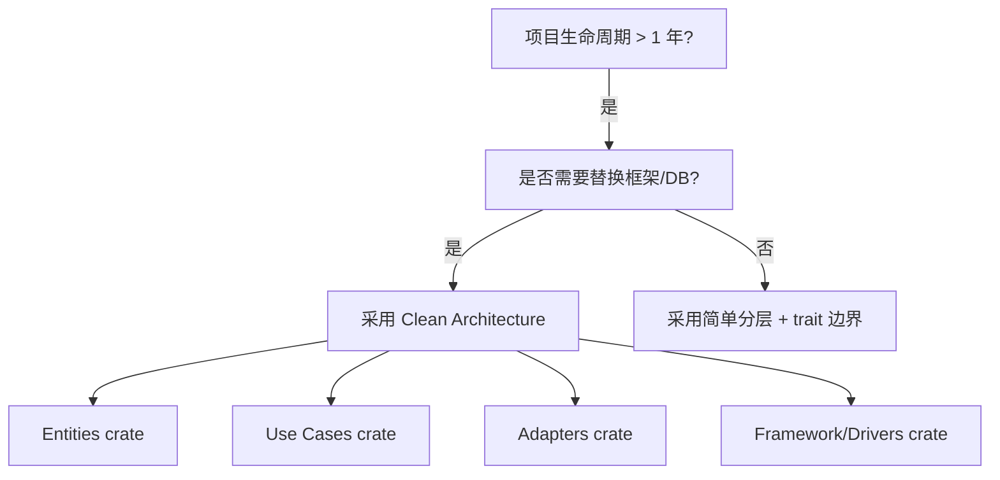
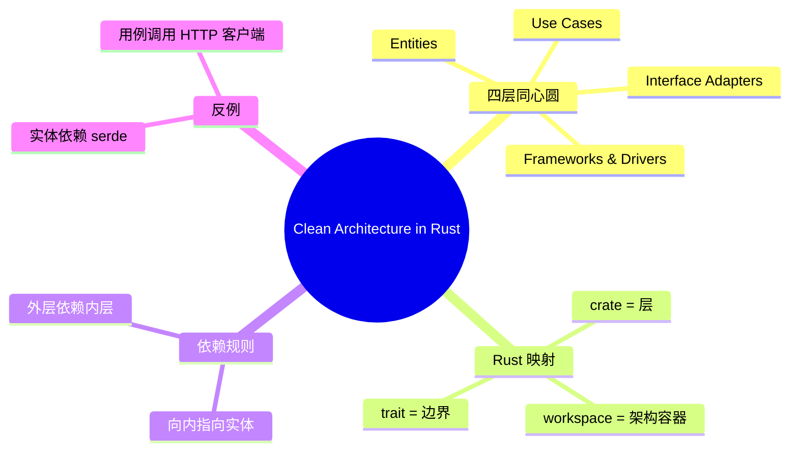

> **内容分级**: [专家级]

# 整洁架构在 Rust 中的实践（Clean Architecture）

**EN**: Clean Architecture in Rust
**Summary**: Apply Robert C. Martin's Clean Architecture dependency rule to Rust workspaces, using traits for boundaries and crate layers for framework isolation.

> **Rust 版本**: 1.97.0+ (Edition 2024)
> **Bloom 层级**: L6
> **权威来源**: 本文件为 `concept/` 权威页。
> **定位**: 将 Robert C. Martin 的 Clean Architecture 与 Rust 的工程结构（workspace、crate、trait、模块可见性）对齐，明确依赖方向与测试策略。
> **前置概念**: [Enterprise Architecture Frameworks](01_enterprise_architecture_frameworks.md) · [Hexagonal / Ports & Adapters](../03_design_patterns/25_hexagonal_ports_and_adapters.md) · [DDD Tactical Patterns](04_domain_driven_design_in_rust.md) · [Comparative Layer README](../../05_comparative/README.md)
> **后置概念**: [Microservices Patterns in Rust](08_microservices_patterns_in_rust.md) · [Repository and Unit of Work](../03_design_patterns/24_repository_and_unit_of_work.md)

---

> **来源 / Provenance**:
> [Martin 2017 — *Clean Architecture: A Craftsman's Guide to Software Structure and Design*](https://www.oreilly.com/library/view/clean-architecture-a/9780134494272/) ·
> [Martin 2012 — The Clean Architecture](https://blog.cleancoder.com/uncle-bob/2012/08/13/the-clean-architecture.html) ·
> [ISO/IEC/IEEE 42010:2022](https://www.iso.org/standard/74296.html) ·
> [Rust Design Patterns](https://rust-unofficial.github.io/patterns/)

---

## 一、权威定义

**Clean Architecture**: 由 Robert C. Martin 提出，核心规则是**依赖关系向内指向用例与实体**。外层（框架、驱动）依赖内层；内层不依赖外层。典型同心圆分层：

1. **Entities（实体）**: 企业级业务规则。
2. **Use Cases（用例）**: 应用特定的业务规则。
3. **Interface Adapters（接口适配器）**: 将用例数据转换为外层可消费的格式。
4. **Frameworks & Drivers（框架与驱动）**: Web 框架、数据库、UI、外部设备等。

> **来源**: [Martin 2012 — The Clean Architecture](https://blog.cleancoder.com/uncle-bob/2012/08/13/the-clean-architecture.html) · [Martin 2017](https://www.oreilly.com/library/view/clean-architecture-a/9780134494272/)

---

## 二、Rust Workspace 映射

| Clean Architecture 层 | Rust 结构 | 依赖方向 |
|:---|:---|:---|
| Entities | `crates/entities` 或 `domain/` | 不依赖任何其他 crate |
| Use Cases | `crates/use_cases` | 依赖 entities |
| Interface Adapters | `crates/adapters` | 依赖 use_cases + entities |
| Frameworks & Drivers | `crates/api` / `crates/db` / `crates/cli` | 依赖 adapters + use_cases + entities |

```text
frameworks_and_drivers/
├── api/          # axum/actix-web handlers
├── db/           # sqlx/diesel implementations
└── cli/          # clap commands
interface_adapters/
├── controllers/  # 输入适配器
└── presenters/   # 输出适配器
use_cases/
└── order/        # 用例编排
entities/
└── domain/       # 纯业务规则
```

---

## 三、依赖方向实现

### 3.1 内层 trait 作为边界

```rust,ignore
// crates/entities/src/lib.rs
pub struct Order { /* ... */ }

// crates/use_cases/src/ports.rs
pub trait OrderRepository: Send + Sync {
    async fn by_id(&self, id: &OrderId) -> Option<Order>;
}

// crates/use_cases/src/order_use_case.rs
pub struct PlaceOrderUseCase<R: OrderRepository> {
    repo: R,
}
```

### 3.2 外层适配器实现 trait

```rust,ignore
// crates/db/src/postgres.rs
use entities::Order;
use use_cases::ports::OrderRepository;

pub struct PostgresOrderRepository { pool: PgPool }

impl OrderRepository for PostgresOrderRepository {
    async fn by_id(&self, id: &OrderId) -> Option<Order> { /* ... */ }
}
```

---

## 四、关系

- **Clean Architecture ↔ Hexagonal**: 两者都强调内向依赖；Clean Architecture 明确四层同心圆，Hexagonal 强调端口/适配器。
- **Clean Architecture ↔ DDD**: Entities 层对应 DDD 的聚合与值对象；Use Cases 层对应应用服务。
- **Clean Architecture ↔ Onion Architecture**: 两者是同一思想的不同表述；Onion 更强调领域模型在中心。

---

## 五、反例与边界

### 反例：内层依赖外层框架

```rust,ignore
// ❌ 错误：entities crate 依赖 serde 用于序列化
// crates/entities/Cargo.toml
[dependencies]
serde = { version = "1", features = ["derive"] }
```

**修正**: 序列化属于接口适配器或框架层；实体 crate 应保持最小依赖。需要序列化时，在外层定义 DTO 并做映射。

### 边界：过度分层

对于小型项目，四层 workspace 可能过重。可合并 Entities 与 Use Cases 为一个 `domain` crate，但需保持依赖向内。

---

## 六、决策树



---

## 七、思维导图



---

## 八、权威来源索引

- Martin, R. C. "The Clean Architecture." *Clean Coder Blog*, 2012. [https://blog.cleancoder.com/uncle-bob/2012/08/13/the-clean-architecture.html](https://blog.cleancoder.com/uncle-bob/2012/08/13/the-clean-architecture.html)
- Martin, R. C. *Clean Architecture: A Craftsman's Guide to Software Structure and Design*. Prentice Hall, 2017.
- ISO/IEC/IEEE. *ISO/IEC/IEEE 42010:2022, Software, systems and enterprise — Architecture description*. 2022.
- [Rust Design Patterns](https://rust-unofficial.github.io/patterns/)

> **文档版本**: 1.0 ｜ **最后更新**: 2026-07-31 ｜ **状态**: ✅ 新建权威页

## P0 官方来源（P0 Official Rust Authority Sources）

- [Cargo Workspaces — doc.rust-lang.org](https://doc.rust-lang.org/cargo/reference/workspaces.html)
- [The Rust Reference: Traits — doc.rust-lang.org](https://doc.rust-lang.org/reference/items/traits.html)
- [The Rust Reference: Modules and Visibility — doc.rust-lang.org](https://doc.rust-lang.org/reference/items/modules.html)

## 国际化权威来源补充（International Authority Sources）

- https://dl.acm.org/doi/book/10.5555/186897

## 国际化权威来源补充（International Authority Sources）

- https://blog.rust-lang.org/
