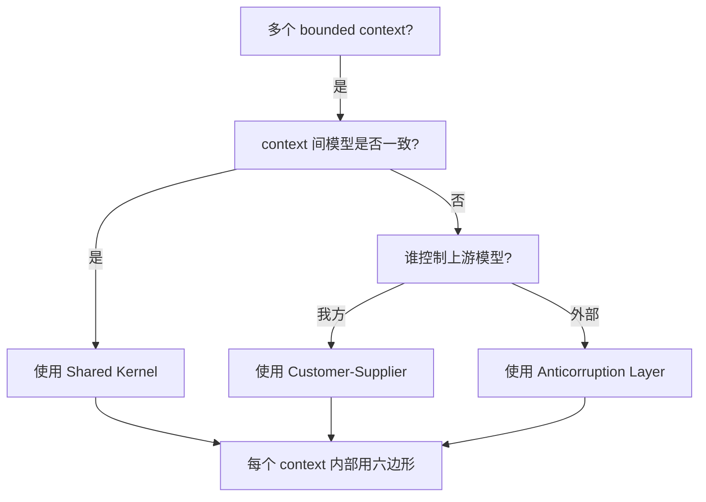
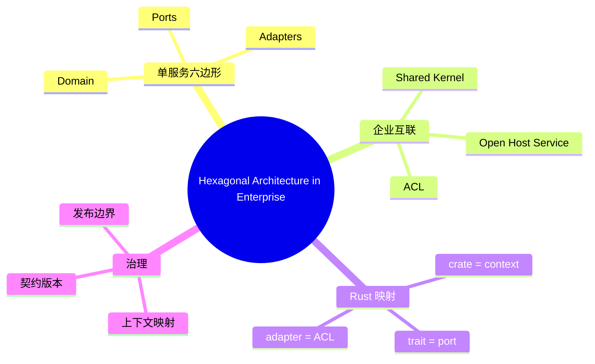

> **内容分级**: [专家级]

# 六边形架构在 Rust 中的企业级实践（Hexagonal Architecture in Enterprise）

**EN**: Hexagonal Architecture in Rust — Enterprise Perspective
**Summary**: Scale Cockburn's Ports & Adapters from single crates to enterprise systems, aligning bounded contexts, workspace boundaries, and governance.

> **Rust 版本**: 1.97.0+ (Edition 2024)
> **Bloom 层级**: L6
> **权威来源**: 本文件为 `concept/` 权威页。
> **定位**: 从企业架构视角扩展六边形架构：如何将多个 bounded context 的六边形通过共享内核、 anticorruption layer 和开放主机服务组合成企业级系统。
> **前置概念**: [Hexagonal / Ports & Adapters](../03_design_patterns/25_hexagonal_ports_and_adapters.md) · [Enterprise Architecture Frameworks](01_enterprise_architecture_frameworks.md) · [Strategic DDD](05_strategic_domain_driven_design_in_rust.md) · [Comparative Layer README](../../05_comparative/README.md)
> **后置概念**: [Clean Architecture in Rust](06_clean_architecture_in_rust.md) · [Microservices Patterns in Rust](08_microservices_patterns_in_rust.md)

---

> **来源 / Provenance**:
> [Cockburn 2005 — Hexagonal Architecture](https://alistair.cockburn.us/hexagonal-architecture/) ·
> [Evans 2003 — *Domain-Driven Design*](https://www.oreilly.com/library/view/domain-driven-design-tackling/0321125215/) ·
> [Richardson 2018 — *Microservices Patterns*](https://microservices.io/book) ·
> [ISO/IEC/IEEE 42010:2022](https://www.iso.org/standard/74296.html)

---

## 一、权威定义

**Hexagonal Architecture at Enterprise Scale**: 六边形架构不仅适用于单个服务，也可作为企业系统中每个 bounded context 的内部结构。多个六边形通过以下 DDD 战略模式互联：

- **Partnership（合作关系）**: 两个 context 协同演进。
- **Shared Kernel（共享内核）**: 显式共享一小部分模型。
- **Customer-Supplier（客户-供应商）**: 上游优先满足下游需求。
- **Conformist（遵奉者）**: 下游完全采用上游模型。
- **Anticorruption Layer（防腐层）**: 下游用适配器隔离上游模型。
- **Open Host Service（开放主机服务）**: 上游提供显式协议供多方消费。

> **来源**: [Cockburn 2005](https://alistair.cockburn.us/hexagonal-architecture/) · [Evans 2003](https://www.oreilly.com/library/view/domain-driven-design-tackling/0321125215/)

---

## 二、企业级映射矩阵

| DDD 战略模式 | Rust 结构 | 六边形对应 |
|:---|:---|:---|
| Bounded Context | workspace member crate | 单个六边形 |
| Shared Kernel | 独立 `shared-kernel` crate | 多个六边形共享的端口 |
| Anticorruption Layer | `adapter/legacy.rs` | 外部适配器 |
| Open Host Service | `api/` crate + OpenAPI/gRPC schema | 驱动端口暴露 |
| Customer-Supplier | 下游 `trait` 由上游实现 | 端口契约由上游适配 |

---

## 三、Rust 实现

### 3.1 防腐层适配器

```rust,ignore
// crates/order-context/src/ports.rs
pub trait PricingService {
    async fn price(&self, sku: &Sku) -> Result<Money, PricingError>;
}

// crates/order-context/src/adapters/legacy_pricing_acl.rs
pub struct LegacyPricingAcl { client: legacy::Client }

impl PricingService for LegacyPricingAcl {
    async fn price(&self, sku: &Sku) -> Result<Money, PricingError> {
        let dto = self.client.get_price(&sku.0).await?;
        // 将 legacy DTO 转换为本 context 的 Money 值对象
        Ok(Money::new(dto.cents, dto.currency.parse()?))
    }
}
```

### 3.2 开放主机服务

```rust,ignore
// crates/pricing-context/src/api.rs
use axum::{extract::Path, response::Json};

pub async fn get_price(Path(sku): Path<String>) -> Json<PriceDto> {
    // 由 pricing context 的用例层提供数据
    let price = use_cases::price(&sku).await;
    Json(PriceDto::from(price))
}
```

---

## 四、关系

- **Hexagonal Enterprise ↔ Clean Architecture**: 六边形是服务内部结构；Clean Architecture 是更细粒度的层结构；两者可共存。
- **Hexagonal Enterprise ↔ Microservices**: 每个微服务内部使用六边形；服务间通过 Open Host Service / ACL 通信。
- **Hexagonal Enterprise ↔ TOGAF**: 六边形对应应用架构中的组件；DDD 战略模式对应业务架构中的上下文映射。

---

## 五、反例与边界

### 反例：所有 context 共享同一模型

```rust,ignore
// ❌ 错误：把全局 User 结构体到处复用
pub struct User { id: Uuid, name: String }
```

**修正**: 每个 bounded context 应有自己的 `User` 视图；跨 context 仅共享 ID 类型等最小契约。

### 边界：防腐层成本

ACL 增加映射开销。当上下游模型频繁变化且高度一致时，Conformist 或 Shared Kernel 可能更合适。

---

## 六、决策树



---

## 七、思维导图



---

## 八、权威来源索引

- Cockburn, A. "Hexagonal Architecture." 2005. [https://alistair.cockburn.us/hexagonal-architecture/](https://alistair.cockburn.us/hexagonal-architecture/)
- Evans, E. *Domain-Driven Design: Tackling Complexity in the Heart of Software*. Addison-Wesley, 2003.
- Richardson, C. *Microservices Patterns: With examples in Java*. Manning, 2018.
- ISO/IEC/IEEE. *ISO/IEC/IEEE 42010:2022*. 2022.

> **文档版本**: 1.0 ｜ **最后更新**: 2026-07-31 ｜ **状态**: ✅ 新建权威页
