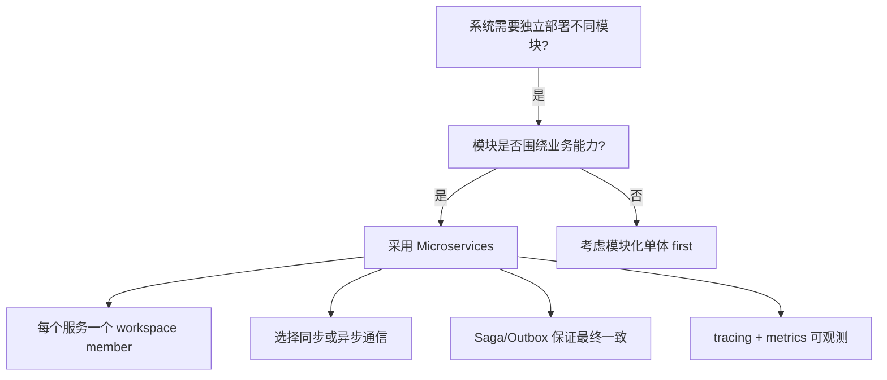
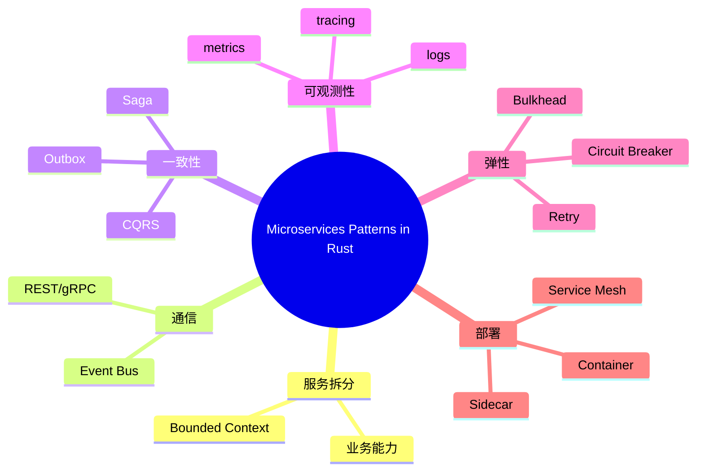

> **内容分级**: [专家级]

# 微服务模式在 Rust 中的企业级实践（Microservices Patterns in Enterprise）

**EN**: Microservices Patterns in Rust — Enterprise Perspective
**Summary**: Map Chris Richardson's microservices patterns to Rust workspaces, async runtimes, and deployment topologies, with governance and observability concerns.

> **Rust 版本**: 1.97.0+ (Edition 2024)
> **Bloom 层级**: L6
> **权威来源**: 本文件为 `concept/` 权威页。
> **定位**: 将 Richardson 的微服务模式与 Rust 的企业工程实践对齐：服务拆分、通信模式、数据一致性、可观测性与部署。
> **前置概念**: [Microservice Patterns](../03_design_patterns/05_microservice_patterns.md) · [Hexagonal Architecture in Enterprise](07_hexagonal_architecture_in_rust.md) · [Saga](../03_design_patterns/29_saga.md) · [Outbox](../03_design_patterns/30_outbox.md) · [Comparative Layer README](../../05_comparative/README.md)
> **后置概念**: [Clean Architecture in Rust](06_clean_architecture_in_rust.md) · [Event-Driven Architecture](../03_design_patterns/06_event_driven_architecture.md)

---

> **来源 / Provenance**:
> [Richardson 2018 — *Microservices Patterns*](https://microservices.io/book) ·
> [Newman 2021 — *Building Microservices*, 2nd Edition](https://www.oreilly.com/library/view/building-microservices-2nd/9781492034018/) ·
> [Fowler & Lewis 2014 — Microservices](https://martinfowler.com/articles/microservices.html) ·
> [Hohpe & Woolf 2003 — *Enterprise Integration Patterns*](https://www.enterpriseintegrationpatterns.com/)

---

## 一、权威定义

**Microservices Architecture**: 将应用程序构建为一组小型服务，每个服务运行在自己的进程中，并通过轻量级机制（通常是 HTTP/REST 或消息）通信。每个服务围绕业务能力构建，可独立部署。

企业级微服务还需要关注：

- **服务拆分**: 按 bounded context 或业务能力。
- **通信模式**: 同步（REST/gRPC）vs 异步（消息/事件）。
- **数据一致性**: Saga、Outbox、CQRS/Event Sourcing。
- **可观测性**: 日志、指标、分布式追踪。
- **部署与弹性**: 容器、服务发现、断路器、舱壁。

> **来源**: [Fowler & Lewis 2014 — Microservices](https://martinfowler.com/articles/microservices.html) · [Richardson 2018](https://microservices.io/book)

---

## 二、Rust 映射矩阵

| 微服务关注点 | 模式/工具 | Rust 生态 |
|:---|:---|:---|
| **同步通信** | REST / gRPC | `axum` / `tonic` |
| **异步通信** | Message Bus / Event Bus | `tokio::sync::broadcast`, `lapin`, `kafka-rust` |
| **服务发现** | Service Registry | `consul`, `etcd`, Kubernetes DNS |
| **配置管理** | Externalized Configuration | `config`, environment variables |
| **可观测性** | Logs/Metrics/Traces | `tracing`, `metrics`, `opentelemetry` |
| **弹性** | Circuit Breaker, Bulkhead, Retry | `tokio::sync::Semaphore`, 自定义或 `retry` crate |
| **数据一致性** | Saga, Outbox, CQRS | 自定义实现 + `sqlx`/`kafka` |
| **部署** | Container / Sidecar | `distroless` image, `cargo-chef` |

---

## 三、Rust 实现

### 3.1 服务边界与 workspace

```text
enterprise-system/
├── Cargo.toml
├── crates/
│   ├── order-service/      # 独立微服务
│   ├── payment-service/
│   ├── inventory-service/
│   ├── shared-kernel/      # 跨服务共享的 ID / 事件 schema
│   └── integration-events/ # 事件契约
```

### 3.2 异步事件契约

```rust,ignore
// crates/integration-events/src/lib.rs
use serde::{Deserialize, Serialize};
use uuid::Uuid;

#[derive(Debug, Clone, Serialize, Deserialize)]
pub struct OrderCreatedEvent {
    pub order_id: Uuid,
    pub customer_id: Uuid,
    pub total_cents: i64,
}

#[derive(Debug, Clone, Serialize, Deserialize)]
#[serde(tag = "type")]
pub enum IntegrationEvent {
    OrderCreated(OrderCreatedEvent),
    PaymentReceived { order_id: Uuid },
    InventoryReserved { order_id: Uuid },
}
```

### 3.3 可观测性层

```rust,ignore
use tracing::{info, instrument};

#[instrument(skip(repo))]
pub async fn place_order<R: OrderRepository>(repo: &R, cmd: PlaceOrderCommand) -> Result<OrderId, OrderError> {
    info!(?cmd, "placing order");
    // ...
}
```

---

## 四、关系

- **Microservices ↔ Hexagonal**: 每个微服务内部使用六边形架构；服务边界对应六边形之间的端口连接。
- **Microservices ↔ DDD**: 微服务通常对应一个 bounded context；共享内核用于跨服务的最小契约。
- **Microservices ↔ Clean Architecture**: Clean Architecture 是服务内部的结构；微服务是服务之间的结构。

---

## 五、反例与边界

### 反例：为拆分而拆分

```text
# ❌ 错误：每个实体一个服务
- user-service
- user-address-service
- user-preference-service
```

**修正**: 按业务能力（如 order、payment、inventory）而非实体拆分，减少分布式事务。

### 边界：分布式事务

微服务中避免两阶段提交。使用 Saga + Outbox 保证最终一致性，并接受暂时不一致。

---

## 六、决策树



---

## 七、思维导图



---

## 八、权威来源索引

- Richardson, C. *Microservices Patterns: With examples in Java*. Manning, 2018. [https://microservices.io/book](https://microservices.io/book)
- Newman, S. *Building Microservices*, 2nd ed. O'Reilly, 2021.
- Fowler, M. & Lewis, J. "Microservices." 2014. [https://martinfowler.com/articles/microservices.html](https://martinfowler.com/articles/microservices.html)
- Hohpe, G. & Woolf, B. *Enterprise Integration Patterns*. Addison-Wesley, 2003.

> **文档版本**: 1.0 ｜ **最后更新**: 2026-07-31 ｜ **状态**: ✅ 新建权威页

## P0 官方来源（P0 Official Rust Authority Sources）

- [Cargo Workspaces — doc.rust-lang.org](https://doc.rust-lang.org/cargo/reference/workspaces.html)
- [The Rust Book: Fearless Concurrency — doc.rust-lang.org](https://doc.rust-lang.org/book/ch16-00-concurrency.html)
- [Asynchronous Programming in Rust — rust-lang.github.io](https://rust-lang.github.io/async-book/)

## 国际化权威来源补充（International Authority Sources）

- <https://dl.acm.org/doi/book/10.5555/186897>
- <https://rust-unofficial.github.io/patterns/>

## 国际化权威来源补充（International Authority Sources）

- <https://blog.rust-lang.org/>
