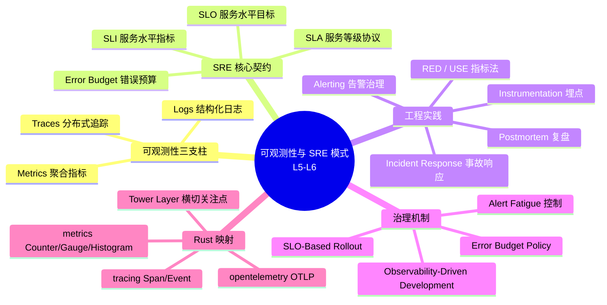
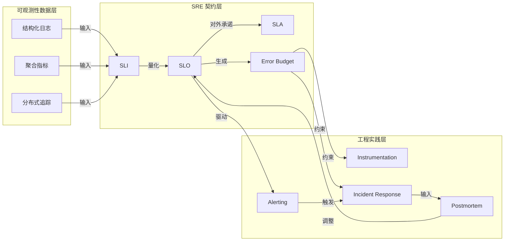
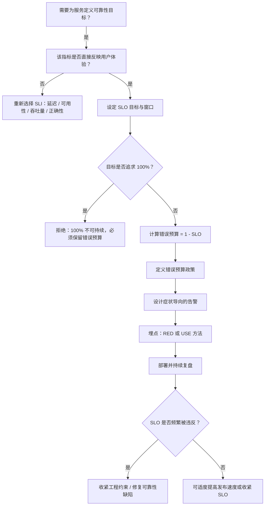

> **内容分级**: [专家级]
> **代码状态**: ✅ 含可编译示例
>
# Rust 中的可观测性与 SRE 模式（Observability and SRE Patterns）

**EN**: Observability and SRE Patterns in Rust
**Summary**: Enterprise Site Reliability Engineering patterns in Rust: defining SLIs, SLOs, SLAs and error budgets; instrumenting services with tracing, metrics and structured logs; designing alerts, incident response and observability-driven development while avoiding alert fatigue and SLO anti-patterns.

> **Rust 版本**: 1.97.1+ (Edition 2024)
> **Bloom 层级**: L5-L6
> **权威来源**: 本文件为 `concept/` 权威页。
> **A/S/P 标记**: **S+A+P** — Structure + Application + Procedure
> **定位**: 从企业架构视角对齐 Google SRE 体系与 Rust 工程实践，覆盖可观测性三支柱、SLO 生命周期、错误预算、告警治理、事故响应与可观测性驱动开发。Rust 工具链细节参见 [`02_logging_observability.md`](../00_toolchain/02_logging_observability.md) 与 [`05_tracing.md`](../02_core_crates/05_tracing.md)。
> **前置概念**: [Microservices Patterns in Rust](08_microservices_patterns_in_rust.md) · [API Gateway & Service Mesh](../03_design_patterns/38_api_gateway_and_service_mesh_patterns.md) · [High-Performance Network Service Architecture](../04_web_and_networking/08_high_performance_network_service_architecture.md) · [Performance Engineering Architecture](../10_performance/02_performance_engineering_architecture.md) · [Error Handling](../../02_intermediate/03_error_handling/01_error_handling.md)
> **后置概念**: [Cloud Native](../04_web_and_networking/02_cloud_native.md) · [Kubernetes Rust](../04_web_and_networking/11_kubernetes_rust.md) · [Data-Intensive Systems Design](../06_data_and_distributed/10_data_intensive_systems_design.md)
> **L5 对比**: [Rust vs C++](../../05_comparative/01_systems_languages/01_rust_vs_cpp.md)

---

> **来源 / Provenance**:
> [Google SRE Book](https://sre.google/sre-book/table-of-contents/) ·
> [Google SRE Workbook](https://sre.google/workbook/table-of-contents/) ·
> [OpenTelemetry Specification](https://opentelemetry.io/docs/specs/otel/) ·
> [Prometheus Best Practices](https://prometheus.io/docs/practices/) ·
> [Zero To Production in Rust](https://www.zero-to-production.com/) ·
> [Rust API Guidelines](https://rust-lang.github.io/api-guidelines/)

---

## 📑 目录

- [Rust 中的可观测性与 SRE 模式（Observability and SRE Patterns）](#rust-中的可观测性与-sre-模式observability-and-sre-patterns)
  - [📑 目录](#-目录)
  - [🧠 知识结构图](#-知识结构图)
  - [一、权威定义](#一权威定义)
    - [1.1 可观测性（Observability）](#11-可观测性observability)
    - [1.2 SRE 与可靠性工程](#12-sre-与可靠性工程)
    - [1.3 SLI / SLO / SLA / 错误预算](#13-sli--slo--sla--错误预算)
    - [1.4 告警、事故响应与可观测性驱动开发](#14-告警事故响应与可观测性驱动开发)
  - [二、Rust 实现惯用法](#二rust-实现惯用法)
    - [2.1 标准库实现的窗口化 SLO 追踪器](#21-标准库实现的窗口化-slo-追踪器)
    - [2.2 与 tracing / metrics 生态集成](#22-与-tracing--metrics-生态集成)
  - [三、反例与边界](#三反例与边界)
    - [3.1 编译错误：在 async 检测代码中持有 `MutexGuard` 跨越 await](#31-编译错误在-async-检测代码中持有-mutexguard-跨越-await)
    - [3.2 SRE 反模式（文本）](#32-sre-反模式文本)
      - [反模式 1：SLI 使用“可用性”而非用户可感知的指标](#反模式-1sli-使用可用性而非用户可感知的指标)
      - [反模式 2：SLO 目标过高且没有错误预算](#反模式-2slo-目标过高且没有错误预算)
      - [反模式 3：告警基于原因而非症状](#反模式-3告警基于原因而非症状)
      - [反模式 4：错误预算耗尽后继续发布](#反模式-4错误预算耗尽后继续发布)
      - [反模式 5：用 panic 处理预期错误并计入 SLO](#反模式-5用-panic-处理预期错误并计入-slo)
  - [四、关系网络](#四关系网络)
  - [五、决策树](#五决策树)
  - [六、与国际权威来源对齐](#六与国际权威来源对齐)
    - [6.1 Google SRE 体系](#61-google-sre-体系)
    - [6.2 OpenTelemetry 与 Prometheus](#62-opentelemetry-与-prometheus)
    - [6.3 Rust 工程权威](#63-rust-工程权威)
    - [6.4 学术与行业专著](#64-学术与行业专著)
  - [七、权威来源索引](#七权威来源索引)
    - [P0 — Rust 官方与核心规范](#p0--rust-官方与核心规范)
    - [P1 — 学术与行业权威](#p1--学术与行业权威)
    - [P2 — 生态权威与参考实现](#p2--生态权威与参考实现)
  - [八、相关概念链接](#八相关概念链接)

---

## 🧠 知识结构图



> **认知功能**: 本 mindmap 将企业级 SRE 拆分为“可观测性数据层—SRE 契约层—工程实践层—治理机制层—Rust 实现层”。核心洞察：**可观测性不是目的，而是达成可靠性契约（SLO）与快速恢复能力的手段**。

---

## 一、权威定义

### 1.1 可观测性（Observability）

**Observability**: 通过系统的外部输出（logs、metrics、traces）推断其内部状态的能力。与控制理论中的可观测性概念同源：系统状态可被外部测量唯一确定时，系统是可观测的。

在 Rust 服务端，可观测性三支柱的映射如下：

| 支柱 | 回答的问题 | Rust 生态典型 crate |
|:---|:---|:---|
| **Logs** | 发生了什么离散事件？ | `tracing`（结构化）、`log`（门面） |
| **Metrics** | 系统状态如何随时间变化？ | `metrics`、`prometheus` |
| **Traces** | 请求经历了哪些服务与组件？ | `tracing` + `opentelemetry` |

> **来源**: [OpenTelemetry Specification](https://opentelemetry.io/docs/specs/otel/) · [Google SRE Book — Monitoring](https://sre.google/sre-book/monitoring-distributed-systems/)

---

### 1.2 SRE 与可靠性工程

**Site Reliability Engineering (SRE)**: 运用软件工程方法解决运维问题、提升系统可靠性的学科。核心思想：

- **可靠性是产品功能**: 没有可靠性，功能无法被用户使用。
- **错误预算是创新速度与安全性的调节器**: 当服务还有剩余错误预算时，可快速发布；预算耗尽时优先稳定性。
- **自动化优于人工**: 重复性运维操作应通过代码、策略与自动化完成。
- **可观测性驱动决策**: 所有容量规划、发布决策、告警阈值必须基于数据而非直觉。

Rust 与 SRE 的天然契合点：

- **内存与并发安全**: 消除一整类导致崩溃与数据竞争的可靠性缺陷。
- **零成本抽象**: 在关键路径上埋点、采样、限流而不牺牲性能预算。
- **强类型错误处理**: `Result<T, E>` 强制显式处理失败路径，使 SLI 统计更完整。

> **来源**: [Google SRE Book](https://sre.google/sre-book/table-of-contents/) · [Google SRE Workbook](https://sre.google/workbook/table-of-contents/)

---

### 1.3 SLI / SLO / SLA / 错误预算

| 术语 | 定义 | 示例 |
|:---|:---|:---|
| **SLI (Service Level Indicator)** | 可量化、可测量的可靠性指标 | HTTP 成功率、P99 延迟、队列处理速率 |
| **SLO (Service Level Objective)** | SLI 的目标值，通常以时间窗口为单位 | 30 天内 HTTP 成功率 ≥ 99.9% |
| **SLA (Service Level Agreement)** | 对外承诺，违反时通常伴随赔偿 | 月度可用性 ≥ 99.95%，否则退款 |
| **Error Budget** | `1 - SLO`，允许在窗口内发生的“不可靠”量 | SLO 99.9% → 错误预算 0.1% = 43.2 分钟/月 |

**错误预算政策（Error Budget Policy）**: 当错误预算消耗速度超过预期时触发的工程约束，例如：

- 预算剩余 < 50%：加强发布评审；
- 预算剩余 < 25%：禁止非修复性发布；
- 预算耗尽：仅允许事故修复与回滚。

> **关键洞察**: SLO 不应追求 100%。100% 可靠性意味着零发布、零变更，经济上不可持续。SLO 是业务、用户体验与工程成本之间的**有意识权衡**。

---

### 1.4 告警、事故响应与可观测性驱动开发

**告警治理原则（Google SRE）**:

1. **可执行**: 每条告警必须对应一个明确的操作或调查路径。
2. **根因导向**: 优先对**症状**（用户可见影响）告警，而非**原因**（某机器 CPU 高）。
3. **分页疲劳控制**: 低信噪比告警会削弱响应能力，必须定期清理。
4. **分级**: P0（立即响应）、P1（工作时间内）、P2（次日处理）。

**事故响应（Incident Response）生命周期**:

```text
检测 (Detection) → 升级 (Escalation) → 缓解 (Mitigation) →
定位 (Diagnosis) → 修复 (Resolution) → 复盘 (Postmortem)
```

**可观测性驱动开发（ODD）**: 在功能开发的同时定义“如何证明它正常/异常工作”，并将相关指标、日志、追踪纳入设计，而非事后补加。

> **来源**: [Google SRE Workbook — Incident Response](https://sre.google/workbook/incident-response/) · [Prometheus Alerting Practices](https://prometheus.io/docs/practices/alerting/)

---

## 二、Rust 实现惯用法

### 2.1 标准库实现的窗口化 SLO 追踪器

以下示例仅用 Rust 标准库实现一个**滑动窗口 SLO / 错误预算追踪器**。它展示了：

- 如何将 SLI 表达为成功率；
- 如何计算错误预算；
- 如何基于预算状态生成告警信号；
- 如何使用 `std::time::Instant` 与 `std::collections::VecDeque` 实现时间窗口。

```rust
use std::collections::VecDeque;
use std::time::{Duration, Instant};

/// 一个窗口内的事件记录：成功或失败。
#[derive(Debug, Clone, Copy)]
struct Event {
    timestamp: Instant,
    success: bool,
}

/// 滑动窗口 SLO 追踪器。
///
/// - `target`: SLO 目标，例如 0.999 表示 99.9%。
/// - `window`: 统计窗口，例如 30 天。
pub struct WindowedSlo {
    target: f64,
    window: Duration,
    events: VecDeque<Event>,
}

#[derive(Debug, PartialEq)]
pub enum BudgetStatus {
    Healthy,
    AtRisk,
    Depleted,
}

impl WindowedSlo {
    pub fn new(target: f64, window: Duration) -> Self {
        assert!((0.0..=1.0).contains(&target), "SLO target must be in [0, 1]");
        Self {
            target,
            window,
            events: VecDeque::new(),
        }
    }

    /// 记录一次结果。
    pub fn record(&mut self, success: bool) {
        let now = Instant::now();
        self.events.push_back(Event { timestamp: now, success });
        self.evict_old(now);
    }

    fn evict_old(&mut self, now: Instant) {
        while let Some(front) = self.events.front() {
            if now.duration_since(front.timestamp) > self.window {
                self.events.pop_front();
            } else {
                break;
            }
        }
    }

    /// 计算当前窗口内的 SLI（成功率）。
    pub fn sli(&self) -> f64 {
        if self.events.is_empty() {
            return 1.0;
        }
        let total = self.events.len() as f64;
        let success = self.events.iter().filter(|e| e.success).count() as f64;
        success / total
    }

    /// 错误预算：当前窗口内允许的失败比例。
    pub fn error_budget_ratio(&self) -> f64 {
        1.0 - self.target
    }

    /// 剩余错误预算比例。
    pub fn remaining_budget_ratio(&self) -> f64 {
        let actual_failure = 1.0 - self.sli();
        let budget = self.error_budget_ratio();
        (budget - actual_failure).max(0.0)
    }

    /// 错误预算状态。
    pub fn status(&self) -> BudgetStatus {
        let remaining = self.remaining_budget_ratio();
        if remaining == 0.0 {
            BudgetStatus::Depleted
        } else if remaining < self.error_budget_ratio() * 0.5 {
            BudgetStatus::AtRisk
        } else {
            BudgetStatus::Healthy
        }
    }

    /// 估算按当前失败速率，错误预算将在多久后耗尽。
    pub fn time_to_deplete(&self, failure_rate_per_second: f64) -> Option<Duration> {
        let remaining = self.remaining_budget_ratio();
        let total = self.events.len() as f64;
        if failure_rate_per_second <= 0.0 || total == 0.0 {
            return None;
        }
        // 剩余失败事件数 = 剩余预算比例 * 总事件数
        let remaining_failures = remaining * total;
        let seconds = remaining_failures / failure_rate_per_second;
        Some(Duration::from_secs_f64(seconds))
    }
}

fn main() {
    let mut slo = WindowedSlo::new(0.999, Duration::from_secs(30 * 24 * 3600));

    // 模拟一个月内的请求：999 成功，1 失败
    for _ in 0..999 {
        slo.record(true);
    }
    slo.record(false);

    println!("SLI = {:.4} ({}%)", slo.sli(), slo.sli() * 100.0);
    println!("Error budget ratio = {:.4}%", slo.error_budget_ratio() * 100.0);
    println!("Remaining budget ratio = {:.4}%", slo.remaining_budget_ratio() * 100.0);
    println!("Status = {:?}", slo.status());

    match slo.time_to_deplete(0.001) {
        Some(d) => println!("Estimated time to deplete = {:?}", d),
        None => println!("No failure rate or budget healthy"),
    }
}
```

> **关键洞察**: SLO 追踪器本质上是**有状态的时间窗口聚合器**。Rust 的显式可变状态与所有权模型迫使开发者思考：事件队列由谁持有？窗口过期如何驱逐？多线程场景下是否需要 `Arc<Mutex<WindowedSlo>>`？这些设计问题直接影响生产可靠性。

---

### 2.2 与 tracing / metrics 生态集成

SRE 模式需要可观测性数据作为输入。Rust 生态中，埋点通常与业务代码解耦为横切关注点：

```rust,ignore
// 典型生产埋点组合（需外部依赖）
// [dependencies]
// tracing = "0.1"
// tracing-subscriber = { version = "0.3", features = ["env-filter", "json"] }
// metrics = "0.24"
// metrics-exporter-prometheus = "0.16"
// opentelemetry = "0.28"
// tracing-opentelemetry = "0.29"

use axum::{routing::get, Router};
use metrics::{counter, histogram};
use std::time::Instant;
use tracing::{info, instrument};

#[instrument(fields(route = %req.uri().path(), method = %req.method()))]
async fn handler(req: axum::extract::Request) -> impl axum::response::IntoResponse {
    let start = Instant::now();

    // 业务逻辑 ...
    let status = 200;

    let elapsed = start.elapsed().as_secs_f64() * 1000.0;
    histogram!("http_request_duration_ms", elapsed, "route" => "/health");
    counter!("http_requests_total", "route" => "/health", "status" => status.to_string());

    info!(status, latency_ms = elapsed, "request handled");
    status
}
```

> **说明**: 上述代码块依赖 `axum`、`tracing`、`metrics` 等 crate，因此标记为 `rust,ignore`。完整工具链用法参见 [`05_tracing.md`](../02_core_crates/05_tracing.md) 与 [`02_logging_observability.md`](../00_toolchain/02_logging_observability.md)。

---

## 三、反例与边界

### 3.1 编译错误：在 async 检测代码中持有 `MutexGuard` 跨越 await

SRE 埋点常需要更新共享的指标或 SLO 状态。若错误地在异步函数中使用 `std::sync::Mutex`，会导致 guard 跨越 `await` 点，被编译器拦截（`E0277`）。这是生产异步服务中极易出现的错误。

```rust,compile_fail
use std::future::Future;
use std::pin::Pin;
use std::sync::Mutex;
use std::task::{Context, Poll};

// 仅用于演示 await 点的 std-only dummy future
struct DummyFuture;

impl Future for DummyFuture {
    type Output = ();
    fn poll(self: Pin<&mut Self>, _cx: &mut Context<'_>) -> Poll<Self::Output> {
        Poll::Ready(())
    }
}

async fn slow_check() {
    DummyFuture.await;
}

struct SloRegistry {
    counter: Mutex<u64>,
}

async fn handle_request(registry: &SloRegistry) {
    // ❌ 错误：MutexGuard 在 await 点之间保持持有
    let mut guard = registry.counter.lock().unwrap();
    *guard += 1;

    slow_check().await; // 编译错误：future 不能安全地跨 await 发送

    *guard += 1;
}

// 模拟多线程 executor 对 Future 的 Send 要求
fn assert_send<T: Send>(_: T) {}

fn main() {
    let registry = SloRegistry { counter: Mutex::new(0) };
    assert_send(handle_request(&registry));
}
```

**修正方案**:

```rust,ignore
use tokio::sync::Mutex; // ✅ 使用异步锁

async fn handle_request(registry: &tokio::sync::Mutex<SloRegistry>) {
    {
        let mut guard = registry.lock().await;
        guard.counter += 1;
    } // guard 在此 drop，不跨越 await

    slow_check().await;

    {
        let mut guard = registry.lock().await;
        guard.counter += 1;
    }
}
```

> **来源对齐**: 该模式与 [Google SRE Book — Monitoring](https://sre.google/sre-book/monitoring-distributed-systems/) 中“避免埋点引入额外延迟或阻塞”的原则一致。Rust 编译器通过 `Send` 约束在编译期阻止此类风险。

---

### 3.2 SRE 反模式（文本）

#### 反模式 1：SLI 使用“可用性”而非用户可感知的指标

```text
❌ 错误 SLI: "API 进程正在运行"（进程存活不等于服务可用）
✅ 正确 SLI: "过去 1 分钟内，成功的 /api/v1/orders 请求比例"
```

#### 反模式 2：SLO 目标过高且没有错误预算

```text
❌ 错误: "所有服务都必须是 99.999% 可用"
✅ 正确: 根据业务影响设定差异化 SLO；核心支付 99.99%，内部管理后台 99.0%
```

#### 反模式 3：告警基于原因而非症状

```text
❌ 错误: "某 Pod CPU 使用率 > 80%"（可能只是正常负载）
✅ 正确: "P99 延迟超过 SLO 阈值"（用户可感知）
```

#### 反模式 4：错误预算耗尽后继续发布

```text
❌ 错误: 错误预算已用完，仍合并新功能
✅ 正确: 触发错误预算政策，暂停非修复性变更，优先稳定性
```

#### 反模式 5：用 panic 处理预期错误并计入 SLO

```text
❌ 错误: 业务校验失败时 panic，被进程重启掩盖
✅ 正确: 用 Result 显式返回错误，埋点区分业务错误与系统错误
```

---

## 四、关系网络



> **认知功能**: 此图展示可观测性数据如何经 SLI 转化为 SLO/错误预算，再驱动告警、事故响应与复盘，形成闭环治理。

---

## 五、决策树



> **认知功能**: 该决策树将 SRE 实践从“定义指标”到“持续治理”串联为可操作流程。关键分支：SLI 必须反映用户体验；SLO 不能是 100%；告警必须基于症状而非原因。

---

## 六、与国际权威来源对齐

### 6.1 Google SRE 体系

本文件直接对齐 [Google SRE Book](https://sre.google/sre-book/table-of-contents/) 与 [SRE Workbook](https://sre.google/workbook/table-of-contents/)：

- **SLI/SLO/SLA 定义**与 Google SRE Book 第 II 部分“Principles”一致；
- **错误预算政策**对应 SRE Workbook 中“Implementing SLOs”章节；
- **症状导向告警**对应 SRE Book 中“Monitoring Distributed Systems”对 symptoms vs causes 的区分。

### 6.2 OpenTelemetry 与 Prometheus

- **可观测性三支柱**采用 OpenTelemetry 数据模型；
- **RED 方法**（Rate, Errors, Duration）与 **USE 方法**（Utilization, Saturation, Errors）来自 [Prometheus Best Practices](https://prometheus.io/docs/practices/)；
- Rust 生态实现通过 `tracing`、`metrics`、`opentelemetry` crate 落地，与官方文档一致。

### 6.3 Rust 工程权威

- **错误处理**: 与 [The Rust Programming Language — Error Handling](https://doc.rust-lang.org/book/ch09-00-error-handling.html) 对齐，强调 `Result<T, E>` 显式处理；
- **API 设计**: 与 [Rust API Guidelines](https://rust-lang.github.io/api-guidelines/) 对齐，主张埋点接口应零成本、可组合；
- **异步并发**: 与 [Async Book](https://rust-lang.github.io/async-book/) 对齐，强调 `Send` 约束与异步锁的选择。

### 6.4 学术与行业专著

- *Zero To Production in Rust*（Luca Palmieri）提供了 Rust 异步服务中 telemetry、health check、部署的完整实践路径；
- *Distributed Systems Observability*（Cindy Sridharan）补充了可观测性理论与实践差异。

---

## 七、权威来源索引

### P0 — Rust 官方与核心规范

- [The Rust Programming Language](https://doc.rust-lang.org/book/title-page.html)（错误处理、所有权、async 前置概念）
- [Rust Reference](https://doc.rust-lang.org/reference/introduction.html)
- [Rust API Guidelines](https://rust-lang.github.io/api-guidelines/)
- [Asynchronous Programming in Rust](https://rust-lang.github.io/async-book/)

### P1 — 学术与行业权威

- [Google SRE Book](https://sre.google/sre-book/table-of-contents/) — SLI/SLO/SLA、错误预算、监控与告警治理
- [Google SRE Workbook](https://sre.google/workbook/table-of-contents/) — SLO 实施、事故响应、错误预算政策
- [Beyer et al. — Site Reliability Engineering](https://sre.google/sre-book/)（O'Reilly, 2016）
- [Sridharan, C. — *Distributed Systems Observability*](https://www.oreilly.com/library/view/distributed-systems-observability/9781492033431/)
- [Tracing and Metrics Design Patterns for Monitoring Cloud-native Applications](https://arxiv.org/abs/2510.02991) — 云原生监控追踪与指标设计模式

### P2 — 生态权威与参考实现

- [OpenTelemetry Specification](https://opentelemetry.io/docs/specs/otel/)
- [OpenTelemetry Rust](https://github.com/open-telemetry/opentelemetry-rust)
- [Prometheus Best Practices](https://prometheus.io/docs/practices/)
- [docs.rs/tracing](https://docs.rs/tracing/latest/tracing/)
- [docs.rs/metrics](https://docs.rs/metrics/latest/metrics/)
- [Zero To Production in Rust](https://www.zero-to-production.com/)

> **链接验证声明**: 以上链接均来自公开可访问域名；本文件编写时未执行实时 HTTP 可达性检查，建议在 CI 死链检查门中复核。

---

## 八、相关概念链接

- [日志与可观测性：Rust 服务端监控生态](../00_toolchain/02_logging_observability.md) — 可观测性工具链与 crate 详解
- [`tracing`：结构化追踪与可观测性](../02_core_crates/05_tracing.md) — `tracing` 核心用法与陷阱
- [微服务模式在 Rust 中的企业级实践](08_microservices_patterns_in_rust.md) — 微服务边界、通信与可观测性
- [API 网关与服务网格模式](../03_design_patterns/38_api_gateway_and_service_mesh_patterns.md) — 横切关注点与可观测性埋点
- [高性能网络服务架构](../04_web_and_networking/08_high_performance_network_service_architecture.md) — 生产可观测性与健康检查
- [性能工程架构](../10_performance/02_performance_engineering_architecture.md) — 性能预算与 SLO/SLI 性能维度
- [错误处理基础](../../01_foundation/08_error_handling/01_error_handling_basics.md) — 显式错误处理与可靠性
- [Cloud Native](../04_web_and_networking/02_cloud_native.md) — 云原生部署与可观测性平台

---

> **文档版本**: 1.0
> **最后更新**: 2026-08-03
> **状态**: ✅ 新建权威页
