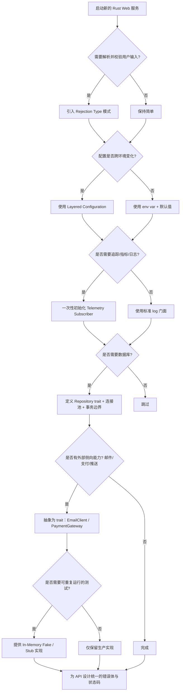
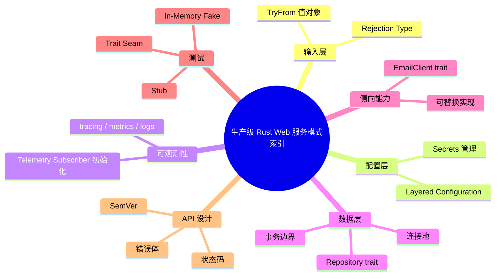

> **内容分级**: [进阶级]
> **代码状态**: ✅ 含可编译示例
>
# 生产级 Rust Web 服务模式索引（Production-Grade Rust Web Service Patterns Index）

**EN**: Production-Grade Rust Web Service Patterns Index
**Summary**: Systematic index of patterns for production Rust web services: rejection types, telemetry subscriber initialization, layered configuration, database transactions, test isolation, and email delivery, aligned with Zero To Production.

> **Rust 版本**: 1.97.0+ (Edition 2024)
> **Bloom 层级**: L2-L3
> **权威来源**: 本文件为 `concept/` 权威页。
> **A/S/P 标记**: **S+A** — Structure + Application
> **定位**: 将 *Zero To Production in Rust* 中反复出现的生产级 Web 服务实践整理为可索引的模式地图；每个模式链接到 `concept/` 权威页，并提供项目布局、决策树与反模式。
> **前置概念**:
> [Web Frameworks](../04_web_and_networking/03_web_frameworks.md) ·
> [Error Handling](../../02_intermediate/03_error_handling/01_error_handling.md) ·
> [Rejection Type Pattern](../03_design_patterns/43_rejection_type_pattern.md) ·
> [Layered Configuration Management Patterns](../03_design_patterns/44_configuration_management_patterns.md) ·
> [Testing and Mocking Idioms](../03_design_patterns/40_testing_and_mocking_idioms.md)
> **后置概念**:
> [Microservices Patterns in Rust](08_microservices_patterns_in_rust.md) ·
> [Clean Architecture in Rust](06_clean_architecture_in_rust.md) ·
> [Domain-Driven Design in Rust](04_domain_driven_design_in_rust.md) ·
> [Observability and SRE Patterns](09_observability_and_sre_patterns.md) ·
> [Rust vs Ada/SPARK](../../05_comparative/01_systems_languages/07_rust_vs_ada_spark.md)
>
> **来源**:
> [Zero To Production in Rust](https://www.zero2prod.com/) ·
> [axum docs](https://docs.rs/axum/latest/axum/) ·
> [actix-web docs](https://docs.rs/actix-web/latest/actix_web/) ·
> [tracing docs](https://docs.rs/tracing/latest/tracing/)

---

## 📑 目录

- [生产级 Rust Web 服务模式索引（Production-Grade Rust Web Service Patterns Index）](#生产级-rust-web-服务模式索引production-grade-rust-web-service-patterns-index)
  - [📑 目录](#-目录)
  - [一、权威定义](#一权威定义)
  - [二、生产级 Web 服务模式索引表](#二生产级-web-服务模式索引表)
  - [三、典型项目布局](#三典型项目布局)
  - [四、Rust 实现：依赖接缝与测试替身](#四rust-实现依赖接缝与测试替身)
  - [五、决策树：按场景选择模式](#五决策树按场景选择模式)
  - [六、反例与边界](#六反例与边界)
    - [反例：全局可变状态保存配置](#反例全局可变状态保存配置)
    - [反例：Handler 直接调用数据库与外部服务](#反例handler-直接调用数据库与外部服务)
    - [反例：在测试中调用真实邮件服务](#反例在测试中调用真实邮件服务)
    - [边界：每个端点都定义独立 Rejection 类型](#边界每个端点都定义独立-rejection-类型)
  - [七、权威来源索引](#七权威来源索引)
  - [🧠 知识结构图（Mindmap）](#-知识结构图mindmap)

---

## 一、权威定义

**生产级 Rust Web 服务模式索引**是对构建可维护、可测试、可观测的 Rust HTTP 服务所需关键模式的系统化归类。它不承担某单一模式的完整推导，而是作为**入口地图**，把每个模式指向其 `concept/` 权威页，并说明它们在项目中的组合关系。

> **核心主张**：生产级 Rust Web 服务的质量不是由框架选择决定，而是由以下六个接缝（seam）的设计决定：
> 1. 输入层如何拒绝非法请求；
> 2. 配置如何分层加载与验证；
> 3. 可观测性如何一次性初始化；
> 4. 数据库事务与连接如何管理；
> 5. 测试如何隔离外部依赖；
> 6. 侧向能力（如邮件）如何抽象为可替换契约。

---

## 二、生产级 Web 服务模式索引表

| 模式 | 解决的问题 | Rust 表达 | 权威页 |
|:---|:---|:---|:---|
| **Rejection Type** | 输入校验错误与领域错误混在一起 | 显式 `enum` + `TryFrom` 值对象 | [`Rejection Type Pattern`](../03_design_patterns/43_rejection_type_pattern.md) |
| **Layered Configuration** | 配置来源混乱、密钥泄露 | `Settings` + 默认值/文件/环境变量/Secrets 分层 | [`Layered Configuration Management Patterns`](../03_design_patterns/44_configuration_management_patterns.md) |
| **Telemetry Subscriber Init** | 日志/追踪/指标初始化散落 | `tracing_subscriber::fmt` + `env_filter` 一次初始化 | [`Observability and SRE Patterns`](09_observability_and_sre_patterns.md)、[`tracing` crate](../02_core_crates/05_tracing.md) |
| **Database Transactions** | 连接泄漏、事务边界不清 | `pool.begin().await?` + RAII 回滚 + 尽早释放 | [`Database Access Ecosystem`](../06_data_and_distributed/02_database_access.md)、[`Repository and Unit of Work`](../03_design_patterns/24_repository_and_unit_of_work.md) |
| **Test Isolation** | 测试依赖真实数据库/网络/时间 | Trait seam + In-Memory Fake + 伪时钟 | [`Testing and Mocking Idioms`](../03_design_patterns/40_testing_and_mocking_idioms.md) |
| **API Design & Versioning** | 路由、状态码、错误体、SemVer 不一致 | 显式 `IntoResponse` + OpenAPI schema + SemVer 边界 | [`API Design and SemVer Idioms`](../03_design_patterns/39_api_design_and_semver_idioms.md)、[`API Design Patterns`](../03_design_patterns/18_api_design_patterns.md) |
| **Email Delivery Abstraction** | 侧向能力难以在测试中替换 | `EmailClient` trait + SMTP/Log/Stub 实现 | 见下方 [四、Rust 实现：依赖接缝与测试替身](#四rust-实现依赖接缝与测试替身) |

> **索引原则**：本表只给出模式定位与入口链接；每个模式的完整推导、边界测试与决策规则请进入对应权威页。

---

## 三、典型项目布局

下面的布局把上述模式映射到目录结构，与 *Zero To Production* 的 newsletter 项目一致：

```text
newsletter/
├── Cargo.toml
├── configuration/
│   ├── base.yaml              # 默认值
│   ├── production.yaml        # 生产覆盖
│   └── test.yaml              # 测试覆盖
├── src/
│   ├── main.rs                # 初始化 telemetry + config，启动服务器
│   ├── startup.rs             # 组合 Router、State、依赖
│   ├── telemetry.rs           # tracing_subscriber 一次性初始化
│   ├── configuration.rs       # Settings 分层加载
│   ├── routes/
│   │   ├── health_check.rs
│   │   └── subscriptions.rs   # Rejection Type 入口
│   ├── domain/
│   │   ├── subscriber_email.rs # TryFrom + 显式 Rejection
│   │   └── new_subscriber.rs
│   ├── repository/
│   │   ├── subscriber_repository.rs   # trait + Postgres 实现
│   │   └── in_memory_subscriber_repository.rs # 测试用 Fake
│   └── email/
│       ├── email_client.rs    # EmailClient trait
│       ├── smtp_email_client.rs
│       └── stub_email_client.rs
└── tests/
    ├── health_check.rs
    └── subscriptions.rs       # 集成测试使用 Stub/Fake
```

> **要点**：
> - `domain/` 只包含已校验的值对象与 Rejection 类型；
> - `repository/` 与 `email/` 通过 trait 定义契约，实现可替换；
> - `configuration/` 与 `telemetry.rs` 在启动时一次性完成，运行期只读；
> - `tests/` 使用 Fake 实现，不依赖真实数据库或 SMTP。

---

## 四、Rust 实现：依赖接缝与测试替身

以下示例不依赖任何外部 crate，仅用标准库展示“trait seam + 泛型参数注入 + 手动 Fake”的核心结构。它同时覆盖了数据库事务边界、邮件发送抽象与测试隔离。

```rust
use std::collections::HashSet;

/// 输入层拒绝类型（Rejection Type 模式）
#[derive(Debug, PartialEq)]
pub enum SubscribeRejection {
    MissingEmail,
    InvalidEmail { raw: String },
}

/// 已校验的领域值对象
#[derive(Debug, Clone, PartialEq, Eq, Hash)]
pub struct SubscriberEmail(String);

impl TryFrom<String> for SubscriberEmail {
    type Error = SubscribeRejection;

    fn try_from(raw: String) -> Result<Self, Self::Error> {
        let trimmed = raw.trim();
        if trimmed.is_empty() {
            return Err(SubscribeRejection::MissingEmail);
        }
        if !trimmed.contains('@') {
            return Err(SubscribeRejection::InvalidEmail { raw });
        }
        Ok(Self(trimmed.to_lowercase()))
    }
}

/// 仓库契约：数据库事务的抽象
pub trait SubscriberRepository: Send + Sync {
    fn exists(&self, email: &SubscriberEmail) -> bool;
    fn save(&mut self, email: &SubscriberEmail);
}

/// 邮件客户端契约：侧向能力的抽象
pub trait EmailClient: Send + Sync {
    fn send_confirmation(&self, to: &SubscriberEmail) -> Result<(), &'static str>;
}

/// 应用服务：通过泛型参数注入依赖（依赖注入在 Rust 的主要形式）
pub struct SubscriptionService<R, E> {
    repository: R,
    email_client: E,
}

impl<R, E> SubscriptionService<R, E>
where
    R: SubscriberRepository,
    E: EmailClient,
{
    pub fn new(repository: R, email_client: E) -> Self {
        Self {
            repository,
            email_client,
        }
    }

    pub fn subscribe(&mut self, raw_email: String) -> Result<(), SubscribeRejection> {
        let email = SubscriberEmail::try_from(raw_email)?;
        if self.repository.exists(&email) {
            // 业务规则冲突：视为领域错误，不是 Rejection
            return Ok(());
        }
        let raw = email.0.clone();
        self.email_client
            .send_confirmation(&email)
            .map_err(|_| SubscribeRejection::InvalidEmail { raw })?;
        self.repository.save(&email);
        Ok(())
    }
}

// ---------- 测试用 Fake / Stub ----------
#[derive(Default)]
struct InMemoryRepo(HashSet<SubscriberEmail>);

impl SubscriberRepository for InMemoryRepo {
    fn exists(&self, email: &SubscriberEmail) -> bool {
        self.0.contains(email)
    }

    fn save(&mut self, email: &SubscriberEmail) {
        self.0.insert(email.clone());
    }
}

struct AlwaysOkEmailClient;
impl EmailClient for AlwaysOkEmailClient {
    fn send_confirmation(&self, _to: &SubscriberEmail) -> Result<(), &'static str> {
        Ok(())
    }
}

struct AlwaysFailEmailClient;
impl EmailClient for AlwaysFailEmailClient {
    fn send_confirmation(&self, _to: &SubscriberEmail) -> Result<(), &'static str> {
        Err("smtp down")
    }
}

fn main() {
    // 成功路径
    let mut service = SubscriptionService::new(InMemoryRepo::default(), AlwaysOkEmailClient);
    assert!(service.subscribe("alice@example.com".into()).is_ok());
    assert!(service.subscribe("alice@example.com".into()).is_ok()); // 已存在则幂等

    // 失败路径：Rejection
    assert_eq!(
        service.subscribe("not-an-email".into()),
        Err(SubscribeRejection::InvalidEmail {
            raw: "not-an-email".into()
        })
    );

    // 邮件服务失败路径
    let mut service = SubscriptionService::new(InMemoryRepo::default(), AlwaysFailEmailClient);
    assert!(service.subscribe("bob@example.com".into()).is_err());

    println!("production-grade web service pattern demo passed");
}
```

> **关键洞察**：
> - `SubscriptionService<R, E>` 是 Rust 中“依赖注入”的零成本形式，与 [`Dependency Injection in Rust`](../03_design_patterns/45_dependency_injection_in_rust.md) 对齐；
> - `SubscriberRepository` 与 `EmailClient` 是**接缝（seam）**，让同一业务逻辑可对接 Postgres/内存/SMTP/日志；
> - `TryFrom` 把输入校验与 Rejection 类型绑定在类型系统内，参见 [`Rejection Type Pattern`](../03_design_patterns/43_rejection_type_pattern.md)。

---

## 五、决策树：按场景选择模式



**决策规则摘要**：

1. 输入校验必须显式类型化，禁止用 `String` 传递所有错误；
2. 配置必须分层加载，密钥绝不进入版本控制；
3. `tracing_subscriber` 在 `main` 中初始化一次，禁止在 handler 内重复初始化；
4. 数据库连接/事务的生命周期尽量短，不跨越多个 `.await` 或业务计算；
5. 外部依赖通过 trait 抽象，测试使用 Fake；
6. API 错误体与状态码保持版本稳定，便于 OpenAPI 生成。

---

## 六、反例与边界

### 反例：全局可变状态保存配置

```rust,ignore
// ❌ 错误：全局可变状态让测试、并发、审计都变得困难
static mut SETTINGS: Option<AppConfig> = None;

pub fn get_config() -> &'static AppConfig {
    unsafe { SETTINGS.as_ref().unwrap() }
}
```

**问题**：
- 测试难以替换配置；
- `unsafe static mut` 在并发下是未定义行为；
- 无法追踪“哪个来源的配置实际生效”。

**修正**：将 `Settings` 作为只读参数传给需要它的组件，或在启动时构造 `ApplicationContext` 后冻结。

### 反例：Handler 直接调用数据库与外部服务

```rust,ignore
// ❌ 错误：handler 同时承担 HTTP、数据库、邮件三个职责
async fn subscribe_handler(form: FormData, pool: PgPool) -> HttpResponse {
    // 校验 ...
    sqlx::query!("INSERT INTO ...").execute(&pool).await.unwrap();
    // 发送邮件 ...
    HttpResponse::Ok().finish()
}
```

**问题**：
- 难以单元测试；
- 数据库错误与 HTTP 错误混在一起；
- 无法在不启动数据库的情况下验证业务规则。

**修正**：handler 只做“解析请求 → 调用应用服务 → 映射响应”；应用服务通过注入的 trait 依赖工作。

### 反例：在测试中调用真实邮件服务

```rust,ignore
// ❌ 错误：集成测试会向真实用户发送邮件
#[tokio::test]
async fn subscribe_sends_email() {
    let client = SmtpEmailClient::from_env();
    // 调用后会真的发邮件
}
```

**问题**：
- 测试不可靠、慢、可能产生垃圾邮件；
- 无法断言邮件内容；
- 无法模拟失败场景。

**修正**：定义 `EmailClient` trait，测试中注入记录发送内容的 `SpyEmailClient`。

### 边界：每个端点都定义独立 Rejection 类型

```rust,ignore
// ⚠️ 边界：过度细分的 Rejection 类型会导致枚举爆炸
pub enum SubscribeRejection { /* 10+ 变体 */ }
pub enum UnsubscribeRejection { /* 10+ 变体 */ }
// ...
```

**判定**：当多个端点的 Rejection 语义高度重叠时，应提取共享的 `ValidationError` 或 `ParseError` 类型，只在“端点特有业务含义”处保留独立变体。变体级别的区分必须有可测试、可映射到不同 HTTP 响应的必要性。

---

## 七、权威来源索引

- **P0 官方**: [The Rust Programming Language](https://doc.rust-lang.org/book/title-page.html)（错误处理、trait、泛型） · [Rust API Guidelines](https://rust-lang.github.io/api-guidelines/)
- **P1 学术/行业**: [Fowler — Test Double Patterns](https://martinfowler.com/bliki/TestDouble.html) · [Fowler — Mocks Aren't Stubs](https://martinfowler.com/articles/mocksArentStubs.html)
- **P2 生态/书籍**: [*Zero To Production in Rust*](https://www.zero2prod.com/) — 生产级 Rust Web 服务的系统实践来源 · [axum docs](https://docs.rs/axum/latest/axum/) · [actix-web docs](https://docs.rs/actix-web/latest/actix_web/) · [tracing docs](https://docs.rs/tracing/latest/tracing/)

> **文档版本**: 1.0 ｜ **最后更新**: 2026-08-03 ｜ **状态**: ✅ 新建权威页

---

## 🧠 知识结构图（Mindmap）


