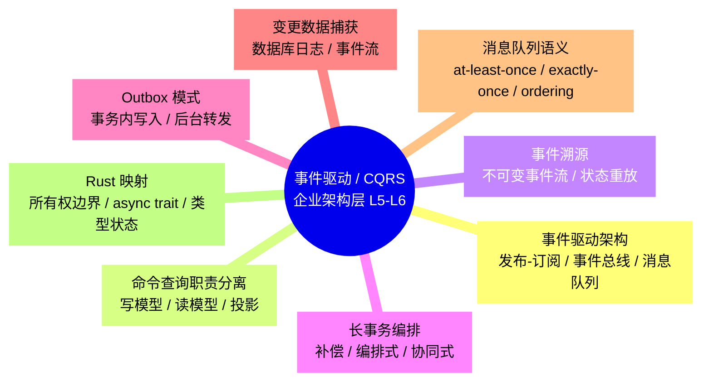
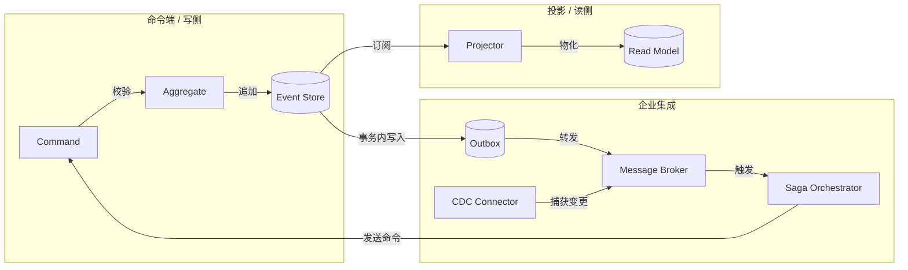
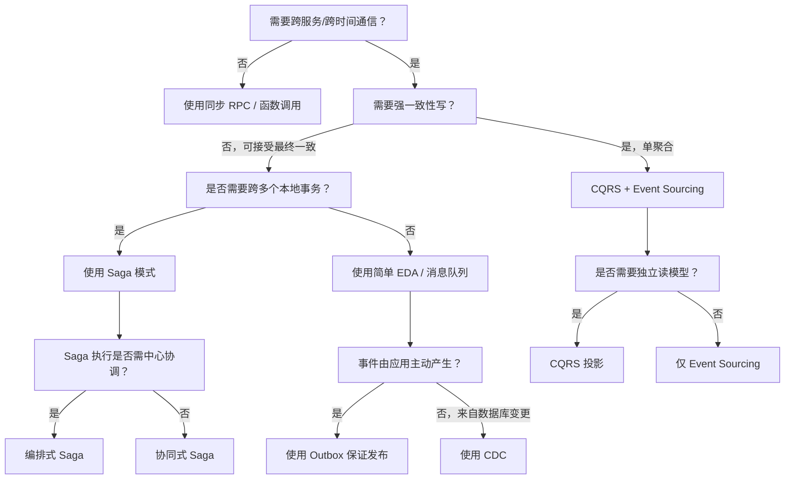

> **内容分级**: [专家级]
> **代码状态**: ✅ 含可编译示例与标注块
> **A/S/P 标记**: **P+S+A** — Procedure + Structure + Application — Structure + Application + Procedure
>
# 事件驱动架构、CQRS 与企业集成模式（Event-Driven, CQRS & Enterprise Integration Patterns）

**EN**: Event-Driven Architecture, CQRS and Enterprise Integration Patterns in Rust
**Summary**: Enterprise-grade event-driven architecture, CQRS, event sourcing, Saga, Outbox, CDC and message-queue semantics mapped to Rust ownership, async and type-system boundaries.

> **Rust 版本**: 1.97.0+ (Edition 2024)
> **Bloom 层级**: L5-L6
> **权威来源**: 本文件为 `concept/` 权威页，聚焦**企业架构层**的事件驱动与 CQRS 模式族。具体实现模式参见：
>
> - [事件驱动架构](../03_design_patterns/06_event_driven_architecture.md)（L3-L6 模式层）
> - [CQRS & Event Sourcing](../03_design_patterns/07_cqrs_event_sourcing.md)（L4-L6 模式层）
> - [事件溯源引擎模式](../03_design_patterns/37_event_sourcing_engine_patterns.md)（L5-L6 引擎实现）
> - [Saga 模式](../03_design_patterns/29_saga.md)、[Outbox 模式](../03_design_patterns/30_outbox.md)
> - [Actor 模型与消息传递模式](../03_design_patterns/42_actor_model_and_message_passing_patterns.md)
> - [数据密集型系统设计](../06_data_and_distributed/10_data_intensive_systems_design.md)
> - [P10-3 CQRS / Event Sourcing canonical](../../05_comparative/05_idioms_patterns_architecture/04_architecture/02_cqrs_event_sourcing.md)
> - [P10-3 Event Bus canonical](../../05_comparative/05_idioms_patterns_architecture/04_architecture/06_event_bus.md)
> **前置概念**: [微服务架构模式](08_microservices_patterns_in_rust.md) · [DDD 战术模式](04_domain_driven_design_in_rust.md) · [战略 DDD](05_strategic_domain_driven_design_in_rust.md) · [Async](../../03_advanced/01_async/01_async.md)
> **L5 对比**: [Rust vs Java](../../05_comparative/02_managed_languages/01_rust_vs_java.md) · [Rust vs Go](../../05_comparative/01_systems_languages/03_rust_vs_go.md)
> **后置概念**: [云原生与 Serverless 模式](12_cloud_native_and_serverless_patterns.md) · [可观测性与 SRE 模式](09_observability_and_sre_patterns.md)

---

> **来源 / Provenance**:
> [Martin Fowler — Event Sourcing](https://martinfowler.com/eaaDev/EventSourcing.html) ·
> [Martin Fowler — CQRS](https://martinfowler.com/bliki/CQRS.html) ·
> [Microsoft — CQRS Journey](https://learn.microsoft.com/en-us/previous-versions/msp-n-p/jj554200(v=pandp.10)) ·
> [Hohpe & Woolf — Enterprise Integration Patterns](https://www.enterpriseintegrationpatterns.com/) ·
> [Young — CQRS Documents](https://cqrs.files.wordpress.com/2010/11/cqrs_documents.pdf) ·
> [Debezium Documentation](https://debezium.io/documentation/) ·
> [AWS — Saga Pattern](https://docs.aws.amazon.com/prescriptive-guidance/latest/modernization-data-persistence/saga-pattern.html)

---

## 📑 目录

- [事件驱动架构、CQRS 与企业集成模式（Event-Driven, CQRS \& Enterprise Integration Patterns）](#事件驱动架构cqrs-与企业集成模式event-driven-cqrs--enterprise-integration-patterns)
  - [📑 目录](#-目录)
  - [🧠 知识结构图](#-知识结构图)
  - [一、权威定义与企业语义](#一权威定义与企业语义)
    - [1.1 事件驱动架构（EDA）](#11-事件驱动架构eda)
    - [1.2 CQRS：命令查询职责分离](#12-cqrs命令查询职责分离)
    - [1.3 事件溯源（ES）](#13-事件溯源es)
    - [1.4 Saga、Outbox 与 CDC](#14-sagaoutbox-与-cdc)
  - [二、企业级模式语义矩阵](#二企业级模式语义矩阵)
  - [三、Rust 实现惯用法](#三rust-实现惯用法)
    - [3.1 类型安全的事件总线骨架](#31-类型安全的事件总线骨架)
    - [3.2 最小 Saga 编排器](#32-最小-saga-编排器)
    - [3.3 Outbox 表的 Rust 语义](#33-outbox-表的-rust-语义)
    - [3.4 CDC 变更捕获抽象](#34-cdc-变更捕获抽象)
  - [四、反例与边界](#四反例与边界)
    - [4.1 反例：在 saga 补偿中忽略顺序导致状态不一致](#41-反例在-saga-补偿中忽略顺序导致状态不一致)
    - [4.2 反例：Outbox 与业务表不在同一事务](#42-反例outbox-与业务表不在同一事务)
    - [4.3 反例：把 CDC 当消息总线，忽略 schema 契约](#43-反例把-cdc-当消息总线忽略-schema-契约)
    - [4.4 编译错误：事件处理器未实现 `Send`](#44-编译错误事件处理器未实现-send)
  - [五、决策树：何时选用何种模式](#五决策树何时选用何种模式)
  - [六、与国际权威来源对齐](#六与国际权威来源对齐)
  - [七、权威来源索引](#七权威来源索引)
    - [P0 — Rust 官方与核心规范](#p0--rust-官方与核心规范)
    - [P1 — 学术与行业权威](#p1--学术与行业权威)
    - [P2 — 生态权威与参考实现](#p2--生态权威与参考实现)
  - [八、相关概念链接](#八相关概念链接)

---

## 🧠 知识结构图



> **认知功能**: 本 mindmap 将企业级事件驱动系统拆分为 7 个正交语义域。核心洞察：**事件是跨时间、跨服务、跨模型的一致语言；CQRS/ES/Saga/Outbox/CDC 是用事件在不同位置解决不同一致性问题的互补模式**。

---

## 一、权威定义与企业语义

### 1.1 事件驱动架构（EDA）

**Event-Driven Architecture (EDA)**: 系统组件通过异步事件进行通信的架构风格。事件表示“已发生的事实”，携带领域语义，解耦发布者与订阅者。

在企业架构中，EDA 的核心价值：

| 价值 | 说明 | Rust 映射 |
|:---|:---|:---|
| **时间解耦** | 发布者与消费者不必同时在线 | `tokio::sync::mpsc` / 消息代理持久化 |
| **空间解耦** | 消费者无需知道生产者地址 | 消息队列 topic / exchange |
| **伸缩解耦** | 可独立扩展生产端与消费端 | async task pool / 背压控制 |
| **语义解耦** | 通过事件契约而非 API 契约集成 | 强类型 `Event` enum + schema 注册 |

> **来源**: [Hohpe & Woolf — Enterprise Integration Patterns](https://www.enterpriseintegrationpatterns.com/) · [Martin Fowler — Event-Driven Architecture](https://martinfowler.com/articles/201701-event-driven.html)

---

### 1.2 CQRS：命令查询职责分离

**CQRS (Command Query Responsibility Segregation)**: 将写入模型（Command）与读取模型（Query）显式分离的架构模式。不是简单的“读写分离数据库”，而是**允许读写两侧使用不同的数据结构、存储技术与一致性模型**。

企业级 CQRS 的 4 个语义维度：

```text
┌─────────────────┐         ┌─────────────────┐
│   Command Side  │         │    Query Side   │
│  聚合根 + 写模型  │ ──────► │   投影 + 读模型  │
│  强一致性 / OLTP  │  事件   │  最终一致 / OLAP │
└─────────────────┘         └─────────────────┘
```

| 维度 | Command Side | Query Side |
|:---|:---|:---|
| **操作语义** | 改变状态，产生事件 | 返回只读视图 |
| **一致性** | 通常强一致（单聚合内） | 最终一致 |
| **数据结构** | 面向写：聚合根、不变量 | 面向读：展平视图、索引 |
| **典型存储** | 关系型 / 事件存储 | 搜索引擎、时序库、缓存 |
| **Rust 抽象** | `Aggregate::handle(cmd) -> Vec<Event>` | `Projector::apply(event) -> View` |

> **权威来源**: [Martin Fowler — CQRS](https://martinfowler.com/bliki/CQRS.html) · [Microsoft — CQRS Journey](https://learn.microsoft.com/en-us/previous-versions/msp-n-p/jj554200(v=pandp.10))

---

### 1.3 事件溯源（ES）

**Event Sourcing**: 将状态变更持久化为不可变事件序列的持久化策略。当前状态是事件流的 fold 结果。

企业级事件溯源的三大不变量：

1. **Append-only**: 事件流只追加，不修改历史；
2. **Totally ordered per aggregate**: 同一聚合根内事件全序；
3. **Schema-versioned**: 每个事件携带版本，支持向上转换（upcasting）。

> 详细实现模式参见 [事件溯源引擎模式](../03_design_patterns/37_event_sourcing_engine_patterns.md)。

---

### 1.4 Saga、Outbox 与 CDC

| 模式 | 解决的问题 | 核心语义 | Rust 关注点 |
|:---|:---|:---|:---|
| **Saga** | 跨服务长事务一致性 | 通过**补偿**达到最终一致；编排式（Orchestration）vs 协同式（Choreography） | 补偿顺序、幂等性、状态机 |
| **Outbox** | 数据库更新 + 事件发布原子性 | 业务表与 Outbox 表在同一本地事务写入；后台转发器拉取并发布 | 事务边界、至少一次投递、去重 |
| **CDC (Change Data Capture)** | 把数据库变更转为事件流 | 读取 WAL/binlog，捕获 `INSERT/UPDATE/DELETE` 并映射为领域事件 | schema 契约、初始快照、偏移量管理 |

> **来源**: [Hohpe & Woolf — Enterprise Integration Patterns](https://www.enterpriseintegrationpatterns.com/) · [AWS — Saga Pattern](https://docs.aws.amazon.com/prescriptive-guidance/latest/modernization-data-persistence/saga-pattern.html) · [Debezium Documentation](https://debezium.io/documentation/)

---

## 二、企业级模式语义矩阵



**多维矩阵对比**:

| 模式 | 主要一致性 | 失败恢复 | 顺序保证 | 复杂度来源 | 适用 Rust 场景 |
|:---|:---|:---|:---|:---|:---|
| **CQRS（无 ES）** | 写强一致 / 读最终一致 | 重放投影 | 读侧可乱序重建 | 数据模型双份 | 高读低写微服务 |
| **CQRS + ES** | 写强一致（单聚合） / 读最终一致 | 事件重放 | 聚合内全序 | 事件 schema 治理 | 审计、金融、供应链 |
| **Saga 编排** | 最终一致 | 补偿事务 | 流程内顺序 | 状态机 + 补偿设计 | 订单、预订、支付 |
| **Saga 协同** | 最终一致 | 各服务监听事件自补偿 | 事件驱动顺序 | 事件契约 + 超时 | 松耦合长流程 |
| **Outbox** | 本地事务 + 至少一次投递 | 转发器重试 | 不保证全局顺序 | 幂等消费 | 任何需“库表更新+发事件”的场景 |
| **CDC** | 最终一致 | 偏移量检查点 | 表内分区有序 | schema 映射 | 遗留系统现代化、数据同步 |

---

## 三、Rust 实现惯用法

### 3.1 类型安全的事件总线骨架

以下示例使用标准库实现一个**最小、类型安全的企业事件总线**核心。它展示了如何用 Rust 类型系统保证事件处理器与事件类型的匹配，并在编译期拒绝错误的事件类型。

```rust
/// 领域事件标记 trait。
pub trait DomainEvent: Send + Sync + 'static {
    fn event_type(&self) -> &'static str;
}

/// 类型安全的事件总线：对每种事件类型 E 维护一组处理器闭包。
/// 编译期保证 publish 的事件类型与 subscribe 时注册的类型一致。
pub struct TypedEventBus<E: DomainEvent> {
    handlers: Vec<Box<dyn Fn(&E) + Send + Sync>>,
}

impl<E: DomainEvent> TypedEventBus<E> {
    pub fn new() -> Self { Self { handlers: Vec::new() } }

    pub fn subscribe<F: Fn(&E) + Send + Sync + 'static>(&mut self, handler: F) {
        self.handlers.push(Box::new(handler));
    }

    pub fn publish(&self, event: E) {
        for h in &self.handlers {
            h(&event);
        }
    }
}

#[derive(Debug)]
struct OrderCreated { order_id: String }

impl DomainEvent for OrderCreated {
    fn event_type(&self) -> &'static str { "OrderCreated" }
}

#[derive(Debug)]
struct PaymentReceived { order_id: String }

impl DomainEvent for PaymentReceived {
    fn event_type(&self) -> &'static str { "PaymentReceived" }
}

fn main() {
    let mut order_bus: TypedEventBus<OrderCreated> = TypedEventBus::new();
    order_bus.subscribe(|e| println!("[handler A] {:?}", e));
    order_bus.subscribe(|e| println!("[handler B] order_id={}", e.order_id));

    order_bus.publish(OrderCreated { order_id: "ORD-001".into() });

    // 以下代码若取消注释会导致编译错误：PaymentReceived 不能发到 OrderCreated 总线
    // order_bus.publish(PaymentReceived { order_id: "ORD-001".into() });

    println!("类型安全事件总线骨架：编译期保证事件-处理器匹配");
}
```

> **关键洞察**: `TypedEventBus<E>` 利用 Rust 单态化在编译期建立“事件类型 ⇄ 处理器签名”的对应关系，取消注释的 `PaymentReceived` 发送会被编译器拒绝。生产实现参见 [事件驱动架构](../03_design_patterns/06_event_driven_architecture.md) 中的 `tokio::sync::broadcast`、`lapin`、`rdkafka` 示例。

---

### 3.2 最小 Saga 编排器

以下示例展示一个**纯 Rust 标准库实现的 Saga 编排器骨架**，强调补偿顺序、幂等键与状态机。

```rust
use std::collections::VecDeque;
use std::fmt;

/// Saga 中的一个步骤：正向操作 + 补偿操作。
pub struct SagaStep<Context> {
    name: &'static str,
    action: Box<dyn Fn(&mut Context) -> Result<(), SagaError>>,
    compensate: Box<dyn Fn(&mut Context) -> Result<(), SagaError>>,
}

#[derive(Debug)]
pub struct SagaError {
    pub step: &'static str,
    pub message: String,
}

impl fmt::Display for SagaError {
    fn fmt(&self, f: &mut fmt::Formatter<'_>) -> fmt::Result {
        write!(f, "Saga step '{}' failed: {}", self.step, self.message)
    }
}

impl std::error::Error for SagaError {}

/// 编排式 Saga：按顺序执行步骤，失败时按**相反顺序**补偿。
pub struct Saga<Context> {
    steps: Vec<SagaStep<Context>>,
}

impl<Context> Saga<Context> {
    pub fn new() -> Self { Self { steps: Vec::new() } }

    pub fn add_step(
        &mut self,
        name: &'static str,
        action: impl Fn(&mut Context) -> Result<(), SagaError> + 'static,
        compensate: impl Fn(&mut Context) -> Result<(), SagaError> + 'static,
    ) {
        self.steps.push(SagaStep {
            name,
            action: Box::new(action),
            compensate: Box::new(compensate),
        });
    }

    pub fn execute(&self, ctx: &mut Context) -> Result<(), SagaError> {
        let mut completed: VecDeque<&SagaStep<Context>> = VecDeque::new();

        for step in &self.steps {
            if let Err(e) = (step.action)(ctx) {
                // 反向补偿：LIFO 顺序
                while let Some(s) = completed.pop_back() {
                    if (s.compensate)(ctx).is_err() {
                        // 补偿失败需人工介入或记录待处理异常
                        eprintln!("Compensation failed for step {}", s.name);
                    }
                }
                return Err(e);
            }
            completed.push_back(step);
        }
        Ok(())
    }
}

#[derive(Debug, Default)]
struct OrderContext {
    inventory_reserved: bool,
    payment_charged: bool,
    shipment_created: bool,
}

fn main() {
    let mut saga: Saga<OrderContext> = Saga::new();

    saga.add_step(
        "reserve_inventory",
        |ctx| { ctx.inventory_reserved = true; Ok(()) },
        |ctx| { ctx.inventory_reserved = false; Ok(()) },
    );
    saga.add_step(
        "charge_payment",
        |ctx| { ctx.payment_charged = true; Ok(()) },
        |ctx| { ctx.payment_charged = false; Ok(()) },
    );
    saga.add_step(
        "create_shipment",
        |ctx| { ctx.shipment_created = true; Ok(()) },
        |ctx| { ctx.shipment_created = false; Ok(()) },
    );

    let mut ctx = OrderContext::default();
    match saga.execute(&mut ctx) {
        Ok(()) => println!("Saga completed: {:?}", ctx),
        Err(e) => eprintln!("Saga failed: {}", e),
    }
}
```

> **关键洞察**: Saga 不是 ACID 事务的替代，而是**用显式补偿把分布式一致性降级为最终一致**。Rust 的 `Result` 与显式错误类型天然适合表达“正向成功 / 补偿失败”两级失败模型。

---

### 3.3 Outbox 表的 Rust 语义

Outbox 模式把“业务写入”与“事件发布”拆成两个本地步骤，保证原子性。

```rust
use std::collections::VecDeque;

/// 业务聚合事件。
#[derive(Debug, Clone)]
pub struct OutboxEvent {
    pub aggregate_id: String,
    pub payload: String,
}

/// 模拟本地事务边界：业务表 + Outbox 表同时更新。
pub struct LocalUnitOfWork {
    business_records: Vec<String>,
    outbox: VecDeque<OutboxEvent>,
    committed: bool,
}

impl LocalUnitOfWork {
    pub fn new() -> Self {
        Self { business_records: Vec::new(), outbox: VecDeque::new(), committed: false }
    }

    pub fn create_order(&mut self, id: &str) {
        self.business_records.push(format!("order:{}", id));
        self.outbox.push_back(OutboxEvent {
            aggregate_id: id.into(),
            payload: format!("{{\"type\":\"OrderCreated\",\"id\":\"{}\"}}", id),
        });
    }

    /// 提交：原子地持久化业务记录与 Outbox。
    pub fn commit(&mut self) {
        self.committed = true;
        println!("Committed {} records with {} outbox events",
                 self.business_records.len(), self.outbox.len());
    }

    /// Outbox 转发器在提交后读取并发布事件。
    pub fn drain_outbox(&mut self) -> Vec<OutboxEvent> {
        self.outbox.drain(..).collect()
    }
}

fn main() {
    let mut uow = LocalUnitOfWork::new();
    uow.create_order("ORD-2026-001");
    uow.commit();

    for ev in uow.drain_outbox() {
        println!("Publishing outbox event: {:?}", ev);
    }
}
```

> **设计要点**: 真实实现中，`commit()` 对应数据库事务的 `BEGIN ... COMMIT`；`OutboxEvent` 表与业务表在同一事务写入。转发器独立进程读取 Outbox 并发布到消息代理，失败时重试；消费者必须幂等。

---

### 3.4 CDC 变更捕获抽象

CDC 把数据库变更日志转换为领域事件。以下是一个**与具体数据库无关的 CDC 变更记录抽象**，展示如何把行级变更映射为类型化事件。

```rust
/// CDC 变更类型。
#[derive(Debug, Clone, Copy, PartialEq, Eq)]
pub enum ChangeOp { Insert, Update, Delete }

/// 原始变更记录。
#[derive(Debug, Clone)]
pub struct ChangeRecord {
    pub table: String,
    pub op: ChangeOp,
    pub key: String,
    pub before: Option<String>,
    pub after: Option<String>,
    pub offset: u64,
}

/// 把变更记录映射为领域事件。
pub trait CdcMapper<E> {
    fn map(&self, record: &ChangeRecord) -> Option<E>;
}

/// 幂等、可重入的 CDC 消费者。
pub struct CdcConsumer<E, M: CdcMapper<E>> {
    mapper: M,
    last_offset: u64,
    _phantom: std::marker::PhantomData<E>,
}

impl<E, M: CdcMapper<E>> CdcConsumer<E, M> {
    pub fn new(mapper: M) -> Self {
        Self { mapper, last_offset: 0, _phantom: std::marker::PhantomData }
    }

    pub fn process(&mut self, record: ChangeRecord) -> Option<E> {
        if record.offset <= self.last_offset {
            // 去重：已处理过的偏移量
            return None;
        }
        let event = self.mapper.map(&record);
        self.last_offset = record.offset;
        event
    }
}

#[derive(Debug)]
pub enum OrderEvent { Created(String), Updated(String), Deleted(String) }

pub struct OrderCdcMapper;

impl CdcMapper<OrderEvent> for OrderCdcMapper {
    fn map(&self, r: &ChangeRecord) -> Option<OrderEvent> {
        if r.table != "orders" { return None; }
        match r.op {
            ChangeOp::Insert => Some(OrderEvent::Created(r.key.clone())),
            ChangeOp::Update => Some(OrderEvent::Updated(r.key.clone())),
            ChangeOp::Delete => Some(OrderEvent::Deleted(r.key.clone())),
        }
    }
}

fn main() {
    let mut consumer = CdcConsumer::new(OrderCdcMapper);
    let events = vec![
        ChangeRecord { table: "orders".into(), op: ChangeOp::Insert, key: "ORD-001".into(), before: None, after: Some("{}".into()), offset: 1 },
        ChangeRecord { table: "orders".into(), op: ChangeOp::Update, key: "ORD-001".into(), before: Some("{}".into()), after: Some("{}".into()), offset: 2 },
        ChangeRecord { table: "orders".into(), op: ChangeOp::Insert, key: "ORD-001".into(), before: None, after: Some("{}".into()), offset: 1 }, // 重复
    ];

    for r in events {
        if let Some(e) = consumer.process(r) {
            println!("Mapped: {:?}", e);
        } else {
            println!("Skipped duplicate or unmapped");
        }
    }
}
```

---

## 四、反例与边界

### 4.1 反例：在 saga 补偿中忽略顺序导致状态不一致

```rust,compile_fail
// 错误示范：补偿顺序不是正向的逆序，导致先释放了库存但支付仍扣款。
fn compensate_wrong_order(ctx: &mut OrderContext) {
    ctx.payment_charged = false; // ❌ 先退款
    ctx.inventory_reserved = false; // 但此时若支付退款失败，库存已释放
}
```

> 正确做法：补偿必须是正向操作的**严格逆序（LIFO）**，保证每一步补偿都建立在“后续步骤已撤销”的基础上。

---

### 4.2 反例：Outbox 与业务表不在同一事务

```text
❌ 错误流程：
  BEGIN;
    INSERT INTO orders ...;
  COMMIT;
  INSERT INTO outbox ...; -- 独立连接，可能失败
  -- 结果：订单已创建但事件未发出，下游系统不一致

✅ 正确流程：
  BEGIN;
    INSERT INTO orders ...;
    INSERT INTO outbox ...;
  COMMIT;
  -- 转发器读取 outbox 并发布；至少一次投递 + 幂等消费
```

> 边界：Outbox 模式保证的是“本地事务原子性 + 至少一次投递”，不保证消费者立即看到事件。

---

### 4.3 反例：把 CDC 当消息总线，忽略 schema 契约

```text
❌ 错误假设：
  CDC 捕获的 raw JSON 行变更 = 领域事件
  -- 结果：数据库列名泄漏到下游；schema 微调破坏所有消费者

✅ 正确做法：
  CDC 记录 → Schema 注册表校验 → 领域事件映射 → 消息代理
  -- 数据库 schema 与领域事件 schema 解耦，由映射层控制变更
```

---

### 4.4 编译错误：事件处理器未实现 `Send`

在企业级事件总线中，事件处理器通常被分发到线程池或 async runtime。如果事件类型包含 `Rc` 或裸指针，将无法跨线程发送。

```rust,compile_fail
use std::rc::Rc;

#[derive(Clone)]
struct BadEvent {
    data: Rc<String>, // ❌ Rc 不是 Send
}

fn spawn_handler<F: Fn() + Send + 'static>(f: F) {
    std::thread::spawn(move || { f(); });
}

fn main() {
    let ev = BadEvent { data: Rc::new("hello".into()) };
    // 错误：closure 捕获了包含 Rc 的 ev，因此不是 Send
    spawn_handler(move || { drop(ev); });
}
```

> 修正：使用 `Arc<String>` 替代 `Rc<String>`，并确保事件实现 `Send + Sync`。

---

## 五、决策树：何时选用何种模式



> **认知功能**: 该决策树从“一致性需求”与“事件来源”两个维度把 6 个模式区分开。关键分支：强一致写 → CQRS+ES；跨事务 → Saga；数据库变更 → CDC；应用主动事件 → Outbox。

---

## 六、与国际权威来源对齐

| 本地概念 | 国际权威来源 | 对齐说明 |
|:---|:---|:---|
| EDA 发布-订阅 / 事件总线 | Hohpe & Woolf — *Enterprise Integration Patterns* | 对齐 Message Channel、Publish-Subscribe Channel、Event Message 模式 |
| CQRS | Martin Fowler / Microsoft CQRS Journey | 分离命令与查询，允许读写模型独立演进 |
| Event Sourcing | Martin Fowler — Event Sourcing | 状态 = fold(事件流)；追加-only；支持审计 |
| Saga | AWS / Microsoft / Fowler | 跨服务长事务用补偿达到最终一致；区分编排式与协同式 |
| Outbox | Hohpe & Woolf / Microservices.io | 事务内写入事件表，后台转发保证“库表更新+事件发布”原子性 |
| CDC | Debezium / Martin Fowler | 读取数据库日志捕获变更；需 schema 映射层 |
| 消息队列语义 | RabbitMQ / Kafka / NATS 文档 | at-least-once / exactly-once / ordering 的权衡 |

---

## 七、权威来源索引

### P0 — Rust 官方与核心规范

- [The Rust Programming Language](https://doc.rust-lang.org/book/title-page.html)
- [The Rust Reference](https://doc.rust-lang.org/reference/introduction.html)
- [Asynchronous Programming in Rust](https://rust-lang.github.io/async-book/)

### P1 — 学术与行业权威

- [Hohpe & Woolf — Enterprise Integration Patterns](https://www.enterpriseintegrationpatterns.com/)
- [Martin Fowler — Event Sourcing](https://martinfowler.com/eaaDev/EventSourcing.html)
- [Martin Fowler — CQRS](https://martinfowler.com/bliki/CQRS.html)
- [Martin Fowler — Event-Driven Architecture](https://martinfowler.com/articles/201701-event-driven.html)
- [Microsoft — CQRS Journey](https://learn.microsoft.com/en-us/previous-versions/msp-n-p/jj554200(v=pandp.10))
- [Young — CQRS Documents](https://cqrs.files.wordpress.com/2010/11/cqrs_documents.pdf)
- [AWS — Saga Pattern](https://docs.aws.amazon.com/prescriptive-guidance/latest/modernization-data-persistence/saga-pattern.html)
- [Lamport, L. — Time, Clocks, and the Ordering of Events in a Distributed System](https://dl.acm.org/doi/10.1145/359545.359563) — 分布式事件排序奠基论文
- [Gilbert & Lynch — Brewer's Conjecture and the Feasibility of Consistent, Available, Partition-Tolerant Web Services](https://dl.acm.org/doi/10.1145/564585.564601) — CAP 定理形式化

### P2 — 生态权威与参考实现

- [Debezium Documentation](https://debezium.io/documentation/)
- [Kafka Documentation](https://kafka.apache.org/documentation/)
- [RabbitMQ Tutorials](https://www.rabbitmq.com/tutorials)
- [NATS Documentation](https://docs.nats.io/)
- [tokio](https://tokio.rs/) · [lapin](https://docs.rs/lapin/) · [rdkafka](https://docs.rs/rdkafka/) · [flume](https://docs.rs/flume/)

---

## 八、相关概念链接

- [事件驱动架构](../03_design_patterns/06_event_driven_architecture.md) — 事件总线、发布-订阅、消息队列实现细节
- [CQRS & Event Sourcing](../03_design_patterns/07_cqrs_event_sourcing.md) — CQRS+ES 深度模式
- [事件溯源引擎模式](../03_design_patterns/37_event_sourcing_engine_patterns.md) — 引擎级实现
- [Saga 模式](../03_design_patterns/29_saga.md) — Saga 详细实现
- [Outbox 模式](../03_design_patterns/30_outbox.md) — Outbox 详细实现
- [Actor 模型与消息传递模式](../03_design_patterns/42_actor_model_and_message_passing_patterns.md) — Actor 风格事件处理
- [数据密集型系统设计](../06_data_and_distributed/10_data_intensive_systems_design.md) — 数据系统一致性基础
- [微服务架构模式](08_microservices_patterns_in_rust.md) — 服务边界与通信
- [可观测性与 SRE 模式](09_observability_and_sre_patterns.md) — 事件驱动系统的可观测性
- [云原生与 Serverless 模式](12_cloud_native_and_serverless_patterns.md) — 部署与运行时
- [Rust vs Java](../../05_comparative/02_managed_languages/01_rust_vs_java.md) — Actor / 消息传递并发模型对比
- [Rust vs Go](../../05_comparative/01_systems_languages/03_rust_vs_go.md) — 并发模型与错误处理对比

---

> **文档版本**: 1.0
> **最后更新**: 2026-08-04
> **状态**: ✅ P7 WS-D 新增权威页
