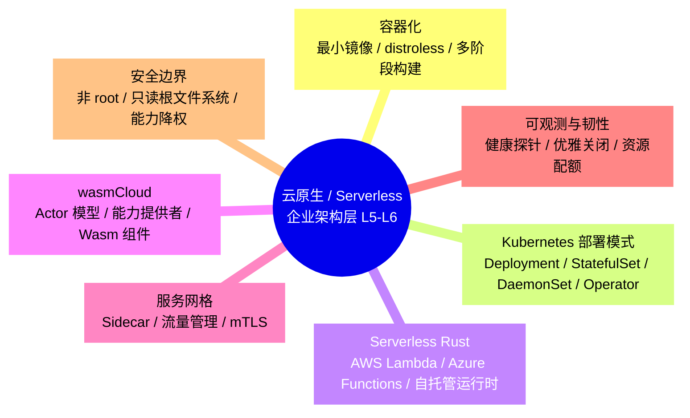
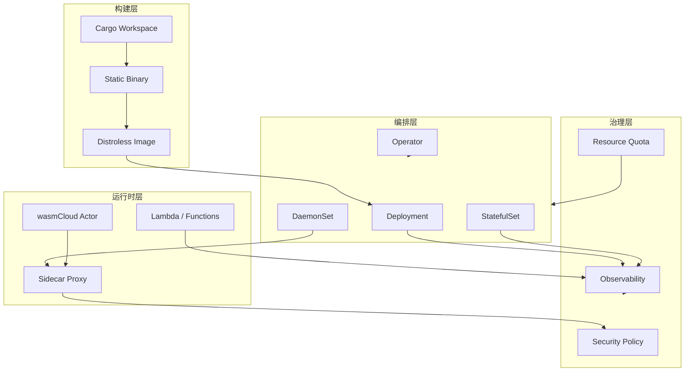
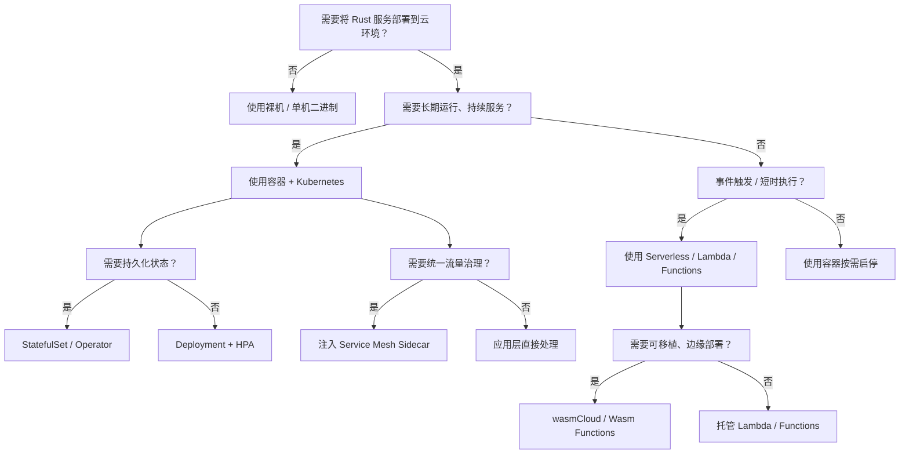

> **内容分级**: [专家级]
> **代码状态**: ✅ 含可编译示例与标注块
> **A/S/P 标记**: **S+A+P** — Structure + Application + Procedure
>
# 云原生与 Serverless 模式（Cloud Native & Serverless Patterns）

**EN**: Cloud Native and Serverless Patterns in Rust
**Summary**: Enterprise architecture patterns for containerized Rust services, Kubernetes deployment topologies, serverless runtimes, wasmCloud actors, and service-mesh sidecars.

> **Rust 版本**: 1.97.0+ (Edition 2024)
> **Bloom 层级**: L5-L6
> **权威来源**: 本文件为 `concept/` 权威页，聚焦**企业架构层**的云原生与 Serverless 模式族。具体工具链与部署细节参见：
>
> - [Rust 云原生生态](../04_web_and_networking/02_cloud_native.md)（L3-L4 生态概览）
> - [Rust 服务与 Kubernetes](../04_web_and_networking/11_kubernetes_rust.md)（L4-L6 K8s 部署实践）
> - [WebAssembly](../11_domain_applications/03_webassembly.md)（Wasm 生态概览）
> - [Rust WebAssembly 高级开发](../11_domain_applications/17_webassembly_advanced.md)
> - [安全架构](../07_security_and_cryptography/04_security_architecture.md)
> **前置概念**: [微服务架构模式](08_microservices_patterns_in_rust.md) · [事件驱动与 CQRS 模式](11_event_driven_and_cqrs_patterns.md) · [可观测性与 SRE 模式](09_observability_and_sre_patterns.md) · [Async](../../03_advanced/01_async/01_async.md)
> **后置概念**: [AI 模型服务](../../07_future/04_research_and_experimental/11_rust_for_ai_model_serving.md)
> **L5 对比**: [Rust vs Go](../../05_comparative/01_systems_languages/03_rust_vs_go.md) · [Rust vs C++](../../05_comparative/01_systems_languages/01_rust_vs_cpp.md)

---

> **来源 / Provenance**:
> [CNCF Cloud Native Definition](https://github.com/cncf/toc/blob/main/DEFINITION.md) ·
> [Kubernetes Documentation](https://kubernetes.io/docs/) ·
> [AWS Lambda Rust Runtime](https://github.com/awslabs/aws-lambda-rust-runtime) ·
> [wasmCloud Documentation](https://wasmcloud.com/docs/) ·
> [Linkerd Documentation](https://linkerd.io/2/overview/) ·
> [Istio Documentation](https://istio.io/latest/docs/) ·
> [Google Distroless](https://github.com/GoogleContainerTools/distroless) ·
> [Azure Well-Architected Framework](https://learn.microsoft.com/azure/well-architected/)

---

## 📑 目录

- [云原生与 Serverless 模式（Cloud Native \& Serverless Patterns）](#云原生与-serverless-模式cloud-native--serverless-patterns)
  - [📑 目录](#-目录)
  - [🧠 知识结构图](#-知识结构图)
  - [一、权威定义与企业语义](#一权威定义与企业语义)
    - [1.1 云原生（Cloud Native）](#11-云原生cloud-native)
    - [1.2 Serverless](#12-serverless)
    - [1.3 服务网格（Service Mesh）](#13-服务网格service-mesh)
  - [二、云原生模式语义矩阵](#二云原生模式语义矩阵)
  - [三、Rust 实现惯用法](#三rust-实现惯用法)
    - [3.1 容器化：最小 distroless 镜像语义](#31-容器化最小-distroless-镜像语义)
    - [3.2 Kubernetes 部署模式抽象](#32-kubernetes-部署模式抽象)
    - [3.3 Serverless Rust：Lambda 运行时骨架](#33-serverless-rustlambda-运行时骨架)
    - [3.4 wasmCloud Actor 语义](#34-wasmcloud-actor-语义)
    - [3.5 Sidecar 模式：可观测性代理](#35-sidecar-模式可观测性代理)
  - [四、反例与边界](#四反例与边界)
    - [4.1 反例：把容器当虚拟机，镜像臃肿](#41-反例把容器当虚拟机镜像臃肿)
    - [4.2 反例：Lambda 函数持有状态导致扩容失效](#42-反例lambda-函数持有状态导致扩容失效)
    - [4.3 反例：sidecar 引入循环依赖](#43-反例sidecar-引入循环依赖)
    - [4.4 边界：服务网格的时延与资源开销](#44-边界服务网格的时延与资源开销)
  - [五、决策树：云原生模式选型](#五决策树云原生模式选型)
  - [六、与国际权威来源对齐](#六与国际权威来源对齐)
  - [七、权威来源索引](#七权威来源索引)
    - [P0 — Rust 官方与核心规范](#p0--rust-官方与核心规范)
    - [P1 — 云原生与架构权威](#p1--云原生与架构权威)
    - [P2 — 生态权威与参考实现](#p2--生态权威与参考实现)
  - [八、相关概念链接](#八相关概念链接)

---

## 🧠 知识结构图



> **认知功能**: 本 mindmap 把企业级云原生架构拆分为 7 个互补维度。核心洞察：**Rust 的云原生价值 = 自包含二进制 + 内存安全 + 无 GC 尾延迟；企业架构需要在这些语言特性之上叠加容器、编排、Serverless、网格与可观测性模式**。

---

## 一、权威定义与企业语义

### 1.1 云原生（Cloud Native）

**Cloud Native**（CNCF 定义）: 一种构建和运行应用程序的方法，充分利用云计算交付模型的优势；核心特征包括容器、服务网格、微服务、不可变基础设施和声明式 API。

对企业架构而言，云原生的 5 个语义支柱：

| 支柱 | 企业语义 | Rust 映射 |
|:---|:---|:---|
| **容器化** | 可移植、自包含的部署单元 | 静态链接二进制 → 最小镜像 |
| **微服务** | 围绕业务能力组织服务 | `cargo workspace` + 独立 crate |
| **服务网格** | 统一流量、安全、可观测性 | sidecar / proxyless gRPC |
| **声明式 API** | 期望状态驱动系统收敛 | Kubernetes manifests / CRD Operator |
| **弹性工程** | 故障隔离、自动恢复 | 健康探针、优雅关闭、断路器 |

> **来源**: [CNCF Cloud Native Definition](https://github.com/cncf/toc/blob/main/DEFINITION.md)

---

### 1.2 Serverless

**Serverless**: 云计算执行模型，云提供商动态管理资源分配；开发者以函数或容器为单位交付代码，按调用/执行时间计费。

Serverless 的 3 个核心语义约束：

1. **无状态（Stateless）**: 函数实例不保留请求间状态；状态必须外置到数据库、缓存或对象存储。
2. **事件驱动（Event-Driven）**: 函数由事件触发（HTTP、队列、定时、存储变更）。
3. **快速冷启动（Fast Cold Start）**: 实例从零到可处理请求的延迟必须低；Rust 的静态二进制在此有显著优势。

> **来源**: [AWS Lambda Developer Guide](https://docs.aws.amazon.com/lambda/latest/dg/welcome.html)

---

### 1.3 服务网格（Service Mesh）

**Service Mesh**: 专门处理服务间通信的基础设施层，通过 sidecar 代理或进程内库实现流量管理、可观测性与安全（mTLS）。

服务网格的架构语义：

```text
┌─────────────┐      ┌─────────────┐      ┌─────────────┐
│  Service A  │◄────►│   Sidecar   │◄────►│   Sidecar   │◄────► Service B
│  (Rust app) │      │  (Envoy/    │      │  (Envoy/    │
└─────────────┘      │  Linkerd)   │      │  Linkerd)   │
                     └─────────────┘      └─────────────┘
                          │ control plane (mTLS / policy / telemetry)
```

| 能力 | 数据平面职责 | 控制平面职责 |
|:---|:---|:---|
| 流量管理 | 路由、负载均衡、超时、重试 | 下发 xDS / 配置 |
| 可观测性 | 指标、日志、追踪边车注入 | 聚合、策略、告警 |
| 安全 | mTLS 终止、鉴权 | 证书生命周期、策略 |

> **来源**: [Istio — What is a Service Mesh?](https://istio.io/latest/about/service-mesh/) · [Linkerd Documentation](https://linkerd.io/2/overview/)

---

## 二、云原生模式语义矩阵



**模式对比矩阵**:

| 模式 | 核心抽象 | 状态模型 | 扩容单元 | Rust 典型场景 | 主要权衡 |
|:---|:---|:---|:---|:---|:---|
| **容器 + Deployment** | 无状态 Pod | 外置 | Pod | Web API、微服务 | 需要共享状态时分片复杂 |
| **StatefulSet** | 有状态 Pod + 稳定标识 | 本地持久卷 | Pod | 数据库、消息队列 | 网络标识、存储拓扑约束 |
| **DaemonSet** | 每节点一个 Pod | 节点级 | 节点 | 日志代理、监控 sidecar | 资源占用随节点线性增长 |
| **Operator** | 自定义资源 + 控制器 | 期望状态 | 控制器副本 | 复杂有状态服务 | 开发成本高，需理解 K8s 控制循环 |
| **AWS Lambda** | 函数 | 无状态 | 并发实例 | 事件处理、API 后端 | 冷启动、执行时长、供应商锁定 |
| **wasmCloud Actor** | WebAssembly 组件 | 无状态 | wasm 实例 | 边缘计算、可移植函数 | 生态成熟度、调试工具 |
| **Service Mesh Sidecar** | 透明代理 | 无状态 | sidecar 容器 | 流量治理、零信任 | 额外延迟、资源开销 |

---

## 三、Rust 实现惯用法

### 3.1 容器化：最小 distroless 镜像语义

Rust 静态链接二进制天然适合最小容器。以下 Dockerfile 语义展示了“构建阶段用完整工具链，运行阶段用 distroless”的两阶段模式。

```dockerfile
# syntax=docker/dockerfile:1
# 阶段 1：构建
FROM rust:1.97-slim-bookworm AS builder
WORKDIR /app
COPY . .
RUN cargo build --release

# 阶段 2：最小运行时
FROM gcr.io/distroless/cc-debian12:nonroot
COPY --from=builder /app/target/release/my-service /usr/local/bin/my-service
USER nonroot:nonroot
EXPOSE 8080
ENTRYPOINT ["/usr/local/bin/my-service"]
```

> **关键洞察**: `distroless/cc` 镜像仅包含 glibc 与 CA 证书，无 shell、包管理器，攻击面最小。Rust 静态二进制（`RUSTFLAGS='-C target-feature=+crt-static'`）可进一步使用 `distroless/static`。

---

### 3.2 Kubernetes 部署模式抽象

以下 Rust 代码用标准库模拟 Kubernetes 控制器“观察期望状态与实际状态并收敛”的核心语义。

```rust
use std::collections::HashMap;

/// 期望状态（来自 Deployment / StatefulSet spec）。
#[derive(Debug, Clone, PartialEq, Eq)]
pub struct DesiredState {
    pub replicas: usize,
    pub image: String,
    pub labels: HashMap<String, String>,
}

/// 实际状态（来自集群当前 Pod）。
#[derive(Debug, Clone, PartialEq, Eq)]
pub struct ActualState {
    pub running_pods: Vec<String>,
}

/// 控制器决策：创建、删除、保持。
#[derive(Debug)]
pub enum ReconcileAction {
    CreatePod(String),
    DeletePod(String),
    NoOp,
}

pub struct K8sController;

impl K8sController {
    pub fn reconcile(desired: &DesiredState, actual: &ActualState) -> Vec<ReconcileAction> {
        let mut actions = Vec::new();
        let current = actual.running_pods.len();

        if current < desired.replicas {
            for i in current..desired.replicas {
                actions.push(ReconcileAction::CreatePod(format!("{}-{}", desired.image, i)));
            }
        } else if current > desired.replicas {
            for pod in &actual.running_pods[desired.replicas..] {
                actions.push(ReconcileAction::DeletePod(pod.clone()));
            }
        } else {
            actions.push(ReconcileAction::NoOp);
        }
        actions
    }
}

fn main() {
    let desired = DesiredState {
        replicas: 3,
        image: "my-rust-service:1.0.0".into(),
        labels: [("app".into(), "api".into())].into(),
    };
    let actual = ActualState {
        running_pods: vec!["my-rust-service:1.0.0-0".into(), "my-rust-service:1.0.0-1".into()],
    };

    for action in K8sController::reconcile(&desired, &actual) {
        println!("{:?}", action);
    }
}
```

> **认知功能**: Kubernetes 控制循环本质上是“期望状态与实际状态的差分驱动”。Rust 的 `PartialEq` 与不可变数据结构非常适合表达状态快照与收敛动作。

---

### 3.3 Serverless Rust：Lambda 运行时骨架

以下示例展示 AWS Lambda Rust 运行时的最小语义骨架。因依赖 AWS SDK，标记为 `ignore`；核心逻辑可在标准库验证。

```rust,ignore
// [dependencies]
// lambda_runtime = "0.13"
// serde = { version = "1", features = ["derive"] }
// tokio = { version = "1", features = ["macros"] }

use lambda_runtime::{service_fn, LambdaEvent, Error};
use serde_json::{json, Value};

async fn handler(event: LambdaEvent<Value>) -> Result<Value, Error> {
    let name = event.payload.get("name")
        .and_then(|v| v.as_str())
        .unwrap_or("world");

    Ok(json!({ "message": format!("Hello, {}!", name) }))
}

#[tokio::main]
async fn main() -> Result<(), Error> {
    lambda_runtime::run(service_fn(handler)).await
}
```

> **Serverless 设计约束映射到 Rust**:
>
> - 无状态：避免全局 `static mut`；使用函数参数与环境变量；
> - 快速启动：减少二进制体积与初始化工作；
> - 事件输入：`serde` 反序列化事件载荷；
> - 错误处理：Lambda 运行时期望 `Result`；业务错误应返回结构化响应而非 panic。

---

### 3.4 wasmCloud Actor 语义

wasmCloud 把 Rust 编译为 WebAssembly 组件（WASI Preview 2 / 组件模型），Actor 通过能力提供者（capability provider）访问外部资源。

```rust,ignore
// wasmCloud actor 骨架（依赖 wasmcloud-component 适配层）
// [dependencies]
// wit-bindgen = "0.39"

use serde::{Deserialize, Serialize};

#[derive(Serialize, Deserialize)]
struct GreetRequest {
    name: String,
}

#[derive(Serialize, Deserialize)]
struct GreetResponse {
    message: String,
}

// 由 wasmCloud 运行时调用
pub fn handle_greet(req: GreetRequest) -> GreetResponse {
    GreetResponse {
        message: format!("Hello from wasmCloud actor, {}!", req.name),
    }
}
```

> **wasmCloud 架构语义**:
>
> - **Actor**: 无状态 Wasm 组件，通过契约（interface）请求能力；
> - **Capability Provider**: 实现 `wasi:http`、`wasi:keyvalue` 等接口的运行时插件；
> - **Host Runtime**: 调度 actor 实例，注入能力；
> - **Lattice**: 分布式部署平面，支持 actor 跨节点通信。

---

### 3.5 Sidecar 模式：可观测性代理

服务网格 sidecar 可以用 Rust 实现为独立进程，通过共享网络命名空间拦截流量。以下是一个**纯 Rust 标准库模拟的 sidecar 健康检查代理**。

```rust
use std::io::{Read, Write};
use std::net::{TcpListener, TcpStream};
use std::thread;
use std::time::Duration;

/// Sidecar 健康检查代理：接收 `/healthz` 请求，代理到主应用。
fn handle_client(mut stream: TcpStream) {
    let mut buf = [0u8; 512];
    let _ = stream.read(&mut buf);

    // 简化：无论请求内容，都返回 200 OK
    let response = b"HTTP/1.1 200 OK\r\nContent-Length: 2\r\n\r\nOK";
    let _ = stream.write_all(response);
}

fn main() {
    let listener = TcpListener::bind("127.0.0.1:8081").expect("bind sidecar port");
    println!("Sidecar health proxy listening on 127.0.0.1:8081");

    for stream in listener.incoming() {
        match stream {
            Ok(s) => {
                thread::spawn(move || {
                    let _ = s.set_read_timeout(Some(Duration::from_secs(5)));
                    handle_client(s)
                });
            }
            Err(e) => eprintln!("Accept error: {}", e),
        }
    }
}
```

> **关键洞察**: 真实 sidecar（如 Linkerd2-proxy）用 Rust 编写，利用 Tokio 实现零拷贝、低延迟的流量拦截。sidecar 与主容器共享 `localhost` 网络，但拥有独立生命周期与资源配额。

---

## 四、反例与边界

### 4.1 反例：把容器当虚拟机，镜像臃肿

```dockerfile
# ❌ 错误：把 Rust 应用打包进完整 Ubuntu，包含大量无用工具
FROM ubuntu:24.04
RUN apt-get update && apt-get install -y curl vim python3
COPY target/release/my-service /app/my-service
CMD ["/app/my-service"]
```

> 正确做法：使用多阶段构建 + distroless/static，镜像体积可缩小 10-50 倍，攻击面同步缩小。

---

### 4.2 反例：Lambda 函数持有状态导致扩容失效

```rust
use std::sync::atomic::{AtomicU64, Ordering};

// ⚠️ 反模式：依赖进程内全局计数器，不同 Lambda 实例状态不共享
static COUNTER: AtomicU64 = AtomicU64::new(0);

pub fn handler() -> u64 {
    COUNTER.fetch_add(1, Ordering::SeqCst)
}

fn main() {
    // 在单实例运行测试时计数器递增；
    // 但在 Serverless 多实例并发下，每个实例拥有独立的 COUNTER，
    // 全局计数不再可靠，扩容会导致“状态丢失”语义。
    println!("local counter = {}", handler());
}
```

> 修正：状态外置到 DynamoDB / Redis / Aurora；函数本身只处理输入并返回输出。

---

### 4.3 反例：sidecar 引入循环依赖

```text
❌ 错误：Service A 的 sidecar 依赖 Service B，Service B 的 sidecar 又依赖 Service A
  结果：启动死锁、级联不可用

✅ 正确：sidecar 只处理本地流量，依赖解析交给控制平面与 DNS；
  启动顺序通过 Kubernetes init 容器 / 健康探针解耦
```

---

### 4.4 边界：服务网格的时延与资源开销

| 指标 | 无 Sidecar | 有 Sidecar（典型） |
|:---|:---|:---|
| 额外 P50 延迟 | 0 | 0.3–1 ms |
| 额外 P99 延迟 | 0 | 1–5 ms |
| 每 Pod 内存 | 无 | 50–150 MB |
| mTLS 开销 | 无 | CPU + 证书轮换复杂度 |

> **决策边界**: 对延迟极敏感的核心路径（如高频交易），可考虑 proxyless 网格（gRPC xDS 直接连接控制平面）或绕过网格的内部通信。

---

## 五、决策树：云原生模式选型



> **认知功能**: 该决策树从“生命周期”与“状态需求”两个维度区分部署模式。关键分支：长期运行 → K8s；事件触发 → Serverless；状态持久 → StatefulSet/Operator；统一治理 → Sidecar。

---

## 六、与国际权威来源对齐

| 本地概念 | 国际权威来源 | 对齐说明 |
|:---|:---|:---|
| 云原生 5 支柱 | CNCF Cloud Native Definition | 容器、服务网格、微服务、不可变基础设施、声明式 API |
| 最小容器镜像 | Google Distroless / Docker multi-stage | 多阶段构建、非 root、只读根文件系统 |
| Kubernetes 控制器模式 | Kubernetes Documentation | 观察-差异-收敛控制循环 |
| Serverless 函数约束 | AWS Lambda Developer Guide | 无状态、事件驱动、快速冷启动 |
| wasmCloud Actor | wasmCloud Documentation | WebAssembly 组件 + 能力提供者模型 |
| Service Mesh | Istio / Linkerd Docs | Sidecar 数据平面 + 控制平面；mTLS / 流量管理 |
| Well-Architected | Azure / AWS Well-Architected | 可靠性、安全、成本优化、卓越运营 |

---

## 七、权威来源索引

### P0 — Rust 官方与核心规范

- [The Rust Programming Language](https://doc.rust-lang.org/book/title-page.html)
- [The Cargo Book](https://doc.rust-lang.org/cargo/index.html)
- [Asynchronous Programming in Rust](https://rust-lang.github.io/async-book/)

### P1 — 云原生与架构权威

- [CNCF Cloud Native Definition](https://github.com/cncf/toc/blob/main/DEFINITION.md)
- [Kubernetes Documentation](https://kubernetes.io/docs/)
- [Azure Well-Architected Framework](https://learn.microsoft.com/azure/well-architected/)
- [AWS Well-Architected Framework](https://docs.aws.amazon.com/wellarchitected/latest/framework/welcome.html)
- [Google Cloud Architecture Center](https://cloud.google.com/architecture)
- [Jonas et al. — Cloud Programming Simplified: A Berkeley View on Serverless Computing](https://arxiv.org/abs/1902.03383) — Serverless 计算的系统化综述
- [Lamport, L. — Time, Clocks, and the Ordering of Events in a Distributed System](https://dl.acm.org/doi/10.1145/359545.359563) — 分布式系统事件语义奠基论文

### P2 — 生态权威与参考实现

- [AWS Lambda Rust Runtime](https://github.com/awslabs/aws-lambda-rust-runtime)
- [Azure Functions Rust Worker](https://github.com/Azure/azure-functions-rs)
- [wasmCloud Documentation](https://wasmcloud.com/docs/)
- [Linkerd Documentation](https://linkerd.io/2/overview/)
- [Istio Documentation](https://istio.io/latest/docs/)
- [Google Distroless](https://github.com/GoogleContainerTools/distroless)
- [kube-rs](https://kube.rs/)

---

## 八、相关概念链接

- [Rust 云原生生态](../04_web_and_networking/02_cloud_native.md) — 云原生生态概览
- [Rust 服务与 Kubernetes](../04_web_and_networking/11_kubernetes_rust.md) — K8s 部署实践
- [WebAssembly](../11_domain_applications/03_webassembly.md) — Wasm 生态概览
- [Rust WebAssembly 高级开发](../11_domain_applications/17_webassembly_advanced.md) — Wasm 高级开发
- [安全架构](../07_security_and_cryptography/04_security_architecture.md) — 零信任与 mTLS
- [微服务架构模式](08_microservices_patterns_in_rust.md) — 微服务边界与通信
- [事件驱动与 CQRS 模式](11_event_driven_and_cqrs_patterns.md) — 事件驱动集成
- [可观测性与 SRE 模式](09_observability_and_sre_patterns.md) — 可观测性埋点与 SLO
- [Rust vs Go](../../05_comparative/01_systems_languages/03_rust_vs_go.md) — goroutine vs Tokio 运行时对比
- [Rust vs C++](../../05_comparative/01_systems_languages/01_rust_vs_cpp.md) — 基础设施性能与安全对比

---

> **文档版本**: 1.0
> **最后更新**: 2026-08-04
> **状态**: ✅ P7 WS-D 新增权威页
