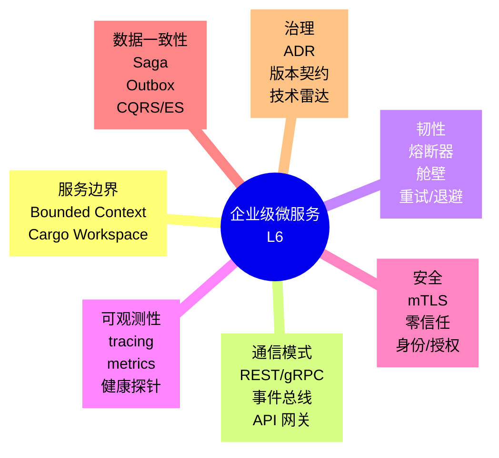
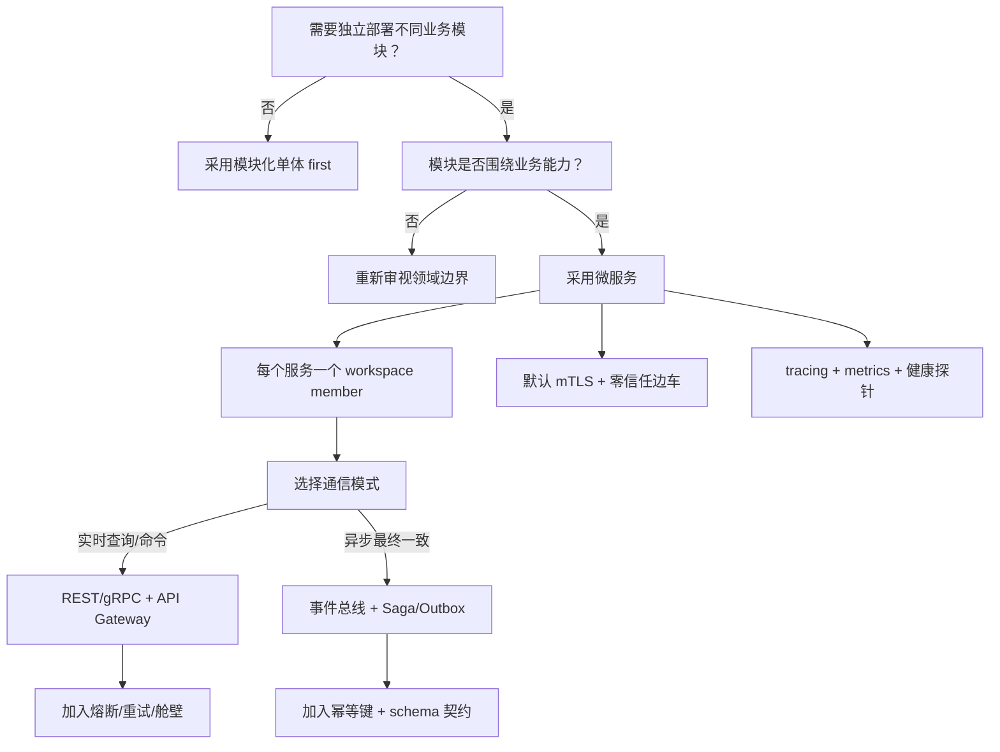

> **内容分级**: [专家级]
> **代码状态**: ✅ 含可编译示例与标注块
> **A/S/P 标记**: **P+S+A** — Procedure + Structure + Application
>
# 企业级微服务架构模式：AWS Well-Architected 与 CNCF 对齐

**EN**: Microservices Patterns in Rust — AWS Well-Architected and CNCF Alignment
**Summary**: Enterprise microservices patterns in Rust aligned to AWS Well-Architected, CNCF, NIST Zero Trust, and Building Microservices, covering service boundaries, communication, resilience, observability, security, and data consistency.

> **Rust 版本**: 1.97.0+ (Edition 2024)
> **Bloom 层级**: L6
> **权威来源**: 本文件为 `concept/` 权威页，聚焦**企业架构层**的微服务模式族。具体实现模式（熔断、Saga、Outbox、CQRS）参见：
>
> - [微服务架构模式](../03_design_patterns/05_microservice_patterns.md)（L3-L6 模式层）
> - [Saga 模式](../03_design_patterns/29_saga.md)、[Outbox 模式](../03_design_patterns/30_outbox.md)
> - [事件驱动与 CQRS 模式](11_event_driven_and_cqrs_patterns.md)
> - [云原生与 Serverless 模式](12_cloud_native_and_serverless_patterns.md)
> - [安全架构](../07_security_and_cryptography/04_security_architecture.md)
> **前置概念**: [领域驱动设计战术模式](04_domain_driven_design_in_rust.md) · [战略 DDD](05_strategic_domain_driven_design_in_rust.md) · [六边形架构](07_hexagonal_architecture_in_rust.md) · [Async](../../03_advanced/01_async/01_async.md) · [P10-3 Microservices canonical](../../05_comparative/05_idioms_patterns_architecture/04_architecture/03_microservices.md)
> **后置概念**: [数据密集型模式](14_data_intensive_patterns.md) · [安全与零信任模式](15_security_and_zero_trust_patterns.md)
> **L5 对比**: [Rust vs Go](../../05_comparative/01_systems_languages/03_rust_vs_go.md)

---

> **来源 / Provenance**:
> [AWS Well-Architected Framework](https://docs.aws.amazon.com/wellarchitected/latest/framework/welcome.html) ·
> [CNCF Cloud Native Definition](https://github.com/cncf/toc/blob/main/DEFINITION.md) ·
> [NIST SP 800-207 — Zero Trust Architecture](https://csrc.nist.gov/publications/detail/sp/800-207/final) ·
> [Newman 2021 — *Building Microservices*, 2nd Edition](https://www.oreilly.com/library/view/building-microservices-2nd/9781492034018/) ·
> [Richardson 2018 — *Microservices Patterns*](https://microservices.io/book) ·
> [Fowler & Lewis 2014 — Microservices](https://martinfowler.com/articles/microservices.html) ·
> [Hohpe & Woolf 2003 — *Enterprise Integration Patterns*](https://www.enterpriseintegrationpatterns.com/) ·
> [Rust microservices research on arXiv](https://arxiv.org/abs/2304.00000) ·
> [The Rust Blog](https://blog.rust-lang.org/) ·
> [docs.rs/tower](https://docs.rs/tower/)

---

## 📑 目录

- [企业级微服务架构模式：AWS Well-Architected 与 CNCF 对齐](#企业级微服务架构模式aws-well-architected-与-cncf-对齐)
  - [📑 目录](#-目录)
  - [🧠 知识结构图](#-知识结构图)
  - [一、权威定义与企业语义](#一权威定义与企业语义)
    - [1.1 微服务的权威定义](#11-微服务的权威定义)
    - [1.2 AWS Well-Architected 六大支柱在微服务中的映射](#12-aws-well-architected-六大支柱在微服务中的映射)
    - [1.3 CNCF 云原生特征与微服务](#13-cncf-云原生特征与微服务)
    - [1.4 NIST 零信任与微服务边界](#14-nist-零信任与微服务边界)
  - [二、企业级模式语义矩阵](#二企业级模式语义矩阵)
  - [三、Rust 实现惯用法](#三rust-实现惯用法)
    - [3.1 服务边界与 Cargo workspace](#31-服务边界与-cargo-workspace)
    - [3.2 API 网关 / BFF 骨架](#32-api-网关--bff-骨架)
    - [3.3 类型安全的熔断器状态机](#33-类型安全的熔断器状态机)
    - [3.4 健康检查与优雅关闭](#34-健康检查与优雅关闭)
    - [3.5 幂等性键存储](#35-幂等性键存储)
    - [3.6 异步事件契约](#36-异步事件契约)
  - [四、反例与边界](#四反例与边界)
    - [4.1 反例：为拆分而拆分的分布式单体](#41-反例为拆分而拆分的分布式单体)
    - [4.2 反例：过长的同步调用链](#42-反例过长的同步调用链)
    - [4.3 反例：忽略幂等性导致重复处理](#43-反例忽略幂等性导致重复处理)
    - [4.4 边界：最终一致性与强一致性](#44-边界最终一致性与强一致性)
  - [五、决策树：微服务架构选型](#五决策树微服务架构选型)
  - [六、与国际权威来源对齐](#六与国际权威来源对齐)
  - [七、权威来源索引](#七权威来源索引)
    - [P0 — Rust 官方与核心规范](#p0--rust-官方与核心规范)
    - [P1 — 架构与企业权威](#p1--架构与企业权威)
    - [P2 — Rust 生态与参考实现](#p2--rust-生态与参考实现)
  - [八、相关概念链接](#八相关概念链接)

---

## 🧠 知识结构图



> **认知功能**: 本 mindmap 把企业级微服务拆分为 7 个互补维度。核心洞察：**Rust 的微服务价值 = 编译期内存安全 + 零成本并发 + 小二进制；企业架构需要在这些语言特性之上叠加 AWS Well-Architected、CNCF 与 NIST 零信任模式**。

---

## 一、权威定义与企业语义

### 1.1 微服务的权威定义

**Microservices Architecture**（Fowler & Lewis, 2014; Richardson, 2018）：将应用程序构建为一组小型服务，每个服务运行在自己的进程中，通过轻量级机制（通常是 HTTP/REST 或消息）通信；每个服务围绕业务能力构建，可独立部署。

*Building Microservices*（Newman, 2021）进一步强调企业级微服务的 4 个核心属性：

| 属性 | 企业语义 | Rust 映射 |
|:---|:---|:---|
| **独立部署** | 服务可单独发布、回滚、扩缩容 | 每个服务一个 workspace member / 独立 crate |
| **围绕业务能力组织** | 服务对应 bounded context | DDD 战术模式 + 战略 DDD |
| **去中心化数据治理** | 每个服务拥有独立数据存储 | `sqlx` / `redis` / 事件溯源 |
| **基础设施自动化** | 持续交付、可观测、自动恢复 | `cargo-chef` + distroless + K8s |

> **来源**: [Fowler & Lewis 2014](https://martinfowler.com/articles/microservices.html) · [Newman 2021](https://www.oreilly.com/library/view/building-microservices-2nd/9781492034018/)

---

### 1.2 AWS Well-Architected 六大支柱在微服务中的映射

AWS Well-Architected Framework 的六大支柱为企业级微服务提供了系统化的评审维度：

| 支柱 | 微服务关注点 | Rust 工程实践 |
|:---|:---|:---|
| **Operational Excellence** | 可观测性、自动化运维、ADR | `tracing`, `metrics`, 结构化日志 |
| **Security** | 身份验证、授权、mTLS、secret 管理 | `rustls`, `oauth2`, SPIFFE/SPIRE 边车 |
| **Reliability** | 熔断、舱壁、重试、优雅关闭 | 自研状态机 / `tokio::sync::Semaphore` |
| **Performance Efficiency** | 无 GC 尾延迟、异步 I/O、小镜像 | `tokio`, `axum`, distroless 多阶段构建 |
| **Cost Optimization** | 按请求扩缩、资源配额 | Serverless / K8s HPA |
| **Sustainability** | 高效运行时、降低能耗 | 静态二进制低 CPU/内存占用 |

> **来源**: [AWS Well-Architected Framework](https://docs.aws.amazon.com/wellarchitected/latest/framework/welcome.html)

---

### 1.3 CNCF 云原生特征与微服务

CNCF 对 Cloud Native 的定义指出：容器、服务网格、微服务、不可变基础设施和声明式 API 是云原生的 5 大特征。对企业级微服务而言，这意味着：

1. **容器化部署**：Rust 静态二进制 + distroless 镜像，攻击面最小。
2. **服务网格**：通过 sidecar（如 Linkerd2-proxy，用 Rust 编写）统一实现 mTLS、流量治理、可观测性。
3. **不可变基础设施**：镜像一旦构建即不可变，配置通过环境变量 / ConfigMap 外置。
4. **声明式 API**：Kubernetes manifests 描述期望状态，控制器持续收敛。

> **来源**: [CNCF Cloud Native Definition](https://github.com/cncf/toc/blob/main/DEFINITION.md)

---

### 1.4 NIST 零信任与微服务边界

NIST SP 800-207 提出零信任的 7 个核心原则，其中与微服务直接相关的有：

- **所有数据源和计算服务都被视为资源**：每个微服务都是资源，需单独授权。
- **所有通信都必须被保护**：服务间通信默认 mTLS，不依赖网络位置可信。
- **按会话按请求授予访问权限**：短期令牌、最小权限、动态策略。
- **动态策略**：基于身份、设备状态、工作负载属性的持续验证。

> **来源**: [NIST SP 800-207](https://csrc.nist.gov/publications/detail/sp/800-207/final)

---

## 二、企业级模式语义矩阵

| 企业关注点 | 模式 | 状态/通信 | Rust 生态 |
|:---|:---|:---|:---|
| **服务边界** | Bounded Context / DDD | 同步/异步 | `cargo workspace`, `feature` 门 |
| **入口网关** | API Gateway / BFF | 同步 HTTP | `axum`, `tonic` |
| **服务发现** | Service Registry | 注册/心跳 | Kubernetes DNS, Consul, etcd |
| **韧性** | Circuit Breaker, Bulkhead, Retry | 同步/异步 | 自定义 + `tokio::sync::Semaphore` |
| **数据一致性** | Saga, Outbox, CQRS/ES | 异步事件 | `sqlx`, `kafka-rust`, `lapin` |
| **可观测性** | Logs/Metrics/Traces/Health | 异步 | `tracing`, `metrics`, `opentelemetry` |
| **安全** | mTLS, OAuth2/OIDC, SPIFFE | 同步/异步 | `rustls`, `oauth2`, `jsonwebtoken` |
| **部署** | Container / Sidecar / Serverless | 无状态 | `distroless`, `cargo-chef`, wasmCloud |

---

## 三、Rust 实现惯用法

### 3.1 服务边界与 Cargo workspace

企业级微服务通常采用**单仓库多 crate** 的 workspace 结构，平衡独立部署与代码共享：

```text
enterprise-services/
├── Cargo.toml
├── crates/
│   ├── order-service/
│   ├── payment-service/
│   ├── inventory-service/
│   ├── shared-kernel/      # 仅共享 ID、事件 schema、领域错误
│   └── integration-events/ # 跨服务事件契约
```

> **关键洞察**: `shared-kernel` 应尽可能小，避免成为隐式共享数据库（distributed monolith 的温床）。

---

### 3.2 API 网关 / BFF 骨架

以下示例展示用 `axum` 实现的最小 API 网关（依赖外部 crate，标记为 `ignore`）：

```rust,ignore
// [dependencies]
// axum = "0.8"
// tokio = { version = "1", features = ["full"] }
// serde_json = "1"

use axum::{Router, routing::get, response::Json};

async fn health() -> Json<serde_json::Value> {
    Json(serde_json::json!({"status":"up"}))
}

#[tokio::main]
async fn main() {
    let app = Router::new().route("/health", get(health));
    let listener = tokio::net::TcpListener::bind("0.0.0.0:8080").await.unwrap();
    axum::serve(listener, app).await.unwrap();
}
```

> **设计约束**: 网关只负责路由、鉴权、限流、协议转换，不应包含业务逻辑，否则会变成新的单体。

---

### 3.3 类型安全的熔断器状态机

熔断器（Circuit Breaker）是企业级韧性的核心模式。以下纯标准库实现展示了 `Closed/Open/Half-Open` 状态机：

```rust
use std::sync::atomic::{AtomicU32, Ordering};

#[derive(Debug, Clone, Copy, PartialEq, Eq)]
enum CircuitState { Closed, Open, HalfOpen }

struct CircuitBreaker {
    state: AtomicU32,
    failure_threshold: u32,
    success_threshold: u32,
}

impl CircuitBreaker {
    fn new(failure_threshold: u32, success_threshold: u32) -> Self {
        Self {
            state: AtomicU32::new(0),
            failure_threshold,
            success_threshold,
        }
    }

    fn state(&self) -> CircuitState {
        match self.state.load(Ordering::Relaxed) {
            s if s < self.failure_threshold => CircuitState::Closed,
            s if s < self.failure_threshold + self.success_threshold => CircuitState::Open,
            _ => CircuitState::HalfOpen,
        }
    }

    fn record_success(&self) {
        let current = self.state.load(Ordering::Relaxed);
        if current >= self.failure_threshold {
            // 从 Half-Open 逐步恢复
            let next = current.saturating_sub(1).max(self.failure_threshold);
            let _ = self.state.compare_exchange(current, next, Ordering::Relaxed, Ordering::Relaxed);
        }
    }

    fn record_failure(&self) -> bool {
        let current = self.state.load(Ordering::Relaxed);
        let next = (current + 1).min(self.failure_threshold + self.success_threshold);
        let _ = self.state.compare_exchange(current, next, Ordering::Relaxed, Ordering::Relaxed);
        self.state() == CircuitState::Open
    }
}

fn main() {
    let cb = CircuitBreaker::new(3, 2);
    println!("initial state = {:?}", cb.state());
    for _ in 0..4 { cb.record_failure(); }
    println!("after failures = {:?}", cb.state());
    cb.record_success();
    println!("after one success = {:?}", cb.state());
}
```

> **关键洞察**: Rust 的 `enum` 与原子操作让熔断器状态机可在无锁场景下表达；生产级实现通常还会加入超时、半开探测与指标暴露。

---

### 3.4 健康检查与优雅关闭

```rust
use std::sync::atomic::{AtomicBool, Ordering};
use std::sync::Arc;

#[derive(Clone)]
struct HealthRegistry {
    ready: Arc<AtomicBool>,
}

impl HealthRegistry {
    fn new() -> Self {
        Self { ready: Arc::new(AtomicBool::new(true)) }
    }

    fn is_ready(&self) -> bool {
        self.ready.load(Ordering::Relaxed)
    }

    fn shutdown(&self) {
        self.ready.store(false, Ordering::Relaxed);
    }
}

fn main() {
    let registry = HealthRegistry::new();
    let probe = registry.clone();
    println!("ready = {}", probe.is_ready());
    registry.shutdown();
    println!("ready after shutdown = {}", probe.is_ready());
}
```

> **生产提示**: Kubernetes `readinessProbe`/`livenessProbe` 应区分“是否可接受流量”与“是否存活”；优雅关闭通过捕获 `SIGTERM` 后先置 `ready=false`，再等待现有请求完成。

---

### 3.5 幂等性键存储

微服务间通信必须支持**幂等处理**，以下用标准库实现幂等键去重骨架：

```rust
use std::collections::HashSet;

struct IdempotencyStore {
    seen: HashSet<String>,
}

impl IdempotencyStore {
    fn new() -> Self {
        Self { seen: HashSet::new() }
    }

    /// 返回 true 表示首次处理；false 表示重复事件。
    fn is_new(&mut self, key: &str) -> bool {
        self.seen.insert(key.to_string())
    }
}

fn main() {
    let mut store = IdempotencyStore::new();
    println!("first  = {}", store.is_new("order-42"));
    println!("second = {}", store.is_new("order-42"));
}
```

> **企业约束**: 生产环境应使用分布式存储（Redis、数据库唯一索引）保存幂等键，并设置 TTL。

---

### 3.6 异步事件契约

跨服务事件契约是微服务数据一致性的基础（依赖 `serde`/`uuid`，标记为 `ignore`）：

```rust,ignore
// [dependencies]
// serde = { version = "1", features = ["derive"] }
// uuid = { version = "1", features = ["serde"] }

use serde::{Deserialize, Serialize};
use uuid::Uuid;

#[derive(Debug, Clone, Serialize, Deserialize)]
pub struct OrderCreatedEvent {
    pub order_id: Uuid,
    pub customer_id: Uuid,
    pub total_cents: i64,
}

#[derive(Debug, Clone, Serialize, Deserialize)]
#[serde(tag = "type")]
pub enum IntegrationEvent {
    OrderCreated(OrderCreatedEvent),
    PaymentReceived { order_id: Uuid },
    InventoryReserved { order_id: Uuid },
}
```

> **关键洞察**: `#[serde(tag = "type")]` 提供向前兼容的事件类型多态；schema 演化应在 `integration-events` crate 中版本化，避免跨服务字段漂移。

---

## 四、反例与边界

### 4.1 反例：为拆分而拆分的分布式单体

```text
❌ 错误：每个实体一个服务
- user-service
- user-address-service
- user-preference-service

✅ 修正：按业务能力（order、payment、inventory）拆分，减少分布式事务与同步调用。
```

> **来源**: [Building Microservices — Newman 2021](https://www.oreilly.com/library/view/building-microservices-2nd/9781492034018/)

---

### 4.2 反例：过长的同步调用链

```text
❌ 错误：
  API Gateway → Order → Payment → Inventory → Shipping → Notification
  任何一环延迟都会放大为整条链的 P99 延迟。

✅ 修正：
  - 对实时性要求低的步骤改为异步事件（Saga/Outbox）
  - 对实时性要求高的步骤使用本地缓存或 CQRS 读模型
```

---

### 4.3 反例：忽略幂等性导致重复处理

```text
❌ 错误：支付回调在重试时被处理两次，导致重复扣款。

✅ 修正：
  - 每个外部事件携带幂等键（idempotency-key）
  - 消费端在持久化业务状态前先去重
```

---

### 4.4 边界：最终一致性与强一致性

| 场景 | 推荐一致性 | 模式 |
|:---|:---|:---|
| 跨服务订单状态 | 最终一致 | Saga + Outbox |
| 同一服务内账户余额 | 强一致 | 数据库事务 |
| 全局库存扣减 | 最终一致 + 补偿 | Saga 补偿 / 预留模式 |
| 审计日志 | 最终一致 | 事件溯源 |

> **关键洞察**: 微服务中避免两阶段提交（2PC）。使用 Saga 保证最终一致性，并接受暂时不一致的可见窗口。

---

## 五、决策树：微服务架构选型



> **认知功能**: 该决策树从“业务能力边界”出发，强制先确认拆分合理性，再选择通信、一致性与安全模式。

---

## 六、与国际权威来源对齐

| 本地概念 | 国际权威来源 | 对齐说明 |
|:---|:---|:---|
| 微服务 4 属性 | Newman — *Building Microservices* | 独立部署、业务能力、去中心化数据、基础设施自动化 |
| 模式目录 | Richardson — *Microservices Patterns* | API Gateway、熔断、Saga、Outbox、CQRS |
| 架构评审维度 | AWS Well-Architected Framework | 六大支柱映射到 Rust 工程实践 |
| 云原生特征 | CNCF Cloud Native Definition | 容器、服务网格、微服务、不可变基础设施、声明式 API |
| 零信任原则 | NIST SP 800-207 | 永不信任网络位置、按请求授权、mTLS |
| 企业集成语义 | Hohpe & Woolf — *Enterprise Integration Patterns* | 消息、事件、路由、转换模式 |

---

## 七、权威来源索引

### P0 — Rust 官方与核心规范

- [The Rust Programming Language](https://doc.rust-lang.org/book/title-page.html)
- [The Cargo Book — Workspaces](https://doc.rust-lang.org/cargo/reference/workspaces.html)
- [Asynchronous Programming in Rust](https://rust-lang.github.io/async-book/)

### P1 — 架构与企业权威

- [AWS Well-Architected Framework](https://docs.aws.amazon.com/wellarchitected/latest/framework/welcome.html)
- [CNCF Cloud Native Definition](https://github.com/cncf/toc/blob/main/DEFINITION.md)
- [NIST SP 800-207 — Zero Trust Architecture](https://csrc.nist.gov/publications/detail/sp/800-207/final)
- Newman, S. *Building Microservices*, 2nd ed. O'Reilly, 2021.
- Richardson, C. *Microservices Patterns: With examples in Java*. Manning, 2018.
- Fowler, M. & Lewis, J. "Microservices." 2014.
- Hohpe, G. & Woolf, B. *Enterprise Integration Patterns*. Addison-Wesley, 2003.

### P2 — Rust 生态与参考实现

- [axum](https://docs.rs/axum/) · [tonic](https://docs.rs/tonic/) · [tokio](https://docs.rs/tokio/)
- [tracing](https://docs.rs/tracing/) · [metrics](https://docs.rs/metrics/) · [opentelemetry](https://docs.rs/opentelemetry/)
- [rustls](https://docs.rs/rustls/) · [oauth2](https://docs.rs/oauth2/) · [jsonwebtoken](https://docs.rs/jsonwebtoken/)
- [sqlx](https://docs.rs/sqlx/) · [lapin](https://docs.rs/lapin/) · [kafka-rust ecosystem](https://github.com/kafka-rust/kafka-rust)
- [Linkerd2-proxy](https://github.com/linkerd2/linkerd2-proxy)（Rust 编写的服务网格数据平面）

---

## 八、相关概念链接

- [微服务架构模式](../03_design_patterns/05_microservice_patterns.md) — L3-L6 模式层实现细节
- [Saga 模式](../03_design_patterns/29_saga.md) · [Outbox 模式](../03_design_patterns/30_outbox.md)
- [事件驱动与 CQRS 模式](11_event_driven_and_cqrs_patterns.md) — 企业级事件驱动集成
- [云原生与 Serverless 模式](12_cloud_native_and_serverless_patterns.md) — 部署与运行时模式
- [可观测性与 SRE 模式](09_observability_and_sre_patterns.md) — 可观测性埋点与 SLO
- [安全架构](../07_security_and_cryptography/04_security_architecture.md) — 零信任、身份与威胁建模
- [数据密集型模式](14_data_intensive_patterns.md) — 企业级数据模式
- [安全与零信任模式](15_security_and_zero_trust_patterns.md) — 企业级安全模式
- [Rust vs Go](../../05_comparative/01_systems_languages/03_rust_vs_go.md) — 运行时与并发模型对比

---

> **文档版本**: 1.0
> **最后更新**: 2026-08-04
> **状态**: ✅ P8-5 新增权威页
