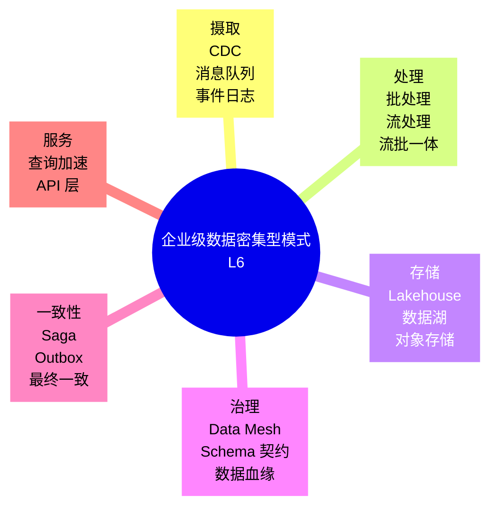
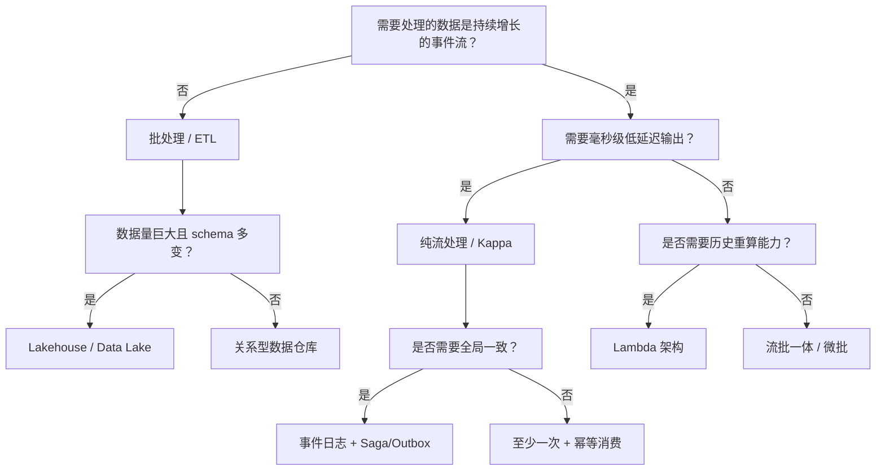

> **内容分级**: [专家级]
> **代码状态**: ✅ 含可编译示例与标注块
> **A/S/P 标记**: **P+S+A** — Procedure + Structure + Application
>
# 企业级数据密集型模式（Enterprise Data-Intensive Patterns）

**EN**: Enterprise Data-Intensive Patterns in Rust
**Summary**: Enterprise data-intensive patterns in Rust — batch/stream processing, data mesh, lakehouse, event sourcing, and consistency models — aligned to Designing Data-Intensive Applications, AWS Well-Architected, and CNCF.

> **Rust 版本**: 1.97.0+ (Edition 2024)
> **Bloom 层级**: L6
> **权威来源**: 本文件为 `concept/` 权威页，聚焦**企业架构层**的数据密集型模式族。存储引擎、事务隔离、复制分片等底层实现参见：
>
> - [数据密集型系统设计](../06_data_and_distributed/10_data_intensive_systems_design.md)（L6 系统实现层）
> - [数据工程](../06_data_and_distributed/05_data_engineering.md)（L3-L4 生态概览）
> - [流处理生态](../06_data_and_distributed/03_stream_processing_ecosystem.md)（L3-L5 生态概览）
> - [事件驱动与 CQRS 模式](11_event_driven_and_cqrs_patterns.md)
> **前置概念**: [数据密集型系统设计](../06_data_and_distributed/10_data_intensive_systems_design.md) · [数据工程](../06_data_and_distributed/05_data_engineering.md) · [流处理生态](../06_data_and_distributed/03_stream_processing_ecosystem.md) · [泛型](../../02_intermediate/01_generics/01_generics.md)
> **后置概念**: [分布式系统协议](../06_data_and_distributed/11_distributed_systems_protocols.md) · [微服务架构模式](13_microservices_patterns_in_rust.md) · [安全与零信任模式](15_security_and_zero_trust_patterns.md)
> **L5 对比**: [Rust vs Go](../../05_comparative/01_systems_languages/03_rust_vs_go.md)

---

> **来源 / Provenance**:
> [Kleppmann 2017 — *Designing Data-Intensive Applications*](https://dataintensive.net/) ·
> [AWS Well-Architected Framework — Reliability Pillar](https://docs.aws.amazon.com/wellarchitected/latest/reliability-pillar/welcome.html) ·
> [CNCF Cloud Native Definition](https://github.com/cncf/toc/blob/main/DEFINITION.md) ·
> [Apache Kafka Documentation](https://kafka.apache.org/documentation/) ·
> [Apache Flink Documentation](https://nightlies.apache.org/flink/flink-docs-stable/) ·
> [Delta Lake Documentation](https://docs.delta.io/latest/index.html) ·
> [Dehghani 2019 — Data Mesh](https://martinfowler.com/articles/data-mesh-intro.html)

---

## 📑 目录

- [企业级数据密集型模式（Enterprise Data-Intensive Patterns）](#企业级数据密集型模式enterprise-data-intensive-patterns)
  - [📑 目录](#-目录)
  - [🧠 知识结构图](#-知识结构图)
  - [一、权威定义与企业语义](#一权威定义与企业语义)
    - [1.1 数据密集型系统的企业目标](#11-数据密集型系统的企业目标)
    - [1.2 Lambda 与 Kappa 架构](#12-lambda-与-kappa-架构)
    - [1.3 Data Mesh：去中心化数据所有权](#13-data-mesh去中心化数据所有权)
    - [1.4 Lakehouse：数据湖 + 仓库的融合](#14-lakehouse数据湖--仓库的融合)
  - [二、企业级模式语义矩阵](#二企业级模式语义矩阵)
  - [三、Rust 实现惯用法](#三rust-实现惯用法)
    - [3.1 批处理管道骨架](#31-批处理管道骨架)
    - [3.2 幂等流处理器](#32-幂等流处理器)
    - [3.3 数据契约与 schema 演化](#33-数据契约与-schema-演化)
    - [3.4 水印与窗口状态](#34-水印与窗口状态)
  - [四、反例与边界](#四反例与边界)
    - [4.1 反例：没有 event-time 水印的流处理](#41-反例没有-event-time-水印的流处理)
    - [4.2 反例：把 Lakehouse 当 OLTP 数据库](#42-反例把-lakehouse-当-oltp-数据库)
    - [4.3 反例：双写而不使用 Outbox](#43-反例双写而不使用-outbox)
    - [4.4 边界：恰好一次语义的成本](#44-边界恰好一次语义的成本)
  - [五、决策树：数据模式选型](#五决策树数据模式选型)
  - [六、与国际权威来源对齐](#六与国际权威来源对齐)
  - [七、权威来源索引](#七权威来源索引)
    - [P0 — Rust 官方与核心规范](#p0--rust-官方与核心规范)
    - [P1 — 数据与架构权威](#p1--数据与架构权威)
    - [P2 — Rust 生态与参考实现](#p2--rust-生态与参考实现)
  - [八、相关概念链接](#八相关概念链接)

---

## 🧠 知识结构图



> **认知功能**: 本 mindmap 把企业级数据密集型系统拆分为 6 个互补维度。核心洞察：**Rust 的高性能、零成本抽象与内存安全，使其在数据摄取、流批处理、Lakehouse 引擎与服务层都能提供可靠实现**。

---

## 一、权威定义与企业语义

### 1.1 数据密集型系统的企业目标

根据 *Designing Data-Intensive Applications*（Kleppmann, 2017），数据密集型系统的设计围绕三个互有张力的目标：

| 目标 | 企业语义 | Rust 映射 |
|:---|:---|:---|
| **可靠性（Reliability）** | 故障时继续工作、数据不丢失 | 类型安全 + 错误处理 + 复制/持久化 |
| **可扩展性（Scalability）** | 数据量/请求量增长时性能可预测 | 异步 I/O、无共享状态、水平扩展 |
| **可维护性（Maintainability）** | 可运维、可演化、消除意外复杂度 | 强类型事件契约、模块化 workspace |

> **来源**: [Kleppmann 2017](https://dataintensive.net/)

---

### 1.2 Lambda 与 Kappa 架构

| 架构 | 核心思想 | 适用场景 | Rust 映射 |
|:---|:---|:---|:---|
| **Lambda** | 同时维护批处理层（Batch）和速度层（Speed），合并为服务层 | 需要历史重算 + 实时视图 | `polars`/`datafusion` 批处理 + `fluvio`/`timely` 流处理 |
| **Kappa** | 只保留流处理层，通过重放事件日志实现批处理语义 | 事件驱动、日志即真相 | Kafka/Redpanda + Rust 流消费者 |

> **关键洞察**: Kappa 简化了架构但要求事件日志具备**无限保留**与**可重放**能力；Lambda 在需要复杂历史分析的统计型业务中仍占优势。

---

### 1.3 Data Mesh：去中心化数据所有权

Data Mesh 把数据视为产品，由领域团队拥有：

1. **领域所有权（Domain Ownership）**：每个 bounded context 负责自己的数据产品。
2. **数据即产品（Data as a Product）**：对外暴露文档化、可发现的 schema 与 SLI/SLO。
3. **自助式数据平台（Self-Serve Data Platform）**：提供统一的事件总线、schema registry、血缘工具。
4. **联邦计算治理（Federated Computational Governance）**：全局标准 + 本地自治。

> **来源**: [Dehghani 2019 — Data Mesh](https://martinfowler.com/articles/data-mesh-intro.html)

---

### 1.4 Lakehouse：数据湖 + 仓库的融合

Lakehouse 在对象存储之上提供类似数据仓库的 ACID、schema 演化与高性能查询能力：

- **存储层**：Parquet / ORC 等开放列式格式。
- **元数据层**：Delta Lake / Apache Iceberg / Apache Hudi 管理版本、schema、事务。
- **计算层**：DataFusion、Polars、Spark 等查询引擎。

Rust 生态：

- `delta-rs` 提供 Delta Lake 的 Rust/Python 绑定。
- `arrow-rs` / `parquet` 提供列式内存与文件格式支持。
- `datafusion` 提供查询执行引擎。

---

## 二、企业级模式语义矩阵

| 企业关注点 | 模式 | 数据语义 | Rust 生态 |
|:---|:---|:---|:---|
| **摄取** | CDC / Event Log | 至少一次/恰好一次 | `debezium` (Kafka Connect), `lapin`, `rdkafka` |
| **批处理** | ETL / ELT | 幂等、可重试 | `polars`, `datafusion`, `arrow-rs` |
| **流处理** | Kappa / Streaming | event time / watermark | `timely-dataflow`, `fluvio`, `tokio-stream` |
| **存储** | Lakehouse / Data Lake | ACID / schema 演化 | `delta-rs`, `parquet`, `object_store` |
| **服务** | Data API / Query Acceleration | 读模型优化 | `axum` + `datafusion` |
| **治理** | Data Mesh / Schema Registry | schema 契约 | `schema_registry` 客户端 + `serde` |
| **一致性** | Saga / Outbox | 最终一致 | 自定义 + `sqlx` / `kafka` |

---

## 三、Rust 实现惯用法

### 3.1 批处理管道骨架

以下用标准库 `std::sync::mpsc` 演示最简单的 ETL 阶段解耦：

```rust
use std::sync::mpsc::{channel, Receiver, Sender};
use std::thread;

#[derive(Debug, Clone)]
struct Record {
    id: u64,
    payload: String,
}

fn extract(sender: Sender<Record>) {
    for i in 0..5 {
        sender.send(Record {
            id: i,
            payload: format!("raw-{}", i),
        }).unwrap();
    }
}

fn transform(input: Receiver<Record>, output: Sender<Record>) {
    for rec in input {
        output.send(Record {
            id: rec.id,
            payload: rec.payload.to_uppercase(),
        }).unwrap();
    }
}

fn load(input: Receiver<Record>) -> usize {
    input.iter().count()
}

fn main() {
    let (tx1, rx1) = channel::<Record>();
    let (tx2, rx2) = channel::<Record>();

    let h1 = thread::spawn(move || extract(tx1));
    let h2 = thread::spawn(move || transform(rx1, tx2));
    let h3 = thread::spawn(move || load(rx2));

    h1.join().unwrap();
    h2.join().unwrap();
    let n = h3.join().unwrap();
    println!("loaded {} records", n);
}
```

> **关键洞察**: Rust 的所有权模型让跨线程管道在编译期排除数据竞争；生产级管道通常使用 `tokio::sync::mpsc` 或 `crossbeam` 以获得更低延迟。

---

### 3.2 幂等流处理器

```rust
use std::collections::HashSet;

struct StreamProcessor {
    seen: HashSet<String>,
}

impl StreamProcessor {
    fn new() -> Self {
        Self { seen: HashSet::new() }
    }

    /// 返回 Some(payload) 表示首次处理；None 表示重复事件。
    fn process<'a>(&mut self, event_id: &str, payload: &'a str) -> Option<&'a str> {
        if self.seen.insert(event_id.to_string()) {
            Some(payload)
        } else {
            None
        }
    }
}

fn main() {
    let mut processor = StreamProcessor::new();
    println!("first  = {:?}", processor.process("evt-1", "payment"));
    println!("second = {:?}", processor.process("evt-1", "payment"));
}
```

> **企业约束**: 流处理器必须能够**在崩溃后恢复状态**，因此 `seen` 集合通常由持久化键值存储或带 TTL 的数据库唯一索引实现。

---

### 3.3 数据契约与 schema 演化

以下示例展示带版本标签的事件契约（依赖 `serde`，标记为 `ignore`）：

```rust,ignore
// [dependencies]
// serde = { version = "1", features = ["derive"] }

use serde::{Deserialize, Serialize};

#[derive(Debug, Clone, Serialize, Deserialize)]
#[serde(tag = "schema_version")]
pub enum OrderContract {
    #[serde(rename = "v1")]
    V1 { order_id: String, amount_cents: i64 },
    #[serde(rename = "v2")]
    V2 { order_id: String, amount_cents: i64, currency: String },
}
```

> **关键洞察**: `#[serde(tag = "schema_version")]` 让新旧版本可在同一 consumer 中并存；Data Mesh 要求每个数据产品都维护类似的显式 schema 契约。

---

### 3.4 水印与窗口状态

流处理中的 **watermark** 用于标记“某事件时间之前的数据已全部到达”，从而触发窗口输出：

```rust,ignore
// 简化水印窗口状态机（生产级实现需使用 Flink/Timely 等引擎）
use std::collections::BTreeMap;

struct WindowState {
    watermark: u64,
    buffers: BTreeMap<u64, Vec<String>>,
}

impl WindowState {
    fn new() -> Self {
        Self { watermark: 0, buffers: BTreeMap::new() }
    }

    fn on_event(&mut self, event_time: u64, payload: String) {
        if event_time >= self.watermark {
            self.buffers.entry(event_time).or_default().push(payload);
        }
    }

    fn advance_watermark(&mut self, ts: u64) -> Vec<String> {
        self.watermark = ts;
        let ready: Vec<u64> = self.buffers.keys().copied().filter(|&t| t < ts).collect();
        let mut out = Vec::new();
        for t in ready {
            out.extend(self.buffers.remove(&t).unwrap_or_default());
        }
        out
    }
}
```

> **关键洞察**: 没有 watermark 的流处理无法区分“数据迟到”与“窗口结束”，会导致静默丢失或重复输出。

---

## 四、反例与边界

### 4.1 反例：没有 event-time 水印的流处理

```text
❌ 错误：使用处理时间（processing time）触发窗口，在网络抖动或重放时导致：
  - 同一事件被分到不同窗口
  - 迟到事件被丢弃

✅ 修正：使用 event-time + watermark，并明确“允许迟到”策略（side-output / 丢弃）。
```

> **来源**: [Flink — Event Time and Watermarks](https://nightlies.apache.org/flink/flink-docs-stable/docs/concepts/time/)

---

### 4.2 反例：把 Lakehouse 当 OLTP 数据库

```text
❌ 错误：在 Lakehouse 上执行高并发、低延迟的点查与行级更新。

✅ 修正：
  - OLTP 负载继续使用 PostgreSQL / CockroachDB / TiKV
  - Lakehouse 用于分析、批处理、历史回溯与 ML 特征工程
```

---

### 4.3 反例：双写而不使用 Outbox

```text
❌ 错误：
  1. 更新数据库
  2. 直接发送事件到消息队列
  如果步骤 2 失败，数据库已更新但事件丢失 → 状态不一致。

✅ 修正：使用 Outbox 模式：
  - 业务表与 outbox 表在同一数据库事务中写入
  - 单独的 relay 进程读取 outbox 并发布事件
```

> **来源**: [Outbox Pattern — microservices.io](https://microservices.io/patterns/data/outbox.html)

---

### 4.4 边界：恰好一次语义的成本

| 语义 | 保证 | 成本 | 适用场景 |
|:---|:---|:---|:---|
| **At-most-once** | 不重复、可能丢失 | 最低 | 可容忍丢失的指标 |
| **At-least-once** | 不丢失、可能重复 | 中 | 大多数业务事件 |
| **Exactly-once** | 不丢失、不重复 | 高（幂等 + 事务 + 去重） | 金融交易、库存扣减 |

> **关键洞察**: 在微服务与数据管道中，**至少一次 + 幂等消费者**通常比真正的 exactly-once 更具成本效益。

---

## 五、决策树：数据模式选型



> **认知功能**: 该决策树从“数据形态”与“延迟需求”出发，区分批处理、Lambda、Kappa 与流批一体，并强制考虑一致性与幂等性。

---

## 六、与国际权威来源对齐

| 本地概念 | 国际权威来源 | 对齐说明 |
|:---|:---|:---|
| 数据系统三目标 | Kleppmann — *Designing Data-Intensive Applications* | Reliability / Scalability / Maintainability |
| Lambda / Kappa | Marz & Warren — *Big Data* / Kreps — Kappa 论文 | 批处理层与速度层的取舍 |
| Data Mesh | Dehghani — Data Mesh | 领域所有权、数据即产品、自助平台、联邦治理 |
| Lakehouse | Delta Lake / Iceberg / Hudi | 开放格式 + ACID + schema 演化 |
| 消息语义 | Kafka Documentation | at-most-once / at-least-once / exactly-once |
| 可靠性支柱 | AWS Well-Architected — Reliability Pillar | 故障隔离、自动恢复、可观测 |
| 云原生数据 | CNCF | 容器化、声明式、不可变基础设施 |

---

## 七、权威来源索引

### P0 — Rust 官方与核心规范

- [The Rust Programming Language](https://doc.rust-lang.org/book/title-page.html)
- [The Cargo Book](https://doc.rust-lang.org/cargo/index.html)
- [Asynchronous Programming in Rust](https://rust-lang.github.io/async-book/)

### P1 — 数据与架构权威

- Kleppmann, M. *Designing Data-Intensive Applications*. O'Reilly, 2017.
- [AWS Well-Architected Framework — Reliability Pillar](https://docs.aws.amazon.com/wellarchitected/latest/reliability-pillar/welcome.html)
- [CNCF Cloud Native Definition](https://github.com/cncf/toc/blob/main/DEFINITION.md)
- [Dehghani, Z. — Data Mesh](https://martinfowler.com/articles/data-mesh-intro.html)
- [Marz & Warren — *Big Data: Principles and best practices of scalable realtime data systems*](https://www.manning.com/books/big-data)
- [Kreps, J. — Questioning the Lambda Architecture](https://www.oreilly.com/radar/questioning-the-lambda-architecture/)

### P2 — Rust 生态与参考实现

- [Polars](https://pola.rs/) · [DataFusion](https://arrow.apache.org/datafusion/) · [Apache Arrow Rust](https://docs.rs/arrow/)
- [delta-rs](https://delta-io.github.io/delta-rs/) · [parquet-rs](https://docs.rs/parquet/) · [object_store](https://docs.rs/object_store/)
- [Timely Dataflow](https://github.com/TimelyDataflow/timely-dataflow) · [Fluvio](https://www.fluvio.io/) · [lapin](https://docs.rs/lapin/)
- [sqlx](https://docs.rs/sqlx/) · [kafka-rust](https://github.com/kafka-rust/kafka-rust)

---

## 八、相关概念链接

- [数据密集型系统设计](../06_data_and_distributed/10_data_intensive_systems_design.md) — 存储引擎、事务、复制、流批处理底层实现
- [数据工程](../06_data_and_distributed/05_data_engineering.md) — Rust 数据工程生态概览
- [流处理生态](../06_data_and_distributed/03_stream_processing_ecosystem.md) — timely-dataflow / fluvio / tokio-stream
- [事件驱动与 CQRS 模式](11_event_driven_and_cqrs_patterns.md) — Saga / Outbox / CDC
- [微服务架构模式](13_microservices_patterns_in_rust.md) — 企业级微服务边界与通信
- [安全与零信任模式](15_security_and_zero_trust_patterns.md) — 数据安全与访问控制
- [分布式系统协议](../06_data_and_distributed/11_distributed_systems_protocols.md) — 共识、传播、事务与时序
- [Rust vs Go](../../05_comparative/01_systems_languages/03_rust_vs_go.md) — 数据服务运行时对比

---

> **文档版本**: 1.0
> **最后更新**: 2026-08-04
> **状态**: ✅ P8-5 新增权威页
