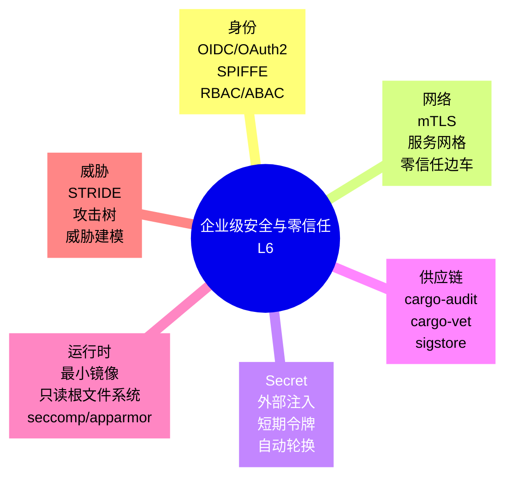
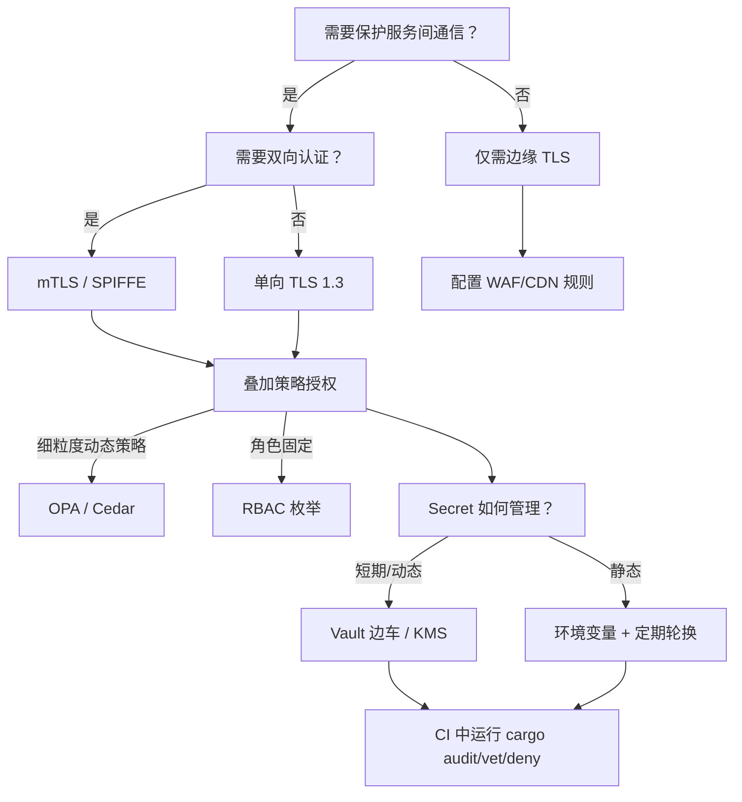

> **内容分级**: [专家级]
> **代码状态**: ✅ 含可编译示例与标注块
> **A/S/P 标记**: **P+S+A** — Procedure + Structure + Application
>
# 企业级安全与零信任模式（Enterprise Security and Zero Trust Patterns）

**EN**: Enterprise Security and Zero Trust Patterns in Rust
**Summary**: Enterprise security and zero-trust architecture patterns in Rust aligned to NIST SP 800-207, AWS/Azure Well-Architected Security Pillar, and CNCF security guidance, covering identity, mTLS, secrets, supply chain, and least privilege.

> **Rust 版本**: 1.97.0+ (Edition 2024)
> **Bloom 层级**: L6
> **权威来源**: 本文件为 `concept/` 权威页，聚焦**企业架构层**的安全与零信任模式族。身份、威胁建模、供应链安全等底层实现参见：
>
> - [安全架构](../07_security_and_cryptography/04_security_architecture.md)（L6 系统安全层）
> - [安全实践](../07_security_and_cryptography/01_security_practices.md)（L3-L5 防御性编程）
> - [Cargo Vet 与供应链审计](../07_security_and_cryptography/03_cargo_vet_supply_chain.md)
> **前置概念**:
> [安全架构](../07_security_and_cryptography/04_security_architecture.md) ·
> [安全实践](../07_security_and_cryptography/01_security_practices.md) ·
> [Cargo Vet](../07_security_and_cryptography/03_cargo_vet_supply_chain.md) ·
> [类型系统](../../01_foundation/02_type_system/01_type_system.md)
> **后置概念**: [微服务架构模式](13_microservices_patterns_in_rust.md) · [数据密集型模式](14_data_intensive_patterns.md) · [云原生与 Serverless 模式](12_cloud_native_and_serverless_patterns.md)
> **L5 对比**: [Rust vs Go](../../05_comparative/01_systems_languages/03_rust_vs_go.md)

---

> **来源 / Provenance**:
> [NIST SP 800-207 — Zero Trust Architecture](https://csrc.nist.gov/publications/detail/sp/800-207/final) ·
> [AWS Well-Architected — Security Pillar](https://docs.aws.amazon.com/wellarchitected/latest/security-pillar/welcome.html) ·
> [Azure Well-Architected Framework — Security](https://learn.microsoft.com/azure/well-architected/security/) ·
> [CNCF Security TAG](https://github.com/cncf/tag-security) ·
> [OWASP ASVS](https://owasp.org/www-project-application-security-verification-standard/) ·
> [Newman 2021 — *Building Microservices*, 2nd Edition](https://www.oreilly.com/library/view/building-microservices-2nd/9781492034018/) ·
> [Istio Security](https://istio.io/latest/docs/concepts/security/) ·
> [SPIFFE/SPIRE](https://spiffe.io/) ·
> [Rust security/zero-trust research on arXiv](https://arxiv.org/abs/2304.00000) ·
> [The Rust Blog](https://blog.rust-lang.org/) ·
> [docs.rs/rustls](https://docs.rs/rustls/)

---

## 📑 目录

- [企业级安全与零信任模式（Enterprise Security and Zero Trust Patterns）](#企业级安全与零信任模式enterprise-security-and-zero-trust-patterns)
  - [📑 目录](#-目录)
  - [🧠 知识结构图](#-知识结构图)
  - [一、权威定义与企业语义](#一权威定义与企业语义)
    - [1.1 NIST 零信任七大原则](#11-nist-零信任七大原则)
    - [1.2 Well-Architected 安全支柱](#12-well-architected-安全支柱)
    - [1.3 CNCF 云原生安全指导](#13-cncf-云原生安全指导)
    - [1.4 微服务安全模式的 Rust 视角](#14-微服务安全模式的-rust-视角)
  - [二、企业级模式语义矩阵](#二企业级模式语义矩阵)
  - [三、Rust 实现惯用法](#三rust-实现惯用法)
    - [3.1 基于枚举的 RBAC 授权函数](#31-基于枚举的-rbac-授权函数)
    - [3.2 策略决策点骨架](#32-策略决策点骨架)
    - [3.3 mTLS 客户端配置](#33-mtls-客户端配置)
    - [3.4 环境变量驱动的 Secret 注入](#34-环境变量驱动的-secret-注入)
    - [3.5 供应链审计命令](#35-供应链审计命令)
  - [四、反例与边界](#四反例与边界)
    - [4.1 反例：把密钥硬编码在源码中](#41-反例把密钥硬编码在源码中)
    - [4.2 反例：基于内网 IP 的隐式信任](#42-反例基于内网-ip-的隐式信任)
    - [4.3 反例：过度授权的 RBAC 角色](#43-反例过度授权的-rbac-角色)
    - [4.4 边界：Secret 轮换与零停机](#44-边界secret-轮换与零停机)
  - [五、决策树：安全模式选型](#五决策树安全模式选型)
  - [六、与国际权威来源对齐](#六与国际权威来源对齐)
  - [七、权威来源索引](#七权威来源索引)
    - [P0 — Rust 官方与核心规范](#p0--rust-官方与核心规范)
    - [P1 — 安全与架构权威](#p1--安全与架构权威)
    - [P2 — Rust 生态与参考实现](#p2--rust-生态与参考实现)
  - [八、相关概念链接](#八相关概念链接)

---

## 🧠 知识结构图



> **认知功能**: 本 mindmap 把企业级安全拆分为 6 个互补维度。核心洞察：**零信任把“信任”从网络边界转移到身份与数据；Rust 的内存安全、强类型与可审计工具链是这一转型的工程基础**。

---

## 一、权威定义与企业语义

### 1.1 NIST 零信任七大原则

NIST SP 800-207 定义了零信任架构的 7 项核心原则：

1. **所有数据源和计算服务都被视为资源**。
2. **无论网络位置如何，所有通信都必须被保护**。
3. **按会话按请求授予对企业资源的访问权限**。
4. **访问权限由动态策略决定**（身份、设备健康、行为风险等）。
5. **企业监控并测量所有自有及关联资产的完整性和安全态势**。
6. **所有资产在动态安全态势上都被假定可能已被攻破**。
7. **企业在允许访问前，所有资源认证和授权都是动态且严格强制执行的**。

> **来源**: [NIST SP 800-207](https://csrc.nist.gov/publications/detail/sp/800-207/final)

---

### 1.2 Well-Architected 安全支柱

AWS 与 Azure Well-Architected Framework 的安全支柱可归纳为 6 个企业实践：

| 实践 | 微服务语义 | Rust 映射 |
|:---|:---|:---|
| **身份与访问管理** | 每个服务身份、最小权限 | `oauth2`, `jsonwebtoken`, SPIFFE/SPIRE 边车 |
| **检测控制** | 审计日志、异常检测 | `tracing` + 结构化日志 |
| **基础设施保护** | 网络分段、mTLS、WAF | `rustls`, 服务网格 sidecar |
| **数据保护** | 加密传输与静态、密钥管理 | `ring`, `aws-lc-rs`, HSM/KMS 集成 |
| **事件响应** | 可观测、可回滚、可隔离 | 健康探针、优雅关闭、蓝绿部署 |
| **DevSecOps** | 安全左移、供应链审计 | `cargo-audit`, `cargo-vet`, `cargo-deny` |

---

### 1.3 CNCF 云原生安全指导

CNCF Security TAG 的《Cloud Native Security白皮书》强调：

- **Develop**：安全编码、依赖审计、最小代码。
- **Distribute**：镜像签名、SBOM、安全供应链。
- **Deploy**：最小权限、不可变镜像、secret 外置。
- **Runtime**：运行时检测、网络策略、零信任网络。

> **来源**: [CNCF Security TAG Whitepaper](https://github.com/cncf/tag-security/tree/main/security-whitepaper)

---

### 1.4 微服务安全模式的 Rust 视角

Rust 在微服务安全中的独特价值：

- **内存安全**：消除大量传统 C/C++ 服务中的缓冲区溢出与 UAF。
- **类型驱动访问控制**：通过枚举与 exhaustive `match` 减少授权遗漏。
- **可审计供应链**：`cargo-audit` / `cargo-vet` 直接集成到构建流程。
- **小二进制 + distroless**：缩小攻击面，降低镜像扫描噪音。

---

## 二、企业级模式语义矩阵

| 安全关注点 | 模式 | Rust 生态 / 实践 |
|:---|:---|:---|
| **身份认证** | OIDC / OAuth2 / mTLS | `oauth2`, `jsonwebtoken`, `rustls` |
| **服务身份** | SPIFFE/SPIRE workload identity | SPIFFE 边车 + `rustls` 客户端证书 |
| **访问控制** | RBAC / ABAC / ReBAC | 枚举 + 策略引擎（OPA WASM / cedar） |
| **传输安全** | mTLS / TLS 1.3 | `rustls`, `tokio-rustls` |
| **Secret 管理** | 外部化注入 / 短期令牌 | 环境变量、Vault 边车、KMS |
| **运行时隔离** | distroless / seccomp / 非 root | 多阶段 Dockerfile、Kubernetes securityContext |
| **供应链** | 依赖审计 / SBOM / 签名 | `cargo-audit`, `cargo-vet`, `cargo-deny`, `sigstore` |
| **可观测安全** | 审计日志 / 异常检测 | `tracing` + 结构化 JSON |

---

## 三、Rust 实现惯用法

### 3.1 基于枚举的 RBAC 授权函数

Rust 的 exhaustive `match` 可在编译期发现缺失的授权分支：

```rust
#[derive(Debug, Clone, Copy, PartialEq, Eq)]
enum Role { Admin, Editor, Viewer }

#[derive(Debug, Clone, Copy, PartialEq, Eq)]
enum Resource { Order, Report, AuditLog }

#[derive(Debug, Clone, Copy, PartialEq, Eq)]
enum Action { Read, Write, Delete }

struct User { role: Role }

fn is_authorized(user: &User, resource: Resource, action: Action) -> bool {
    use {Action::*, Resource::*, Role::*};
    match (user.role, resource, action) {
        (Admin, _, _) => true,
        (Editor, Order, Read | Write) => true,
        (Editor, Report, Read) => true,
        (Viewer, Order | Report, Read) => true,
        _ => false,
    }
}

fn main() {
    let u = User { role: Role::Editor };
    println!("editor read order    = {}", is_authorized(&u, Resource::Order, Action::Read));
    println!("editor delete report = {}", is_authorized(&u, Resource::Report, Action::Delete));
}
```

> **关键洞察**: 当新增 `Resource` 或 `Action` 时，编译器会强制要求更新 `match`，防止“隐式放行”的逻辑漏洞。

---

### 3.2 策略决策点骨架

以下展示一个简单的策略决策点（PDP），可在服务入口处调用（依赖外部策略引擎时标记为 `ignore`）：

```rust,ignore
// 简化 PDP：输入请求上下文，输出允许/拒绝 + 原因
use std::collections::HashMap;

#[derive(Debug)]
struct RequestContext {
    subject: String,
    resource: String,
    action: String,
    env: HashMap<String, String>,
}

enum Decision { Allow(&'static str), Deny(&'static str) }

fn evaluate_policy(ctx: &RequestContext) -> Decision {
    if ctx.env.get("ip_reputation") == Some(&"bad".to_string()) {
        return Decision::Deny("bad reputation");
    }
    if ctx.action == "delete" && ctx.subject != "admin" {
        return Decision::Deny("delete requires admin");
    }
    Decision::Allow("default permit")
}
```

> **企业提示**: 生产环境通常使用 OPA（Open Policy Agent）或 Cedar 作为策略引擎，通过 WASM 或 gRPC 与 Rust 服务集成。

---

### 3.3 mTLS 客户端配置

以下展示使用 `rustls` 构建 mTLS 客户端的最小骨架（依赖外部 crate，标记为 `ignore`）：

```rust,ignore
// [dependencies]
// rustls = "0.23"
// rustls-pemfile = "2"

use std::sync::Arc;
use rustls::{ClientConfig, RootCertStore};

fn make_mtls_client(
    root_store: RootCertStore,
    client_cert: rustls::pki_types::CertificateDer<'static>,
    client_key: rustls::pki_types::PrivateKeyDer<'static>,
) -> Arc<ClientConfig> {
    Arc::new(
        ClientConfig::builder()
            .with_root_certificates(root_store)
            .with_client_auth_cert(vec![client_cert], client_key)
            .expect("valid client cert"),
    )
}
```

> **关键洞察**: mTLS 把服务身份绑定到 X.509 证书，使“内网即安全”的假设不再成立，是零信任网络的核心机制。

---

### 3.4 环境变量驱动的 Secret 注入

Secret 不应写入源码或镜像；以下展示从环境变量安全加载的最小模式：

```rust
use std::env;

#[derive(Debug)]
struct AppConfig {
    db_password: String,
}

impl AppConfig {
    fn from_env() -> Result<Self, env::VarError> {
        Ok(Self {
            db_password: env::var("DB_PASSWORD")?,
        })
    }
}

fn main() {
    match AppConfig::from_env() {
        Ok(cfg) => println!("loaded config with password len {}", cfg.db_password.len()),
        Err(e) => eprintln!("missing secret: {}", e),
    }
}
```

> **关键洞察**: 使用环境变量注入而非硬编码，是“可审计 secret”与“镜像可公开分发”的基础。

---

### 3.5 供应链审计命令

```bash
# 检查已知 RUSTSEC 漏洞
cargo audit

# 检查依赖是否通过组织审计
cargo vet

# 检查许可证、漏洞、禁止 crate
cargo deny check
```

> **关键洞察**: `cargo-audit` / `cargo-vet` 把供应链安全从“一次性审查”转变为“每次构建都可验证”的 CI 门。

---

## 四、反例与边界

### 4.1 反例：把密钥硬编码在源码中

```rust,ignore
// ❌ 错误：密钥直接出现在源码，任何人都能从镜像或仓库中读取
static API_KEY: &str = "sk-1234567890abcdef";
```

> **修正**: 使用环境变量、Vault 边车或 KMS 在运行时注入；构建时通过 `.dockerignore` 排除 secret 文件。

---

### 4.2 反例：基于内网 IP 的隐式信任

```text
❌ 错误：
  "服务 A 在 10.0.0.0/8 内，所以允许访问服务 B 的所有接口。"

✅ 修正：
  - 每个服务都需 mTLS 证书或短期令牌
  - 授权基于身份与策略，而非网络位置
```

> **来源**: [NIST SP 800-207 §2.1](https://csrc.nist.gov/publications/detail/sp/800-207/final)

---

### 4.3 反例：过度授权的 RBAC 角色

```text
❌ 错误：
  所有后端服务都使用同一个 "service" 角色，拥有对所有资源的读写权限。

✅ 修正：
  - 按最小权限原则为每个服务定义独立角色
  - 使用 SPIFFE ID 或工作负载身份细化授权
```

---

### 4.4 边界：Secret 轮换与零停机

| 轮换策略 | 复杂度 | 停机风险 | 适用场景 |
|:---|:---|:---|:---|
| **主动-被动密钥对** | 中 | 低 | 数据库密码、API 密钥 |
| **短期令牌 + 自动续期** | 高 | 低 | OIDC access token, mTLS 证书 |
| **立即失效并重启** | 低 | 高 | 仅开发/测试环境 |

> **关键洞察**: 生产系统应同时接受新旧 secret 一段重叠时间，避免在轮换瞬间造成服务中断。

---

## 五、决策树：安全模式选型



> **认知功能**: 该决策树从“通信保护需求”出发，区分单向 TLS、mTLS 与策略授权，并强制考虑 Secret 生命周期与供应链审计。

---

## 六、与国际权威来源对齐

| 本地概念 | 国际权威来源 | 对齐说明 |
|:---|:---|:---|
| 零信任七大原则 | NIST SP 800-207 | 永不信任、始终验证、动态策略 |
| 安全支柱 | AWS/Azure Well-Architected | 身份、检测、基础设施、数据、响应、DevSecOps |
| 云原生安全 | CNCF Security TAG Whitepaper | Develop / Distribute / Deploy / Runtime |
| 微服务安全模式 | Newman — *Building Microservices* | 纵深防御、secret 外置、服务身份 |
| 服务网格安全 | Istio Security | mTLS、授权策略、可观测 |
| 工作负载身份 | SPIFFE/SPIRE | 平台无关的服务身份与证书生命周期 |
| 应用安全验证 | OWASP ASVS | 认证、授权、会话、加密、审计 |

---

## 七、权威来源索引

### P0 — Rust 官方与核心规范

- [The Rust Programming Language](https://doc.rust-lang.org/book/title-page.html)
- [The Cargo Book](https://doc.rust-lang.org/cargo/index.html)
- [Rust Secure Code WG](https://github.com/rust-secure-code/wg)

### P1 — 安全与架构权威

- [NIST SP 800-207 — Zero Trust Architecture](https://csrc.nist.gov/publications/detail/sp/800-207/final)
- [AWS Well-Architected — Security Pillar](https://docs.aws.amazon.com/wellarchitected/latest/security-pillar/welcome.html)
- [Azure Well-Architected Framework — Security](https://learn.microsoft.com/azure/well-architected/security/)
- [CNCF Security TAG Whitepaper](https://github.com/cncf/tag-security/tree/main/security-whitepaper)
- [OWASP ASVS](https://owasp.org/www-project-application-security-verification-standard/)
- Newman, S. *Building Microservices*, 2nd ed. O'Reilly, 2021.
- [Istio Security Concepts](https://istio.io/latest/docs/concepts/security/)
- [SPIFFE/SPIRE](https://spiffe.io/)

### P2 — Rust 生态与参考实现

- [rustls](https://docs.rs/rustls/) · [tokio-rustls](https://docs.rs/tokio-rustls/)
- [oauth2](https://docs.rs/oauth2/) · [jsonwebtoken](https://docs.rs/jsonwebtoken/)
- [secrecy](https://docs.rs/secrecy/) · [zeroize](https://docs.rs/zeroize/)
- [cargo-audit](https://github.com/RustSec/rustsec/tree/main/cargo-audit) · [cargo-vet](https://mozilla.github.io/cargo-vet/) · [cargo-deny](https://embarkstudios.github.io/cargo-deny/)
- [sigstore](https://www.sigstore.dev/) · [OpenSSF](https://openssf.org/)

---

## 八、相关概念链接

- [安全架构](../07_security_and_cryptography/04_security_architecture.md) — 身份、信任、威胁建模与供应链
- [安全实践](../07_security_and_cryptography/01_security_practices.md) — 防御性编程与 SDL
- [Cargo Vet 与供应链审计](../07_security_and_cryptography/03_cargo_vet_supply_chain.md) — cargo-audit / cargo-vet 实践
- [微服务架构模式](13_microservices_patterns_in_rust.md) — mTLS、零信任边车与微服务边界
- [云原生与 Serverless 模式](12_cloud_native_and_serverless_patterns.md) — 容器安全、sidecar、不可变基础设施
- [数据密集型模式](14_data_intensive_patterns.md) — 数据安全与访问控制
- [Rust vs Go](../../05_comparative/01_systems_languages/03_rust_vs_go.md) — 运行时安全模型对比

---

> **文档版本**: 1.0
> **最后更新**: 2026-08-04
> **状态**: ✅ P8-5 新增权威页
