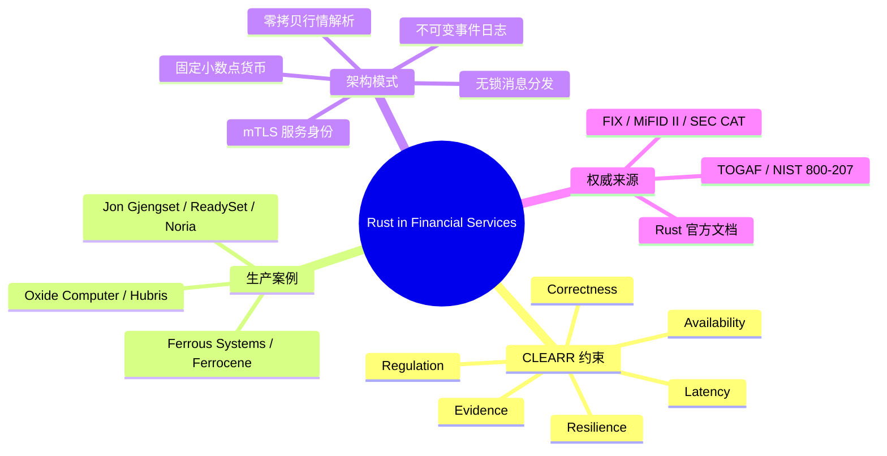

> **内容分级**: [专家级]
> **代码状态**: ✅ 含可编译示例与标注块
>
# Rust 在金融服务业（Rust in Financial Services）

**EN**: Rust in Financial Services
**Summary**: Production architecture patterns for Rust in trading, risk, payments, and ledger systems, aligned with ReadySet/Noria, Ferrocene, and Oxide-class operational-resilience cases.

> **Rust 版本**: 1.97.0+ (Edition 2024)
> **Bloom 层级**: L5-L6
> **权威来源**: 本文件为 `concept/` 权威页。
> **前置概念**: [Industrial Rust Adoption Case Studies](../11_domain_applications/14_industrial_case_studies.md) · [Event-Driven, CQRS & Enterprise Integration Patterns](11_event_driven_and_cqrs_patterns.md) · [Enterprise Security and Zero Trust Patterns](15_security_and_zero_trust_patterns.md)
> **后置概念**: [Rust in IoT and Edge Computing](17_rust_in_iot_and_edge.md) · [Distributed Systems Protocols](../06_data_and_distributed/11_distributed_systems_protocols.md) · [Safety Boundaries](../../05_comparative/03_domain_comparisons/01_safety_boundaries.md)

---

> **来源 / Provenance**:
> [Jon Gjengset — ReadySet / Noria research](https://jon.thesquareplanet.com/) ·
> [ReadySet](https://readyset.io/) ·
> [Ferrocene](https://ferrocene.dev/) ·
> [Ferrous Systems](https://ferrous-systems.com/) ·
> [Oxide Computer](https://oxide.computer/) ·
> [FIX Protocol Ltd](https://www.fixtrading.org/) ·
> [MiFID II RTS 6](https://www.esma.europa.eu/) ·
> [rust_decimal](https://docs.rs/rust_decimal/) ·
> [crossbeam](https://docs.rs/crossbeam/)

---

## 📑 目录

- [Rust 在金融服务业（Rust in Financial Services）](#rust-在金融服务业rust-in-financial-services)
  - [📑 目录](#-目录)
  - [一、领域语义与核心挑战](#一领域语义与核心挑战)
  - [二、生产案例：Jon Gjengset / ReadySet / Noria](#二生产案例jon-gjengset--readyset--noria)
  - [三、生产案例：Ferrous Systems / Ferrocene](#三生产案例ferrous-systems--ferrocene)
  - [四、生产案例：Oxide Computer 与运营韧性](#四生产案例oxide-computer-与运营韧性)
  - [五、Rust 映射金融架构的五大模式](#五rust-映射金融架构的五大模式)
  - [六、Rust 实现惯用法](#六rust-实现惯用法)
    - [6.1 固定小数点货币](#61-固定小数点货币)
    - [6.2 不可变审计日志事件](#62-不可变审计日志事件)
    - [6.3 零拷贝市场行情解析](#63-零拷贝市场行情解析)
    - [6.4 外部 crate 的十进制数](#64-外部-crate-的十进制数)
  - [七、反例与边界](#七反例与边界)
  - [八、决策树：金融领域 Rust 技术选型](#八决策树金融领域-rust-技术选型)
  - [九、权威来源索引](#九权威来源索引)
    - [P0 — Rust 官方与核心规范](#p0--rust-官方与核心规范)
    - [P1 — 金融与架构权威](#p1--金融与架构权威)
    - [P2 — Rust 生态与生产案例](#p2--rust-生态与生产案例)
  - [十、嵌入式测验](#十嵌入式测验)
    - [测验 1：为什么金融系统不应使用 `f64` 表示金额？（理解层）](#测验-1为什么金融系统不应使用-f64-表示金额理解层)
    - [测验 2：Noria / ReadySet 的增量视图维护最适合哪类金融场景？（应用层）](#测验-2noria--readyset-的增量视图维护最适合哪类金融场景应用层)
  - [十一、思维导图](#十一思维导图)

---

## 一、领域语义与核心挑战

金融服务业对软件系统的核心约束可以归纳为 **CLEARR**：

| 维度 | 业务语义 | Rust 工程映射 |
|---|---|---|
| **Correctness** | 计算与记录不能错 | 强类型、穷尽 `match`、代数数据类型 |
| **Latency** | 交易与风险计算的尾延迟可控 | 无 GC、`async`/多核、零拷贝解析 |
| **Evidence** | 审计、合规、可追溯 | 不可变事件日志、结构化 `tracing` |
| **Availability** | 交易时段不能中断 | 状态机、优雅关闭、冗余部署 |
| **Resilience** | 异常隔离、故障降级 | `Result` 传播、`catch_unwind`、边车模式 |
| **Regulation** | 满足 MiFID II RTS 6、SEC CAT 等 | 依赖审计、SBOM、`cargo vet` |

Rust 的价值不在于取代 Excel 或数据库，而在于把**“不能出错”的合规要求**转化为**编译期和架构层的可验证约束**。

---

## 二、生产案例：Jon Gjengset / ReadySet / Noria

Jon Gjengset 在 MIT 读博期间主导的 **Noria** 是一个面向 Web 应用的数据流数据库，支持增量式物化视图维护；其商业化版本 **ReadySet** 将同一技术路线用于生产环境的低延迟查询缓存。

**对金融系统的启示**：

1. **增量视图维护** = 风险敞口、持仓、P&L 的实时视图可以在数据写入时增量更新，避免每次查询重算。
2. **数据流正确性**：Noria 的运算符通过 Rust 的类型系统与所有权模型保证内部缓冲区的生命周期安全，减少并发数据竞争。
3. **尾延迟控制**：Rust 的无 GC 特性使 P99 延迟不受垃圾回收停顿影响，与交易链路对确定性延迟的需求高度契合。

> 判定依据：Jon Gjengset 的博士论文与 ReadySet 生产文档是“Rust 用于低延迟数据密集型系统”的国际权威案例。

---

## 三、生产案例：Ferrous Systems / Ferrocene

Ferrous Systems 是欧洲领先的 Rust 咨询公司，主导了 **Ferrocene**——通过 ISO 26262 ASIL D / IEC 61508 SIL 4 认证的 Rust 工具链。

**对金融系统的启示**：

- **监管科技（RegTech）** 需要可审计的工具链；Ferrocene 提供冻结版本、完整规格说明与变更追溯，满足金融监管机构对“构建过程可重复、可审计”的要求。
- **安全关键组件**（如支付清算、风控核心）可借助 Ferrocene 的认证编译器与 `core`/`alloc` 标准库认证，降低合规成本。
- Ferrous Systems 的嵌入式与实时系统经验也延伸至金融终端、POS 设备、ATM 固件等边缘节点。

---

## 四、生产案例：Oxide Computer 与运营韧性

Oxide Computer 使用 Rust 构建其云机的**控制平面固件**与系统软件栈，核心产品是一台集成硬件、固件与软件的“本地云计算机”。

**对金融系统的启示**：

- **运营韧性**：金融数据中心需要长周期、可维护、可审计的基础设施；Oxide 的全栈 Rust 策略把内存安全从应用层延伸到 BMC/SP 固件。
- **供应链最小化**：Oxide 的 `Hubris` 微内核设计强调小可信计算基（TCB）与静态资源分配，与金融行业缩小攻击面的目标一致。
- **可观测性内嵌**：Oxide 在固件层使用结构化日志与边界清晰的任务模型，这种模式可直接映射到金融核心系统的“可审计运行时”。

---

## 五、Rust 映射金融架构的五大模式

| 模式 | 问题 | Rust 机制 / crate | 企业架构映射 |
|---|---|---|---|
| **固定小数点货币** | 浮点误差、精度审计 | `i64` 最小单位 / `rust_decimal` | 数据架构：金额语义不可变 |
| **不可变事件日志** | 审计与回滚 | `enum` + `trait EventStore` | 业务架构：领域事件 |
| **零拷贝行情解析** | 每秒百万级消息 | `&[u8]` 切片、`nom` | 技术架构：低延迟 I/O |
| **无锁消息分发** | 多核行情分发 | `crossbeam::channel` | 应用架构：服务间通信 |
| **mTLS 服务身份** | 零信任交易网络 | `rustls` / SPIFFE 边车 | 安全架构：双向认证 |

---

## 六、Rust 实现惯用法

### 6.1 固定小数点货币

使用整数“最小单位”表示金额，彻底避免浮点精度问题：

```rust
#[derive(Debug, Clone, Copy, PartialEq, Eq, PartialOrd, Ord)]
struct Money(i64); // 1/100 of the currency unit, e.g. cents

impl Money {
    fn from_minor(units: i64) -> Self {
        Self(units)
    }

    fn checked_add(self, other: Self) -> Option<Self> {
        self.0.checked_add(other.0).map(Self)
    }

    fn checked_sub(self, other: Self) -> Option<Self> {
        self.0.checked_sub(other.0).map(Self)
    }
}

fn main() {
    let a = Money::from_minor(1_000);  // 10.00
    let b = Money::from_minor(2_500);  // 25.00
    match a.checked_add(b) {
        Some(sum) => println!("sum = {:?} cents", sum),
        None => eprintln!("overflow"),
    }
}
```

> **关键洞察**: `checked_*` 把“溢出即未定义行为”的整数运算变成显式 `Option`，这与金融风险计算中“任何溢出都必须被记录并拒绝”的合规要求一致。

### 6.2 不可变审计日志事件

领域事件用枚举建模，天然支持穷尽匹配：

```rust
use std::time::SystemTime;

#[derive(Debug, Clone)]
enum OrderSide { Buy, Sell }

#[derive(Debug, Clone)]
struct OrderPlaced {
    id: u64,
    symbol: String,
    side: OrderSide,
    qty: u64,
    price_cents: u64,
}

#[derive(Debug, Clone)]
enum DomainEvent {
    OrderPlaced(OrderPlaced),
    OrderFilled { id: u64, qty: u64, at: SystemTime },
    OrderCancelled { id: u64, reason: String },
}

trait EventStore {
    fn append(&mut self, event: &DomainEvent) -> Result<u64, &'static str>;
    fn read(&self, from_index: u64) -> Vec<DomainEvent>;
}

struct InMemoryStore(Vec<DomainEvent>);

impl EventStore for InMemoryStore {
    fn append(&mut self, event: &DomainEvent) -> Result<u64, &'static str> {
        self.0.push(event.clone());
        Ok(self.0.len() as u64)
    }

    fn read(&self, from_index: u64) -> Vec<DomainEvent> {
        self.0.iter().skip(from_index as usize).cloned().collect()
    }
}

fn main() {
    let mut store = InMemoryStore(vec![]);
    let event = DomainEvent::OrderPlaced(OrderPlaced {
        id: 1,
        symbol: "AAPL".into(),
        side: OrderSide::Buy,
        qty: 100,
        price_cents: 15_000,
    });
    store.append(&event).unwrap();
    println!("audit log: {:?}", store.read(0));
}
```

> **关键洞察**: 事件枚举的每个变体都是不可变值；结合 `EventStore` trait，可以把“审计轨迹”从业务逻辑中解耦，并替换为持久化事件存储。

### 6.3 零拷贝市场行情解析

解析 FIX/SBE 风格消息时，直接切片原始字节而非分配字符串：

```rust
fn parse_tag_value(input: &[u8]) -> Option<(&[u8], &[u8])> {
    let eq = input.iter().position(|&b| b == b'=')?;
    let (tag, rest) = input.split_at(eq);
    let rest = &rest[1..]; // skip '='
    let sep = rest.iter().position(|&b| b == 0x01)?; // SOH
    Some((tag, &rest[..sep]))
}

fn main() {
    let msg = b"35=D\x0155=AAPL\x01";
    if let Some((tag, value)) = parse_tag_value(msg) {
        println!("tag={:?}, value={:?}", std::str::from_utf8(tag), std::str::from_utf8(value));
    }
}
```

> **关键洞察**: `&[u8]` 切片不拥有数据，解析器零分配；配合 `crossbeam` 等无锁通道，可在多核之间分发行情而避免 GC 压力。

### 6.4 外部 crate 的十进制数

生产系统常使用 `rust_decimal` 提供任意精度小数：

```rust,ignore
// [dependencies]
// rust_decimal = "1.36"

use rust_decimal::Decimal;

fn quote_spread(bid: Decimal, ask: Decimal) -> Option<Decimal> {
    ask.checked_sub(bid)
}
```

---

## 七、反例与边界

| 反例 | 问题 | 修正 |
|---|---|---|
| 用 `f64` 表示金额 | 浮点舍入导致会计不平 | 使用整数最小单位或 `rust_decimal` |
| 为“性能”提前写 `unsafe` | 可能引入未定义行为，审计成本高于收益 | 先用 safe Rust 与基准测试定位瓶颈 |
| 把所有状态放在 `Arc<Mutex<T>>` | 在金融热路径上产生锁竞争与优先级反转 | 按领域边界拆分 actor / 无锁结构 |
| 忽视工具链审计 | 依赖中的 RUSTSEC 漏洞直接成为合规风险 | 在 CI 中运行 `cargo audit` / `cargo vet` |

**边界**：Rust 的借用检查器可以防止数据竞争和内存错误，但**不能检测错误的风控公式或错误的业务规则**。金融逻辑的正确性仍需通过领域测试、 property-based testing（如 `proptest`）和独立模型验证来保证。

---

## 八、决策树：金融领域 Rust 技术选型

```text
是否需要亚毫秒级确定性延迟？
├── 是 → 使用无 GC 的 Rust，热路径避免锁与分配
│        └── 是否需要持久化事件审计？
│              ├── 是 → 事件溯源 + 不可变 DomainEvent
│              └── 否 → 内存中状态机 + 快照
└── 否 → 可考虑 Rust 与现有 JVM/Go 服务混编

金额表示选型：
├── 整币种最小单位（cents） → 高性能、零依赖
└── 非整币种 / 高精度要求 → rust_decimal / bigdecimal

服务间信任模型：
├── 零信任网络 → mTLS + SPIFFE
└── 传统内网 → 至少单向 TLS 1.3 + 证书固定
```

---

## 九、权威来源索引

### P0 — Rust 官方与核心规范

- [The Rust Programming Language](https://doc.rust-lang.org/book/title-page.html)
- [The Cargo Book](https://doc.rust-lang.org/cargo/index.html)
- [Rust Reference](https://doc.rust-lang.org/reference/introduction.html)

### P1 — 金融与架构权威

- [FIX Protocol Ltd — FIX 5.0 SP2](https://www.fixtrading.org/standards/fix-5-0-sp-2/)
- [ESMA — MiFID II RTS 6](https://www.esma.europa.eu/)
- [SEC — Consolidated Audit Trail (CAT)](https://www.sec.gov/tm/consolidated-audit-trail)
- [NIST SP 800-207 — Zero Trust Architecture](https://csrc.nist.gov/publications/detail/sp/800-207/final)
- [The Open Group — TOGAF Standard, 10th Edition](https://www.opengroup.org/togaf)
- [Jung et al. — *RustBelt: Securing the Foundations of Rust*](https://plv.mpi-sws.org/rustbelt/popl18/)（形式化内存安全基础，P1）

### P2 — Rust 生态与生产案例

- [Jon Gjengset](https://jon.thesquareplanet.com/) · [ReadySet](https://readyset.io/) · [Noria paper (OSDI '18)](https://www.usenix.org/conference/osdi18/presentation/gjengset)
- [Ferrous Systems](https://ferrous-systems.com/) · [Ferrocene](https://ferrocene.dev/)
- [Oxide Computer](https://oxide.computer/) · [Hubris microkernel](https://github.com/oxidecomputer/hubris)
- [rust_decimal](https://docs.rs/rust_decimal/) · [crossbeam](https://docs.rs/crossbeam/) · [rustls](https://docs.rs/rustls/)

---

## 十、嵌入式测验

### 测验 1：为什么金融系统不应使用 `f64` 表示金额？（理解层）

**题目**: 用 `f64` 表示金额会带来什么风险？

<details>
<summary>✅ 答案与解析</summary>

二进制浮点数无法精确表示许多十进制小数，累加后会产生舍入误差，导致会计账目不平。金融系统应使用整数最小单位或任意精度十进制库（如 `rust_decimal`）。
</details>

### 测验 2：Noria / ReadySet 的增量视图维护最适合哪类金融场景？（应用层）

**题目**: 实时风险敞口、持仓 P&L 视图为什么适合使用增量物化视图？

<details>
<summary>✅ 答案与解析</summary>

因为每次查询重新聚合全量数据成本高且尾延迟不可控。增量视图在写入路径上更新结果，使查询延迟稳定，适合需要亚秒级风险视图的场景。
</details>

---

## 十一、思维导图



---

> **文档版本**: 1.0
> **最后更新**: 2026-08-04
> **状态**: ✅ P9-6 新增权威页
