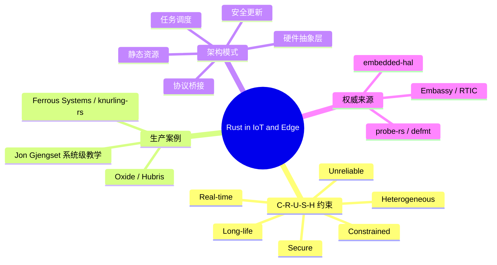

> **内容分级**: [专家级]
> **代码状态**: ✅ 含可编译示例与标注块
>
# Rust 在物联网与边缘计算（Rust in IoT and Edge Computing）

**EN**: Rust in IoT and Edge Computing
**Summary**: Production architecture patterns for Rust in constrained devices, edge gateways, and industrial firmware, aligned with Ferrous Systems, Oxide Hubris, and Embassy/RTIC ecosystem cases.

> **Rust 版本**: 1.97.0+ (Edition 2024)
> **Bloom 层级**: L5-L6
> **权威来源**: 本文件为 `concept/` 权威页。
> **前置概念**: [Embedded Systems](../05_systems_and_embedded/03_embedded_systems.md) · [RTOS and Scheduling in Rust](../05_systems_and_embedded/46_rtos_and_scheduling_in_rust.md) · [defmt and probe-rs](../05_systems_and_embedded/36_defmt_probe_rs_architecture.md)
> **后置概念**: [Rust in Financial Services](16_rust_in_financial_services.md) · [Industrial Rust Adoption Case Studies](../11_domain_applications/14_industrial_case_studies.md) · [Safety Boundaries](../../05_comparative/03_domain_comparisons/01_safety_boundaries.md)

---

> **来源 / Provenance**:
> [Ferrous Systems](https://ferrous-systems.com/) ·
> [knurling-rs](https://knurling.ferrous-systems.com/) ·
> [probe-rs](https://probe.rs/) ·
> [Oxide Computer](https://oxide.computer/) ·
> [Hubris microkernel](https://github.com/oxidecomputer/hubris) ·
> [embassy](https://embassy.dev/) ·
> [RTIC](https://rtic.rs/) ·
> [embedded-hal](https://github.com/rust-embedded/embedded-hal)

---

## 📑 目录

- [Rust 在物联网与边缘计算（Rust in IoT and Edge Computing）](#rust-在物联网与边缘计算rust-in-iot-and-edge-computing)
  - [📑 目录](#-目录)
  - [一、领域语义与核心挑战](#一领域语义与核心挑战)
  - [二、生产案例：Ferrous Systems 与 knurling-rs](#二生产案例ferrous-systems-与-knurling-rs)
  - [三、生产案例：Oxide / Hubris 微内核](#三生产案例oxide--hubris-微内核)
  - [四、生产案例：Jon Gjengset 与系统级教学](#四生产案例jon-gjengset-与系统级教学)
  - [五、Rust 映射 IoT/Edge 架构的五大模式](#五rust-映射-iotedge-架构的五大模式)
  - [六、Rust 实现惯用法](#六rust-实现惯用法)
    - [6.1 有状态传感器设备](#61-有状态传感器设备)
    - [6.2 no\_std + embedded-hal 外设抽象](#62-no_std--embedded-hal-外设抽象)
    - [6.3 边缘网关的消息批处理](#63-边缘网关的消息批处理)
  - [七、反例与边界](#七反例与边界)
  - [八、决策树：IoT/Edge Rust 技术选型](#八决策树iotedge-rust-技术选型)
  - [九、权威来源索引](#九权威来源索引)
    - [P0 — Rust 官方与核心规范](#p0--rust-官方与核心规范)
    - [P1 — 嵌入式/实时/工业权威](#p1--嵌入式实时工业权威)
    - [P2 — 生态与工具](#p2--生态与工具)
  - [十、嵌入式测验](#十嵌入式测验)
    - [测验 1：为什么 IoT 设备优先考虑 `no_std`？（理解层）](#测验-1为什么-iot-设备优先考虑-no_std理解层)
    - [测验 2：Hubris 微内核的“无堆分配”设计解决了什么问题？（分析层）](#测验-2hubris-微内核的无堆分配设计解决了什么问题分析层)
  - [十一、思维导图](#十一思维导图)

---

## 一、领域语义与核心挑战

物联网与边缘计算的约束与数据中心完全不同，可概括为 **C-R-U-S-H**：

| 维度 | 边缘语义 | Rust 工程映射 |
|---|---|---|
| **Constrained** | 内存、Flash、CPU、功耗受限 | `no_std`、`heapless`、静态分配 |
| **Real-time** | 传感器采集、电机控制有截止期限 | RTIC / Embassy 任务调度、中断安全 |
| **Unreliable** | 网络断续、电力不稳、温度恶劣 | 状态机、幂等上传、看门狗 |
| **Secure** | 设备靠近物理世界，易被提取固件 | 安全启动、加密存储、最小 TCB |
| **Heterogeneous** | 多厂商 MCU、传感器、协议并存 | `embedded-hal` trait 抽象 |
| **Long-life** | 部署 5–15 年，OTA 与安全补丁 | SemVer/MSRV 治理、`cargo vet` |

Rust 在 IoT/Edge 的核心价值是：**把“内存安全”和“无运行时垃圾回收”带入资源受限环境**，同时通过 trait 系统统一异构硬件抽象。

---

## 二、生产案例：Ferrous Systems 与 knurling-rs

Ferrous Systems 是欧洲最早的 Rust 嵌入式咨询团队之一，推出了 **knurling-rs** 工具链，显著降低了 Rust 嵌入式开发的门槛：

- **`defmt`**：结构化、高度压缩的日志框架，适合通过 SWD 调试线输出日志，显著减少 Flash 占用。
- **`probe-rs`**：统一的芯片调试与烧录工具，替代 OpenOCD 等碎片化方案。
- **`flip-link`**：将栈放到 RAM 另一端，实现栈溢出保护而不依赖 MPU。
- **培训与认证**：Ferrous Systems 的嵌入式 Rust 课程与 Ferrocene 认证工具链共同支撑工业级 IoT 项目。

**对企业架构的启示**：IoT 项目需要从“能跑”升级到“可调试、可审计、可长期维护”；knurling-rs 提供了跨越开发、测试、生产阶段的统一工具链。

---

## 三、生产案例：Oxide / Hubris 微内核

Oxide Computer 的 **Hubris** 是一个用 Rust 编写的微内核，用于其云机的服务处理器（Service Processor, SP）固件。其设计原则对边缘/工业设备极具参考价值：

1. **无堆分配**：所有任务与资源在编译期静态确定，消除运行时内存碎片与 OOM。
2. **基于能力的隔离**：任务之间通过内核管理的 IPC 端口通信，权限模型由类型系统与内核共同保证。
3. **故障隔离**：单个任务崩溃不会拖垮整个系统，可通过看门狗重启。
4. **可审计性**：`humility` 调试器可在不破坏现场的情况下检查任务状态、寄存器与消息队列。

**对企业架构的启示**：关键边缘节点（工业网关、能源控制器、医疗设备）可以把 Hubris 式的“小 TCB + 静态资源 + 能力隔离”作为高可信固件的参考架构。

---

## 四、生产案例：Jon Gjengset 与系统级教学

Jon Gjengset 的公开课程与直播编码（如 *Crust of Rust*、*Rust for Rustaceans*）虽然不直接面向 IoT，但系统阐述了 Rust 的异步运行时、Pin/Unpin、锁与并发语义。这些底层知识是理解 Embassy/RTIC 任务模型、Hubris IPC 以及边缘网关并发架构的前提。

**对企业架构的启示**：IoT/Edge 团队需要把“嵌入式”与“系统级 Rust”能力结合；Jon Gjengset 的内容是培养这类复合型工程师的国际权威学习资源。

---

## 五、Rust 映射 IoT/Edge 架构的五大模式

| 模式 | 问题 | Rust 机制 / crate | 企业架构映射 |
|---|---|---|---|
| **硬件抽象层** | 同一驱动跨 MCU 移植 | `embedded-hal` trait | 技术架构：可移植 HAL |
| **静态资源** | 无堆分配、确定性内存 | `heapless`、const 配置 | 技术架构：资源预算 |
| **任务调度** | 实时响应 + 低功耗 | RTIC / Embassy | 应用架构：任务模型 |
| **安全更新** | OTA 固件签名与回滚 | `minisign`/硬件安全启动 | 安全架构：可信更新 |
| **协议桥接** | 边缘网关连接多种总线 | `nb`、`embedded-io` | 应用架构：网关集成 |

---

## 六、Rust 实现惯用法

### 6.1 有状态传感器设备

一个纯 `std` 可编译的状态机，展示 IoT 设备如何从采样过渡到上传：

```rust
#[derive(Debug, Clone, Copy, PartialEq, Eq)]
enum SensorState {
    Idle,
    Sampling,
    Uploading,
    Error,
}

impl SensorState {
    fn next(self, sample_ok: bool, link_up: bool) -> Self {
        use SensorState::*;
        match (self, sample_ok, link_up) {
            (Idle, true, _) => Sampling,
            (Sampling, _, true) => Uploading,
            (Sampling, false, _) => Error,
            (Uploading, _, true) => Idle,
            (Uploading, false, _) => Error,
            (Error, true, true) => Idle,
            (current, _, _) => current,
        }
    }
}

fn main() {
    let mut state = SensorState::Idle;
    state = state.next(true, false);  // Idle -> Sampling
    assert_eq!(state, SensorState::Sampling);
    state = state.next(false, true);  // Sampling -> Uploading
    assert_eq!(state, SensorState::Uploading);
    state = state.next(false, true);  // Uploading -> Idle
    assert_eq!(state, SensorState::Idle);
    println!("final state: {:?}", state);
}
```

> **关键洞察**: 穷举 `match` 强制处理所有状态组合，避免传感器在“采样中但链路断开”时进入未定义行为。

### 6.2 no_std + embedded-hal 外设抽象

真实设备运行在 `no_std` 环境，硬件通过 `embedded-hal` trait 抽象：

```rust,ignore
// [dependencies]
// embedded-hal = "1.0"

use embedded_hal::digital::OutputPin;

pub struct Led<P: OutputPin> {
    pin: P,
}

impl<P: OutputPin> Led<P> {
    pub fn new(pin: P) -> Self {
        Self { pin }
    }

    pub fn on(&mut self) -> Result<(), P::Error> {
        self.pin.set_high()
    }

    pub fn off(&mut self) -> Result<(), P::Error> {
        self.pin.set_low()
    }
}
```

> **关键洞察**: `trait OutputPin` 把具体 GPIO 端口与业务逻辑解耦，驱动代码可在不同 MCU 之间复用。

### 6.3 边缘网关的消息批处理

边缘网关通常需要在断网时缓存传感器读数，恢复后批量上传：

```rust
use std::collections::VecDeque;

struct SensorReading {
    sensor_id: u32,
    timestamp: u64,
    value: i32,
}

struct EdgeBuffer {
    capacity: usize,
    queue: VecDeque<SensorReading>,
}

impl EdgeBuffer {
    fn new(capacity: usize) -> Self {
        Self { capacity, queue: VecDeque::with_capacity(capacity) }
    }

    fn push(&mut self, reading: SensorReading) -> Option<SensorReading> {
        if self.queue.len() == self.capacity {
            self.queue.pop_front()
        } else {
            None
        };
        self.queue.push_back(reading);
        None
    }

    fn batch(&mut self, n: usize) -> Vec<SensorReading> {
        self.queue.drain(..n.min(self.queue.len())).collect()
    }
}

fn main() {
    let mut buf = EdgeBuffer::new(4);
    for i in 0..6 {
        buf.push(SensorReading { sensor_id: 1, timestamp: i, value: i as i32 * 10 });
    }
    let batch = buf.batch(10);
    println!("uploading {} readings", batch.len());
}
```

> **关键洞察**: 使用 `VecDeque` 实现固定容量的循环缓冲；在 `no_std` 环境中可替换为 `heapless::Deque`，保持相同的接口语义。

---

## 七、反例与边界

| 反例 | 问题 | 修正 |
|---|---|---|
| 在 64 kB Flash 的 MCU 上直接用 `std` | 二进制体积与堆分配不可接受 | 使用 `no_std` + `panic-halt` + `embedded-hal` |
| 用动态内存管理实时控制回路 | 分配延迟不确定，可能错过截止期限 | 静态分配、使用 `heapless` 或完全无堆 |
| 调试阶段关闭所有错误处理 | 现场故障无法定位 | 使用 `defmt` 结构化日志 + `probe-rs` 现场调试 |
| OTA 更新不签名 | 固件被替换后设备沦为攻击入口 | 安全启动 + 签名验证 + 双区回滚 |

**边界**：Rust 的借用检查器不能保证实时任务的**调度可调度性**（schedulability）。硬实时系统仍需使用 RTIC/Embassy 的调度分析或 Rate Monotonic 分析，必要时使用 Ferrocene 认证工具链。

---

## 八、决策树：IoT/Edge Rust 技术选型

```text
设备是否有完整操作系统（Linux）？
├── 是 → 使用标准 Rust + tokio / rustls / systemd
│        └── 是否需要实时？ → 考虑 PREEMPT_RT + async 边界
└── 否 → 使用 no_std + embedded-hal
         ├── 是否需要多任务抢占？
         │   ├── 是 → RTIC
         │   └── 否 → Embassy 协作式 async
         ├── 是否需要堆？
         │   ├── 是 → heapless
         │   └── 否 → 纯静态分配
         └── 是否需要高可信隔离？
              ├── 是 → Hubris-style 微内核 / 能力模型
              └── 否 → 单地址空间 + 任务优先级
```

---

## 九、权威来源索引

### P0 — Rust 官方与核心规范

- [The Rust Programming Language](https://doc.rust-lang.org/book/title-page.html)
- [The Embedded Rust Book](https://docs.rust-embedded.org/book/)
- [The Cargo Book](https://doc.rust-lang.org/cargo/index.html)

### P1 — 嵌入式/实时/工业权威

- [Ferrous Systems — Embedded Rust Trainings](https://ferrous-systems.com/training/)
- [knurling-rs](https://knurling.ferrous-systems.com/)
- [probe-rs](https://probe.rs/)
- [Hubris Reference](https://hubris.oxide.computer/)
- [Embassy Framework](https://embassy.dev/)
- [RTIC Book](https://rtic.rs/)
- [embedded-hal](https://github.com/rust-embedded/embedded-hal)
- [Jung et al. — *RustBelt: Securing the Foundations of Rust*](https://plv.mpi-sws.org/rustbelt/popl18/)（形式化内存安全基础，P1）

### P2 — 生态与工具

- [defmt](https://defmt.ferrous-systems.com/) · [flip-link](https://github.com/knurling-rs/flip-link)
- [heapless](https://docs.rs/heapless/) · [embedded-io](https://docs.rs/embedded-io/)
- [minisign](https://jedisct1.github.io/minisign/)
- [Oxide Computer Blog](https://oxide.computer/blog)

---

## 十、嵌入式测验

### 测验 1：为什么 IoT 设备优先考虑 `no_std`？（理解层）

**题目**: 资源受限的 IoT 设备使用 `no_std` 的主要动机是什么？

<details>
<summary>✅ 答案与解析</summary>

`std` 依赖操作系统抽象、堆分配和较大的二进制体积，不适合 Flash 与 RAM 受限的 MCU。`no_std` 允许开发者精确控制运行时，减小体积并消除不确定的堆分配延迟。
</details>

### 测验 2：Hubris 微内核的“无堆分配”设计解决了什么问题？（分析层）

**题目**: 在固件中禁止动态堆分配有什么好处？

<details>
<summary>✅ 答案与解析</summary>

消除运行时内存碎片、OOM 和分配延迟，使资源使用在编译期可验证，提升实时性与长期稳定性，并缩小可信计算基。
</details>

---

## 十一、思维导图



---

> **文档版本**: 1.0
> **最后更新**: 2026-08-04
> **状态**: ✅ P9-6 新增权威页
