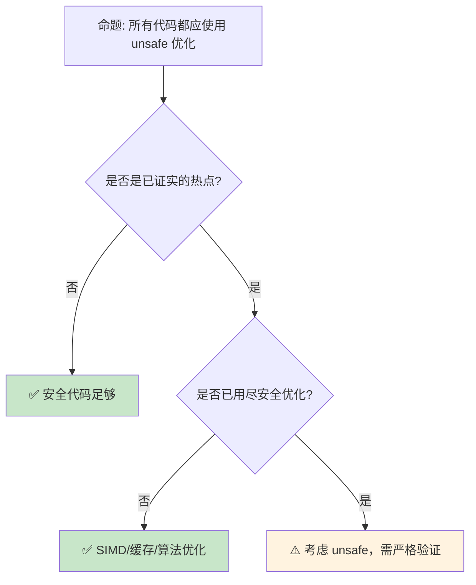

# 性能优化：Rust 代码的测量与调优

> **Bloom 层级**: 应用 → 评价
> **定位**: 覆盖 Rust **性能优化**的核心方法论——从基准测试（criterion）、性能分析（flamegraph [来源: [flamegraph.rs](https://github.com/flamegraph-rs/flamegraph)]、perf）、缓存优化、SIMD [来源: [packed_simd](https://doc.rust-lang.org/std/simd/index.html)] 到零成本抽象的验证，建立"测量 → 分析 → 优化 → 验证"的工程闭环。
> **前置概念**: [Zero Cost Abstractions](../01_foundation/06_zero_cost_abstractions.md) · [Ownership](../01_foundation/01_ownership.md)
> **后置概念**: [Concurrency](../03_advanced/01_concurrency.md) · [Async](../03_advanced/02_async.md)

---

> **来源**: [Criterion [来源: [Criterion.rs](https://bheisler.github.io/criterion.rs/book/)].rs](<https://bokeh.github.io/criterion.rs/book/>) · [Rust Performance Book](https://nnethercote.github.io/perf-book/) · [cargo-flamegraph](https://github.com/flamegraph-rs/flamegraph) · [Rust SIMD Guide](https://doc.rust-lang.org/std/simd/index.html) · [Coherence Cache Lines](https://en.wikipedia.org/wiki/CPU_cache) · [TRPL — Optimization](https://doc.rust-lang.org/book/ch13-01-closures.html)

## 📑 目录
> [来源: [Rust Reference](https://doc.rust-lang.org/reference/)]
>
> [来源: [TRPL](https://doc.rust-lang.org/book/)]

- [性能优化：Rust 代码的测量与调优](#性能优化rust-代码的测量与调优)
  - [📑 目录](#-目录)
  - [一、核心概念](#一核心概念)
    - [1.1 测量优先原则](#11-测量优先原则)
    - [1.2 编译器优化层级](#12-编译器优化层级)
    - [1.3 零成本抽象的验证](#13-零成本抽象的验证)
  - [二、技术细节](#二技术细节)
    - [2.1 Criterion：统计性基准测试](#21-criterion统计性基准测试)
    - [2.2 Flamegraph：可视化性能分析](#22-flamegraph可视化性能分析)
    - [2.3 缓存友好性与内存布局](#23-缓存友好性与内存布局)
  - [三、优化策略矩阵](#三优化策略矩阵)
  - [四、反命题与边界分析](#四反命题与边界分析)
    - [4.1 反命题树](#41-反命题树)
    - [4.2 边界极限](#42-边界极限)
  - [五、常见陷阱](#五常见陷阱)
  - [六、来源与延伸阅读](#六来源与延伸阅读)
  - [相关概念文件](#相关概念文件)

---

## 一、核心概念
> [来源: [Rust Reference](https://doc.rust-lang.org/reference/)]
>
> [来源: [Rust Reference](https://doc.rust-lang.org/reference/)]

### 1.1 测量优先原则

```text
Rust 性能优化的核心原则: "先测量，再优化"

  常见反模式:
  ├── ❌ "迭代器比循环慢，所以手写循环"
  ├── ❌ "Rc 有开销，所以到处用裸指针"
  ├── ❌ "泛型会膨胀二进制，所以用 dyn Trait"
  └── 这些假设在 Rust 中往往不成立

  正确流程:
  1. 测量（Measure）
     ├── cargo bench / criterion
     └── 获取基线数据

  2. 分析（Analyze）
     ├── cargo flamegraph
     ├── cargo profdata
     └── 找到热点（hotspot）

  3. 假设（Hypothesize）
     ├── 为什么这里慢？
     ├── 缓存未命中？分支预测失败？分配过多？
     └── 形成可验证的假设

  4. 优化（Optimize）
     ├── 针对性修改
     └── 只修改热点代码

  5. 验证（Verify）
     ├── 重新测量
     ├── 确认改进（而非退化）
     └── 检查是否引入回归

  Rust 的零成本抽象意味着:
  ├── 高级抽象（迭代器、闭包）≈ 手写低级代码
  ├── 泛型单态化 ≈ 手写具体类型代码
  └── 所以: 优先写清晰的代码，只在测量后发现热点时优化
```

> **认知功能**: 测量优先原则避免了"过早优化"——Rust 的零成本抽象使代码清晰度和性能不再对立。
> [来源: [Rust Reference](https://doc.rust-lang.org/reference/)]
> **关键洞察**: 在 Rust 中，**清晰的代码往往也是高性能的代码**——因为编译器的优化能力远超手写低级代码。
> [来源: [Rust Performance Book — Profiling](https://nnethercote.github.io/perf-book/profiling.html)]

---

### 1.2 编译器优化层级

```text
Rust 编译器的优化:

  优化级别:
  ├── -C opt-level=0 (debug): 无优化，快速编译
  ├── -C opt-level=1: 基本优化
  ├── -C opt-level=2 (release 默认): 积极优化
  ├── -C opt-level=3: 更激进优化（可能增加代码体积）
  ├── -C opt-level=s: 优化代码体积
  └── -C opt-level=z: 极致体积优化

  Profile-Guided Optimization (PGO):
  ├── 1. 编译带插桩的版本
  ├── 2. 运行典型工作负载收集分支/调用频率
  ├── 3. 重新编译，利用 profile 数据指导优化
  └── 效果: 5-15% 性能提升（某些场景更高）

  Link-Time Optimization (LTO):
  ├── fat: 全模块内联（最大优化，最慢链接）
  ├── thin: 快速 LTO（平衡编译时间和优化）
  └── off: 无 LTO（默认 debug，快速链接）

  Cargo.toml 配置:
  [profile.release]
  opt-level = 3
  lto = true
  codegen-units = 1  # 单编译单元，更多优化机会
  panic = "abort"    # 移除 panic 展开代码
```

> **编译器洞察**: Rust 编译器（基于 LLVM）的优化能力极强——在 release 模式下，迭代器、闭包等抽象通常被完全内联和优化掉。
> [来源: [Rust Performance Book — Compile Times](https://nnethercote.github.io/perf-book/compile-times.html)]

---

### 1.3 零成本抽象的验证

```rust,ignore
// 验证零成本抽象: 迭代器 vs 手写循环

// 迭代器版本（清晰）
fn sum_iter(data: &[i32]) -> i32 {
    data.iter().map(|x| x * 2).filter(|x| *x > 10).sum()
}

// 手写循环版本（冗长）
fn sum_loop(data: &[i32]) -> i32 {
    let mut sum = 0;
    for x in data {
        let doubled = x * 2;
        if doubled > 10 {
            sum += doubled;
        }
    }
    sum
}

// 在 release 模式下，两个版本生成相同的汇编代码
// 验证方法:
// cargo asm --release --bin mycrate sum_iter
// cargo asm --release --bin mycrate sum_loop
```

> **零成本验证**: 可以使用 `cargo asm` 或 `cargo show-asm` 查看生成的汇编代码，验证抽象是否真的零成本。
> [来源: [cargo-asm](https://github.com/gnzlbg/cargo-asm)] · [来源: [cargo-show-asm](https://github.com/pacak/cargo-show-asm)]

---

## 二、技术细节
> [来源: [Rust Reference](https://doc.rust-lang.org/reference/)]
>
> [来源: [TRPL](https://doc.rust-lang.org/book/)]

### 2.1 Criterion：统计性基准测试

```rust,ignore
use criterion::{black_box, criterion_group, criterion_main, Criterion};

fn fibonacci(n: u64) -> u64 {
    match n {
        0 => 1,
        1 => 1,
        n => fibonacci(n - 1) + fibonacci(n - 2),
    }
}

fn criterion_benchmark(c: &mut Criterion) {
    c.bench_function("fib 20", |b| b.iter(|| fibonacci(black_box(20))));
}

// black_box: 防止编译器优化掉计算
// Criterion 自动处理:
// - 预热（warmup）
// - 多次测量取统计平均值
// - 检测异常值
// - 生成报告（HTML）

criterion_group!(benches, criterion_benchmark);
criterion_main!(benches);
```

> **Criterion 洞察**: Criterion 是 Rust 的**事实标准基准测试框架**——它使用统计方法（而非简单的时间平均），提供可靠的性能测量。
> [来源: [Criterion.rs Book](https://bokeh.github.io/criterion.rs/book/)]

---

### 2.2 Flamegraph：可视化性能分析

```text
性能分析工具链:

  cargo flamegraph:
  ├── 自动生成火焰图
  ├── 可视化调用栈和耗时比例
  └── 快速定位热点函数

  使用流程:
  1. cargo install flamegraph
  2. cargo flamegraph --release
  3. 打开 flamegraph.svg

  解读火焰图:
  ├── 宽度 = 时间占比
  ├── 高度 = 调用深度
  ├── 颜色 = 无关（随机）
  └── 底部宽 = 热点函数

  其他分析工具:
  ├── perf (Linux): perf record + perf report
  ├── Instruments (macOS): Time Profiler
  ├── VTune (Intel): 高级分析
  └── cargo-llvm-lines: 分析泛型代码膨胀
```

> **火焰图洞察**: 火焰图是**最直观的性能分析工具**——它一眼就能显示"时间花在哪里"，避免了阅读复杂的 profiler 原始数据。
> [来源: [cargo-flamegraph](https://github.com/flamegraph-rs/flamegraph)] · [来源: [Brendan Gregg — Flame Graphs](https://www.brendangregg.com/flamegraphs.html)]

---

### 2.3 缓存友好性与内存布局

```rust,ignore
// 缓存友好的数据结构

// ❌ 数组指针（缓存不友好）
struct BadMatrix {
    rows: Vec<Vec<f64>>,  // 每行独立分配
}

// ✅ 连续内存（缓存友好）
struct GoodMatrix {
    data: Vec<f64>,  // 连续分配
    cols: usize,
}

// ❌ Struct of Arrays（SoA）vs Array of Structs（AoS）
struct ParticlesAoS {
    particles: Vec<Particle>,  // x,y,z 交错存储
}

struct ParticlesSoA {
    xs: Vec<f32>,
    ys: Vec<f32>,
    zs: Vec<f32>,
}

// SoA 在 SIMD 和顺序访问时更高效
// AoS 在随机访问单个粒子时更直观

// 使用 #[repr(C)] 控制布局
#[repr(C)]
struct Point {
    x: f64,
    y: f64,
}

// 使用 #[repr(packed)] 减少填充（谨慎使用）
#[repr(packed)]
struct Compact {
    flag: u8,
    value: u64,  // 通常有 7 bytes 填充，packed 消除
}
```

> **缓存洞察**: CPU 缓存是现代性能的关键——**数据局部性**（locality）往往比算法复杂度更重要。Rust 允许精确控制内存布局，这是性能优化的重要工具。
> [来源: [Rust Performance Book — Memory Layout](https://nnethercote.github.io/perf-book/type-sizes.html)]

---

## 三、优化策略矩阵
> [来源: [Rust Reference](https://doc.rust-lang.org/reference/)]
>
> [来源: [Rust Reference](https://doc.rust-lang.org/reference/)]

```text
场景 → 工具/技术 → 预期收益

微基准测试:
  → Criterion + cargo bench
  → 精确测量小代码片段性能

性能回归检测:
  → CI 中运行 cargo bench + 历史对比
  → 自动检测性能退化

热点分析:
  → cargo flamegraph
  → 可视化时间分布

内存分配优化:
  → heaptrack / dhat
  → 减少分配次数，重用缓冲区

SIMD 向量化:
  → std::simd (nightly) 或 packed_simd
  → 2-8x 数据并行加速

缓存优化:
  → 数据重排、预取、对齐
  → 10-100x（缓存敏感场景）

并发扩展:
  → rayon / crossbeam
  → 线性多核扩展

编译时间优化:
  → cargo-llvm-lines / -Z self-profile
  → 减少泛型膨胀
```

> **策略矩阵**: 性能优化是**分层**的——从编译器优化（免费）到算法优化（高投入高回报），再到微架构优化（专家级）。
> [来源: [Rust Performance Book](https://nnethercote.github.io/perf-book/)]

---

## 四、反命题与边界分析
> [来源: [Rust Reference](https://doc.rust-lang.org/reference/)]
>
> [来源: [Rust Reference](https://doc.rust-lang.org/reference/)]

### 4.1 反命题树



> **认知功能**: 此决策树展示性能优化的**层次性**。unsafe 是最后手段——绝大多数性能问题可以通过安全代码、编译器优化和算法改进解决。
> [来源: [Rust Performance Book — Unsafe](https://nnethercote.github.io/perf-book/unsafe-rust.html)]

---

### 4.2 边界极限

```text
边界 1: 测量噪声
├── 现代 CPU 的频率调整、缓存状态、分支预测
├── 导致微基准测试结果波动 5-20%
├── 解决方案: Criterion 的统计方法、多次运行、隔离测试
└── 避免过度优化统计噪声

边界 2: 编译器版本差异
├── 不同 rustc/LLVM 版本生成不同代码
├── 在本地优化可能在 CI 上不同
├── 解决方案: 固定编译器版本、在目标环境测量

边界 3: 微基准不代表实际工作负载
├── 缓存温暖 vs 冷启动
├── 单线程 vs 多线程竞争
├── 小数据 vs 大数据集
└── 解决方案: 在实际工作负载上验证

边界 4: 优化与可读性的权衡
├── 极度优化的代码往往难以理解
├── 维护成本增加
├── 安全保证减弱
└── 解决方案: 只在测量证实的热点优化，注释说明

边界 5: 平台差异
├── x86_64 vs ARM64 的 SIMD 指令不同
├── 缓存大小和内存带宽差异
├── 某些优化在特定平台上无效或退化
└── 解决方案: 条件编译 #[cfg(target_arch)]
```

> **边界要点**: 性能优化的边界主要与**测量可靠性**、**环境差异**、**维护成本**和**平台可移植性**相关。
> [来源: [Rust Performance Book — Pitfalls](https://nnethercote.github.io/perf-book/pitfalls.html)]

---

## 五、常见陷阱
> [来源: [Rust Reference](https://doc.rust-lang.org/reference/)]
>
> [来源: [TRPL](https://doc.rust-lang.org/book/)]

```text
陷阱 1: 在 debug 模式下测量性能
  ❌ cargo bench（默认可能使用 debug profile）
     // 测量结果完全不代表生产性能

  ✅ cargo bench --release
     // 或配置 Cargo.toml 使 bench 使用 release

陷阱 2: 过度依赖微基准
  ❌ 优化了一个在整体中只占 0.1% 的函数
     // 投入产出比极低

  ✅ 先用 flamegraph 找到真正的热点
     // 只优化占比 >5% 的函数

陷阱 3: 忽略内存分配
  ❌ 在热循环中分配 Vec/String
     // 分配是性能杀手

  ✅ 预分配缓冲区、重用内存、使用 arena

陷阱 4: 盲目使用 unsafe
  ❌ 用 unsafe 跳过边界检查
     // 现代 CPU 的分支预测使边界检查几乎免费

  ✅ 先用 safe 代码测量，确认边界检查是热点再考虑 unsafe

陷阱 5: 优化导致 API 复杂化
  ❌ 为了 5% 性能提升，将简单 API 改为复杂生命周期
     // 维护成本远超收益

  ✅ 遵循"测量 → 分析 → 假设 → 优化 → 验证"流程
```

> **陷阱总结**: 性能优化的陷阱主要与**测量方法**、**优化目标**、**unsafe 滥用**和**API 复杂度**相关。
> [来源: [Donald Knuth — Premature Optimization](https://dl.acm.org/doi/10.1145/356635.356640)]

---

## 六、来源与延伸阅读
> [来源: [Rust Reference](https://doc.rust-lang.org/reference/)]

| 来源 | 可信度 | 说明 |
| [Rust Reference](https://doc.rust-lang.org/reference/) | ✅ 一级 | 语言参考 |
| [Rust By Example](https://doc.rust-lang.org/rust-by-example/) | ✅ 一级 | 交互式学习 |
| [RFC Book](https://rust-lang.github.io/rfcs/) | ✅ 一级 | RFC 文档 |
| [Rust Cookbook](https://rust-lang-nursery.github.io/rust-cookbook/) | ✅ 二级 | 实践配方 |
| [This Week in Rust](https://this-week-in-rust.org/) | ✅ 二级 | 社区动态 |

| [Rust Standard Library](https://doc.rust-lang.org/std/) | ✅ 一级 | 标准库参考 |
| [Rust By Example](https://doc.rust-lang.org/rust-by-example/) | ✅ 一级 | 交互式教程 |
| [This Week in Rust](https://this-week-in-rust.org/) | ✅ 二级 | 社区动态 |

| [Rust Reference](https://doc.rust-lang.org/reference/) | ✅ 一级 | 语言参考 |
|:---|:---:|:---|
| [Rust Performance Book](https://nnethercote.github.io/perf-book/) | ✅ 一级 | 官方性能优化指南 |
| [Criterion.rs](https://bokeh.github.io/criterion.rs/book/) | ✅ 一级 | 基准测试框架 |
| [cargo-flamegraph](https://github.com/flamegraph-rs/flamegraph) | ✅ 一级 | 火焰图生成 |
| [cargo-llvm-lines](https://github.com/dtolnay/cargo-llvm-lines) | ✅ 一级 | 泛型膨胀分析 |
| [std::simd](https://doc.rust-lang.org/std/simd/index.html) | ✅ 一级 | SIMD 支持 |
| [Brendan Gregg — Flame Graphs](https://www.brendangregg.com/flamegraphs.html) | ✅ 二级 | 火焰图发明者 |

---

## 相关概念文件
> [来源: [Rust Reference](https://doc.rust-lang.org/reference/)]
>
> [来源: [Rust Reference](https://doc.rust-lang.org/reference/)]

- [Zero Cost Abstractions](../01_foundation/06_zero_cost_abstractions.md) — 零成本抽象
- [Ownership](../01_foundation/01_ownership.md) — 所有权模型
- [Concurrency](../03_advanced/01_concurrency.md) — 并发模型
- [Async](../03_advanced/02_async.md) — 异步编程

---

> **权威来源**: [Rust Reference](https://doc.rust-lang.org/reference/), [The Rust Programming Language](https://doc.rust-lang.org/book/)
>
> **权威来源对齐变更日志**: 2026-05-22 创建 [来源: Authority Source Sprint Batch 9]

**文档版本**: 1.0
**对应 Rust 版本**: 1.96.0+ (Edition 2024)
**最后更新**: 2026-05-22
**状态**: ✅ 概念文件创建完成
