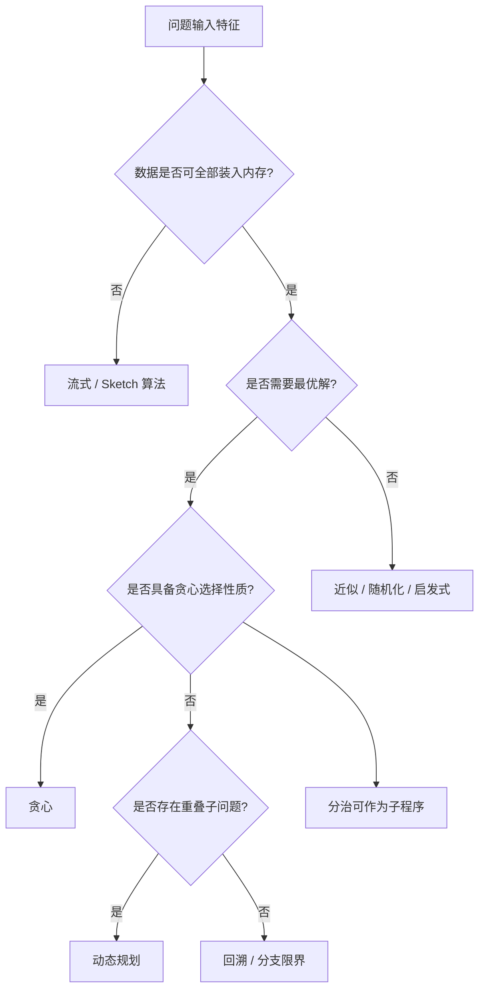
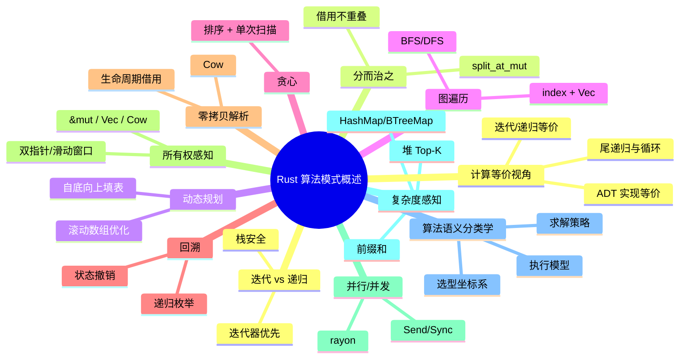

# Rust 算法模式概述

**EN**: Rust Algorithm Patterns Overview
**Summary**: Idiomatic patterns for implementing algorithms in Rust — iteration, recursion, divide-and-conquer, dynamic programming, graph traversal, greedy, backtracking, zero-copy parsing, ownership-aware, parallel, and complexity-aware idioms.

> **Rust 版本**: 1.97.0+ (Edition 2024)
> **Bloom 层级**: L6
> **权威来源**: 本文件为 `concept/` 权威页。
> **定位**: 为 Rust 算法实现提供模式级概览，连接语言特性（所有权、借用、迭代器、并发）与经典算法思想。
> **前置概念**: [Iterator](../../02_intermediate/07_iterators_and_closures/01_iterator_patterns.md) · [Ownership](../../01_foundation/01_ownership_borrow_lifetime/01_ownership.md) · [Borrowing](../../01_foundation/01_ownership_borrow_lifetime/02_borrowing.md) · [Generics](../../02_intermediate/01_generics/01_generics.md) · [Send/Sync](../../03_advanced/00_concurrency/02_send_sync_auto_traits.md)
> **后置概念**: [算法与复杂度惯用法](../10_performance/03_algorithms_and_complexity_idioms.md) · [零拷贝解析](../11_domain_applications/26_zero_copy_parsing_in_rust.md) · [所有权感知算法](../11_domain_applications/27_ownership_aware_algorithms.md) · [并行与并发算法](../11_domain_applications/25_parallel_algorithms.md) · [c08_algorithms crate docs](../../../crates/c08_algorithms/docs/README.md)
> **L5 对比**: [Rust vs C++](../../05_comparative/01_systems_languages/01_rust_vs_cpp.md)

---

> **来源 / Provenance**:
> [The Rust Reference](https://doc.rust-lang.org/reference/introduction.html) ·
> [The Rust Programming Language](https://doc.rust-lang.org/book/title-page.html) ·
> [Rust Design Patterns](https://rust-unofficial.github.io/patterns/) ·
> [CLRS — Introduction to Algorithms, 4th ed.](https://mitpress.mit.edu/9780262046305/introduction-to-algorithms/) ·
> [Sedgewick & Wayne — Algorithms, 4th ed.](https://algs4.cs.princeton.edu/home/) ·
> [The Rust Performance Book](https://nnethercote.github.io/perf-book/)

---

## 一、权威定义

**Rust 算法模式** 是指在 Rust 中实现经典算法时，充分利用所有权、借用、迭代器、`trait` 与类型系统形成的地道编码模式。它不是新算法，而是把通用算法思想映射到 Rust 语义后的惯用表达。

> **来源**: [Rust Design Patterns](https://rust-unofficial.github.io/patterns/) · [CLRS 2022](https://mitpress.mit.edu/9780262046305/introduction-to-algorithms/)

---

## 二、关键属性

| 属性 | Rust 表达 | 说明 |
|:---|:---|:---|
| **所有权显式化** | `&[T]` / `&mut [T]` / `T` | 输入输出关系在签名中可见 |
| **零拷贝优先** | 借用切片、`Cow`、`&str` | 减少堆分配与数据复制 |
| **迭代器抽象** | `Iterator` 适配器 | 惰性、可组合、零成本抽象 |
| **类型驱动正确性** | `Ord`、`Copy`、`Send`/`Sync` | 编译期捕获非法接口 |
| **安全并发** | `rayon`、`crossbeam` | 数据竞争在编译期排除 |

---

## 三、算法模式目录

### 3.1 迭代 vs 递归

Rust 的迭代器通常优于显式递归，因为后者容易导致栈溢出且难以与借用检查器协作。

```rust
// 迭代：惯用，无栈溢出风险
fn factorial_iter(n: u64) -> u64 {
    (1..=n).product()
}

// 递归：逻辑清晰，但深度大时可能栈溢出
fn factorial_rec(n: u64) -> u64 {
    if n == 0 { 1 } else { n * factorial_rec(n - 1) }
}
```

**选型原则**：树/图遍历等天然递归结构可保留递归；数值累积、线性扫描优先使用迭代器。

### 3.2 分而治之

利用 `split_at_mut` 在编译期保证子切片不重叠，是分治算法的 Rust 地道写法。

```rust
fn merge_sort<T: Ord + Copy>(arr: &mut [T]) {
    if arr.len() <= 1 {
        return;
    }
    let mid = arr.len() / 2;
    let (left, right) = arr.split_at_mut(mid);
    merge_sort(left);
    merge_sort(right);
    merge_in_place(left, right);
}

fn merge_in_place<T: Ord + Copy>(left: &mut [T], right: &mut [T]) {
    let mut merged: Vec<T> = Vec::with_capacity(left.len() + right.len());
    let (mut i, mut j) = (0, 0);
    while i < left.len() && j < right.len() {
        if left[i] <= right[j] {
            merged.push(left[i]);
            i += 1;
        } else {
            merged.push(right[j]);
            j += 1;
        }
    }
    merged.extend_from_slice(&left[i..]);
    merged.extend_from_slice(&right[j..]);
    left.copy_from_slice(&merged[..left.len()]);
    right.copy_from_slice(&merged[left.len()..]);
}
```

> 更完整的所有权分析见 [`所有权感知算法`](../11_domain_applications/27_ownership_aware_algorithms.md)。

### 3.3 动态规划

Rust 中 DP 表通常用 `Vec` 或固定大小数组实现。
自底向上填表时，注意索引边界。详见 [`动态规划 Rust 实现`](06_dynamic_programming_in_rust.md)。

```rust
fn fibonacci_dp(n: usize) -> u64 {
    if n == 0 {
        return 0;
    }
    let mut dp = vec![0u64; n + 1];
    dp[1] = 1;
    for i in 2..=n {
        dp[i] = dp[i - 1] + dp[i - 2];
    }
    dp[n]
}

fn knapsack_01(weights: &[usize], values: &[usize], capacity: usize) -> usize {
    let n = weights.len();
    let mut dp = vec![0; capacity + 1];
    for i in 0..n {
        for w in (weights[i]..=capacity).rev() {
            dp[w] = dp[w].max(dp[w - weights[i]] + values[i]);
        }
    }
    dp[capacity]
}
```

### 3.4 图遍历

基于索引的图表示最符合 Rust 借用模型。BFS/DFS 用 `Vec` 作为邻接表，配合 `visited` 数组。

```rust
#[derive(Default)]
struct Graph {
    adj: Vec<Vec<usize>>,
}

impl Graph {
    fn with_nodes(n: usize) -> Self {
        Self { adj: vec![Vec::new(); n] }
    }

    fn add_edge(&mut self, u: usize, v: usize) {
        self.adj[u].push(v);
    }

    fn bfs(&self, start: usize) -> Vec<usize> {
        let mut visited = vec![false; self.adj.len()];
        let mut order = Vec::new();
        let mut queue = std::collections::VecDeque::new();
        queue.push_back(start);
        visited[start] = true;

        while let Some(u) = queue.pop_front() {
            order.push(u);
            for &v in &self.adj[u] {
                if !visited[v] {
                    visited[v] = true;
                    queue.push_back(v);
                }
            }
        }
        order
    }
}
```

> 更完整的图算法实现（Dijkstra、Bellman-Ford、并行 frontier）见 [`图算法 Rust 实现`](03_graph_algorithms_in_rust.md)。

### 3.5 贪心算法

贪心在 Rust 中通常体现为先排序再单次扫描。借用检查器要求排序与扫描不能交叉可变借用。

```rust
fn activity_selection(mut activities: Vec<(usize, usize)>) -> Vec<(usize, usize)> {
    activities.sort_by_key(|&(_, end)| end);
    let mut selected = Vec::new();
    let mut last_end = 0;
    for (start, end) in activities {
        if start >= last_end {
            selected.push((start, end));
            last_end = end;
        }
    }
    selected
}
```

### 3.6 回溯法

回溯需要恢复状态，Rust 中常用可变引用原地修改并在递归返回后撤销。

```rust
fn permute(nums: &[i32]) -> Vec<Vec<i32>> {
    let mut result = Vec::new();
    let mut current = nums.to_vec();
    backtrack(&mut current, 0, &mut result);
    result
}

fn backtrack(nums: &mut [i32], start: usize, result: &mut Vec<Vec<i32>>) {
    if start == nums.len() {
        result.push(nums.to_vec());
        return;
    }
    for i in start..nums.len() {
        nums.swap(start, i);
        backtrack(nums, start + 1, result);
        nums.swap(start, i); // 撤销
    }
}
```

### 3.7 零拷贝解析

通过生命周期让解析结果引用输入缓冲区，避免分配。详细模式见 [`零拷贝解析`](../11_domain_applications/26_zero_copy_parsing_in_rust.md)。

```rust
fn parse_word<'a>(input: &'a str) -> Option<(&'a str, &'a str)> {
    let first = input.chars().next()?;
    if !first.is_ascii_alphabetic() {
        return None;
    }
    let end = input
        .char_indices()
        .find(|(_, c)| !c.is_ascii_alphabetic())
        .map(|(i, _)| i)
        .unwrap_or(input.len());
    Some((&input[..end], &input[end..]))
}
```

### 3.8 所有权感知算法

核心原则：根据调用方是否允许修改输入，选择 `&mut`、`-> Vec<T>` 或 `Cow`。详见 [`所有权感知算法`](../11_domain_applications/27_ownership_aware_algorithms.md)。

> 索引型数据结构（并查集、线段树、树状数组）的所有权感知实现见 [`所有权感知的数据结构`](02_ownership_aware_data_structures.md)。

```rust
use std::borrow::Cow;

fn upper_if_needed<'a>(input: &'a str) -> Cow<'a, str> {
    if input.chars().any(|c| c.is_lowercase()) {
        Cow::Owned(input.to_uppercase())
    } else {
        Cow::Borrowed(input)
    }
}
```

### 3.9 并行/并发算法

```rust,ignore
// dep: rayon = "1"
use rayon::prelude::*;

fn parallel_prefix_sum(numbers: &[i64]) -> Vec<i64> {
    numbers
        .par_iter()
        .map(|&x| x)
        .collect::<Vec<_>>()
        // 实际扫描仍需串行或分治；此处仅展示并行迭代入口
}
```

> 完整并行模式见 [`并行算法`](../11_domain_applications/25_parallel_algorithms.md) 与 [`算法与复杂度惯用法`](../10_performance/03_algorithms_and_complexity_idioms.md)。

### 3.10 复杂度感知惯用法

| 场景 | 惯用法 | 复杂度收益 |
|:---|:---|:---|
| 去重/计数 | `HashMap` / `BTreeMap` | 平均 O(1) / O(log n) |
| 区间查询 | 前缀和数组、线段树、Fenwick 树 | O(1) / O(log n) 查询 |
| 最近公共祖先 | 倍增/ST 表 | O(1) 查询，O(n log n) 预处理 |
| Top-K | 最小堆 | O(n log k) |
| 动态区间聚合 | 线段树 / 树状数组 | O(log n) 更新与查询 |
| 等价类合并 | 并查集 | 摊还 O(α(n)) |

```rust
use std::collections::BinaryHeap;
use std::cmp::Reverse;

fn top_k(nums: &[i32], k: usize) -> Vec<i32> {
    let mut heap: BinaryHeap<Reverse<i32>> = BinaryHeap::with_capacity(k);
    for &n in nums {
        if heap.len() < k {
            heap.push(Reverse(n));
        } else if n > heap.peek().unwrap().0 {
            heap.pop();
            heap.push(Reverse(n));
        }
    }
    heap.into_iter().map(|Reverse(n)| n).collect()
}
```

---

## 四、算法语义分类学

从计算语义角度，Rust 算法可按「问题结构 × 求解策略 × 执行模型」三维组织。这一分类学不引入新算法，而是为已有模式提供稳定的选型坐标系。

### 4.1 按求解策略分类

| 策略 | 问题特征 | Rust 惯用法 | 代表页 |
|:---|:---|:---|:---|
| 分治（Divide & Conquer） | 子问题独立、可合并 | `split_at_mut`、`rayon::join` | [算法范式深潜](01_algorithmic_paradigms.md) |
| 贪心（Greedy） | 局部最优可导出全局最优 | 排序后单次扫描、`BinaryHeap` | [贪心与近似算法](05_greedy_and_approximation_algorithms.md) |
| 动态规划（DP） | 重叠子问题、最优子结构 | `Vec` 填表、滚动数组 | [动态规划 Rust 实现](06_dynamic_programming_in_rust.md) |
| 回溯（Backtracking） | 解空间树、约束满足 | 可变引用 + 状态恢复 | [算法范式深潜](01_algorithmic_paradigms.md) |
| 分支限界（B&B） | 最优化搜索、上下界剪枝 | 优先队列 + 界限函数 | [算法范式深潜](01_algorithmic_paradigms.md) |
| 随机化（Randomized） | 期望复杂度可控 | `rand`、`fastrand` | [随机化与概率算法](09_randomized_and_probabilistic_algorithms.md) |
| 近似（Approximation） | NP-hard、可接受误差 | 贪心 + 随机舍入 | [贪心与近似算法](05_greedy_and_approximation_algorithms.md) |
| 在线/流式（Online/Streaming） | 数据无法全部驻留 | Morris 计数器、Count-Min Sketch | [在线与流式算法](11_online_and_streaming_algorithms.md) |

> **来源**: [CLRS 2022](https://mitpress.mit.edu/9780262046305/introduction-to-algorithms/) · [Kleinberg & Tardos — Algorithm Design](https://www.cs.princeton.edu/~wayne/kleinberg-tardos/)

### 4.2 按执行模型分类

| 执行模型 | 内存假设 | Rust 抽象 | 复杂度关注点 |
|:---|:---|:---|:---|
| 顺序（Sequential） | 全量数据在 RAM | `Iterator`、`&[T]` | 时间、辅助空间 |
| 并行（Parallel） | 共享内存多核 | `rayon`、`crossbeam` | span、work、调度开销 |
| 并发（Concurrent） | 共享状态、消息传递 | `std::sync`、`tokio` | 竞争、饥饿、活性 |
| 流式（Streaming） | 单遍或有限遍扫描 | `Iterator`、固定大小 sketch | 每元素空间、更新/查询时间 |
| 缓存无关（Cache-Oblivious） | 多层缓存层次未知 | 顺序 `Vec`、分块递归 | I/O 复杂度 |

### 4.3 选型坐标系



### 4.4 计算模型与 Rust 类型的对应

- **全量顺序数据** → `&[T]` / `Vec<T>`：借用或拥有整段输入。
- **流式数据** → `impl Iterator<Item = T>`：单次消费、惰性求值。
- **动态集合** → `BinaryHeap`、`BTreeMap`、`HashMap`：摊还或最坏复杂度由类型系统封装。
- **等价类** → `UnionFind`（索引型数组结构）。
- **区间信息** → `SegmentTree` / `FenwickTree`（连续 `Vec` 堆式存储）。

---

## 五、计算等价视角

同一算法思想在 Rust 中常有多种实现（迭代 vs 递归、原地 vs 复制、顺序 vs 并行）。若它们在相同输入上产生相同可观察输出且满足相同资源上界，则称这些实现**观察等价**（observationally equivalent）。

### 5.1 迭代与递归的观察等价

以阶乘为例：

```rust
fn factorial_iter(n: u64) -> u64 {
    (1..=n).product()
}

fn factorial_rec(n: u64) -> u64 {
    if n == 0 { 1 } else { n * factorial_rec(n - 1) }
}

fn main() {
    for n in 0..=10 {
        assert_eq!(factorial_iter(n), factorial_rec(n));
    }
}
```

**等价证明草图**：两者均满足不变式
`f(k) = k!` 且最终返回 `n!`。迭代版通过累乘器维护 `acc = (i-1)!`，递归版通过调用栈展开同一数学归纳。对任意 `n ∈ u64` 且结果不溢出，二者观察等价。
**非等价场景**：大 `n` 时递归版可能栈溢出，此时观察行为不同（panic vs 正常返回），因此**带资源约束的等价**需要额外前提。

### 5.2 数据结构选择与 ADT 等价

同一抽象数据类型可用不同底层结构实现：

| ADT | 实现 A | 实现 B | 观察等价条件 |
|:---|:---|:---|:---|
| 栈 | `Vec` | `Box<Node>` 链表 | 压入/弹出序列一致；`Vec` 摊还 `O(1)`，链表严格 `O(1)` |
| 优先队列 | `BinaryHeap` | 手写堆 | 插入 + 弹出序列的 multiset 一致 |
| 映射 | `BTreeMap` | `HashMap` | 相同键集合与值；迭代顺序可能不同 |
| 集合 | `Vec<bool>` | `HashSet<usize>` | 成员查询结果一致 |

> 更形式化的定义见 [形式语义：算法等价](../../04_formal/08_algorithm_semantics/05_algorithm_equivalence.md) 与 [计算模型等价](../../04_formal/11_computational_models/05_equivalence_of_computational_models.md)。

### 5.3 尾递归与循环的局部等价

Rust 编译器**不保证**尾调用优化，但手写 `loop` 与尾递归函数在语义上可局部对应：

```rust
fn sum_loop(nums: &[i64]) -> i64 {
    let mut acc = 0;
    for &x in nums { acc += x; }
    acc
}

// 逻辑等价但无 TCO 保证
fn sum_tail_rec(nums: &[i64], acc: i64) -> i64 {
    match nums.split_first() {
        Some((&x, rest)) => sum_tail_rec(rest, acc + x),
        None => acc,
    }
}

fn main() {
    let data = [1, 2, 3, 4, 5];
    assert_eq!(sum_loop(&data), sum_tail_rec(&data, 0));
}
```

**工程结论**：在 Rust 中优先使用 `loop` / `Iterator`，把尾递归视为证明工具而非运行依赖。

### 5.4 正向/反向推理示例

**正向推理**（从输入到输出）：

1. 输入是 `&[T]` 且允许修改 → 选择 `&mut [T]` + `split_at_mut` 分治；
2. 递归深度受 `log n` 限制 → 栈安全；
3. 因此归并排序的 Rust 分治实现与原算法观察等价。

**反向推理**（从目标反推实现）：

1. 目标是 `O(1)` 额外空间排序；
2. 归并排序需要 `O(n)` 辅助空间，不满足；
3. 改用快速排序原地分区或堆排序；
4. 检查借用检查器是否允许原地交换 → 是，使用 `slice::swap`。

---

## 六、复杂度与安全权衡

| 模式 | 时间复杂度 | 空间复杂度 | 安全要点 |
|:---|:---|:---|:---|
| 迭代器算法 | 与手写循环等价 | O(1) 额外 | 消费后不可复用 |
| 分治 + `split_at_mut` | 同经典分治 | O(log n) 栈 | 子切片不重叠由编译器保证 |
| 动态规划 | 取决于状态转移 | O(状态数) | 索引越界需边界检查 |
| 图遍历（index + Vec） | O(V + E) | O(V + E) | 避免越界访问 |
| 回溯 | 指数级 | 递归栈 | 状态撤销必须成对 |
| 并行迭代 | 分摊 O(n/p) | 线程栈 + 分块 | 数据须实现 `Send`/`Sync` |
| 零拷贝解析 | 同解析算法 | O(1) 额外 | 生命周期必须覆盖输出 |

---

## 七、反例与反模式

### 反例 1：递归无栈保护

```rust
// ❌ 错误：大输入会栈溢出
fn sum_rec_bad(nums: &[i64]) -> i64 {
    if nums.is_empty() { 0 } else { nums[0] + sum_rec_bad(&nums[1..]) }
}

// ✅ 修正：使用迭代器
fn sum_iter(nums: &[i64]) -> i64 {
    nums.iter().sum()
}
```

### 反例 2：迭代时修改集合

```rust,compile_fail,E0502
fn main() {
    let mut v = vec![1, 2, 3];
    for x in &v {
        if *x == 2 {
            v.push(4); // ❌ 不可变借用期间可变借用
        }
    }
}
```

### 反例 3：越界索引

```rust
fn buggy_two_sum(nums: &[i32], target: i32) -> Option<(usize, usize)> {
    let mut left = 0;
    let mut right = nums.len(); // ❌ nums[right] 越界
    while left < right {
        let sum = nums[left] + nums[right];
        match sum.cmp(&target) {
            std::cmp::Ordering::Equal => return Some((left, right)),
            std::cmp::Ordering::Less => left += 1,
            std::cmp::Ordering::Greater => right -= 1,
        }
    }
    None
}
```

### 反例 4：在热路径频繁分配

```rust,ignore
// ❌ 错误：每次迭代都分配新 Vec
let flat: Vec<_> = data
    .iter()
    .map(|x| vec![*x; 10])
    .flatten()
    .collect();

// ✅ 修正：预分配 + flat_map
let mut flat = Vec::with_capacity(data.len() * 10);
for &x in data {
    for _ in 0..10 { flat.push(x); }
}
```

---

## 八、决策树

```mermaid
graph TD
    A[需要实现算法?] --> B{数据是否线性序列?}
    B -->|是| C{是否允许修改输入?}
    C -->|是| D[接受 &mut [T]，原地分治/双指针]
    C -->|否| E[返回 Vec<T> / Cow / &[T]]
    B -->|否| F{是否有递归结构?}
    F -->|是| G[递归 + 索引图/树]
    F -->|否| H[DP / 贪心 / 回溯]
    H --> I{状态空间是否大?}
    I -->|是| J[剪枝 + 记忆化]
    I -->|否| K[暴力枚举]
    E --> L{是否需要解析文本?}
    L -->|是| M[零拷贝借用切片]
    D --> N{数据量 > 10k?}
    N -->|是| O[rayon 并行迭代]
    N -->|否| P[单线程迭代器]
```

---

## 九、相关概念

- [Rust 算法模式语义图谱](17_rust_algorithm_patterns_semantic_atlas.md) — L5-L6：算法模式语义空间总图、多维矩阵、决策树与跨模式关系
- [算法与复杂度惯用法](../10_performance/03_algorithms_and_complexity_idioms.md) — L3-L6：迭代器算法、SIMD、并行迭代器与复杂度分析
- [零拷贝解析](../11_domain_applications/26_zero_copy_parsing_in_rust.md) — L4-L5：parser combinator、serde borrow、生命周期约束
- [所有权感知算法](../11_domain_applications/27_ownership_aware_algorithms.md) — L3-L5：split_at_mut、双指针、滑动窗口、index-based 图
- [所有权感知的数据结构](02_ownership_aware_data_structures.md) — L5-L6：并查集、线段树、Fenwick 树的 Rust 实现
- [图算法 Rust 实现](03_graph_algorithms_in_rust.md) — L5-L6：BFS/DFS/Dijkstra/Bellman-Ford、借用纪律与并行 frontier
- [缓存友好与 SIMD 算法](04_cache_friendly_and_simd_algorithms.md) — L5-L6：SOA/AOS、循环分块、预取、`std::simd` 与 `unsafe` 边界
- [并行与并发算法](../11_domain_applications/25_parallel_algorithms.md) — L5-L6：分治并行、消息传递、共享状态同步、锁-free 结构与并行前缀和
- [动态规划 Rust 实现](06_dynamic_programming_in_rust.md) — L5-L6：记忆化、填表、滚动数组与 Rust 所有权感知 DP 表
- [字符串算法 Rust 实现](07_string_algorithms_in_rust.md) — L5-L6：KMP、Rabin-Karp、Trie、后缀数组与 UTF-8 边界安全
- [c08_algorithms crate docs](../../../crates/c08_algorithms/docs/README.md) — 可编译代码示例

---

## 十、权威来源索引

- **P0 官方**: [The Rust Reference](https://doc.rust-lang.org/reference/introduction.html)
- **P0 官方**: [The Rust Programming Language](https://doc.rust-lang.org/book/title-page.html)
- **P1 社区权威**: [Rust Design Patterns](https://rust-unofficial.github.io/patterns/)
- **P1 性能**: [The Rust Performance Book](https://nnethercote.github.io/perf-book/)
- **P1 学术**: [Cormen, Leiserson, Rivest & Stein — Introduction to Algorithms, 4th ed.](https://mitpress.mit.edu/9780262046305/introduction-to-algorithms/)
- **P1 学术**: [Sedgewick & Wayne — Algorithms, 4th ed.](https://algs4.cs.princeton.edu/home/)
- **P2 生态**: [Rayon docs](https://docs.rs/rayon/latest/rayon/)

> **文档版本**: 1.0 ｜ **最后更新**: 2026-08-03 ｜ **状态**: ✅ 新建权威页

## 国际化权威来源补充（International Authority Sources）

- <https://rust-unofficial.github.io/patterns/>
- <https://doc.rust-lang.org/reference/introduction.html>
- <https://mitpress.mit.edu/9780262046305/introduction-to-algorithms/>

---

## 十一、思维导图



> **认知功能**: 本 mindmap 从算法实现模式出发，按问题结构与 Rust 语言特性组织，帮助读者根据输入形态、所有权约束与性能目标快速选型。

---

## 十二、国际学术参考（P1）

> 以下来源用于将算法模式与形式化/学术文献对齐：
>
> - [Oxide: The Essence of Rust — arXiv:1903.00982](https://arxiv.org/abs/1903.00982)（Rust 形式语义基础）
> - [RustBelt: Securing the Foundations of Rust — ACM POPL 2018](https://doi.org/10.1145/3158154)
> - [Cache-Oblivious Algorithms and Data Structures — arXiv:cs/0504081](https://arxiv.org/abs/cs/0504081)
> - [IEEE Xplore — Software Architecture 4+1 View Model](https://ieeexplore.ieee.org/document/469759)
