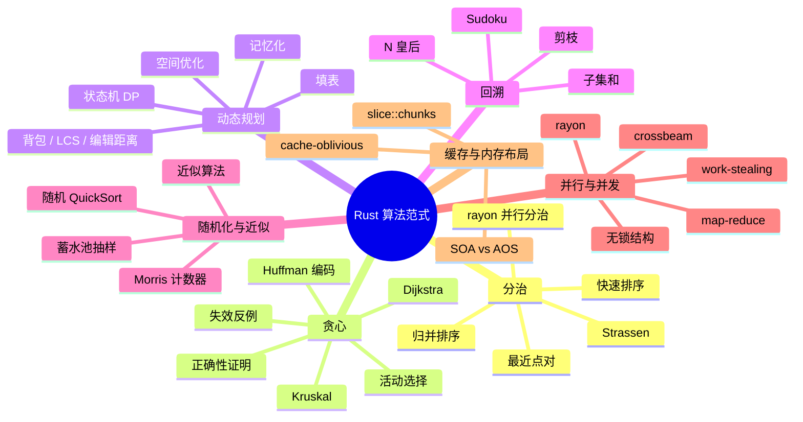

> **内容分级**: [专家级]
> **代码状态**: ✅ 含可编译示例
>
# Rust 算法范式 catalog

> **EN**: Algorithmic Paradigms in Rust
> **Summary**: A catalog of classical algorithmic paradigms mapped to Rust idioms: divide-and-conquer, greedy, dynamic programming, backtracking, branch-and-bound, randomized, approximation, parallel, streaming, and cache-oblivious algorithms.

> **Rust 版本**: 1.97.0+ (Edition 2024)
> **Bloom 层级**: L3-L5
> **权威来源**: 本文件为 `concept/` 权威页。
> **A/S/P 标记**: **S+P** — Structure + Procedure
> **定位**: 补全 Rust 算法知识体系的范式层（paradigm layer）：把 CLRS、Kleinberg & Tardos、Knuth 中的通用算法思想翻译为 Rust 的所有权、借用、迭代器、并发与内存布局惯用法。
> **前置概念**:
> [算法模式概述](00_algorithm_patterns_overview.md) ·
> [设计模式](../03_design_patterns/01_patterns.md) ·
> [惯用法谱系](../03_design_patterns/02_idioms_spectrum.md) ·
> [迭代器模式](../../02_intermediate/07_iterators_and_closures/01_iterator_patterns.md) ·
> [原子操作与内存序](../../03_advanced/00_concurrency/06_atomics_and_memory_ordering.md) ·
> [并行分布式模式谱系](../../03_advanced/00_concurrency/08_parallel_distributed_pattern_spectrum.md) ·
> [算法与复杂度惯用法](../10_performance/03_algorithms_and_complexity_idioms.md)
> **后置概念**:
> [并行算法](../11_domain_applications/25_parallel_algorithms.md) ·
> [算法工程实践](../11_domain_applications/08_algorithm_engineering_practice.md) ·
> [c08_algorithms crate docs](../../../crates/c08_algorithms/docs/README.md)
> **L5 对比**: [Rust vs C++](../../05_comparative/01_systems_languages/01_rust_vs_cpp.md)

---

> **来源 / Provenance**:
> [Cormen, Leiserson, Rivest & Stein — *Introduction to Algorithms*, 4th ed.](https://mitpress.mit.edu/9780262046305/introduction-to-algorithms/) ·
> [Kleinberg & Tardos — *Algorithm Design*](https://www.cs.princeton.edu/~wayne/kleinberg-tardos/) ·
> [Knuth — *The Art of Computer Programming*](https://www-cs-faculty.stanford.edu/~knuth/taocp.html) ·
> [Sedgewick & Wayne — *Algorithms*, 4th ed.](https://algs4.cs.princeton.edu/home/) ·
> [Rayon docs](https://docs.rs/rayon/latest/rayon/) ·
> [crossbeam docs](https://docs.rs/crossbeam/latest/crossbeam/) ·
> [The Rust Performance Book](https://nnethercote.github.io/perf-book/) ·
> [cs.StackExchange](https://cs.stackexchange.com/) ·
> [arXiv cs.DS](https://arxiv.org/list/cs.DS/recent) ·
> [ACM Digital Library](https://dl.acm.org/)

---

## 📑 目录

- [Rust 算法范式 catalog](#rust-算法范式-catalog)
  - [一、算法范式总览与复杂度视角](#一算法范式总览与复杂度视角)
  - [二、分治与递归](#二分治与递归)
  - [三、贪心算法](#三贪心算法)
  - [四、动态规划](#四动态规划)
  - [五、回溯与分支限界](#五回溯与分支限界)
  - [六、随机化与近似算法](#六随机化与近似算法)
  - [七、并行与并发算法](#七并行与并发算法)
  - [八、缓存友好与内存布局](#八缓存友好与内存布局)
  - [九、Rust 实现惯用法](#九rust-实现惯用法)
  - [十、思维导图](#十思维导图)
  - [十一、多维对比矩阵](#十一多维对比矩阵)
  - [十二、反例](#十二反例)
  - [十三、国际权威来源](#十三国际权威来源)
  - [十四、测验](#十四测验)

---

## 一、算法范式总览与复杂度视角

### 1.1 Paradigm vs Pattern vs Idiom

在 Rust 知识体系中，三个术语分层如下：

| 术语 | 抽象层级 | 关注点 | 示例 |
|:---|:---|:---|:---|
| **Paradigm（范式）** | 算法思想层 | 解决问题的通用策略 | 分治、贪心、动态规划 |
| **Pattern（模式）** | 软件设计层 | 可复用的结构设计 | 迭代器模式、策略模式、访问者模式 |
| **Idiom（惯用法）** | 语言表达层 | 地道、简洁、安全的 Rust 写法 | `split_at_mut`、`Cow`、`?` 传播 |

> **来源**: [CLRS 2022](https://mitpress.mit.edu/9780262046305/introduction-to-algorithms/) · [Rust Design Patterns](https://rust-unofficial.github.io/patterns/)

**范式**回答“怎么想”；**模式**回答“怎么组织代码”；**惯用法**回答“怎么用 Rust 写出地道实现”。例如，归并排序的“分治”是范式；用 `split_at_mut` 保证子切片不重叠是惯用法；把排序算法封装为 `Sorter` trait 是模式。

### 1.2 复杂度视角

分析算法时必须区分三种复杂度承诺：

| 类型 | 含义 | 典型场景 |
|:---|:---|:---|
| **最坏情况（Worst-case）** | 所有输入上的上界 | 实时系统、安全关键系统 |
| **期望情况（Expected）** | 随机输入/随机算法上的平均 | 快速排序随机 pivot、哈希表 |
| **摊还情况（Amortized）** | 操作序列的长期平均 | `Vec::push`、`Vec::pop`、并查集按秩合并 |

Rust 标准库中的 `BinaryHeap` 提供摊还 `O(log n)` 的 `push`/`pop`；`HashMap` 在默认 hasher 下提供期望 `O(1)` 查询；`BTreeMap` 提供最坏 `O(log n)` 查询。选型时应根据系统对延迟波动的容忍度决定。

```rust
use std::collections::BinaryHeap;

fn amortized_heap_ops(nums: &[i32]) -> i32 {
    let mut heap = BinaryHeap::with_capacity(nums.len());
    for &n in nums {
        heap.push(n); // 摊还 O(log n)
    }
    heap.pop().unwrap_or(0) // O(log n)
}
```

---

## 二、分治与递归

### 2.1 归并排序（Merge Sort）

归并排序的核心分治步骤在 Rust 中通过 `split_at_mut` 表达，编译器可证明两个子切片不重叠。

```rust
fn merge_sort<T: Ord + Copy>(arr: &mut [T]) {
    if arr.len() <= 1 {
        return;
    }
    let mid = arr.len() / 2;
    let (left, right) = arr.split_at_mut(mid);
    merge_sort(left);
    merge_sort(right);
    merge_in_place(left, right);
}

fn merge_in_place<T: Ord + Copy>(left: &mut [T], right: &mut [T]) {
    let mut merged: Vec<T> = Vec::with_capacity(left.len() + right.len());
    let (mut i, mut j) = (0, 0);
    while i < left.len() && j < right.len() {
        if left[i] <= right[j] {
            merged.push(left[i]);
            i += 1;
        } else {
            merged.push(right[j]);
            j += 1;
        }
    }
    merged.extend_from_slice(&left[i..]);
    merged.extend_from_slice(&right[j..]);
    left.copy_from_slice(&merged[..left.len()]);
    right.copy_from_slice(&merged[left.len()..]);
}
```

### 2.2 快速排序（Quick Sort）

快速排序的分区步骤常需要原地交换。Rust 标准库未暴露原地分区函数，但可通过 `unsafe` 或索引循环实现。

```rust
fn quick_sort<T: Ord>(arr: &mut [T]) {
    if arr.len() <= 1 {
        return;
    }
    let pivot_index = partition(arr);
    let (left, right) = arr.split_at_mut(pivot_index);
    quick_sort(left);
    quick_sort(&mut right[1..]);
}

fn partition<T: Ord>(arr: &mut [T]) -> usize {
    let hi = arr.len() - 1;
    let mut i = 0;
    for j in 0..hi {
        if arr[j] <= arr[hi] {
            arr.swap(i, j);
            i += 1;
        }
    }
    arr.swap(i, hi);
    i
}
```

### 2.3 最近点对（Closest Pair）与 Strassen

最近点对和 Strassen 矩阵乘法是分治的进阶应用。Rust 实现时应注意：

- 使用 `&[(f64, f64)]` 作为输入，避免复制大量坐标点。
- 对递归深度敏感的问题（如 closest pair 的 `O(n log n)` 解），可改用迭代 + 显式栈，避免栈溢出。

### 2.4 `rayon` 并行分治

```rust,ignore
// Cargo.toml: rayon = "1"
use rayon::prelude::*;

fn parallel_sum(nums: &[i64]) -> i64 {
    nums.par_iter().sum()
}
```

> 注意：实际并行分治需要任务粒度阈值，否则调度开销会抵消收益。详见 [并行算法](../11_domain_applications/25_parallel_algorithms.md)；图算法的并行 frontier 扩展见 [`图算法 Rust 实现`](03_graph_algorithms_in_rust.md)。

---

## 三、贪心算法

### 3.1 活动选择（Activity Selection）

按结束时间排序后单次扫描即可得到最优解。

```rust
fn activity_selection(mut activities: Vec<(usize, usize)>) -> Vec<(usize, usize)> {
    activities.sort_by_key(|&(_, end)| end);
    let mut selected = Vec::new();
    let mut last_end = 0usize;
    for (start, end) in activities {
        if start >= last_end {
            selected.push((start, end));
            last_end = end;
        }
    }
    selected
}
```

### 3.2 Huffman 编码（使用 `BinaryHeap`）

```rust
use std::collections::BinaryHeap;
use std::cmp::Ordering;

#[derive(Eq, PartialEq)]
struct Node {
    freq: usize,
    // 实际实现需保存左右子节点
}

impl Ord for Node {
    fn cmp(&self, other: &Self) -> Ordering {
        other.freq.cmp(&self.freq) // 最小堆
    }
}

impl PartialOrd for Node {
    fn partial_cmp(&self, other: &Self) -> Option<Ordering> {
        Some(self.cmp(other))
    }
}

fn huffman_init(frequencies: &[(u8, usize)]) -> BinaryHeap<Node> {
    let mut heap: BinaryHeap<Node> = BinaryHeap::new();
    for &(_, f) in frequencies {
        heap.push(Node { freq: f });
    }
    heap
}
```

### 3.3 Dijkstra 与 Kruskal

Dijkstra 和 Kruskal 都是贪心正确性的经典案例。Rust 实现要点：

- Dijkstra 使用 `BinaryHeap<Reverse<(Cost, Node)>>` 作为优先队列。
- Kruskal 使用并查集（Union-Find）按秩合并。

> 完整的图算法 Rust 实现（含 BFS/DFS、Dijkstra、Bellman-Ford、并行 frontier 与借用纪律）见 [`图算法 Rust 实现`](03_graph_algorithms_in_rust.md)；并查集、线段树、Fenwick 树的所有权感知实现见 [`所有权感知的数据结构`](02_ownership_aware_data_structures.md)。

```rust
use std::cmp::Reverse;
use std::collections::BinaryHeap;

fn dijkstra(adj: &[Vec<(usize, u64)>], start: usize) -> Vec<u64> {
    let n = adj.len();
    let mut dist = vec![u64::MAX; n];
    let mut heap: BinaryHeap<Reverse<(u64, usize)>> = BinaryHeap::new();
    dist[start] = 0;
    heap.push(Reverse((0, start)));

    while let Some(Reverse((d, u))) = heap.pop() {
        if d > dist[u] {
            continue;
        }
        for &(v, w) in &adj[u] {
            let nd = d + w;
            if nd < dist[v] {
                dist[v] = nd;
                heap.push(Reverse((nd, v)));
            }
        }
    }
    dist
}
```

### 3.4 正确性证明与反例

**正确性证明框架**（CLRS 标准模板）：

1. **贪心选择性质**：存在一个最优解包含当前贪心选择。
2. **最优子结构**：做出贪心选择后，剩余子问题仍需最优解。

**贪心失效案例**：0/1 背包问题不能直接用单位价值贪心；需要动态规划。集合覆盖问题贪心给出 `O(log n)` 近似，但一般不存在多项式时间精确解（除非 P=NP）。

---

## 四、动态规划

### 4.1 自顶向下记忆化（Top-Down Memoization）

使用 `std::collections::HashMap` 或固定大小数组缓存结果。

```rust
use std::collections::HashMap;

fn fib_memo(n: usize, memo: &mut HashMap<usize, u64>) -> u64 {
    if n <= 1 {
        return n as u64;
    }
    if let Some(&v) = memo.get(&n) {
        return v;
    }
    let v = fib_memo(n - 1, memo) + fib_memo(n - 2, memo);
    memo.insert(n, v);
    v
}
```

### 4.2 自底向上填表（Bottom-Up Tabulation）

```rust
fn fib_tab(n: usize) -> u64 {
    if n == 0 {
        return 0;
    }
    let mut dp = vec![0u64; n + 1];
    dp[1] = 1;
    for i in 2..=n {
        dp[i] = dp[i - 1] + dp[i - 2];
    }
    dp[n]
}
```

### 4.3 空间优化

斐波那契只需保留前两维：

```rust
fn fib_space_optimized(n: usize) -> u64 {
    if n == 0 {
        return 0;
    }
    let (mut prev, mut curr) = (0u64, 1u64);
    for _ in 1..n {
        (prev, curr) = (curr, prev + curr);
    }
    curr
}
```

### 4.4 0/1 背包

```rust
fn knapsack_01(weights: &[usize], values: &[usize], capacity: usize) -> usize {
    let n = weights.len();
    let mut dp = vec![0; capacity + 1];
    for i in 0..n {
        for w in (weights[i]..=capacity).rev() {
            dp[w] = dp[w].max(dp[w - weights[i]] + values[i]);
        }
    }
    dp[capacity]
}
```

### 4.5 最长公共子序列（LCS）

```rust
fn lcs(a: &str, b: &str) -> usize {
    let (a, b) = (a.as_bytes(), b.as_bytes());
    let mut prev = vec![0usize; b.len() + 1];
    let mut curr = vec![0usize; b.len() + 1];

    for i in 1..=a.len() {
        for j in 1..=b.len() {
            curr[j] = if a[i - 1] == b[j - 1] {
                prev[j - 1] + 1
            } else {
                curr[j - 1].max(prev[j])
            };
        }
        std::mem::swap(&mut prev, &mut curr);
    }
    prev[b.len()]
}
```

### 4.6 编辑距离（Edit Distance）

```rust
fn edit_distance(a: &str, b: &str) -> usize {
    let (a, b) = (a.as_bytes(), b.as_bytes());
    let mut dp = (0..=b.len()).collect::<Vec<_>>();

    for i in 1..=a.len() {
        let mut prev = dp[0];
        dp[0] = i;
        for j in 1..=b.len() {
            let temp = dp[j];
            dp[j] = if a[i - 1] == b[j - 1] {
                prev
            } else {
                1 + dp[j].min(dp[j - 1]).min(prev)
            };
            prev = temp;
        }
    }
    dp[b.len()]
}
```

### 4.7 状态机 DP

字符串模式匹配、正则表达式、股票买卖等问题可建模为状态机 DP。

```rust
fn max_profit_two_transactions(prices: &[i32]) -> i32 {
    let (mut buy1, mut sell1, mut buy2, mut sell2) =
        (i32::MIN, 0, i32::MIN, 0);
    for &p in prices {
        buy1 = buy1.max(-p);
        sell1 = sell1.max(buy1 + p);
        buy2 = buy2.max(sell1 - p);
        sell2 = sell2.max(buy2 + p);
    }
    sell2
}
```

---

## 五、回溯与分支限界

### 5.1 N 皇后问题

```rust
fn solve_n_queens(n: usize) -> Vec<Vec<String>> {
    let mut board = vec![vec!['.'; n]; n];
    let mut result = Vec::new();
    backtrack(&mut board, 0, &mut result);
    result
}

fn backtrack(board: &mut Vec<Vec<char>>, row: usize, result: &mut Vec<Vec<String>>) {
    if row == board.len() {
        result.push(board.iter().map(|r| r.iter().collect()).collect());
        return;
    }
    for col in 0..board.len() {
        if is_safe(board, row, col) {
            board[row][col] = 'Q';
            backtrack(board, row + 1, result);
            board[row][col] = '.';
        }
    }
}

fn is_safe(board: &[Vec<char>], row: usize, col: usize) -> bool {
    for i in 0..row {
        if board[i][col] == 'Q' {
            return false;
        }
        let d = row - i;
        if col >= d && board[i][col - d] == 'Q' {
            return false;
        }
        if col + d < board.len() && board[i][col + d] == 'Q' {
            return false;
        }
    }
    true
}
```

### 5.2 子集和与 Sudoku

回溯的核心是**状态恢复**。Rust 中通常用可变引用原地修改，递归返回后撤销修改，避免频繁分配。

### 5.3 剪枝策略

| 策略 | 说明 | Rust 表达 |
|:---|:---|:---|
| **可行性剪枝** | 当前部分解已不可能满足约束 | `if !feasible(state) { return; }` |
| **界限剪枝** | 当前分支最优值不可能超越全局最优 | `if upper_bound <= best { return; }` |
| **对称剪枝** | 排除等价排列 | 按字典序生成 |

---

## 六、随机化与近似算法

### 6.1 随机化 QuickSort

```rust
use rand::Rng;

fn randomized_partition<T: Ord>(arr: &mut [T]) -> usize {
    let hi = arr.len() - 1;
    let pivot = rand::thread_rng().gen_range(0..=hi);
    arr.swap(pivot, hi);
    let mut i = 0;
    for j in 0..hi {
        if arr[j] <= arr[hi] {
            arr.swap(i, j);
            i += 1;
        }
    }
    arr.swap(i, hi);
    i
}
```

> 依赖外部 crate `rand`。示例为示意代码，生产环境应使用 `rand::seq::SliceRandom::shuffle` 或 `select_nth_unstable`。

### 6.2 蓄水池抽样（Reservoir Sampling）

```rust
use rand::Rng;

fn reservoir_sample<T: Clone>(stream: &[T], k: usize) -> Vec<T> {
    let mut rng = rand::thread_rng();
    let mut reservoir = stream.iter().take(k).cloned().collect::<Vec<_>>();
    for (i, item) in stream.iter().enumerate().skip(k) {
        let j = rng.gen_range(0..=i);
        if j < k {
            reservoir[j] = item.clone();
        }
    }
    reservoir
}
```

### 6.3 Morris 计数器与流算法

流算法（streaming algorithm）处理无法全部载入内存的数据。Morris 计数器用概率计数节省空间。

```rust,ignore
// Cargo.toml: fastrand = "2"
struct MorrisCounter {
    exponent: u8,
}

impl MorrisCounter {
    fn new() -> Self {
        Self { exponent: 0 }
    }

    fn increment(&mut self) {
        // 以概率 1/2^exponent 增加 exponent
        if fastrand::u32(..) < (1u32 << self.exponent) {
            self.exponent = self.exponent.saturating_add(1);
        }
    }

    fn estimate(&self) -> u64 {
        (1u64 << self.exponent).saturating_sub(1)
    }
}
```

> 依赖外部 crate `fastrand`；生产环境可考虑用 `rand::thread_rng` 或 `rand::Rng` 替代。

### 6.4 近似算法

- **顶点覆盖**：2-近似可用最大匹配。
- **集合覆盖**：贪心给出 `H_n` 近似。
- **MAX-CUT**：随机分配达到 0.5 近似。

---

## 七、并行与并发算法

### 7.1 `rayon` 数据并行

```rust,ignore
// Cargo.toml: rayon = "1"
use rayon::prelude::*;

fn parallel_prefix_sum(nums: &[i64]) -> Vec<i64> {
    nums.par_iter().scan(0, |acc, &x| {
        *acc += x;
        Some(*acc)
    }).collect()
}
```

> 注意：标准 `scan` 是顺序的；真正并行前缀和需使用分治或 `rayon::iter` 扩展 crate。上述代码仅展示并行迭代入口。

### 7.2 `crossbeam` 与 work-stealing

```rust,ignore
// Cargo.toml: crossbeam = "0.8"
use crossbeam::scope;

fn scoped_parallel_sum(nums: &[i64]) -> i64 {
    let mut result = 0i64;
    scope(|s| {
        s.spawn(|_| {
            result += nums.iter().sum::<i64>();
        });
    }).unwrap();
    result
}
```

> 注意：多个线程直接对 `result` 做 `+=` 是数据竞争。实际应使用原子类型或 `rayon::sum`。

### 7.3 无锁数据结构

无锁栈、队列、跳表在 Rust 中通常依赖 `AtomicPtr` 与 `std::sync::atomic` 的内存序。详细内容见 [无锁编程与内存模型](../../03_advanced/00_concurrency/07_lock_free.md)。

### 7.4 Map-Reduce 模式

```rust,ignore
// Cargo.toml: rayon = "1"
use rayon::prelude::*;

fn word_count(lines: &[String]) -> std::collections::HashMap<String, usize> {
    lines
        .par_iter()
        .map(|line| {
            let mut local = std::collections::HashMap::new();
            for word in line.split_whitespace() {
                *local.entry(word.to_lowercase()).or_insert(0) += 1;
            }
            local
        })
        .reduce(
            std::collections::HashMap::new,
            |mut a, b| {
                for (k, v) in b {
                    *a.entry(k).or_insert(0) += v;
                }
                a
            },
        )
}
```

---

## 八、缓存友好与内存布局

> 完整的缓存友好与 SIMD 算法 Rust 实现见 [`缓存友好与 SIMD 算法`](04_cache_friendly_and_simd_algorithms.md)。

### 8.1 缓存未命中成本

CPU 缓存层次决定了算法实际运行速度。常见优化方向：

- 提高**空间局部性**：顺序访问数组。
- 提高**时间局部性**：复用刚访问的数据。
- 避免**伪共享（false sharing）**：多线程中让不同线程写入不同缓存行。

### 8.2 SOA vs AOS

```rust
// AOS: Array of Structs
struct ParticleAos {
    x: f32,
    y: f32,
    z: f32,
}

// SOA: Struct of Arrays
struct ParticleSoa {
    x: Vec<f32>,
    y: Vec<f32>,
    z: Vec<f32>,
}

fn update_soa(p: &mut ParticleSoa) {
    for x in &mut p.x {
        *x += 1.0;
    }
}
```

当算法只访问结构体的一个字段时，SOA 大幅提升缓存效率。

### 8.3 `slice::chunks` 与分块处理

```rust
fn chunked_sum(nums: &[i64], chunk_size: usize) -> i64 {
    nums.chunks(chunk_size)
        .map(|chunk| chunk.iter().sum::<i64>())
        .sum()
}
```

### 8.4 Cache-Oblivious 算法

Cache-oblivious 算法（如 Funnel Sort、Cache-Oblivious B-Tree）不依赖具体缓存行大小，对任意层次缓存均渐进最优。Rust 实现时通常结合 `Vec` 顺序存储与分块递归。

---

## 九、Rust 实现惯用法

### 9.1 `BinaryHeap` 作为优先队列

最小堆通过 `Reverse<T>` 包装实现。

```rust
use std::cmp::Reverse;
use std::collections::BinaryHeap;

fn min_heap_example(nums: &[i32]) -> Option<i32> {
    let mut heap: BinaryHeap<Reverse<i32>> = nums.iter().map(|&n| Reverse(n)).collect();
    heap.pop().map(|Reverse(n)| n)
}
```

### 9.2 `Vec` 作为 DP 表

`vec![0; n + 1]` 是 DP 表最常用的表达方式。注意二维 DP 可考虑扁平化为一维 `Vec` 以提升缓存效率。

### 9.3 Memoize 闭包

使用 `std::collections::HashMap` 配合递归闭包可实现记忆化。

```rust
use std::collections::HashMap;

fn make_fib_memo() -> impl FnMut(usize) -> u64 {
    let mut memo = HashMap::new();
    memo.insert(0, 0u64);
    memo.insert(1, 1u64);

    move |n: usize| {
        for i in 2..=n {
            if !memo.contains_key(&i) {
                let v = memo[&(i - 1)] + memo[&(i - 2)];
                memo.insert(i, v);
            }
        }
        memo[&n]
    }
}
```

### 9.4 `Iterator` 适配器

```rust
fn sum_of_squares_of_evens(nums: &[i32]) -> i32 {
    nums.iter()
        .filter(|&&n| n % 2 == 0)
        .map(|&n| n * n)
        .sum()
}
```

### 9.5 `const fn` 编译期计算

```rust
const fn factorial_const(n: u64) -> u64 {
    let mut result = 1u64;
    let mut i = 2u64;
    while i <= n {
        result *= i;
        i += 1;
    }
    result
}

const FACT_10: u64 = factorial_const(10);
```

### 9.6 `unsafe` 原地分区

当性能关键且借用检查器无法表达原地分区时，可用 `unsafe` 操作原始指针。必须保证指针合法、不重叠、不越界。

```rust
unsafe fn partition_unsafe<T: Ord>(arr: &mut [T]) -> usize {
    let len = arr.len();
    if len == 0 {
        return 0;
    }
    let pivot = len - 1;
    let base = arr.as_mut_ptr();
    let mut i = 0;
    for j in 0..pivot {
        let j_le = unsafe { &*base.add(j) <= &*base.add(pivot) };
        if j_le {
            unsafe { std::ptr::swap(base.add(i), base.add(j)); }
            i += 1;
        }
    }
    unsafe { std::ptr::swap(base.add(i), base.add(pivot)); }
    i
}
```

> 使用 `unsafe` 必须提供 `SAFETY` 注释，并优先用 `std::hint::unreachable_unchecked` 等标准工具表达假设。

---

## 十、思维导图



---

## 十一、多维对比矩阵

| 范式 | 典型问题类 | Rust crate / 惯用法 | 时间复杂度 | 空间复杂度 |
|:---|:---|:---|:---|:---|
| 分治 | 排序、最近点对、矩阵乘法 | `split_at_mut`, `rayon::join` | `O(n log n)` ~ `O(n^2.807)` | `O(log n)` ~ `O(n^2)` |
| 贪心 | 区间调度、最小生成树、单源最短路 | `BinaryHeap`, 并查集 | `O(n log n)` ~ `O(E log V)` | `O(n)` |
| 动态规划 | 背包、LCS、编辑距离、股票买卖 | `Vec` DP 表，滚动数组 | `O(n^2)` ~ `O(2^n)` 状态压缩 | `O(n^2)` ~ `O(n)` |
| 回溯 | 组合搜索、约束满足 | 可变引用 + 状态恢复 | 指数级 | 递归栈深度 |
| 分支限界 | 旅行商、整数规划 | 优先队列 + 上界剪枝 | 最坏指数，实际大幅剪枝 | 队列/栈大小 |
| 随机化 | QuickSort、蓄水池抽样、Monte Carlo | `rand`, `fastrand` | 期望多项式 | `O(1)` ~ `O(k)` |
| 近似 | 集合覆盖、MAX-CUT、顶点覆盖 | 贪心 + 随机舍入 | 多项式 | 多项式 |
| 并行 | 前缀和、归约、图算法 | `rayon`, `crossbeam` | `O(n/p + log p)` | 取决于调度 |
| 流算法 | 频率估计、基数估计、TOP-K | Morris counter, Count-Min Sketch | `O(1)` 每元素 | `O(log log n)` ~ `O(1/ε)` |
| cache-oblivious | 外部排序、B-Tree、矩阵转置 | `Vec` 顺序存储 + 分块 | 渐进最优 I/O | 顺序存储 |

---

## 十二、反例

### 12.1 递归无尾调用优化

Rust 编译器**不保证**尾调用优化（TCO）。深度递归会导致栈溢出。

```rust
// 危险：大 n 会栈溢出
fn factorial_stack(n: u64) -> u64 {
    if n == 0 { 1 } else { n * factorial_stack(n - 1) }
}

// 安全：使用迭代器
fn factorial_iter(n: u64) -> u64 {
    (1..=n).product()
}
```

### 12.2 DP 中克隆大向量

```rust
// 低效：每一层都分配新 Vec
fn lcs_clone(a: &str, b: &str) -> usize {
    let mut dp = vec![0; b.len() + 1];
    for ca in a.chars() {
        let mut new = vec![0; b.len() + 1];
        for (j, cb) in b.chars().enumerate() {
            new[j + 1] = if ca == cb { dp[j] + 1 } else { new[j].max(dp[j + 1]) };
        }
        dp = new;
    }
    dp[b.len()]
}

// 高效：滚动数组原地更新
fn lcs_rolling(a: &str, b: &str) -> usize {
    let (a, b) = (a.as_bytes(), b.as_bytes());
    let mut prev = vec![0; b.len() + 1];
    let mut curr = vec![0; b.len() + 1];
    for i in 1..=a.len() {
        for j in 1..=b.len() {
            curr[j] = if a[i - 1] == b[j - 1] {
                prev[j - 1] + 1
            } else {
                curr[j - 1].max(prev[j])
            };
        }
        std::mem::swap(&mut prev, &mut curr);
    }
    prev[b.len()]
}
```

### 12.3 忽略缓存局部性

```rust
// 缓存不友好：列优先访问
fn sum_columns_bad(matrix: &[Vec<i64>]) -> Vec<i64> {
    let n = matrix.len();
    let mut sums = vec![0; n];
    for col in 0..n {
        for row in 0..n {
            sums[col] += matrix[row][col];
        }
    }
    sums
}

// 缓存友好：行优先访问
fn sum_columns_good(matrix: &[Vec<i64>]) -> Vec<i64> {
    let n = matrix.len();
    let mut sums = vec![0; n];
    for row in 0..n {
        for col in 0..n {
            sums[col] += matrix[row][col];
        }
    }
    sums
}
```

### 12.4 过早并行化

```rust,ignore
// 反例：任务粒度太细，调度开销 > 计算收益
use rayon::prelude::*;

fn slow_small_work(nums: &[i64]) -> Vec<i64> {
    nums.par_iter()
        .map(|x| x + 1) // 过于简单
        .collect()
}
```

正确做法：先测量，确认 CPU 密集型且数据量大，再引入 `rayon`。

---

## 十三、国际权威来源

- **CLRS** — Cormen, Leiserson, Rivest & Stein, *Introduction to Algorithms*, 4th ed. MIT Press, 2022. 分治、贪心、动态规划、摊还分析、并行算法的标准教材。
- **Kleinberg & Tardos** — *Algorithm Design*. Pearson, 2005. 贪心与 DP 的“交换论证”与“最优子结构”框架。
- **Knuth** — *The Art of Computer Programming*, Vol. 1–4A. Addison-Wesley. 算法的历史渊源与精确分析。
- **Sedgewick & Wayne** — *Algorithms*, 4th ed. Addison-Wesley, 2011. 实现导向的算法教学。
- **Rust `rayon`** — [docs.rs/rayon](https://docs.rs/rayon/latest/rayon/). 数据并行与工作窃取调度。
- **Rust Performance Book** — [nnethercote.github.io/perf-book](https://nnethercote.github.io/perf-book/). 测量、缓存、SIMD、分配优化。
- **cs.StackExchange** — [cs.stackexchange.com](https://cs.stackexchange.com/). 算法正确性与复杂度分析的社区验证。
- **arXiv cs.DS / cs.DC** — [arxiv.org](https://arxiv.org/). 流算法、cache-oblivious 算法、并行算法的最新研究。
- **ACM / IEEE** — [dl.acm.org](https://dl.acm.org/) / [ieeexplore.ieee.org](https://ieeexplore.ieee.org/). 算法理论与系统实现会议论文（SODA、STOC、SPAA、PODC 等）。

---

## 十四、测验

### 测验 1：归并排序中的 `split_at_mut`

**问题**：为什么 Rust 的归并排序常用 `split_at_mut` 而不是直接按索引切片？

**答案**：`split_at_mut` 在编译期保证返回的两个可变引用不重叠，满足借用检查器的排他性要求，无需引入 `unsafe`。

### 测验 2：贪心正确性的两个核心性质

**问题**：证明贪心算法最优通常需要哪两个性质？

**答案**：贪心选择性质（存在包含当前贪心选择的最优解）和最优子结构（做出选择后子问题仍需最优解）。

### 测验 3：0/1 背包能否用贪心

**问题**：0/1 背包问题按“单位重量价值”贪心是否总能得到最优解？

**答案**：不能。反例：容量 50，物品 (重量, 价值) = [(10, 60), (20, 100), (30, 120)]；按单位价值贪心选 1+2 得 160，最优 2+3 得 220。需用动态规划。

### 测验 4：DP 空间优化原则

**问题**：斐波那契 DP 表 `dp[i]` 只依赖 `dp[i-1]` 和 `dp[i-2]`，如何优化空间？

**答案**：只保留两个变量 `prev` 和 `curr`，滚动更新，空间从 `O(n)` 降为 `O(1)`。

### 测验 5：过早并行化的风险

**问题**：在 `rayon` 中对每个元素做极简单操作时可能产生什么问题？

**答案**：任务调度与线程同步开销可能超过计算收益，导致性能下降。应确保任务粒度足够大、CPU 密集度足够高。

---

## P0 官方来源（P0 Official Rust Authority Sources）

- [Rust `Iterator` trait — doc.rust-lang.org](https://doc.rust-lang.org/std/iter/trait.Iterator.html)
- [Rust Collections — doc.rust-lang.org](https://doc.rust-lang.org/std/collections/index.html)
- [Rust primitive slice — doc.rust-lang.org](https://doc.rust-lang.org/std/primitive.slice.html)
