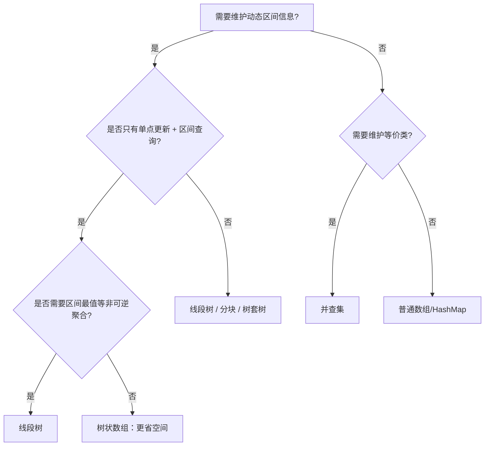

> **内容分级**: [专家级]
> **本节关键术语**: 并查集 (Union-Find) · 线段树 (Segment Tree) · 树状数组 (Fenwick Tree / BIT) · 路径压缩 · 按秩合并 · 原地构建 · 索引化数据结构 — [完整对照表](../../00_meta/01_terminology/01_terminology_glossary.md)

# 所有权感知的数据结构实现

**EN**: Ownership-Aware Data Structure Implementations in Rust
**Summary**: Idiomatic Rust implementations of union-find, segment tree, and Fenwick tree that leverage ownership, borrowing, and index-based layout for zero-copy updates and cache-friendly access.

> **Rust 版本**: 1.97.0+ (Edition 2024)
> **Bloom 层级**: L5-L6
> **权威来源**: 本文件为 `concept/` 权威页。
> **A/S/P 标记**: **S+P** — Structure + Procedure
> **定位**: 将经典索引型数据结构翻译为 Rust 所有权模型下的工程实现，强调零拷贝更新、借用安全、`Vec` 连续存储与 `unsafe` 最小化。
> **前置概念**: [Ownership](../../01_foundation/01_ownership_borrow_lifetime/01_ownership.md) · [Borrowing](../../01_foundation/01_ownership_borrow_lifetime/02_borrowing.md) · [所有权感知算法](../11_domain_applications/27_ownership_aware_algorithms.md) · [算法模式概述](00_algorithm_patterns_overview.md)
> **后置概念**: [图算法 Rust 实现](03_graph_algorithms_in_rust.md) · [缓存友好与 SIMD 算法](04_cache_friendly_and_simd_algorithms.md) · [c08_algorithms crate docs](../../../crates/c08_algorithms/docs/README.md)
> **L5 对比**: [Rust vs C++](../../05_comparative/01_systems_languages/01_rust_vs_cpp.md)

---

> **来源 / Provenance**:
> [Cormen, Leiserson, Rivest & Stein — *Introduction to Algorithms*, 4th ed.](https://mitpress.mit.edu/9780262046305/introduction-to-algorithms/) ·
> [Sedgewick & Wayne — *Algorithms*, 4th ed.](https://algs4.cs.princeton.edu/home/) ·
> [The Rust Programming Language](https://doc.rust-lang.org/book/title-page.html) ·
> [Rust Reference](https://doc.rust-lang.org/reference/introduction.html) ·
> [The Rust Performance Book](https://nnethercote.github.io/perf-book/)

---

## 🧠 知识结构图

```mermaid
mindmap
  root((所有权感知的数据结构))
    并查集
      Vec<usize> parent
      路径压缩
      按秩合并
      摊还 O(α(n))
    线段树
      迭代堆式存储
      Vec<T> tree
      区间查询 / 单点更新
      无 Box 无递归
    树状数组
      Vec<T> bit
      lowbit 索引
      前缀和 / 区间和
      O(log n) 更新查询
    所有权要点
      输入 &[T] 构建
      &mut self 更新
      索引规避借用冲突
      连续内存 cache 友好
```

> **认知功能**: 本 mindmap 从三种核心索引数据结构出发，突出 Rust 实现中「`Vec` 连续存储 + 索引访问 + `&mut self` 更新」的共同模式，帮助读者把算法思想直接映射到所有权安全代码。

---

## 一、权威定义

**索引型数据结构（Index-Based Data Structure）** 是指用连续数组（通常是 `Vec<T>`）存储节点，并通过数组下标而非指针来表达父子、集合或区间关系的数据结构。在 Rust 中，这种表示天然符合借用检查器：所有节点共享同一块内存，但访问通过不重叠的索引完成，无需自引用或 `Rc<RefCell>`。

**所有权感知实现** 在此处的含义：

1. **构建时借用输入**：通过 `&[T]` 或 `impl IntoIterator<Item = T>` 构建结构，避免不必要的克隆。
2. **更新时独占 `&mut self`**：所有修改操作显式要求可变引用，调用方在编译期即可看到副作用。
3. **零拷贝查询**：区间查询、集合代表元查找等只读操作使用 `&self`。
4. **连续内存布局**：用 `Vec` 而非 `Box` 链表，提升缓存局部性并减少分配器压力。

> **来源**: [CLRS 2022](https://mitpress.mit.edu/9780262046305/introduction-to-algorithms/) · [Sedgewick & Wayne 2011](https://algs4.cs.princeton.edu/home/)

---

## 二、Rust 惯用法

### 2.1 并查集（Union-Find）

并查集维护不相交集合，支持 `find`（查代表元）与 `union`（合并集合）。Rust 实现用两个 `Vec<usize>` 分别存储父节点与秩，所有操作都是 `&mut self` 或 `&self`。

```rust
#[derive(Debug, Clone)]
struct UnionFind {
    parent: Vec<usize>,
    rank: Vec<u8>,
}

impl UnionFind {
    fn new(n: usize) -> Self {
        Self {
            parent: (0..n).collect(),
            rank: vec![0; n],
        }
    }

    // 只读查询：&self 即可
    fn find(&self, mut x: usize) -> usize {
        // 路径压缩（迭代版）：先找到根，再把路径上所有节点挂到根下
        let mut root = x;
        while self.parent[root] != root {
            root = self.parent[root];
        }
        while self.parent[x] != root {
            let next = self.parent[x];
            // 安全：x 与 next 都是有效索引，且我们只是修改 parent[x]
            // 但此处 self 是 &self，无法修改；下面展示 &mut self 版本
            x = next;
        }
        root
    }
}
```

上述代码展示了只读 `find` 的局限：路径压缩需要修改 `parent`。因此生产实现应提供 `find_mut` 并要求 `&mut self`：

```rust
#[derive(Debug, Clone)]
struct UnionFind {
    parent: Vec<usize>,
    rank: Vec<u8>,
}

impl UnionFind {
    fn new(n: usize) -> Self {
        Self {
            parent: (0..n).collect(),
            rank: vec![0; n],
        }
    }

    fn find(&mut self, mut x: usize) -> usize {
        let mut root = x;
        while self.parent[root] != root {
            root = self.parent[root];
        }
        // 第二次遍历完成路径压缩
        while self.parent[x] != root {
            let next = self.parent[x];
            self.parent[x] = root;
            x = next;
        }
        root
    }

    fn union(&mut self, a: usize, b: usize) -> bool {
        let ra = self.find(a);
        let rb = self.find(b);
        if ra == rb {
            return false;
        }
        // 按秩合并：把矮树挂到高树下
        match self.rank[ra].cmp(&self.rank[rb]) {
            std::cmp::Ordering::Less => self.parent[ra] = rb,
            std::cmp::Ordering::Greater => self.parent[rb] = ra,
            std::cmp::Ordering::Equal => {
                self.parent[rb] = ra;
                self.rank[ra] += 1;
            }
        }
        true
    }

    fn connected(&mut self, a: usize, b: usize) -> bool {
        self.find(a) == self.find(b)
    }
}

fn main() {
    let mut uf = UnionFind::new(5);
    uf.union(0, 1);
    uf.union(2, 3);
    assert!(uf.connected(0, 1));
    assert!(!uf.connected(1, 2));
    uf.union(1, 2);
    assert!(uf.connected(0, 3));
}
```

**所有权要点**：`find` 在概念上是只读，但路径压缩会修改结构。Rust 把这一副作用显式化：要么放弃路径压缩提供纯 `&self` 版本，要么接受 `&mut self` 并让用户承担语义成本。

### 2.2 线段树（Segment Tree）

线段树支持区间查询（如区间和、区间最值）与单点更新。Rust 中采用**迭代堆式存储**（iterative heap-style layout），大小为 `2 * n`（n 向上取整到 2 的幂），避免递归和 `Box` 指针。

```rust
use std::ops::Add;

#[derive(Debug, Clone)]
struct SegmentTree<T> {
    n: usize,
    tree: Vec<T>,
}

impl<T: Copy + Default + Add<Output = T>> SegmentTree<T> {
    fn from_slice(src: &[T]) -> Self {
        let n = src.len().next_power_of_two().max(1);
        let mut tree = vec![T::default(); 2 * n];
        // 叶节点放在 [n, n + src.len())
        tree[n..n + src.len()].copy_from_slice(src);
        for i in (1..n).rev() {
            tree[i] = tree[2 * i] + tree[2 * i + 1];
        }
        Self { n, tree }
    }

    // 单点更新：把位置 idx 设为 value
    fn update(&mut self, idx: usize, value: T) {
        assert!(idx < self.n, "index out of bounds");
        let mut i = self.n + idx;
        self.tree[i] = value;
        i /= 2;
        while i >= 1 {
            self.tree[i] = self.tree[2 * i] + self.tree[2 * i + 1];
            i /= 2;
        }
    }

    // 区间查询 [l, r)
    fn query(&self, mut l: usize, mut r: usize) -> T {
        assert!(l <= r && r <= self.n, "invalid range");
        let mut res_l = T::default();
        let mut res_r = T::default();
        l += self.n;
        r += self.n;
        while l < r {
            if l % 2 == 1 {
                res_l = res_l + self.tree[l];
                l += 1;
            }
            if r % 2 == 1 {
                r -= 1;
                res_r = self.tree[r] + res_r;
            }
            l /= 2;
            r /= 2;
        }
        res_l + res_r
    }
}

fn main() {
    let arr = vec![1, 3, 5, 7, 9, 11];
    let mut st = SegmentTree::from_slice(&arr);
    assert_eq!(st.query(1, 5), 3 + 5 + 7 + 9);
    st.update(2, 10);
    assert_eq!(st.query(1, 5), 3 + 10 + 7 + 9);
}
```

**所有权要点**：

- `from_slice` 接收 `&[T]` 并克隆到内部 `Vec`；对 `Copy` 类型这是唯一必要的拷贝。
- `update` 需要 `&mut self`，`query` 只需 `&self`；两者不能同时发生，由借用检查器保证。
- 无递归、无 `Box`，整棵树是一块连续内存。

### 2.3 树状数组（Fenwick Tree / BIT）

树状数组用 `lowbit` 维护前缀和，空间仅为 `n + 1`，更新与查询都是 `O(log n)`。

```rust
use std::ops::AddAssign;

#[derive(Debug, Clone)]
struct FenwickTree<T> {
    tree: Vec<T>,
}

impl<T: Copy + Default + AddAssign + std::ops::Sub<Output = T>> FenwickTree<T> {
    fn new(n: usize) -> Self {
        Self {
            tree: vec![T::default(); n + 1],
        }
    }

    fn from_slice(src: &[T]) -> Self {
        let mut bit = Self::new(src.len());
        for (i, &v) in src.iter().enumerate() {
            bit.add(i, v);
        }
        bit
    }

    // 在位置 idx 增加 delta（0-based）
    fn add(&mut self, idx: usize, delta: T) {
        let n = self.tree.len();
        let mut i = idx + 1;
        while i < n {
            self.tree[i] += delta;
            i += i & i.wrapping_neg();
        }
    }

    // 前缀和 [0, idx]
    fn prefix_sum(&self, idx: usize) -> T {
        let mut res = T::default();
        let mut i = idx + 1;
        while i > 0 {
            res += self.tree[i];
            i -= i & i.wrapping_neg();
        }
        res
    }

    // 区间和 [l, r]
    fn range_sum(&self, l: usize, r: usize) -> T {
        self.prefix_sum(r) - self.prefix_sum(l.saturating_sub(1))
    }
}

fn main() {
    let arr = vec![1i64, 2, 3, 4, 5];
    let mut bit = FenwickTree::from_slice(&arr);
    assert_eq!(bit.prefix_sum(2), 6);
    assert_eq!(bit.range_sum(1, 3), 2 + 3 + 4);
    bit.add(2, 5);
    assert_eq!(bit.prefix_sum(2), 11);
}
```

**所有权要点**：

- `tree` 长度固定为 `n + 1`，索引 0 留空，避免 `lowbit(0) = 0` 导致的死循环。
- `add` 与 `prefix_sum` 分别要求 `&mut self` 与 `&self`，副作用显式。
- 对可交换群（如整数加法）可直接做区间差分；对仅支持前缀聚合的半群，区间查询需要额外设计。

### 2.4 通用 trait 抽象

当数据结构需要支持多种聚合操作（和、最值、GCD 等），可用 trait 抽象 Monoid 语义：

```rust
trait Monoid: Copy {
    fn identity() -> Self;
    fn combine(self, other: Self) -> Self;
}

impl Monoid for i64 {
    fn identity() -> Self { 0 }
    fn combine(self, other: Self) -> Self { self + other }
}

#[derive(Debug, Clone)]
struct SegTreeGeneric<T: Monoid> {
    n: usize,
    tree: Vec<T>,
}

impl<T: Monoid + Default> SegTreeGeneric<T> {
    fn from_slice(src: &[T]) -> Self {
        let n = src.len().next_power_of_two().max(1);
        let mut tree = vec![T::identity(); 2 * n];
        tree[n..n + src.len()].copy_from_slice(src);
        for i in (1..n).rev() {
            tree[i] = tree[2 * i].combine(tree[2 * i + 1]);
        }
        Self { n, tree }
    }
}
```

> `Default` 与 `Monoid::identity` 在此示例中语义相同；实际项目中可只保留其一。

---

## 三、反例与边界

### 反例 1：并查集 `find` 误用 `&self`

```rust,compile_fail,E0596
#[derive(Debug)]
struct UnionFind { parent: Vec<usize> }

impl UnionFind {
    fn new(n: usize) -> Self { Self { parent: (0..n).collect() } }

    // 错误：路径压缩需要修改 parent，却声明为 &self
    fn find(&self, mut x: usize) -> usize {
        while self.parent[x] != x {
            self.parent[x] = self.parent[self.parent[x]]; // ❌ 不能通过 &self 修改
            x = self.parent[x];
        }
        x
    }
}
```

**修正**：把 `find` 改为 `&mut self`，或拆分出纯查询的 `find_immutable` 与带压缩的 `find_mut`。

### 反例 2：线段树越界访问

```rust,should_panic
#[derive(Debug, Clone)]
struct SegmentTree {
    n: usize,
    tree: Vec<i64>,
}

impl SegmentTree {
    fn new(n: usize) -> Self { Self { n, tree: vec![0; 2 * n] } }

    fn update(&mut self, idx: usize, value: i64) {
        // ❌ 错误：未检查 idx < n，且 n 若不是 2 的幂，树结构也会错
        let mut i = self.n + idx;
        self.tree[i] = value;
        while i > 1 {
            i /= 2;
            self.tree[i] = self.tree[2 * i] + self.tree[2 * i + 1];
        }
    }
}

fn main() {
    let mut st = SegmentTree::new(3); // n=3 不是 2 的幂，且 tree 只有 6 个元素
    st.update(5, 100); // 越界访问
}
```

**修正**：

1. 构建时将 `n` 取到下一个 2 的幂。
2. 所有公开方法在入口使用 `assert!(idx < self.n)`。
3. 查询区间使用半开区间 `[l, r)` 并验证 `l <= r`。

### 反例 3：Fenwick 树 `lowbit` 误用导致死循环

```rust
// 错误实现：lowbit 用 i & (-i) 但 i 是无符号类型
fn wrong_lowbit(i: usize) -> usize {
    i & (-(i as isize)) as usize // 有符号转换危险，且对 i=0 会死循环
}
```

**修正**：

```rust
fn lowbit(i: usize) -> usize {
    i & i.wrapping_neg()
}
```

同时永远不要让 `i = 0` 进入更新循环；Fenwick 树内部数组从索引 1 开始。

---

## 四、复杂度与选型

| 数据结构 | 操作 | 时间复杂度 | 空间复杂度 | Rust 特化收益 |
|:---|:---|:---:|:---:|:---|
| **并查集** | `find` / `union` | 摊还 `O(α(n))` | `O(n)` | `&mut self` 显式化副作用；路径压缩无需 `unsafe` |
| **线段树** | 单点更新 | `O(log n)` | `O(n)`（取 2 的幂） | 迭代堆式布局，连续内存，无 `Box` |
| **线段树** | 区间查询 | `O(log n)` | `O(n)` | `&self` 只读查询，借用安全 |
| **树状数组** | 单点增加 / 前缀和 | `O(log n)` | `O(n)` | 空间减半，`lowbit` 用 `wrapping_neg` 避免溢出 |
| **通用 Monoid 线段树** | 依赖 `combine` | `O(log n)` | `O(n)` | trait 抽象聚合语义，类型安全 |

**选型决策树**：



---

## 五、权威来源索引

- **P0 官方**: [The Rust Programming Language](https://doc.rust-lang.org/book/title-page.html)
- **P0 官方**: [Rust Reference](https://doc.rust-lang.org/reference/introduction.html)
- **P0 官方**: [std::slice — split_at_mut / chunks_exact_mut](https://doc.rust-lang.org/std/primitive.slice.html)
- **P1 学术**: [Cormen, Leiserson, Rivest & Stein — *Introduction to Algorithms*, 4th ed.](https://mitpress.mit.edu/9780262046305/introduction-to-algorithms/)（并查集摊还分析、线段树、Fenwick 树）
- **P1 学术**: [Sedgewick & Wayne — *Algorithms*, 4th ed.](https://algs4.cs.princeton.edu/home/)（并查集与加权 quick-union）
- **P1 学术**: [Tarjan — Efficiency of a Good But Not Linear Set Union Algorithm, JACM 1975](https://dl.acm.org/doi/10.1145/321879.321884)
- **P2 生态**: [Rust Algorithm Club — Union-Find](https://rust-algo.club/data_structures/union_find/)
- **P2 生态**: [The Rust Performance Book](https://nnethercote.github.io/perf-book/)

> **文档版本**: 1.0 ｜ **最后更新**: 2026-08-03 ｜ **状态**: ✅ 新建权威页

## 国际化权威来源补充（International Authority Sources）

- <https://mitpress.mit.edu/9780262046305/introduction-to-algorithms/>
- <https://algs4.cs.princeton.edu/home/>
- <https://dl.acm.org/doi/10.1145/321879.321884>
- <https://rust-algo.club/data_structures/union_find/>
