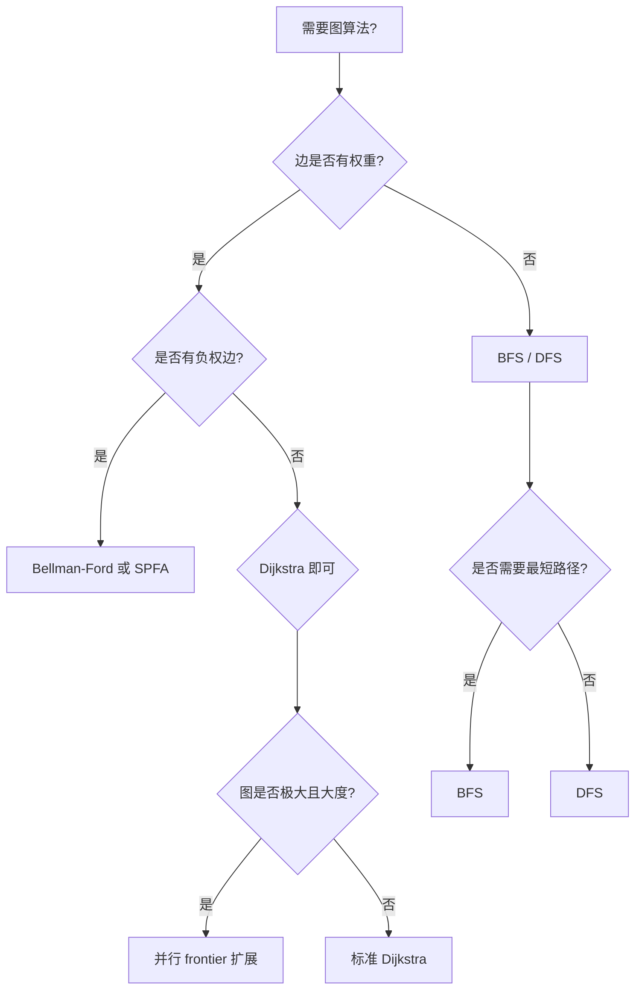

> **内容分级**: [专家级]
> **本节关键术语**: 图遍历 (Graph Traversal) · 广度优先搜索 (BFS) · 深度优先搜索 (DFS) · Dijkstra · Bellman-Ford · 邻接表 (Adjacency List) · 借用冲突 · 负环检测 · 并行 frontier — [完整对照表](../../00_meta/01_terminology/01_terminology_glossary.md)

# Rust 中的图算法

**EN**: Graph Algorithms in Rust
**Summary**: BFS, DFS, Dijkstra, Bellman-Ford, and competitive-programming patterns (topological sort, SCC, LCA, tree diameter, Floyd-Warshall, 2-SAT, flood fill) implemented in Rust with index-based adjacency lists, explicit borrowing discipline, and CP-algorithms/USACO Guide alignment.

> **Rust 版本**: 1.97.0+ (Edition 2024)
> **Bloom 层级**: L5-L6
> **权威来源**: 本文件为 `concept/` 权威页。
> **A/S/P 标记**: **S+P** — Structure + Procedure
> **定位**: 将经典图算法映射到 Rust 所有权模型，重点解决「遍历图的同时如何安全借用图」的问题，覆盖串行实现、错误处理与并行 frontier 扩展。
> **前置概念**: [Ownership](../../01_foundation/01_ownership_borrow_lifetime/01_ownership.md) · [Borrowing](../../01_foundation/01_ownership_borrow_lifetime/02_borrowing.md) · [所有权感知算法](../11_domain_applications/27_ownership_aware_algorithms.md) · [所有权感知的数据结构](02_ownership_aware_data_structures.md)
> **后置概念**: [缓存友好与 SIMD 算法](04_cache_friendly_and_simd_algorithms.md) · [并行与并发算法](../11_domain_applications/25_parallel_algorithms.md) · [c08_algorithms crate docs](../../../crates/c08_algorithms/docs/README.md)
> **L5 对比**: [Rust vs C++](../../05_comparative/01_systems_languages/01_rust_vs_cpp.md)

---

> **来源 / Provenance**:
> [Cormen, Leiserson, Rivest & Stein — *Introduction to Algorithms*, 4th ed.](https://mitpress.mit.edu/9780262046305/introduction-to-algorithms/) ·
> [Sedgewick & Wayne — *Algorithms*, 4th ed.](https://algs4.cs.princeton.edu/home/) ·
> [The Rust Programming Language](https://doc.rust-lang.org/book/title-page.html) ·
> [petgraph docs](https://docs.rs/petgraph/latest/petgraph/) ·
> [Rayon docs](https://docs.rs/rayon/latest/rayon/)

---

## 🧠 知识结构图

```mermaid
mindmap
  root((Rust 图算法))
    表示法
      Vec<Vec<usize>> 邻接表
      Vec<Vec<(usize, W)>> 加权邻接表
      petgraph Graph
    遍历
      BFS：VecDeque + visited
      DFS：递归或显式栈
      基于索引避免借用冲突
    最短路
      Dijkstra：BinaryHeap<Reverse>
      Bellman-Ford：边列表 + 松弛
      Floyd-Warshall：全源最短路
      负环检测
    竞赛编程模式
      拓扑排序：Kahn
      强连通分量：Tarjan
      LCA：倍增法
      树直径
      2-SAT
      Flood Fill
    借用与并发
      &self 遍历
      &mut self 修改
      并行 frontier：rayon
    错误处理
      越界边
      不连通图
      负权边限制
```

> **认知功能**: 本 mindmap 以「图表示 → 遍历 → 最短路 → 借用/并发」为主线，帮助读者根据问题特征选择实现策略，并理解 Rust 借用检查器对图算法接口的约束。

---

## 一、权威定义

**基于索引的图（Index-Based Graph）** 用整数 ID 表示顶点，用 `Vec<Vec<...>>` 存储邻接表。边不再是指针，而是数组下标。这种表示在 Rust 中有三重优势：

1. **借用安全**：遍历 `&self.adj[u]` 时不会与图本身产生可变借用冲突；`visited` 等辅助状态单独存放。
2. **零额外分配**：邻接表是一块连续内存的数组，比 `Box<Node>` 或 `Rc<RefCell>` 更 cache 友好。
3. **可序列化/可并行**：整数 ID 天然支持 `Send`/`Sync`，也便于与外部库（如 `petgraph`）互操作。

**遍历中的借用纪律**：在 Rust 中，遍历图时通常需要同时满足：

- 读取图结构（`&self`）
- 维护访问状态（`&mut visited`）
- 收集结果（`&mut order`）

这三个可变借用目标不同（图、访问数组、结果数组），因此可以共存。若把 `visited` 放进 `Graph` 结构内部，则所有遍历都会要求 `&mut self`，降低复用性。

> **来源**: [CLRS 2022](https://mitpress.mit.edu/9780262046305/introduction-to-algorithms/) · [Sedgewick & Wayne 2011](https://algs4.cs.princeton.edu/home/)

---

## 二、Rust 惯用法

### 2.1 邻接表图结构

```rust
#[derive(Debug, Clone, Default)]
struct Graph {
    adj: Vec<Vec<usize>>,
}

impl Graph {
    fn with_nodes(n: usize) -> Self {
        Self { adj: vec![Vec::new(); n] }
    }

    fn add_edge(&mut self, u: usize, v: usize) {
        assert!(u < self.adj.len() && v < self.adj.len(), "node out of bounds");
        self.adj[u].push(v);
    }

    fn node_count(&self) -> usize {
        self.adj.len()
    }
}
```

### 2.2 BFS 与 DFS

BFS 使用 `VecDeque` 作为队列，`visited` 作为外部状态传入，图保持 `&self`：

```rust
use std::collections::VecDeque;

#[derive(Debug, Clone, Default)]
struct Graph {
    adj: Vec<Vec<usize>>,
}

impl Graph {
    fn with_nodes(n: usize) -> Self {
        Self { adj: vec![Vec::new(); n] }
    }

    fn add_edge(&mut self, u: usize, v: usize) {
        assert!(u < self.adj.len() && v < self.adj.len(), "node out of bounds");
        self.adj[u].push(v);
    }

    fn bfs(&self, start: usize) -> Vec<usize> {
        assert!(start < self.adj.len(), "start node out of bounds");
        let mut visited = vec![false; self.adj.len()];
        let mut order = Vec::new();
        let mut queue = VecDeque::new();
        queue.push_back(start);
        visited[start] = true;

        while let Some(u) = queue.pop_front() {
            order.push(u);
            for &v in &self.adj[u] {
                if !visited[v] {
                    visited[v] = true;
                    queue.push_back(v);
                }
            }
        }
        order
    }

    fn dfs(&self, start: usize) -> Vec<usize> {
        assert!(start < self.adj.len(), "start node out of bounds");
        let mut visited = vec![false; self.adj.len()];
        let mut order = Vec::new();
        self.dfs_helper(start, &mut visited, &mut order);
        order
    }

    fn dfs_helper(&self, u: usize, visited: &mut [bool], order: &mut Vec<usize>) {
        visited[u] = true;
        order.push(u);
        for &v in &self.adj[u] {
            if !visited[v] {
                self.dfs_helper(v, visited, order);
            }
        }
    }
}

fn main() {
    let mut g = Graph::with_nodes(4);
    g.add_edge(0, 1);
    g.add_edge(0, 2);
    g.add_edge(1, 3);
    assert_eq!(g.bfs(0), vec![0, 1, 2, 3]);
    assert_eq!(g.dfs(0), vec![0, 1, 3, 2]);
}
```

**借用要点**：`bfs` 中 `self` 以 `&self` 被借用，`visited` 和 `order` 是调用方的局部变量。三者在类型签名上完全解耦，避免「图内部维护 visited」导致的 `&mut self` 限制。

### 2.3 Dijkstra 单源最短路

加权图用 `Vec<Vec<(usize, u64)>>` 表示。Dijkstra 使用 `BinaryHeap<Reverse<(u64, usize)>>>` 实现最小堆。

```rust
use std::cmp::Reverse;
use std::collections::BinaryHeap;

#[derive(Debug, Clone, Default)]
struct WeightedGraph {
    adj: Vec<Vec<(usize, u64)>>,
}

impl WeightedGraph {
    fn with_nodes(n: usize) -> Self {
        Self { adj: vec![Vec::new(); n] }
    }

    fn add_edge(&mut self, u: usize, v: usize, w: u64) {
        assert!(u < self.adj.len() && v < self.adj.len(), "node out of bounds");
        self.adj[u].push((v, w));
    }

    fn dijkstra(&self, start: usize) -> Vec<Option<u64>> {
        assert!(start < self.adj.len(), "start node out of bounds");
        let n = self.adj.len();
        let mut dist: Vec<Option<u64>> = vec![None; n];
        let mut heap: BinaryHeap<Reverse<(u64, usize)>> = BinaryHeap::new();
        dist[start] = Some(0);
        heap.push(Reverse((0, start)));

        while let Some(Reverse((d, u))) = heap.pop() {
            if Some(d) != dist[u] {
                continue;
            }
            for &(v, w) in &self.adj[u] {
                let nd = d + w;
                if dist[v].map_or(true, |old| nd < old) {
                    dist[v] = Some(nd);
                    heap.push(Reverse((nd, v)));
                }
            }
        }
        dist
    }
}

fn main() {
    let mut g = WeightedGraph::with_nodes(4);
    g.add_edge(0, 1, 1);
    g.add_edge(0, 2, 4);
    g.add_edge(1, 2, 2);
    g.add_edge(1, 3, 5);
    g.add_edge(2, 3, 1);
    let dist = g.dijkstra(0);
    assert_eq!(dist, vec![Some(0), Some(1), Some(3), Some(4)]);
}
```

**所有权要点**：

- `dijkstra` 只读访问 `self.adj`，返回新的 `Vec<Option<u64>>`，不修改图。
- `dist[v].map_or(true, |old| nd < old)` 用 `Option` 表达「尚未到达」与「已到达但可优化」两种状态。
- 堆中可能存有陈旧条目，通过 `Some(d) != dist[u]` 过滤，避免显式 `decrease-key`。

### 2.4 Bellman-Ford 与负环检测

Bellman-Ford 处理负权边，并能检测从源点可达的负环。

```rust
#[derive(Debug, Clone)]
struct Edge {
    u: usize,
    v: usize,
    w: i64,
}

#[derive(Debug, Clone, Default)]
struct EdgeListGraph {
    n: usize,
    edges: Vec<Edge>,
}

impl EdgeListGraph {
    fn with_nodes(n: usize) -> Self {
        Self { n, edges: Vec::new() }
    }

    fn add_edge(&mut self, u: usize, v: usize, w: i64) {
        assert!(u < self.n && v < self.n, "node out of bounds");
        self.edges.push(Edge { u, v, w });
    }

    fn bellman_ford(&self, start: usize) -> Result<Vec<Option<i64>>, &'static str> {
        assert!(start < self.n, "start node out of bounds");
        let mut dist: Vec<Option<i64>> = vec![None; self.n];
        dist[start] = Some(0);

        for _ in 1..self.n {
            let mut updated = false;
            for e in &self.edges {
                if let Some(du) = dist[e.u] {
                    let nd = du + e.w;
                    if dist[e.v].map_or(true, |old| nd < old) {
                        dist[e.v] = Some(nd);
                        updated = true;
                    }
                }
            }
            if !updated {
                break;
            }
        }

        // 负环检测：若仍能松弛，则存在从源点可达的负环
        for e in &self.edges {
            if let Some(du) = dist[e.u] {
                let nd = du + e.w;
                if dist[e.v].map_or(true, |old| nd < old) {
                    return Err("negative cycle reachable from start");
                }
            }
        }

        Ok(dist)
    }
}

fn main() {
    let mut g = EdgeListGraph::with_nodes(3);
    g.add_edge(0, 1, 1);
    g.add_edge(1, 2, -3);
    g.add_edge(2, 0, 1);
    assert!(g.bellman_ford(0).is_err());

    let mut g2 = EdgeListGraph::with_nodes(4);
    g2.add_edge(0, 1, 5);
    g2.add_edge(0, 2, 3);
    g2.add_edge(1, 3, 1);
    g2.add_edge(2, 1, -2);
    let dist = g2.bellman_ford(0).unwrap();
    assert_eq!(dist[3], Some(2));
}
```

### 2.5 借用图的同时迭代：避免常见冲突

Rust 借用检查器禁止在持有 `self.adj` 的某个邻接表引用时修改 `self`。下面的模式把「图结构」与「遍历状态」分离：

```rust
use std::collections::VecDeque;

#[derive(Debug, Clone, Default)]
struct Graph {
    adj: Vec<Vec<usize>>,
}

impl Graph {
    fn with_nodes(n: usize) -> Self {
        Self { adj: vec![Vec::new(); n] }
    }

    fn add_edge(&mut self, u: usize, v: usize) {
        assert!(u < self.adj.len() && v < self.adj.len(), "node out of bounds");
        self.adj[u].push(v);
    }

    // ✅ 正确：图只读，辅助状态外部可变
    fn traverse_and_collect(&self, start: usize, visited: &mut [bool], order: &mut Vec<usize>) {
        assert!(start < self.adj.len());
        let mut queue = VecDeque::from([start]);
        visited[start] = true;
        while let Some(u) = queue.pop_front() {
            order.push(u);
            for &v in &self.adj[u] {
                if !visited[v] {
                    visited[v] = true;
                    queue.push_back(v);
                }
            }
        }
    }
}

fn main() {
    let mut g = Graph::with_nodes(4);
    g.add_edge(0, 1);
    g.add_edge(0, 2);
    g.add_edge(1, 3);
    let mut visited = vec![false; 4];
    let mut order = Vec::new();
    g.traverse_and_collect(0, &mut visited, &mut order);
    assert_eq!(order, vec![0, 1, 2, 3]);
}
```

如果把 `visited` 放进 `Graph` 内部，遍历方法会要求 `&mut self`，导致无法同时执行多个遍历或共享图结构。

### 2.6 使用 petgraph 的工业级接口

`petgraph` 是 Rust 生态中功能最完整的图库，提供 `Graph`、`DiGraph`、`StableGraph` 等类型。它与自研邻接表的核心差异在于：顶点/边可以是任意类型，并支持迭代器、算法插件（如 `dijkstra`）和图可视化。

```rust,ignore
// Cargo.toml: petgraph = "0.7"
use petgraph::graph::{DiGraph, NodeIndex};
use petgraph::algo::dijkstra;

fn main() {
    let mut g = DiGraph::<&str, u32>::new();
    let a = g.add_node("A");
    let b = g.add_node("B");
    let c = g.add_node("C");
    g.add_edge(a, b, 1);
    g.add_edge(b, c, 2);
    g.add_edge(a, c, 5);

    // petgraph 的 dijkstra 返回 HashMap<NodeIndex, u32>
    let dist = dijkstra(&g, a, Some(c), |e| *e.weight());
    assert_eq!(dist.get(&c), Some(&3));
}
```

> `petgraph` 的 `Graph` 类型内部使用 arena + index，与自研 `Vec` 邻接表在所有权模型上同源：节点通过 `NodeIndex` 访问，避免自引用。

### 2.7 并行 frontier 扩展（rayon）

图的 frontier 扩展天然并行：当前层的所有顶点可以并发处理其邻居。下面展示使用 `rayon` 的并行 BFS 骨架。

```rust,ignore
// Cargo.toml: rayon = "1"
use rayon::prelude::*;
use std::collections::VecDeque;

struct Graph { adj: Vec<Vec<usize>> }

impl Graph {
    fn parallel_bfs(&self, start: usize) -> Vec<Option<u32>> {
        let n = self.adj.len();
        let mut dist: Vec<Option<u32>> = vec![None; n];
        let mut frontier = Vec::new();
        dist[start] = Some(0);
        frontier.push(start);

        while !frontier.is_empty() {
            let d = dist[frontier[0]].unwrap();
            let next_frontier: Vec<usize> = frontier
                .par_iter()
                .flat_map(|&u| {
                    self.adj[u]
                        .iter()
                        .filter(|&&v| dist[v].is_none())
                        .copied()
                        .collect::<Vec<_>>()
                })
                .collect();
            // 去重 + 设置距离（串行瓶颈）
            frontier = next_frontier
                .into_iter()
                .filter(|&v| {
                    if dist[v].is_none() {
                        dist[v] = Some(d + 1);
                        true
                    } else {
                        false
                    }
                })
                .collect();
        }
        dist
    }
}
```

> **注意**：上述代码存在并发写入 `dist` 的问题。实际并行图算法应使用原子距离数组、`rayon` 作用域或 `crossbeam` 的 work-stealing，详见 [并行与并发算法](../11_domain_applications/25_parallel_algorithms.md)。

---

## 三、反例与边界

### 反例 1：遍历中修改图结构

```rust,compile_fail,E0502
use std::collections::VecDeque;

struct Graph { adj: Vec<Vec<usize>> }

impl Graph {
    fn bfs_and_add(&mut self, start: usize) {
        let mut visited = vec![false; self.adj.len()];
        let mut queue = VecDeque::from([start]);
        while let Some(u) = queue.pop_front() {
            for &v in &self.adj[u] {
                if !visited[v] {
                    visited[v] = true;
                    self.adj[v].push(u); // ❌ 遍历 self.adj[u] 时不能可变借用 self
                    queue.push_back(v);
                }
            }
        }
    }
}
```

**修正**：先收集需要新增的边，遍历结束后再统一修改。

```rust
#[derive(Debug, Clone, Default)]
struct Graph {
    adj: Vec<Vec<usize>>,
}

impl Graph {
    fn collect_reverse_edges(&self) -> Vec<(usize, usize)> {
        let mut edges = Vec::new();
        for (u, neighbors) in self.adj.iter().enumerate() {
            for &v in neighbors {
                edges.push((v, u));
            }
        }
        edges
    }
}

fn main() {
    let g = Graph { adj: vec![vec![1, 2], vec![3], vec![3], vec![]] };
    let mut rev = g.collect_reverse_edges();
    rev.sort();
    assert_eq!(rev, vec![(1, 0), (2, 0), (3, 1), (3, 2)]);
}
```

### 反例 2：Dijkstra 处理负权边

```rust
use std::cmp::Reverse;
use std::collections::BinaryHeap;

#[derive(Debug, Clone, Default)]
struct WeightedGraph {
    adj: Vec<Vec<(usize, i64)>>,
}

impl WeightedGraph {
    fn with_nodes(n: usize) -> Self {
        Self { adj: vec![Vec::new(); n] }
    }

    fn add_edge(&mut self, u: usize, v: usize, w: i64) {
        self.adj[u].push((v, w));
    }

    fn dijkstra(&self, start: usize) -> Vec<Option<i64>> {
        let n = self.adj.len();
        let mut dist: Vec<Option<i64>> = vec![None; n];
        let mut heap: BinaryHeap<Reverse<(i64, usize)>> = BinaryHeap::new();
        dist[start] = Some(0);
        heap.push(Reverse((0, start)));
        while let Some(Reverse((d, u))) = heap.pop() {
            if Some(d) != dist[u] { continue; }
            for &(v, w) in &self.adj[u] {
                let nd = d + w;
                if dist[v].map_or(true, |old| nd < old) {
                    dist[v] = Some(nd);
                    heap.push(Reverse((nd, v)));
                }
            }
        }
        dist
    }
}

fn main() {
    let mut g = WeightedGraph::with_nodes(3);
    g.add_edge(0, 1, 5);
    g.add_edge(0, 2, 2);
    g.add_edge(2, 1, -10);
    let dist = g.dijkstra(0);
    // ❌ 错误：Dijkstra 贪心选择失效，返回 Some(5) 而非真实最短路 Some(-5)
    assert_eq!(dist[1], Some(5));
}
```

**修正**：含负权边时使用 Bellman-Ford；若只有非负权边才使用 Dijkstra。

### 反例 3：忽略不连通图的返回语义

```rust
use std::cmp::Reverse;
use std::collections::BinaryHeap;

#[derive(Debug, Clone, Default)]
struct WeightedGraph {
    adj: Vec<Vec<(usize, u64)>>,
}

impl WeightedGraph {
    fn with_nodes(n: usize) -> Self {
        Self { adj: vec![Vec::new(); n] }
    }

    fn add_edge(&mut self, u: usize, v: usize, w: u64) {
        self.adj[u].push((v, w));
    }

    fn dijkstra(&self, start: usize) -> Vec<Option<u64>> {
        let n = self.adj.len();
        let mut dist: Vec<Option<u64>> = vec![None; n];
        let mut heap: BinaryHeap<Reverse<(u64, usize)>> = BinaryHeap::new();
        dist[start] = Some(0);
        heap.push(Reverse((0, start)));
        while let Some(Reverse((d, u))) = heap.pop() {
            if Some(d) != dist[u] { continue; }
            for &(v, w) in &self.adj[u] {
                let nd = d + w;
                if dist[v].map_or(true, |old| nd < old) {
                    dist[v] = Some(nd);
                    heap.push(Reverse((nd, v)));
                }
            }
        }
        dist
    }
}

fn main() {
    let mut g = WeightedGraph::with_nodes(3);
    g.add_edge(0, 1, 1);
    let dist = g.dijkstra(0);
    // dist[2] 应为 None，表示不可达
    assert_eq!(dist[2], None);
}
```

**要点**：用 `Option<u64>` 而非 `u64::MAX` 表示不可达，避免在后续计算中发生溢出或逻辑错误。

---

## 四、复杂度与选型

| 算法 | 表示法 | 时间复杂度 | 空间复杂度 | 适用场景 |
|:---|:---|:---:|:---:|:---|
| **BFS** | `Vec<Vec<usize>>` | `O(V + E)` | `O(V)` | 无权图最短路径、连通性、拓扑分层 |
| **DFS** | `Vec<Vec<usize>>` | `O(V + E)` | `O(V)`（递归栈） | 连通分量、环检测、拓扑排序 |
| **Dijkstra** | `Vec<Vec<(usize, u64)>>` + `BinaryHeap` | `O((V + E) log V)` | `O(V)` | 非负权图单源最短路 |
| **Bellman-Ford** | 边列表 | `O(VE)` | `O(V)` | 含负权图、负环检测 |
| **并行 BFS** | `Vec<Vec<usize>>` + `rayon` | 分摊 `O(d · (E/p + p))` | `O(V + E)` | 大度图、frontier 较大时 |

**选型决策树**：



---

## 五、竞赛编程图算法模式

本节对齐 **CP-algorithms** 与 **USACO Guide** 的高频图模式，重点展示如何在 Rust 中安全、可复用地实现这些模式。这些模式与 2.1–2.7 的基础算法互补：当问题具有特定结构（有向无环、树、2-SAT、网格）时，可快速定位到对应算法。

> **来源**: [CP-algorithms — Graph](https://cp-algorithms.com/graph/index.html) · [USACO Guide — Graphs](https://usaco.guide/silver/graph-traversal?lang=cpp)

### 5.1 拓扑排序（Kahn 算法）

拓扑排序适用于有向无环图（DAG）。Kahn 算法通过维护入度为 0 的顶点集合，逐步释放依赖。

```rust
use std::collections::VecDeque;

fn topological_sort(adj: &[Vec<usize>]) -> Option<Vec<usize>> {
    let n = adj.len();
    let mut indeg = vec![0; n];
    for u in 0..n {
        for &v in &adj[u] {
            indeg[v] += 1;
        }
    }

    let mut q: VecDeque<usize> = (0..n).filter(|&u| indeg[u] == 0).collect();
    let mut order = Vec::with_capacity(n);

    while let Some(u) = q.pop_front() {
        order.push(u);
        for &v in &adj[u] {
            indeg[v] -= 1;
            if indeg[v] == 0 {
                q.push_back(v);
            }
        }
    }

    if order.len() == n { Some(order) } else { None }
}

fn main() {
    let adj = vec![
        vec![1, 2],
        vec![3],
        vec![3],
        vec![],
    ];
    assert_eq!(topological_sort(&adj), Some(vec![0, 1, 2, 3]));

    // 含环：0 -> 1 -> 2 -> 0
    let cyclic = vec![vec![1], vec![2], vec![0]];
    assert!(topological_sort(&cyclic).is_none());
}
```

**Rust 注意**：`indeg` 与 `adj` 分离，遍历时只读 `adj`，避免借用冲突；返回 `Option` 显式表达「图非 DAG」这一失败模式。

### 5.2 强连通分量（Tarjan 算法）

强连通分量（SCC）缩点是竞赛中处理有向图环结构的核心工具。Tarjan 算法一次 DFS 即可求出所有 SCC。

```rust
fn tarjan_scc(adj: &[Vec<usize>]) -> Vec<Vec<usize>> {
    let n = adj.len();
    let mut index = 0usize;
    let mut indices = vec![None; n];
    let mut low = vec![0; n];
    let mut stack = Vec::new();
    let mut on_stack = vec![false; n];
    let mut sccs: Vec<Vec<usize>> = Vec::new();

    fn dfs(
        u: usize,
        adj: &[Vec<usize>],
        index: &mut usize,
        indices: &mut [Option<usize>],
        low: &mut [usize],
        stack: &mut Vec<usize>,
        on_stack: &mut [bool],
        sccs: &mut Vec<Vec<usize>>,
    ) {
        indices[u] = Some(*index);
        low[u] = *index;
        *index += 1;
        stack.push(u);
        on_stack[u] = true;

        for &v in &adj[u] {
            if indices[v].is_none() {
                dfs(v, adj, index, indices, low, stack, on_stack, sccs);
                low[u] = low[u].min(low[v]);
            } else if on_stack[v] {
                low[u] = low[u].min(indices[v].unwrap());
            }
        }

        if low[u] == indices[u].unwrap() {
            let mut comp = Vec::new();
            loop {
                let v = stack.pop().unwrap();
                on_stack[v] = false;
                comp.push(v);
                if v == u { break; }
            }
            sccs.push(comp);
        }
    }

    for u in 0..n {
        if indices[u].is_none() {
            dfs(u, adj, &mut index, &mut indices, &mut low, &mut stack, &mut on_stack, &mut sccs);
        }
    }
    sccs
}

fn main() {
    let adj = vec![
        vec![1],
        vec![2, 4],
        vec![3, 5],
        vec![0, 6],
        vec![5],
        vec![4],
        vec![],
    ];
    let sccs = tarjan_scc(&adj);
    // SCC 内部顺序可能不同，但分量集合应为 {0,1,2,3,6}, {4,5}
    let mut sorted: Vec<Vec<usize>> = sccs
        .into_iter()
        .map(|mut c| { c.sort(); c })
        .collect();
    sorted.sort_by_key(|c| c[0]);
    assert_eq!(sorted, vec![vec![0, 1, 2, 3, 6], vec![4, 5]]);
}
```

**借用纪律**：递归辅助函数 `dfs` 接收多个独立可变引用（`indices`、`low`、`stack`、`on_stack`、`sccs`），它们与只读 `adj` 不冲突。`Vec<Option<usize>>` 既记录访问状态，又保存 DFS 序号。

### 5.3 最近公共祖先（LCA，倍增法）

倍增法 LCA 在 `O(n log n)` 预处理后每次查询 `O(log n)`，适合静态树。

```rust
struct Lca {
    up: Vec<Vec<usize>>,
    depth: Vec<usize>,
}

impl Lca {
    fn new(adj: &[Vec<usize>], root: usize) -> Self {
        let n = adj.len();
        let log = (n + 1).next_power_of_two().trailing_zeros() as usize;
        let mut up = vec![vec![root; log]; n];
        let mut depth = vec![0; n];

        fn dfs(
            u: usize,
            p: usize,
            d: usize,
            adj: &[Vec<usize>],
            up: &mut [Vec<usize>],
            depth: &mut [usize],
        ) {
            depth[u] = d;
            up[u][0] = p;
            for v in &adj[u] {
                if *v != p {
                    dfs(*v, u, d + 1, adj, up, depth);
                }
            }
        }

        dfs(root, root, 0, adj, &mut up, &mut depth);

        for k in 1..log {
            for u in 0..n {
                up[u][k] = up[up[u][k - 1]][k - 1];
            }
        }

        Self { up, depth }
    }

    fn lca(&self, mut u: usize, mut v: usize) -> usize {
        let log = self.up[0].len();
        if self.depth[u] < self.depth[v] {
            std::mem::swap(&mut u, &mut v);
        }
        // 将 u 上提到与 v 同深
        let diff = self.depth[u] - self.depth[v];
        for k in 0..log {
            if diff & (1 << k) != 0 {
                u = self.up[u][k];
            }
        }
        if u == v {
            return u;
        }
        for k in (0..log).rev() {
            if self.up[u][k] != self.up[v][k] {
                u = self.up[u][k];
                v = self.up[v][k];
            }
        }
        self.up[u][0]
    }
}

fn main() {
    let adj = vec![
        vec![1, 2],
        vec![3, 4],
        vec![5],
        vec![],
        vec![],
        vec![],
    ];
    let lca = Lca::new(&adj, 0);
    assert_eq!(lca.lca(3, 4), 1);
    assert_eq!(lca.lca(3, 5), 0);
    assert_eq!(lca.lca(2, 5), 2);
}
```

**空间注意**：`up` 是 `n × log n` 的二维 `Vec`，对 `n ≤ 2×10^5` 竞赛规模约需 16–32 MB，通常可接受；对更大规模可改用 Euler Tour + RMQ。

### 5.4 树直径

树直径可在两次 DFS/BFS 内求出：先从任意点找到最远点 `u`，再从 `u` 找到最远点 `v`，`u–v` 距离即为直径。

```rust
use std::collections::VecDeque;

fn tree_diameter(adj: &[Vec<usize>]) -> usize {
    if adj.is_empty() {
        return 0;
    }
    fn bfs_farthest(adj: &[Vec<usize>], start: usize) -> (usize, Vec<usize>) {
        let n = adj.len();
        let mut dist = vec![usize::MAX; n];
        let mut q = VecDeque::new();
        dist[start] = 0;
        q.push_back(start);

        while let Some(u) = q.pop_front() {
            for &v in &adj[u] {
                if dist[v] == usize::MAX {
                    dist[v] = dist[u] + 1;
                    q.push_back(v);
                }
            }
        }

        let far = (0..n).max_by_key(|&u| dist[u]).unwrap();
        (far, dist)
    }

    let (u, _) = bfs_farthest(adj, 0);
    let (v, dist_u) = bfs_farthest(adj, u);
    dist_u[v]
}

fn main() {
    let adj = vec![
        vec![1, 2],
        vec![0, 3],
        vec![0],
        vec![1],
    ];
    assert_eq!(tree_diameter(&adj), 3);
}
```

### 5.5 全源最短路（Floyd-Warshall）

Floyd-Warshall 用动态规划思想求所有顶点对最短路，适合稠密图或需要多次查询的场景。

```rust
const INF: i64 = i64::MAX / 4;

fn floyd_warshall(n: usize, edges: &[(usize, usize, i64)]) -> Vec<Vec<i64>> {
    let mut dist = vec![vec![INF; n]; n];
    for i in 0..n {
        dist[i][i] = 0;
    }
    for &(u, v, w) in edges {
        dist[u][v] = dist[u][v].min(w);
    }

    for k in 0..n {
        for i in 0..n {
            for j in 0..n {
                if dist[i][k] + dist[k][j] < dist[i][j] {
                    dist[i][j] = dist[i][k] + dist[k][j];
                }
            }
        }
    }
    dist
}

fn main() {
    let edges = vec![(0, 1, 5), (1, 2, 3), (0, 2, 10)];
    let dist = floyd_warshall(3, &edges);
    assert_eq!(dist[0][2], 8);
}
```

**边界**：若图中存在负环，则 `dist[i][i]` 最终会变成负数，可据此检测。

### 5.6 2-SAT

2-SAT 问题可通过蕴含图 + SCC 在 `O(n + m)` 内判定。每个布尔变量 `x_i` 拆成 `2i`（真）与 `2i+1`（假）两个顶点。

```rust,ignore
// 依赖本节 5.2 的 tarjan_scc 函数；此处展示 2-SAT 的变量拆点与赋值逻辑
fn two_sat(n: usize, clauses: &[(i32, bool, i32, bool)]) -> Option<Vec<bool>> {
    // 变量 i 的真节点 = 2*i, 假节点 = 2*i+1
    let mut adj = vec![Vec::new(); 2 * n];
    let mut add_implication = |a: usize, b: usize| {
        adj[a].push(b);
    };

    for &(x, xv, y, yv) in clauses {
        let (tx, fx) = (2 * x as usize, 2 * x as usize + 1);
        let (ty, fy) = (2 * y as usize, 2 * y as usize + 1);
        let (a, na) = if xv { (tx, fx) } else { (fx, tx) };
        let (b, nb) = if yv { (ty, fy) } else { (fy, ty) };
        add_implication(na, b); // ¬a => b
        add_implication(nb, a); // ¬b => a
    }

    let sccs = tarjan_scc(&adj);
    let mut comp_id = vec![0; 2 * n];
    for (id, comp) in sccs.iter().enumerate() {
        for &u in comp {
            comp_id[u] = id;
        }
    }

    let mut assignment = vec![false; n];
    for i in 0..n {
        if comp_id[2 * i] == comp_id[2 * i + 1] {
            return None;
        }
        // Tarjan 的 SCC 按逆后序给出，ID 越大代表拓扑序越前
        assignment[i] = comp_id[2 * i] > comp_id[2 * i + 1];
    }
    Some(assignment)
}

fn main() {
    // (x0 = true) OR (x1 = true), (x0 = false) OR (x1 = false)
    let clauses = vec![(0, true, 1, true), (0, false, 1, false)];
    let sol = two_sat(2, &clauses).unwrap();
    assert!(sol[0] || sol[1]);
    assert!(!sol[0] || !sol[1]);
}
```

> 注意：上面的 `tarjan_scc` 即 5.2 中定义的函数；在竞赛代码中通常把二者写在同一文件。

### 5.7 网格图与 Flood Fill

USACO Guide 将 flood fill 视为图遍历的特例：每个网格单元是顶点，四邻接是边。

```rust
fn flood_fill(grid: &mut [Vec<u8>], sr: usize, sc: usize, target: u8, fill: u8) {
    if grid[sr][sc] != target {
        return;
    }
    let rows = grid.len();
    let cols = grid[0].len();
    let mut stack = vec![(sr, sc)];
    while let Some((r, c)) = stack.pop() {
        if grid[r][c] != target {
            continue;
        }
        grid[r][c] = fill;
        let dirs = [(-1, 0), (1, 0), (0, -1), (0, 1)];
        for (dr, dc) in dirs {
            let nr = r as i32 + dr;
            let nc = c as i32 + dc;
            if nr >= 0 && nr < rows as i32 && nc >= 0 && nc < cols as i32 {
                let (nr, nc) = (nr as usize, nc as usize);
                if grid[nr][nc] == target {
                    stack.push((nr, nc));
                }
            }
        }
    }
}

fn main() {
    let mut grid = vec![
        vec![b'1', b'1', b'0'],
        vec![b'1', b'0', b'0'],
        vec![b'0', b'0', b'1'],
    ];
    flood_fill(&mut grid, 0, 0, b'1', b'X');
    assert_eq!(grid[0][0], b'X');
    assert_eq!(grid[2][2], b'1');
}
```

**选型提示**：

| 模式 | 适用场景 | 时间复杂度 | Rust 实现要点 |
|:---|:---|:---:|:---|
| 拓扑排序 | DAG 依赖/任务调度 | `O(V + E)` | `VecDeque` + 入度数组 |
| SCC / 2-SAT | 有向图环、布尔约束 | `O(V + E)` | Tarjan；变量拆点 |
| LCA 倍增 | 静态树多次查询 | 预处理 `O(n log n)`，查询 `O(log n)` | 二维 `up` 表 |
| 树直径 | 树的最长路径 | `O(V)` | 两次 BFS |
| Floyd-Warshall | 稠密图全源最短路 | `O(V³)` | 二维 `Vec`，注意 `INF` 防溢出 |
| Flood Fill | 网格连通块 | `O(RC)` | 显式栈避免递归深度问题 |

---

## 六、权威来源索引

- **P0 官方**: [The Rust Programming Language](https://doc.rust-lang.org/book/title-page.html)
- **P0 官方**: [Rust Reference](https://doc.rust-lang.org/reference/introduction.html)
- **P1 学术**: [Cormen, Leiserson, Rivest & Stein — *Introduction to Algorithms*, 4th ed.](https://mitpress.mit.edu/9780262046305/introduction-to-algorithms/)（BFS、DFS、Dijkstra、Bellman-Ford）
- **P1 学术**: [Sedgewick & Wayne — *Algorithms*, 4th ed.](https://algs4.cs.princeton.edu/home/)（图算法实现导向）
- **P1 学术**: [Blanuša, Ienne & Atasu — *Scalable Fine-Grained Parallel Cycle Enumeration Algorithms*](https://arxiv.org/abs/2202.09685)（SPAA '22；细粒度并行图搜索与负载均衡）
- **P1 竞赛**: [CP-algorithms — Graph](https://cp-algorithms.com/graph/index.html)（拓扑排序、SCC、LCA、2-SAT、Floyd-Warshall）
- **P1 竞赛**: [USACO Guide — Graphs](https://usaco.guide/silver/graph-traversal?lang=cpp)（Flood fill、拓扑排序、树直径、最短路径）
- **P2 生态**: [petgraph docs](https://docs.rs/petgraph/latest/petgraph/)
- **P2 生态**: [Rayon docs](https://docs.rs/rayon/latest/rayon/)
- **P2 生态**: [Rust Algorithm Club — Graph Algorithms](https://rust-algo.club/)

> **文档版本**: 1.1 ｜ **最后更新**: 2026-08-04 ｜ **状态**: ✅ 扩展 CP/USACO 图模式

## 国际化权威来源补充（International Authority Sources）

- <https://mitpress.mit.edu/9780262046305/introduction-to-algorithms/>
- <https://algs4.cs.princeton.edu/home/>
- <https://arxiv.org/abs/2202.09685>
- <https://cp-algorithms.com/graph/index.html>
- <https://usaco.guide/silver/graph-traversal?lang=cpp>
- <https://docs.rs/petgraph/latest/petgraph/>
- <https://docs.rs/rayon/latest/rayon/>
