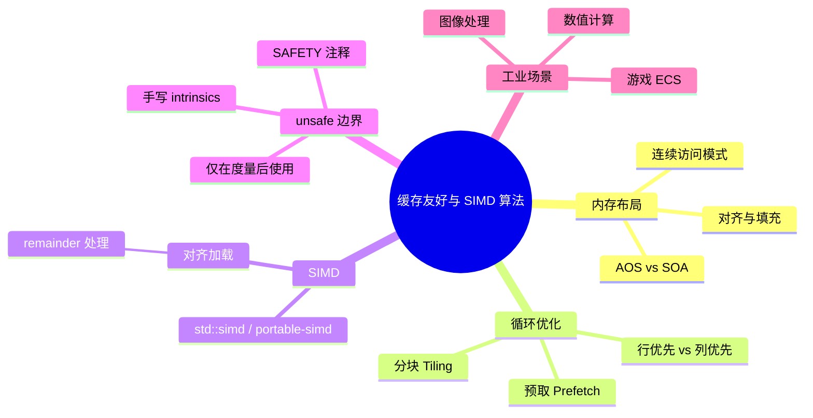
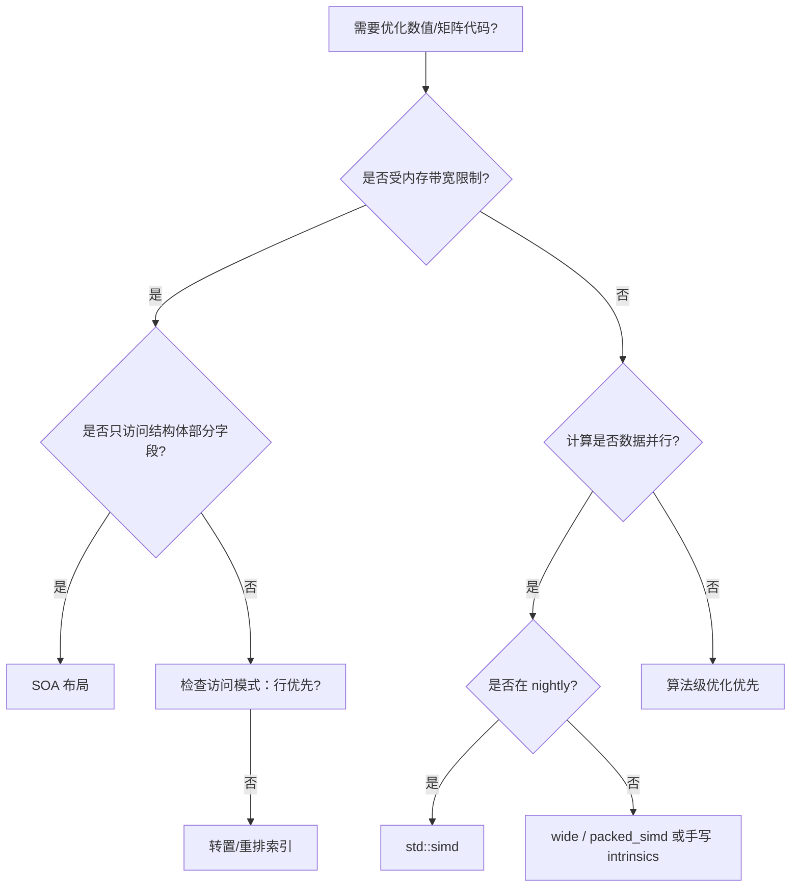

> **内容分级**: [专家级]
> **本节关键术语**: 缓存友好 (Cache-Friendly) · SIMD · SOA (Struct of Arrays) · AOS (Array of Structs) · 循环分块 (Loop Tiling) · 预取 (Prefetching) · std::simd · 数据对齐 — [完整对照表](../../00_meta/01_terminology/01_terminology_glossary.md)

# 缓存友好与 SIMD 算法

**EN**: Cache-Friendly and SIMD Algorithms in Rust
**Summary**: Rust-specific techniques for cache-friendly data layout, loop tiling, prefetching, and SIMD vectorization with `std::simd` / `portable-simd`, including safe boundaries for `unsafe` SIMD.

> **Rust 版本**: 1.97.0+ (Edition 2024)
> **Bloom 层级**: L5-L6
> **权威来源**: 本文件为 `concept/` 权威页。
> **A/S/P 标记**: **S+P** — Structure + Procedure
> **定位**: 将体系结构感知算法优化映射到 Rust：从数据布局（SOA/AOS）、循环分块、预取到 SIMD 向量化，强调在 safe Rust 与 `unsafe` 边界之间做最小侵入式选择。
> **前置概念**: [Ownership](../../01_foundation/01_ownership_borrow_lifetime/01_ownership.md) · [Unsafe](../../03_advanced/02_unsafe/01_unsafe.md) · [性能优化](../10_performance/01_performance_optimization.md) · [算法与复杂度惯用法](../10_performance/03_algorithms_and_complexity_idioms.md)
> **后置概念**: [并行与并发算法](../11_domain_applications/25_parallel_algorithms.md) · [图算法 Rust 实现](03_graph_algorithms_in_rust.md) · [c08_algorithms crate docs](../../../crates/c08_algorithms/docs/README.md)
> **L5 对比**: [Rust vs C++](../../05_comparative/01_systems_languages/01_rust_vs_cpp.md)

---

> **来源 / Provenance**:
> [The Rust Performance Book](https://nnethercote.github.io/perf-book/) ·
> [std::simd RFC / portable-simd project](https://github.com/rust-lang/project-portable-simd) ·
> [Rust Reference](https://doc.rust-lang.org/reference/introduction.html) ·
> [Hennessy & Patterson — *Computer Architecture: A Quantitative Approach*](https://www.elsevier.com/books/computer-architecture/hennessy/978-0-12-811905-1) ·
> [Ulrich Drepper — What Every Programmer Should Know About Memory](https://www.akkadia.org/drepper/cpumemory.pdf)

---

## 🧠 知识结构图



> **认知功能**: 本 mindmap 从「数据布局 → 访问模式 → 向量化 → 安全边界」四层展开，帮助读者理解缓存与 SIMD 优化的决策链条，以及 Rust 类型系统如何辅助或约束这些优化。

---

## 一、权威定义

**缓存友好算法（Cache-Friendly Algorithm）** 是指通过提高空间局部性与时间局部性、减少缓存未命中（cache miss）来提升实际运行速度的算法。在 Rust 中，这通常体现为：

1. **选择合适的数据布局**：当算法频繁访问结构体的某个字段时，SOA（Struct of Arrays）比 AOS（Array of Structs）更能利用缓存行。
2. **顺序访问数组**：行优先遍历多维数组，避免跨行/跨列跳跃。
3. **分块（Tiling）**：把大问题拆成适合 L1/L2 缓存的小块，复用加载进缓存的数据。
4. **显式预取（Prefetching）**：在需要数据之前提示 CPU 加载，掩盖内存延迟。

**SIMD（Single Instruction, Multiple Data）** 通过一条指令同时处理多个数据元素。Rust 通过 `std::simd`（nightly feature `portable_simd`）或外部 crate（如 `packed_simd_2`、`wide`）提供安全抽象；在稳定通道上，也可通过 `core::arch` 平台相关 intrinsics 使用 `unsafe`。

> **来源**: [Hennessy & Patterson](https://www.elsevier.com/books/computer-architecture/hennessy/978-0-12-811905-1) · [Drepper 2007](https://www.akkadia.org/drepper/cpumemory.pdf)

---

## 二、Rust 惯用法

### 2.1 AOS vs SOA

```rust
// AOS：缓存不友好，当只访问 position 时也会把 velocity/mass 加载进缓存行
#[derive(Clone, Copy)]
struct ParticleAos {
    position: [f32; 3],
    velocity: [f32; 3],
    mass: f32,
}

struct ParticlesAos {
    data: Vec<ParticleAos>,
}

// SOA：同类字段连续存储，只更新 position 时只加载 position
struct ParticlesSoa {
    position_x: Vec<f32>,
    position_y: Vec<f32>,
    position_z: Vec<f32>,
    velocity_x: Vec<f32>,
    velocity_y: Vec<f32>,
    velocity_z: Vec<f32>,
    mass: Vec<f32>,
}

impl ParticlesSoa {
    fn gravity_step(&mut self, dt: f32) {
        // 只访问 position 和 velocity，mass 字段不会被无谓加载
        for i in 0..self.position_x.len() {
            self.velocity_y[i] += -9.81 * dt;
            self.position_y[i] += self.velocity_y[i] * dt;
        }
    }
}
```

**选型要点**：

- 若算法同时访问结构体的大部分字段 → AOS 更自然。
- 若算法只访问部分字段，或同一字段被多个系统独立访问 → SOA 更 cache 友好（典型场景：ECS 游戏引擎）。

### 2.2 行优先 vs 列优先

```rust
fn sum_row_major(matrix: &[Vec<i64>]) -> i64 {
    let n = matrix.len();
    let mut sum = 0i64;
    for row in 0..n {
        for col in 0..matrix[row].len() {
            sum += matrix[row][col];
        }
    }
    sum
}

// 缓存不友好：每次访问跨行，跳过大段内存
fn sum_col_major(matrix: &[Vec<i64>]) -> i64 {
    let n = matrix.len();
    let mut sum = 0i64;
    for col in 0..n {
        for row in 0..n {
            sum += matrix[row][col];
        }
    }
    sum
}
```

> 使用扁平化一维 `Vec` 并手动计算索引，可进一步减少指针跳转开销：`index = row * cols + col`。

### 2.3 循环分块（Loop Tiling）

矩阵乘法是典型的分块受益场景。下面的实现把大矩阵拆成 `BLOCK` 大小的子块，使子块能驻留在 L1/L2 缓存中。

```rust
const BLOCK: usize = 32;

fn tiled_mat_mul(a: &[Vec<f64>], b: &[Vec<f64>], c: &mut [Vec<f64>], n: usize) {
    for i0 in (0..n).step_by(BLOCK) {
        for j0 in (0..n).step_by(BLOCK) {
            for k0 in (0..n).step_by(BLOCK) {
                let i_max = (i0 + BLOCK).min(n);
                let j_max = (j0 + BLOCK).min(n);
                let k_max = (k0 + BLOCK).min(n);

                for i in i0..i_max {
                    for j in j0..j_max {
                        let mut sum = c[i][j];
                        for k in k0..k_max {
                            sum += a[i][k] * b[k][j];
                        }
                        c[i][j] = sum;
                    }
                }
            }
        }
    }
}
```

**注意**：`b[k][j]` 仍按列访问。若要极致性能，可转置 `b` 为 `b_t[j][k]`，使内层循环对 `b_t` 行优先。

### 2.4 显式预取（Prefetching）

Rust 标准库不直接暴露 prefetch 指令，但可通过 `core::arch` 的 `_mm_prefetch`（x86）或 `_prefetch`（某些目标）使用。下面展示一个安全的、可跨平台退化的预取封装：

```rust
#[cfg(target_arch = "x86_64")]
use core::arch::x86_64::_mm_prefetch;
#[cfg(target_arch = "x86_64")]
const PREFETCH_HINT: i32 = 3; // _MM_HINT_T0

/// 尝试预取指定地址的数据；非 x86_64 平台为空操作。
///
/// # Safety
/// `ptr` 必须指向有效可读内存。该函数本身不解引用，但错误的
/// 预取地址不会触发页错误——CPU 会静默忽略无效预取。
pub unsafe fn prefetch_read<T>(ptr: *const T) {
    #[cfg(target_arch = "x86_64")]
    unsafe {
        _mm_prefetch(ptr as *const i8, PREFETCH_HINT);
    }
    #[cfg(not(target_arch = "x86_64"))]
    {
        let _ = ptr;
    }
}
```

> 预取应建立在性能剖析基础之上；错误使用会污染缓存并降低性能。

### 2.5 `std::simd` 安全 SIMD（nightly）

`std::simd` 提供跨平台 SIMD 抽象。截至 Rust 1.97.0，它仍需要 nightly feature `portable_simd`。

```rust,ignore
#![feature(portable_simd)]

use std::simd::{f32x8, SimdFloat};

fn simd_dot_product(a: &[f32], b: &[f32]) -> f32 {
    assert_eq!(a.len(), b.len());
    let chunks = a.chunks_exact(8);
    let remainder = chunks.remainder();

    let sum_vec = chunks.zip(b.chunks_exact(8)).fold(
        f32x8::splat(0.0),
        |acc, (chunk_a, chunk_b)| {
            let va = f32x8::from_slice(chunk_a);
            let vb = f32x8::from_slice(chunk_b);
            acc + va * vb
        },
    );

    sum_vec.reduce_sum() + remainder.iter().zip(remainder).map(|(x, y)| x * y).sum::<f32>()
}
```

**要点**：

- `chunks_exact(8)` 保证每次加载 8 个 `f32`（256-bit SIMD 寄存器）。
- `remainder` 用标量循环收尾，避免越界。
- 对齐加载（`from_slice` 要求切片至少 8 个元素）由 `chunks_exact` 保证。

### 2.6 稳定通道 SIMD：使用 `wide` crate

在稳定 Rust 上，可使用 `wide` crate 获得安全的跨平台 SIMD。

```rust,ignore
// Cargo.toml: wide = "0.7"
use wide::f32x8;

fn wide_dot_product(a: &[f32], b: &[f32]) -> f32 {
    assert_eq!(a.len(), b.len());
    let mut sum = f32x8::ZERO;
    let chunks = a.chunks_exact(8);
    let rem = chunks.remainder();
    for (ca, cb) in chunks.zip(b.chunks_exact(8)) {
        let va = f32x8::from(ca);
        let vb = f32x8::from(cb);
        sum += va * vb;
    }
    sum.reduce_add() + rem.iter().zip(rem).map(|(x, y)| x * y).sum::<f32>()
}
```

### 2.7 何时使用 `unsafe` SIMD intrinsics

只有当以下条件同时满足时，才考虑手写 `core::arch` intrinsics：

1. 性能剖析确认 SIMD 是瓶颈。
2. 安全抽象（`std::simd`、`wide`、`packed_simd`）无法满足需求（如特殊 shuffles、跨 lane 操作）。
3. 有明确的 SAFETY 注释，并保证：
   - 指针按 SIMD 宽度对齐（或使用未对齐加载指令）。
   - 不越界访问。
   - 目标平台支持该 intrinsic（通过 `#[cfg]` 限定）。

```rust,ignore
#[cfg(target_arch = "x86_64")]
use core::arch::x86_64::_mm256_loadu_ps;

/// SAFETY: `ptr` 必须指向至少 8 个连续有效的 f32。
#[cfg(target_arch = "x86_64")]
unsafe fn load_8_f32(ptr: *const f32) -> [f32; 8] {
    let vec = unsafe { _mm256_loadu_ps(ptr) };
    let mut out = [0.0f32; 8];
    unsafe { vec.storeu_ps(out.as_mut_ptr()) };
    out
}
```

---

## 三、反例与边界

### 反例 1：列优先访问矩阵

```rust
fn sum_columns_bad(matrix: &[Vec<i64>]) -> Vec<i64> {
    let n = matrix.len();
    let mut sums = vec![0i64; n];
    for col in 0..n {
        for row in 0..n {
            sums[col] += matrix[row][col]; // 跨行跳跃，cache miss 高
        }
    }
    sums
}

// ✅ 修正：按行读取，提高空间局部性
fn sum_columns_good(matrix: &[Vec<i64>]) -> Vec<i64> {
    let n = matrix.len();
    let mut sums = vec![0i64; n];
    for row in 0..n {
        for col in 0..n {
            sums[col] += matrix[row][col];
        }
    }
    sums
}
```

### 反例 2：未处理 SIMD remainder

```rust,ignore
#![feature(portable_simd)]
use std::simd::f32x8;

// ❌ 错误：当 a.len() 不是 8 的倍数时，from_slice 会越界
fn buggy_simd_sum(a: &[f32]) -> f32 {
    let mut sum = f32x8::splat(0.0);
    for i in (0..a.len()).step_by(8) {
        sum += f32x8::from_slice(&a[i..]); // 最后一段可能不足 8 个元素
    }
    sum.reduce_sum()
}
```

**修正**：使用 `chunks_exact` + `remainder` 分别处理向量化部分与标量尾部。

### 反例 3：过早 SIMD 化

```rust,ignore
// ❌ 错误：数据量极小，SIMD 启动与收尾开销超过收益
fn tiny_array_sum(a: &[f32; 4]) -> f32 {
    a.iter().sum()
}
```

**修正**：对长度 < 1000 的数组，标量循环通常更快；先跑 `criterion` 基准测试再决定是否向量化。

### 反例 4：SOA 导致代码复杂度激增却未提升性能

```rust
struct ParticlesSoa {
    x: Vec<f32>, y: Vec<f32>, z: Vec<f32>,
}

impl ParticlesSoa {
    // ❌ 错误：该函数同时访问所有字段，SOA 并未减少缓存加载
    fn total_energy(&self) -> f32 {
        let mut e = 0.0f32;
        for i in 0..self.x.len() {
            e += self.x[i] * self.x[i] + self.y[i] * self.y[i] + self.z[i] * self.z[i];
        }
        e
    }
}
```

**修正**：若算法每次都需要结构体全部字段，AOS 的代码更简单且缓存表现相当。

---

## 四、复杂度与选型

| 技术 | 时间复杂度 | 空间复杂度 | 适用条件 | Rust 实现要点 |
|:---|:---:|:---:|:---|:---|
| **AOS** | 与字段访问数相关 | 结构体大小 × N | 同时访问多字段 | 普通 `Vec<Struct>` |
| **SOA** | 与字段访问数相关 | 同 AOS | 只访问部分字段、字段被多个系统独立读写 | 每个字段一个 `Vec` |
| **行优先遍历** | 同算法 | 不变 | 多维数组 | `for row { for col { ... } }` |
| **循环分块** | 同算法，常数级加速 | 可能需临时块缓冲 | 矩阵乘法、卷积、大块数据复用 | `step_by(BLOCK)` |
| **预取** | 不变，隐藏延迟 | 不变 | 顺序访问大数据集 | `core::arch::_mm_prefetch` + `#[cfg]` |
| **`std::simd`** | 理论 `O(n/k)`（k = lane 数） | 不变 | nightly、数值密集、连续数组 | `chunks_exact` + `remainder` |
| **手写 intrinsics** | 同 SIMD | 不变 | 稳定通道、特殊指令、极致性能 | `unsafe` + SAFETY 注释 |

**选型决策树**：



---

## 五、权威来源索引

- **P0 官方**: [The Rust Reference](https://doc.rust-lang.org/reference/introduction.html)
- **P0 官方**: [Rust Performance Book](https://nnethercote.github.io/perf-book/)
- **P0 官方**: [std::simd — portable-simd project](https://github.com/rust-lang/project-portable-simd)
- **P1 学术**: [Hennessy & Patterson — *Computer Architecture: A Quantitative Approach*](https://www.elsevier.com/books/computer-architecture/hennessy/978-0-12-811905-1)
- **P1 学术**: [Ulrich Drepper — What Every Programmer Should Know About Memory](https://www.akkadia.org/drepper/cpumemory.pdf)
- **P1 学术**: [Lam, Rothberg & Wolf — The Cache Performance and Optimizations of Blocked Algorithms, ACM 1991](https://dl.acm.org/doi/10.1145/106972.106981)
- **P2 生态**: [wide crate docs](https://docs.rs/wide/latest/wide/)
- **P2 生态**: [packed_simd_2 crate docs](https://docs.rs/packed_simd_2/latest/packed_simd_2/)
- **P2 生态**: [core::arch docs](https://doc.rust-lang.org/core/arch/index.html)

> **文档版本**: 1.0 ｜ **最后更新**: 2026-08-03 ｜ **状态**: ✅ 新建权威页

## 国际化权威来源补充（International Authority Sources）

- <https://nnethercote.github.io/perf-book/>
- <https://github.com/rust-lang/project-portable-simd>
- <https://www.akkadia.org/drepper/cpumemory.pdf>
- <https://dl.acm.org/doi/10.1145/106972.106981>
- <https://docs.rs/wide/latest/wide/>
