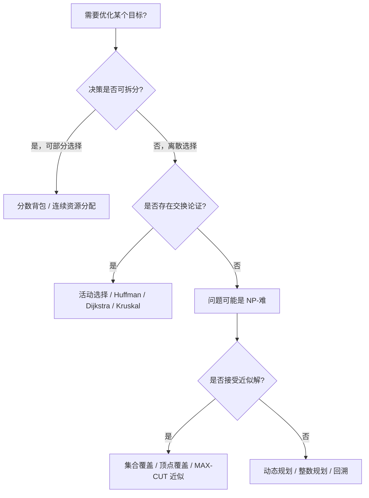

> **内容分级**: [专家级]
> **本节关键术语**:
> 贪心算法 (Greedy Algorithm) · 贪心选择性质 (Greedy Choice Property) · 最优子结构 (Optimal Substructure) ·
> 近似算法 (Approximation Algorithm) · 近似比 (Approximation Ratio) · 活动选择 (Activity Selection) ·
> Huffman 编码 (Huffman Coding) · 分数背包 (Fractional Knapsack) · 集合覆盖 (Set Cover)
> — [完整对照表](../../00_meta/01_terminology/01_terminology_glossary.md)

# Rust 中的贪心与近似算法

**EN**: Greedy and Approximation Algorithms in Rust
**Summary**: Activity selection, Huffman coding, fractional knapsack, and set-cover approximation implemented in Rust, with correctness proofs, greedy-choice property, optimal-substructure counterexamples, and zero-copy/type-safe idioms.

> **Rust 版本**: 1.97.0+ (Edition 2024)
> **Bloom 层级**: L5-L6
> **权威来源**: 本文件为 `concept/` 权威页。
> **A/S/P 标记**: **S+P** — Structure + Procedure
> **定位**: 在 Rust 类型系统与所有权模型下实现贪心/近似算法，强调“为什么贪心在此刻正确”以及“何时贪心会失败”。
> **前置概念**: [算法模式概述](00_algorithm_patterns_overview.md) · [算法范式深潜](01_algorithmic_paradigms.md) · [所有权感知的数据结构](02_ownership_aware_data_structures.md)
> **后置概念**: [动态规划 Rust 实现](06_dynamic_programming_in_rust.md) · [字符串算法 Rust 实现](07_string_algorithms_in_rust.md) · [图算法 Rust 实现](03_graph_algorithms_in_rust.md)
> **L5 对比**: [Rust vs C++](../../05_comparative/01_systems_languages/01_rust_vs_cpp.md)

---

> **来源 / Provenance**:
> [Cormen, Leiserson, Rivest & Stein — *Introduction to Algorithms*, 4th ed.](https://mitpress.mit.edu/9780262046305/introduction-to-algorithms/) ·
> [Kleinberg & Tardos — *Algorithm Design*](https://www.cs.princeton.edu/~wayne/kleinberg-tardos/) ·
> [The Rust Programming Language](https://doc.rust-lang.org/book/title-page.html) ·
> [The Rust Reference](https://doc.rust-lang.org/reference/introduction.html) ·
> [Rust Design Patterns](https://rust-unofficial.github.io/patterns/)

---

## 🧠 知识结构图

```mermaid
mindmap
  root((Rust 贪心与近似算法))
    活动选择
      按结束时间排序
      单次扫描
      O(n log n)
    Huffman 编码
      最小堆 BinaryHeap<Reverse>
      贪心合并最小频率
      前缀码最优
    分数背包
      按单位价值排序
      可拆分物品
      O(n log n)
    集合覆盖近似
      贪心选最多未覆盖
      H_n 近似比
      不存在多项式精确解
    正确性证明
      贪心选择性质
      最优子结构
      交换论证
    反例
      0/1 背包贪心失效
      找零问题贪心非最优
    Rust 惯用法
      &[(T, T)] 零拷贝输入
      BinaryHeap 类型安全堆
      HashSet 覆盖状态
```

> **认知功能**: 本 mindmap 从“问题 → 贪心选择 → 正确性条件 → Rust 实现”组织，帮助读者在写代码前先判断贪心是否适用。

---

## 一、权威定义

**贪心算法（Greedy Algorithm）** 在每一步都做出**当前看起来最优**的局部选择，并期望局部选择的累积构成全局最优解。它与动态规划的区别在于：贪心不回溯、不枚举子问题，只做一次不可撤销的决策。

**贪心选择性质（Greedy Choice Property）**：存在一个全局最优解包含当前贪心做出的选择。证明该性质通常使用**交换论证（Exchange Argument）**：任取一个最优解，通过替换将其改造成包含贪心选择的另一个最优解，且不降低目标函数值。

**最优子结构（Optimal Substructure）**：做出贪心选择后，剩余的子问题仍需最优解。若子问题本身不满足最优子结构，则贪心即使局部正确也无法保证全局正确。

**近似算法（Approximation Algorithm）**：对于 NP-难问题，在多项式时间内给出满足近似比保证的解。集合覆盖的贪心算法给出 `H_n` 近似比（`H_n` 为第 `n` 个调和数），这是经典的最佳可能多项式近似（除非 P=NP）。

> **来源**: [CLRS 2022](https://mitpress.mit.edu/9780262046305/introduction-to-algorithms/) · [Kleinberg & Tardos 2005](https://www.cs.princeton.edu/~wayne/kleinberg-tardos/)

---

## 二、Rust 惯用法

### 2.1 活动选择（Activity Selection）

按结束时间升序排序后单次扫描，每次选择开始时间不早于上一个已选活动结束时间的活动。

```rust
pub fn activity_selection(activities: &[(usize, usize)]) -> Vec<(usize, usize)> {
    // 拷贝引用以便排序；若允许修改输入，可改为 &mut [(usize, usize)] 原地排序。
    let mut sorted = activities.to_vec();
    sorted.sort_by_key(|&(_, end)| end);

    let mut selected = Vec::new();
    let mut last_end = 0usize;
    for &(start, end) in &sorted {
        if start >= last_end {
            selected.push((start, end));
            last_end = end;
        }
    }
    selected
}

fn main() {
    let acts = vec![(1, 3), (2, 5), (4, 7), (1, 8), (5, 9), (8, 10)];
    let sel = activity_selection(&acts);
    assert_eq!(sel, vec![(1, 3), (4, 7), (8, 10)]);
}
```

**所有权要点**：输入使用不可变借用 `&[(usize, usize)]`，输出 `Vec` 仅保存被选中的索引对；排序在局部副本上进行，不破坏调用方的数据。

### 2.2 Huffman 编码（Huffman Coding）

使用 `BinaryHeap<Reverse<Node>>` 作为最小堆，每次合并频率最小的两个节点，直到只剩一棵树。

```rust
use std::cmp::Reverse;
use std::collections::{BinaryHeap, HashMap};

#[derive(Debug, Clone, Eq, PartialEq, Ord, PartialOrd)]
struct HuffmanNode {
    freq: usize,
    ch: Option<u8>,
    left: Option<Box<HuffmanNode>>,
    right: Option<Box<HuffmanNode>>,
}

impl HuffmanNode {
    fn leaf(ch: u8, freq: usize) -> Self {
        Self { freq, ch: Some(ch), left: None, right: None }
    }

    fn internal(left: HuffmanNode, right: HuffmanNode) -> Self {
        Self {
            freq: left.freq + right.freq,
            ch: None,
            left: Some(Box::new(left)),
            right: Some(Box::new(right)),
        }
    }
}

pub fn build_huffman(frequencies: &[(u8, usize)]) -> Option<HuffmanNode> {
    if frequencies.is_empty() {
        return None;
    }
    let mut heap: BinaryHeap<Reverse<HuffmanNode>> = frequencies
        .iter()
        .map(|&(ch, f)| Reverse(HuffmanNode::leaf(ch, f)))
        .collect();

    while heap.len() > 1 {
        let Reverse(left) = heap.pop().unwrap();
        let Reverse(right) = heap.pop().unwrap();
        heap.push(Reverse(HuffmanNode::internal(left, right)));
    }
    heap.into_iter().map(|Reverse(n)| n).next()
}

fn build_codes(node: &HuffmanNode, prefix: String, out: &mut HashMap<u8, String>) {
    if let Some(ch) = node.ch {
        out.insert(ch, if prefix.is_empty() { "0".into() } else { prefix });
        return;
    }
    if let Some(ref left) = node.left {
        build_codes(left, format!("{}0", prefix), out);
    }
    if let Some(ref right) = node.right {
        build_codes(right, format!("{}1", prefix), out);
    }
}

pub fn huffman_codes(frequencies: &[(u8, usize)]) -> HashMap<u8, String> {
    let mut codes = HashMap::new();
    if let Some(root) = build_huffman(frequencies) {
        build_codes(&root, String::new(), &mut codes);
    }
    codes
}

fn main() {
    let freq = vec![('a' as u8, 45), ('b' as u8, 13), ('c' as u8, 12),
                    ('d' as u8, 16), ('e' as u8, 9), ('f' as u8, 5)];
    let codes = huffman_codes(&freq);
    assert_eq!(codes[&b'a'], "0");
    assert_eq!(codes.len(), 6);
}
```

**类型安全要点**：`HuffmanNode` 通过 `Option<Box<...>>` 自引用，完全在 safe Rust 内构建；`BinaryHeap<Reverse<...>>` 把标准库的最大堆转换为最小堆，无需第三方优先队列。

### 2.3 分数背包（Fractional Knapsack）

物品可拆分，按单位重量价值降序排序，优先装入高价值密度物品。

```rust
#[derive(Debug, Clone, Copy)]
pub struct Item {
    pub weight: f64,
    pub value: f64,
}

impl Item {
    fn density(self) -> f64 {
        self.value / self.weight
    }
}

pub fn fractional_knapsack(items: &[Item], capacity: f64) -> f64 {
    let mut sorted = items.to_vec();
    sorted.sort_by(|a, b| b.density().partial_cmp(&a.density()).unwrap());

    let mut total_value = 0.0;
    let mut remaining = capacity;
    for item in sorted {
        if remaining <= 0.0 {
            break;
        }
        let take = item.weight.min(remaining);
        total_value += take * item.density();
        remaining -= take;
    }
    total_value
}

fn main() {
    let items = vec![
        Item { weight: 10.0, value: 60.0 },
        Item { weight: 20.0, value: 100.0 },
        Item { weight: 30.0, value: 120.0 },
    ];
    let value = fractional_knapsack(&items, 50.0);
    assert!((value - 240.0).abs() < 1e-9);
}
```

**零拷贝**：`items` 以切片传入；排序在副本上进行。若调用方允许修改输入，可直接对 `&mut [Item]` 原地排序，省去一次 `O(n)` 拷贝。

### 2.4 集合覆盖近似（Set Cover Approximation）

给定全集 `universe` 和子集族 `subsets`，每次选择覆盖最多未覆盖元素的子集，直到全部覆盖。

```rust
use std::collections::HashSet;

pub fn greedy_set_cover(universe: &[usize], subsets: &[Vec<usize>]) -> Vec<usize> {
    let mut uncovered: HashSet<usize> = universe.iter().copied().collect();
    let mut chosen = Vec::new();
    let mut used = vec![false; subsets.len()];

    while !uncovered.is_empty() {
        let mut best_idx = None;
        let mut best_count = 0usize;

        for (i, set) in subsets.iter().enumerate() {
            if used[i] {
                continue;
            }
            let cover = set.iter().filter(|x| uncovered.contains(x)).count();
            if cover > best_count {
                best_count = cover;
                best_idx = Some(i);
            }
        }

        let idx = best_idx.expect("subsets do not cover the universe");
        used[idx] = true;
        for &x in &subsets[idx] {
            uncovered.remove(&x);
        }
        chosen.push(idx);
    }
    chosen
}

fn main() {
    let universe = vec![1, 2, 3, 4, 5];
    let subsets = vec![
        vec![1, 2, 3],
        vec![2, 4],
        vec![3, 4, 5],
        vec![1, 5],
    ];
    let cover = greedy_set_cover(&universe, &subsets);
    assert_eq!(cover.len(), 2); // [0, 2] 或 [2, 0]
}
```

**近似保证**：该贪心解的子集数量不超过最优解的 `H_n` 倍，其中 `n = |universe|`。`H_n = 1 + 1/2 + ... + 1/n`。

---

## 三、反例与边界

### 反例 1：0/1 背包不能用贪心

物品不可分割时，按单位重量价值贪心可能错过全局最优。

```rust
#[derive(Debug, Clone, Copy)]
struct Item01 { weight: usize, value: usize }

fn greedy_01_knapsack(items: &[Item01], capacity: usize) -> usize {
    let mut sorted = items.to_vec();
    sorted.sort_by(|a, b| {
        let da = a.value as f64 / a.weight as f64;
        let db = b.value as f64 / b.weight as f64;
        db.partial_cmp(&da).unwrap()
    });

    let mut value = 0usize;
    let mut cap = capacity;
    for item in sorted {
        if item.weight <= cap {
            value += item.value;
            cap -= item.weight;
        }
    }
    value
}

fn dp_01_knapsack(items: &[Item01], capacity: usize) -> usize {
    let mut dp = vec![0; capacity + 1];
    for item in items {
        for w in (item.weight..=capacity).rev() {
            dp[w] = dp[w].max(dp[w - item.weight] + item.value);
        }
    }
    dp[capacity]
}

fn main() {
    let items = vec![
        Item01 { weight: 10, value: 60 },
        Item01 { weight: 20, value: 100 },
        Item01 { weight: 30, value: 120 },
    ];
    let greedy = greedy_01_knapsack(&items, 50);
    let optimal = dp_01_knapsack(&items, 50);
    assert_eq!(greedy, 160); // 选 10+20
    assert_eq!(optimal, 220); // 选 20+30
    assert!(greedy < optimal);
}
```

**结论**：0/1 背包的最优子结构需要“选或不选”两种状态，贪心只做单一局部决策，因此不能保证最优。

### 反例 2：找零问题贪心失效

面额 `[1, 3, 4]`，目标 `6`。贪心优先选最大面额 `4`，剩 `2` 用两个 `1`，共 3 枚；最优为两个 `3`，共 2 枚。

```rust
fn greedy_change(coins: &[usize], target: usize) -> Option<usize> {
    let mut sorted = coins.to_vec();
    sorted.sort_by(|a, b| b.cmp(a));
    let mut count = 0usize;
    let mut remain = target;
    for &c in &sorted {
        if remain == 0 {
            break;
        }
        count += remain / c;
        remain %= c;
    }
    if remain == 0 { Some(count) } else { None }
}

fn dp_change(coins: &[usize], target: usize) -> Option<usize> {
    let mut dp = vec![usize::MAX; target + 1];
    dp[0] = 0;
    for t in 1..=target {
        for &c in coins {
            if c <= t && dp[t - c] != usize::MAX {
                dp[t] = dp[t].min(dp[t - c] + 1);
            }
        }
    }
    if dp[target] == usize::MAX { None } else { Some(dp[target]) }
}

fn main() {
    let coins = vec![1, 3, 4];
    assert_eq!(greedy_change(&coins, 6), Some(3));
    assert_eq!(dp_change(&coins, 6), Some(2));
}
```

### 反例 3：集合覆盖贪心并非最优

```rust
use std::collections::HashSet;

fn main() {
    let universe: HashSet<usize> = (1..=6).collect();
    let subsets = vec![
        vec![1, 2, 3, 4], // 覆盖 4 个
        vec![5, 6],       // 覆盖 2 个
        vec![1, 2, 5],    // 覆盖 3 个
        vec![3, 4, 6],    // 覆盖 3 个
    ];
    // 贪心第一步必选 subset 0（覆盖最多），随后至少需要 subset 1，共 2 个。
    // 但最优解为 {2, 3}，共 2 个，子集数量相同。
    // 通过构造更大实例可让贪心严格劣于最优；此处说明贪心仅保证 H_n 近似。
    let optimal = vec![2usize, 3];
    let mut covered = HashSet::new();
    for &i in &optimal {
        for &x in &subsets[i] { covered.insert(x); }
    }
    assert_eq!(covered, universe);
}
```

**边界注意**：

- 当 `f64` 密度相等时，`partial_cmp().unwrap()` 是安全的，因为分母 `weight` 为正。
- Huffman 编码中若频率数组为空，应返回空编码表，避免对空堆 `pop()`。
- 集合覆盖的 `best_idx` 必须存在；若子集族无法覆盖全集，应使用 `Result` 或显式 panic。

---

## 四、复杂度与选型

| 算法/问题 | 时间复杂度 | 空间复杂度 | 贪心正确性条件 | Rust 特化收益 |
|:---|:---|:---|:---|:---|
| **活动选择** | `O(n log n)`（排序） | `O(n)` 输出 | 按结束时间排序 | `&[(usize, usize)]` 输入，单次可变借用副本 |
| **Huffman 编码** | `O(n log n)` | `O(n)` | 前缀码 + 贪心合并 | `BinaryHeap<Reverse<Node>>` 类型安全最小堆 |
| **分数背包** | `O(n log n)` | `O(n)` 排序副本 | 物品可无限拆分 | `f64` 密度比较 + `min` 取部分 |
| **集合覆盖近似** | `O(\|U\| · \|F\|)` | `O(\|U\|)` | NP-难，仅求近似 | `HashSet` 覆盖状态，近似比 `H_n` |
| **0/1 背包** | `O(n · C)`（DP） | `O(C)` | **贪心不正确** | 见 [动态规划 Rust 实现](06_dynamic_programming_in_rust.md) |
| **找零/区间调度变体** | 视问题而定 | 视问题而定 | 需验证贪心选择性质 | 先写反例测试再决定是否使用贪心 |

**选型决策树**：



---

## 五、权威来源索引

- **P0 官方**: [The Rust Programming Language](https://doc.rust-lang.org/book/title-page.html)
- **P0 官方**: [The Rust Reference](https://doc.rust-lang.org/reference/introduction.html)
- **P0 官方**: [std::collections::BinaryHeap](https://doc.rust-lang.org/std/collections/struct.BinaryHeap.html)
- **P1 学术**: [Cormen, Leiserson, Rivest & Stein — *Introduction to Algorithms*, 4th ed.](https://mitpress.mit.edu/9780262046305/introduction-to-algorithms/)（贪心、Huffman、集合覆盖近似）
- **P1 学术**: [Kleinberg & Tardos — *Algorithm Design*](https://www.cs.princeton.edu/~wayne/kleinberg-tardos/)（交换论证与最优子结构）
- **P1 学术**: [Improved Greedy Algorithm for Set Covering Problem — arXiv:1506.04220](https://arxiv.org/abs/1506.04220)
- **P2 生态**: [docs.rs — itertools](https://docs.rs/itertools/latest/itertools/)（Rust 迭代器扩展，常用于扫描与排序辅助）
- **P2 生态**: [crates.io — ordered-float](https://crates.io/crates/ordered-float)（处理浮点键的稳定排序 crate）
- **P2 生态**: [Rust Design Patterns](https://rust-unofficial.github.io/patterns/)

> **文档版本**: 1.0 ｜ **最后更新**: 2026-08-03 ｜ **状态**: ✅ 新建权威页

## 国际化权威来源补充（International Authority Sources）

- <https://mitpress.mit.edu/9780262046305/introduction-to-algorithms/>
- <https://www.cs.princeton.edu/~wayne/kleinberg-tardos/>
- <https://arxiv.org/abs/1506.04220>
- <https://docs.rs/itertools/latest/itertools/>
