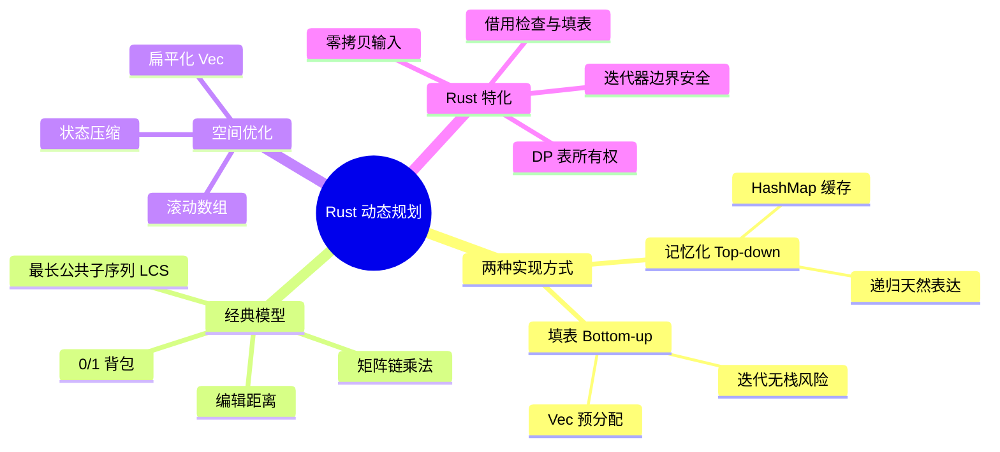
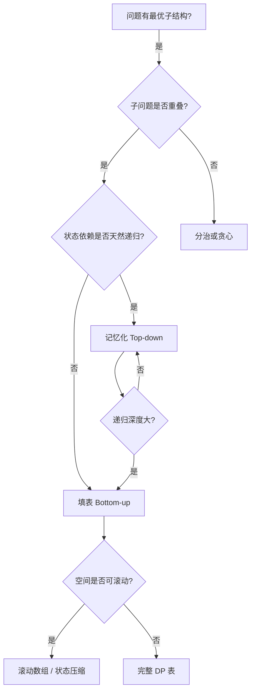

> **内容分级**: [专家级]
> **本节关键术语**:
> 动态规划 (Dynamic Programming) · 记忆化 (Memoization) · 填表 (Tabulation) · 滚动数组 (Rolling Array) ·
> 最优子结构 (Optimal Substructure) · 重叠子问题 (Overlapping Subproblems) · 0/1 背包 (0/1 Knapsack) ·
> 最长公共子序列 (LCS) · 编辑距离 (Edit Distance) · 矩阵链乘法 (Matrix Chain Multiplication)
> — [完整对照表](../../00_meta/01_terminology/01_terminology_glossary.md)

# Rust 中的动态规划

**EN**: Dynamic Programming in Rust
**Summary**: Memoization vs tabulation, 0/1 knapsack, LCS, edit distance, and matrix chain multiplication implemented in Rust, with ownership-aware DP tables, rolling arrays, and complexity-aware idioms.

> **Rust 版本**: 1.97.0+ (Edition 2024)
> **Bloom 层级**: L5-L6
> **权威来源**: 本文件为 `concept/` 权威页。
> **A/S/P 标记**: **S+P** — Structure + Procedure
> **定位**: 在 Rust 所有权与借用模型下实现动态规划，重点解决“DP 表归谁所有、如何减少分配、如何安全滚动更新”。
> **前置概念**: [算法模式概述](00_algorithm_patterns_overview.md) · [算法范式深潜](01_algorithmic_paradigms.md) · [所有权感知的数据结构](02_ownership_aware_data_structures.md)
> **后置概念**: [字符串算法 Rust 实现](07_string_algorithms_in_rust.md) · [图算法 Rust 实现](03_graph_algorithms_in_rust.md) · [缓存友好与 SIMD 算法](04_cache_friendly_and_simd_algorithms.md)
> **L5 对比**: [Rust vs C++](../../05_comparative/01_systems_languages/01_rust_vs_cpp.md)

---

> **来源 / Provenance**:
> [Cormen, Leiserson, Rivest & Stein — *Introduction to Algorithms*, 4th ed.](https://mitpress.mit.edu/9780262046305/introduction-to-algorithms/) ·
> [Kleinberg & Tardos — *Algorithm Design*](https://www.cs.princeton.edu/~wayne/kleinberg-tardos/) ·
> [The Rust Programming Language](https://doc.rust-lang.org/book/title-page.html) ·
> [The Rust Reference](https://doc.rust-lang.org/reference/introduction.html) ·
> [Rust Design Patterns](https://rust-unofficial.github.io/patterns/)

---

## 🧠 知识结构图



> **认知功能**: 本 mindmap 从“实现方式 → 经典模型 → 空间优化 → Rust 约束”组织，帮助读者在写 DP 前先决定记忆化还是填表、是否需要滚动数组。

---

## 一、权威定义

**动态规划（Dynamic Programming, DP）** 适用于满足两个性质的问题：

1. **最优子结构（Optimal Substructure）**：问题的最优解包含子问题的最优解。
2. **重叠子问题（Overlapping Subproblems）**：递归求解时会重复遇到相同的子问题。

DP 通过**记忆化（Memoization）**或**填表（Tabulation）**避免重复计算，将指数级递归降为多项式级。

- **记忆化**：自顶向下，仍保留递归结构，用 `HashMap` 或数组缓存已计算结果。
- **填表**：自底向上，按状态依赖顺序预先填充 DP 表，天然无栈溢出风险，通常更 cache 友好。

> **来源**: [CLRS 2022](https://mitpress.mit.edu/9780262046305/introduction-to-algorithms/) · [Kleinberg & Tardos 2005](https://www.cs.princeton.edu/~wayne/kleinberg-tardos/)

---

## 二、Rust 惯用法

### 2.1 记忆化：自顶向下与 `HashMap`

递归树中同一子问题多次出现时，用 `&mut HashMap` 缓存。借用检查器要求缓存必须作为可变引用传入，与递归参数分离。

```rust
use std::collections::HashMap;

fn fib_memo(n: usize, memo: &mut HashMap<usize, u64>) -> u64 {
    if n <= 1 {
        return n as u64;
    }
    if let Some(&v) = memo.get(&n) {
        return v;
    }
    let v = fib_memo(n - 1, memo).wrapping_add(fib_memo(n - 2, memo));
    memo.insert(n, v);
    v
}

fn main() {
    let mut memo = HashMap::new();
    assert_eq!(fib_memo(10, &mut memo), 55);
}
```

**所有权要点**：`memo` 作为独立的可变借用传入，不与递归返回值冲突；调用方在递归结束后仍拥有缓存，可复用于多个查询。

### 2.2 填表：自底向上与 `Vec`

斐波那契数列展示最基础的填表：

```rust
fn fib_tab(n: usize) -> u64 {
    if n == 0 {
        return 0;
    }
    let mut dp = vec![0u64; n + 1];
    dp[1] = 1;
    for i in 2..=n {
        dp[i] = dp[i - 1].wrapping_add(dp[i - 2]);
    }
    dp[n]
}

fn main() {
    assert_eq!(fib_tab(10), 55);
}
```

**惯用法**：`vec![0; n + 1]` 一次性预分配，避免填表过程中频繁扩容。

### 2.3 滚动数组：把二维 DP 压到一维

当 DP 状态只依赖前一阶段时，不必保存完整二维表。LCS 是典型例子。

```rust
fn lcs(a: &str, b: &str) -> usize {
    let (a, b) = (a.as_bytes(), b.as_bytes());
    let mut prev = vec![0usize; b.len() + 1];
    let mut curr = vec![0usize; b.len() + 1];

    for i in 1..=a.len() {
        for j in 1..=b.len() {
            curr[j] = if a[i - 1] == b[j - 1] {
                prev[j - 1] + 1
            } else {
                curr[j - 1].max(prev[j])
            };
        }
        std::mem::swap(&mut prev, &mut curr);
    }
    prev[b.len()]
}

fn main() {
    assert_eq!(lcs("ABCDGH", "AEDFHR"), 3); // ADH
}
```

**所有权要点**：`prev` 与 `curr` 是两个独立的 `Vec`，通过 `std::mem::swap` 交换所有权而非复制内容，空间复杂度从 `O(n·m)` 降到 `O(min(n, m))`。

### 2.4 0/1 背包：一维 DP 与逆序遍历

使用一维 `dp[w]` 表示容量 `w` 时的最大价值。内层必须倒序遍历，防止同一物品被重复选取。

```rust
fn knapsack_01(weights: &[usize], values: &[usize], capacity: usize) -> usize {
    assert_eq!(weights.len(), values.len());
    let mut dp = vec![0; capacity + 1];
    for i in 0..weights.len() {
        let w = weights[i];
        let v = values[i];
        for c in (w..=capacity).rev() {
            dp[c] = dp[c].max(dp[c - w] + v);
        }
    }
    dp[capacity]
}

fn main() {
    let weights = vec![10, 20, 30];
    let values = vec![60, 100, 120];
    assert_eq!(knapsack_01(&weights, &values, 50), 220);
}
```

**类型安全要点**：`w..=capacity` 从 `w` 开始，保证 `c - w` 不会下溢；`usize` 索引由编译器做边界检查。

### 2.5 编辑距离：单维滚动 + 暂存对角

编辑距离的状态转移同时依赖左侧、上方与左上方。仅用一维数组时，需用临时变量保存上一轮的左上角值。

```rust
fn edit_distance(a: &str, b: &str) -> usize {
    let (a, b) = (a.as_bytes(), b.as_bytes());
    let mut dp: Vec<usize> = (0..=b.len()).collect();

    for i in 1..=a.len() {
        let mut prev = dp[0]; // dp[i-1][j-1]
        dp[0] = i;            // dp[i][0]
        for j in 1..=b.len() {
            let temp = dp[j];
            dp[j] = if a[i - 1] == b[j - 1] {
                prev
            } else {
                1 + dp[j].min(dp[j - 1]).min(prev)
            };
            prev = temp;
        }
    }
    dp[b.len()]
}

fn main() {
    assert_eq!(edit_distance("horse", "ros"), 3);
}
```

**借用纪律**：`a` 与 `b` 以 `&str` 传入，内部转为 `&[u8]` 避免 `chars()` 的多字节边界复杂性；输出为独立的 `usize`，不依赖输入生命周期。

### 2.6 矩阵链乘法：区间 DP 与 `Vec` 三角表

矩阵链乘法的状态为 `dp[i][j]`：计算矩阵 `i..=j` 的最小标量乘法次数。Rust 中常用二维 `Vec` 或扁平化数组。

```rust
fn matrix_chain_order(dims: &[usize]) -> usize {
    // dims.len() == n + 1, 矩阵 Mi 的维度为 dims[i] x dims[i+1]
    let n = dims.len().saturating_sub(1);
    if n <= 1 {
        return 0;
    }

    // dp[i][j] 初始化为 0；只使用 j >= i 的上三角。
    let mut dp = vec![vec![0usize; n]; n];

    for len in 2..=n {
        for i in 0..=n - len {
            let j = i + len - 1;
            dp[i][j] = usize::MAX;
            for k in i..j {
                let cost = dp[i][k]
                    .saturating_add(dp[k + 1][j])
                    .saturating_add(dims[i].saturating_mul(dims[k + 1]).saturating_mul(dims[j + 1]));
                dp[i][j] = dp[i][j].min(cost);
            }
        }
    }
    dp[0][n - 1]
}

fn main() {
    // 3 个矩阵：10x30, 30x5, 5x60
    let dims = vec![10, 30, 5, 60];
    assert_eq!(matrix_chain_order(&dims), 4500);
}
```

**空间注意**：`Vec<Vec<usize>>` 每次访问有二次指针跳转；对 cache 敏感场景可扁平化为 `vec![0; n * n]`，用 `dp[i * n + j]` 访问。

---

## 三、反例与边界

### 反例 1：正序遍历 0/1 背包导致物品重复

0/1 背包若按升序更新，`dp[c - w]` 可能是本轮已经选过物品 `i` 的状态，从而把物品用了多次。

```rust
fn knapsack_01_wrong(weights: &[usize], values: &[usize], capacity: usize) -> usize {
    let mut dp = vec![0; capacity + 1];
    for i in 0..weights.len() {
        let w = weights[i];
        let v = values[i];
        // ❌ 错误：正序遍历
        for c in w..=capacity {
            dp[c] = dp[c].max(dp[c - w] + v);
        }
    }
    dp[capacity]
}

fn knapsack_01_correct(weights: &[usize], values: &[usize], capacity: usize) -> usize {
    let mut dp = vec![0; capacity + 1];
    for i in 0..weights.len() {
        let w = weights[i];
        let v = values[i];
        for c in (w..=capacity).rev() {
            dp[c] = dp[c].max(dp[c - w] + v);
        }
    }
    dp[capacity]
}

fn main() {
    let weights = vec![1, 3, 4];
    let values = vec![15, 20, 30];
    let wrong = knapsack_01_wrong(&weights, &values, 4);
    let correct = knapsack_01_correct(&weights, &values, 4);
    assert_eq!(wrong, 60);   // 把重量 1 的物品用了 4 次，变成完全背包
    assert_eq!(correct, 45); // 选 3+4 或 1+3
    assert!(wrong >= correct);
}
```

**结论**：逆序遍历保证每个状态 `dp[c]` 在更新前仍代表“未选物品 i”的最优值。

### 反例 2：递归记忆化无栈保护导致栈溢出

```rust
use std::collections::HashMap;

fn fib_memo_stack(n: usize, memo: &mut HashMap<usize, u64>) -> u64 {
    if n <= 1 {
        return n as u64;
    }
    if let Some(&v) = memo.get(&n) {
        return v;
    }
    // 危险：n 很大时递归深度线性增长，Rust 不保证 TCO
    let v = fib_memo_stack(n - 1, memo) + fib_memo_stack(n - 2, memo);
    memo.insert(n, v);
    v
}

fn fib_iter_safe(n: usize) -> u64 {
    if n == 0 {
        return 0;
    }
    let (mut prev, mut curr) = (0u64, 1u64);
    for _ in 1..n {
        (prev, curr) = (curr, prev.wrapping_add(curr));
    }
    curr
}

fn main() {
    // n = 100_000 时递归版会栈溢出；迭代版安全
    assert_eq!(fib_iter_safe(100_000), fib_iter_safe(100_000));
}
```

**结论**：当状态维度可线性展开且没有复杂的分支依赖时，优先使用自底向上填表。

### 反例 3：LCS 中把 `&str` 当字节切片时忽略 UTF-8 边界

```rust
fn lcs_naive_bytes(a: &str, b: &str) -> usize {
    // 仅当输入为 ASCII 时正确；多字节 UTF-8 字符会被拆散
    let (a, b) = (a.as_bytes(), b.as_bytes());
    let mut prev = vec![0usize; b.len() + 1];
    let mut curr = vec![0usize; b.len() + 1];
    for i in 1..=a.len() {
        for j in 1..=b.len() {
            curr[j] = if a[i - 1] == b[j - 1] {
                prev[j - 1] + 1
            } else {
                curr[j - 1].max(prev[j])
            };
        }
        std::mem::swap(&mut prev, &mut curr);
    }
    prev[b.len()]
}

fn main() {
    // "é" 在 UTF-8 中占两字节；按字节比较会把它拆成两个码元
    let a = "café";
    let b = "coffee";
    let byte_lcs = lcs_naive_bytes(a, b);
    assert_eq!(byte_lcs, 3); // "caf" 的字节 LCS
    // 若需要按 Unicode 标量值比较，应使用 chars() 收集成 Vec<char>
}
```

**边界注意**：

- 滚动数组只保留两行时，要确保 `std::mem::swap` 后旧行在下一轮被覆盖，不会读到脏数据。
- 一维背包的容量 `capacity` 为 0 时，`vec![0; capacity + 1]` 仍能正确处理。
- 矩阵链乘法中 `n <= 1` 时返回 0，避免无意义的 `usize::MAX` 传播。

---

## 四、复杂度与选型

| 算法/问题 | 时间复杂度 | 空间复杂度 | 状态表示 | Rust 特化收益 |
|:---|:---|:---|:---|:---|
| **Fibonacci 记忆化** | `O(n)` | `O(n)` | `HashMap<usize, u64>` | 递归结构清晰，但注意栈深度 |
| **Fibonacci 填表** | `O(n)` | `O(n)` 或 `O(1)` | `Vec<u64>` / 滚动变量 | 无栈溢出，cache 友好 |
| **0/1 背包** | `O(n · C)` | `O(C)` | 一维 `Vec<usize>` | 逆序遍历避免重复选取 |
| **LCS** | `O(n · m)` | `O(min(n, m))` | 两行滚动 `Vec` | `std::mem::swap` 零拷贝切换 |
| **编辑距离** | `O(n · m)` | `O(min(n, m))` | 一维滚动 `Vec` | 临时变量保存对角状态 |
| **矩阵链乘法** | `O(n³)` | `O(n²)` | `Vec<Vec<usize>>` | 可扁平化为一维提升局部性 |

**选型决策树**：



---

## 五、权威来源索引

- **P0 官方**: [The Rust Programming Language](https://doc.rust-lang.org/book/title-page.html)
- **P0 官方**: [The Rust Reference](https://doc.rust-lang.org/reference/introduction.html)
- **P0 官方**: [std::collections::HashMap](https://doc.rust-lang.org/std/collections/struct.HashMap.html)
- **P1 学术**: [Cormen, Leiserson, Rivest & Stein — *Introduction to Algorithms*, 4th ed.](https://mitpress.mit.edu/9780262046305/introduction-to-algorithms/)（DP、背包、LCS、编辑距离、矩阵链乘法）
- **P1 学术**: [Kleinberg & Tardos — *Algorithm Design*](https://www.cs.princeton.edu/~wayne/kleinberg-tardos/)（最优子结构与交换论证）
- **P1 学术**: [Dynamic Programming Optimizations — arXiv:2004.01309](https://arxiv.org/abs/2004.01309)
- **P2 生态**: [docs.rs — itertools](https://docs.rs/itertools/latest/itertools/)（迭代器扩展，常用于 DP 辅助）
- **P2 生态**: [Rust Design Patterns](https://rust-unofficial.github.io/patterns/)

> **文档版本**: 1.0 ｜ **最后更新**: 2026-08-03 ｜ **状态**: ✅ 新建权威页

## 国际化权威来源补充（International Authority Sources）

- <https://mitpress.mit.edu/9780262046305/introduction-to-algorithms/>
- <https://www.cs.princeton.edu/~wayne/kleinberg-tardos/>
- <https://arxiv.org/abs/2004.01309>
- <https://doc.rust-lang.org/std/collections/struct.HashMap.html>
