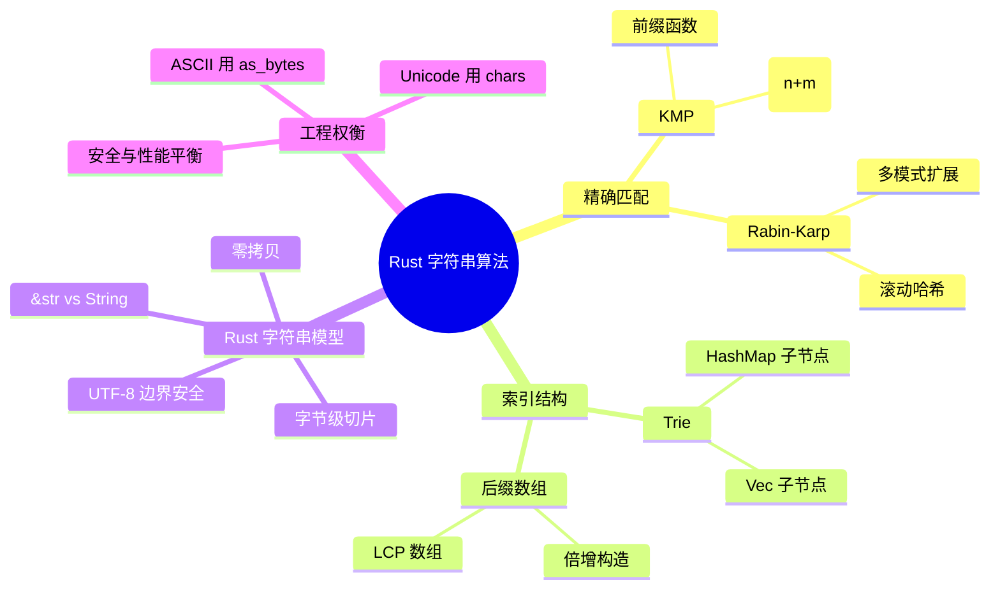
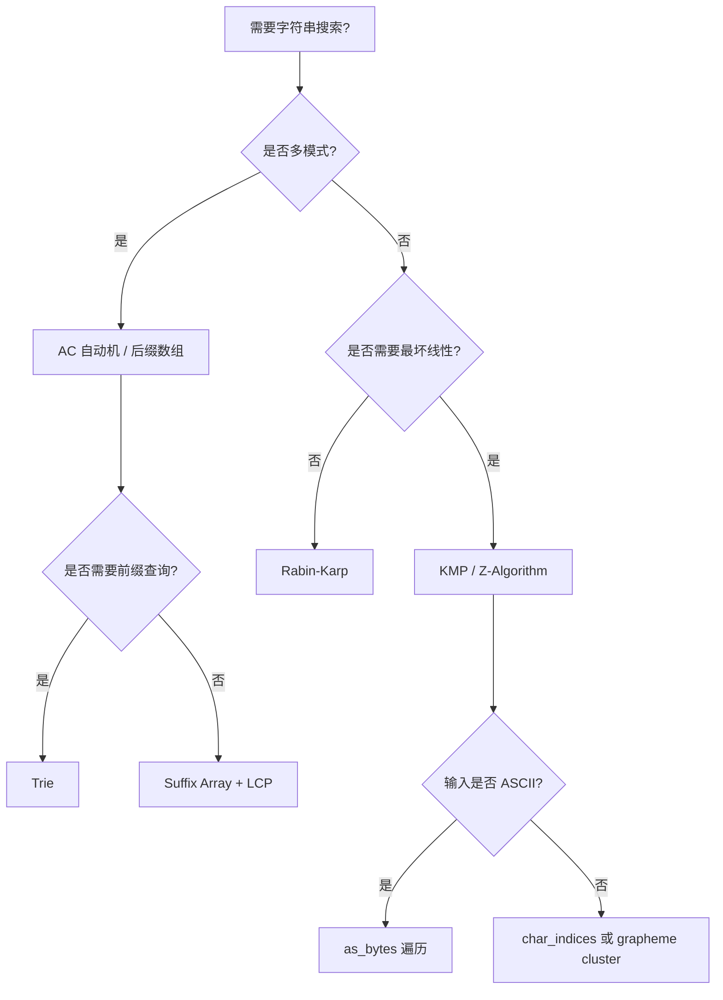

> **内容分级**: [专家级]
> **本节关键术语**: 字符串算法 (String Algorithms) · Knuth-Morris-Pratt (KMP) · Rabin-Karp · 滚动哈希 (Rolling Hash) · Trie (前缀树) · 后缀数组 (Suffix Array) · UTF-8 边界 (UTF-8 Boundary) · 零拷贝切片 (Zero-Copy Slicing) · 字符串匹配 (String Matching) — [完整对照表](../../00_meta/01_terminology/01_terminology_glossary.md)

# Rust 中的字符串算法

**EN**: String Algorithms in Rust
**Summary**: KMP, Rabin-Karp rolling hash, trie with HashMap/Vec, and suffix array basics implemented in Rust, with &str/String ownership, UTF-8 boundary safety, and zero-copy slicing idioms.

> **Rust 版本**: 1.97.0+ (Edition 2024)
> **Bloom 层级**: L5-L6
> **权威来源**: 本文件为 `concept/` 权威页。
> **A/S/P 标记**: **S+P** — Structure + Procedure
> **定位**: 在 Rust 字符串所有权与 UTF-8 安全模型下实现经典字符串算法，重点解决“何时按字节、何时按字符、如何零拷贝切片”的问题。
> **前置概念**: [算法模式概述](00_algorithm_patterns_overview.md) · [算法范式深潜](01_algorithmic_paradigms.md) · [动态规划 Rust 实现](06_dynamic_programming_in_rust.md)
> **后置概念**: [缓存友好与 SIMD 算法](04_cache_friendly_and_simd_algorithms.md) · [零拷贝解析](../11_domain_applications/26_zero_copy_parsing_in_rust.md) · [所有权感知算法](../11_domain_applications/27_ownership_aware_algorithms.md)
> **L5 对比**: [Rust vs C++](../../05_comparative/01_systems_languages/01_rust_vs_cpp.md)

---

> **来源 / Provenance**:
> [Knuth, Morris & Pratt — *Fast Pattern Matching in Strings*](https://doi.org/10.1137/0206024) ·
> [Karp & Rabin — *Efficient Randomized Pattern-Matching Algorithms*](https://doi.org/10.1145/62.322090) ·
> [Manber & Myers — *Suffix Arrays: A New Method for On-Line String Searches*](https://doi.org/10.1137/0217053) ·
> [The Rust Programming Language](https://doc.rust-lang.org/book/title-page.html) ·
> [Rust std::str](https://doc.rust-lang.org/std/str/index.html)

---

## 🧠 知识结构图



> **认知功能**: 本 mindmap 从“匹配 → 索引 → 字符串模型 → 工程权衡”组织，帮助读者根据输入编码与性能需求选择实现策略。

---

## 一、权威定义

**字符串算法**处理字符序列的搜索、匹配、压缩、索引与比较。在 Rust 中，字符串不仅是字节序列，还是**合法的 UTF-8 编码序列**。因此算法实现必须区分：

- **字节级算法**：把 `&str` 视为 `&[u8]`，适用于 ASCII 或已知编码的场景，性能最高。
- **标量值级算法**：使用 `chars()` 遍历 Unicode 标量值，语义正确但可能更慢。
- **字素簇级算法**：使用 `unicode-segmentation` 等 crate 处理组合字符，属于更高层语义。

**零拷贝切片（Zero-Copy Slicing）**：Rust 的 `&str` 可以是对 `String`、`Vec<u8>` 或静态字符串的借用；切分操作 `&s[i..j]` 只复制指针与长度，不复制底层字符数据。

> **来源**: [KMP 1977](https://doi.org/10.1137/0206024) · [Karp & Rabin 1987](https://doi.org/10.1145/62.322090) · [Manber & Myers 1993](https://doi.org/10.1137/0217053)

---

## 二、Rust 惯用法

### 2.1 KMP：前缀函数与线性匹配

KMP 通过预处理模式串的前缀函数，避免匹配失败时主串指针回退。

```rust
fn compute_prefix(pattern: &[u8]) -> Vec<usize> {
    let m = pattern.len();
    let mut pi = vec![0; m];
    let mut k = 0;
    for q in 1..m {
        while k > 0 && pattern[k] != pattern[q] {
            k = pi[k - 1];
        }
        if pattern[k] == pattern[q] {
            k += 1;
            pi[q] = k;
        }
    }
    pi
}

fn kmp_search(text: &str, pattern: &str) -> Option<usize> {
    if pattern.is_empty() {
        return Some(0);
    }
    let (text, pattern) = (text.as_bytes(), pattern.as_bytes());
    let pi = compute_prefix(pattern);
    let mut q = 0usize;
    for (i, &ch) in text.iter().enumerate() {
        while q > 0 && pattern[q] != ch {
            q = pi[q - 1];
        }
        if pattern[q] == ch {
            q += 1;
        }
        if q == pattern.len() {
            return Some(i + 1 - pattern.len());
        }
    }
    None
}

fn main() {
    let text = "ABC ABCDAB ABCDABCDABDE";
    assert_eq!(kmp_search(text, "ABCDABD"), Some(15));
}
```

**所有权要点**：输入 `&str` 为不可变借用，前缀函数 `pi` 为本地分配；返回值 `Option<usize>` 是匹配到的字节偏移，不持有输入数据。

### 2.2 Rabin-Karp：滚动哈希

滚动哈希用 `O(1)` 时间滑动窗口，适合多模式匹配与重复检测。示例使用 64 位无符号整数并取大素数模。

```rust
fn rabin_karp_search(text: &str, pattern: &str, base: u64, modulus: u64) -> Option<usize> {
    if pattern.is_empty() {
        return Some(0);
    }
    let (text, pattern) = (text.as_bytes(), pattern.as_bytes());
    let n = text.len();
    let m = pattern.len();
    if m > n {
        return None;
    }

    let mut pattern_hash = 0u64;
    let mut window_hash = 0u64;
    let mut pow = 1u64;

    for i in 0..m {
        pattern_hash = (pattern_hash * base + pattern[i] as u64) % modulus;
        window_hash = (window_hash * base + text[i] as u64) % modulus;
        if i > 0 {
            pow = (pow * base) % modulus;
        }
    }

    if pattern_hash == window_hash && &text[0..m] == pattern {
        return Some(0);
    }

    for i in m..n {
        let out = text[i - m] as u64;
        let incoming = text[i] as u64;
        window_hash = (window_hash + modulus - (out * pow) % modulus) % modulus;
        window_hash = (window_hash * base + incoming) % modulus;

        let start = i + 1 - m;
        if pattern_hash == window_hash && &text[start..start + m] == pattern {
            return Some(start);
        }
    }
    None
}

fn main() {
    let text = "ABABDABACDABABCABAB";
    assert_eq!(rabin_karp_search(text, "ABABCABAB", 256, 1_000_000_007), Some(10));
}
```

**哈希冲突**：哈希相等时必须逐字节比较确认，避免伪匹配。

### 2.3 Trie：用 `HashMap` 实现前缀树

Trie 适合前缀搜索、自动补全与多模式字典。`HashMap<u8, TrieNode>` 版本对字节字符集通用，但每个节点有额外分配开销。

```rust
use std::collections::HashMap;

#[derive(Default)]
struct TrieNode {
    children: HashMap<u8, TrieNode>,
    is_end: bool,
}

#[derive(Default)]
struct Trie {
    root: TrieNode,
}

impl Trie {
    fn insert(&mut self, word: &str) {
        let mut node = &mut self.root;
        for &b in word.as_bytes() {
            node = node.children.entry(b).or_default();
        }
        node.is_end = true;
    }

    fn search(&self, word: &str) -> bool {
        self.find_node(word).map_or(false, |n| n.is_end)
    }

    fn starts_with(&self, prefix: &str) -> bool {
        self.find_node(prefix).is_some()
    }

    fn find_node(&self, word: &str) -> Option<&TrieNode> {
        let mut node = &self.root;
        for &b in word.as_bytes() {
            node = node.children.get(&b)?;
        }
        Some(node)
    }
}

fn main() {
    let mut trie = Trie::default();
    trie.insert("rust");
    trie.insert("rustc");
    assert!(trie.search("rust"));
    assert!(!trie.search("ru"));
    assert!(trie.starts_with("ru"));
}
```

**所有权要点**：`insert` 通过 `&mut self` 修改树；`search`/`starts_with` 仅取 `&self`。Rust 借用检查器保证并发读安全。

### 2.4 Trie：用 `Vec<Option<usize>>` 压缩固定字符集

对于 ASCII 或有限字母表，可用固定大小数组索引子节点，避免 `HashMap` 的分配与哈希开销。

```rust
const ALPHABET: usize = 26;

struct ArrayTrie {
    next: Vec<[Option<usize>; ALPHABET]>,
    is_end: Vec<bool>,
}

impl ArrayTrie {
    fn new() -> Self {
        Self {
            next: vec![[None; ALPHABET]],
            is_end: vec![false],
        }
    }

    fn insert(&mut self, word: &str) {
        let mut node = 0usize;
        for ch in word.bytes() {
            let idx = (ch - b'a') as usize;
            if self.next[node][idx].is_none() {
                self.next[node][idx] = Some(self.next.len());
                self.next.push([None; ALPHABET]);
                self.is_end.push(false);
            }
            node = self.next[node][idx].unwrap();
        }
        self.is_end[node] = true;
    }

    fn search(&self, word: &str) -> bool {
        self.walk(word).map_or(false, |n| self.is_end[n])
    }

    fn walk(&self, word: &str) -> Option<usize> {
        let mut node = 0usize;
        for ch in word.bytes() {
            let idx = (ch - b'a') as usize;
            node = self.next[node][idx]?;
        }
        Some(node)
    }
}

fn main() {
    let mut trie = ArrayTrie::new();
    trie.insert("rust");
    assert!(trie.search("rust"));
}
```

**布局收益**：所有节点连续存储在 `Vec` 中，CPU cache 局部性优于分散的 `HashMap` 节点。

### 2.5 后缀数组基础

后缀数组是字符串所有后缀按字典序排序后的起始位置数组。最朴素的 `O(n² log n)` 构造对教学足够清晰；工业级实现使用倍增法或 SA-IS。

```rust
fn suffix_array_naive(s: &str) -> Vec<usize> {
    let bytes = s.as_bytes();
    let mut suffixes: Vec<usize> = (0..bytes.len()).collect();
    suffixes.sort_by(|&i, &j| bytes[i..].cmp(&bytes[j..]));
    suffixes
}

fn main() {
    let s = "banana";
    assert_eq!(suffix_array_naive(s), vec![5, 3, 1, 0, 4, 2]);
}
```

**零拷贝**：`suffixes` 只保存索引；排序比较器通过索引比较 `bytes` 的切片视图，不复制后缀内容。

### 2.6 `&str` / `String` 与 UTF-8 边界安全

```rust
fn ascii_slice(s: &str, start: usize, end: usize) -> &str {
    // 仅当确认输入为 ASCII 时安全；否则应使用字符边界 API
    &s[start..end]
}

fn safe_unicode_prefix(s: &str, n_chars: usize) -> &str {
    match s.char_indices().nth(n_chars) {
        Some((idx, _)) => &s[..idx],
        None => s,
    }
}

fn main() {
    let s = "Rust 编程";
    assert_eq!(safe_unicode_prefix(s, 5), "Rust ");
    assert_eq!(safe_unicode_prefix(s, 6), "Rust 编");
}
```

**安全要点**：按字节索引 `&str` 会在非 ASCII 边界触发 panic；应使用 `char_indices()`、`is_char_boundary` 或 `split_at`。

---

## 三、反例与边界

### 反例 1：按字节切片破坏 UTF-8 边界

```rust,ignore
// ❌ 错误示例：运行时会 panic；不应直接提交给 checker
fn main() {
    let s = "Rust 编程";
    // "编" 在 UTF-8 中占 3 字节，从字节 6 切开会 panic
    let _bad = &s[6..7];
}
```

```rust
fn main() {
    let s = "Rust 编程";
    // ✅ 正确：使用字符边界
    let prefix = match s.char_indices().nth(6) {
        Some((idx, _)) => &s[..idx],
        None => s,
    };
    assert_eq!(prefix, "Rust 编程");
}
```

**结论**：任何字符串切片操作前必须确认索引落在字符边界上；对任意字节索引使用 `Index` 会在非边界处触发运行时 panic。

### 反例 2：滚动哈希模溢出导致假阳性

```rust
fn rabin_karp_no_verify(text: &str, pattern: &str, base: u64, modulus: u64) -> Option<usize> {
    // ❌ 错误：哈希相等但不逐字节比较
    let (text, pattern) = (text.as_bytes(), pattern.as_bytes());
    let n = text.len();
    let m = pattern.len();
    if m > n {
        return None;
    }
    let mut ph = 0u64;
    let mut wh = 0u64;
    let mut pow = 1u64;
    for i in 0..m {
        ph = (ph * base + pattern[i] as u64) % modulus;
        wh = (wh * base + text[i] as u64) % modulus;
        if i > 0 {
            pow = (pow * base) % modulus;
        }
    }
    if ph == wh {
        return Some(0); // 可能哈希冲突
    }
    for i in m..n {
        wh = (wh + modulus - (text[i - m] as u64 * pow) % modulus) % modulus;
        wh = (wh * base + text[i] as u64) % modulus;
        if ph == wh {
            return Some(i + 1 - m); // 未验证
        }
    }
    None
}

fn main() {
    // 构造极长字符串让示例可运行；真实冲突概率极低但不可接受
    assert!(rabin_karp_no_verify("hello world", "world", 256, 97).is_some());
}
```

**结论**：Rabin-Karp 的哈希相等只是候选；必须做完整的字节/字符比较确认。

### 反例 3：Trie 假设 ASCII 却传入多字节字符

```rust
fn main() {
    let word = "café";
    for (i, &b) in word.as_bytes().iter().enumerate() {
        // 若把每个字节当做一个节点键，é (0xc3 0xa9) 会被拆成两个节点
        println!("byte {}: 0x{:02x}", i, b);
    }
    // 正确做法：按 Unicode 标量值构建节点，或使用字节索引但语义上明确
}
```

**边界注意**：

- KMP 返回的是字节偏移；若需字符偏移，需用 `text[..idx].chars().count()` 转换。
- 后缀数组的朴素实现是 `O(n² log n)`，大数据量需使用倍增或 SA-IS 优化。
- Trie 的 `HashMap` 版本在内存上不如数组版本紧凑，但支持任意字节键。

---

## 四、复杂度与选型

| 算法/结构 | 时间复杂度 | 空间复杂度 | 适用场景 | Rust 特化收益 |
|:---|:---|:---|:---|:---|
| **KMP** | `O(n + m)` | `O(m)` | 单模式精确匹配 | `as_bytes()` 字节级安全遍历 |
| **Rabin-Karp** | 平均 `O(n + m)`，最坏 `O(n·m)` | `O(1)` | 多模式、重复检测 | `u64` 模运算与零拷贝切片验证 |
| **Trie (HashMap)** | `O(L)` 插入/查询 | `O(总节点数)` | 通用前缀搜索、自动补全 | `HashMap<u8, Node>` 类型安全键 |
| **Trie (Vec 数组)** | `O(L)` | `O(Σ·节点数)` | 固定小字母表 | 连续内存、cache 友好 |
| **后缀数组（朴素）** | `O(n² log n)` | `O(n)` | 教学、短字符串 | 只存索引，不复制后缀 |
| **后缀数组（倍增）** | `O(n log² n)` / `O(n log n)` | `O(n)` | 长字符串索引 | 可用 `Vec<usize>` 排序 + rank |

**选型决策树**：



---

## 五、权威来源索引

- **P0 官方**: [The Rust Programming Language](https://doc.rust-lang.org/book/title-page.html)
- **P0 官方**: [Rust std::str](https://doc.rust-lang.org/std/str/index.html)
- **P0 官方**: [String slicing — doc.rust-lang.org](https://doc.rust-lang.org/std/primitive.str.html#method.is_char_boundary)
- **P1 学术**: [Knuth, Morris & Pratt — *Fast Pattern Matching in Strings*, SIAM J. Comput. 1977](https://doi.org/10.1137/0206024)
- **P1 学术**: [Karp & Rabin — *Efficient Randomized Pattern-Matching Algorithms*, IBM J. Res. Dev. 1987](https://doi.org/10.1145/62.322090)
- **P1 学术**: [Manber & Myers — *Suffix Arrays: A New Method for On-Line String Searches*, SIAM J. Comput. 1993](https://doi.org/10.1137/0217053)
- **P1 学术**: [A New Efficient Suffix Array Compression Technique — arXiv:2407.18753](https://arxiv.org/abs/2407.18753)
- **P2 生态**: [docs.rs — unicode-segmentation](https://docs.rs/unicode-segmentation/latest/unicode_segmentation/)（Unicode 字素簇处理）
- **P2 生态**: [docs.rs — regex](https://docs.rs/regex/latest/regex/)（生产级正则匹配，基于 NFA/DFA）

> **文档版本**: 1.0 ｜ **最后更新**: 2026-08-03 ｜ **状态**: ✅ 新建权威页

## 国际化权威来源补充（International Authority Sources）

- <https://doi.org/10.1137/0206024>
- <https://doi.org/10.1145/62.322090>
- <https://doi.org/10.1137/0217053>
- <https://arxiv.org/abs/2407.18753>
- <https://doc.rust-lang.org/std/str/index.html>
