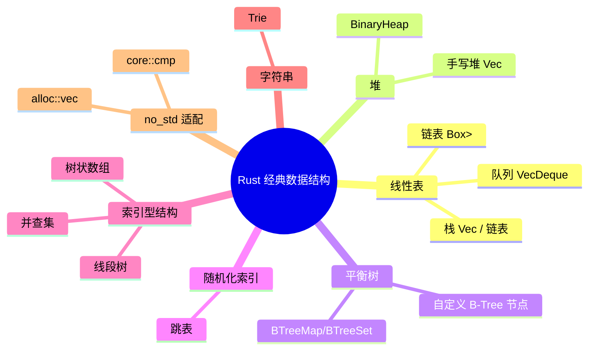
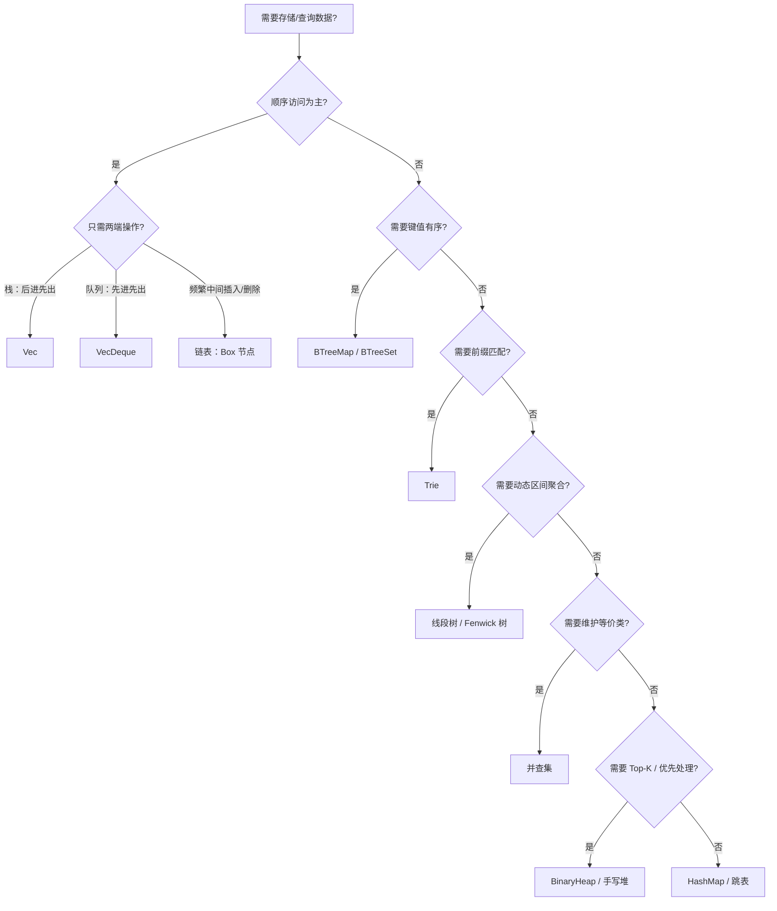

# Rust 中的经典数据结构

**EN**: Classic Data Structures in Rust
**Summary**: Ownership-aware, no_std-adaptable implementations and semantic analysis of linked lists, stacks, queues, heaps, B-trees, skip lists, union-find, segment trees, and tries in Rust.

> **Rust 版本**: 1.97.0+ (Edition 2024)
> **Bloom 层级**: L4-L6
> **权威来源**: 本文件为 `concept/` 权威页。
> **定位**: 将 CLRS / Sedgewick / Rust Algorithm Club 中的经典数据结构翻译为 Rust 所有权模型下的实现，重点分析指针替代方案、索引型布局、`no_std` 适配与自定义分配器接口。
> **前置概念**: [Ownership](../../01_foundation/01_ownership_borrow_lifetime/01_ownership.md) · [Borrowing](../../01_foundation/01_ownership_borrow_lifetime/02_borrowing.md) · [泛型](../../02_intermediate/01_generics/01_generics.md) · [算法模式概述](00_algorithm_patterns_overview.md) · [所有权感知的数据结构](02_ownership_aware_data_structures.md)
> **后置概念**: [图算法 Rust 实现](03_graph_algorithms_in_rust.md) · [字符串算法 Rust 实现](07_string_algorithms_in_rust.md) · [c08_algorithms crate docs](../../../crates/c08_algorithms/docs/README.md)
> **L5 对比**: [Rust vs C++](../../05_comparative/01_systems_languages/01_rust_vs_cpp.md)

---

> **来源 / Provenance**:
> [Cormen, Leiserson, Rivest & Stein — *Introduction to Algorithms*, 4th ed.](https://mitpress.mit.edu/9780262046305/introduction-to-algorithms/) ·
> [Sedgewick & Wayne — *Algorithms*, 4th ed.](https://algs4.cs.princeton.edu/home/) ·
> [Rust Algorithm Club](https://rust-algo.club/) ·
> [The Rust Programming Language](https://doc.rust-lang.org/book/title-page.html) ·
> [The Rustonomicon](https://doc.rust-lang.org/nomicon/)

---

## 思维导图



> **认知功能**: 本 mindmap 按数据结构的内存组织方式分组，帮助读者根据「是否需要指针、是否顺序存储、是否索引化」快速选择 Rust 实现策略。

---

## 一、权威定义

**Rust 中的数据结构实现** 不仅是翻译教科书伪代码，而是将所有权、借用、生命周期与类型系统作为设计约束。核心问题从「如何用指针连接节点」变成「如何在编译期排除别名冲突、越界访问与 use-after-free」。

**所有权感知设计的三条原则**：

1. **能用索引就不用裸指针**：`Vec<T>` 加下标可替代大部分树/图的指针链接，避免自引用与别名问题。
2. **修改必须显式化**：所有副作用通过 `&mut self` 暴露，调用方在签名中即可看到结构变化。
3. **`no_std` 不等于无数据结构**：`core` + `alloc` 提供 `Vec`、`Box`、`BinaryHeap` 等；标准库的高级容器只是对这些原语的封装。

> **来源**: [CLRS 2022](https://mitpress.mit.edu/9780262046305/introduction-to-algorithms/) · [Sedgewick & Wayne 2011](https://algs4.cs.princeton.edu/home/)

---

## 二、线性表

### 2.1 链表（单链表栈）

Rust 中手写链表最常见的问题是「自引用」与「所有权转移」。用 `Option<Box<Node<T>>>` 作为 `head` 可以表达「要么空，要么拥有一个节点」，同时 `take()` 允许临时取出所有权再重新组装。

```rust
struct Node<T> {
    val: T,
    next: Option<Box<Node<T>>>,
}

pub struct ListStack<T> {
    head: Option<Box<Node<T>>>,
}

impl<T> ListStack<T> {
    pub fn new() -> Self {
        Self { head: None }
    }

    pub fn push(&mut self, val: T) {
        self.head = Some(Box::new(Node {
            val,
            next: self.head.take(),
        }));
    }

    pub fn pop(&mut self) -> Option<T> {
        self.head.take().map(|node| {
            self.head = node.next;
            node.val
        })
    }

    pub fn peek(&self) -> Option<&T> {
        self.head.as_ref().map(|node| &node.val)
    }
}

fn main() {
    let mut s = ListStack::new();
    s.push(1);
    s.push(2);
    assert_eq!(s.pop(), Some(2));
    assert_eq!(s.peek(), Some(&1));
    assert_eq!(s.pop(), Some(1));
    assert_eq!(s.pop(), None);
}
```

**所有权要点**：

- `Box<Node<T>>` 拥有节点及其后续链；`take()` 把 `Option` 置空并交出所有权，避免部分移动（partial move）错误。
- `peek` 只返回不可变借用，因此与 `push`/`pop` 互斥，借用检查器在编译期保证。

### 2.2 栈（Vec-based）

```rust
fn reverse_with_stack<T>(input: Vec<T>) -> Vec<T> {
    let mut stack = input;
    let mut out = Vec::with_capacity(stack.len());
    while let Some(x) = stack.pop() {
        out.push(x);
    }
    out
}

fn main() {
    assert_eq!(reverse_with_stack(vec![1, 2, 3]), vec![3, 2, 1]);
}
```

`Vec` 的 `push`/`pop` 在末尾操作，摊还 `O(1)`，是 Rust 中栈的首选实现。只有在需要 `O(1)` 最坏情况或无法预知容量时，才考虑链表栈。

### 2.3 队列（VecDeque）

```rust
use std::collections::VecDeque;

fn bfs_layer(start: usize, adj: &[Vec<usize>]) -> Vec<usize> {
    let mut q = VecDeque::new();
    let mut visited = vec![false; adj.len()];
    let mut order = Vec::new();
    q.push_back(start);
    visited[start] = true;

    while let Some(u) = q.pop_front() {
        order.push(u);
        for &v in &adj[u] {
            if !visited[v] {
                visited[v] = true;
                q.push_back(v);
            }
        }
    }
    order
}

fn main() {
    let adj = vec![vec![1, 2], vec![3], vec![], vec![]];
    assert_eq!(bfs_layer(0, &adj), vec![0, 1, 2, 3]);
}
```

`VecDeque` 用环形缓冲区实现，两端操作均为摊还 `O(1)`，且缓存友好。

---

## 三、堆

### 3.1 标准库 `BinaryHeap`

```rust
use std::collections::BinaryHeap;
use std::cmp::Reverse;

fn kth_largest(nums: &[i32], k: usize) -> Option<i32> {
    let mut heap = BinaryHeap::with_capacity(k);
    for &n in nums {
        if heap.len() < k {
            heap.push(Reverse(n));
        } else if n > heap.peek()?.0 {
            heap.pop();
            heap.push(Reverse(n));
        }
    }
    heap.pop().map(|Reverse(n)| n)
}

fn main() {
    assert_eq!(kth_largest(&[3, 2, 1, 5, 6, 4], 2), Some(5));
}
```

### 3.2 手写最小堆

```rust
struct MinHeap<T: Ord> {
    data: Vec<T>,
}

impl<T: Ord> MinHeap<T> {
    fn new() -> Self {
        Self { data: Vec::new() }
    }

    fn push(&mut self, v: T) {
        self.data.push(v);
        let mut i = self.data.len() - 1;
        while i > 0 {
            let p = (i - 1) / 2;
            if self.data[i] >= self.data[p] {
                break;
            }
            self.data.swap(i, p);
            i = p;
        }
    }

    fn pop(&mut self) -> Option<T> {
        let n = self.data.len();
        if n == 0 {
            return None;
        }
        self.data.swap(0, n - 1);
        let val = self.data.pop()?;
        let mut i = 0;
        loop {
            let l = 2 * i + 1;
            let r = 2 * i + 2;
            let mut smallest = i;
            if l < self.data.len() && self.data[l] < self.data[smallest] {
                smallest = l;
            }
            if r < self.data.len() && self.data[r] < self.data[smallest] {
                smallest = r;
            }
            if smallest == i {
                break;
            }
            self.data.swap(i, smallest);
            i = smallest;
        }
        Some(val)
    }
}

fn main() {
    let mut h = MinHeap::new();
    for &x in &[5, 1, 3, 2, 4] {
        h.push(x);
    }
    let mut sorted = Vec::new();
    while let Some(x) = h.pop() {
        sorted.push(x);
    }
    assert_eq!(sorted, vec![1, 2, 3, 4, 5]);
}
```

**所有权要点**：堆用 `Vec` 的连续存储模拟完全二叉树，父节点与子节点的关系仅由索引算术决定，无需指针。

---

## 四、B-树

Rust 标准库提供 `std::collections::BTreeMap` 与 `BTreeSet`，它们基于 B-树实现有序映射/集合。下面展示一个**简化 B-Tree 节点**的搜索语义，帮助理解索引与借用关系；完整分裂/插入算法见标准库源码。

```rust
use std::cmp::Ordering;

struct BTreeNode<K, V> {
    keys: Vec<K>,
    values: Vec<V>,
    children: Vec<Box<BTreeNode<K, V>>>,
}

impl<K: Ord, V> BTreeNode<K, V> {
    fn new() -> Self {
        Self {
            keys: Vec::new(),
            values: Vec::new(),
            children: Vec::new(),
        }
    }

    fn search(&self, key: &K) -> Option<&V> {
        match self.keys.binary_search_by(|k| k.cmp(key)) {
            Ok(i) => Some(&self.values[i]),
            Err(i) if i < self.children.len() => self.children[i].search(key),
            _ => None,
        }
    }
}

fn main() {
    let mut root = BTreeNode::<i32, &str>::new();
    root.keys.push(2);
    root.values.push("two");
    root.children.push(Box::new(BTreeNode::new()));
    root.children[0].keys.push(1);
    root.children[0].values.push("one");
    assert_eq!(root.search(&1), Some(&"one"));
    assert_eq!(root.search(&3), None);
}
```

**所有权要点**：

- 所有子节点由父节点通过 `Box` 拥有，形成树的所有权层次，天然避免别名。
- 搜索是 `&self` 的只读操作；插入/删除需要 `&mut self` 并沿路径向下修改。

---

## 五、跳表（Skip List）

跳表用概率分层在有序链表上建立「快速通道」，期望查询/插入/删除 `O(log n)`。Rust 实现中，层数组用 `Vec<Option<Box<Node>>>` 表达，每个节点拥有下一层链接。

```rust
use std::cmp::Ordering;

struct SkipNode<T: Ord + Default> {
    val: T,
    next: Vec<Option<Box<SkipNode<T>>>>,
}

struct SkipList<T: Ord + Default> {
    head: Box<SkipNode<T>>,
    max_level: usize,
}

impl<T: Ord + Default> SkipList<T> {
    fn new(max_level: usize) -> Self {
        let mut head = Box::new(SkipNode {
            val: T::default(),
            next: Vec::with_capacity(max_level),
        });
        for _ in 0..max_level {
            head.next.push(None);
        }
        Self { head, max_level }
    }

    fn search(&self, target: &T) -> bool {
        let mut cur = &self.head;
        for lvl in (0..self.max_level).rev() {
            loop {
                let next_opt = cur.next.get(lvl).and_then(|o| o.as_ref());
                match next_opt {
                    Some(next) => match next.val.cmp(target) {
                        Ordering::Less => cur = next,
                        Ordering::Equal => return true,
                        Ordering::Greater => break,
                    },
                    None => break,
                }
            }
        }
        false
    }
}

fn main() {
    let sl = SkipList::<i32>::new(4);
    assert!(!sl.search(&5));
}
```

> 生产实现还需随机层数生成、插入/删除时的「前进数组」（update vector）以及哨兵值的类型安全替代方案。详见 [Pugh — Skip Lists: A Probabilistic Alternative to Balanced Trees](https://dl.acm.org/doi/10.1145/78973.78977)。

---

## 六、并查集、线段树、树状数组

这三种**索引型数据结构**在 Rust 中的惯用实现见 [`所有权感知的数据结构`](02_ownership_aware_data_structures.md)。本页不再重复其完整正文，仅给出选型语义：

| 数据结构 | 核心抽象 | 所有权模式 | 复杂度 | `no_std` 要点 |
|:---|:---|:---|:---:|:---|
| 并查集 | 等价类 | `&mut self` 路径压缩 | 摊还 `O(α(n))` | 仅需 `Vec<usize>` |
| 线段树 | 区间聚合 | `&self` 查询 / `&mut self` 更新 | `O(log n)` | 连续 `Vec` 堆式存储 |
| 树状数组 | 前缀和 / 单点增 | `&self` 前缀和 / `&mut self` 更新 | `O(log n)` | 避开 `lowbit(0)`，索引从 1 开始 |

> **Canonical 链接**: 完整实现、反例与复杂度证明请见 [`02_ownership_aware_data_structures.md`](02_ownership_aware_data_structures.md)。

---

## 七、Trie（前缀树）

```rust
use std::collections::HashMap;

struct TrieNode {
    children: HashMap<char, TrieNode>,
    is_end: bool,
}

struct Trie {
    root: TrieNode,
}

impl Trie {
    fn new() -> Self {
        Self {
            root: TrieNode {
                children: HashMap::new(),
                is_end: false,
            },
        }
    }

    fn insert(&mut self, word: &str) {
        let mut node = &mut self.root;
        for ch in word.chars() {
            node = node
                .children
                .entry(ch)
                .or_insert_with(|| TrieNode {
                    children: HashMap::new(),
                    is_end: false,
                });
        }
        node.is_end = true;
    }

    fn search(&self, word: &str) -> bool {
        self.find(word).map_or(false, |n| n.is_end)
    }

    fn starts_with(&self, prefix: &str) -> bool {
        self.find(prefix).is_some()
    }

    fn find(&self, word: &str) -> Option<&TrieNode> {
        let mut node = &self.root;
        for ch in word.chars() {
            node = node.children.get(&ch)?;
        }
        Some(node)
    }
}

fn main() {
    let mut trie = Trie::new();
    trie.insert("rust");
    trie.insert("rustc");
    assert!(trie.search("rust"));
    assert!(!trie.search("ru"));
    assert!(trie.starts_with("ru"));
    assert!(trie.search("rustc"));
}
```

**所有权要点**：

- `HashMap<char, TrieNode>` 让父节点直接拥有子节点，避免 `Box` 分配，但节点在哈希表中移动时地址会变化；因此 Trie 节点一般**不**对外暴露地址/自引用。
- `chars()` 按 Unicode 标量值遍历，天然处理多字节字符；不能用 `&str[..1]` 做索引，否则可能切分 UTF-8 编码单元。

---

## 八、`no_std` 适配

`no_std` Rust 仍可通过 `alloc` crate 使用 `Vec`、`Box`、`BinaryHeap` 等数据结构。核心变化：

1. 使用 `#![no_std]` 并 `extern crate alloc;`
2. 用 `core::cmp::Ordering` 替代 `std::cmp::Ordering`
3. 避免 `std::collections::HashMap`（默认 hasher 依赖 `std`），改用 `BTreeMap`、数组或第三方 `hashbrown`（带 `alloc` 特性）

```rust,nostd
#![no_std]
extern crate alloc;

use alloc::boxed::Box;

struct Node<T> {
    val: T,
    next: Option<Box<Node<T>>>,
}

pub struct NoStdStack<T> {
    head: Option<Box<Node<T>>>,
}

impl<T> NoStdStack<T> {
    pub fn new() -> Self {
        Self { head: None }
    }

    pub fn push(&mut self, val: T) {
        self.head = Some(Box::new(Node {
            val,
            next: self.head.take(),
        }));
    }

    pub fn pop(&mut self) -> Option<T> {
        self.head.take().map(|n| {
            self.head = n.next;
            n.val
        })
    }
}
```

> `BinaryHeap` 本身在 `alloc` 中可用；`VecDeque` 也在 `alloc` 中可用。`HashMap` 在 `std` 之外需要显式依赖 `hashbrown`（启用 `alloc` 特性）作为零分配替代。

---

## 九、多维对比矩阵

| 数据结构 | 核心操作 | 时间复杂度 | 空间 | 所有权/借用模式 | `no_std` 友好 |
|:---|:---|:---:|:---:|:---|:---:|
| `Vec` 栈 | push / pop | 摊还 `O(1)` | `O(n)` | `&mut self` 修改 | ✅ |
| 链表栈 | push / pop | 严格 `O(1)` | `O(n)` | `Box` 链 + `take()` | ✅（需 `alloc`） |
| `VecDeque` | 两端 push/pop | 摊还 `O(1)` | `O(n)` | `&mut self` | ✅ |
| `BinaryHeap` | push / pop | `O(log n)` | `O(n)` | `&mut self` | ✅ |
| 手写堆 | push / pop | `O(log n)` | `O(n)` | 连续 `Vec` | ✅ |
| `BTreeMap`/`BTreeSet` | 插入/删除/查询 | `O(log n)` | `O(n)` | `&mut self` | ✅（在 `alloc`） |
| 自定义 B-Tree | 分裂/合并 | `O(log n)` | `O(n)` | `Box` 树 + 索引 | ✅ |
| 跳表 | 查询/插入/删除 | 期望 `O(log n)` | `O(n)` | `Vec` 层数组 + `Box` | ✅ |
| 并查集 | find / union | 摊还 `O(α(n))` | `O(n)` | `&mut self` | ✅ |
| 线段树 | 单点更新 / 区间查询 | `O(log n)` | `O(n)` | `&self` / `&mut self` | ✅ |
| 树状数组 | 单点增加 / 前缀和 | `O(log n)` | `O(n)` | `&self` / `&mut self` | ✅ |
| Trie | 插入 / 前缀查询 | `O(L)` | `O(总字符数)` | `HashMap` 或数组拥有子节点 | ⚠️（`HashMap` 需 `std` 或 `hashbrown`） |

---

## 十、反例与边界

### 反例 1：用 `&str[..1]` 切分多字节字符

```rust,ignore
// 错误：UTF-8 中 '中' 占 3 字节，&word[..1] 会 panic
fn bad_prefix(word: &str) -> &str {
    &word[..1]
}
```

**修正**：使用 `word.chars().next()` 或 `char_indices()`。

### 反例 2：B-Tree 子节点索引越界

```rust,should_panic
struct BTreeNode {
    keys: Vec<i32>,
    values: Vec<&'static str>,
    children: Vec<BTreeNode>,
}

impl BTreeNode {
    fn search(&self, key: i32) -> Option<&'static str> {
        match self.keys.binary_search(&key) {
            Ok(i) => Some(self.values[i]),
            Err(i) => self.children[i].search(key), // ❌ i 可能等于 children.len()
        }
    }
}

fn main() {
    let root = BTreeNode {
        keys: vec![10],
        values: vec!["ten"],
        children: vec![],
    };
    root.search(5); // panic: index out of bounds
}
```

**修正**：搜索未命中且 `i == self.children.len()` 时返回 `None`。

### 反例 3：跳表层级越界

```rust,should_panic
struct Node {
    val: i32,
    next: Vec<Option<Box<Node>>>,
}

struct SkipList {
    head: Box<Node>,
}

impl SkipList {
    fn search(&self, target: i32) -> bool {
        let mut cur = &self.head;
        for lvl in 0..10 { // ❌ 假设 10 层，实际可能更少
            while let Some(n) = cur.next[lvl].as_ref() {
                if n.val == target { return true; }
                if n.val < target { cur = n; } else { break; }
            }
        }
        false
    }
}

fn main() {
    let sl = SkipList {
        head: Box::new(Node { val: 0, next: vec![None] }),
    };
    sl.search(1); // panic: index out of bounds
}
```

**修正**：遍历范围应使用 `self.max_level`，并对 `cur.next.get(lvl)` 做边界检查。

### 反例 4：裸指针链表导致 UB

```rust,ignore
// 危险：手动管理裸指针容易形成循环引用或 double-free
struct RawNode {
    val: i32,
    next: *mut RawNode,
}

struct RawList {
    head: *mut RawNode,
}

impl Drop for RawList {
    fn drop(&mut self) {
        // 必须手动遍历释放，若存在环则会导致 use-after-free 或内存泄漏
    }
}
```

**修正**：优先使用 `Box` / `Rc` / `Arc`；只有性能关键路径才使用 `unsafe`，并必须写 `SAFETY` 注释与 miri 测试。

### 反例 5：`BinaryHeap` 与不一致的 `Ord`

```rust,compile_fail,E0277
use std::collections::BinaryHeap;

struct Bad(i32);

impl Ord for Bad {
    fn cmp(&self, other: &Self) -> std::cmp::Ordering {
        self.0.cmp(&other.0)
    }
}
// ❌ 缺少 PartialOrd/PartialEq/Eq，不满足 BinaryHeap 的约束

fn main() {
    let _heap: BinaryHeap<Bad> = BinaryHeap::new();
}
```

**修正**：实现 `PartialEq`、`Eq`、`PartialOrd`、`Ord`，并保证全序一致性（`a == b` 当且仅当 `a.cmp(b) == Equal`）。

---

## 十一、决策树



---

## 十二、正向/反向推理示例

**正向推理**：问题要求维护动态区间和。

1. 输入是数组，查询为区间 `[l, r]`，更新为单点修改；
2. 需要 `O(log n)` 更新与查询，空间 `O(n)`；
3. 选择线段树或 Fenwick 树；
4. Rust 实现使用连续 `Vec` 堆式存储，索引访问避免借用冲突；
5. 查询用 `&self`，更新用 `&mut self`，副作用显式。

**反向推理**：目标是在 `no_std` 环境下实现 LRU 缓存。

1. `no_std` 下没有 `std::collections::HashMap`；
2. 若仍需哈希表，使用 `hashbrown`（带 `alloc`）或改用 `BTreeMap`；
3. LRU 需要按访问时间排序，可用 `intrusive_collections` 或手写双向链表 + `BTreeMap<Key, *mut Node>`；
4. 由于 `no_std` 中 `Box` 与 `BTreeMap` 均在 `alloc`，可行；
5. 检查：所有 `unsafe` 指针操作需满足别名规则，否则改用索引化的 `Vec<Node>` + 自由列表。

---

## 十三、相关概念

- [所有权感知的数据结构](02_ownership_aware_data_structures.md) — L5-L6：并查集、线段树、Fenwick 树的完整实现与所有权分析
- [算法模式概述](00_algorithm_patterns_overview.md) — L6：算法语义分类学与计算等价视角
- [图算法 Rust 实现](03_graph_algorithms_in_rust.md) — L5-L6：邻接表、BFS/DFS、Dijkstra 的借用纪律
- [字符串算法 Rust 实现](07_string_algorithms_in_rust.md) — L5-L6：KMP、Rabin-Karp、后缀数组与 UTF-8 边界
- [缓存友好与 SIMD 算法](04_cache_friendly_and_simd_algorithms.md) — L5-L6：连续内存布局与缓存行优化
- [c08_algorithms crate docs](../../../crates/c08_algorithms/docs/README.md) — 可编译代码示例

---

## 十四、权威来源索引

- **P0 官方**: [The Rust Programming Language](https://doc.rust-lang.org/book/title-page.html)
- **P0 官方**: [Rust Reference](https://doc.rust-lang.org/reference/introduction.html)
- **P0 官方**: [std::collections — VecDeque, BinaryHeap, BTreeMap](https://doc.rust-lang.org/std/collections/)
- **P1 学术**: [Cormen, Leiserson, Rivest & Stein — *Introduction to Algorithms*, 4th ed.](https://mitpress.mit.edu/9780262046305/introduction-to-algorithms/)（链表、堆、B-树、跳表、并查集、线段树、Trie）
- **P1 学术**: [Sedgewick & Wayne — *Algorithms*, 4th ed.](https://algs4.cs.princeton.edu/home/)
- **P1 学术**: [Pugh — Skip Lists: A Probabilistic Alternative to Balanced Trees, CACM 1990](https://dl.acm.org/doi/10.1145/78973.78977)
- **P2 生态**: [Rust Algorithm Club](https://rust-algo.club/)
- **P2 生态**: [The Rustonomicon](https://doc.rust-lang.org/nomicon/)（`unsafe`、别名规则、裸指针）

> **文档版本**: 1.0 ｜ **最后更新**: 2026-08-04 ｜ **状态**: ✅ 新建权威页

---

## 国际化权威来源补充（International Authority Sources）

- <https://mitpress.mit.edu/9780262046305/introduction-to-algorithms/>
- <https://algs4.cs.princeton.edu/home/>
- <https://rust-algo.club/>
- <https://doc.rust-lang.org/std/collections/>
- *Introduction to Algorithms* (CLRS) — Wikipedia：<https://en.wikipedia.org/wiki/Introduction_to_Algorithms>
- Rust Algorithm Club（GitHub）：<https://github.com/weihanglo/rust-algorithm-club>
- `heapless` crate docs（`no_std` 集合生态权威）：<https://docs.rs/heapless/latest/heapless/>
