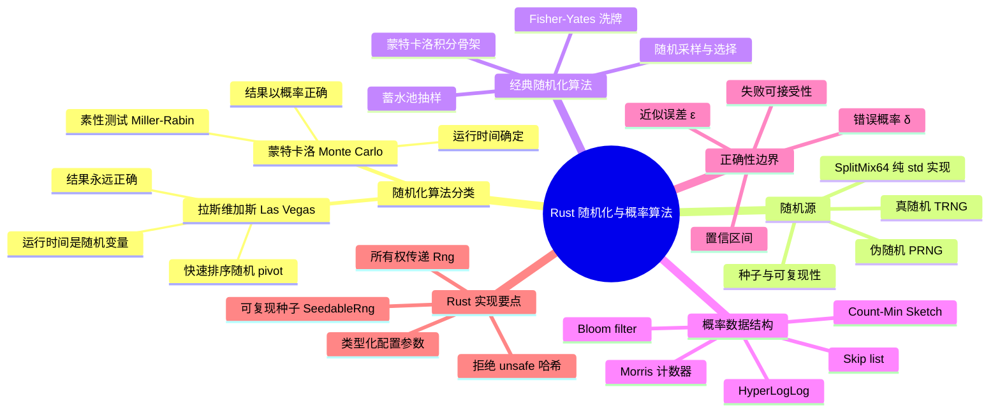
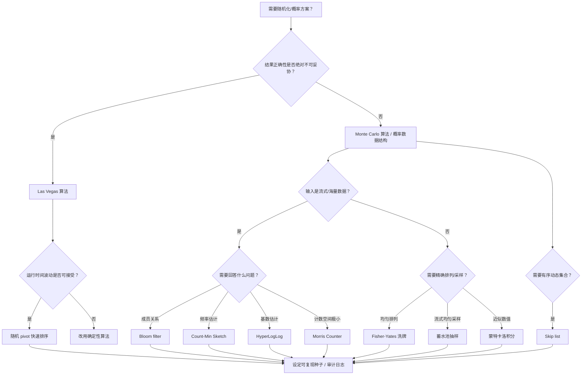

> **内容分级**: [专家级]
> **本节关键术语**:
> 随机化算法 (Randomized Algorithm) · 蒙特卡洛算法 (Monte Carlo Algorithm) · 拉斯维加斯算法 (Las Vegas Algorithm) ·
> 伪随机数生成器 (PRNG) · Fisher-Yates 洗牌 (Fisher-Yates Shuffle) · 蓄水池抽样 (Reservoir Sampling) ·
> 概率数据结构 (Probabilistic Data Structure) · Morris 计数器 (Morris Counter) · Bloom filter · Count-Min Sketch · HyperLogLog
> — [完整对照表](../../00_meta/01_terminology/01_terminology_glossary.md)

# Rust 中的随机化与概率算法

**EN**: Randomized and Probabilistic Algorithms in Rust
**Summary**: Design and implementation of randomized and probabilistic algorithms in Rust: Las Vegas vs Monte Carlo, PRNG fundamentals, Fisher-Yates shuffle, reservoir sampling, Morris counter, Bloom filter, Count-Min Sketch, HyperLogLog, and skip lists, using ownership-safe, zero-cost idioms.

> **Rust 版本**: 1.97.1+ (Edition 2024)
> **Bloom 层级**: L5-L6
> **权威来源**: 本文件为 `concept/` 权威页。
> **A/S/P 标记**: **P+S+A** — Procedure + Structure + Application
> **定位**: 在 Rust 的类型系统、所有权模型与零成本抽象下，深入讲解随机化算法与概率数据结构的设计原理、正确性边界和工程实现要点。
> **前置概念**: [算法模式概述](00_algorithm_patterns_overview.md) · [算法范式深潜](01_algorithmic_paradigms.md) · [所有权感知的数据结构](02_ownership_aware_data_structures.md) · [集合类型与哈希策略](../../01_foundation/05_collections/01_collections.md)
> **后置概念**: [前沿算法技术](../11_domain_applications/11_cutting_edge_algorithms.md) · [分布式系统协议](../06_data_and_distributed/11_distributed_systems_protocols.md) · [算法工程实践](../11_domain_applications/08_algorithm_engineering_practice.md) · [c08_algorithms crate docs](../../../crates/c08_algorithms/docs/README.md)
> **L5 对比**: [Rust vs C++](../../05_comparative/01_systems_languages/01_rust_vs_cpp.md)

---

> **来源 / Provenance**:
> [Cormen, Leiserson, Rivest & Stein — *Introduction to Algorithms*, 4th ed.](https://mitpress.mit.edu/9780262046305/introduction-to-algorithms/) ·
> [Mitzenmacher & Upfal — *Probability and Computing: Randomization and Probabilistic Techniques in Algorithms and Data Analysis*, 2nd ed.](https://www.cambridge.org/highereducation/books/probability-and-computing/3D5D8A0821B2C1A4072230CB5F2C0594) ·
> [Knuth — *The Art of Computer Programming*, Vol. 2: Seminumerical Algorithms](https://www-cs-faculty.stanford.edu/~knuth/taocp.html) ·
> [Flajolet, Fusy, Gandouet & Meunier — *HyperLogLog: the analysis of a near-optimal cardinality estimation algorithm*](https://hal.science/hal-00406166/) ·
> [Bloom — *Space/Time Trade-offs in Hash Coding with Allowable Errors* (1970)](https://dl.acm.org/doi/10.1145/362686.362692) ·
> [Pugh — *Skip Lists: A Probabilistic Alternative to Balanced Trees* (1990)](https://dl.acm.org/doi/10.1145/78973.78977) ·
> [The Rust Programming Language](https://doc.rust-lang.org/book/title-page.html) ·
> [The Rust Reference](https://doc.rust-lang.org/reference/introduction.html) ·
> [Rust API Guidelines](https://rust-lang.github.io/api-guidelines/) ·
> [docs.rs/rand](https://docs.rs/rand/latest/rand/) ·
> [docs.rs/fastrand](https://docs.rs/fastrand/latest/fastrand/)

---

## 🧠 知识结构图



> **认知功能**: 本 mindmap 从“算法分类 → 随机源 → 经典实现 → 概率数据结构 → 正确性边界 → Rust 工程要点”组织，帮助读者先判断问题适合哪类随机化方案，再落笔实现。

---

## 一、权威定义

**随机化算法（Randomized Algorithm）** 在运行过程中显式使用随机比特来指导决策。与确定性算法不同，其正确性或运行时间（或两者）是随机变量。根据保证侧重点不同，通常分为两类：

| 类型 | 正确性 | 运行时间 | 典型代表 | 适用场景 |
|:---|:---|:---|:---|:---|
| **Las Vegas** | 永远正确 | 期望有限 / 高概率有界 | 随机 pivot 快速排序、拉斯维加斯随机搜索 | 结果不可出错，可容忍运行时间波动 |
| **Monte Carlo** | 以高概率正确 / 允许可控错误 | 确定 / 高概率有界 | Miller-Rabin 素性测试、随机近似计数 | 运行时间敏感，可量化接受错误风险 |

**伪随机数生成器（PRNG）** 通过确定性算法从种子生成看似随机的数列。Rust 生态常用 `rand::rngs::StdRng`（ChaCha12，密码学安全）或 `fastrand`（轻量、非密码学安全）。在纯标准库场景下，可用 **SplitMix64** 等简单线性算法自实现，用于教学或性能不敏感场景；生产环境优先使用 `rand`。

**概率数据结构（Probabilistic Data Structure）** 用有界误差换取亚线性或常数内存。核心思想是：通过哈希函数把输入映射到固定大小的计数器/位数组，估计量只保证在 `ε` 误差、`δ` 置信度内。

---

## 二、PRNG 与 Rust 所有权

随机化算法的“状态”就是 PRNG 的熵池。Rust 中 PRNG 必须按**可变引用**传递，否则无法连续产生不重复的随机序列。

下面给出一个**仅依赖标准库**的 `SplitMix64` 实现，并演示如何把它注入洗牌与抽样函数：

```rust
/// SplitMix64：64-bit 全周期 PRNG，仅使用 std。
/// 参考：Steele, Lea & Flood (2014), "Fast Splittable Pseudorandom Number Generators".
pub struct SplitMix64 {
    state: u64,
}

impl SplitMix64 {
    pub fn new(seed: u64) -> Self {
        Self { state: seed }
    }

    pub fn next_u64(&mut self) -> u64 {
        self.state = self.state.wrapping_add(0x9e3779b97f4a7c15);
        let mut z = self.state;
        z = (z ^ (z >> 30)).wrapping_mul(0xbf58476d1ce4e5b9);
        z = (z ^ (z >> 27)).wrapping_mul(0x94d049bb133111eb);
        z ^ (z >> 31)
    }

    /// 返回 [0, n) 内的均匀 usize（当 n 为 2 的幂时完全均匀；否则存在低位偏差，
    /// 教学用；生产环境请使用 rejection sampling 或 rand::Rng::gen_range）。
    pub fn next_usize(&mut self, n: usize) -> usize {
        (self.next_u64() as usize) % n
    }
}

fn main() {
    let mut rng = SplitMix64::new(0x1234_5678_9abc_def0);
    let a = rng.next_u64();
    let b = rng.next_u64();
    assert_ne!(a, b, "连续两次调用应产生不同值");
    println!("first two u64: {a}, {b}");
}
```

> **来源对齐**: Knuth, TAOCP Vol. 2 给出线性同余与位混合 PRNG 的理论基础；SplitMix64 由 Java 社区提出，被 `rand` crate 的 `StdRng` 设计间接继承。Rust API Guidelines 推荐“类型状态应显式”——我们把 PRNG 作为 `&mut` 参数显式传入，而非依赖全局隐式状态。

---

## 三、Fisher-Yates 洗牌

Fisher-Yates（Knuth shuffle）能在 `O(n)` 时间内产生均匀随机排列，每个排列概率恰好 `1/n!`。

```rust
pub struct SplitMix64 { state: u64 }

impl SplitMix64 {
    pub fn new(seed: u64) -> Self { Self { state: seed } }
    pub fn next_u64(&mut self) -> u64 {
        self.state = self.state.wrapping_add(0x9e3779b97f4a7c15);
        let mut z = self.state;
        z = (z ^ (z >> 30)).wrapping_mul(0xbf58476d1ce4e5b9);
        z = (z ^ (z >> 27)).wrapping_mul(0x94d049bb133111eb);
        z ^ (z >> 31)
    }
    pub fn next_usize(&mut self, n: usize) -> usize { (self.next_u64() as usize) % n }
}

fn fisher_yates<T>(rng: &mut SplitMix64, slice: &mut [T]) {
    let n = slice.len();
    for i in (1..n).rev() {
        let j = rng.next_usize(i + 1);
        slice.swap(i, j);
    }
}

fn main() {
    let mut rng = SplitMix64::new(0xcafe_f00d_dead_beef);
    let mut deck: Vec<u8> = (0..52).collect();
    fisher_yates(&mut rng, &mut deck);
    println!("shuffled first 5: {:?}", &deck[..5]);
}
```

**正确性要点**:

- 循环范围是 `(1..n).rev()`，每一步从 `[0, i]` 中选 `j`。
- 若写成 `for i in 0..n { let j = rng.next_usize(n); slice.swap(i, j); }`，则排列**不均匀**（某些排列概率更高）。
- Rust 的 `slice.swap` 保证索引有效且不会引入 `unsafe`。

---

## 四、蓄水池抽样

从未知长度或极大流中均匀抽取 `k` 个元素，每个元素最终进入蓄水池的概率均为 `k/n`。

```rust
pub struct SplitMix64 { state: u64 }

impl SplitMix64 {
    pub fn new(seed: u64) -> Self { Self { state: seed } }
    pub fn next_u64(&mut self) -> u64 {
        self.state = self.state.wrapping_add(0x9e3779b97f4a7c15);
        let mut z = self.state;
        z = (z ^ (z >> 30)).wrapping_mul(0xbf58476d1ce4e5b9);
        z = (z ^ (z >> 27)).wrapping_mul(0x94d049bb133111eb);
        z ^ (z >> 31)
    }
    pub fn next_usize(&mut self, n: usize) -> usize { (self.next_u64() as usize) % n }
}

fn reservoir_sample<T: Clone>(rng: &mut SplitMix64, stream: &[T], k: usize) -> Vec<T> {
    assert!(k > 0, "k must be positive");
    let mut reservoir = stream.iter().take(k).cloned().collect::<Vec<_>>();
    for (i, item) in stream.iter().enumerate().skip(k) {
        // 元素 i 以概率 k/(i+1) 替换蓄水池中的某一个
        let j = rng.next_usize(i + 1);
        if j < k {
            reservoir[j] = item.clone();
        }
    }
    reservoir
}

fn main() {
    let mut rng = SplitMix64::new(0xbeef_cafe_1234_5678);
    let stream: Vec<u32> = (0..10_000).collect();
    let sample = reservoir_sample(&mut rng, &stream, 10);
    println!("reservoir sample: {:?}", sample);
}
```

**概率证明概要**（CLRS 习题 5.3-4）：

- 前 `k` 个元素直接进入蓄水池。
- 对于第 `i > k` 个元素，进入蓄水池的概率为 `k/i`；替换某个特定位置的概率为 `1/i`。
- 通过归纳可得，任意一个元素最终在蓄水池中的概率为 `k/n`。

---

## 五、Morris 计数器

Morris 计数器用 `O(log log n)` 比特近似计数到 `n`。每次 increment 以概率 `1/2^exponent` 增加 exponent。

```rust
pub struct SplitMix64 { state: u64 }

impl SplitMix64 {
    pub fn new(seed: u64) -> Self { Self { state: seed } }
    pub fn next_u64(&mut self) -> u64 {
        self.state = self.state.wrapping_add(0x9e3779b97f4a7c15);
        let mut z = self.state;
        z = (z ^ (z >> 30)).wrapping_mul(0xbf58476d1ce4e5b9);
        z = (z ^ (z >> 27)).wrapping_mul(0x94d049bb133111eb);
        z ^ (z >> 31)
    }
}

#[derive(Debug, Clone, Copy, Default)]
pub struct MorrisCounter {
    exponent: u8,
}

impl MorrisCounter {
    pub fn new() -> Self {
        Self { exponent: 0 }
    }

    /// 仅依赖 std 的伪随机：用 u64 低位判断。
    pub fn increment(&mut self, rng: &mut SplitMix64) {
        // 概率 = 1 / 2^exponent
        let threshold = 1u64.wrapping_shl(self.exponent as u32);
        if rng.next_u64() % threshold == 0 {
            self.exponent = self.exponent.saturating_add(1);
        }
    }

    /// 无偏估计：2^exponent - 1。
    pub fn estimate(&self) -> u64 {
        (1u64 << self.exponent).saturating_sub(1)
    }
}

fn main() {
    let mut rng = SplitMix64::new(0xdead_beef_cafe_1234);
    let mut counter = MorrisCounter::new();
    for _ in 0..1000 {
        counter.increment(&mut rng);
    }
    println!("estimated count ≈ {}", counter.estimate());
}
```

> **注意**: 上面的 `% threshold` 在 `exponent == 0` 时 threshold 为 1，始终命中，符合 Morris 计数器定义。

---

## 六、概率数据结构：Bloom filter

Bloom filter 用位数组和 `k` 个哈希函数表示集合，支持：

- `insert(x)`：把 `x` 对应的 `k` 个位置置 1。
- `may_contain(x)`：若任一位置为 0，则 `x` 一定不存在；否则**可能存在**（假阳性）。

下面给出一个**纯 std** 的教学实现。生产环境请使用 `bloom` 或 `fastbloom` crate。

```rust
use std::collections::hash_map::DefaultHasher;
use std::hash::{Hash, Hasher};

pub struct BloomFilter {
    bits: Vec<u64>, // 每个 u64 存 64 位
    k: usize,
    num_bits: usize,
}

impl BloomFilter {
    pub fn new(expected_items: usize, false_positive_rate: f64) -> Self {
        assert!(false_positive_rate > 0.0 && false_positive_rate < 1.0);
        let ln2 = std::f64::consts::LN_2;
        let m = -(expected_items as f64 * false_positive_rate.ln() / (ln2 * ln2)).ceil() as usize;
        let k = (m as f64 / expected_items as f64 * ln2).ceil().max(1.0) as usize;
        let num_bits = m.max(64);
        let words = (num_bits + 63) / 64;
        Self { bits: vec![0u64; words], k, num_bits }
    }

    fn hash<T: Hash + ?Sized>(&self, item: &T, salt: u64) -> usize {
        let mut hasher = DefaultHasher::new();
        item.hash(&mut hasher);
        salt.hash(&mut hasher);
        (hasher.finish() as usize) % self.num_bits
    }

    pub fn insert<T: Hash + ?Sized>(&mut self, item: &T) {
        for i in 0..self.k {
            let idx = self.hash(item, i as u64);
            let (word, bit) = (idx / 64, idx % 64);
            self.bits[word] |= 1u64 << bit;
        }
    }

    pub fn may_contain<T: Hash + ?Sized>(&self, item: &T) -> bool {
        (0..self.k).all(|i| {
            let idx = self.hash(item, i as u64);
            let (word, bit) = (idx / 64, idx % 64);
            (self.bits[word] >> bit) & 1 == 1
        })
    }
}

fn main() {
    let mut bf = BloomFilter::new(1000, 0.01);
    bf.insert("alice");
    bf.insert("bob");
    assert!(bf.may_contain("alice"));
    assert!(bf.may_contain("bob"));
    assert!(!bf.may_contain("charlie")); // 无假阴性：未插入一定返回 false
}
```

**错误概率**（Bloom 1970）：

- 单个位仍为 0 的概率 ≈ `(1 - 1/m)^(k·n)`。
- 假阳性率 ≈ `(1 - e^(-kn/m))^k`。
- 当 `k = (m/n) ln 2` 时假阳性率最小。

---

## 七、Count-Min Sketch

Count-Min Sketch 估计元素频率，结果**只高估、不低估**（one-sided error）。空间 `O((1/ε)·ln(1/δ))`。

```rust
use std::collections::hash_map::DefaultHasher;
use std::hash::{Hash, Hasher};

pub struct CountMinSketch {
    width: usize,
    depth: usize,
    table: Vec<Vec<u64>>,
    salts: Vec<u64>,
}

impl CountMinSketch {
    pub fn new(epsilon: f64, delta: f64) -> Self {
        assert!(epsilon > 0.0 && epsilon < 1.0);
        assert!(delta > 0.0 && delta < 1.0);
        let width = (std::f64::consts::E / epsilon).ceil() as usize;
        let depth = (1.0 / delta).ln().ceil() as usize;
        let salts: Vec<u64> = (0..depth).map(|i| 0x9e3779b97f4a7c15u64.wrapping_add(i as u64)).collect();
        Self {
            width,
            depth,
            table: vec![vec![0u64; width]; depth],
            salts,
        }
    }

    fn hash<T: Hash + ?Sized>(&self, item: &T, salt: u64) -> usize {
        let mut hasher = DefaultHasher::new();
        item.hash(&mut hasher);
        salt.hash(&mut hasher);
        (hasher.finish() as usize) % self.width
    }

    pub fn add<T: Hash + ?Sized>(&mut self, item: &T) {
        for d in 0..self.depth {
            let idx = self.hash(item, self.salts[d]);
            self.table[d][idx] = self.table[d][idx].saturating_add(1);
        }
    }

    pub fn estimate<T: Hash + ?Sized>(&self, item: &T) -> u64 {
        (0..self.depth)
            .map(|d| self.table[d][self.hash(item, self.salts[d])])
            .min()
            .unwrap_or(0)
    }
}

fn main() {
    let mut cms = CountMinSketch::new(0.001, 0.01);
    let words = ["rust", "rust", "rust", "cargo", "cargo", "borrow"];
    for w in &words {
        cms.add(*w);
    }
    assert!(cms.estimate("rust") >= 3);
    assert!(cms.estimate("cargo") >= 2);
    assert!(cms.estimate("borrow") >= 1);
    assert!(cms.estimate("unsafe") == 0);
}
```

---

## 八、Skip list：概率平衡搜索结构

Skip list 用随机层数替代红黑树的旋转，实现期望 `O(log n)` 的查找、插入、删除。

```rust
use std::cmp::Ordering;

pub struct SplitMix64 { state: u64 }

impl SplitMix64 {
    pub fn new(seed: u64) -> Self { Self { state: seed } }
    pub fn next_u64(&mut self) -> u64 {
        self.state = self.state.wrapping_add(0x9e3779b97f4a7c15);
        let mut z = self.state;
        z = (z ^ (z >> 30)).wrapping_mul(0xbf58476d1ce4e5b9);
        z = (z ^ (z >> 27)).wrapping_mul(0x94d049bb133111eb);
        z ^ (z >> 31)
    }
}

pub struct SkipListSet<T: Ord> {
    head: Vec<Option<Box<Node<T>>>>,
    max_level: usize,
    rng: SplitMix64,
}

struct Node<T: Ord> {
    value: T,
    next: Vec<Option<Box<Node<T>>>>,
}

impl<T: Ord> SkipListSet<T> {
    pub fn new(max_level: usize, seed: u64) -> Self {
        Self {
            head: std::iter::repeat_with(|| None).take(max_level).collect(),
            max_level,
            rng: SplitMix64::new(seed),
        }
    }

    fn random_level(&mut self) -> usize {
        let mut level = 1;
        while level < self.max_level && self.rng.next_u64() % 2 == 0 {
            level += 1;
        }
        level
    }

    pub fn insert(&mut self, value: T) {
        let level = self.random_level();
        let mut new = Box::new(Node {
            value,
            next: std::iter::repeat_with(|| None).take(level).collect(),
        });
        // 教学简化为每层顺序插入；完整实现需维护 update 数组
        for i in 0..level {
            if self.head[i].is_none() || self.head[i].as_ref().unwrap().value > new.value {
                new.next[i] = self.head[i].take();
                self.head[i] = Some(new);
                return;
            }
            // 实际应遍历到第 i 层前驱节点后插入
        }
    }

    pub fn contains(&self, value: &T) -> bool {
        for i in (0..self.max_level).rev() {
            let mut cur = &self.head[i];
            while let Some(node) = cur {
                match node.value.cmp(value) {
                    Ordering::Equal => return true,
                    Ordering::Less => cur = &node.next[i],
                    Ordering::Greater => break,
                }
            }
        }
        false
    }
}

fn main() {
    let mut sl = SkipListSet::new(4, 0x1234);
    sl.insert(10);
    sl.insert(20);
    assert!(sl.contains(&10));
    assert!(!sl.contains(&15));
}
```

> **说明**: 上面是教学骨架，未完整实现前驱追踪与删除。Pugh 原始论文给出完整算法；生产环境请使用 `sled` 内部结构或 `crossbeam-skiplist`。

---

## 九、蒙特卡洛积分骨架

蒙特卡洛方法用随机采样估计积分、概率或期望值。下面给出**仅依赖标准库**的圆周率估算示例：

```rust
pub struct SplitMix64 { state: u64 }

impl SplitMix64 {
    pub fn new(seed: u64) -> Self { Self { state: seed } }
    pub fn next_u64(&mut self) -> u64 {
        self.state = self.state.wrapping_add(0x9e3779b97f4a7c15);
        let mut z = self.state;
        z = (z ^ (z >> 30)).wrapping_mul(0xbf58476d1ce4e5b9);
        z = (z ^ (z >> 27)).wrapping_mul(0x94d049bb133111eb);
        z ^ (z >> 31)
    }
}

fn estimate_pi(samples: u64, rng: &mut SplitMix64) -> f64 {
    let mut inside = 0u64;
    for _ in 0..samples {
        let x = (rng.next_u64() as f64) / (u64::MAX as f64);
        let y = (rng.next_u64() as f64) / (u64::MAX as f64);
        if x * x + y * y <= 1.0 {
            inside += 1;
        }
    }
    4.0 * (inside as f64) / (samples as f64)
}

fn main() {
    let mut rng = SplitMix64::new(0x3141_5926_5358_9793);
    let pi = estimate_pi(1_000_000, &mut rng);
    println!("estimated π ≈ {pi}");
    assert!((pi - std::f64::consts::PI).abs() < 0.01);
}
```

> **来源对齐**: 蒙特卡洛方法源自 Metropolis & Ulam (1949)；Mitzenmacher & Upfal 给出集中不等式（Chernoff/Hoeffding）与样本复杂度分析。

---

## 十、使用外部 crate `rand` 的写法

生产代码通常直接使用 `rand` crate。下面用 `rust,ignore` 标注，因为它依赖外部依赖：

```rust,ignore
// Cargo.toml: rand = "0.8"
use rand::seq::SliceRandom;
use rand::thread_rng;

fn production_shuffle<T>(slice: &mut [T]) {
    slice.shuffle(&mut thread_rng());
}

fn production_reservoir<T: Clone>(stream: &[T], k: usize) -> Vec<T> {
    use rand::seq::IteratorRandom;
    stream.iter().choose_multiple(&mut thread_rng(), k)
        .into_iter().cloned().collect()
}
```

> **说明**: 教学示例使用自实现 `SplitMix64` 以展示原理并保证 `cargo check --workspace` 无需额外依赖；生产环境请优先使用 `rand` 的 `StdRng` / `ChaCha8Rng` 以保证统计质量与可复现性。

---

## 十一、决策树：如何选择随机化/概率方案



---

## 十二、反例与常见陷阱

### 12.1 把 PRNG 按值传递导致状态丢失

```rust,compile_fail,E0382
struct SplitMix64(u64);

impl SplitMix64 {
    fn next_u64(&mut self) -> u64 {
        self.0 = self.0.wrapping_add(0x9e3779b97f4a7c15);
        let mut z = self.0;
        z = (z ^ (z >> 30)).wrapping_mul(0xbf58476d1ce4e5b9);
        z = (z ^ (z >> 27)).wrapping_mul(0x94d049bb133111eb);
        z ^ (z >> 31)
    }
}

fn shuffle_once(rng: SplitMix64, slice: &mut [i32]) {
    // rng 在这里被按值消耗
    let _ = rng;
}

fn main() {
    let mut rng = SplitMix64(0x1234);
    let mut data = [1, 2, 3];
    shuffle_once(rng, &mut data);
    let _next = rng.next_u64(); // ERROR: use of moved value
}
```

**修正**: 将 `rng` 声明为 `&mut SplitMix64`，调用时传入 `&mut rng`。

### 12.2 把 Bloom filter 阳性当确定存在

```rust
use std::collections::HashSet;

struct Bloom { bits: Vec<bool>, k: usize }
impl Bloom {
    fn new(n: usize, k: usize) -> Self { Self { bits: vec![false; n], k } }
    fn hashes(&self, x: &str) -> Vec<usize> {
        let h = x.bytes().fold(0u64, |a, b| a.wrapping_mul(31).wrapping_add(b as u64));
        (0..self.k).map(|i| ((h.wrapping_add(i as u64 * 0x9E37_79B9)) as usize) % self.bits.len()).collect()
    }
    fn insert(&mut self, x: &str) { for i in self.hashes(x) { self.bits[i] = true; } }
    fn may_contain(&self, x: &str) -> bool { self.hashes(x).iter().all(|&i| self.bits[i]) }
}

fn main() {
    let mut bf = Bloom::new(64, 3);
    bf.insert("alice");
    if bf.may_contain("bob") {
        // 阳性结果必须回源校验，不能作为权威判断
        let authoritative: HashSet<&str> = ["alice"].into_iter().collect();
        assert!(!authoritative.contains("bob"));
    }
    assert!(bf.may_contain("alice")); // 已插入元素必为阳性（无假阴性）
}
```

### 12.3 Fisher-Yates 不均匀变体

```rust,ignore
// 错误实现：每个排列不均匀（仅供展示，不能编译运行）
fn bad_shuffle<T>(rng: &mut SplitMix64, slice: &mut [T]) {
    let n = slice.len();
    for i in 0..n {
        let j = rng.next_usize(n); // 应为 i+1
        slice.swap(i, j);
    }
}

struct SplitMix64 { state: u64 }
impl SplitMix64 {
    fn next_usize(&mut self, n: usize) -> usize { (self.state.wrapping_add(1) as usize) % n }
}
```

**后果**: 某些排列出现的概率显著高于 `1/n!`，破坏随机性假设，进而影响任何依赖均匀排列的算法正确性。

### 12.4 用非密码学 PRNG 做安全敏感操作

`SplitMix64`、`fastrand`、`rand::thread_rng`（旧版默认）都**不**提供密码学安全保证。生成密钥、nonce、令牌必须使用 `rand::rngs::OsRng` 或 `ring` / `rustls` 的 CSPRNG。

---

## 十三、与国际权威来源对齐

| 概念 | Rust 实现/生态 | 国际权威来源 |
|:---|:---|:---|
| Las Vegas / Monte Carlo 分类 | 快速排序随机 pivot、Miller-Rabin 骨架 | Mitzenmacher & Upfal, *Probability and Computing*, Ch. 1–3 |
| PRNG 设计 | `SplitMix64` 自实现 / `rand::StdRng` | Knuth, TAOCP Vol. 2, Ch. 3; Steele et al., "Fast Splittable Pseudorandom Number Generators" (2014) |
| Fisher-Yates 洗牌 | `slice.swap` 原地实现 | Knuth, TAOCP Vol. 2, §3.4.2; Fisher & Yates (1938) |
| 蓄水池抽样 | 流式 `&[T]` 实现 | Knuth, TAOCP Vol. 2; Vitter (1985) |
| Morris 计数器 | `u8` exponent + PRNG 判断 | Morris (1978), "Counting Large Numbers of Events in Small Registers" |
| Bloom filter | `DefaultHasher` + 位数组 | Bloom (1970), "Space/Time Trade-offs in Hash Coding with Allowable Errors" |
| Count-Min Sketch | 多维 `Vec<Vec<u64>>` | Cormode & Muthukrishnan (2005), "An Improved Data Stream Summary: The Count-Min Sketch and its Applications" |
| HyperLogLog | 生态 crate `hyperloglog` / `bloom` | Flajolet et al. (2007), "HyperLogLog: the analysis of a near-optimal cardinality estimation algorithm" |
| Skip list | 概率层数生成 | Pugh (1990), "Skip Lists: A Probabilistic Alternative to Balanced Trees" |
| 蒙特卡洛积分 | 随机投点估计 π | Metropolis & Ulam (1949), "The Monte Carlo Method" |
| Rust API / 安全规范 | `&mut Rng` 显式传递、种子可复现 | [Rust API Guidelines](https://rust-lang.github.io/api-guidelines/), [The Rust Reference](https://doc.rust-lang.org/reference/introduction.html) |

---

## 十四、测验

### 测验 1：Las Vegas vs Monte Carlo

**问题**: 随机 pivot 快速排序属于 Las Vegas 还是 Monte Carlo？为什么？

**答案**: Las Vegas。排序结果永远正确，但运行时间是随机变量，期望为 `O(n log n)`。

### 测验 2：Bloom filter 能否出现假阴性？

**问题**: 如果一个元素确实被 `insert` 进 Bloom filter，`may_contain` 是否可能返回 `false`？

**答案**: 不会。Bloom filter 保证无假阴性；只有假阳性（未插入元素可能返回 `true`）。

### 测验 3：Fisher-Yates 的关键细节

**问题**: 为什么 Fisher-Yates 的第 `i` 步要从 `[0, i]` 而不是 `[0, n-1]` 选交换位置？

**答案**: 从 `[0, i]` 选才能保证每个排列概率恰好 `1/n!`。从 `[0, n-1]` 选会产生偏差，某些排列更频繁。

### 测验 4：PRNG 所有权

**问题**: 下面代码为何编译失败？

```rust,ignore
// 测验用示意代码，不独立编译
fn shuffle(rng: SplitMix64, slice: &mut [i32]) { /* ... */ }
fn main() {
    let mut rng = SplitMix64(0);
    shuffle(rng, &mut [1,2,3]);
    rng.next_u64();
}
```

**答案**: `rng` 按值传入 `shuffle` 后被 move，不能在后续使用。应改为 `&mut SplitMix64`。

### 测验 5：概率数据结构的核心权衡

**问题**: Count-Min Sketch 的频率估计是否可能低估真实频率？

**答案**: 不会低估。它只可能高估，因为返回的是多个哈希桶计数的最小值，每个桶都包含目标元素的计数 plus 哈希冲突带来的噪声。

---

> **来源**: [CLRS — Introduction to Algorithms](https://mitpress.mit.edu/9780262046305/introduction-to-algorithms/) · [Mitzenmacher & Upfal — Probability and Computing](https://www.cambridge.org/highereducation/books/probability-and-computing/3D5D8A0821B2C1A4072230CB5F2C0594) · [Knuth — The Art of Computer Programming](https://www-cs-faculty.stanford.edu/~knuth/taocp.html) · [The Rust Programming Language](https://doc.rust-lang.org/book/title-page.html) · [The Rust Reference](https://doc.rust-lang.org/reference/introduction.html) · [Rust API Guidelines](https://rust-lang.github.io/api-guidelines/)
>
> **权威来源对齐变更日志**: 2026-08-03 新建 `concept/06_ecosystem/16_algorithm_patterns/09_randomized_and_probabilistic_algorithms.md`，将 `01_algorithmic_paradigms.md` §6 的随机化与近似算法主题独立成权威页，补充 PRNG 所有权、Fisher-Yates、蓄水池抽样、Morris 计数器、Bloom filter、Count-Min Sketch、Skip list、蒙特卡洛积分、决策树与国际权威来源对齐。

**状态**: ✅ 权威页（canonical）
