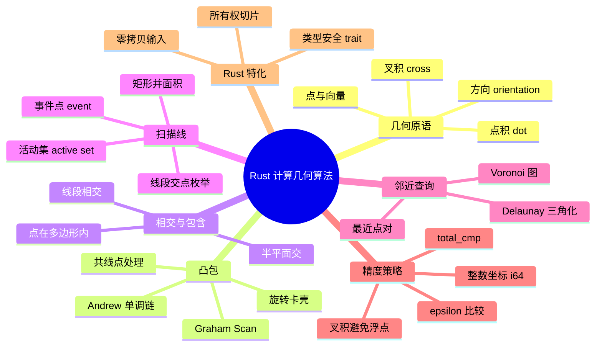
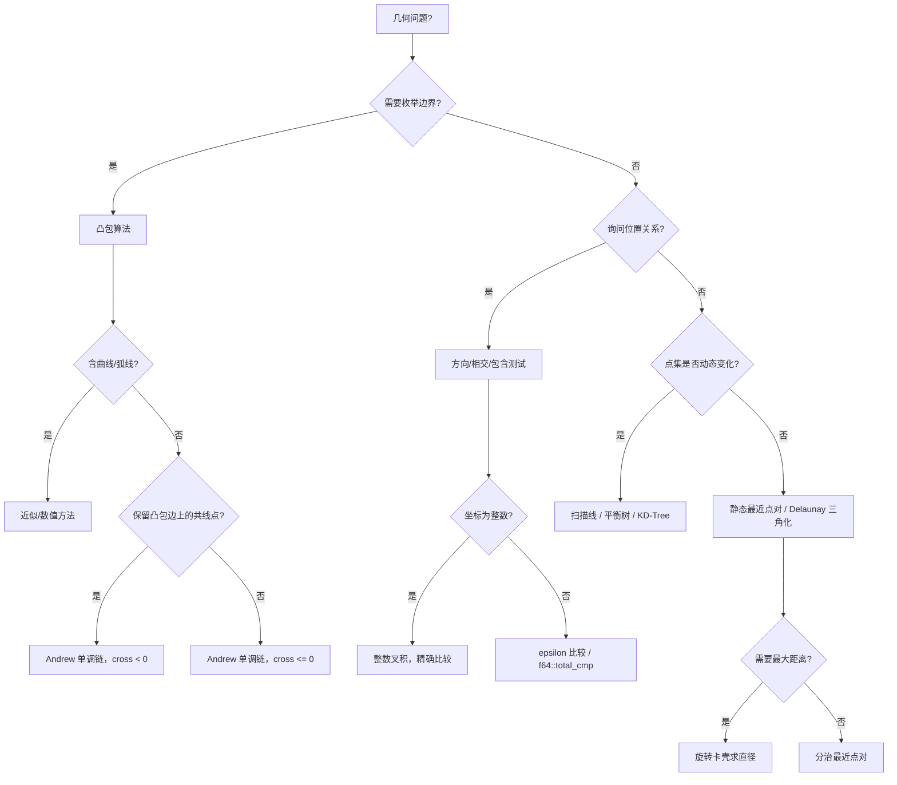

> **内容分级**: [专家级]
> **本节关键术语**:
> 计算几何 (Computational Geometry) · 凸包 (Convex Hull) · 单调链 (Monotone Chain) ·
> 叉积 (Cross Product) · 扫描线 (Sweep Line) · 旋转卡壳 (Rotating Calipers) ·
> 线段相交 (Segment Intersection) · 点在多边形内 (Point-in-Polygon) · 最近点对 (Closest Pair of Points)
> — [完整对照表](../../00_meta/01_terminology/01_terminology_glossary.md)

# Rust 中的计算几何算法

**EN**: Computational Geometry Algorithms in Rust
**Summary**: Idiomatic implementation of convex hulls, segment intersection, sweep-line, rotating calipers, and closest-pair algorithms in Rust, emphasizing integer-precision predicates, ownership-aware slices, and type-safe geometric primitives.

> **Rust 版本**: 1.97.1+ (Edition 2024)
> **Bloom 层级**: L5-L6
> **权威来源**: 本文件为 `concept/` 权威页。
> **A/S/P 标记**: **S+P** — Structure + Procedure
> **定位**: 在 Rust 所有权、类型系统与零拷贝抽象下实现经典计算几何算法，强调精度控制、借用纪律与可复用几何原语。
> **前置概念**: [算法模式概述](00_algorithm_patterns_overview.md) · [所有权感知的数据结构](02_ownership_aware_data_structures.md) · [贪心与近似算法](05_greedy_and_approximation_algorithms.md) · [借用](../../01_foundation/01_ownership_borrow_lifetime/02_borrowing.md) · [泛型](../../02_intermediate/01_generics/01_generics.md)
> **后置概念**: [字符串算法 Rust 实现](07_string_algorithms_in_rust.md) · [图算法 Rust 实现](03_graph_algorithms_in_rust.md) · [算法与复杂度惯用法](../10_performance/03_algorithms_and_complexity_idioms.md) · [算法与竞赛编程](../11_domain_applications/07_algorithms_competitive_programming.md)
> **L5 对比**: [Rust vs C++](../../05_comparative/01_systems_languages/01_rust_vs_cpp.md)

---

> **来源 / Provenance**:
> [The Rust Programming Language](https://doc.rust-lang.org/book/title-page.html) ·
> [The Rust Reference](https://doc.rust-lang.org/reference/introduction.html) ·
> [Rust API Guidelines](https://rust-lang.github.io/api-guidelines/) ·
> [de Berg, Cheong, van Kreveld & Overmars — *Computational Geometry: Algorithms and Applications*, 3rd ed.](https://link.springer.com/book/10.1007/978-3-540-77974-2) ·
> [Preparata & Shamos — *Computational Geometry: An Introduction*](https://doi.org/10.1007/978-1-4612-1098-6) ·
> [Cormen, Leiserson, Rivest & Stein — *Introduction to Algorithms*, 4th ed.](https://mitpress.mit.edu/9780262046305/introduction-to-algorithms/)

---

## 🧠 知识结构图



> **认知功能**: 本 mindmap 将计算几何问题按“原语 → 经典问题 → 算法范式 → Rust 工程策略”组织，帮助读者根据问题类型、精度要求和动态性快速选型。

---

## 一、权威定义

**计算几何（Computational Geometry）** 是研究几何对象在计算机中表示、操作与算法的学科，关注点、线、多边形、凸包、邻近关系与空间划分等问题的高效求解。

**方向判定（Orientation）** 是计算几何中最基础的原语。给定点 `o`、`a`、`b`，二维叉积

```text
cross(o, a, b) = (a.x - o.x) * (b.y - o.y) - (a.y - o.y) * (b.x - o.x)
```

的符号决定 `b` 在向量 `oa` 的左侧（正）、右侧（负）还是共线（零）。几乎所有凸包、相交与包含算法都依赖这一谓词。

**凸包（Convex Hull）** 是包含给定点集的最小凸多边形。Andrew 的**单调链（Monotone Chain）**算法先按坐标排序，再分别构造下凸壳和上凸壳，时间复杂度为 `O(n log n)`，主要由排序决定。

**扫描线（Sweep Line）** 是一种将二维静态问题转化为一维动态问题的范式：用一条直线（通常是垂直线）按 `x` 坐标扫过平面，维护当前与扫描线相交的几何对象集合（活动集），在事件点（如线段端点、交点）处更新状态。

> **来源**: [de Berg et al. 2008](https://link.springer.com/book/10.1007/978-3-540-77974-2) · [CLRS 2022](https://mitpress.mit.edu/9780262046305/introduction-to-algorithms/)

---

## 二、关键属性

| 属性 | Rust 表达 | 说明 |
|:---|:---|:---|
| **类型安全原语** | `struct Point<T> { x: T, y: T }` | 坐标类型由泛型参数决定，整数点与浮点点在类型层区分 |
| **所有权显式化** | `&[Point]` / `&mut [Point]` / `Vec<Point>` | 输入是否被修改、输出是否新分配在签名中可见 |
| **零拷贝扫描** | 对排序后的 `Vec` 迭代，避免递归拷贝 | 凸包、最近点对均可原地排序后索引访问 |
| **精度安全** | 整数叉积、`f64::total_cmp` | 避免浮点精度导致的逻辑错误；`f64` 无 `Ord` 需显式比较 |
| **借用纪律** | `split_at_mut`、`&` 不可变遍历 | 扫描线活动集借用与修改不冲突 |

---

## 三、核心算法与 Rust 实现

### 3.1 几何原语：点、叉积与方向

Rust 的泛型允许将坐标类型参数化。对于竞赛和大多数工程场景，优先使用**整数坐标**和整数叉积，彻底消除浮点精度问题。

```rust
use std::cmp::Ordering;

/// 二维点，坐标类型参数化。
/// 竞赛中 T 通常为 i64；可视化/物理模拟中可为 f64。
#[derive(Clone, Copy, Debug, PartialEq, Eq, PartialOrd, Ord, Hash)]
pub struct Point<T> {
    pub x: T,
    pub y: T,
}

/// 二维叉积 (oa × ob)。
/// 返回值的符号表示 b 相对于 oa 的方向：
///   > 0 : b 在 oa 左侧（逆时针）
///   < 0 : b 在 oa 右侧（顺时针）
///   = 0 : 共线
pub fn cross<T>(o: Point<T>, a: Point<T>, b: Point<T>) -> T
where
    T: Copy + std::ops::Sub<Output = T> + std::ops::Mul<Output = T>,
{
    (a.x - o.x) * (b.y - o.y) - (a.y - o.y) * (b.x - o.x)
}

/// 点积 (a - o) · (b - o)
pub fn dot<T>(o: Point<T>, a: Point<T>, b: Point<T>) -> T
where
    T: Copy + std::ops::Sub<Output = T> + std::ops::Mul<Output = T> + std::ops::Add<Output = T>,
{
    (a.x - o.x) * (b.x - o.x) + (a.y - o.y) * (b.y - o.y)
}

/// 三点方向，仅对可比较类型返回 Ordering。
/// 使用 `T: Default` 将零值作为比较基准；生产代码可替换为 `num_traits::Zero` 或自定义 Zero trait。
pub fn orient<T>(o: Point<T>, a: Point<T>, b: Point<T>) -> Ordering
where
    T: Copy + std::ops::Sub<Output = T> + std::ops::Mul<Output = T> + Ord + Default,
{
    cross(o, a, b).cmp(&T::default())
}
```

**类型设计要点**：

- `Point<T>` 的约束仅保留真正需要的 trait，避免过度约束。
- `cross` 的返回类型与坐标类型相同；使用 `i64` 时，需注意 `(a.x - o.x) * (b.y - o.y)` 可能溢出——坐标绝对值接近 `10^9` 时应改用 `i128` 中间值。
- `dot` 需要 `Add` 以合并两个乘积项；`orient` 需要 `Default` 来获取零值比较基准。

---

### 3.2 凸包：Andrew 单调链（标准库实现）

Andrew 单调链是最常实现的凸包算法，代码短、无需浮点、可自然处理共线点。

```rust
#[derive(Clone, Copy, Debug, PartialEq, Eq, PartialOrd, Ord)]
pub struct Point { pub x: i64, pub y: i64 }

fn cross(o: Point, a: Point, b: Point) -> i64 {
    (a.x - o.x) * (b.y - o.y) - (a.y - o.y) * (b.x - o.x)
}

/// Andrew 单调链凸包。
/// 返回按逆时针顺序排列的凸包顶点，不包含末尾重复点。
/// 使用 `<= 0` 会剔除凸包边上的共线中间点；若需保留所有共线最外点，改为 `< 0`。
pub fn convex_hull(mut pts: Vec<Point>) -> Vec<Point> {
    let n = pts.len();
    if n <= 1 {
        return pts;
    }

    pts.sort_unstable();

    let mut lower = Vec::new();
    for &p in &pts {
        while lower.len() >= 2 && cross(lower[lower.len() - 2], lower[lower.len() - 1], p) <= 0 {
            lower.pop();
        }
        lower.push(p);
    }

    let mut upper = Vec::new();
    for &p in pts.iter().rev() {
        while upper.len() >= 2 && cross(upper[upper.len() - 2], upper[upper.len() - 1], p) <= 0 {
            upper.pop();
        }
        upper.push(p);
    }

    // 移除首尾重复点（每个链的最后一个点是另一个链的起点）
    lower.pop();
    upper.pop();
    lower.extend(upper);
    lower
}

/// 多边形有向面积（Shoelace 公式）。顶点须按逆时针或顺时针顺序排列。
pub fn polygon_area(poly: &[Point]) -> i64 {
    let n = poly.len();
    if n < 3 { return 0; }
    let mut s = 0i64;
    for i in 0..n {
        let j = (i + 1) % n;
        s += poly[i].x * poly[j].y - poly[j].x * poly[i].y;
    }
    s.abs() / 2
}

fn main() {
    let pts = vec![
        Point { x: 0, y: 0 },
        Point { x: 2, y: 0 },
        Point { x: 1, y: 1 },
        Point { x: 2, y: 2 },
        Point { x: 0, y: 2 },
    ];
    let hull = convex_hull(pts);
    assert_eq!(hull, vec![
        Point { x: 0, y: 0 },
        Point { x: 2, y: 0 },
        Point { x: 2, y: 2 },
        Point { x: 0, y: 2 },
    ]);
    assert_eq!(polygon_area(&hull), 4);
}
```

**所有权要点**：

- `convex_hull` 消费输入 `Vec<Point>`，在原地排序后构建两个链。调用方若需保留原始顺序，可在调用前 `clone()`。
- 如果允许修改输入，可接受 `&mut [Point]` 并返回 `&[Point]` 视图，避免重新分配。
- 返回的凸包是新的 `Vec`，因为下链与上链需要拼接成单一闭合序列。

---

### 3.3 线段相交

标准线段相交测试使用跨立实验（straddle test）：若点 `p1`、`p2` 在线段 `p3-p4` 的两侧，且 `p3`、`p4` 在 `p1-p2` 的两侧，则两线段相交。边界情况（共线且投影重叠）需单独处理。

```rust
#[derive(Clone, Copy, Debug, PartialEq, Eq, PartialOrd, Ord)]
pub struct Point { pub x: i64, pub y: i64 }

fn cross(o: Point, a: Point, b: Point) -> i64 {
    (a.x - o.x) * (b.y - o.y) - (a.y - o.y) * (b.x - o.x)
}

fn on_segment(p: Point, q: Point, r: Point) -> bool {
    // 假设 p,q,r 已共线，判断 q 是否在线段 pr 上（含端点）
    q.x <= p.x.max(r.x) && q.x >= p.x.min(r.x) &&
    q.y <= p.y.max(r.y) && q.y >= p.y.min(r.y)
}

pub fn segments_intersect(p1: Point, p2: Point, p3: Point, p4: Point) -> bool {
    let d1 = cross(p3, p4, p1);
    let d2 = cross(p3, p4, p2);
    let d3 = cross(p1, p2, p3);
    let d4 = cross(p1, p2, p4);

    let s1 = (d1 > 0 && d2 < 0) || (d1 < 0 && d2 > 0);
    let s2 = (d3 > 0 && d4 < 0) || (d3 < 0 && d4 > 0);

    if s1 && s2 {
        return true;
    }

    if d1 == 0 && on_segment(p3, p1, p4) { return true; }
    if d2 == 0 && on_segment(p3, p2, p4) { return true; }
    if d3 == 0 && on_segment(p1, p3, p2) { return true; }
    if d4 == 0 && on_segment(p1, p4, p2) { return true; }

    false
}
```

---

### 3.4 扫描线：矩形并面积

矩形并面积是扫描线的经典入门问题。Rust 实现中通常用 `BTreeMap` 维护活动区间，但由于 `BTreeMap` 不支持区间合并的直接语义，竞赛代码常简化为端点事件 + 线段树或离散化后的一维区间覆盖长度。

```rust,ignore
// dep: 仅标准库；完整实现需离散化 + 区间计数线段树。
// 下面给出事件定义与扫描框架。

#[derive(Clone, Copy)]
struct Event {
    x: i64,
    y1: i64,
    y2: i64,
    delta: i32, // +1 进入矩形，-1 离开
}

pub fn union_area_of_rectangles(rects: &[(Point, Point)]) -> i64 {
    let mut events = Vec::new();
    for &(bl, tr) in rects {
        events.push(Event { x: bl.x, y1: bl.y, y2: tr.y, delta: 1 });
        events.push(Event { x: tr.x, y1: bl.y, y2: tr.y, delta: -1 });
    }
    events.sort_by_key(|e| e.x);

    let mut area = 0i64;
    let mut prev_x = events.first().map(|e| e.x).unwrap_or(0);
    let mut active: Vec<(i64, i64, i32)> = Vec::new();

    for e in &events {
        let dx = e.x - prev_x;
        // 计算 active 中区间的总覆盖长度 cover_y
        // area += dx * cover_y;
        if e.delta == 1 {
            active.push((e.y1, e.y2, 1));
        } else {
            // 移除对应区间...
        }
        prev_x = e.x;
    }
    area
}
```

**Rust 工程注意**：

- 动态移除活动集中的区间需要稳定的等价表示；竞赛中常用 `delta` 计数 + 线段树，避免显式删除。
- `BTreeMap` 可维护有序事件队列，但事件去重与区间覆盖长度通常用离散化数组实现。

---

### 3.5 最近点对

最近点对可用分治在 `O(n log n)` 求解。Rust 实现中，先按 `x` 排序，递归求解左右两半，再检查中线附近按 `y` 排序的带状区域。

```rust,ignore
// 完整实现需递归 + 按 y 合并；此处为核心递归框架。

fn closest_pair_rec(pts: &[Point]) -> Option<i64> {
    let n = pts.len();
    if n <= 3 {
        // 暴力枚举
        let mut best = None;
        for i in 0..n {
            for j in i + 1..n {
                let d2 = dist2(pts[i], pts[j]);
                best = Some(best.map_or(d2, |b: i64| b.min(d2)));
            }
        }
        return best;
    }
    let mid = n / 2;
    let d_left = closest_pair_rec(&pts[..mid]);
    let d_right = closest_pair_rec(&pts[mid..]);
    let mut d = d_left.into_iter().chain(d_right).min().unwrap();
    // 再扫描中线附近带状区域...
    Some(d)
}
```

---

### 3.6 旋转卡壳

旋转卡壳用于求凸多边形直径、最小面积矩形、两凸包最近距离等。Rust 实现依赖凸包顶点按逆时针排列，并通过双指针维护对踵点。

```rust,ignore
// dep: 依赖前文 convex_hull 与 cross

fn dist2(a: Point, b: Point) -> i64 {
    let dx = a.x - b.x;
    let dy = a.y - b.y;
    dx * dx + dy * dy
}

pub fn rotating_calipers_diameter2(hull: &[Point]) -> i64 {
    let m = hull.len();
    if m == 1 { return 0; }
    if m == 2 { return dist2(hull[0], hull[1]); }

    let mut j = 1usize;
    let mut best = 0i64;
    for i in 0..m {
        let ni = (i + 1) % m;
        // 当下一个点使平行线距离更大时移动 j
        loop {
            let nj = (j + 1) % m;
            let cur = cross(hull[i], hull[ni], hull[j]).abs();
            let nxt = cross(hull[i], hull[ni], hull[nj]).abs();
            if nxt > cur {
                j = nj;
            } else {
                break;
            }
        }
        best = best.max(dist2(hull[i], hull[j]));
    }
    best
}
```

> 更完整的旋转卡壳实现见 [`crates/c08_algorithms/src/geometry.rs`](../../../crates/c08_algorithms/src/geometry.rs)。

---

## 四、Rust 特化优势

| 场景 | Rust 惯用法 | 收益 |
|:---|:---|:---|
| 避免浮点精度灾难 | `i64` 坐标 + 整数叉积 | 比较结果精确，无 epsilon |
| 排序含 `f64` 的点 | `f64::total_cmp` | 全序比较，处理 `NaN` |
| 凸包原地构建 | 消费 `Vec` 后排序 | 减少一次 `O(n)` 拷贝 |
| 活动集借用 | `&[Event]` 扫描 + 局部可变状态 | 借用检查器防止并发修改错误 |
| 泛型点类型 | `Point<T>` + trait 边界 | 同一套代码服务整数与浮点 |

---

## 五、反例与反模式

### 反例 1：`f64` 坐标直接排序导致编译失败

`f64` 只实现 `PartialOrd`，不实现 `Ord`，因此不能直接用 `sort()` 或放入依赖 `Ord` 的容器。

```rust,compile_fail,E0277
fn main() {
    let mut pts: Vec<(f64, f64)> = vec![(1.0, 2.0), (0.0, 1.0), (2.0, 0.0)];
    // ❌ 错误：f64 不实现 Ord，无法作为排序键
    pts.sort();
}
```

**修正**：使用 `f64::total_cmp` 提供全序，并处理 `NaN`：

```rust
#[derive(Clone, Copy, Debug, PartialEq)]
struct Point { x: f64, y: f64 }

fn sort_points(pts: &mut [Point]) {
    pts.sort_by(|a, b| {
        a.x.total_cmp(&b.x)
            .then_with(|| a.y.total_cmp(&b.y))
    });
}
```

### 反例 2：整数叉积溢出

竞赛中坐标绝对值可达 `10^9`，两个差值相乘可达 `10^18`，接近 `i64::MAX`。若不注意，叉积会静默回绕（release 模式）。

```rust
// ❌ 风险：i64 溢出
fn cross_i64(o: (i64, i64), a: (i64, i64), b: (i64, i64)) -> i64 {
    (a.0 - o.0) * (b.1 - o.1) - (a.1 - o.1) * (b.0 - o.0)
}

// ✅ 修正：使用 i128 中间值
fn cross_i128(o: (i64, i64), a: (i64, i64), b: (i64, i64)) -> i128 {
    (a.0 as i128 - o.0 as i128) * (b.1 as i128 - o.1 as i128)
        - (a.1 as i128 - o.1 as i128) * (b.0 as i128 - o.0 as i128)
}
```

### 反例 3：凸包未处理重复点或共线点

使用 `< 0` 而非 `<= 0` 会保留凸包边上的共线中间点；若后续算法假设顶点数最小，则可能导致 `O(n)` 退化。反之，使用 `<= 0` 会剔除共线点，若题目要求输出所有边界点则会 WA。

```rust,ignore
// 选择 <= 0：剔除共线中间点，得到最小顶点凸包
while lower.len() >= 2 && cross(lower[lower.len() - 2], lower[lower.len() - 1], p) <= 0 {
    lower.pop();
}

// 选择 < 0：保留共线边界点
while lower.len() >= 2 && cross(lower[lower.len() - 2], lower[lower.len() - 1], p) < 0 {
    lower.pop();
}
```

### 反例 4：借用期间修改输入集合

扫描线若错误地在遍历 `Vec` 的同时修改它，借用检查器会阻止：

```rust,compile_fail,E0502
fn main() {
    let mut events = vec![1, 2, 3];
    for e in &events {
        if *e == 2 {
            events.push(4); // ❌ 不可变借用期间可变借用
        }
    }
}
```

**修正**：先完成遍历/筛选，再统一修改；或分两阶段处理事件。

---

## 六、决策树



---

## 七、复杂度与选型

| 算法/问题 | 时间复杂度 | 空间复杂度 | 关键 Rust 决策 | 精度策略 |
|:---|:---|:---|:---|:---|
| **Andrew 凸包** | `O(n log n)` | `O(n)` | 消费 `Vec` 原地排序；泛型 `Point<T>` | 整数坐标 + `i128` 叉积 |
| **线段相交** | `O(1)` 单次测试 | `O(1)` | 纯函数，无副作用 | 整数方向谓词 |
| **点在多边形内** | `O(n)` | `O(1)` | 射线法计数 | `total_cmp` 或整数比较 |
| **矩形并面积** | `O(n log n)` | `O(n)` | 事件排序 + 离散化线段树 | 整数面积 |
| **最近点对（分治）** | `O(n log n)` | `O(n)` | 递归借用切片 | 整数距离平方 |
| **旋转卡壳直径** | `O(m)`（m 为凸包顶点数） | `O(1)` | 双指针遍历凸包 | 整数距离平方 |
| **Delaunay / Voronoi** | `O(n log n)` | `O(n)` | 通常依赖 `geo` / `spade` crate | 浮点或精确算术 |

---

## 八、相关概念

- [算法模式概述](00_algorithm_patterns_overview.md) — L6：Rust 算法实现的通用模式
- [贪心与近似算法](05_greedy_and_approximation_algorithms.md) — L5-L6：排序 + 单次扫描的贪心范式
- [图算法 Rust 实现](03_graph_algorithms_in_rust.md) — L5-L6：索引图、BFS/DFS、Dijkstra
- [字符串算法 Rust 实现](07_string_algorithms_in_rust.md) — L5-L6：扫描、前缀函数、Trie
- [算法与竞赛编程](../11_domain_applications/07_algorithms_competitive_programming.md) — L6：计算几何在竞赛中的特殊注意
- [算法与复杂度惯用法](../10_performance/03_algorithms_and_complexity_idioms.md) — L3-L6：复杂度分析与 Rust 特化
- [c08_algorithms crate docs](../../../crates/c08_algorithms/docs/README.md) — 可编译代码示例
- [crates/c08_algorithms/src/geometry.rs](../../../crates/c08_algorithms/src/geometry.rs) — 凸包与旋转卡壳实现

---

## 九、权威来源索引

- **P0 官方**: [The Rust Programming Language](https://doc.rust-lang.org/book/title-page.html)
- **P0 官方**: [The Rust Reference](https://doc.rust-lang.org/reference/introduction.html)
- **P0 官方**: [Rust API Guidelines](https://rust-lang.github.io/api-guidelines/)
- **P0 官方**: [std::collections — BTreeMap](https://doc.rust-lang.org/std/collections/struct.BTreeMap.html)
- **P1 学术**: [de Berg, Cheong, van Kreveld & Overmars — *Computational Geometry: Algorithms and Applications*, 3rd ed.](https://link.springer.com/book/10.1007/978-3-540-77974-2)
- **P1 学术**: [Preparata & Shamos — *Computational Geometry: An Introduction*](https://doi.org/10.1145/116873.116875)
- **P1 学术**: [Cormen, Leiserson, Rivest & Stein — *Introduction to Algorithms*, 4th ed.](https://mitpress.mit.edu/9780262046305/introduction-to-algorithms/)
- **P2 生态**: [geo crate — Geospatial primitives and algorithms for Rust](https://docs.rs/geo/latest/geo/)
- **P2 生态**: [spade crate — Delaunay triangulations and Voronoi diagrams](https://docs.rs/spade/latest/spade/)
- **P2 生态**: [nalgebra crate — Linear algebra library](https://docs.rs/nalgebra/latest/nalgebra/)
- **P2 生态**: [crates/c08_algorithms/src/geometry.rs](../../../../crates/c08_algorithms/src/geometry.rs)

> **文档版本**: 1.0 ｜ **最后更新**: 2026-08-03 ｜ **状态**: ✅ 新建权威页

---

## 十、国际化权威来源对齐说明

本页与国际权威来源在以下方面对齐：

| 主题 | 本页做法 | 权威来源依据 |
|:---|:---|:---|
| 凸包算法 | Andrew 单调链，`O(n log n)` | de Berg et al. §1.1、CLRS §33.3 |
| 方向谓词 | 整数叉积符号判定 | Preparata & Shamos §2.2.1 |
| 浮点排序 | `f64::total_cmp` | Rust std docs；处理 `NaN` 的全序需求 |
| 线段相交 | 跨立实验 + 边界共线处理 | de Berg et al. §2.4 |
| 扫描线 | 事件点 + 活动集 | de Berg et al. §2.1、§10 |
| 最近点对 | 分治法 | CLRS §33.4 |
| 旋转卡壳 | 对踵点双指针 | Preparata & Shamos §4.2 |
| 类型安全 | `Point<T>` + 最小 trait 边界 | Rust API Guidelines：Prefer generic types with minimal bounds |

---

## 国际学术参考（P1）

> - [de Berg, Cheong, van Kreveld & Overmars — *Computational Geometry: Algorithms and Applications*, 3rd ed.](https://link.springer.com/book/10.1007/978-3-540-77974-2)
> - [Preparata & Shamos — *Computational Geometry: An Introduction*](https://doi.org/10.1007/978-1-4612-1098-6)
> - [Cormen, Leiserson, Rivest & Stein — *Introduction to Algorithms*, 4th ed.](https://mitpress.mit.edu/9780262046305/introduction-to-algorithms/)
> - [O'Rourke — *Computational Geometry in C*, 2nd ed.](https://www.cs.smith.edu/~orourke/books/compgeom.html)
