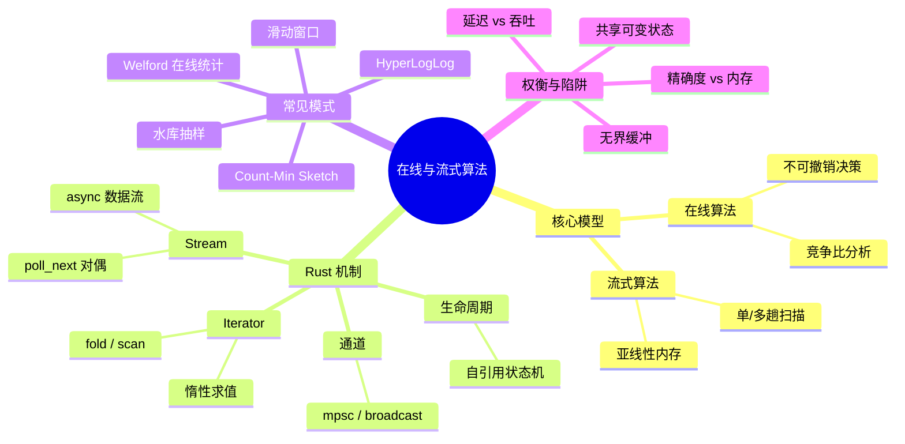
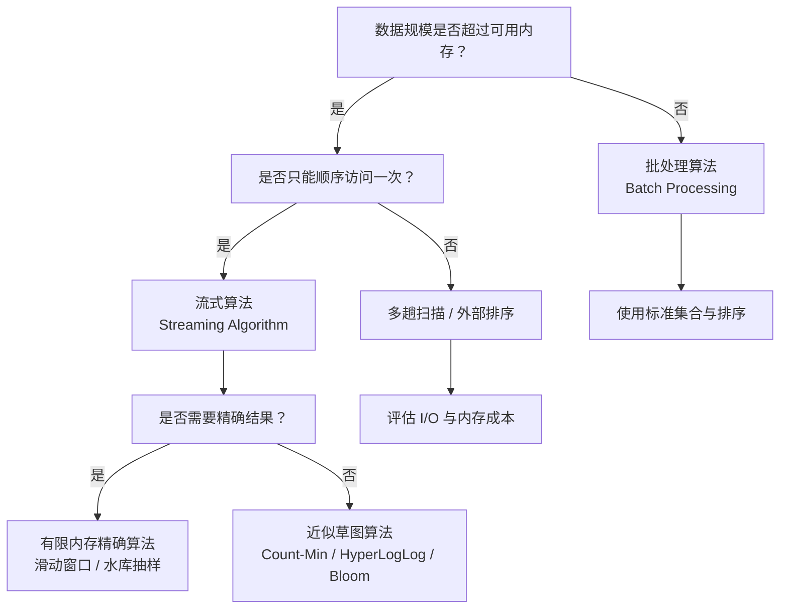

> **内容分级**: [专家级]
> **代码状态**: ✅ 含可编译示例
>
# 在线与流式算法

> **EN**: Online and Streaming Algorithms in Rust
> **Summary**: A systematic account of online and streaming algorithm models, their Rust idioms using iterators, channels, and async streams, and common sketching patterns with trade-offs and pitfalls.
> **受众**: [专家]
> **Rust 版本**: 1.97.1+ (Edition 2024)
> **Bloom 层级**: L5
> **权威来源**: 本文件为 `concept/` 权威页。
> **定位**: 系统阐述在线/流式计算模型的定义、属性、Rust 实现模式与选型决策树；与 [算法范式 catalog](01_algorithmic_paradigms.md) 中的蓄水池抽样、Morris 计数器、Count-Min Sketch 等条目互为补充，后者提供范式速览，本文提供该子领域的深度权威解释。
> **前置概念**: [算法模式概述](00_algorithm_patterns_overview.md) ·
> [迭代器模式](../../02_intermediate/07_iterators_and_closures/01_iterator_patterns.md) ·
> [所有权](../../01_foundation/01_ownership_borrow_lifetime/01_ownership.md) ·
> [生命周期](../../01_foundation/01_ownership_borrow_lifetime/03_lifetimes.md) ·
> [Stream 代数与背压](../../03_advanced/01_async/09_stream_algebra_and_backpressure.md) ·
> [流处理语义](../../03_advanced/06_low_level_patterns/05_stream_processing_semantics.md)
> **后置概念**: [算法与复杂度惯用法](../10_performance/03_algorithms_and_complexity_idioms.md) ·
> [算法工程实践](../11_domain_applications/08_algorithm_engineering_practice.md) ·
> [并行算法](../11_domain_applications/25_parallel_algorithms.md) ·
> [c08_algorithms crate docs](../../../crates/c08_algorithms/docs/README.md)
> **L5 对比**: [Rust vs C++](../../05_comparative/01_systems_languages/01_rust_vs_cpp.md)

---

> **来源 / Provenance**:
> **P0** [The Rust Reference — Loop Expressions](https://doc.rust-lang.org/reference/expressions/loop-expr.html) ·
> **P0** [TRPL — Iterators](https://doc.rust-lang.org/book/ch13-02-iterators.html) ·
> **P0** [`std::iter::Iterator`](https://doc.rust-lang.org/std/iter/trait.Iterator.html) ·
> **P0** [Rust API Guidelines](https://rust-lang.github.io/api-guidelines/) ·
> **P0** [Async Book — Streams](https://rust-lang.github.io/async-book/05_streams/01_chapter.html) ·
> **P1** [Muthukrishnan (2005) — *Data Streams: Algorithms and Applications*](https://dblp.org/rec/journals/fttcs/Muthukrishnan05.html) ·
> **P1** [Cormode & Muthukrishnan (2005) — Count-Min Sketch](https://arxiv.org/abs/cs/0503019) ·
> **P1** [Flajolet et al. (2007) — HyperLogLog](https://arxiv.org/abs/0708.3688) ·
> **P1** [Welford (1962) — Note on a Method for Calculating Corrected Sums of Squares and Products](https://doi.org/10.1080/00401706.1962.10490022) ·
> **P2** [`futures::Stream`](https://docs.rs/futures/latest/futures/stream/trait.Stream.html) ·
> **P2** [`tokio::sync::mpsc`](https://docs.rs/tokio/latest/tokio/sync/mpsc/index.html) ·
> **P2** [`bytecount` crate](https://docs.rs/bytecount/latest/bytecount/) ·
> **P2** [`online` crate](https://docs.rs/online/latest/online/) ·
> **P2** [`sketches` crate](https://docs.rs/sketches/latest/sketches/) ·
> **P2** [`hyperloglog` crate](https://docs.rs/hyperloglog/latest/hyperloglog/) ·
> **P2** [`bloom` crate](https://docs.rs/bloom/latest/bloom/)

---

## 1. 权威定义

**在线算法（Online Algorithm）**：输入以序列方式逐个到达，算法必须在看到下一个输入之前对当前输入做出**不可撤销的决策**。典型评价指标是竞争比（competitive ratio），即在线解与离线最优解的成本比值。

**流式算法（Streaming Algorithm）**：输入规模极其庞大，甚至无法完整装入内存；算法通常只允许**一次或有限次顺序扫描**（one-pass / few-pass），并使用**亚线性内存**（sub-linear memory，通常为 `O(polylog n)` 或 `O(1)`）。典型指标是空间复杂度、更新/查询时间与近似比。

### 1.1 关系与区别

| 维度 | 在线算法 | 流式算法 |
|:---|:---|:---|
| 核心约束 | 不可撤销的即时决策 | 内存受限的单次/有限次扫描 |
| 评价指标 | 竞争比 | 空间复杂度、近似比、更新/查询时间 |
| 典型场景 | 缓存替换、在线调度、在线学习 | 日志统计、网络包处理、传感器数据 |
| Rust 抽象 | 状态机、`Iterator::fold` | `Iterator`、`Stream`、`mpsc`、环形缓冲区 |

两者常常结合：流式模型负责**顺序读取与状态聚合**，在线模型负责**基于当前状态的实时决策**。Rust 的所有权、借用与零成本迭代器抽象，使这两种模型都能在编译期排除数据竞争与无界缓冲等典型错误。

---

## 2. 🧠 知识结构图



---

## 3. 关键属性

1. **顺序性（Sequentiality）**：数据按顺序处理，通常不支持随机访问；多次扫描意味着额外的 I/O 或网络成本。
2. **有限状态（Bounded State）**：流式算法要求状态大小与输入规模 `n` 无关或仅对数相关；在线算法的状态同样必须可控。
3. **近似性（Approximation）**：由于内存限制，统计量多为近似值，但通常带有可证明的误差界（如 `ε-δ` 保证）。
4. **实时性（Real-time）**：处理延迟必须可控，避免在数据路径上执行阻塞操作。
5. **一次性（Single-Pass）**：典型流式算法只扫描一次；若需多趟，通常退化为**外部算法**或**在线学习**场景。

---

## 4. Rust 实现模式

### 4.1 状态机式在线聚合（标准库可编译）

Welford 在线均值与方差算法是在线统计的经典例子：每收到一个观测值，`O(1)` 时间、`O(1)` 空间更新状态，且数值稳定。

```rust
#[derive(Debug, Default, Clone, Copy)]
struct OnlineStats {
    n: u64,
    mean: f64,
    m2: f64,
}

impl OnlineStats {
    fn new() -> Self {
        Self::default()
    }

    /// 逐个加入观测值，O(1) 时间与 O(1) 空间。
    fn add(&mut self, x: f64) {
        self.n += 1;
        let delta = x - self.mean;
        self.mean += delta / self.n as f64;
        let delta2 = x - self.mean;
        self.m2 += delta * delta2;
    }

    fn mean(&self) -> Option<f64> {
        if self.n > 0 { Some(self.mean) } else { None }
    }

    fn variance(&self) -> Option<f64> {
        if self.n > 1 {
            Some(self.m2 / (self.n - 1) as f64)
        } else {
            None
        }
    }
}

fn main() {
    let data = [2.0, 4.0, 4.0, 4.0, 5.0, 5.0, 7.0, 9.0];
    let mut stats = OnlineStats::new();
    for x in data {
        stats.add(x);
    }
    println!("mean = {:.4}", stats.mean().unwrap());
    println!("variance = {:.4}", stats.variance().unwrap());
}
```

> **与国际来源对齐**：该实现对应 Welford (1962) 的数值稳定单遍方差算法，被 `online` 等生态 crate 复用。

### 4.2 反例：在流式遍历中修改源容器

流式处理最常见的错误之一是试图在扫描过程中改变底层容器。Rust 借用检查器会将其识别为**可变借用与不可变借用冲突**：

```rust,compile_fail,E0502
fn main() {
    let mut values = vec![1, 2, 3];
    for v in &values {
        if *v % 2 == 1 {
            values.push(*v * 2); // 错误：在遍历中修改源
        }
    }
}
```

**错误原因**：`for v in &values` 创建了对 `values` 的不可变借用，而 `values.push(...)` 需要可变借用；在 `v` 仍存活期间无法获得可变借用。

**修复方案**：将结果写入**独立的状态机或输出容器**，而不是直接修改正在扫描的源：

```rust
fn main() {
    let values = vec![1, 2, 3];
    let mut output = Vec::new();
    for v in &values {
        if *v % 2 == 1 {
            output.push(*v * 2);
        }
    }
    println!("{:?}", output);
}
```

### 4.3 异步流式消费（依赖说明）

生产环境通常使用 `tokio::sync::mpsc` 或 `futures::Stream` 处理高吞吐异步数据流。由于依赖外部 crate，以下代码块仅展示结构，不做编译保证：

```rust,ignore
// Cargo.toml: tokio = { version = "1", features = ["full"] }
use tokio::sync::mpsc;

#[derive(Default)]
struct OnlineStats {
    n: u64,
    mean: f64,
    m2: f64,
}

impl OnlineStats {
    fn add(&mut self, x: f64) {
        self.n += 1;
        let delta = x - self.mean;
        self.mean += delta / self.n as f64;
        let delta2 = x - self.mean;
        self.m2 += delta * delta2;
    }
}

#[tokio::main]
async fn main() {
    let (tx, mut rx) = mpsc::channel::<f64>(1024);

    // 生产者（示例）
    tokio::spawn(async move {
        for x in [2.0, 4.0, 4.0, 5.0] {
            let _ = tx.send(x).await;
        }
    });

    let mut stats = OnlineStats::default();
    while let Some(x) = rx.recv().await {
        stats.add(x);
    }
    println!("mean = {}", stats.mean);
}
```

> 注意：通道容量 `1024` 是背压窗口。若使用无界通道（`unbounded_channel`），在消费者慢于生产者时会无限增长，违背流式算法的有限状态约束。

---

## 5. 决策树：何时选用在线 / 流式 / 批处理



**决策规则**：

1. 能放进内存且可随机访问 → 批处理最简。
2. 超内存但允许多趟 → 外部排序 / 分块处理。
3. 只能单趟扫描 → 进入流式算法分支。
4. 允许近似 → 选择草图（sketch）结构，空间最小。
5. 必须精确 → 使用窗口化或采样，保留有界状态。

---

## 6. 与国际权威来源对齐

### 6.1 Rust 语言与 API 层（P0）

- **TRPL — Iterators**：将 `Iterator` 定义为 Rust 中“惰性、可组合的序列抽象”，与本文的流式扫描模型完全对应。
- **`std::iter::Iterator`**：`fold`、`scan`、`next` 等 API 是在线聚合的零成本基础。
- **Rust API Guidelines**：推荐“消耗迭代器”模式，避免在迭代过程中保留对迭代器内部状态的长期引用，这与 4.2 节反例一致。
- **Async Book — Streams**：`Stream = 异步 Iterator` 的对偶视角是 4.3 节的理论依据。

### 6.2 学术模型层（P1）

- **Muthukrishnan (2005)**：奠定了流式算法的复杂度模型（空间 `o(n)`、更新/查询时间、近似保证）。
- **Cormode & Muthukrishnan (2005) — Count-Min Sketch**：提供了 `O(1)` 更新、`O(1/ε)` 空间、`ε`-近似频度估计的标准草图。
- **Flajolet et al. (2007) — HyperLogLog**：基数估计算法，空间 `O(log log n)`，被 Redis、BigQuery 等系统采用。
- **Welford (1962)**：单遍数值稳定方差算法，是在线统计的基石。

### 6.3 生态实现层（P2）

- **`futures::Stream` / `tokio::sync::mpsc`**：异步背压数据流的标准抽象。
- **`bytecount`**：字节计数的 SIMD 优化实现，适合“扫描即处理”的流式文本/二进制场景。
- **`online`、`sketches`、`hyperloglog`、`bloom`**：分别提供在线学习、通用草图、基数估计、成员查询的概率数据结构实现，可直接用于生产系统。

---

## 7. 反例与设计陷阱

1. **无界缓冲区**：把流全部 `collect()` 进 `Vec` 再处理，退化为批处理，违背流式内存约束。应使用 `Iterator::fold` 或状态机。
2. **在数据路径上阻塞 I/O**：在线算法要求低延迟，若在 `add()` 内部执行同步文件或网络操作，会拖垮吞吐。
3. **共享可变状态**：多个任务同时更新同一个 `OnlineStats` 需要 `Mutex` 或原子操作；直接使用 `&mut` 跨线程会导致编译错误 `E0277`/`E0373`。
4. **忽略数值稳定性**：在线方差若使用朴素累加 `sum += x; sum_sq += x * x`，在大数据量下会灾难性抵消；应使用 Welford 更新。
5. **忽略背压**：无界通道或无限缓冲的 `Stream` 会导致内存无限增长，最终 OOM；应使用有界通道或 `buffer_unordered` 等显式并发限制。

---

## 8. 小结

- **在线算法**强调不可撤销的即时决策；**流式算法**强调顺序、亚线性内存与近似。
- Rust 的 `Iterator`、`Stream` 与所有权模型天然支持一次性、低分配的流式处理，并在编译期排除“遍历中修改源”等经典错误。
- 设计时应先回答决策树中的三个核心问题：数据是否超内存？是否只能单趟扫描？是否可接受近似？
