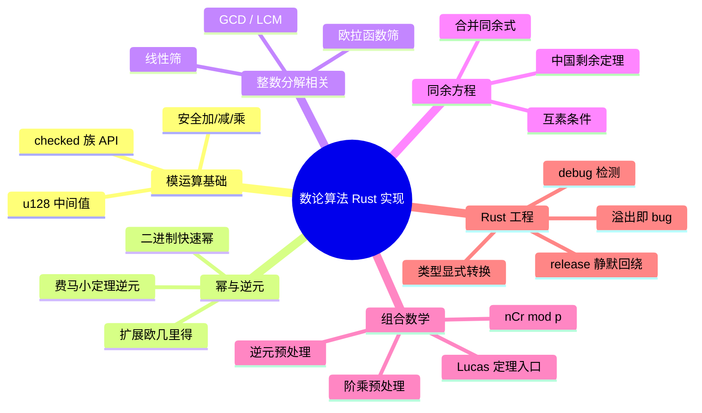
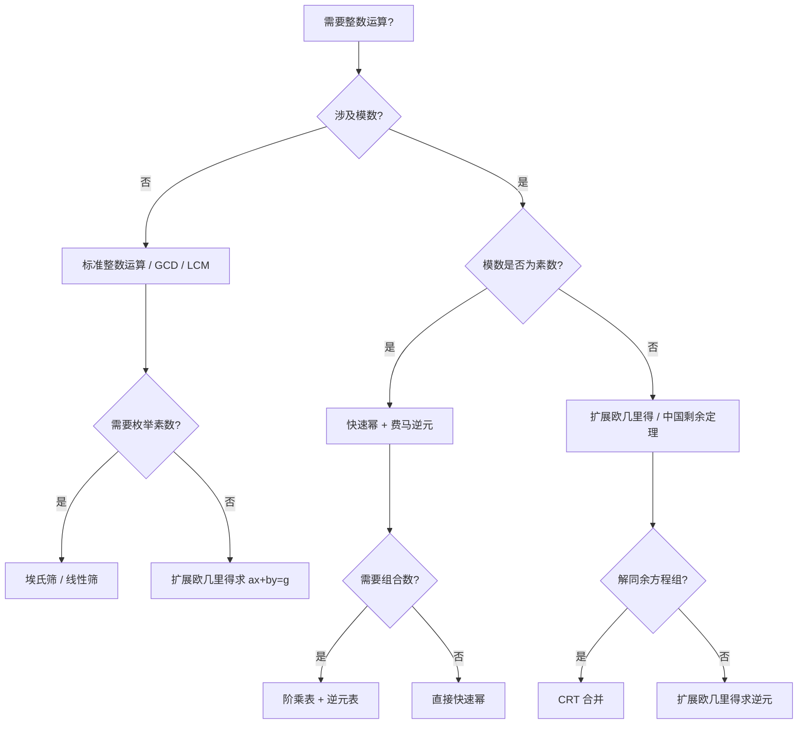

> **内容分级**: [进阶]
> **本节关键术语**:
> 数论算法 (Number-Theoretic Algorithms) · 模运算 (Modular Arithmetic) · 快速幂 (Binary Exponentiation) ·
> 欧几里得算法 (Euclidean Algorithm) · 扩展欧几里得 (Extended Euclidean Algorithm) · 素数筛 (Prime Sieve) ·
> 欧拉函数 (Euler's Totient Function) · 中国剩余定理 (Chinese Remainder Theorem) · 组合数取模 (nCr mod p)
> — [完整对照表](../../00_meta/01_terminology/01_terminology_glossary.md)

# 数论算法 Rust 实现

**EN**: Number-Theoretic Algorithms in Rust
**Summary**: Competitive-programming and cryptography oriented number-theoretic algorithms: modular arithmetic, fast power, GCD/LCM, prime sieves, Euler's totient, CRT, combinatorics modulo.

> **Rust 版本**: 1.97.0+ (Edition 2024)
> **Bloom 层级**: L2
> **权威来源**: 本文件为 `concept/` 权威页。
> **A/S/P 标记**: **S+P** — Structure + Procedure
> **定位**: 在 Rust 的类型系统与溢出保护下实现竞赛与密码学常用数论算法，强调“先防溢出、再谈效率”。
> **前置概念**: [算法模式概述](00_algorithm_patterns_overview.md) · [所有权](../../01_foundation/01_ownership_borrow_lifetime/01_ownership.md) · [数值类型](../../01_foundation/02_type_system/03_numerics.md) · [泛型](../../02_intermediate/01_generics/01_generics.md)
> **后置概念**: [随机化与概率算法](09_randomized_and_probabilistic_algorithms.md) · [图算法 Rust 实现](03_graph_algorithms_in_rust.md) · [算法与竞赛编程](../11_domain_applications/07_algorithms_competitive_programming.md)
> **L5 对比**: [Rust vs C++](../../05_comparative/01_systems_languages/01_rust_vs_cpp.md)

---

> **来源 / Provenance**:
> [The Rust Programming Language](https://doc.rust-lang.org/book/title-page.html) ·
> [The Rust Reference](https://doc.rust-lang.org/reference/introduction.html) ·
> [Rust API Guidelines](https://rust-lang.github.io/api-guidelines/) ·
> [Algorithmica — Number Theory](https://algorithmica.org/) ·
> [Competitive Programmer's Handbook](https://cses.fi/book/book.pdf) ·
> [Cormen, Leiserson, Rivest & Stein — *Introduction to Algorithms*, 4th ed.](https://mitpress.mit.edu/9780262046305/introduction-to-algorithms/)

---

## 🧠 知识结构图



> **认知功能**: 本 mindmap 按“基础运算 → 核心问题 → 组合应用 → Rust 工程纪律”组织，帮助读者根据问题类型快速选择算法并规避溢出陷阱。

---

## 一、权威定义

**数论算法（Number-Theoretic Algorithms）** 处理整数、素数、同余、整除与组合计数等问题，是竞赛编程（CP）与现代密码学（RSA、椭圆曲线、零知识证明）的底层工具。

**模运算安全（Modular Arithmetic Safety）**：在固定模数 `M` 下运算时，必须保证中间结果不会溢出。Rust 的整数溢出在 debug 模式会 panic，在 release 模式会**静默回绕**，因此竞赛代码通常使用 `u128` 暂存乘积，或使用 `checked_*` 显式处理。

**欧拉定理**：若 `a` 与 `m` 互素，则 `a^φ(m) ≡ 1 (mod m)`，其中 `φ(m)` 为欧拉函数。当 `m` 为素数 `p` 时退化为**费马小定理**：`a^(p-1) ≡ 1 (mod p)`，可由此求乘法逆元 `a^(-1) ≡ a^(p-2) (mod p)`。

> **来源**: [CLRS 2022](https://mitpress.mit.edu/9780262046305/introduction-to-algorithms/) · [CP Handbook](https://cses.fi/book/book.pdf)

---

## 二、关键属性

| 属性 | Rust 表达 | 说明 |
|:---|:---|:---|
| **溢出保护** | `u128` 中间值 / `checked_mul` | 两个 `u64` 乘积最大约 `2^128`，`u128` 可安全容纳 |
| **不可变输入** | `&[u64]` / `u64` | 数论函数多为纯函数，不应修改输入 |
| **预计算表** | `Vec<u64>` / `Vec<usize>` | 阶乘、逆元、素数表等一次性构造后多次查询 |
| **类型纪律** | `as u128` / `as u64` 显式转换 | 避免隐式截断；模数通常用 `u64` 但中间值用 `u128` |
| **结果表达** | `Option<T>` / `Option<(T, T)>` | CRT 无解、逆元不存在等场景应显式返回 `None` |

---

## 三、核心算法与 Rust 实现

### 3.1 安全模运算：加、减、乘

竞赛中最常用的模数是素数 `10^9 + 7`（`1_000_000_007`）。两个 `u64` 相加可能溢出，相乘**必然**需要 `u128`。

```rust
const MOD: u64 = 1_000_000_007;

fn mod_add(a: u64, b: u64) -> u64 {
    let s = a + b;
    if s >= MOD { s - MOD } else { s }
}

fn mod_sub(a: u64, b: u64) -> u64 {
    if a >= b { a - b } else { a + MOD - b }
}

fn mod_mul(a: u64, b: u64) -> u64 {
    ((a as u128 * b as u128) % MOD as u128) as u64
}

fn main() {
    assert_eq!(mod_add(MOD - 1, 2), 1);
    assert_eq!(mod_sub(3, 5), MOD - 2);
    // (10^9)^2 mod (10^9+7) = (MOD-7)^2 mod MOD = 49
    assert_eq!(mod_mul(1_000_000_000, 1_000_000_000), 49);
}
```

**Rust 特化要点**：

- `a + b` 在 release 模式会回绕，但 `s >= MOD` 的判断仍然正确（回绕后的值必然 `< 2*MOD`，而 `2*MOD < 2^64`）。
- 乘法必须使用 `u128` 中间值，否则 `MOD^2` 已超过 `u64::MAX`。
- 若模数可能接近 `u64::MAX`，连 `u128` 也不够，需要使用 `num-bigint` 或蒙哥马利乘法。

---

### 3.2 二进制快速幂

计算 `base^exp mod MOD` 的时间复杂度为 `O(log exp)`。

```rust
const MOD: u64 = 1_000_000_007;

fn mod_mul(a: u64, b: u64) -> u64 {
    ((a as u128 * b as u128) % MOD as u128) as u64
}

fn mod_pow(mut base: u64, mut exp: u64) -> u64 {
    let mut res = 1u64;
    while exp > 0 {
        if exp & 1 == 1 {
            res = mod_mul(res, base);
        }
        base = mod_mul(base, base);
        exp >>= 1;
    }
    res
}

fn main() {
    assert_eq!(mod_pow(2, 10), 1024);
    assert_eq!(mod_pow(2, 60), 142_511_099); // 2^60 mod 1e9+7
}
```

---

### 3.3 欧几里得、LCM 与扩展欧几里得

`gcd` 使用 Stein 算法或欧几里得算法均可；扩展欧几里得用于求解 `ax + by = gcd(a, b)`，是 CRT 与模逆元的基础。

```rust
fn gcd(mut a: u64, mut b: u64) -> u64 {
    while b != 0 {
        let t = a % b;
        a = b;
        b = t;
    }
    a
}

fn lcm(a: u64, b: u64) -> Option<u64> {
    let g = gcd(a, b);
    a.checked_div(g)?.checked_mul(b)
}

/// 返回 (g, x, y) 满足 a*x + b*y = g = gcd(a, b)
fn extended_gcd(a: i64, b: i64) -> (i64, i64, i64) {
    if b == 0 {
        return (a, 1, 0);
    }
    let (g, x1, y1) = extended_gcd(b, a % b);
    (g, y1, x1 - (a / b) * y1)
}

fn main() {
    assert_eq!(gcd(48, 18), 6);
    assert_eq!(lcm(4, 6), Some(12));

    let (g, x, y) = extended_gcd(30, 12);
    assert_eq!(g, 6);
    assert_eq!(30 * x + 12 * y, g);

    // 模逆元：a^-1 mod m 存在当且仅当 gcd(a, m) == 1
    let (g, x, _) = extended_gcd(3, 11);
    assert_eq!(g, 1);
    let inv = ((x % 11) + 11) % 11;
    assert_eq!((3 * inv) % 11, 1);
}
```

**递归深度注意**：`extended_gcd` 的递归深度为 `O(log min(a, b))`，对 64 位整数完全安全；若对超大整数（如 `num-bigint`）应避免递归。

---

### 3.4 素数筛与欧拉函数筛

埃氏筛时间复杂度 `O(n log log n)`；线性筛可在 `O(n)` 内同时得到每个数的最小质因子与欧拉函数值。

```rust
fn sieve_eratosthenes(n: usize) -> Vec<bool> {
    let mut is_prime = vec![true; n + 1];
    if n >= 0 { is_prime[0] = false; }
    if n >= 1 { is_prime[1] = false; }
    for i in 2..=n {
        if is_prime[i] && i * i <= n {
            for j in (i * i..=n).step_by(i) {
                is_prime[j] = false;
            }
        }
    }
    is_prime
}

fn euler_totient_sieve(n: usize) -> Vec<usize> {
    let mut phi: Vec<usize> = (0..=n).collect();
    for i in 2..=n {
        if phi[i] == i { // i 是素数
            for j in (i..=n).step_by(i) {
                phi[j] -= phi[j] / i;
            }
        }
    }
    phi
}

fn main() {
    let primes = sieve_eratosthenes(20);
    let list: Vec<_> = (0..=20).filter(|&i| primes[i]).collect();
    assert_eq!(list, vec![2, 3, 5, 7, 11, 13, 17, 19]);

    let phi = euler_totient_sieve(10);
    assert_eq!(phi, vec![0, 1, 1, 2, 2, 4, 2, 6, 4, 6, 4]);
}
```

**工程要点**：

- `i * i` 可能溢出 `usize`（虽然对 `n <= 10^6` 竞赛场景安全）；更稳妥的写法是 `i.checked_mul(i).map_or(false, |ii| ii <= n)`。
- 线性筛版本空间更小且可顺便记录 `lp`（最小质因子），用于质因数分解。

---

### 3.5 中国剩余定理（CRT）

求解同余方程组 `x ≡ a1 (mod m1)`、`x ≡ a2 (mod m2)`。若 `m1`、`m2` 不互素，需先判别有解条件 `gcd(m1, m2) | (a2 - a1)`。

```rust
fn extended_gcd(a: i64, b: i64) -> (i64, i64, i64) {
    if b == 0 {
        return (a, 1, 0);
    }
    let (g, x1, y1) = extended_gcd(b, a % b);
    (g, y1, x1 - (a / b) * y1)
}

/// 合并两个同余式。返回 (a, m) 表示 x ≡ a (mod m)。
fn crt(a1: i64, m1: i64, a2: i64, m2: i64) -> Option<(i64, i64)> {
    let (g, p, _q) = extended_gcd(m1, m2);
    if (a2 - a1) % g != 0 {
        return None;
    }
    let lcm = (m1 as i128 / g as i128 * m2 as i128) as i64;
    let diff = (a2 - a1) / g;
    let step = (diff as i128 * p as i128 % (m2 as i128 / g as i128)) as i64;
    let x = (a1 as i128 + step as i128 * m1 as i128) % lcm as i128;
    let normalized = ((x % lcm as i128 + lcm as i128) % lcm as i128) as i64;
    Some((normalized, lcm))
}

fn main() {
    // x ≡ 2 (mod 3), x ≡ 3 (mod 5) => x ≡ 8 (mod 15)
    assert_eq!(crt(2, 3, 3, 5), Some((8, 15)));
    // x ≡ 1 (mod 4), x ≡ 2 (mod 6): gcd=2, 2-1=1 不被 2 整除 => 无解
    assert_eq!(crt(1, 4, 2, 6), None);
}
```

---

### 3.6 组合数取模：阶乘 + 逆元

当模数为素数 `p` 且 `n < p` 时，可用费马小定理预处理逆元，`nCr mod p` 单次查询 `O(1)`。

```rust
const MOD: u64 = 1_000_000_007;

fn mod_mul(a: u64, b: u64) -> u64 {
    ((a as u128 * b as u128) % MOD as u128) as u64
}

fn mod_pow(mut base: u64, mut exp: u64) -> u64 {
    let mut res = 1;
    while exp > 0 {
        if exp & 1 == 1 { res = mod_mul(res, base); }
        base = mod_mul(base, base);
        exp >>= 1;
    }
    res
}

fn factorial_table(n: usize) -> Vec<u64> {
    let mut fact = vec![1u64; n + 1];
    for i in 1..=n {
        fact[i] = mod_mul(fact[i - 1], i as u64);
    }
    fact
}

fn inverse_table(n: usize, fact: &[u64]) -> Vec<u64> {
    let mut inv = vec![1u64; n + 1];
    inv[n] = mod_pow(fact[n], MOD - 2);
    for i in (1..=n).rev() {
        inv[i - 1] = mod_mul(inv[i], i as u64);
    }
    inv
}

fn ncr_mod(fact: &[u64], inv: &[u64], n: usize, r: usize) -> u64 {
    if r > n { return 0; }
    mod_mul(mod_mul(fact[n], inv[r]), inv[n - r])
}

fn main() {
    let n = 20;
    let fact = factorial_table(n);
    let inv = inverse_table(n, &fact);
    assert_eq!(ncr_mod(&fact, &inv, 5, 2), 10);
    assert_eq!(ncr_mod(&fact, &inv, 20, 10), 184_756);
}
```

---

## 四、Rust 特化优势

| 场景 | Rust 惯用法 | 收益 |
|:---|:---|:---|
| 防止乘法溢出 | `u128` 中间值 | debug 与 release 均不会静默得到错误结果 |
| 模运算表构造 | `Vec<u64>` 预计算 | 单次 `O(n)`，后续 `O(1)` 查询 |
| 结果可能不存在 | `Option<(i64, i64)>` | CRT 无解、逆元不存在时被类型系统强制处理 |
| 纯函数 | 输入 `u64` / `&[u64]`，输出新值 | 无副作用，易于并行与测试 |
| 大整数 | `num-bigint` crate | 超出 `u128` 时切换到任意精度 |

---

## 五、反例与反模式

### 反例 1：直接相乘导致 release 模式静默回绕

```rust
const MOD: u64 = 1_000_000_007;

// ❌ 错误：release 模式下结果错误
fn bad_mod_mul(a: u64, b: u64) -> u64 {
    (a * b) % MOD
}

fn main() {
    // 10^9 * 10^9 已超过 u64::MAX 的一半，必然回绕
    let _ = bad_mod_mul(1_000_000_000, 1_000_000_000);
}
```

**修正**：使用 `u128` 中间值（见 3.1）。

### 反例 2：对合数模数使用费马逆元

```rust
const MOD: u64 = 1_000_000_006; // 合数

fn mod_pow(mut base: u64, mut exp: u64, m: u64) -> u64 {
    let mut res = 1;
    while exp > 0 {
        if exp & 1 == 1 { res = ((res as u128 * base as u128) % m as u128) as u64; }
        base = ((base as u128 * base as u128) % m as u128) as u64;
        exp >>= 1;
    }
    res
}

fn main() {
    // ❌ 错误：MOD 不是素数，费马逆元不成立
    let inv_2 = mod_pow(2, MOD - 2, MOD);
    // 2 * inv_2 mod MOD 不等于 1
    assert_ne!((2 * inv_2) % MOD, 1);
}
```

**修正**：非素数模数应使用扩展欧几里得求逆元，并检查 `gcd(a, m) == 1`。

### 反例 3：忽略 CRT 同余式无解条件

```rust,ignore
// ❌ 错误：直接相乘模数，未检查是否可解
fn naive_crt(a1: i64, m1: i64, a2: i64, m2: i64) -> i64 {
    let m = m1 * m2; // 还可能溢出
    // 未考虑 gcd(m1, m2) 是否整除 (a2 - a1)
    todo!()
}
```

**修正**：见 3.5 的 `crt` 函数，返回 `Option` 并在无解时给出 `None`。

### 反例 4：递归深度失控的幂运算

```rust,ignore
// ❌ 错误：线性递归，深度 O(n)，会栈溢出
fn bad_pow(base: u64, exp: u64) -> u64 {
    if exp == 0 { 1 } else { base * bad_pow(base, exp - 1) }
}
```

**修正**：使用迭代二进制快速幂（见 3.2）。

---

## 六、决策树



---

## 七、复杂度与选型

| 算法/问题 | 时间复杂度 | 空间复杂度 | 关键 Rust 决策 | 注意 |
|:---|:---|:---|:---|:---|
| **模加/减/乘** | `O(1)` | `O(1)` | `u128` 中间值 | 必须防溢出 |
| **二进制快速幂** | `O(log exp)` | `O(1)` | 迭代实现 | 模数非素数时仍可用 |
| **欧几里得 GCD** | `O(log min(a, b))` | `O(1)` | 循环版避免递归深度 | 递归版对 64 位也安全 |
| **扩展欧几里得** | `O(log min(a, b))` | `O(1)` | 返回 `(g, x, y)` | 中间值可能溢出 i64，需 i128 |
| **埃氏筛** | `O(n log log n)` | `O(n)` | `Vec<bool>` | 注意 `i*i` 溢出 |
| **欧拉筛** | `O(n)` | `O(n)` | `Vec<usize>` 记录最小质因子 | 可同时做质因数分解 |
| **CRT** | `O(log min(m1, m2))` | `O(1)` | `Option` 表示无解 | 不互素时需约化 |
| **nCr mod p** | 预处理 `O(n)`，查询 `O(1)` | `O(n)` | 阶乘表 + 逆元表 | 要求 `n < p` |
| **Lucas 定理** | `O(p log_p n)` | `O(p)` | 预处理 `0..p` 阶乘 | 用于 `n >= p` |

---

## 八、相关概念

- [算法模式概述](00_algorithm_patterns_overview.md) — L6：算法实现的通用模式
- [随机化与概率算法](09_randomized_and_probabilistic_algorithms.md) — L5-L6：Miller-Rabin、Pollard's rho 等大整数算法
- [图算法 Rust 实现](03_graph_algorithms_in_rust.md) — L5-L6：数论在图计数中的应用
- [算法与竞赛编程](../11_domain_applications/07_algorithms_competitive_programming.md) — L6：竞赛中的数论技巧与陷阱
- [数值类型](../../01_foundation/02_type_system/03_numerics.md) — L0-L1：Rust 整数溢出行为
- [泛型](../../02_intermediate/01_generics/01_generics.md) — L2：用泛型抽象不同整数宽度

---

## 九、权威来源索引

- **P0 官方**: [The Rust Programming Language](https://doc.rust-lang.org/book/title-page.html)
- **P0 官方**: [The Rust Reference](https://doc.rust-lang.org/reference/introduction.html)
- **P0 官方**: [Rust API Guidelines](https://rust-lang.github.io/api-guidelines/)
- **P0 官方**: [std::num — integer types](https://doc.rust-lang.org/std/num/index.html)
- **P1 学术**: [Cormen, Leiserson, Rivest & Stein — *Introduction to Algorithms*, 4th ed.](https://mitpress.mit.edu/9780262046305/introduction-to-algorithms/)
- **P2 生态**: [Algorithmica — Number Theory](https://algorithmica.org/)
- **P2 生态**: [Competitive Programmer's Handbook](https://cses.fi/book/book.pdf)
- **P2 生态**: [num-bigint crate](https://docs.rs/num-bigint/latest/num_bigint/)（任意精度整数）
- **P2 生态**: [num-traits crate](https://docs.rs/num-traits/latest/num_traits/)（通用数字 trait）

> **文档版本**: 1.0 ｜ **最后更新**: 2026-08-03 ｜ **状态**: ✅ 新建权威页

---

## 十、国际化权威来源对齐说明

本页与国际权威来源在以下方面对齐：

| 主题 | 本页做法 | 权威来源依据 |
|:---|:---|:---|
| 模乘法溢出 | `u128` 中间值 | Rust Reference：整数溢出行为；CP Handbook §21.2 |
| 二进制快速幂 | 迭代 `O(log n)` | CLRS §31.6 |
| 扩展欧几里得 | 递归返回 `(g, x, y)` | CLRS §31.2 |
| 素数筛 | 埃氏筛 `O(n log log n)` | CP Handbook §22.3 |
| 欧拉函数 | 筛法预处理 | Algorithmica — Number Theory |
| 中国剩余定理 | 含非互素判别的合并 | CLRS §31.5 |
| 组合数取模 | 阶乘 + 费马逆元 | CP Handbook §24.1 |

---

## 国际学术参考（P1）

> - [Cormen, Leiserson, Rivest & Stein — *Introduction to Algorithms*, 4th ed.](https://mitpress.mit.edu/9780262046305/introduction-to-algorithms/)

---

## 国际权威来源（P1 补充）

- [Rivest, Shamir & Adleman — A Method for Obtaining Digital Signatures and Public-Key Cryptosystems (CACM 1978)](https://dl.acm.org/doi/10.1145/359340.359342)
