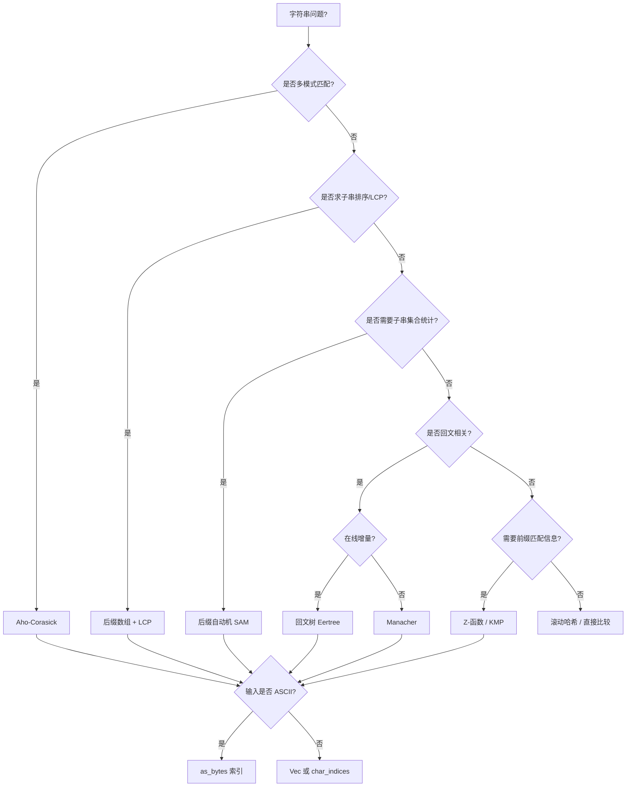

> **内容分级**: [专家级]
> **本节关键术语**:
> 高级字符串算法 (Advanced String Algorithms) · Z-函数 (Z-Function) · Aho-Corasick 自动机 (Aho-Corasick Automaton) ·
> 后缀自动机 (Suffix Automaton) · Manacher 算法 (Manacher's Algorithm) · 回文树 (Palindromic Tree / Eertree) ·
> 后缀数组 (Suffix Array) · LCP 数组 (Longest Common Prefix Array) · 字节索引 (Byte Indexing) · UTF-8 边界 (UTF-8 Boundary)
> — [完整对照表](../../00_meta/01_terminology/01_terminology_glossary.md)

# 高级字符串算法

**EN**: Advanced String Algorithms in Rust
**Summary**: Efficient string processing algorithms: Z-function, Aho-Corasick, suffix automaton, Manacher, palindromic tree, suffix array, with Rust ownership considerations.

> **Rust 版本**: 1.97.0+ (Edition 2024)
> **Bloom 层级**: L2-L3
> **权威来源**: 本文件为 `concept/` 权威页。
> **A/S/P 标记**: **S+P** — Structure + Procedure
> **定位**: 在 Rust 所有权与 UTF-8 安全模型下实现竞赛与工程中常用的高级字符串算法，重点解决“按字节还是按字符”的索引问题。
> **前置概念**: [字符串算法 Rust 实现](07_string_algorithms_in_rust.md) · [算法模式概述](00_algorithm_patterns_overview.md) · [所有权](../../01_foundation/01_ownership_borrow_lifetime/01_ownership.md) · [借用](../../01_foundation/01_ownership_borrow_lifetime/02_borrowing.md)
> **后置概念**: [缓存友好与 SIMD 算法](04_cache_friendly_and_simd_algorithms.md) · [图算法 Rust 实现](03_graph_algorithms_in_rust.md) · [零拷贝解析](../11_domain_applications/26_zero_copy_parsing_in_rust.md)
> **L5 对比**: [Rust vs C++](../../05_comparative/01_systems_languages/01_rust_vs_cpp.md)

---

> **来源 / Provenance**:
> [The Rust Programming Language](https://doc.rust-lang.org/book/title-page.html) ·
> [Rust std::str](https://doc.rust-lang.org/std/str/index.html) ·
> [Competitive Programmer's Handbook](https://cses.fi/book/book.pdf) ·
> [Algorithmica — String Algorithms](https://algorithmica.org/) ·
> [Gusfield — *Algorithms on Strings, Trees, and Sequences*](https://www.cs.ucdavis.edu/~gusfield/book.html)

---

## 🧠 知识结构图

```mermaid
mindmap
  root((高级字符串算法))
    前缀结构
      Z-函数
      前缀函数 KMP
    多模式匹配
      Aho-Corasick
      失败指针
      输出链
    后缀结构
      后缀数组 SA
      LCP 数组
      后缀自动机 SAM
    回文结构
      Manacher
      回文树 Eertree
    Rust 索引模型
      &str 按字节
      chars() 按字符
      char_indices
      UTF-8 边界安全
    工程权衡
      ASCII 用 as_bytes
      Unicode 需 char 边界
      索引数组用 Vec<usize>
```

> **认知功能**: 本 mindmap 按“字符串内部结构（前缀/后缀/回文）→ 多模式匹配 → Rust 索引安全”组织，帮助读者根据查询类型（单模式/多模式/子串统计/回文）选择合适算法。

---

## 一、权威定义

**高级字符串算法** 在基础匹配（KMP、Rabin-Karp）之上，进一步处理：多模式同时匹配、所有子串的压缩表示、回文结构、后缀排序与最长公共前缀等问题。

**字节索引 vs 字符索引**：Rust 的 `&str` 是 UTF-8 字节序列。`s.as_bytes()` 提供 `O(1)` 索引但只适用于 ASCII 或需要字节级语义的算法；`s.chars()` 提供 Unicode 标量值但无法 `O(1)` 随机访问。所有按字节写的字符串算法必须明确说明其输入假设。

**零拷贝索引**：后缀数组、Z-函数、后缀自动机等结构通常只保存 `Vec<usize>` 索引，不复制原始字符串数据，这与 Rust 的借用模型天然契合。

> **来源**: [Gusfield 1997](https://www.cs.ucdavis.edu/~gusfield/book.html) · [CP Handbook](https://cses.fi/book/book.pdf)

---

## 二、关键属性

| 属性 | Rust 表达 | 说明 |
|:---|:---|:---|
| **字节级随机访问** | `s.as_bytes()[i]` | `O(1)`，仅对 ASCII/字节语义安全 |
| **字符级顺序访问** | `s.chars()` / `s.char_indices()` | 语义正确，但算法通常转为 `Vec<char>` 或字节假设 |
| **索引所有权分离** | `Vec<usize>` 持有位置，`&str` 被借用 | 索引结构不拥有原始数据，便于多结构共享同一字符串 |
| **失败指针/后缀链接** | `Vec<usize>` | 树/自动机中父节点索引，避免递归 |
| **输出链合并** | 构建时把 `out[fail[v]]` 并入 `out[v]` | 查询时无需沿失败指针回溯 |

---

## 三、核心算法与 Rust 实现

### 3.1 Z-函数

`z[i]` 表示 `s` 与 `s[i..]` 的最长公共前缀长度。用于单模式匹配、周期分析、重复子串检测。

```rust
fn z_function(s: &[u8]) -> Vec<usize> {
    let n = s.len();
    let mut z = vec![0; n];
    let mut l = 0;
    let mut r = 0;
    for i in 1..n {
        if i < r {
            z[i] = z[i - l].min(r - i);
        }
        while i + z[i] < n && s[z[i]] == s[i + z[i]] {
            z[i] += 1;
        }
        if i + z[i] > r {
            l = i;
            r = i + z[i];
        }
    }
    z
}

/// 在 text 中查找 pattern 的所有出现（字节偏移）
fn z_search(text: &str, pattern: &str) -> Vec<usize> {
    let p = pattern.as_bytes();
    let t = text.as_bytes();
    let mut concat = Vec::with_capacity(p.len() + 1 + t.len());
    concat.extend_from_slice(p);
    concat.push(b'$');
    concat.extend_from_slice(t);
    let z = z_function(&concat);
    let m = p.len();
    z.iter()
        .enumerate()
        .skip(m + 1)
        .filter_map(|(i, &v)| {
            if v == m { Some(i - m - 1) } else { None }
        })
        .collect()
}

fn main() {
    let s = b"abacaba";
    assert_eq!(z_function(s), vec![0, 0, 1, 0, 3, 0, 1]);
    assert_eq!(z_search("abacababa", "aba"), vec![0, 4, 6]);
}
```

**所有权要点**：`z_function` 消费 `&[u8]`，返回新分配的 `Vec<usize>`，不持有输入；`z_search` 拼接临时 `Vec<u8>` 后丢弃，符合借用规则。

---

### 3.2 Aho-Corasick 自动机

AC 自动机在一个文本串中同时查找多个模式，时间复杂度 `O(|text| + 总匹配数 + Σ|pattern|)`。

```rust
use std::collections::{HashMap, VecDeque};

struct AhoCorasick {
    next: Vec<HashMap<u8, usize>>,
    fail: Vec<usize>,
    out: Vec<Vec<usize>>, // 每个节点结束的模式编号
}

impl AhoCorasick {
    fn new() -> Self {
        Self {
            next: vec![HashMap::new()],
            fail: vec![0],
            out: vec![Vec::new()],
        }
    }

    fn insert(&mut self, pattern: &[u8], id: usize) {
        let mut node = 0;
        for &b in pattern {
            if let Some(&nxt) = self.next[node].get(&b) {
                node = nxt;
            } else {
                let nxt = self.next.len();
                self.next.push(HashMap::new());
                self.fail.push(0);
                self.out.push(Vec::new());
                self.next[node].insert(b, nxt);
                node = nxt;
            }
        }
        self.out[node].push(id);
    }

    fn build(&mut self) {
        let mut q = VecDeque::new();
        for &u in self.next[0].values() {
            q.push_back(u);
        }
        while let Some(u) = q.pop_front() {
            for (&b, &v) in &self.next[u].clone() {
                let mut f = self.fail[u];
                while f != 0 && !self.next[f].contains_key(&b) {
                    f = self.fail[f];
                }
                self.fail[v] = *self.next[f].get(&b).unwrap_or(&0);
                let inherited = self.out[self.fail[v]].clone();
                self.out[v].extend(inherited);
                q.push_back(v);
            }
        }
    }

    fn search(&self, text: &[u8]) -> Vec<(usize, usize)> {
        let mut matches = Vec::new();
        let mut node = 0;
        for (i, &b) in text.iter().enumerate() {
            while node != 0 && !self.next[node].contains_key(&b) {
                node = self.fail[node];
            }
            node = *self.next[node].get(&b).unwrap_or(&0);
            for &pid in &self.out[node] {
                matches.push((i, pid));
            }
        }
        matches
    }
}

fn main() {
    let mut ac = AhoCorasick::new();
    ac.insert(b"he", 0);
    ac.insert(b"she", 1);
    ac.insert(b"his", 2);
    ac.insert(b"hers", 3);
    ac.build();

    let text = b"ushers";
    let mut matches = ac.search(text);
    matches.sort();
    // "she" 结束于位置 2，"he" 结束于位置 3，"hers" 结束于位置 5
    assert_eq!(matches, vec![(2, 1), (3, 0), (5, 3)]);
}
```

**所有权要点**：

- `next` 用 `HashMap<u8, usize>` 存储转移，适合任意字节字符集；固定小字母表可替换为 `Vec<usize>` 以获得更好 cache 性能。
- 构建失败指针时使用 `self.next[u].clone()` 避免在遍历 `self.next[u]` 的同时修改 `self.out[v]` 和 `self.fail[v]` 造成的借用冲突。
- `out` 在构建时合并失败指针的输出，使查询阶段无需回溯。

---

### 3.3 后缀自动机（Suffix Automaton）

后缀自动机以 `O(n)` 状态数压缩表示字符串的所有子串，支持在线性时间内解决“不同子串个数”“最长公共子串”等问题。

```rust
use std::collections::HashMap;

struct State {
    len: usize,
    link: usize,
    trans: HashMap<u8, usize>,
}

struct SuffixAutomaton {
    st: Vec<State>,
    last: usize,
}

impl SuffixAutomaton {
    fn new() -> Self {
        Self {
            st: vec![State { len: 0, link: 0, trans: HashMap::new() }],
            last: 0,
        }
    }

    fn extend(&mut self, c: u8) {
        let cur = self.st.len();
        self.st.push(State {
            len: self.st[self.last].len + 1,
            link: 0,
            trans: HashMap::new(),
        });

        let mut p = self.last;
        while p != 0 && !self.st[p].trans.contains_key(&c) {
            self.st[p].trans.insert(c, cur);
            p = self.st[p].link;
        }
        if p == 0 && !self.st[p].trans.contains_key(&c) {
            self.st[p].trans.insert(c, cur);
            self.st[cur].link = 0;
        } else {
            let q = self.st[p].trans[&c];
            if self.st[q].len == self.st[p].len + 1 {
                self.st[cur].link = q;
            } else {
                let clone = self.st.len();
                self.st.push(State {
                    len: self.st[p].len + 1,
                    link: self.st[q].link,
                    trans: self.st[q].trans.clone(),
                });
                while p != 0 && self.st[p].trans.get(&c) == Some(&q) {
                    self.st[p].trans.insert(c, clone);
                    p = self.st[p].link;
                }
                if p == 0 && self.st[p].trans.get(&c) == Some(&q) {
                    self.st[p].trans.insert(c, clone);
                }
                self.st[q].link = clone;
                self.st[cur].link = clone;
            }
        }
        self.last = cur;
    }

    fn distinct_substrings(&self) -> usize {
        let mut total = 0;
        for i in 1..self.st.len() {
            total += self.st[i].len - self.st[self.st[i].link].len;
        }
        total
    }
}

fn main() {
    let mut sam = SuffixAutomaton::new();
    for &b in b"ababa" {
        sam.extend(b);
    }
    // "ababa" 的不同子串：a, b, ab, ba, aba, bab, abab, baba, ababa = 9
    assert_eq!(sam.distinct_substrings(), 9);
}
```

---

### 3.4 Manacher 算法

Manacher 在 `O(n)` 内求出以每个位置为中心的最长回文半径。下面的实现使用带哨兵的字节转换串，假设输入为 ASCII；Unicode 字符需先转为 `Vec<char>`。

```rust
fn manacher(s: &[u8]) -> Vec<usize> {
    // t = "^#a#b#a#$"，p[i] 表示以 i 为中心的回文半径（包含分隔符）
    let mut t: Vec<u8> = Vec::with_capacity(2 * s.len() + 3);
    t.push(b'^');
    t.push(b'#');
    for &c in s {
        t.push(c);
        t.push(b'#');
    }
    t.push(b'$');

    let m = t.len();
    let mut p = vec![0; m];
    let mut c = 0;
    let mut r = 0;
    for i in 1..m - 1 {
        let mirror = 2 * c - i;
        if i < r {
            p[i] = p[mirror].min(r - i);
        }
        while t[i + p[i] + 1] == t[i - p[i] - 1] {
            p[i] += 1;
        }
        if i + p[i] > r {
            c = i;
            r = i + p[i];
        }
    }
    p
}

/// 返回最长回文子串的字节切片
fn longest_palindrome(s: &str) -> &str {
    let bytes = s.as_bytes();
    let p = manacher(bytes);
    let mut max_len = 0;
    let mut center = 0;
    for (i, &radius) in p.iter().enumerate() {
        if radius > max_len {
            max_len = radius;
            center = i;
        }
    }
    // 原始字符串起始字节 = (center - 1 - max_len) / 2
    let start = (center - 1 - max_len) / 2;
    &s[start..start + max_len]
}

fn main() {
    let s = b"abacdfgdcaba";
    let p = manacher(s);
    // 最长回文 "aba" 或 "aca"，半径 3（含 #）
    assert_eq!(p.iter().max(), Some(&3));
    assert_eq!(longest_palindrome("abacdfgdcaba"), "aba");
}
```

**Unicode 注意**：上述 `longest_palindrome` 按字节计算起始位置，仅对 ASCII 安全。处理 `Vec<char>` 时应调整索引换算。

---

### 3.5 后缀数组与 LCP

后缀数组 `sa[i]` 表示第 `i` 小的后缀起始位置；`lcp[i]` 表示 `sa[i]` 与 `sa[i+1]` 的最长公共前缀长度。Kasai 算法可在 `O(n)` 内由 `sa` 求 `lcp`。

```rust
fn suffix_array_naive(s: &[u8]) -> Vec<usize> {
    let n = s.len();
    let mut sa: Vec<usize> = (0..n).collect();
    sa.sort_by(|&i, &j| s[i..].cmp(&s[j..]));
    sa
}

fn lcp_kasai(s: &[u8], sa: &[usize]) -> Vec<usize> {
    let n = s.len();
    if n == 0 {
        return Vec::new();
    }
    let mut rank = vec![0; n];
    for (i, &pos) in sa.iter().enumerate() {
        rank[pos] = i;
    }
    let mut lcp = vec![0; n - 1];
    let mut k = 0;
    for i in 0..n {
        if rank[i] == n - 1 {
            k = 0;
            continue;
        }
        let j = sa[rank[i] + 1];
        while i + k < n && j + k < n && s[i + k] == s[j + k] {
            k += 1;
        }
        lcp[rank[i]] = k;
        if k > 0 {
            k -= 1;
        }
    }
    lcp
}

fn main() {
    let s = b"banana";
    let sa = suffix_array_naive(s);
    assert_eq!(sa, vec![5, 3, 1, 0, 4, 2]);
    let lcp = lcp_kasai(s, &sa);
    assert_eq!(lcp, vec![1, 3, 0, 0, 2]);
}
```

**复杂度**：朴素构造 `O(n² log n)`，适合教学；工业级应使用倍增法 `O(n log² n)` 或 SA-IS `O(n)`。

---

### 3.6 回文树（Eertree）简介

回文树维护字符串中所有不同回文子串，每个节点代表一个唯一回文，通过“后缀链接”指向其最长真回文后缀。实现较长，此处给出结构定义与使用场景，完整实现可放到 crates 中。

```rust,ignore
// 结构示意，完整实现需处理两个根节点（偶根 -1、奇根 0）与失败链接。
struct PalindromicTree {
    // next[node][c] = 在 node 代表的回文两侧加上字符 c 后的回文节点
    next: Vec<[usize; 26]>,
    // suff_link[node] = 最长真回文后缀节点
    suff_link: Vec<usize>,
    // len[node] = 回文长度
    len: Vec<usize>,
    // occurrences[node] = 出现次数
    occ: Vec<usize>,
}
```

**典型应用**：统计不同回文子串数量、每个回文出现次数、最长回文后缀在线查询。

---

## 四、Rust 特化优势

| 场景 | Rust 惯用法 | 收益 |
|:---|:---|:---|
| ASCII 快速处理 | `s.as_bytes()` | `O(1)` 索引，无 Unicode 边界检查开销 |
| Unicode 安全处理 | `s.chars().collect::<Vec<_>>()` | 按标量值索引，语义正确 |
| 索引结构共享 | `Vec<usize>` 索引 + `&str` 借用 | 同一字符串可被后缀数组、SAM、AC 同时索引 |
| 自动机转移 | `HashMap<u8, usize>` 或 `Vec<usize>` | 类型安全键，避免 C++ 中 `int` 越界 |
| 避免递归栈溢出 | 失败指针/后缀链接用 `Vec<usize>` | 查询阶段迭代而非递归 |

---

## 五、反例与反模式

### 反例 1：按字节索引破坏 UTF-8 边界

```rust,ignore
// ❌ 错误示例：运行时会 panic；不应直接提交给 checker
fn main() {
    let s = "Rust 字符串";
    // "串" 在 UTF-8 中占 3 字节，从字节 7 切开会 panic
    let _bad = &s[7..8];
}
```

**修正**：使用 `char_indices()` 获取字符边界后再切片：

```rust
fn char_safe_prefix(s: &str, n: usize) -> &str {
    match s.char_indices().nth(n) {
        Some((idx, _)) => &s[..idx],
        None => s,
    }
}

fn main() {
    assert_eq!(char_safe_prefix("Rust 字符串", 5), "Rust 字");
}
```

### 反例 2：AC 自动机构建时未合并输出链

```rust,ignore
// ❌ 错误：查询时只检查当前节点，遗漏通过失败指针到达的模式
fn bad_search(&self, text: &[u8]) -> Vec<usize> {
    let mut matches = Vec::new();
    let mut node = 0;
    for &b in text {
        while node != 0 && !self.next[node].contains_key(&b) {
            node = self.fail[node];
        }
        node = *self.next[node].get(&b).unwrap_or(&0);
        matches.extend(&self.out[node]); // 若未合并，会漏掉 fail 链上的匹配
    }
    matches
}
```

**修正**：在 `build()` 中将 `out[fail[v]]` 并入 `out[v]`，或在查询时沿失败指针回溯（效率较低）。

### 反例 3：后缀数组朴素构造用于长文本

```rust,ignore
// ❌ 错误：O(n^2 log n)，n=10^5 时不可接受
fn bad_suffix_array(s: &str) -> Vec<usize> {
    let bytes = s.as_bytes();
    let mut sa: Vec<usize> = (0..bytes.len()).collect();
    sa.sort_by(|&i, &j| bytes[i..].cmp(&bytes[j..]));
    sa
}
```

**修正**：长文本使用倍增法或 SA-IS；教学/短文本可用朴素法。

### 反例 4：在字符串上构建可变索引时违反借用规则

```rust,compile_fail,E0502
fn main() {
    let mut s = String::from("abc");
    // ❌ 错误：遍历 s 的不可变借用期间不能修改 s
    for _ch in s.chars() {
        s.push('d');
    }
}
```

**修正**：索引结构构建完成后若需修改原字符串，应使用 `String` 的 `into_bytes()` 或先完成所有只读索引操作。

---

## 六、决策树



---

## 七、复杂度与选型

| 算法/结构 | 时间复杂度 | 空间复杂度 | 适用场景 | Rust 特化收益 |
|:---|:---|:---|:---|:---|
| **Z-函数** | `O(n)` | `O(n)` | 单模式匹配、周期、前缀分析 | `&[u8]` 遍历，零拷贝 |
| **Aho-Corasick** | `O(|T| + Σ|P| + 匹配数)` | `O(Σ|P| · Σ)` | 多模式匹配、敏感词过滤 | `HashMap<u8, usize>` 类型安全 |
| **后缀自动机** | 构造 `O(n)` | `≤ 2n - 1` 状态 | 不同子串数、最长公共子串 | `Vec<State>` 连续存储 |
| **Manacher** | `O(n)` | `O(n)` | 最长回文、回文半径 | 字节数组索引 |
| **回文树** | 构造 `O(n)` | `O(n)` | 在线统计回文出现次数 | 两个根节点处理奇偶长度 |
| **后缀数组（朴素）** | `O(n² log n)` | `O(n)` | 教学、短字符串 | `Vec<usize>` 索引 |
| **后缀数组（倍增）** | `O(n log² n)` / `O(n log n)` | `O(n)` | 长字符串 | 排序器使用 `rank` 数组 |
| **LCP（Kasai）** | `O(n)` | `O(n)` | 由 SA 求相邻后缀 LCP | 一次遍历，巧用 rank |

---

## 八、相关概念

- [字符串算法 Rust 实现](07_string_algorithms_in_rust.md) — L5-L6：KMP、Rabin-Karp、Trie、后缀数组基础
- [算法模式概述](00_algorithm_patterns_overview.md) — L6：算法实现的通用模式
- [缓存友好与 SIMD 算法](04_cache_friendly_and_simd_algorithms.md) — L5-L6：数组 Trie、SAM 的 cache 优化
- [图算法 Rust 实现](03_graph_algorithms_in_rust.md) — L5-L6：自动机即带失败指针的图
- [零拷贝解析](../11_domain_applications/26_zero_copy_parsing_in_rust.md) — L5-L6：`&str` 切片与索引结构
- [所有权](../../01_foundation/01_ownership_borrow_lifetime/01_ownership.md) — L0-L1：索引结构不拥有原字符串

---

## 九、权威来源索引

- **P0 官方**: [The Rust Programming Language](https://doc.rust-lang.org/book/title-page.html)
- **P0 官方**: [Rust std::str](https://doc.rust-lang.org/std/str/index.html)
- **P0 官方**: [String slicing](https://doc.rust-lang.org/std/primitive.str.html#method.is_char_boundary)
- **P1 学术**: [Gusfield — *Algorithms on Strings, Trees, and Sequences*](https://www.cs.ucdavis.edu/~gusfield/book.html)
- **P1 学术**: [Manacher (1975) — A New Linear-Time On-Line Algorithm for Finding the Smallest Initial Palindrome of a String](https://doi.org/10.1016/S0022-0000(75)80066-7)
- **P1 学术**: [Aho & Corasick (1975) — Efficient String Matching: An Aid to Bibliographic Search](https://doi.org/10.1145/360825.360855)
- **P2 生态**: [Competitive Programmer's Handbook](https://cses.fi/book/book.pdf)
- **P2 生态**: [Algorithmica — String Algorithms](https://algorithmica.org/)
- **P2 生态**: [aho-corasick crate](https://docs.rs/aho-corasick/latest/aho_corasick/)（生产级多模式匹配）
- **P2 生态**: [suffix crate](https://docs.rs/suffix/latest/suffix/)（后缀数组构造）

> **文档版本**: 1.0 ｜ **最后更新**: 2026-08-03 ｜ **状态**: ✅ 新建权威页

---

## 十、国际化权威来源对齐说明

本页与国际权威来源在以下方面对齐：

| 主题 | 本页做法 | 权威来源依据 |
|:---|:---|:---|
| Z-函数 | 双指针 `O(n)` | CP Handbook §25.2 |
| Aho-Corasick | BFS 构建失败指针 + 输出链合并 | Aho & Corasick (1975) |
| 后缀自动机 | 在线扩展 + clone 节点 | Algorithmica — Suffix Automaton |
| Manacher | 带哨兵的转换串 | Gusfield §7.2 |
| 后缀数组 | 朴素构造 + Kasai LCP | Gusfield §5、§6 |
| 字节 vs 字符索引 | ASCII 用 `as_bytes`，Unicode 用 `char_indices` | Rust std::str docs |

---

## 国际学术参考（P1）

> - [Gusfield — *Algorithms on Strings, Trees, and Sequences*](https://www.cs.ucdavis.edu/~gusfield/book.html)
> - [Aho & Corasick (1975) — Efficient String Matching: An Aid to Bibliographic Search](https://doi.org/10.1145/360825.360855)
