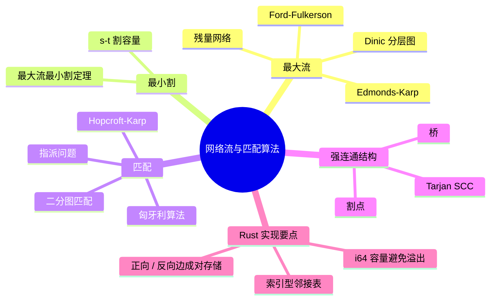
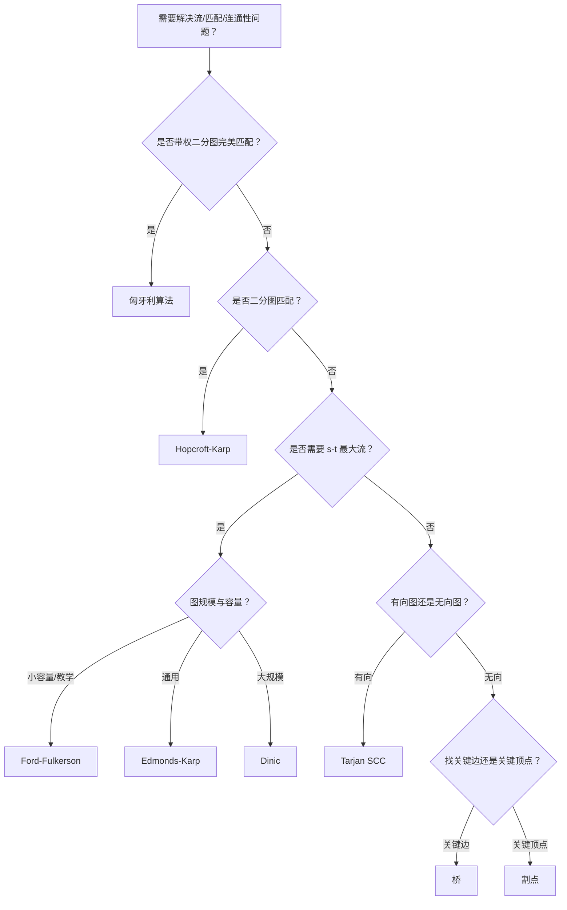

> **内容分级**: [专家级]
> **本节关键术语**: 网络流 (Network Flow) · 残量网络 (Residual Network) · 最大流 (Maximum Flow) · 最小割 (Minimum Cut) · Ford-Fulkerson · Edmonds-Karp · Dinic · 二分图匹配 (Bipartite Matching) · Hopcroft-Karp · 匈牙利算法 (Hungarian Algorithm) · 强连通分量 (SCC) · 桥 (Bridge) · 割点 (Articulation Point) — [完整对照表](../../00_meta/01_terminology/01_terminology_glossary.md)

# 网络流与匹配算法

**EN**: Network Flow and Matching Algorithms
**Summary**: Maximum flow/minimum cut, bipartite matching, Hopcroft-Karp, Hungarian algorithm, and strong-connectivity structures in Rust.

> **Rust 版本**: 1.97.0+ (Edition 2024)
> **Bloom 层级**: L2-L3
> **权威来源**: 本文件为 `concept/` 权威页。
> **A/S/P 标记**: **S+P** — Structure + Procedure
> **定位**: 在 Rust 所有权与索引型图表示下，系统讲解网络流、匹配与强连通结构的核心算法、复杂度与反模式。
> **前置概念**: [图算法 Rust 实现](03_graph_algorithms_in_rust.md) · [动态规划 Rust 实现](06_dynamic_programming_in_rust.md) · [贪心算法](05_greedy_and_approximation_algorithms.md) · [所有权](../../01_foundation/01_ownership_borrow_lifetime/01_ownership.md)
> **后置概念**: [概率与近似数据结构](15_probabilistic_data_structures.md) · [随机化与概率算法](09_randomized_and_probabilistic_algorithms.md) · [c08_algorithms crate docs](../../../crates/c08_algorithms/docs/README.md)
> **L5 对比**: [Rust vs C++](../../05_comparative/01_systems_languages/01_rust_vs_cpp.md)

---

> **来源 / Provenance**:
> **P0** [The Rust Programming Language](https://doc.rust-lang.org/book/title-page.html) ·
> **P0** [Rust Reference](https://doc.rust-lang.org/reference/introduction.html) ·
> **P1** [Cormen, Leiserson, Rivest & Stein — *Introduction to Algorithms*, 4th ed.](https://mitpress.mit.edu/9780262046305/introduction-to-algorithms/) ·
> **P2** [Competitive Programmer's Handbook](https://cses.fi/book/book.pdf) ·
> **P2** [Algorithmica — Graph Algorithms](https://algorithmica.org/)

---

## 🧠 知识结构图



> **认知功能**: 本 mindmap 从“最大流 → 最小割 → 匹配 → 强连通结构”组织，帮助读者根据问题是求流量、配对还是图连通骨架，快速选择算法。

---

## 一、权威定义

**流网络（Flow Network）** 是一个有向图 `G = (V, E)`，每条边 `(u, v)` 有非负容量 `c(u, v)`，并指定源点 `s` 与汇点 `t`。一个 **s-t 流** `f` 满足：

1. **容量限制**：对每条边 `0 ≤ f(u, v) ≤ c(u, v)`。
2. **流量守恒**：除 `s, t` 外，每个顶点的入流等于出流。

**残量网络（Residual Network）** 中，对每条边 `(u, v)` 引入残量容量 `c_f(u, v) = c(u, v) - f(u, v)`，并添加反向边 `c_f(v, u) = f(u, v)`，表示可“撤销”的流量。所有增广路算法都在残量网络上寻找从 `s` 到 `t` 的路径并增加流量。

**匹配（Matching）** 是图中一组没有公共顶点的边。在二分图中，最大匹配可转化为最大流；对于稠密二分图或带权指派问题，使用 **匈牙利算法**。

> **来源**: [CLRS 2022](https://mitpress.mit.edu/9780262046305/introduction-to-algorithms/) · [CP Handbook](https://cses.fi/book/book.pdf)

---

## 二、最大流

### 2.1 邻接表与反向边

Rust 中通常用索引型邻接表，每条边同时存储正向边和反向边。反向边的容量初始为 `0`，用于在增广时“退回”流量。

```rust
#[derive(Debug, Clone)]
struct Edge {
    to: usize,
    rev: usize,
    cap: i64,
}

#[derive(Debug, Clone)]
struct FlowNetwork {
    n: usize,
    adj: Vec<Vec<Edge>>,
}

impl FlowNetwork {
    fn new(n: usize) -> Self {
        Self { n, adj: vec![Vec::new(); n] }
    }

    fn add_edge(&mut self, u: usize, v: usize, cap: i64) {
        assert!(u < self.n && v < self.n);
        let rev_u = self.adj[v].len();
        let rev_v = self.adj[u].len();
        self.adj[u].push(Edge { to: v, rev: rev_u, cap });
        self.adj[v].push(Edge { to: u, rev: rev_v, cap: 0 });
    }
}

fn main() {
    let mut net = FlowNetwork::new(2);
    net.add_edge(0, 1, 5);
    assert_eq!(net.adj[0][0].cap, 5);
    assert_eq!(net.adj[1][0].cap, 0);
}
```

**所有权要点**：容量用 `i64` 保存流量差额；用 `rev` 索引直接找到反向边，避免指针自引用。

### 2.2 Ford-Fulkerson 方法

Ford-Fulkerson 不断在残量网络中寻找任意一条 `s-t` 路径并增广。时间复杂度为 `O(E · |f*|)`，其中 `|f*|` 是最大流值。

```rust
use std::usize;

#[derive(Debug, Clone)]
struct Edge { to: usize, rev: usize, cap: i64 }

#[derive(Debug, Clone)]
struct FlowNetwork { n: usize, adj: Vec<Vec<Edge>> }

impl FlowNetwork {
    fn new(n: usize) -> Self { Self { n, adj: vec![Vec::new(); n] } }

    fn add_edge(&mut self, u: usize, v: usize, cap: i64) {
        let rev_u = self.adj[v].len();
        let rev_v = self.adj[u].len();
        self.adj[u].push(Edge { to: v, rev: rev_u, cap });
        self.adj[v].push(Edge { to: u, rev: rev_v, cap: 0 });
    }

    fn ford_fulkerson(&mut self, s: usize, t: usize) -> i64 {
        let mut flow = 0i64;
        loop {
            let mut parent = vec![usize::MAX; self.n];
            let mut parent_edge = vec![usize::MAX; self.n];
            parent[s] = self.n; // 访问标记
            if !self.dfs(s, t, &mut parent, &mut parent_edge) {
                break;
            }
            let mut add = i64::MAX;
            let mut v = t;
            while v != s {
                let u = parent[v];
                let ei = parent_edge[v];
                add = add.min(self.adj[u][ei].cap);
                v = u;
            }
            v = t;
            while v != s {
                let u = parent[v];
                let ei = parent_edge[v];
                let rev = self.adj[u][ei].rev;
                self.adj[u][ei].cap -= add;
                self.adj[v][rev].cap += add;
                v = u;
            }
            flow += add;
        }
        flow
    }

    fn dfs(&self, u: usize, t: usize, parent: &mut [usize], parent_edge: &mut [usize]) -> bool {
        if u == t { return true; }
        for (i, e) in self.adj[u].iter().enumerate() {
            if e.cap > 0 && parent[e.to] == usize::MAX {
                parent[e.to] = u;
                parent_edge[e.to] = i;
                if self.dfs(e.to, t, parent, parent_edge) { return true; }
            }
        }
        false
    }
}

fn main() {
    let mut net = FlowNetwork::new(6);
    net.add_edge(0, 1, 16);
    net.add_edge(0, 2, 13);
    net.add_edge(1, 2, 10);
    net.add_edge(1, 3, 12);
    net.add_edge(2, 4, 14);
    net.add_edge(3, 2, 9);
    net.add_edge(3, 5, 20);
    net.add_edge(4, 3, 7);
    net.add_edge(4, 5, 4);
    assert_eq!(net.ford_fulkerson(0, 5), 23);
}
```

### 2.3 Edmonds-Karp

Edmonds-Karp 用 BFS 寻找最短（边数最少）增广路，将复杂度改进到 `O(V · E²)`。

```rust
use std::collections::VecDeque;

#[derive(Debug, Clone)]
struct Edge { to: usize, rev: usize, cap: i64 }

#[derive(Debug, Clone)]
struct FlowNetwork { n: usize, adj: Vec<Vec<Edge>> }

impl FlowNetwork {
    fn new(n: usize) -> Self { Self { n, adj: vec![Vec::new(); n] } }

    fn add_edge(&mut self, u: usize, v: usize, cap: i64) {
        let rev_u = self.adj[v].len();
        let rev_v = self.adj[u].len();
        self.adj[u].push(Edge { to: v, rev: rev_u, cap });
        self.adj[v].push(Edge { to: u, rev: rev_v, cap: 0 });
    }

    fn edmonds_karp(&mut self, s: usize, t: usize) -> i64 {
        let mut flow = 0i64;
        loop {
            let mut parent = vec![usize::MAX; self.n];
            let mut parent_edge = vec![usize::MAX; self.n];
            let mut q = VecDeque::from([s]);
            parent[s] = self.n;
            while let Some(u) = q.pop_front() {
                if u == t { break; }
                for (i, e) in self.adj[u].iter().enumerate() {
                    if e.cap > 0 && parent[e.to] == usize::MAX {
                        parent[e.to] = u;
                        parent_edge[e.to] = i;
                        q.push_back(e.to);
                    }
                }
            }
            if parent[t] == usize::MAX { break; }

            let mut add = i64::MAX;
            let mut v = t;
            while v != s {
                let u = parent[v];
                let ei = parent_edge[v];
                add = add.min(self.adj[u][ei].cap);
                v = u;
            }
            v = t;
            while v != s {
                let u = parent[v];
                let ei = parent_edge[v];
                let rev = self.adj[u][ei].rev;
                self.adj[u][ei].cap -= add;
                self.adj[v][rev].cap += add;
                v = u;
            }
            flow += add;
        }
        flow
    }
}

fn main() {
    let mut net = FlowNetwork::new(6);
    net.add_edge(0, 1, 16);
    net.add_edge(0, 2, 13);
    net.add_edge(1, 2, 10);
    net.add_edge(1, 3, 12);
    net.add_edge(2, 4, 14);
    net.add_edge(3, 2, 9);
    net.add_edge(3, 5, 20);
    net.add_edge(4, 3, 7);
    net.add_edge(4, 5, 4);
    assert_eq!(net.edmonds_karp(0, 5), 23);
}
```

### 2.4 Dinic 算法

Dinic 先 BFS 构建分层图，再 DFS 沿层次递增方向发送阻塞流。单位容量网络复杂度 `O(E · √V)`，一般网络 `O(E · V²)`。

```rust
use std::collections::VecDeque;

#[derive(Debug, Clone)]
struct Edge { to: usize, rev: usize, cap: i64 }

#[derive(Debug, Clone)]
struct FlowNetwork { n: usize, adj: Vec<Vec<Edge>> }

impl FlowNetwork {
    fn new(n: usize) -> Self { Self { n, adj: vec![Vec::new(); n] } }

    fn add_edge(&mut self, u: usize, v: usize, cap: i64) {
        let rev_u = self.adj[v].len();
        let rev_v = self.adj[u].len();
        self.adj[u].push(Edge { to: v, rev: rev_u, cap });
        self.adj[v].push(Edge { to: u, rev: rev_v, cap: 0 });
    }

    fn dinic(&mut self, s: usize, t: usize) -> i64 {
        let mut flow = 0i64;
        loop {
            let level = self.bfs_level(s);
            if level[t] < 0 { break; }
            let mut ptr = vec![0usize; self.n];
            loop {
                let pushed = self.dfs_send(s, t, i64::MAX, &level, &mut ptr);
                if pushed == 0 { break; }
                flow += pushed;
            }
        }
        flow
    }

    fn bfs_level(&self, s: usize) -> Vec<i32> {
        let mut level = vec![-1i32; self.n];
        let mut q = VecDeque::from([s]);
        level[s] = 0;
        while let Some(u) = q.pop_front() {
            for e in &self.adj[u] {
                if e.cap > 0 && level[e.to] < 0 {
                    level[e.to] = level[u] + 1;
                    q.push_back(e.to);
                }
            }
        }
        level
    }

    fn dfs_send(&mut self, u: usize, t: usize, pushed: i64, level: &[i32], ptr: &mut [usize]) -> i64 {
        if u == t || pushed == 0 { return pushed; }
        while ptr[u] < self.adj[u].len() {
            let i = ptr[u];
            let e_to = self.adj[u][i].to;
            let e_cap = self.adj[u][i].cap;
            let e_rev = self.adj[u][i].rev;
            if e_cap > 0 && level[e_to] == level[u] + 1 {
                let tr = self.dfs_send(e_to, t, pushed.min(e_cap), level, ptr);
                if tr > 0 {
                    self.adj[u][i].cap -= tr;
                    self.adj[e_to][e_rev].cap += tr;
                    return tr;
                }
            }
            ptr[u] += 1;
        }
        0
    }
}

fn main() {
    let mut net = FlowNetwork::new(6);
    net.add_edge(0, 1, 16);
    net.add_edge(0, 2, 13);
    net.add_edge(1, 2, 10);
    net.add_edge(1, 3, 12);
    net.add_edge(2, 4, 14);
    net.add_edge(3, 2, 9);
    net.add_edge(3, 5, 20);
    net.add_edge(4, 3, 7);
    net.add_edge(4, 5, 4);
    assert_eq!(net.dinic(0, 5), 23);
}
```

---

## 三、最小割与最大流最小割定理

一个 **s-t 割** `(S, T)` 把顶点分成 `s ∈ S` 且 `t ∈ T` 的两部分，割容量为从 `S` 到 `T` 的所有边容量之和。

**最大流最小割定理**：最大 `s-t` 流的值等于最小 `s-t` 割的容量。直观上，增广路算法终止时，残量网络中从 `s` 可达的顶点集合 `S` 即给出最小割。

Rust 中求最小割边集：在 `dinic` 或 `edmonds_karp` 运行结束后，从 `s` 做一次 DFS/BFS，只走残量容量 `> 0` 的边，所有从可达集指向不可达集的正向边即为最小割边。

---

## 四、匹配

### 4.1 二分图匹配：Hopcroft-Karp

Hopcroft-Karp 在 `O(E · √V)` 时间内求二分图最大匹配。核心思想是用 BFS 构造由最短增广路组成的层次图，然后 DFS 同时找出多条不相交增广路。

```rust
use std::collections::VecDeque;

struct BipartiteGraph {
    n_left: usize,
    n_right: usize,
    adj: Vec<Vec<usize>>,
}

impl BipartiteGraph {
    fn new(n_left: usize, n_right: usize) -> Self {
        Self { n_left, n_right, adj: vec![Vec::new(); n_left] }
    }

    fn add_edge(&mut self, u: usize, v: usize) {
        assert!(u < self.n_left && v < self.n_right);
        self.adj[u].push(v);
    }

    fn hopcroft_karp(&self) -> Vec<Option<usize>> {
        let mut pair_u = vec![None; self.n_left];
        let mut pair_v = vec![None; self.n_right];
        let mut dist = vec![0usize; self.n_left];

        while self.bfs(&pair_u, &pair_v, &mut dist) {
            for u in 0..self.n_left {
                if pair_u[u].is_none() {
                    self.dfs(u, &mut pair_u, &mut pair_v, &mut dist);
                }
            }
        }
        pair_u
    }

    fn bfs(&self, pair_u: &[Option<usize>], pair_v: &[Option<usize>], dist: &mut [usize]) -> bool {
        let mut q = VecDeque::new();
        for u in 0..self.n_left {
            if pair_u[u].is_none() {
                dist[u] = 0;
                q.push_back(u);
            } else {
                dist[u] = usize::MAX;
            }
        }
        let mut found_free = false;
        while let Some(u) = q.pop_front() {
            for &v in &self.adj[u] {
                if let Some(pu) = pair_v[v] {
                    if dist[pu] == usize::MAX {
                        dist[pu] = dist[u] + 1;
                        q.push_back(pu);
                    }
                } else {
                    found_free = true;
                }
            }
        }
        found_free
    }

    fn dfs(&self, u: usize, pair_u: &mut [Option<usize>], pair_v: &mut [Option<usize>], dist: &mut [usize]) -> bool {
        for &v in &self.adj[u] {
            if let Some(pu) = pair_v[v] {
                if dist[pu] == dist[u] + 1 && self.dfs(pu, pair_u, pair_v, dist) {
                    pair_u[u] = Some(v);
                    pair_v[v] = Some(u);
                    return true;
                }
            } else {
                pair_u[u] = Some(v);
                pair_v[v] = Some(u);
                return true;
            }
        }
        dist[u] = usize::MAX;
        false
    }
}

fn main() {
    let mut g = BipartiteGraph::new(4, 4);
    g.add_edge(0, 0);
    g.add_edge(0, 1);
    g.add_edge(1, 1);
    g.add_edge(1, 2);
    g.add_edge(2, 2);
    g.add_edge(2, 3);
    g.add_edge(3, 3);
    let matching = g.hopcroft_karp();
    assert_eq!(matching.iter().filter(|x| x.is_some()).count(), 4);
}
```

### 4.2 指派问题：匈牙利算法

匈牙利算法解决带权二分图完美匹配（指派问题），在 `O(n³)` 时间内求出总成本最小的匹配。下面实现假设左右两部分大小均为 `n`，输入 `cost` 为 `(n+1) × (n+1)` 矩阵，`cost[0]` 与 `cost[i][0]` 被忽略。

```rust
const INF: i64 = i64::MAX / 4;

fn hungarian(cost: &[Vec<i64>]) -> (i64, Vec<usize>) {
    let n = cost.len() - 1;
    let mut u = vec![0i64; n + 1];
    let mut v = vec![0i64; n + 1];
    let mut p = vec![0usize; n + 1];
    let mut way = vec![0usize; n + 1];

    for i in 1..=n {
        p[0] = i;
        let mut j0 = 0usize;
        let mut minv = vec![INF; n + 1];
        let mut used = vec![false; n + 1];
        loop {
            used[j0] = true;
            let i0 = p[j0];
            let mut delta = INF;
            let mut j1 = 0usize;
            for j in 1..=n {
                if !used[j] {
                    let cur = cost[i0][j] - u[i0] - v[j];
                    if cur < minv[j] {
                        minv[j] = cur;
                        way[j] = j0;
                    }
                    if minv[j] < delta {
                        delta = minv[j];
                        j1 = j;
                    }
                }
            }
            for j in 0..=n {
                if used[j] {
                    u[p[j]] += delta;
                    v[j] -= delta;
                } else {
                    minv[j] -= delta;
                }
            }
            j0 = j1;
            if p[j0] == 0 {
                break;
            }
        }
        loop {
            let j1 = way[j0];
            p[j0] = p[j1];
            j0 = j1;
            if j0 == 0 {
                break;
            }
        }
    }

    let mut assignment = vec![0usize; n + 1];
    for j in 1..=n {
        if p[j] != 0 {
            assignment[p[j]] = j;
        }
    }
    (v[0].abs(), assignment[1..].to_vec())
}

fn main() {
    let cost = vec![
        vec![0, 0, 0, 0, 0],
        vec![0, 9, 2, 7, 8],
        vec![0, 6, 4, 3, 7],
        vec![0, 5, 8, 1, 8],
        vec![0, 7, 6, 9, 4],
    ];
    let (min_cost, assignment) = hungarian(&cost);
    assert_eq!(min_cost, 13);
    assert_eq!(assignment, vec![2, 1, 3, 4]);
}
```

> **来源对齐**: Kuhn (1955) 与 Munkres (1957) 原始论文；CLRS §26.3 给出指派问题的等价表述。

---

## 五、强连通分量、桥与割点概述

### 5.1 Tarjan 强连通分量

强连通分量（SCC）是有向图中任意两点互相可达的极大子图。Tarjan 算法用一次 DFS 在 `O(V + E)` 内求出所有 SCC。

```rust
fn tarjan_scc(adj: &[Vec<usize>]) -> Vec<Vec<usize>> {
    let n = adj.len();
    let mut index = 0usize;
    let mut indices = vec![None; n];
    let mut lowlink = vec![0usize; n];
    let mut stack = Vec::new();
    let mut on_stack = vec![false; n];
    let mut sccs = Vec::new();

    for v in 0..n {
        if indices[v].is_none() {
            strongconnect(
                v, adj, &mut index, &mut indices, &mut lowlink,
                &mut stack, &mut on_stack, &mut sccs,
            );
        }
    }
    sccs
}

fn strongconnect(
    v: usize,
    adj: &[Vec<usize>],
    index: &mut usize,
    indices: &mut [Option<usize>],
    lowlink: &mut [usize],
    stack: &mut Vec<usize>,
    on_stack: &mut [bool],
    sccs: &mut Vec<Vec<usize>>,
) {
    indices[v] = Some(*index);
    lowlink[v] = *index;
    *index += 1;
    stack.push(v);
    on_stack[v] = true;

    for &w in &adj[v] {
        if indices[w].is_none() {
            strongconnect(w, adj, index, indices, lowlink, stack, on_stack, sccs);
            lowlink[v] = lowlink[v].min(lowlink[w]);
        } else if on_stack[w] {
            lowlink[v] = lowlink[v].min(indices[w].unwrap());
        }
    }

    if lowlink[v] == indices[v].unwrap() {
        let mut component = Vec::new();
        loop {
            let w = stack.pop().unwrap();
            on_stack[w] = false;
            component.push(w);
            if w == v { break; }
        }
        sccs.push(component);
    }
}

fn main() {
    let adj = vec![
        vec![1],
        vec![2, 4],
        vec![3, 5],
        vec![0, 6],
        vec![5],
        vec![4],
        vec![7],
        vec![6],
    ];
    let sccs = tarjan_scc(&adj);
    assert_eq!(sccs.len(), 3);
}
```

### 5.2 桥与割点

**桥（Bridge）**：删除后会使图不连通的边。**割点（Articulation Point）**：删除后会使连通分量数量增加的顶点。两者均可用改进的 Tarjan DFS 在 `O(V + E)` 内求解。

```rust
fn find_bridges(adj: &[Vec<usize>]) -> Vec<(usize, usize)> {
    let n = adj.len();
    let mut disc = vec![None; n];
    let mut low = vec![0usize; n];
    let mut bridges = Vec::new();
    let mut time = 0usize;
    for u in 0..n {
        if disc[u].is_none() {
            dfs_bridge(u, usize::MAX, adj, &mut time, &mut disc, &mut low, &mut bridges);
        }
    }
    bridges
}

fn dfs_bridge(
    u: usize,
    parent: usize,
    adj: &[Vec<usize>],
    time: &mut usize,
    disc: &mut [Option<usize>],
    low: &mut [usize],
    bridges: &mut Vec<(usize, usize)>,
) {
    disc[u] = Some(*time);
    low[u] = *time;
    *time += 1;
    for &v in &adj[u] {
        if v == parent { continue; }
        if disc[v].is_none() {
            dfs_bridge(v, u, adj, time, disc, low, bridges);
            low[u] = low[u].min(low[v]);
            if low[v] > disc[u].unwrap() {
                bridges.push((u.min(v), u.max(v)));
            }
        } else {
            low[u] = low[u].min(disc[v].unwrap());
        }
    }
}

fn main() {
    let adj = vec![
        vec![1, 2],
        vec![0, 2],
        vec![0, 1, 3],
        vec![2, 4],
        vec![3],
    ];
    let mut bridges = find_bridges(&adj);
    bridges.sort();
    assert_eq!(bridges, vec![(2, 3), (3, 4)]);
}
```

---

## 六、复杂度与选型

| 问题 | 算法 | 时间复杂度 | 空间复杂度 | 适用场景 |
|:---|:---|:---:|:---:|:---|
| **最大流（容量小）** | Ford-Fulkerson | `O(E · \|f*\|)` | `O(V + E)` | 教学、容量值较小的图 |
| **最大流（一般）** | Edmonds-Karp | `O(V · E²)` | `O(V + E)` | 通用实现，代码短 |
| **最大流（大规模）** | Dinic | `O(E · V²)`，单位网络 `O(E · √V)` | `O(V + E)` | 竞赛与工业级网络流 |
| **二分图最大匹配** | Hopcroft-Karp | `O(E · √V)` | `O(V + E)` | 大规模二分图匹配 |
| **带权指派问题** | 匈牙利算法 | `O(n³)` | `O(n²)` | 稠密二分图最小成本完美匹配 |
| **强连通分量** | Tarjan SCC | `O(V + E)` | `O(V)` | 有向图缩点、2-SAT |
| **桥 / 割点** | Tarjan DFS | `O(V + E)` | `O(V)` | 网络脆弱性分析、关键边/顶点识别 |

**选型决策树**：



---

## 七、反例与反模式

### 反例 1：在持有边引用时修改网络

```rust,compile_fail,E0502
#[derive(Debug, Clone)]
struct Edge { to: usize, rev: usize, cap: i64 }

#[derive(Debug, Clone)]
struct Net { adj: Vec<Vec<Edge>> }

impl Net {
    fn add_edge(&mut self, u: usize, v: usize, cap: i64) {
        self.adj[u].push(Edge { to: v, rev: self.adj[v].len(), cap });
    }

    fn buggy(&mut self, path: &[usize]) {
        let first = &self.adj[path[0]][0]; // 不可变借用
        self.add_edge(0, 1, 1);            // ❌ 需要 &mut self
        println!("{}", first.cap);
    }
}
```

**修正**：先读取需要的值，再释放引用，最后统一修改网络。

### 反例 2：Ford-Fulkerson 用于大容量图

```rust,ignore
// ❌ 错误：在容量为 10^9 的图上使用 Ford-Fulkerson
// 增广次数可达 10^9 次，运行时间无法接受。
let mut net = FlowNetwork::new(4);
net.add_edge(0, 1, 1_000_000_000);
net.add_edge(1, 3, 1_000_000_000);
net.add_edge(0, 2, 1);
net.add_edge(2, 3, 1);
let _ = net.ford_fulkerson(0, 3);
```

**修正**：大容量图应使用 Edmonds-Karp 或 Dinic，其复杂度与最大流值无关。

### 反例 3：忘记添加反向边

```rust,ignore
// ❌ 错误：只添加正向边，无法撤销错误分配的流量
self.adj[u].push(Edge { to: v, rev: 0, cap });
```

**修正**：每次 `add_edge` 必须同时加入容量为 `0` 的反向边，并正确设置 `rev` 索引。

### 反例 4：匈牙利算法使用 i32 并发生溢出

```rust,ignore
// ❌ 错误：成本或势能累加时可能溢出 i32
let cur = cost[i0][j] - u[i0] - v[j];
```

**修正**：使用 `i64` 保存成本与势能，并在初始化势能用足够大的 `INF`（如 `i64::MAX / 4`）。

---

## 八、权威来源索引

- **P0 官方**: [The Rust Programming Language](https://doc.rust-lang.org/book/title-page.html)
- **P0 官方**: [Rust Reference](https://doc.rust-lang.org/reference/introduction.html)
- **P1 学术**: [Cormen, Leiserson, Rivest & Stein — *Introduction to Algorithms*, 4th ed.](https://mitpress.mit.edu/9780262046305/introduction-to-algorithms/)（最大流、最小割、指派问题）
- **P1 学术**: [Ford & Fulkerson (1956) — Maximal Flow Through a Network](https://doi.org/10.4153/CJM-1956-045-5)
- **P1 学术**: [Edmonds & Karp (1972) — Theoretical Improvements in Algorithmic Efficiency for Network Flow Problems](https://doi.org/10.1145/321694.321699)
- **P1 学术**: [Dinic (1970) — Algorithm for Solution of a Problem of Maximum Flow in a Network with Power Estimation](https://doi.org/10.1137/0202019)
- **P1 学术**: [Hopcroft & Karp (1973) — An n^(5/2) Algorithm for Maximum Matchings in Bipartite Graphs](https://doi.org/10.1137/0202019)
- **P1 学术**: [Kuhn (1955); Munkres (1957) — Hungarian Algorithm](https://doi.org/10.4153/CJM-1957-001-0)
- **P1 学术**: [Tarjan (1972) — Depth-First Search and Linear Graph Algorithms](https://doi.org/10.1137/0201010)
- **P2 生态**: [Competitive Programmer's Handbook](https://cses.fi/book/book.pdf)
- **P2 生态**: [Algorithmica — Graph Algorithms](https://algorithmica.org/)

> **文档版本**: 1.0 ｜ **最后更新**: 2026-08-03 ｜ **状态**: ✅ 新建权威页

---

## 国际化权威来源对齐说明

| 主题 | 本页做法 | 权威来源依据 |
|:---|:---|:---|
| 残量网络与增广路 | 正向 / 反向边成对存储 | CLRS §26.2 |
| Ford-Fulkerson | DFS 增广，i64 容量 | Ford & Fulkerson (1956) |
| Edmonds-Karp | BFS 最短增广路 | Edmonds & Karp (1972) |
| Dinic | 分层图 + 阻塞流 | Dinic (1970); Algorithmica |
| Hopcroft-Karp | BFS 分层 + 多路 DFS | Hopcroft & Karp (1973); CP Handbook |
| 匈牙利算法 | O(n³) 势能实现 | Kuhn (1955); Munkres (1957) |
| SCC / 桥 / 割点 | Tarjan DFS | Tarjan (1972); CP Handbook |
