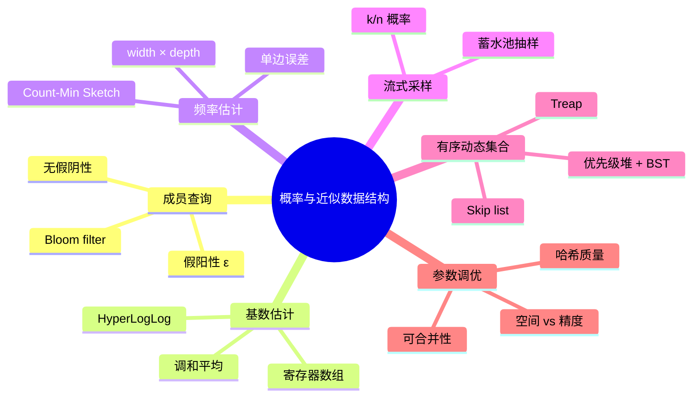
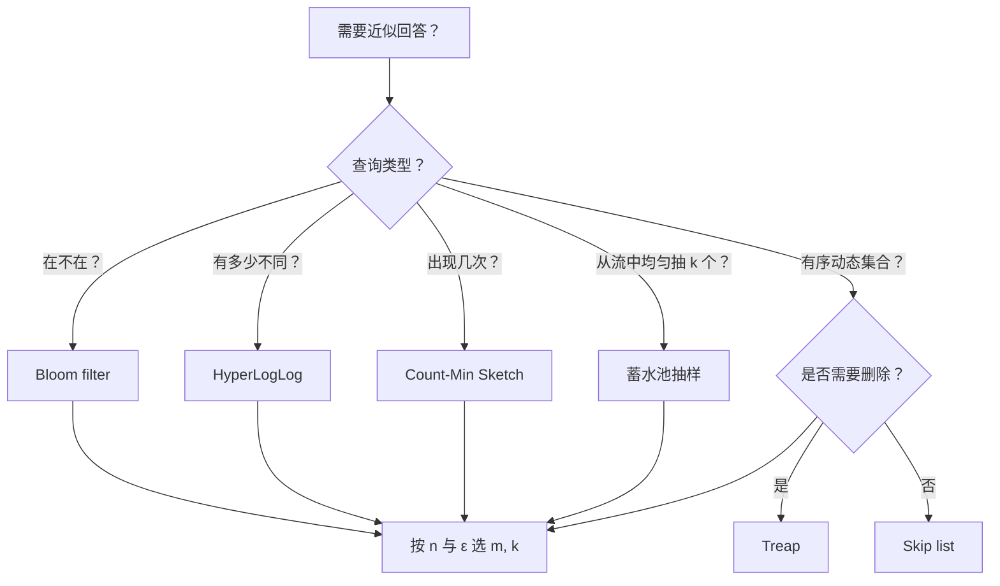

> **内容分级**: [专家级]
> **本节关键术语**: 概率数据结构 (Probabilistic Data Structure) · 近似数据结构 (Approximate Data Structure) · Bloom filter · HyperLogLog · Count-Min Sketch · 蓄水池抽样 (Reservoir Sampling) · 跳表 (Skip List) · Treap · 假阳性 (False Positive) · 错误界 (Error Bound) — [完整对照表](../../00_meta/01_terminology/01_terminology_glossary.md)

# 概率与近似数据结构

**EN**: Probabilistic and Approximate Data Structures
**Summary**: Space-efficient probabilistic data structures: Bloom filter, HyperLogLog, Count-Min Sketch, reservoir sampling, skip list, treap, with Rust implementation notes.

> **Rust 版本**: 1.97.0+ (Edition 2024)
> **Bloom 层级**: L2-L3
> **权威来源**: 本文件为 `concept/` 权威页。
> **A/S/P 标记**: **S+P+A** — Structure + Procedure + Application
> **定位**: 系统讲解用可控误差换取亚线性内存的概率/近似数据结构，覆盖成员查询、基数估计、频率估计、有序集合与流式采样，并给出 Rust 实现与参数调优要点。
> **前置概念**: [随机化与概率算法](09_randomized_and_probabilistic_algorithms.md) · [在线与流式算法](11_online_and_streaming_algorithms.md) · [所有权感知的数据结构](02_ownership_aware_data_structures.md) · [集合类型与哈希策略](../../01_foundation/05_collections/01_collections.md)
> **后置概念**: [网络流与匹配算法](14_network_flow_and_matching.md) · [缓存友好与 SIMD 算法](04_cache_friendly_and_simd_algorithms.md) · [c08_algorithms crate docs](../../../crates/c08_algorithms/docs/README.md)
> **L5 对比**: [Rust vs C++](../../05_comparative/01_systems_languages/01_rust_vs_cpp.md)

---

> **来源 / Provenance**:
> **P0** [The Rust Programming Language](https://doc.rust-lang.org/book/title-page.html) ·
> **P0** [Rust Reference](https://doc.rust-lang.org/reference/introduction.html) ·
> **P1** [Leskovec, Rajaraman & Ullman — *Mining of Massive Datasets*, 3rd ed.](http://www.mmds.org/) ·
> **P1** [Cormen, Leiserson, Rivest & Stein — *Introduction to Algorithms*, 4th ed.](https://mitpress.mit.edu/9780262046305/introduction-to-algorithms/) ·
> **P2** [docs.rs/bloomfilter](https://docs.rs/bloomfilter/latest/bloomfilter/) ·
> **P2** [docs.rs/probabilistic-collections](https://docs.rs/probabilistic-collections/latest/probabilistic_collections/) ·
> **P2** [docs.rs/hyperloglog](https://docs.rs/hyperloglog/latest/hyperloglog/)

---

## 🧠 知识结构图



> **认知功能**: 本 mindmap 按“查询类型 → 数据结构 → 参数权衡”组织，帮助读者根据要回答的问题（在不在、有多少、出现几次、均匀采样、有序集合）选择合适结构。

---

## 一、权威定义

**概率数据结构（Probabilistic Data Structure）** 用有界误差换取远低于输入规模的内存。与确定性结构不同，它给出的答案通常伴随可证明的误差界 `(ε, δ)`：

- `ε`：近似误差或假阳性率。
- `δ`：结果落在误差界内的置信度。

**近似数据结构（Approximate Data Structure）** 是更广义的称呼，强调“不必精确”即可满足工程需求。概率数据结构是其中最重要的一类，还包括近似最近邻（LSH）、近似计数等。

**核心权衡**：内存、更新/查询时间、精度三者不可兼得。设计时应先量化业务可接受的误差，再选择参数。

> **来源**: [MMDS](http://www.mmds.org/) · [CLRS 2022](https://mitpress.mit.edu/9780262046305/introduction-to-algorithms/)

---

## 二、Bloom filter：成员查询

Bloom filter 用位数组和 `k` 个哈希函数近似表示集合：

- `insert(x)`：把 `x` 对应的 `k` 个位置置 1。
- `may_contain(x)`：若任一位置为 0，则 `x` **一定不在**；否则**可能存在**（假阳性）。

下面给出仅依赖标准库的教学实现。生产环境请使用 `bloomfilter` 或 `fastbloom` crate。

```rust
use std::collections::hash_map::DefaultHasher;
use std::hash::{Hash, Hasher};

pub struct BloomFilter {
    bits: Vec<u64>,
    k: usize,
    num_bits: usize,
}

impl BloomFilter {
    pub fn new(expected_items: usize, false_positive_rate: f64) -> Self {
        assert!(false_positive_rate > 0.0 && false_positive_rate < 1.0);
        let ln2 = std::f64::consts::LN_2;
        let m = -(expected_items as f64 * false_positive_rate.ln() / (ln2 * ln2)).ceil() as usize;
        let k = (m as f64 / expected_items as f64 * ln2).ceil().max(1.0) as usize;
        let num_bits = m.max(64);
        let words = (num_bits + 63) / 64;
        Self { bits: vec![0u64; words], k, num_bits }
    }

    fn hash<T: Hash + ?Sized>(&self, item: &T, salt: u64) -> usize {
        let mut hasher = DefaultHasher::new();
        item.hash(&mut hasher);
        salt.hash(&mut hasher);
        (hasher.finish() as usize) % self.num_bits
    }

    pub fn insert<T: Hash + ?Sized>(&mut self, item: &T) {
        for i in 0..self.k {
            let idx = self.hash(item, i as u64);
            let (word, bit) = (idx / 64, idx % 64);
            self.bits[word] |= 1u64 << bit;
        }
    }

    pub fn may_contain<T: Hash + ?Sized>(&self, item: &T) -> bool {
        (0..self.k).all(|i| {
            let idx = self.hash(item, i as u64);
            let (word, bit) = (idx / 64, idx % 64);
            (self.bits[word] >> bit) & 1 == 1
        })
    }
}

fn main() {
    let mut bf = BloomFilter::new(1000, 0.01);
    bf.insert("alice");
    bf.insert("bob");
    assert!(bf.may_contain("alice"));
    assert!(bf.may_contain("bob"));
    assert!(!bf.may_contain("charlie")); // 无假阴性
}
```

**错误界**（Bloom 1970）：当 `k = (m/n) ln 2` 时，假阳性率最小，约为 `0.6185^(m/n)`。

---

## 三、HyperLogLog：基数估计

HyperLogLog 用 `m = 2^p` 个寄存器估计集合中不同元素的数量，空间仅 `O(m)`（通常几 KB 即可估计数十亿级基数）。

```rust
use std::collections::hash_map::DefaultHasher;
use std::hash::{Hash, Hasher};

pub struct HyperLogLog {
    p: u8,
    m: usize,
    regs: Vec<u8>,
    alpha: f64,
}

impl HyperLogLog {
    pub fn new(p: u8) -> Self {
        assert!((4..=16).contains(&p));
        let m = 1usize << p;
        let alpha = if m >= 128 {
            0.7213 / (1.0 + 1.079 / m as f64)
        } else {
            // m = 16, 32, 64 时的经验常数
            match m {
                16 => 0.673,
                32 => 0.697,
                64 => 0.709,
                _ => 0.7213,
            }
        };
        Self { p, m, regs: vec![0u8; m], alpha }
    }

    fn hash<T: Hash + ?Sized>(&self, item: &T) -> u64 {
        let mut hasher = DefaultHasher::new();
        item.hash(&mut hasher);
        hasher.finish()
    }

    pub fn add<T: Hash + ?Sized>(&mut self, item: &T) {
        let x = self.hash(item);
        let idx = (x >> (64 - self.p)) as usize;
        let w = x << self.p;
        let rank = (w.leading_zeros() as usize + 1).min(64);
        self.regs[idx] = self.regs[idx].max(rank as u8);
    }

    pub fn estimate(&self) -> f64 {
        let m = self.m as f64;
        let mut sum = 0.0;
        for &r in &self.regs {
            sum += 2f64.powi(-(r as i32));
        }
        let raw = self.alpha * m * m / sum;
        let zeros = self.regs.iter().filter(|&&r| r == 0).count();
        if raw <= 2.5 * m && zeros != 0 {
            // 小基数修正：线性计数
            m * (m / zeros as f64).ln()
        } else {
            raw
        }
    }
}

fn main() {
    let mut hll = HyperLogLog::new(14);
    for i in 0..10_000u64 {
        hll.add(&i);
    }
    let est = hll.estimate();
    println!("estimated cardinality ≈ {est}");
    assert!(est > 0.0 && est < 20_000.0);
}
```

> **来源对齐**: Flajolet et al. (2007) 给出 HyperLogLog 的误差分析；标准误差约为 `1.04 / √m`。

---

## 四、Count-Min Sketch：频率估计

Count-Min Sketch 估计元素频率，返回结果**只高估、不低估**（one-sided error）。空间为 `O((1/ε)·ln(1/δ))`。

```rust
use std::collections::hash_map::DefaultHasher;
use std::hash::{Hash, Hasher};

pub struct CountMinSketch {
    width: usize,
    depth: usize,
    table: Vec<Vec<u64>>,
    salts: Vec<u64>,
}

impl CountMinSketch {
    pub fn new(epsilon: f64, delta: f64) -> Self {
        assert!(epsilon > 0.0 && epsilon < 1.0);
        assert!(delta > 0.0 && delta < 1.0);
        let width = (std::f64::consts::E / epsilon).ceil() as usize;
        let depth = (1.0 / delta).ln().ceil() as usize;
        let salts: Vec<u64> = (0..depth)
            .map(|i| 0x9e3779b97f4a7c15u64.wrapping_add(i as u64))
            .collect();
        Self {
            width,
            depth,
            table: vec![vec![0u64; width]; depth],
            salts,
        }
    }

    fn hash<T: Hash + ?Sized>(&self, item: &T, salt: u64) -> usize {
        let mut hasher = DefaultHasher::new();
        item.hash(&mut hasher);
        salt.hash(&mut hasher);
        (hasher.finish() as usize) % self.width
    }

    pub fn add<T: Hash + ?Sized>(&mut self, item: &T) {
        for d in 0..self.depth {
            let idx = self.hash(item, self.salts[d]);
            self.table[d][idx] = self.table[d][idx].saturating_add(1);
        }
    }

    pub fn estimate<T: Hash + ?Sized>(&self, item: &T) -> u64 {
        (0..self.depth)
            .map(|d| self.table[d][self.hash(item, self.salts[d])])
            .min()
            .unwrap_or(0)
    }
}

fn main() {
    let mut cms = CountMinSketch::new(0.001, 0.01);
    let words = ["rust", "rust", "rust", "cargo", "cargo", "borrow"];
    for w in &words {
        cms.add(*w);
    }
    assert!(cms.estimate("rust") >= 3);
    assert!(cms.estimate("cargo") >= 2);
    assert!(cms.estimate("borrow") >= 1);
    assert!(cms.estimate("unsafe") == 0);
}
```

**误差保证**：对总次数为 `N` 的流，`estimate(x) ≤ count(x) + ε·N` 的概率至少 `1 - δ`。

---

## 五、蓄水池抽样：流式均匀采样

从未知长度或极大流中均匀抽取 `k` 个元素，每个元素最终进入样本的概率均为 `k/n`。

```rust
pub struct SplitMix64 {
    state: u64,
}

impl SplitMix64 {
    pub fn new(seed: u64) -> Self {
        Self { state: seed }
    }

    pub fn next_u64(&mut self) -> u64 {
        self.state = self.state.wrapping_add(0x9e3779b97f4a7c15);
        let mut z = self.state;
        z = (z ^ (z >> 30)).wrapping_mul(0xbf58476d1ce4e5b9);
        z = (z ^ (z >> 27)).wrapping_mul(0x94d049bb133111eb);
        z ^ (z >> 31)
    }

    pub fn next_usize(&mut self, n: usize) -> usize {
        (self.next_u64() as usize) % n
    }
}

fn reservoir_sample<T: Clone>(rng: &mut SplitMix64, stream: &[T], k: usize) -> Vec<T> {
    assert!(k > 0, "k must be positive");
    let mut reservoir: Vec<T> = stream.iter().take(k).cloned().collect();
    for (i, item) in stream.iter().enumerate().skip(k) {
        let j = rng.next_usize(i + 1);
        if j < k {
            reservoir[j] = item.clone();
        }
    }
    reservoir
}

fn main() {
    let mut rng = SplitMix64::new(0xbeef_cafe_1234_5678);
    let stream: Vec<u32> = (0..10_000).collect();
    let sample = reservoir_sample(&mut rng, &stream, 10);
    println!("reservoir sample: {:?}", sample);
    assert_eq!(sample.len(), 10);
}
```

---

## 六、Skip List：概率平衡搜索结构

Skip list 用随机层数替代红黑树的旋转，实现期望 `O(log n)` 的查找、插入、删除。

```rust
use std::cmp::Ordering;

pub struct SplitMix64 {
    state: u64,
}

impl SplitMix64 {
    pub fn new(seed: u64) -> Self { Self { state: seed } }
    pub fn next_u64(&mut self) -> u64 {
        self.state = self.state.wrapping_add(0x9e3779b97f4a7c15);
        let mut z = self.state;
        z = (z ^ (z >> 30)).wrapping_mul(0xbf58476d1ce4e5b9);
        z = (z ^ (z >> 27)).wrapping_mul(0x94d049bb133111eb);
        z ^ (z >> 31)
    }
}

pub struct SkipListSet<T: Ord> {
    head: Vec<Option<Box<Node<T>>>>,
    max_level: usize,
    rng: SplitMix64,
}

struct Node<T: Ord> {
    value: T,
    next: Vec<Option<Box<Node<T>>>>,
}

impl<T: Ord> SkipListSet<T> {
    pub fn new(max_level: usize, seed: u64) -> Self {
        Self {
            head: std::iter::repeat_with(|| None).take(max_level).collect(),
            max_level,
            rng: SplitMix64::new(seed),
        }
    }

    fn random_level(&mut self) -> usize {
        let mut level = 1;
        while level < self.max_level && self.rng.next_u64() % 2 == 0 {
            level += 1;
        }
        level
    }

    pub fn insert(&mut self, value: T) {
        let level = self.random_level();
        let mut new = Box::new(Node {
            value,
            next: std::iter::repeat_with(|| None).take(level).collect(),
        });
        // 教学简化：在每一层找到第一个 ≥ value 的节点并插入到表头侧
        for i in 0..level {
            if self.head[i].is_none() || self.head[i].as_ref().unwrap().value > new.value {
                new.next[i] = self.head[i].take();
                self.head[i] = Some(new);
                return;
            }
        }
    }

    pub fn contains(&self, value: &T) -> bool {
        for i in (0..self.max_level).rev() {
            let mut cur = &self.head[i];
            while let Some(node) = cur {
                match node.value.cmp(value) {
                    Ordering::Equal => return true,
                    Ordering::Less => cur = &node.next[i],
                    Ordering::Greater => break,
                }
            }
        }
        false
    }
}

fn main() {
    let mut sl = SkipListSet::new(4, 0x1234);
    sl.insert(10);
    sl.insert(20);
    sl.insert(5);
    assert!(sl.contains(&10));
    assert!(!sl.contains(&15));
}
```

> **说明**：上面是教学骨架，未完整实现前驱追踪与删除。生产环境请使用 `crossbeam-skiplist`。

---

## 七、Treap：随机优先级二叉搜索树

Treap 把 BST 的键顺序与堆的优先级结合起来：按键插入 BST，按优先级维护堆序。期望高度 `O(log n)`。

```rust
use std::cmp::Ordering;

pub struct SplitMix64 {
    state: u64,
}

impl SplitMix64 {
    pub fn new(seed: u64) -> Self { Self { state: seed } }
    pub fn next_u64(&mut self) -> u64 {
        self.state = self.state.wrapping_add(0x9e3779b97f4a7c15);
        let mut z = self.state;
        z = (z ^ (z >> 30)).wrapping_mul(0xbf58476d1ce4e5b9);
        z = (z ^ (z >> 27)).wrapping_mul(0x94d049bb133111eb);
        z ^ (z >> 31)
    }
}

#[derive(Debug)]
struct Node<T: Ord> {
    key: T,
    priority: u64,
    left: Option<Box<Node<T>>>,
    right: Option<Box<Node<T>>>,
}

impl<T: Ord> Node<T> {
    fn new(key: T, priority: u64) -> Box<Self> {
        Box::new(Self { key, priority, left: None, right: None })
    }
}

fn split<T: Ord>(root: Option<Box<Node<T>>>, key: &T) -> (Option<Box<Node<T>>>, Option<Box<Node<T>>>) {
    match root {
        None => (None, None),
        Some(mut node) => {
            if key <= &node.key {
                let (l, r) = split(node.left.take(), key);
                node.left = r;
                (l, Some(node))
            } else {
                let (l, r) = split(node.right.take(), key);
                node.right = l;
                (Some(node), r)
            }
        }
    }
}

fn merge<T: Ord>(left: Option<Box<Node<T>>>, right: Option<Box<Node<T>>>) -> Option<Box<Node<T>>> {
    match (left, right) {
        (None, r) => r,
        (l, None) => l,
        (Some(mut l), Some(mut r)) => {
            if l.priority > r.priority {
                l.right = merge(l.right.take(), Some(r));
                Some(l)
            } else {
                r.left = merge(Some(l), r.left.take());
                Some(r)
            }
        }
    }
}

struct Treap<T: Ord> {
    root: Option<Box<Node<T>>>,
    rng: SplitMix64,
}

impl<T: Ord> Treap<T> {
    fn new(seed: u64) -> Self {
        Self { root: None, rng: SplitMix64::new(seed) }
    }

    fn insert(&mut self, key: T) {
        let priority = self.rng.next_u64();
        let (l, r) = split(self.root.take(), &key);
        self.root = merge(merge(l, Some(Node::new(key, priority))), r);
    }

    fn contains(&self, key: &T) -> bool {
        let mut cur = &self.root;
        while let Some(node) = cur {
            match key.cmp(&node.key) {
                Ordering::Equal => return true,
                Ordering::Less => cur = &node.left,
                Ordering::Greater => cur = &node.right,
            }
        }
        false
    }
}

fn main() {
    let mut treap = Treap::new(0xcafe);
    for x in [10, 5, 20, 15, 30] {
        treap.insert(x);
    }
    assert!(treap.contains(&15));
    assert!(!treap.contains(&100));
}
```

---

## 八、误差界与参数调优

| 结构 | 查询类型 | 空间 | 误差界 | 调参要点 |
|:---|:---|:---|:---|:---|
| **Bloom filter** | 成员关系 | `≈ 1.44 · n · log₂(1/ε)` 位 | 假阳性率 `≈ 0.6185^(m/n)` | 预期元素数 `n` 与可接受假阳性率 `ε`；哈希函数数 `k ≈ (m/n) ln 2` |
| **HyperLogLog** | 基数 | `m = 2^p` 个寄存器（几 KB） | 标准误差 `≈ 1.04 / √m` | `p` 通常在 12–16 之间，越大越准但内存翻倍 |
| **Count-Min Sketch** | 频率 | `width × depth` 个计数器 | `estimate ≤ true + ε·N`（概率 `1-δ`） | `width = ⌈e/ε⌉`, `depth = ⌈ln(1/δ)⌉` |
| **蓄水池抽样** | 均匀采样 | `O(k)` | 无偏：每个元素入选概率 `k/n` | 只需确定样本量 `k` |
| **Skip list / Treap** | 有序集合 | 期望 `O(n)` | 期望高度 `O(log n)` | 层概率 `1/2` 或 `1/4`；Treap 优先级需来自高质量 PRNG |

**合并性**：Bloom filter、HyperLogLog、Count-Min Sketch 的多个实例通常可以按位或/取 max 合并，便于分布式系统。

---

## 九、反例与反模式

### 反例 1：把 Bloom filter 阳性当确定存在

```rust
use std::collections::HashSet;

struct Bloom {
    bits: Vec<bool>,
    k: usize,
}

impl Bloom {
    fn new(n: usize, k: usize) -> Self { Self { bits: vec![false; n], k } }
    fn hashes(&self, x: &str) -> Vec<usize> {
        let h = x.bytes().fold(0u64, |a, b| a.wrapping_mul(31).wrapping_add(b as u64));
        (0..self.k).map(|i| ((h.wrapping_add(i as u64 * 0x9E37_79B9)) as usize) % self.bits.len()).collect()
    }
    fn insert(&mut self, x: &str) { for i in self.hashes(x) { self.bits[i] = true; } }
    fn may_contain(&self, x: &str) -> bool { self.hashes(x).iter().all(|&i| self.bits[i]) }
}

fn main() {
    let mut bf = Bloom::new(64, 3);
    bf.insert("alice");
    if bf.may_contain("bob") {
        // 阳性结果必须回源校验，不能作为权威判断
        let authoritative: HashSet<&str> = ["alice"].into_iter().collect();
        assert!(!authoritative.contains("bob"));
    }
    assert!(bf.may_contain("alice")); // 已插入元素必为阳性
}
```

### 反例 2：HyperLogLog 只用单个寄存器

```rust,ignore
// ❌ 错误：把 HyperLogLog 退化成“单次最大前导零”
// 导致方差极大，估计值可能在真实基数附近剧烈波动。
let mut max_rank = 0u32;
for x in stream {
    let h = hash(x);
    max_rank = max_rank.max(h.leading_zeros());
}
let estimate = 2f64.powi(max_rank as i32);
```

**修正**：使用多个寄存器并对寄存器的 `2^{-M[j]}` 取调和平均，显著降低方差。

### 反例 3：Count-Min Sketch 查询时取平均而非最小值

```rust,ignore
// ❌ 错误：取多行估计的平均会引入额外正偏差
let estimate: u64 = table.iter().map(|row| row[hash]).sum::<u64>() / depth;
```

**修正**：Count-Min Sketch 的频率估计应取各哈希桶计数的最小值，以最小化冲突带来的高估。

### 反例 4：在 Treap 中使用确定性优先级

```rust,ignore
// ❌ 错误：把 key 本身当优先级会导致树退化成 BST 最坏情况
let priority = key;
```

**修正**：Treap 的优先级必须与键独立且均匀随机；通常由 PRNG 或 `rand` crate 生成。

---

## 十、决策树：如何选择概率/近似结构



---

## 十一、权威来源索引

- **P0 官方**: [The Rust Programming Language](https://doc.rust-lang.org/book/title-page.html)
- **P0 官方**: [Rust Reference](https://doc.rust-lang.org/reference/introduction.html)
- **P1 学术**: [Bloom (1970) — Space/Time Trade-offs in Hash Coding with Allowable Errors](https://dl.acm.org/doi/10.1145/362686.362692)
- **P1 学术**: [Flajolet, Fusy, Gandouet & Meunier (2007) — HyperLogLog: the analysis of a near-optimal cardinality estimation algorithm](https://hal.science/hal-00406166/)
- **P1 学术**: [Cormode & Muthukrishnan (2005) — An Improved Data Stream Summary: The Count-Min Sketch and its Applications](https://arxiv.org/abs/cs/0503019)
- **P1 学术**: [Pugh (1990) — Skip Lists: A Probabilistic Alternative to Balanced Trees](https://dl.acm.org/doi/10.1145/78973.78977)
- **P1 学术**: [Seidel & Aragon (1996) — Randomized Search Trees](https://doi.org/10.1007/BF01940840)
- **P1 学术**: [Leskevec, Rajaraman & Ullman — *Mining of Massive Datasets*, 3rd ed.](http://www.mmds.org/)
- **P1 学术**: [Cormen, Leiserson, Rivest & Stein — *Introduction to Algorithms*, 4th ed.](https://mitpress.mit.edu/9780262046305/introduction-to-algorithms/)
- **P2 生态**: [docs.rs/bloomfilter](https://docs.rs/bloomfilter/latest/bloomfilter/)
- **P2 生态**: [docs.rs/probabilistic-collections](https://docs.rs/probabilistic-collections/latest/probabilistic_collections/)
- **P2 生态**: [docs.rs/hyperloglog](https://docs.rs/hyperloglog/latest/hyperloglog/)

> **文档版本**: 1.0 ｜ **最后更新**: 2026-08-03 ｜ **状态**: ✅ 新建权威页

---

## 国际化权威来源对齐说明

| 主题 | 本页做法 | 权威来源依据 |
|:---|:---|:---|
| Bloom filter | 位数组 + `DefaultHasher` + 多盐 | Bloom (1970); MMDS §4.3 |
| HyperLogLog | `m = 2^p` 寄存器 + 调和平均 | Flajolet et al. (2007); MMDS §4.4 |
| Count-Min Sketch | `width × depth` 计数表 + 取最小 | Cormode & Muthukrishnan (2005); MMDS §4.5 |
| 蓄水池抽样 | `k/(i+1)` 替换概率 | Vitter (1985); MMDS §4.2 |
| Skip list | 随机层数 | Pugh (1990) |
| Treap | split/merge + 随机优先级 | Seidel & Aragon (1996) |
