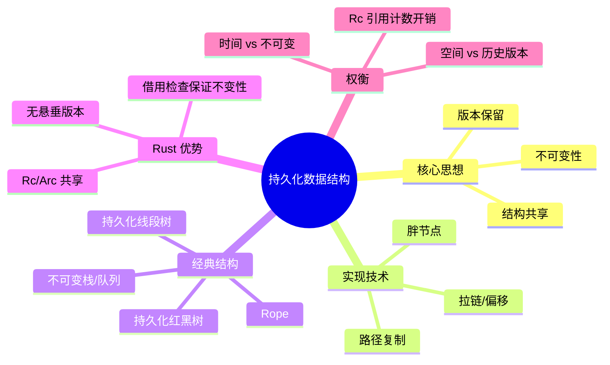
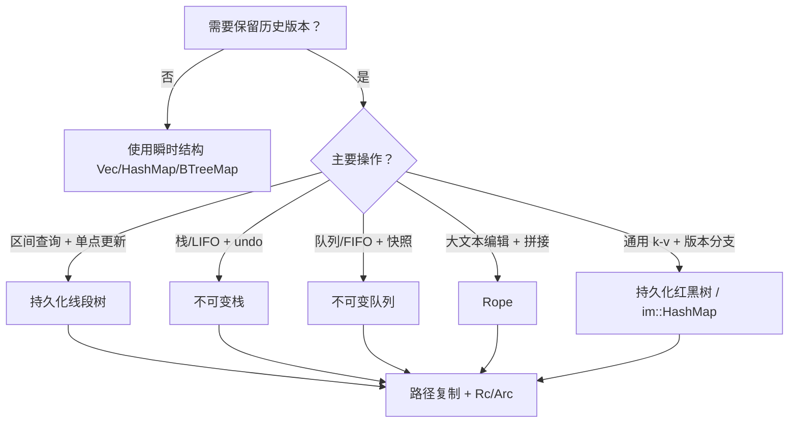

> **内容分级**: [进阶级]
> **本节关键术语**: 持久化数据结构 (Persistent Data Structure) · 纯函数式数据结构 (Purely Functional Data Structure) · 路径复制 (Path Copying) · 胖节点 (Fat Node) · 持久化线段树 (Persistent Segment Tree) · 不可变队列 (Immutable Queue) · Rope · 结构共享 (Structural Sharing) · 版本链 (Version Chain) — [完整对照表](../../00_meta/01_terminology/01_terminology_glossary.md)

# 持久化数据结构

**EN**: Persistent Data Structures
**Summary**: Immutable data structures that preserve previous versions after updates, including persistent segment trees, immutable queues, ropes, and path-copying/fat-node techniques in Rust.

> **Rust 版本**: 1.97.0+ (Edition 2024)
> **Bloom 层级**: L2-L3
> **权威来源**: 本文件为 `concept/` 权威页。
> **A/S/P 标记**: **S+A** — Structure + Application
> **定位**: 系统讲解“更新后保留历史版本”的数据结构思想，覆盖路径复制与胖节点两种实现技术，并结合 Rust 所有权模型给出可运行的线段树、不可变队列与 Rope 示例。
> **前置概念**: [所有权感知的数据结构](02_ownership_aware_data_structures.md) · [集合类型与哈希策略](../../01_foundation/05_collections/01_collections.md) · [智能指针](../../02_intermediate/02_memory_management/04_smart_pointers.md) · [Cow 与借用](../../02_intermediate/02_memory_management/03_cow_and_borrowed.md)
> **后置概念**: [概率与近似数据结构](15_probabilistic_data_structures.md) · [缓存友好与 SIMD 算法](04_cache_friendly_and_simd_algorithms.md) · [c08_algorithms crate docs](../../../crates/c08_algorithms/docs/README.md)
> **L5 对比**: [Rust vs Haskell](../../05_comparative/02_managed_languages/09_rust_vs_haskell.md)

---

> **来源 / Provenance**:
> **P0** [The Rust Programming Language](https://doc.rust-lang.org/book/title-page.html) ·
> **P0** [Rust Reference](https://doc.rust-lang.org/reference/introduction.html) ·
> **P1** [Okasaki — *Purely Functional Data Structures*](https://www.cs.cmu.edu/~rwh/students/okasaki.pdf) ·
> **P2** [docs.rs/im-rc](https://docs.rs/im-rc/latest/im_rc/) ·
> **P2** [docs.rs/rpds](https://docs.rs/rpds/latest/rpds/) ·
> **P2** [docs.rs/ropey](https://docs.rs/ropey/latest/ropey/)

---

## 🧠 知识结构图



> **认知功能**: 本 mindmap 从“思想 → 技术 → 结构 → Rust 优势 → 权衡”五个维度组织，帮助读者根据是否需要保留历史版本、是否并发、是否需要随机访问来选择实现策略。

---

## 一、权威定义

**持久化数据结构（Persistent Data Structure）** 指在执行更新操作后，仍然保留更新前全部历史版本的数据结构。任何“旧版本”都可以继续被读取，不会被后续修改破坏。与之相对的是**瞬时数据结构（Ephemeral Data Structure）**，更新会覆盖旧状态。

**完全持久化（Fully Persistent）**：所有历史版本都支持读取与再次更新，每次更新产生新版本，旧版本仍可继续分支。

**部分持久化（Partially Persistent）**：只支持读取历史版本，但更新只能基于最新版本进行。

**结构共享（Structural Sharing）**：新版本通过共享未改变节点来避免 `O(n)` 复制；这是持久化结构空间效率的关键。

> **来源**: Okasaki (1996); Rust `std::rc::Rc` / `std::sync::Arc`

---

## 二、两种实现技术

### 2.1 路径复制（Path Copying）

更新某个节点时，从根到该节点的路径上的所有节点都被复制，未触及的子树则通过引用计数或指针共享。

- **优点**：概念简单，旧版本天然完整保留；与不可变语言天然契合。
- **缺点**：每次更新额外空间 `O(h)`，`h` 为树高；频繁更新时引用计数或指针解引用带来开销。

### 2.2 胖节点（Fat Node）

每个节点维护一个“版本 - 字段”映射表，更新时向节点追加新字段值而不复制节点。读取时根据版本号选择对应字段。

- **优点**：复制开销低，节点复用率高；适合节点度大、更新稀疏的场景。
- **缺点**：读取需要版本二分或哈希查找，常数因子较大；实现复杂，需要全局版本计数器。

在 Rust 中，路径复制通常借助 `Rc`/`Arc` 实现共享，胖节点则可借助 `Vec<(Version, T)>` 或 `BTreeMap<Version, T>` 实现。

---

## 三、持久化线段树

线段树每个节点代表区间 `[l, r]` 的聚合信息。持久化版本中，单点更新只影响 `O(log n)` 个节点，因此新树与原树共享其余所有节点。

```rust
use std::rc::Rc;

#[derive(Debug)]
struct SegNode {
    sum: i64,
    left: Option<Rc<SegNode>>,
    right: Option<Rc<SegNode>>,
}

impl SegNode {
    fn new(sum: i64, left: Option<Rc<SegNode>>, right: Option<Rc<SegNode>>) -> Rc<Self> {
        Rc::new(Self { sum, left, right })
    }

    fn build(arr: &[i64], l: usize, r: usize) -> Option<Rc<SegNode>> {
        if l == r {
            return Some(SegNode::new(arr[l], None, None));
        }
        let m = (l + r) / 2;
        let left = Self::build(arr, l, m);
        let right = Self::build(arr, m + 1, r);
        let sum = left.as_ref().map_or(0, |n| n.sum) + right.as_ref().map_or(0, |n| n.sum);
        Some(SegNode::new(sum, left, right))
    }

    /// 在 idx 位置设置为 val，返回新版本根节点。
    fn update(&self, l: usize, r: usize, idx: usize, val: i64) -> Rc<Self> {
        if l == r {
            return SegNode::new(val, None, None);
        }
        let m = (l + r) / 2;
        if idx <= m {
            let new_left = self.left.as_ref().unwrap().update(l, m, idx, val);
            let sum = new_left.sum + self.right.as_ref().map_or(0, |n| n.sum);
            SegNode::new(sum, Some(new_left), self.right.clone())
        } else {
            let new_right = self.right.as_ref().unwrap().update(m + 1, r, idx, val);
            let sum = self.left.as_ref().map_or(0, |n| n.sum) + new_right.sum;
            SegNode::new(sum, self.left.clone(), Some(new_right))
        }
    }

    fn query(&self, l: usize, r: usize, ql: usize, qr: usize) -> i64 {
        if qr < l || ql > r {
            return 0;
        }
        if ql <= l && r <= qr {
            return self.sum;
        }
        let m = (l + r) / 2;
        self.left.as_ref().unwrap().query(l, m, ql, qr)
            + self.right.as_ref().unwrap().query(m + 1, r, ql, qr)
    }
}

fn main() {
    let arr = [1, 3, 5, 7, 9];
    let root_v0 = SegNode::build(&arr, 0, arr.len() - 1).unwrap();
    assert_eq!(root_v0.query(0, 4, 1, 3), 15); // 3 + 5 + 7

    // v1: 把索引 2 从 5 改成 10，v0 保持不变
    let root_v1 = root_v0.update(0, 4, 2, 10);
    assert_eq!(root_v0.query(0, 4, 1, 3), 15); // 旧版本不变
    assert_eq!(root_v1.query(0, 4, 1, 3), 20); // 3 + 10 + 7
}
```

**复杂度**：

- 空间：`O(n + q · log n)`，`q` 为更新次数，未修改节点共享。
- 查询：`O(log n)`。
- 更新：`O(log n)` 时间 + `O(log n)` 新增节点。

> **来源**: Okasaki §2.2; CLRS 线段树章节

---

## 四、不可变栈与队列

### 4.1 不可变栈

通过 `Rc` 共享尾部，实现 `O(1)` 的 push/pop/peek，且旧版本完整保留。

```rust
use std::rc::Rc;

#[derive(Debug, Clone)]
enum List<T> {
    Nil,
    Cons(T, Rc<List<T>>),
}

impl<T: Clone> List<T> {
    fn new() -> Self {
        List::Nil
    }

    fn push(&self, value: T) -> Self {
        List::Cons(value, Rc::new(self.clone()))
    }

    fn pop(&self) -> Option<(&T, &List<T>)> {
        match self {
            List::Nil => None,
            List::Cons(head, tail) => Some((head, tail)),
        }
    }
}

fn main() {
    let s0 = List::new();
    let s1 = s0.push(1);
    let s2 = s1.push(2);

    assert_eq!(s2.pop().map(|(x, _)| *x), Some(2));
    assert_eq!(s1.pop().map(|(x, _)| *x), Some(1)); // s1 仍可用
    assert!(s0.pop().is_none());                     // s0 仍为空
}
```

### 4.2 双栈不可变队列（Banker's Queue）

用两个栈分别作为输入端（`back`）和输出端（`front`）。当输出端为空时，一次性把输入端反转到输出端。均摊 `O(1)` 入队/出队。

```rust
use std::rc::Rc;

#[derive(Debug, Clone)]
enum Stack<T> {
    Nil,
    Cons(T, Rc<Stack<T>>),
}

#[derive(Debug, Clone)]
struct Queue<T> {
    front: Stack<T>,
    back: Stack<T>,
}

impl<T: Clone> Queue<T> {
    fn new() -> Self {
        Self { front: Stack::Nil, back: Stack::Nil }
    }

    fn enqueue(&self, value: T) -> Self {
        Self {
            front: self.front.clone(),
            back: Stack::Cons(value, Rc::new(self.back.clone())),
        }
    }

    fn dequeue(&self) -> Option<(T, Self)> {
        match &self.front {
            Stack::Nil => {
                // 反转 back 到 front
                let mut rev = Stack::Nil;
                let mut cur = &self.back;
                while let Stack::Cons(x, tail) = cur {
                    rev = Stack::Cons(x.clone(), Rc::new(rev));
                    cur = tail;
                }
                let q = Self { front: rev, back: Stack::Nil };
                q.pop_front()
            }
            _ => self.pop_front(),
        }
    }

    fn pop_front(&self) -> Option<(T, Self)> {
        match &self.front {
            Stack::Nil => None,
            Stack::Cons(x, tail) => Some((x.clone(), Self {
                front: (**tail).clone(),
                back: self.back.clone(),
            })),
        }
    }
}

fn main() {
    let q0 = Queue::new();
    let q1 = q0.enqueue(1);
    let q2 = q1.enqueue(2);
    let (x, q3) = q2.dequeue().unwrap();
    assert_eq!(x, 1);
    let (y, _) = q3.dequeue().unwrap();
    assert_eq!(y, 2);
    assert!(q2.dequeue().is_some()); // q2 历史版本仍有效
}
```

> **来源**: Okasaki §3.1.2; Hood & Melville (1981)

---

## 五、Rope 基础

**Rope** 是一种平衡二叉树，叶节点存储短字符串片段，内部节点记录子树总长度。它适合表示频繁插入/删除/拼接的大文本，并且天然支持持久化：修改时只复制从根到受影响叶子的路径。

```rust,ignore
// 简化示意：生产环境请使用 ropey crate
use std::rc::Rc;

enum Rope {
    Leaf(String),
    Node {
        len: usize,
        left: Rc<Rope>,
        right: Rc<Rope>,
    },
}

impl Rope {
    fn len(&self) -> usize {
        match self {
            Rope::Leaf(s) => s.len(),
            Rope::Node { len, .. } => *len,
        }
    }

    fn concat(left: Rc<Rope>, right: Rc<Rope>) -> Rc<Rope> {
        Rc::new(Rope::Node {
            len: left.len() + right.len(),
            left,
            right,
        })
    }
}
```

**Rope vs `String`**：

| 操作 | `String` | Rope |
|:---|:---|:---|
| 中间插入 | `O(n)` 移动 | `O(log n)` 路径复制 |
| 持久化 | 必须克隆全量 | 结构共享 |
| 随机访问 | `O(1)` | `O(log n)` |
| 内存局部性 | 连续，缓存友好 | 离散，牺牲局部性 |

---

## 六、复杂度与权衡

| 结构 | 更新 | 查询 | 额外空间/次 | 持久化方式 | 适用场景 |
|:---|:---:|:---:|:---:|:---|:---|
| 持久化线段树 | `O(log n)` | `O(log n)` | `O(log n)` 节点 | 路径复制 | 区间历史版本、可撤销修改 |
| 不可变栈 | `O(1)` | `O(1)` | `O(1)` 节点 | 路径复制 | undo、函数式列表 |
| 不可变队列 | 均摊 `O(1)` | 均摊 `O(1)` | 均摊 `O(1)` | 路径复制 | 函数式 BFS、消息队列快照 |
| Rope | `O(log n)` | `O(log n)` | `O(log n)` 节点 | 路径复制 | 大文本编辑器、协作编辑 CRDT |
| 胖节点数组 | `O(1)` 追加 | `O(log v)` 按版本查 | `O(1)` | 胖节点 | 稀疏历史字段、版本控制 |

**核心权衡**：持久化用空间换历史可回溯能力。当业务不需要旧版本时，使用瞬时结构更高效；当需要 undo、时间旅行查询、并发快照时，持久化结构能显著降低心智负担。

---

## 七、Rust 所有权模型的优势

1. **不可变性由借用检查器保证**：持久化结构要求节点不可变，Rust 的 `&T` 与 `Rc<T>` 天然阻止意外修改共享子树。
2. **无悬垂版本**：`Rc`/`Arc` 的生命周期管理确保旧版本在仍被引用时不会被释放，也不会出现 use-after-free。
3. **零成本抽象可选**：若无需多线程，使用 `Rc` 即可；需要并发时替换为 `Arc` 并配合原子操作。
4. **与 `Cow` 配合**：对于“大部分只读、偶尔写”的结构，可先用 `Cow<[T]>` 做 Copy-on-Write，再升级为持久化树。

---

## 八、反例与反模式

### 反例 1：用 `RefCell` 修改被共享的持久化节点

```rust,ignore
// ❌ 错误：对 Rc<RefCell<Node>> 调用 borrow_mut 会同时修改所有引用该节点的版本
let v0 = Rc::new(RefCell::new(Node::default()));
let v1 = Rc::clone(&v0);
v1.borrow_mut().value = 42; // v0 也被悄悄改了
```

**修正**：持久化结构的节点应使用纯不可变类型；需要“修改”时返回新节点，旧节点保持不动。

### 反例 2：每次更新都深拷贝整棵树

```rust,ignore
// ❌ 错误：没有结构共享，空间退化为 O(n·q)
fn update(&self, idx: usize, val: i64) -> VecTree {
    let mut cloned = self.clone_all_nodes(); // 复制全部节点
    cloned.set(idx, val);
    cloned
}
```

**修正**：只复制从根到更新点的路径，其余子树通过 `Rc::clone` 共享。

### 反例 3：把持久化结构当可变缓存用

```rust,ignore
// ❌ 错误：每次更新都生成新版本，却从不读取旧版本，徒增 Rc 开销
let mut current = persistent_map;
for k in keys {
    current = current.insert(k, compute(k));
}
```

**修正**：如果只需要最新状态，使用 `std::collections::BTreeMap` 或 `HashMap`；只有需要历史版本或 undo 时才选择持久化结构。

### 反例 4：在热路径使用 `Arc` 做单线程持久化

```rust,ignore
// ❌ 错误：单线程场景使用 Arc 带来不必要的原子操作开销
use std::sync::Arc;
let root: Arc<Node> = Arc::new(node);
```

**修正**：单线程用 `Rc`，多线程才用 `Arc`；可通过类型参数或 feature 切换。

---

## 九、决策树：何时使用持久化数据结构



---

## 十、权威来源索引

- **P0 官方**: [The Rust Programming Language](https://doc.rust-lang.org/book/title-page.html)
- **P0 官方**: [Rust Reference](https://doc.rust-lang.org/reference/introduction.html)
- **P1 学术**: [Okasaki (1996) — *Purely Functional Data Structures*](https://www.cs.cmu.edu/~rwh/students/okasaki.pdf)
- **P1 学术**: [Driscoll, Sarnak, Sleator & Tarjan (1986) — Making Data Structures Persistent](https://doi.org/10.1145/5925.5934)
- **P2 生态**: [docs.rs/im-rc](https://docs.rs/im-rc/latest/im_rc/)
- **P2 生态**: [docs.rs/rpds](https://docs.rs/rpds/latest/rpds/)
- **P2 生态**: [docs.rs/ropey](https://docs.rs/ropey/latest/ropey/)

> **文档版本**: 1.0 ｜ **最后更新**: 2026-08-03 ｜ **状态**: ✅ 新建权威页

---

## 国际化权威来源对齐说明

| 主题 | 本页做法 | 权威来源依据 |
|:---|:---|:---|
| 路径复制 | 从根到更新点复制节点，其余共享 | Okasaki §2.2; Driscoll et al. (1986) |
| 胖节点 | 节点内按版本维护多值映射 | Driscoll et al. (1986) |
| 持久化线段树 | Rc 共享未变更子树，单点更新 O(log n) | 竞赛编程惯例；Okasaki 函数式线段树 |
| 不可变队列 | 双栈 lazy 反转（Banker's Queue） | Okasaki §3.1.2 |
| Rope | 平衡二叉字符串片段树 | Boehm et al. (1995); ropey crate 文档 |

---

## 国际权威来源（P1 补充）

- [Driscoll, Sarnak, Sleator & Tarjan — Making Data Structures Persistent](https://dl.acm.org/doi/10.1145/5925.5934)
