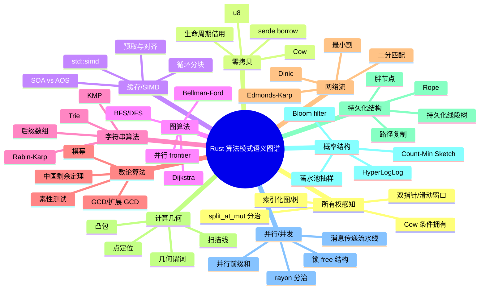
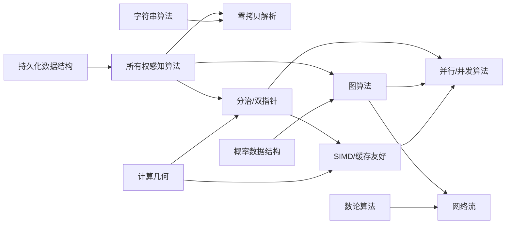

> **内容分级**: [专家级]
> **本节关键术语**: 算法模式 (Algorithm Pattern) · 所有权感知 (Ownership-Aware) · 零拷贝 (Zero-Copy) · SIMD · 缓存友好 (Cache-Friendly) · 持久化数据结构 (Persistent Data Structure) · 概率数据结构 (Probabilistic Data Structure) · 并行算法 (Parallel Algorithm) · 语义图谱 (Semantic Atlas) — [完整对照表](../../00_meta/01_terminology/01_terminology_glossary.md)

# Rust 算法模式语义图谱

**EN**: Rust Algorithm Patterns Semantic Atlas
**Summary**: A systematic semantic map of idiomatic Rust algorithm patterns spanning ownership-aware, zero-copy, cache/SIMD, graph, string, number-theoretic, network-flow, computational-geometry, persistent, probabilistic, and parallel/concurrent patterns, with problem definitions, implementation points, code examples, complexity, counterexamples, and cross-pattern relations.

> **Rust 版本**: 1.97.0+ (Edition 2024)
> **Bloom 层级**: L5-L6
> **权威来源**: 本文件为 `concept/` 权威页。
> **A/S/P 标记**: **S+P** — Structure + Procedure
> **定位**: 将 Rust 算法实现的全部语义空间组织为可检索、可比较、可演进的图谱，连接语言特性、经典算法思想与工程实践，作为 `concept/06_ecosystem/16_algorithm_patterns/` 子页的聚合入口。
> **前置概念**: [Ownership](../../01_foundation/01_ownership_borrow_lifetime/01_ownership.md) · [Borrowing](../../01_foundation/01_ownership_borrow_lifetime/02_borrowing.md) · [Iterator](../../02_intermediate/07_iterators_and_closures/01_iterator_patterns.md) · [Send/Sync](../../03_advanced/00_concurrency/02_send_sync_auto_traits.md) · [Unsafe](../../03_advanced/02_unsafe/01_unsafe.md)
> **后置概念**: [算法与复杂度惯用法](../10_performance/03_algorithms_and_complexity_idioms.md) · [c08_algorithms crate docs](../../../crates/c08_algorithms/docs/README.md)
> **L5 对比**: [Rust vs C++](../../05_comparative/01_systems_languages/01_rust_vs_cpp.md)

---

> **来源 / Provenance**:
> **P0 官方**: [The Rust Programming Language](https://doc.rust-lang.org/book/title-page.html) · [The Rust Reference](https://doc.rust-lang.org/reference/introduction.html) · [std docs](https://doc.rust-lang.org/std/index.html)
> **P1 学术**: [Cormen, Leiserson, Rivest & Stein — *Introduction to Algorithms*, 4th ed.](https://mitpress.mit.edu/9780262046305/introduction-to-algorithms/) · [Sedgewick & Wayne — *Algorithms*, 4th ed.](https://algs4.cs.princeton.edu/home/) · [Okasaki — *Purely Functional Data Structures*](https://www.cs.cmu.edu/~rwh/students/okasaki.pdf) · [Hennessy & Patterson — *Computer Architecture: A Quantitative Approach*](https://www.elsevier.com/books/computer-architecture/hennessy/978-0-12-811905-1)
> **P1 社区**: [Rust Design Patterns](https://rust-unofficial.github.io/patterns/) · [The Rust Performance Book](https://nnethercote.github.io/perf-book/)
> **P2 生态**: [Rayon docs](https://docs.rs/rayon/latest/rayon/) · [Crossbeam docs](https://docs.rs/crossbeam/latest/crossbeam/) · [petgraph docs](https://docs.rs/petgraph/latest/petgraph/) · [serde docs](https://docs.rs/serde/latest/serde/)

---

## 📑 目录

- [Rust 算法模式语义图谱](#rust-算法模式语义图谱)
  - [📑 目录](#-目录)
  - [一、权威定义](#一权威定义)
  - [二、思维导图：算法模式语义空间](#二思维导图算法模式语义空间)
  - [三、概念-属性-关系-示例-反例 多维矩阵](#三概念-属性-关系-示例-反例-多维矩阵)
  - [四、决策树：如何为问题选择 Rust 算法模式](#四决策树如何为问题选择-rust-算法模式)
  - [五、模式详解](#五模式详解)
    - [5.1 所有权感知算法](#51-所有权感知算法)
    - [5.2 零拷贝解析与序列化](#52-零拷贝解析与序列化)
    - [5.3 SIMD / 缓存友好算法](#53-simd--缓存友好算法)
    - [5.4 图算法](#54-图算法)
    - [5.5 字符串算法](#55-字符串算法)
    - [5.6 数论算法](#56-数论算法)
    - [5.7 网络流与匹配](#57-网络流与匹配)
    - [5.8 计算几何](#58-计算几何)
    - [5.9 持久化数据结构](#59-持久化数据结构)
    - [5.10 概率 / 近似数据结构](#510-概率--近似数据结构)
    - [5.11 并行 / 并发算法模式](#511-并行--并发算法模式)
  - [六、跨模式关系图谱](#六跨模式关系图谱)
  - [七、反例与反模式](#七反例与反模式)
    - [反例 1：递归返回借用引用](#反例-1递归返回借用引用)
    - [反例 2：迭代时修改集合](#反例-2迭代时修改集合)
    - [反例 3：越界双指针](#反例-3越界双指针)
    - [反例 4：把 `visited` 放进图结构内部](#反例-4把-visited-放进图结构内部)
    - [反例 5：在期望确定性结果处使用 Bloom filter](#反例-5在期望确定性结果处使用-bloom-filter)
    - [反例 6：闭包捕获 `Rc` 后跨线程](#反例-6闭包捕获-rc-后跨线程)
  - [八、相关概念与延伸阅读](#八相关概念与延伸阅读)
  - [九、权威来源索引](#九权威来源索引)
  - [国际化权威来源补充（International Authority Sources）](#国际化权威来源补充international-authority-sources)

---

## 一、权威定义

**Rust 算法模式语义图谱**是对 Rust 中实现经典算法时反复出现的「语义模式」进行系统梳理的元层文档。
它不只是算法目录，而是把算法思想、Rust 语言特性、复杂度约束与工程决策放在同一坐标系下，形成可检索、可比较、可演进的语义空间。

本图谱的核心组织维度：

| 维度 | 含义 | 示例 |
|:---|:---|:---|
| **问题结构** | 输入数据的组织方式 | 线性序列、图、树、流、几何点集 |
| **所有权语义** | 数据如何被借出、修改、转移 | `&[T]`、`&mut [T]`、`Cow<'a, str>`、`Rc/Arc` |
| **时间/空间约束** | 复杂度与缓存、内存行为 | O(n)、O(log n)、SIMD、零拷贝 |
| **正确性机制** | 编译期保证 vs 运行时检查 | 借用检查、`unsafe` 契约、概率误差界 |
| **并发形态** | 串行、并行、并发、异步 | `rayon`、`crossbeam`、`async`/`.await` |

> **来源**: [CLRS 2022](https://mitpress.mit.edu/9780262046305/introduction-to-algorithms/) · [Rust Design Patterns](https://rust-unofficial.github.io/patterns/)

---

## 二、思维导图：算法模式语义空间



> **认知功能**: 本 mindmap 以「语义维度 → 模式族 → 具体技术」三层组织，帮助读者根据问题结构、所有权约束与性能目标快速定位实现模式。

---

## 三、概念-属性-关系-示例-反例 多维矩阵

| 概念 | 核心属性 | 与 Rust 语义的关系 | 最小可运行示例 | 典型反例 |
|:---|:---|:---|:---|:---|
| **所有权感知算法** | 输入/输出的所有权显式化 | `&mut [T]` 原地修改、`Cow` 延迟拥有、借用检查器消除 UAF | `merge_sort` 用 `split_at_mut` | 递归中返回借用引用给局部变量 |
| **零拷贝解析** | 解析结果引用输入缓冲区 | 生命周期 `'a` 保证输出不脱离输入；`Cow` 处理需拥有的情况 | `parse_word<'a>` | 把 `&str` 拆成 `String` 再返回 |
| **SIMD / 缓存友好** | 数据布局与访问模式匹配硬件 | `std::simd` / `core::arch`；SOA 提升空间局部性 | 向量化点积 | AOS 随机访问导致 cache miss |
| **图算法** | 用整数 ID 代替指针 | `Vec<Vec<usize>>` 邻接表；`&self` 遍历 + `&mut visited` 状态 | BFS/Dijkstra | 把 `visited` 放进 `Graph` 内部导致可变借用冲突 |
| **字符串算法** | UTF-8 边界安全 | 按字节索引需验证 char boundary；优先用 `char_indices` | KMP `lps` 数组 | 直接按 `u8` 切片破坏多字节字符 |
| **数论算法** | 整数溢出控制 | 模运算用 `checked_mul` / `wrapping_mul`；大数用 `num-bigint` | 模幂 / GCD | 裸 `a * b % m` 在 64 位溢出 |
| **网络流** | 残量图与分层图 | `Vec<Vec<Edge>>` 索引化；反向边用 `usize` 索引 | Edmonds-Karp | 忘记维护反向边容量 |
| **计算几何** | 方向/凸包谓词稳定 | 用 `i64` / 有理数避免浮点误差；叉积判断方向 | Graham scan 凸包 | 浮点比较导致共线点判定错误 |
| **持久化数据结构** | 不可变 + 结构共享 | `Rc/Arc` 共享未改变子树；借用检查保证版本安全 | 持久化栈 | 用 `&mut` 原地修改后旧版本悬垂 |
| **概率数据结构** | 有界误差换空间 | 参数 `(ε, δ)` 可配置；哈希质量决定精度 | Bloom filter 骨架 | 期望确定性结果时使用 Bloom filter |
| **并行/并发算法** | 数据竞争静态排除 | `Send`/`Sync` 约束；`rayon` 工作窃取 | `par_iter` / `join` | 在闭包中捕获 `Rc` 导致编译失败 |

> **来源**: [CLRS 2022](https://mitpress.mit.edu/9780262046305/introduction-to-algorithms/) · [Okasaki 1996](https://www.cs.cmu.edu/~rwh/students/okasaki.pdf) · [Rust Reference 生命周期](https://doc.rust-lang.org/reference/lifetime-elision.html)

---

## 四、决策树：如何为问题选择 Rust 算法模式

```mermaid
graph TD
    A[需要实现算法?] --> B{输入是什么结构?}
    B -->|线性序列| C{是否允许修改输入?}
    C -->|是| D[接受 &mut [T] / Vec<T>，原地分治/双指针/滑动窗口]
    C -->|否| E[返回 &[T] / Cow / Vec<T>]
    E --> F{需要解析文本/二进制?}
    F -->|是| G[零拷贝借用 + 生命周期 'a]
    F -->|否| H[迭代器适配器 / 前缀和 / 堆]
    B -->|图| I[索引化邻接表 + &self 遍历 + &mut 状态]
    I --> J{需要最短路?}
    J -->|是| K[Dijkstra / Bellman-Ford]
    J -->|否| L[BFS / DFS / 拓扑排序]
    B -->|字符串| M[char_indices / as_bytes + 边界检查]
    M --> N{需要精确匹配?}
    N -->|是| O[KMP / Z-Algorithm / 后缀数组]
    N -->|否| P[Rolling hash / Trie]
    B -->|几何点集| Q[叉积方向判断 + 排序/扫描线]
    Q --> R{需要凸包?}
    R -->|是| S[Graham scan / Monotone chain]
    R -->|否| T[扫描线 / 点定位]
    D --> U{数据量 > 10k 且 CPU 密集?}
    U -->|是| V[rayon::join / par_iter]
    U -->|否| W[单线程迭代器]
    H --> X{需要亚线性空间?}
    X -->|是| Y[概率数据结构 / 流式算法]
    X -->|否| Z[确定性 Map / Set / Segment Tree]
    D --> AA{需要保留历史版本?}
    AA -->|是| AB[持久化数据结构: Rc/Arc + 路径复制]
    AA -->|否| AC[瞬时结构]
```

---

## 五、模式详解

### 5.1 所有权感知算法

**问题定义**: 在实现算法时，根据调用方是否保留输入所有权、是否允许原地修改、是否需要返回新值，选择最合适的所有权接口。

**Rust 实现要点**:

- 原地修改：`fn algorithm(&mut self, ...)` 或 `fn algorithm(arr: &mut [T])`。
- 不修改输入：`fn algorithm(input: &[T]) -> Vec<T>`。
- 条件拥有：`Cow<'a, str>` / `Cow<'a, [T]>` 在「通常借用、偶尔拥有」场景避免分配。
- 分治安全：`split_at_mut` 在编译期保证两个子切片不重叠。

```rust
fn merge_sort<T: Ord + Copy>(arr: &mut [T]) {
    if arr.len() <= 1 {
        return;
    }
    let mid = arr.len() / 2;
    let (left, right) = arr.split_at_mut(mid);
    merge_sort(left);
    merge_sort(right);

    let mut merged: Vec<T> = Vec::with_capacity(left.len() + right.len());
    let (mut i, mut j) = (0, 0);
    while i < left.len() && j < right.len() {
        if left[i] <= right[j] {
            merged.push(left[i]);
            i += 1;
        } else {
            merged.push(right[j]);
            j += 1;
        }
    }
    merged.extend_from_slice(&left[i..]);
    merged.extend_from_slice(&right[j..]);
    left.copy_from_slice(&merged[..left.len()]);
    right.copy_from_slice(&merged[left.len()..]);
}

use std::borrow::Cow;

fn upper_if_needed<'a>(input: &'a str) -> Cow<'a, str> {
    if input.chars().any(|c| c.is_lowercase()) {
        Cow::Owned(input.to_uppercase())
    } else {
        Cow::Borrowed(input)
    }
}

fn main() {
    let mut v = vec![3, 1, 4, 1, 5, 9, 2, 6];
    merge_sort(&mut v);
    println!("sorted: {:?}", v);
    println!("cow: {}", upper_if_needed("HELLO"));
    println!("cow: {}", upper_if_needed("hello"));
}
```

**复杂度**: 归并排序时间 O(n log n)，额外空间 O(n)；`Cow` 最优 O(1) 额外分配。

**与其他模式的关系**: 所有权感知是零拷贝解析、图算法、分治并行的基础。

> 详见: [所有权感知算法](../11_domain_applications/27_ownership_aware_algorithms.md) · [所有权感知的数据结构](02_ownership_aware_data_structures.md)

---

### 5.2 零拷贝解析与序列化

**问题定义**: 在解析文本或二进制数据时，让输出直接引用输入缓冲区，避免中间分配。

**Rust 实现要点**:

- 返回 `&'a str` / `&'a [u8]` 时，生命周期 `'a` 必须覆盖输入。
- 使用 `char_indices()` 处理 UTF-8 边界安全。
- 当输出可能引用也可能拥有时，使用 `Cow<'a, str>`。
- 序列化时 `serde` 的 `borrow` 属性可启用零拷贝反序列化。

```rust
fn parse_word<'a>(input: &'a str) -> Option<(&'a str, &'a str)> {
    let first = input.chars().next()?;
    if !first.is_ascii_alphabetic() {
        return None;
    }
    let end = input
        .char_indices()
        .find(|(_, c)| !c.is_ascii_alphabetic())
        .map(|(i, _)| i)
        .unwrap_or(input.len());
    Some((&input[..end], &input[end..]))
}

fn main() {
    let text = "hello world";
    if let Some((word, rest)) = parse_word(text) {
        println!("word={}, rest={}", word, rest);
    }
}
```

**复杂度**: 时间 O(k)，k 为当前 token 长度；额外空间 O(1)。

**与其他模式的关系**: 零拷贝是所有权感知算法的直接应用；与字符串算法结合时需注意 UTF-8 边界。

> 详见: [零拷贝解析](../11_domain_applications/26_zero_copy_parsing_in_rust.md)

---

### 5.3 SIMD / 缓存友好算法

**问题定义**: 通过数据布局优化与向量化，提高算法在实际硬件上的吞吐。

**Rust 实现要点**:

- 优先顺序访问；多维数组按行优先遍历。
- 热点字段用 SOA（Struct of Arrays）而非 AOS（Array of Structs）。
- `std::simd`（nightly feature `portable_simd`）提供跨平台安全 SIMD；稳定通道使用 `core::arch` 平台 intrinsics 需 `unsafe`。
- 分块（tiling）让工作集适配 L1/L2 cache。

```rust,ignore
// 需要 nightly feature portable_simd 或外部 crate wide/portable-simd
// dep: portable-simd (nightly)
use std::simd::{f32x4, SimdFloat};

fn dot_product_simd(a: &[f32], b: &[f32]) -> f32 {
    assert_eq!(a.len(), b.len());
    let mut sum = f32x4::splat(0.0);
    let chunks = a.len() / 4;
    for i in 0..chunks {
        let va = f32x4::from_slice(&a[i * 4..]);
        let vb = f32x4::from_slice(&b[i * 4..]);
        sum += va * vb;
    }
    let mut total = sum.reduce_sum();
    for i in (chunks * 4)..a.len() {
        total += a[i] * b[i];
    }
    total
}
```

**复杂度**: 理论时间复杂度不变；常数因子降低 2–16×，取决于向量宽度与内存带宽。

**与其他模式的关系**: SIMD 常与并行算法、缓存友好布局组合；与所有权感知结合时需注意对齐加载的生命周期。

> 详见: [缓存友好与 SIMD 算法](04_cache_friendly_and_simd_algorithms.md)

---

### 5.4 图算法

**问题定义**: 在节点与边构成的关系网络上执行遍历、最短路径、拓扑排序、强连通分量等计算。

**Rust 实现要点**:

- 使用**索引化图**：`Vec<Vec<usize>>` 或 `Vec<Vec<(usize, W)>>`，避免指针与借用冲突。
- 遍历图时保持 `&self`（图结构）与 `&mut visited`（状态）分离。
- Dijkstra 用 `BinaryHeap<Reverse<(W, usize)>>`。
- 并行 frontier 可用 `rayon` 扩展当前层节点。

```rust
use std::collections::{BinaryHeap, VecDeque};
use std::cmp::Reverse;

#[derive(Default)]
struct Graph {
    adj: Vec<Vec<usize>>,
}

impl Graph {
    fn with_nodes(n: usize) -> Self {
        Self { adj: vec![Vec::new(); n] }
    }

    fn add_edge(&mut self, u: usize, v: usize) {
        self.adj[u].push(v);
    }

    fn bfs(&self, start: usize) -> Vec<usize> {
        let mut visited = vec![false; self.adj.len()];
        let mut order = Vec::new();
        let mut queue = VecDeque::new();
        queue.push_back(start);
        visited[start] = true;

        while let Some(u) = queue.pop_front() {
            order.push(u);
            for &v in &self.adj[u] {
                if !visited[v] {
                    visited[v] = true;
                    queue.push_back(v);
                }
            }
        }
        order
    }

    fn dijkstra(&self, start: usize) -> Vec<usize> {
        let n = self.adj.len();
        let mut dist = vec![usize::MAX; n];
        let mut heap = BinaryHeap::new();
        dist[start] = 0;
        heap.push(Reverse((0, start)));

        while let Some(Reverse((d, u))) = heap.pop() {
            if d > dist[u] {
                continue;
            }
            for &v in &self.adj[u] {
                // 本示例为无权图；加权图使用 adj[(v, w)]
                let nd = d.saturating_add(1);
                if nd < dist[v] {
                    dist[v] = nd;
                    heap.push(Reverse((nd, v)));
                }
            }
        }
        dist
    }
}

fn main() {
    let mut g = Graph::with_nodes(4);
    g.add_edge(0, 1);
    g.add_edge(0, 2);
    g.add_edge(1, 3);
    g.add_edge(2, 3);
    println!("bfs: {:?}", g.bfs(0));
    println!("dist: {:?}", g.dijkstra(0));
}
```

**复杂度**: BFS/DFS 时间 O(V + E)，空间 O(V)；Dijkstra 用二叉堆为 O((V + E) log V)。

**与其他模式的关系**: 图遍历常与动态规划（DAG 上的 DP）、并行算法（并行 frontier）、缓存友好布局（CSR 压缩稀疏行）结合。

> 详见: [图算法 Rust 实现](03_graph_algorithms_in_rust.md)

---

### 5.5 字符串算法

**问题定义**: 在 UTF-8 字节序列上执行模式匹配、索引、搜索、压缩等操作。

**Rust 实现要点**:

- 优先按 `char` 或 `char_indices()` 处理，避免破坏多字节字符。
- KMP/Z-Algorithm 的 `lps` / `z` 数组用 `Vec<usize>`。
- 需要字节级操作时，明确文档化输入为 ASCII / 已知编码。
- `&str` 天然支持零拷贝子串。

```rust
fn build_lps(pattern: &str) -> Vec<usize> {
    let chars: Vec<char> = pattern.chars().collect();
    let mut lps = vec![0; chars.len()];
    let mut len = 0;
    let mut i = 1;
    while i < chars.len() {
        if chars[i] == chars[len] {
            len += 1;
            lps[i] = len;
            i += 1;
        } else if len > 0 {
            len = lps[len - 1];
        } else {
            lps[i] = 0;
            i += 1;
        }
    }
    lps
}

fn kmp_search(text: &str, pattern: &str) -> Vec<usize> {
    if pattern.is_empty() {
        return vec![];
    }
    let t: Vec<char> = text.chars().collect();
    let p: Vec<char> = pattern.chars().collect();
    let lps = build_lps(pattern);
    let mut matches = Vec::new();
    let (mut i, mut j) = (0, 0);
    while i < t.len() {
        if t[i] == p[j] {
            i += 1;
            j += 1;
            if j == p.len() {
                matches.push(i - j);
                j = lps[j - 1];
            }
        } else if j > 0 {
            j = lps[j - 1];
        } else {
            i += 1;
        }
    }
    matches
}

fn main() {
    let text = "abcabcabc";
    let pattern = "abc";
    println!("matches at: {:?}", kmp_search(text, pattern));
}
```

**复杂度**: KMP 预处理 O(m)，搜索 O(n)，额外空间 O(m)。

**与其他模式的关系**: 字符串算法常与零拷贝解析、后缀数据结构、压缩算法结合。

> 详见: [字符串算法 Rust 实现](07_string_algorithms_in_rust.md) · [高级字符串算法](13_advanced_string_algorithms.md)

---

### 5.6 数论算法

**问题定义**: 处理整数分解、模运算、素性、同余方程等离散数学问题。

**Rust 实现要点**:

- 防止溢出：模乘使用 `checked_mul` / `wrapping_mul` 或 `u128` 中间结果。
- 大整数使用 `num-bigint` crate。
- 类型约束通常要求 `T: PrimInt` 或固定宽度整数。

```rust
fn gcd(a: u64, b: u64) -> u64 {
    if b == 0 { a } else { gcd(b, a % b) }
}

fn mod_pow(mut base: u64, mut exp: u64, modulus: u64) -> u64 {
    if modulus == 1 {
        return 0;
    }
    let mut result = 1u64;
    base %= modulus;
    while exp > 0 {
        if exp % 2 == 1 {
            result = (result as u128 * base as u128 % modulus as u128) as u64;
        }
        exp >>= 1;
        base = (base as u128 * base as u128 % modulus as u128) as u64;
    }
    result
}

fn main() {
    println!("gcd(48, 18) = {}", gcd(48, 18));
    println!("2^10 mod 1000 = {}", mod_pow(2, 10, 1000));
}
```

**复杂度**: GCD 欧几里得算法 O(log min(a, b))；模幂 O(log exp)。

**与其他模式的关系**: 数论算法是网络流、密码学、组合计数的基础；常与概率算法（Miller-Rabin）结合。

> 详见: [数论算法](12_number_theoretic_algorithms.md)

---

### 5.7 网络流与匹配

**问题定义**: 在容量网络中求最大流、最小割，或在二分图中求最大匹配。

**Rust 实现要点**:

- 用索引化边表；每条边保存 `to`、`capacity`、`reverse` 索引。
- BFS 建分层图（Dinic）或 BFS 找增广路（Edmonds-Karp）。
- 反向边容量同步更新。

```rust
use std::collections::VecDeque;

struct Edge {
    to: usize,
    capacity: i64,
    reverse: usize,
}

struct FlowNetwork {
    graph: Vec<Vec<Edge>>,
}

impl FlowNetwork {
    fn new(n: usize) -> Self {
        Self { graph: (0..n).map(|_| Vec::new()).collect() }
    }

    fn add_edge(&mut self, from: usize, to: usize, capacity: i64) {
        let from_rev = self.graph[to].len();
        let to_rev = self.graph[from].len();
        self.graph[from].push(Edge { to, capacity, reverse: from_rev });
        self.graph[to].push(Edge { to: from, capacity: 0, reverse: to_rev });
    }

    fn bfs_level(&self, source: usize, sink: usize, level: &mut [i32]) -> bool {
        level.fill(-1);
        let mut queue = VecDeque::new();
        level[source] = 0;
        queue.push_back(source);
        while let Some(u) = queue.pop_front() {
            for edge in &self.graph[u] {
                if edge.capacity > 0 && level[edge.to] < 0 {
                    level[edge.to] = level[u] + 1;
                    queue.push_back(edge.to);
                }
            }
        }
        level[sink] >= 0
    }

    fn dfs_flow(&mut self, u: usize, sink: usize, flow: i64, level: &[i32], iter: &mut [usize]) -> i64 {
        if u == sink {
            return flow;
        }
        while iter[u] < self.graph[u].len() {
            let i = iter[u];
            let edge_to = self.graph[u][i].to;
            let cap = self.graph[u][i].capacity;
            let rev = self.graph[u][i].reverse;
            if cap > 0 && level[u] < level[edge_to] {
                let d = self.dfs_flow(edge_to, sink, flow.min(cap), level, iter);
                if d > 0 {
                    self.graph[u][i].capacity -= d;
                    self.graph[edge_to][rev].capacity += d;
                    return d;
                }
            }
            iter[u] += 1;
        }
        0
    }

    fn max_flow(&mut self, source: usize, sink: usize) -> i64 {
        let n = self.graph.len();
        let mut level = vec![-1i32; n];
        let mut iter = vec![0usize; n];
        let mut flow = 0i64;
        while self.bfs_level(source, sink, &mut level) {
            iter.fill(0);
            loop {
                let f = self.dfs_flow(source, sink, i64::MAX, &level, &mut iter);
                if f == 0 {
                    break;
                }
                flow += f;
            }
        }
        flow
    }
}

fn main() {
    let mut net = FlowNetwork::new(4);
    net.add_edge(0, 1, 10);
    net.add_edge(0, 2, 5);
    net.add_edge(1, 2, 15);
    net.add_edge(1, 3, 10);
    net.add_edge(2, 3, 10);
    println!("max flow = {}", net.max_flow(0, 3));
}
```

**复杂度**: Edmonds-Karp O(V E²)；Dinic 在单位容量下 O(E V^{1/2})，一般 O(E V²) 上界，实际接近 O(E √V)–O(E V)。

**与其他模式的关系**: 网络流是图算法的高级应用；最大二分匹配可归约为最大流；与数论算法（如模意义下的流）偶有交叉。

> 详见: [网络流与匹配](14_network_flow_and_matching.md)

---

### 5.8 计算几何

**问题定义**: 在平面上对点、线、多边形执行距离、方向、凸包、交点、最近对等计算。

**Rust 实现要点**:

- 用整数坐标（`i64`）或定点数避免浮点误差；必须浮点时设 `EPS`。
- 叉积 `cross(o, a, b) = (a.x - o.x)*(b.y - o.y) - (a.y - o.y)*(b.x - o.x)` 判断方向。
- 排序基准点后用 Graham scan 或 Monotone chain 求凸包。

```rust
#[derive(Clone, Copy, Debug, PartialEq, Eq, PartialOrd, Ord)]
struct Point {
    x: i64,
    y: i64,
}

fn cross(o: Point, a: Point, b: Point) -> i64 {
    (a.x - o.x) * (b.y - o.y) - (a.y - o.y) * (b.x - o.x)
}

fn convex_hull(mut points: Vec<Point>) -> Vec<Point> {
    if points.len() <= 1 {
        return points;
    }
    points.sort_unstable_by(|a, b| a.x.cmp(&b.x).then(a.y.cmp(&b.y)));

    let mut lower = Vec::new();
    for &p in &points {
        while lower.len() >= 2 && cross(lower[lower.len() - 2], lower[lower.len() - 1], p) <= 0 {
            lower.pop();
        }
        lower.push(p);
    }

    let mut upper = Vec::new();
    for &p in points.iter().rev() {
        while upper.len() >= 2 && cross(upper[upper.len() - 2], upper[upper.len() - 1], p) <= 0 {
            upper.pop();
        }
        upper.push(p);
    }

    lower.pop();
    upper.pop();
    lower.extend(upper);
    lower
}

fn main() {
    let points = vec![
        Point { x: 0, y: 0 },
        Point { x: 1, y: 1 },
        Point { x: 1, y: 0 },
        Point { x: 0, y: 1 },
        Point { x: 0, y: 2 },
        Point { x: 2, y: 2 },
    ];
    let hull = convex_hull(points);
    println!("convex hull: {:?}", hull);
}
```

**复杂度**: 排序 O(n log n)，凸包构造 O(n)，总体 O(n log n)。

**与其他模式的关系**: 计算几何常与排序、扫描线、分治结合；方向判断的稳定性对缓存友好布局敏感。

> 详见: [计算几何算法](10_computational_geometry_algorithms.md)

---

### 5.9 持久化数据结构

**问题定义**: 更新操作后保留所有历史版本，旧版本仍可继续读取或再次更新。

**Rust 实现要点**:

- 使用 `Rc<T>` / `Arc<T>` 共享未改变的子结构（结构共享）。
- 路径复制：从根到修改节点的路径复制，其余节点共享。
- 借用检查器保证旧版本不可变引用不会悬垂。

```rust
use std::rc::Rc;

#[derive(Clone)]
enum PersistentList<T> {
    Nil,
    Cons(T, Rc<PersistentList<T>>),
}

impl<T> PersistentList<T> {
    fn empty() -> Rc<Self> {
        Rc::new(PersistentList::Nil)
    }

    fn prepend(self_rc: &Rc<Self>, value: T) -> Rc<Self> {
        Rc::new(PersistentList::Cons(value, Rc::clone(self_rc)))
    }

    fn head(&self) -> Option<&T> {
        match self {
            PersistentList::Nil => None,
            PersistentList::Cons(v, _) => Some(v),
        }
    }

    fn tail(&self) -> Option<&Rc<PersistentList<T>>> {
        match self {
            PersistentList::Nil => None,
            PersistentList::Cons(_, tail) => Some(tail),
        }
    }
}

fn main() {
    let l0 = PersistentList::<i32>::empty();
    let l1 = PersistentList::prepend(&l0, 1);
    let l2 = PersistentList::prepend(&l1, 2);
    println!("l0 head: {:?}", l0.head());
    println!("l1 head: {:?}", l1.head());
    println!("l2 head: {:?}", l2.head());
}
```

**复杂度**: 持久化栈 `prepend` O(1) 时间与空间；路径复制版本树深度 d 的更新 O(d)。

**与其他模式的关系**: 持久化结构常与函数式编程、并发快照、版本控制系统结合；与概率数据结构无直接依赖。

> 详见: [持久化数据结构](16_persistent_data_structures.md)

---

### 5.10 概率 / 近似数据结构

**问题定义**: 用有界误差换取远低于输入规模的内存，回答「在不在」「有多少」「出现几次」等近似查询。

**Rust 实现要点**:

- 先量化误差界 `(ε, δ)`，再选择参数。
- Bloom filter 用多个独立哈希函数（可用一个 128 位哈希分片模拟）。
- Count-Min Sketch 用 `width × depth` 二维计数器。
- HyperLogLog 用寄存器数组保存前导零位数。

```rust
use std::collections::hash_map::DefaultHasher;
use std::hash::{Hash, Hasher};

struct BloomFilter {
    bits: Vec<bool>,
    size: u64,
    hash_seeds: Vec<u64>,
}

impl BloomFilter {
    fn new(expected_items: usize, false_positive_rate: f64) -> Self {
        let ln2 = std::f64::consts::LN_2;
        let size = (-(expected_items as f64) * false_positive_rate.ln() / (ln2 * ln2)).ceil() as u64;
        let k = ((size as f64 / expected_items as f64) * ln2).ceil().max(1.0) as usize;
        Self {
            bits: vec![false; size as usize],
            size,
            hash_seeds: (0..k).map(|i| 0x9e3779b97f4a7c15u64.wrapping_add(i as u64 * 0x123456789abcdefu64)).collect(),
        }
    }

    fn hash<T: Hash>(&self, item: &T, seed: u64) -> usize {
        let mut hasher = DefaultHasher::new();
        seed.hash(&mut hasher);
        item.hash(&mut hasher);
        (hasher.finish() % self.size) as usize
    }

    fn insert<T: Hash>(&mut self, item: &T) {
        for &seed in &self.hash_seeds {
            let idx = self.hash(item, seed);
            self.bits[idx] = true;
        }
    }

    fn may_contain<T: Hash>(&self, item: &T) -> bool {
        self.hash_seeds.iter().all(|&seed| self.bits[self.hash(item, seed)])
    }
}

fn main() {
    let mut bf = BloomFilter::new(1000, 0.01);
    bf.insert(&"hello");
    bf.insert(&"world");
    println!("contains hello? {}", bf.may_contain(&"hello"));
    println!("contains rust? {}", bf.may_contain(&"rust"));
}
```

**复杂度**: Bloom filter 插入/查询 O(k)，k 为哈希函数数量；空间 O(n log(1/ε))。

**与其他模式的关系**: 概率结构常与流式算法、分布式系统、缓存预过滤结合；与确定性集合形成互补。

> 详见: [概率与近似数据结构](15_probabilistic_data_structures.md)

---

### 5.11 并行 / 并发算法模式

**问题定义**: 利用多核或多线程加速算法，同时保持正确性与安全性。

**Rust 实现要点**:

- 数据并行：`rayon::par_iter`、`rayon::join` 对工作窃取调度友好。
- 任务并行：`crossbeam::channel` 构建流水线。
- 无锁结构：`crossbeam::epoch` 或 `std::sync::atomic`。
- 借用检查器 + `Send`/`Sync` 在编译期排除数据竞争。

```rust,ignore
// dep: rayon = "1"
use rayon::prelude::*;

fn parallel_sum(numbers: &[i64]) -> i64 {
    numbers.par_iter().sum()
}

fn parallel_merge_sort<T: Ord + Send + Copy>(arr: &mut [T]) {
    if arr.len() <= 1024 {
        arr.sort_unstable();
        return;
    }
    let mid = arr.len() / 2;
    let (left, right) = arr.split_at_mut(mid);
    rayon::join(
        || parallel_merge_sort(left),
        || parallel_merge_sort(right),
    );
    // merge step omitted for brevity; see ownership-aware merge_sort
}
```

```rust,ignore
// dep: crossbeam = "0.8"
use crossbeam::channel::bounded;
use std::thread;

fn pipeline_stage<In, Out, F>(rx: crossbeam::channel::Receiver<In>, tx: crossbeam::channel::Sender<Out>, f: F)
where
    F: Fn(In) -> Out + Send + 'static,
    In: Send + 'static,
    Out: Send + 'static,
{
    thread::spawn(move || {
        for item in rx {
            let _ = tx.send(f(item));
        }
    });
}
```

**复杂度**: 理想 p 核加速接近 p 倍；受内存带宽、负载均衡、同步开销限制。

**与其他模式的关系**: 并行算法常与分治、图算法（并行 frontier）、SIMD（向量化 + 线程并行）组合。

> 详见: [并行与并发算法](../11_domain_applications/25_parallel_algorithms.md)

---

## 六、跨模式关系图谱



> **认知功能**: 本关系图展示各算法模式之间的依赖与组合关系，帮助读者在解决复合问题时选择主模式并知道应联合哪些子模式。

---

## 七、反例与反模式

### 反例 1：递归返回借用引用

```rust,compile_fail,E0515
fn local_reference<'a>() -> &'a i32 {
    let x = 42;
    &x // ❌ 返回局部变量的引用，生命周期不够长
}
```

**修正**: 如果元素来自输入切片，直接返回 `&nums[0]`；如果必须新建值，返回所有权 `i32`。

### 反例 2：迭代时修改集合

```rust,compile_fail,E0502
fn main() {
    let mut v = vec![1, 2, 3];
    for x in &v {
        if *x == 2 {
            v.push(4); // ❌ 不可变借用期间可变借用
        }
    }
}
```

**修正**: 先收集需要修改的信息，再统一修改；或使用索引循环 + 临时变量。

### 反例 3：越界双指针

```rust
fn buggy_two_sum(nums: &[i32], target: i32) -> Option<(usize, usize)> {
    let mut left = 0;
    let mut right = nums.len(); // ❌ nums[right] 越界，应为 nums.len() - 1
    while left < right {
        let sum = nums[left] + nums[right];
        match sum.cmp(&target) {
            std::cmp::Ordering::Equal => return Some((left, right)),
            std::cmp::Ordering::Less => left += 1,
            std::cmp::Ordering::Greater => right -= 1,
        }
    }
    None
}
```

**修正**: `right = nums.len().saturating_sub(1)`，并在循环中处理 `left == right` 的边界。

### 反例 4：把 `visited` 放进图结构内部

```rust,compile_fail,E0596
struct BadGraph {
    adj: Vec<Vec<usize>>,
    visited: Vec<bool>,
}

impl BadGraph {
    fn bfs(&self, start: usize) -> Vec<usize> {
        let mut queue = std::collections::VecDeque::new();
        queue.push_back(start);
        while let Some(u) = queue.pop_front() {
            for &v in &self.adj[u] {
                if !self.visited[v] {
                    self.visited[v] = true; // ❌ 在 &self 下无法可变借用 self.visited
                }
            }
        }
        vec![]
    }
}
```

**修正**: 将 `visited` 作为局部变量在遍历函数内部创建，保持图结构不可变、状态可变。

### 反例 5：在期望确定性结果处使用 Bloom filter

```rust
// ❌ 错误：把 may_contain 当作精确答案使用
// if bloom_filter.may_contain(&key) { definitely_process(key) }
```

**修正**: Bloom filter 只能用于「可能存在则继续精确检查」，或明确接受假阳性的场景。

### 反例 6：闭包捕获 `Rc` 后跨线程

```rust,compile_fail,E0277
use std::rc::Rc;

fn main() {
    let data: Rc<Vec<i32>> = Rc::new(vec![1, 2, 3]);
    std::thread::spawn(move || {
        println!("{:?}", data); // ❌ Rc 未实现 Send
    });
}
```

**修正**: 使用 `Arc<T>` 替代 `Rc<T>` 进行跨线程共享。

---

## 八、相关概念与延伸阅读

- [Rust 算法模式概述](00_algorithm_patterns_overview.md) — L6：算法模式的高层概览与快速入口
- [算法范式](01_algorithmic_paradigms.md) — L5-L6：分治、贪心、DP、回溯等范式的 Rust 表达
- [所有权感知的数据结构](02_ownership_aware_data_structures.md) — L5-L6：并查集、线段树、Fenwick 树
- [图算法 Rust 实现](03_graph_algorithms_in_rust.md) — L5-L6：BFS/DFS/Dijkstra/Bellman-Ford/并行 frontier
- [缓存友好与 SIMD 算法](04_cache_friendly_and_simd_algorithms.md) — L5-L6：SOA/AOS、循环分块、`std::simd`
- [贪心近似算法](05_greedy_and_approximation_algorithms.md) — L5-L6：贪心选择、近似比分析
- [动态规划 Rust 实现](06_dynamic_programming_in_rust.md) — L5-L6：记忆化、填表、滚动数组
- [字符串算法 Rust 实现](07_string_algorithms_in_rust.md) — L5-L6：KMP、Rabin-Karp、Trie
- [随机化与概率算法](09_randomized_and_probabilistic_algorithms.md) — L5-L6：Monte-Carlo、Las-Vegas、随机化快速排序
- [在线与流式算法](11_online_and_streaming_algorithms.md) — L5-L6：蓄水池抽样、滑动窗口、 competitive analysis
- [数论算法](12_number_theoretic_algorithms.md) — L5-L6：GCD、模幂、素性测试、CRT
- [高级字符串算法](13_advanced_string_algorithms.md) — L5-L6：后缀数组、后缀自动机、AC 自动机
- [网络流与匹配](14_network_flow_and_matching.md) — L5-L6：Edmonds-Karp、Dinic、二分匹配
- [概率与近似数据结构](15_probabilistic_data_structures.md) — L2-L3：Bloom filter、HyperLogLog、Count-Min Sketch
- [持久化数据结构](16_persistent_data_structures.md) — L2-L3：路径复制、胖节点、持久化线段树
- [并行与并发算法](../11_domain_applications/25_parallel_algorithms.md) — L5-L6：rayon、crossbeam、锁-free 结构
- [算法与复杂度惯用法](../10_performance/03_algorithms_and_complexity_idioms.md) — L3-L6：复杂度分析、迭代器、SIMD、并行
- [c08_algorithms crate docs](../../../crates/c08_algorithms/docs/README.md) — 可编译代码示例

---

## 九、权威来源索引

- **P0 官方**: [The Rust Programming Language](https://doc.rust-lang.org/book/title-page.html)
- **P0 官方**: [The Rust Reference](https://doc.rust-lang.org/reference/introduction.html)
- **P0 官方**: [Rust std docs](https://doc.rust-lang.org/std/index.html)
- **P1 学术**: [Cormen, Leiserson, Rivest & Stein — *Introduction to Algorithms*, 4th ed.](https://mitpress.mit.edu/9780262046305/introduction-to-algorithms/)
- **P1 学术**: [Sedgewick & Wayne — *Algorithms*, 4th ed.](https://algs4.cs.princeton.edu/home/)
- **P1 学术**: [Okasaki — *Purely Functional Data Structures*](https://www.cs.cmu.edu/~rwh/students/okasaki.pdf)
- **P1 学术**: [Hennessy & Patterson — *Computer Architecture: A Quantitative Approach*](https://www.elsevier.com/books/computer-architecture/hennessy/978-0-12-811905-1)
- **P1 学术**: [Broder & Mitzenmacher — Network Applications of Bloom Filters: A Survey](https://www.eecs.harvard.edu/~michaelm/postscripts/im2005b.pdf)
- **P1 学术**: [Liu & Tarjan — Simple Concurrent Labeling Algorithms for Connected Components (arXiv)](https://arxiv.org/abs/1812.06177)
- **P1 学术**: [Shi, Dhulipala & Shun — Parallel Clique Counting and Peeling Algorithms (arXiv)](https://arxiv.org/abs/2002.10047)
- **P1 学术**: [Stern, Bhardwaj & Szerlak — Survey of Parallel A* and Best-First Search in Rust (arXiv)](https://ar5iv.labs.arxiv.org/html/2105.03573)
- **P1 社区**: [Rust Design Patterns](https://rust-unofficial.github.io/patterns/)
- **P1 社区**: [The Rust Performance Book](https://nnethercote.github.io/perf-book/)
- **P2 生态**: [Rayon docs](https://docs.rs/rayon/latest/rayon/)
- **P2 生态**: [Crossbeam docs](https://docs.rs/crossbeam/latest/crossbeam/)
- **P2 生态**: [petgraph docs](https://docs.rs/petgraph/latest/petgraph/)
- **P2 生态**: [serde docs](https://docs.rs/serde/latest/serde/)
- **P2 生态**: [num-bigint docs](https://docs.rs/num-bigint/latest/num_bigint/)

> **文档版本**: 1.0 ｜ **最后更新**: 2026-08-03 ｜ **状态**: ✅ 新建权威页

---

## 国际化权威来源补充（International Authority Sources）

- <https://doc.rust-lang.org/book/title-page.html>
- <https://doc.rust-lang.org/reference/introduction.html>
- <https://mitpress.mit.edu/9780262046305/introduction-to-algorithms/>
- <https://algs4.cs.princeton.edu/home/>
- <https://www.cs.cmu.edu/~rwh/students/okasaki.pdf>
- <https://nnethercote.github.io/perf-book/>
- <https://rust-unofficial.github.io/patterns/>
