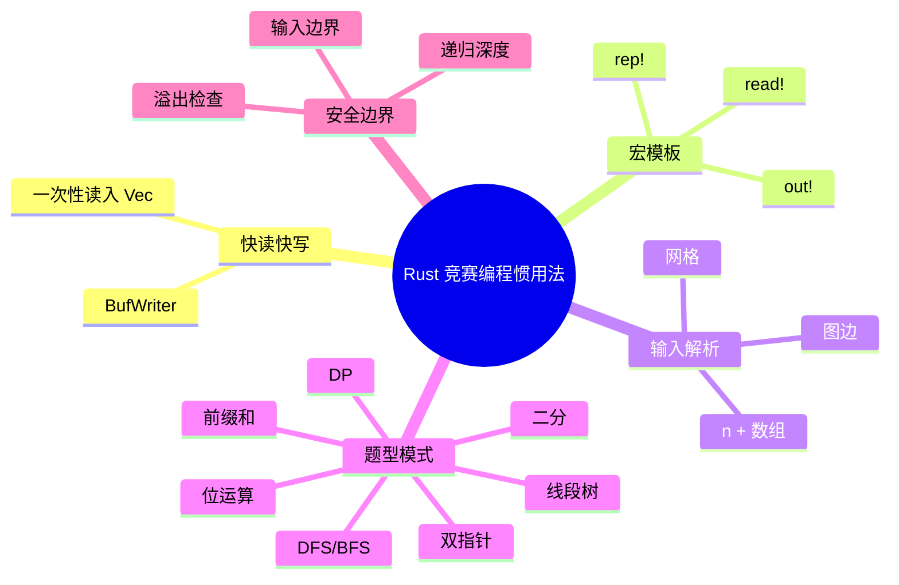
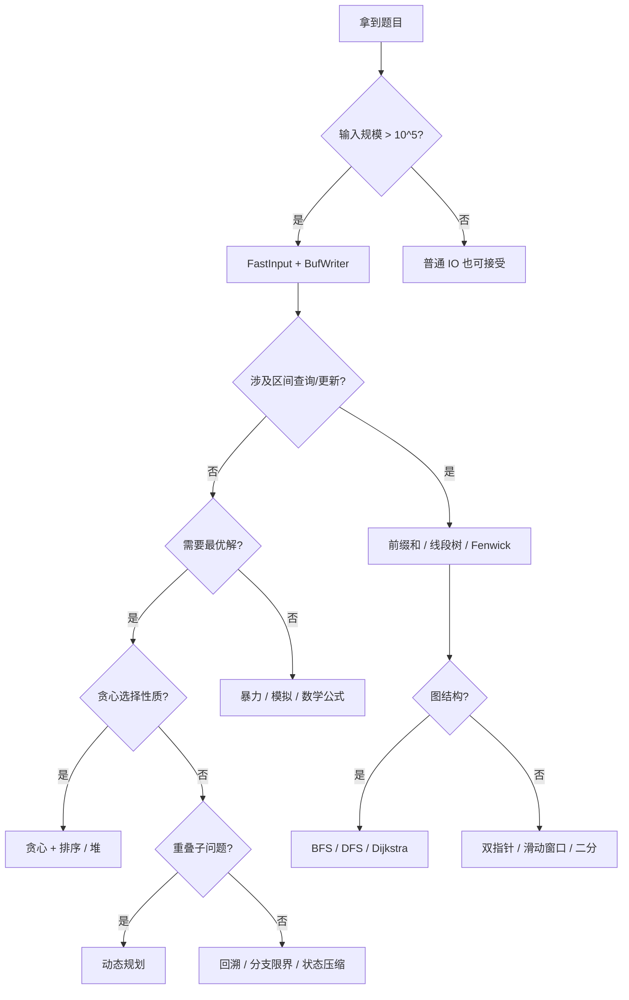

# Rust 竞赛编程惯用法

**EN**: Competitive Programming Idioms in Rust
**Summary**: Fast I/O, macro templates, input parsing patterns, and common problem-solving idioms for competitive programming in Rust, with ownership-safe and overflow-aware examples.

> **Rust 版本**: 1.97.0+ (Edition 2024)
> **Bloom 层级**: L3-L5
> **权威来源**: 本文件为 `concept/` 权威页。
> **定位**: 将 Rust 语言特性（所有权、迭代器、类型安全、溢出检查）映射到竞赛编程高频场景：快读、快写、宏模板、输入解析与题型模式。
> **前置概念**: [Ownership](../../01_foundation/01_ownership_borrow_lifetime/01_ownership.md) · [Iterator](../../02_intermediate/07_iterators_and_closures/01_iterator_patterns.md) · [算法模式概述](00_algorithm_patterns_overview.md) · [算法范式深潜](01_algorithmic_paradigms.md)
> **后置概念**: [图算法 Rust 实现](03_graph_algorithms_in_rust.md) · [动态规划 Rust 实现](06_dynamic_programming_in_rust.md) · [字符串算法 Rust 实现](07_string_algorithms_in_rust.md) · [所有权感知的数据结构](02_ownership_aware_data_structures.md)
> **L5 对比**: [Rust vs C++](../../05_comparative/01_systems_languages/01_rust_vs_cpp.md)

---

> **来源 / Provenance**:
> [The Rust Programming Language](https://doc.rust-lang.org/book/title-page.html) ·
> [The Rust Reference](https://doc.rust-lang.org/reference/introduction.html) ·
> [Rust by Example](https://doc.rust-lang.org/rust-by-example/) ·
> [AtCoder Rust Resources](https://github.com/rust-lang-ja/atcoder-rust-resources) ·
> [Codeforces Rust Guide](https://codeforces.com/blog/entry/93231)

---

## 思维导图



> **认知功能**: 本 mindmap 从「IO → 模板 → 题型 → 安全边界」组织，帮助竞赛者在时间压力下快速组合出正确的 Rust 代码骨架。

---

## 一、权威定义

**竞赛编程惯用法** 是指在算法竞赛环境下，为兼顾编码速度、运行速度与正确性而形成的稳定代码片段。Rust 的强类型与所有权模型在竞赛中有双重效果：

1. **收益**：编译期捕获数组越界、空指针、数据竞争等错误。
2. **成本**：某些 C++ 中一行完成的操作（如修改集合时遍历）需要显式处理借用。

因此 Rust 竞赛代码的核心策略是：**一次性读入全部输入、用索引/迭代器避免频繁借用冲突、用宏减少样板代码、用类型系统主动防御溢出**。

> **来源**: [Codeforces Rust Guide](https://codeforces.com/blog/entry/93231) · [AtCoder Rust Resources](https://github.com/rust-lang-ja/atcoder-rust-resources)

---

## 二、快读（Fast Input）

标准 `stdin().lines()` 在大量输入下因 UTF-8 校验与逐行分配而变慢。竞赛中通常一次性读取全部字节到 `Vec<u8>`，再手动分词。

```rust
use std::io::{self, Read};

struct FastInput {
    buf: Vec<u8>,
    pos: usize,
}

impl FastInput {
    fn new() -> Self {
        let mut buf = Vec::new();
        io::stdin().read_to_end(&mut buf).unwrap();
        Self { buf, pos: 0 }
    }

    fn skip_whitespace(&mut self) {
        while self.pos < self.buf.len() && self.buf[self.pos].is_ascii_whitespace() {
            self.pos += 1;
        }
    }

    fn next_token(&mut self) -> &[u8] {
        self.skip_whitespace();
        let start = self.pos;
        while self.pos < self.buf.len() && !self.buf[self.pos].is_ascii_whitespace() {
            self.pos += 1;
        }
        &self.buf[start..self.pos]
    }

    fn next<T: std::str::FromStr>(&mut self) -> T
    where
        T::Err: std::fmt::Debug,
    {
        std::str::from_utf8(self.next_token()).unwrap().parse().unwrap()
    }
}

fn main() {
    // 仅做编译验证；实际运行时需从 stdin 提供输入
    let mut sc = FastInput::new();
    let _n: usize = sc.next();
}
```

**所有权要点**：

- `buf` 被 `FastInput` 拥有，`next_token` 返回对内部缓冲区的借用；调用方不能跨下一次 `next_token` 持有该借用，否则编译失败——这正好防止了「读入过程中仍引用旧 token」的 bug。
- `next<T>` 在借用期间完成解析并返回拥有值，不暴露内部缓冲区的生命周期。

---

## 三、快写（Fast Output）

```rust
use std::io::{self, Write, BufWriter};

fn main() {
    let stdout = io::stdout().lock();
    let mut out = BufWriter::new(stdout);

    for i in 1..=5 {
        writeln!(out, "{}", i * i).unwrap();
    }

    out.flush().unwrap();
}
```

`BufWriter` 减少系统调用次数；`lock()` 避免多次内部锁。程序结束前必须 `flush`，否则末尾数据可能丢失。

---

## 四、宏模板

宏能减少重复样板，但应保持简单，避免隐藏复杂的借用逻辑。

```rust,ignore
macro_rules! read {
    ($sc:expr) => { $sc.next() };
    ($sc:expr, $t:ty) => { $sc.next::<$t>() };
    ($sc:expr, $($t:ty),+) => { ($($sc.next::<$t>(),)+) };
}

macro_rules! out {
    ($out:expr, $x:expr) => { writeln!($out, "{}", $x).unwrap(); };
}

macro_rules! rep {
    ($i:ident, $n:expr, $body:block) => {
        for $i in 0..$n $body
    };
}

fn main() {
    let mut sc = FastInput::new();
    let stdout = std::io::stdout().lock();
    let mut out = std::io::BufWriter::new(stdout);

    let (n, m): (usize, usize) = read!(sc, usize, usize);
    let mut sum = 0i64;
    rep!(i, n, {
        let x: i64 = read!(sc, i64);
        sum += x;
    });
    out!(out, sum);
    // 实际运行需要输入
}
```

> 宏模板在竞赛中有助于提速，但在生产代码中应优先使用函数和泛型，以保持类型错误信息的清晰性。

---

## 五、输入解析模式

### 5.1 `n` 加数组

```rust,ignore
fn read_array(sc: &mut FastInput) -> Vec<i64> {
    let n: usize = sc.next();
    (0..n).map(|_| sc.next::<i64>()).collect()
}
```

### 5.2 图边（无向）

```rust,ignore
fn read_undirected_graph(sc: &mut FastInput, n: usize, m: usize) -> Vec<Vec<usize>> {
    let mut adj = vec![Vec::new(); n + 1];
    for _ in 0..m {
        let u: usize = sc.next();
        let v: usize = sc.next();
        adj[u].push(v);
        adj[v].push(u);
    }
    adj
}
```

### 5.3 网格（字符）

```rust,ignore
fn read_grid(sc: &mut FastInput, n: usize) -> Vec<Vec<u8>> {
    (0..n)
        .map(|_| {
            let row = sc.next_token().to_vec();
            row
        })
        .collect()
}
```

> 注意：`next_token` 返回的字节切片不含换行；若网格行内可能含空格，应改用 `sc.next::<String>()` 后再 `into_bytes()`。

---

## 六、常见题型模式

### 6.1 前缀和

```rust
fn prefix_sum(a: &[i64]) -> Vec<i64> {
    let mut pref = vec![0; a.len() + 1];
    for i in 0..a.len() {
        pref[i + 1] = pref[i] + a[i];
    }
    pref
}

fn range_sum(pref: &[i64], l: usize, r: usize) -> i64 {
    pref[r + 1] - pref[l]
}

fn main() {
    let a = vec![1, 2, 3, 4, 5];
    let pref = prefix_sum(&a);
    assert_eq!(range_sum(&pref, 1, 3), 2 + 3 + 4);
}
```

### 6.2 双指针 / 滑动窗口

```rust
fn longest_unique_substring(s: &str) -> usize {
    let bytes = s.as_bytes();
    let mut freq = [0usize; 256];
    let mut left = 0;
    let mut best = 0;
    for right in 0..bytes.len() {
        freq[bytes[right] as usize] += 1;
        while freq[bytes[right] as usize] > 1 {
            freq[bytes[left] as usize] -= 1;
            left += 1;
        }
        best = best.max(right - left + 1);
    }
    best
}

fn main() {
    assert_eq!(longest_unique_substring("abcabcbb"), 3);
}
```

### 6.3 二分查找

```rust
fn lower_bound(a: &[i64], target: i64) -> usize {
    a.partition_point(|&x| x < target)
}

fn main() {
    let a = vec![1, 3, 5, 7, 9];
    assert_eq!(lower_bound(&a, 5), 2);
    assert_eq!(lower_bound(&a, 6), 3);
}
```

### 6.4 DFS / BFS 模板

```rust
use std::collections::VecDeque;

fn bfs(start: usize, adj: &[Vec<usize>]) -> Vec<i32> {
    let n = adj.len();
    let mut dist = vec![-1; n];
    let mut q = VecDeque::new();
    dist[start] = 0;
    q.push_back(start);

    while let Some(u) = q.pop_front() {
        for &v in &adj[u] {
            if dist[v] == -1 {
                dist[v] = dist[u] + 1;
                q.push_back(v);
            }
        }
    }
    dist
}

fn main() {
    let adj = vec![vec![1, 2], vec![2], vec![], vec![]];
    assert_eq!(bfs(0, &adj), vec![0, 1, 1, -1]);
}
```

> DFS 递归深度在 Rust 中受线程栈限制；深度 ≥ 10^5 时应改用显式栈，参见 [反例 1](#反例)。

### 6.5 动态规划：0/1 背包

```rust
fn knapsack(weights: &[usize], values: &[usize], capacity: usize) -> usize {
    let mut dp = vec![0; capacity + 1];
    for i in 0..weights.len() {
        for w in (weights[i]..=capacity).rev() {
            dp[w] = dp[w].max(dp[w - weights[i]] + values[i]);
        }
    }
    dp[capacity]
}

fn main() {
    assert_eq!(knapsack(&[1, 3, 4, 5], &[1, 4, 5, 7], 7), 9);
}
```

### 6.6 位运算枚举子集

```rust
fn subset_sums(a: &[i32]) -> Vec<i32> {
    let n = a.len();
    let mut sums = Vec::with_capacity(1 << n);
    for mask in 0..(1 << n) {
        let mut s = 0;
        for i in 0..n {
            if mask & (1 << i) != 0 {
                s += a[i];
            }
        }
        sums.push(s);
    }
    sums
}

fn main() {
    assert_eq!(subset_sums(&[1, 2, 3]), vec![0, 1, 2, 3, 3, 4, 5, 6]);
}
```

> 位运算枚举适用于 `n ≤ 20~22`；超过此范围会指数爆炸。

### 6.7 线段树区间最值

```rust
struct SegmentTree {
    n: usize,
    tree: Vec<i64>,
}

impl SegmentTree {
    fn from_slice(a: &[i64]) -> Self {
        let n = a.len().next_power_of_two().max(1);
        let mut tree = vec![0; 2 * n];
        tree[n..n + a.len()].copy_from_slice(a);
        for i in (1..n).rev() {
            tree[i] = tree[2 * i].max(tree[2 * i + 1]);
        }
        Self { n, tree }
    }

    fn query(&self, mut l: usize, mut r: usize) -> i64 {
        assert!(l <= r && r <= self.n);
        let mut res_l = i64::MIN;
        let mut res_r = i64::MIN;
        l += self.n;
        r += self.n;
        while l < r {
            if l % 2 == 1 {
                res_l = res_l.max(self.tree[l]);
                l += 1;
            }
            if r % 2 == 1 {
                r -= 1;
                res_r = self.tree[r].max(res_r);
            }
            l /= 2;
            r /= 2;
        }
        res_l.max(res_r)
    }
}

fn main() {
    let a = vec![1, 3, 5, 7, 9];
    let st = SegmentTree::from_slice(&a);
    assert_eq!(st.query(1, 4), 7);
}
```

---

## 七、多维对比矩阵

| 题型模式 | 时间复杂度 | 空间复杂度 | Rust 特化注意 | 典型输入规模 |
|:---|:---:|:---:|:---|:---:|
| 前缀和 | 预处理 `O(n)`，查询 `O(1)` | `O(n)` | 用 `i64` 防溢出 | `n ≤ 10^6` |
| 双指针 / 滑动窗口 | `O(n)` | `O(1)` 或 `O(Σ)` | 索引边界借用安全 | `n ≤ 10^6` |
| 二分查找 | `O(log n)` | `O(1)` | `partition_point` 语义清晰 | `n ≤ 10^9`（值域） |
| BFS/DFS | `O(V + E)` | `O(V + E)` | DFS 递归深度受限，BFS 用 `VecDeque` | `V ≤ 10^5` |
| 0/1 背包 | `O(n·C)` | `O(C)` | 倒序更新保证每个物品只用一次 | `C ≤ 10^4` |
| 子集枚举 | `O(2^n · n)` | `O(2^n)` | `1 << n` 在 `n ≥ 32` 时溢出 | `n ≤ 22` |
| 线段树 | `O(log n)` | `O(n)` | 连续 `Vec` 存储，无递归 | `n ≤ 10^5` |

---

## 八、反例

### 反例 1：DFS 递归深度过大

```rust,ignore
// 危险：图深度 10^5 时可能栈溢出
fn dfs(u: usize, adj: &[Vec<usize>], visited: &mut [bool]) {
    visited[u] = true;
    for &v in &adj[u] {
        if !visited[v] {
            dfs(v, adj, visited);
        }
    }
}
```

**修正**：使用显式栈迭代实现，或提高栈大小（`RUST_MIN_STACK`）。

### 反例 2：热路径中使用 `String::parse`

```rust,ignore
// 慢：每次读取都进行 UTF-8 校验和分配
let mut input = String::new();
for _ in 0..n {
    std::io::stdin().read_line(&mut input).unwrap();
    let x: i64 = input.trim().parse().unwrap();
    input.clear();
}
```

**修正**：使用一次性读取的 `FastInput`，分词由字节切片完成。

### 反例 3：未刷新 `BufWriter`

```rust,ignore
use std::io::{self, Write, BufWriter};
let mut out = BufWriter::new(io::stdout().lock());
writeln!(out, "answer").unwrap();
// ❌ 缺少 flush，程序可能在缓冲区未写入时退出
```

**修正**：在 `main` 结束前显式调用 `out.flush().unwrap();`，或让 `out` 在作用域结束时自动 drop（drop 会 flush，但在 panic 路径上可能丢失）。

### 反例 4：整数溢出

```rust,should_panic
fn main() {
    let a = std::hint::black_box(2_000_000_000i32);
    let b = std::hint::black_box(2_000_000_000i32);
    let _ = a + b; // panic in debug mode: overflow
}
```

**修正**：

- 竞赛中默认使用 `i64`，值域大时使用 `i128`。
- 需要取模时，每次运算后 `% MOD`。
- 若必须处理 `u128` 或 BigInt，使用 `num-bigint` crate。

### 反例 5：修改集合时遍历

```rust,compile_fail,E0502
fn main() {
    let mut v = vec![1, 2, 3];
    for &x in &v {
        if x == 2 {
            v.push(4); // ❌ 不可变借用期间可变借用
        }
    }
}
```

**修正**：先收集需要修改的下标或值，循环结束后再统一修改；或使用索引循环配合条件判断。

---

## 九、决策树



---

## 十、正向/反向推理示例

**正向推理**：题目给出 `n` 个数和 `q` 次区间求和查询。

1. 单次区间和若用循环求是 `O(n)`，`q` 次总 `O(nq)`，会超时；
2. 区间和具有可减性，可用前缀和在 `O(n)` 预处理、`O(1)` 查询；
3. Rust 实现：`vec![0; n+1]` 预处理，查询 `pref[r+1] - pref[l]`；
4. 类型选择：`i64` 防止求和溢出。

**反向推理**：目标是统计数组中和为 `target` 的连续子数组个数。

1. 暴力 `O(n^2)` 会超时；
2. 利用前缀和：`pref[j] - pref[i] = target` 等价于 `pref[j] = pref[i] + target`；
3. 用 `HashMap<i64, usize>` 统计前缀和出现次数，边遍历边查询；
4. Rust 实现注意：`HashMap::entry` 与借用检查器配合良好，无需手动管理别名。

---

## 十一、相关概念

- [算法模式概述](00_algorithm_patterns_overview.md) — L6：算法语义分类学与计算等价视角
- [算法范式深潜](01_algorithmic_paradigms.md) — L3-L5：分治、贪心、DP、回溯、随机化、流式
- [动态规划 Rust 实现](06_dynamic_programming_in_rust.md) — L5-L6：滚动数组、记忆化、状态机 DP
- [图算法 Rust 实现](03_graph_algorithms_in_rust.md) — L5-L6：BFS/DFS/Dijkstra 的借用纪律
- [所有权感知的数据结构](02_ownership_aware_data_structures.md) — L5-L6：并查集、线段树、Fenwick 树
- [字符串算法 Rust 实现](07_string_algorithms_in_rust.md) — L5-L6：KMP、Trie、后缀数组
- [c08_algorithms crate docs](../../../crates/c08_algorithms/docs/README.md) — 可编译代码示例

---

## 十二、权威来源索引

- **P0 官方**: [The Rust Programming Language](https://doc.rust-lang.org/book/title-page.html)
- **P0 官方**: [Rust Reference](https://doc.rust-lang.org/reference/introduction.html)
- **P0 官方**: [std::io — BufWriter, Read, Write](https://doc.rust-lang.org/std/io/)
- **P1 社区**: [Codeforces Rust Guide](https://codeforces.com/blog/entry/93231)
- **P1 社区**: [AtCoder Rust Resources](https://github.com/rust-lang-ja/atcoder-rust-resources)
- **P2 生态**: [proconio.rs](https://docs.rs/proconio/latest/proconio/)（竞赛输入宏库，可作为模板参考）

> **文档版本**: 1.0 ｜ **最后更新**: 2026-08-04 ｜ **状态**: ✅ 新建权威页

---

## 国际化权威来源补充（International Authority Sources）

- <https://doc.rust-lang.org/book/title-page.html>
- <https://doc.rust-lang.org/reference/introduction.html>
- <https://codeforces.com/blog/entry/93231>
- <https://github.com/rust-lang-ja/atcoder-rust-resources>
- Rust Algorithm Club：<https://github.com/weihanglo/rust-algorithm-club>
- *Introduction to Algorithms* (CLRS) — ACM Digital Library：<https://dl.acm.org/doi/10.5555/1614191>
