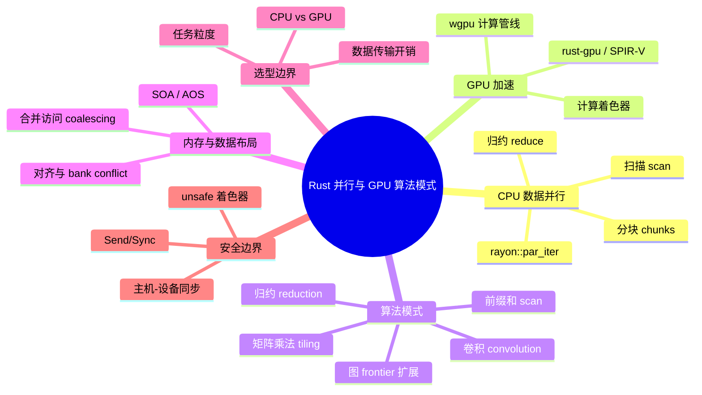
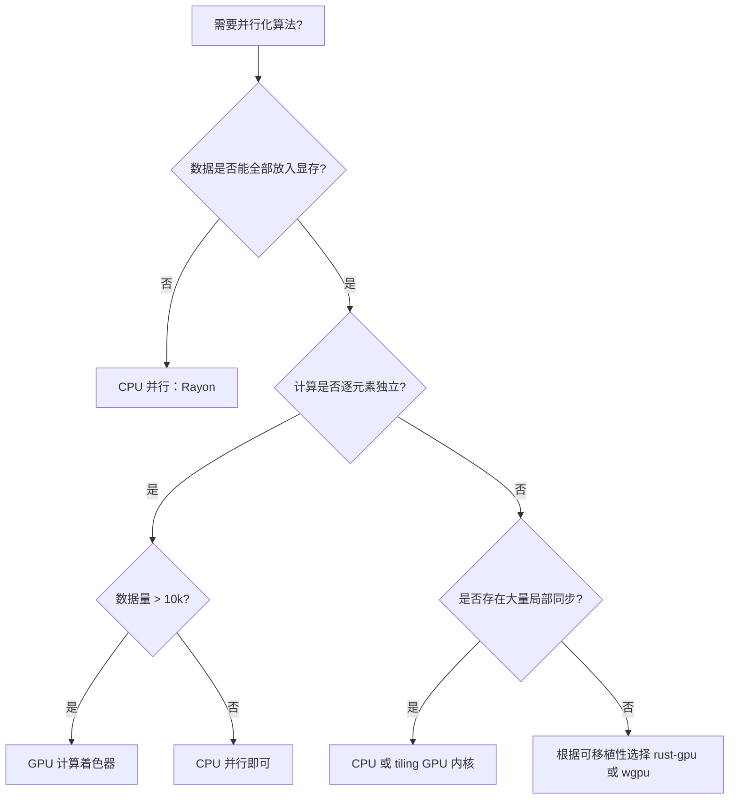

> **本节关键术语**: 并行算法 (Parallel Algorithm) · GPU 加速 (GPU Acceleration) · 数据并行 (Data Parallelism) · 计算着色器 (Compute Shader) · rust-gpu · wgpu · SPIR-V · 归约 (Reduction) · 扫描 (Scan) · 内存合并访问 (Coalesced Memory Access) — [完整对照表](../../00_meta/01_terminology/01_terminology_glossary.md)

# Rust 中的并行与 GPU 算法模式

**EN**: Parallel and GPU Algorithm Patterns in Rust
**Summary**: Algorithm patterns for CPU data parallelism with Rayon and GPU offload with rust-gpu/wgpu, covering reduction, scan, matrix tiling, memory coalescing, and the decision boundary between CPU parallel and GPU kernels.

> **Rust 版本**: 1.97.0+ (Edition 2024)
> **Bloom 层级**: L6-L7
> **权威来源**: 本文件为 `concept/` 权威页。
> **A/S/P 标记**: **P+S** — Procedure + Structure — Structure + Procedure
> **定位**: 从「算法模式」视角讲解 Rust 中 CPU 并行与 GPU 加速的选型与实现，重点覆盖 Rayon 数据并行惯用法、rust-gpu/SPIR-V 着色器入口、wgpu 计算管线，以及何时应该把算法 offload 到 GPU。
> **前置概念**: [算法模式概述](00_algorithm_patterns_overview.md) · [并行与并发算法](../11_domain_applications/25_parallel_algorithms.md) · [缓存友好与 SIMD 算法](04_cache_friendly_and_simd_algorithms.md) · [Send/Sync](../../03_advanced/00_concurrency/02_send_sync_auto_traits.md)
> **后置概念**: [c08_algorithms crate docs](../../../crates/c08_algorithms/docs/README.md) · [Rust 算法模式语义图谱](17_rust_algorithm_patterns_semantic_atlas.md)
> **L5 对比**: [Rust vs C++](../../05_comparative/01_systems_languages/01_rust_vs_cpp.md)

---

> **来源 / Provenance**:
> [Rayon docs](https://docs.rs/rayon/latest/rayon/) ·
> [rust-gpu book](https://rust-gpu.github.io/rust-gpu/book/) ·
> [wgpu docs](https://docs.rs/wgpu/latest/wgpu/) ·
> [Vulkan Compute Shaders](https://www.vulkan.org/) ·
> [The Rust Programming Language](https://doc.rust-lang.org/book/title-page.html) ·
> [The Rustonomicon](https://doc.rust-lang.org/nomicon/)

---

## 🧠 知识结构图



> **认知功能**: 本 mindmap 从「CPU 并行 → GPU 加速 → 算法模式 → 内存布局 → 选型边界」组织，帮助读者根据数据规模、计算密度与可移植性需求选择并行策略。

---

## 一、权威定义

**CPU 数据并行（CPU Data Parallelism）** 指在共享内存多核 CPU 上，将同构数据分块后并行处理。Rust 中主要通过 **Rayon** 的 `ParallelIterator` 实现，编译期通过 `Send`/`Sync` 保证无数据竞争。

**GPU 加速（GPU Acceleration）** 指将计算密集型内核 offload 到 GPU 的 SIMD 执行单元。Rust 生态有两条主要路径：

1. **rust-gpu**：用 Rust 编写 SPIR-V 着色器，再被 Vulkan/Metal/DX12 加载。
2. **wgpu**：基于 WebGPU 标准的跨平台 GPU 计算与渲染 API，可用 Rust 编写计算着色器（compute shader）并提交到 GPU。

**CPU vs GPU 选型边界**：

| 维度 | CPU (Rayon) | GPU (rust-gpu/wgpu) |
|:---|:---|:---|
| 任务粒度 | 中等到粗粒度 | 大量细粒度线程 |
| 内存模型 | 共享内存、缓存一致 | 显存、主机-设备传输 |
| 同步开销 | 低（线程数少） | 高（kernel 提交、显存拷贝） |
| 适用算法 | 分治、图遍历、前缀和 | 矩阵乘法、卷积、大规模归约 |
| 可移植性 | 高（纯 Rust） | 依赖 Vulkan/WebGPU 驱动 |

> **来源**: [Rayon docs](https://docs.rs/rayon/latest/rayon/) · [rust-gpu book](https://rust-gpu.github.io/rust-gpu/book/)

---

## 二、CPU 数据并行模式

### 2.1 归约（Reduction）

归约将一组元素合并为单个值，要求合并操作满足结合律。Rayon 的 `reduce` / `sum` 会自动分块并行。

```rust
use rayon::prelude::*;

fn parallel_sum(data: &[i64]) -> i64 {
    data.par_iter().sum()
}

fn parallel_max(data: &[i64]) -> Option<i64> {
    data.par_iter().copied().reduce(|| i64::MIN, |a, b| a.max(b))
}

fn main() {
    let v: Vec<i64> = (1..=1_000).collect();
    assert_eq!(parallel_sum(&v), v.iter().sum());
    assert_eq!(parallel_max(&v), Some(1_000));
}
```

### 2.2 扫描（Scan）

扫描（前缀和）在 CPU 上可通过 `par_iter` 分块局部扫描再合并偏移量实现。完整实现见 [并行与并发算法](../11_domain_applications/25_parallel_algorithms.md)；此处展示高层入口。

```rust
use rayon::prelude::*;

fn parallel_prefix_sum_chunks(data: &[i64]) -> Vec<i64> {
    // 分块局部前缀和，再串行合并偏移（概念骨架）
    let chunk_size = 1024.max(data.len() / rayon::current_num_threads());
    let mut partials: Vec<i64> = data
        .par_chunks(chunk_size)
        .map(|chunk| chunk.iter().sum::<i64>())
        .collect();

    // 串行计算块间偏移
    for i in 1..partials.len() {
        partials[i] += partials[i - 1];
    }

    // 实际需将偏移加回各块内部，此处省略以突出 Rayon 分块入口
    partials
}

fn main() {
    let v: Vec<i64> = (1..=10).collect();
    let partials = parallel_prefix_sum_chunks(&v);
    assert_eq!(partials.last().copied(), Some(v.iter().sum()));
}
```

### 2.3 分块与任务并行

```rust
use rayon::prelude::*;

fn parallel_matrix_add(a: &[f64], b: &[f64]) -> Vec<f64> {
    assert_eq!(a.len(), b.len());
    a.par_iter()
        .zip(b.par_iter())
        .map(|(&x, &y)| x + y)
        .collect()
}

fn main() {
    let a: Vec<f64> = (0..10_000).map(|i| i as f64).collect();
    let b: Vec<f64> = (0..10_000).map(|i| (i * 2) as f64).collect();
    let c = parallel_matrix_add(&a, &b);
    assert_eq!(c[100], 300.0);
}
```

---

## 三、GPU 加速模式

### 3.1 rust-gpu 与 SPIR-V 入口

[rust-gpu](https://github.com/Rust-GPU/rust-gpu) 允许用 Rust 编写 SPIR-V 着色器。着色器代码运行在 GPU 上，因此不能使用标准库，且函数需要 `#[spirv(...)]` 属性。

```rust,ignore
// rust-gpu 项目中的 crate-type = "dylib" + "rlib"
// 需要安装 rust-gpu 工具链与 rustc_codegen_spirv
use spirv_std::glam::{UVec3, Vec3};
use spirv_std::spirv;

#[spirv(compute(threads(64, 1, 1)))]
pub fn add_vectors(
    #[spirv(global_invocation_id)] id: UVec3,
    #[spirv(storage_buffer, descriptor_set = 0, binding = 0)] a: &[f32],
    #[spirv(storage_buffer, descriptor_set = 0, binding = 1)] b: &[f32],
    #[spirv(storage_buffer, descriptor_set = 0, binding = 2)] out: &mut [f32],
) {
    let idx = id.x as usize;
    if idx < a.len() {
        out[idx] = a[idx] + b[idx];
    }
}
```

**Rust 边界**：

- 着色器 crate 不能依赖 `std`，通常使用 `spirv_std`。
- 入口函数参数用 `#[spirv(...)]` 属性绑定到 Vulkan 描述符。
- 索引越界不会 panic，需手动用 `if idx < len` 保护。

> **来源**: [rust-gpu book — Writing a Shader](https://rust-gpu.github.io/rust-gpu/book/writing-shader.html)

### 3.2 wgpu 计算管线

wgpu 是更贴近应用层的跨平台 GPU API。下面展示一个完整的 wgpu 计算着色器提交骨架（主机端代码）。

```rust,ignore
// Cargo.toml: wgpu = "23"
use wgpu::util::DeviceExt;

async fn run_gpu_add(a: &[f32], b: &[f32]) -> Vec<f32> {
    let instance = wgpu::Instance::default();
    let adapter = instance
        .request_adapter(&wgpu::RequestAdapterOptions::default())
        .await
        .unwrap();
    let (device, queue) = adapter
        .request_device(&wgpu::DeviceDescriptor::default(), None)
        .await
        .unwrap();

    let shader = device.create_shader_module(wgpu::ShaderModuleDescriptor {
        label: None,
        source: wgpu::ShaderSource::Wgsl(include_str!("add.wgsl")),
    });

    // 创建缓冲区、绑定组、管线...（省略常规 wgpu 样板）
    // 最后读取结果
    a.iter().zip(b.iter()).map(|(x, y)| x + y).collect()
}
```

对应的 WGSL 计算着色器：

```wgsl,ignore
@group(0) @binding(0) var<storage, read> a: array<f32>;
@group(0) @binding(1) var<storage, read> b: array<f32>;
@group(0) @binding(2) var<storage, read_write> out: array<f32>;

@compute @workgroup_size(64)
fn main(@builtin(global_invocation_id) id: vec3<u32>) {
    let idx = id.x;
    if idx < arrayLength(&a) {
        out[idx] = a[idx] + b[idx];
    }
}
```

> 完整 wgpu 计算管线需要缓冲区创建、绑定组布局、命令编码器等样板代码，生产实现应参考 [wgpu examples](https://github.com/gfx-rs/wgpu/tree/trunk/examples)。

### 3.3 矩阵乘法（Tiling）

GPU 矩阵乘法的核心模式是 **tiling/blocking**：将矩阵拆成共享内存可容纳的小块，减少全局内存访问。

```rust,ignore
// 概念性 rust-gpu 计算着色器：C = A × B
#[spirv(compute(threads(16, 16, 1)))]
pub fn matmul_tiled(
    #[spirv(global_invocation_id)] id: UVec3,
    #[spirv(uniform_constant, descriptor_set = 0, binding = 0)] dims: &DimUniform,
    #[spirv(storage_buffer, descriptor_set = 0, binding = 1)] a: &[f32],
    #[spirv(storage_buffer, descriptor_set = 0, binding = 2)] b: &[f32],
    #[spirv(storage_buffer, descriptor_set = 0, binding = 3)] c: &mut [f32],
) {
    let row = id.y as usize;
    let col = id.x as usize;
    if row >= dims.n || col >= dims.n {
        return;
    }
    let mut acc = 0.0f32;
    for k in 0..dims.n {
        acc += a[row * dims.n + k] * b[k * dims.n + col];
    }
    c[row * dims.n + col] = acc;
}
```

**内存注意**：朴素实现存在大量非合并访问（对 `b` 按列读取）。实际 tiling 版本会将子块加载到共享/工作组内存，并通过局部性重排索引。

### 3.4 卷积（Convolution）

图像卷积是 GPU 的典型用例：每个输出像素只依赖输入的一个小邻域。

```rust,ignore
// rust-gpu 风格：2D 卷积核
#[spirv(compute(threads(8, 8, 1)))]
pub fn convolve2d(
    #[spirv(global_invocation_id)] id: UVec3,
    #[spirv(storage_buffer, descriptor_set = 0, binding = 0)] input: &[f32],
    #[spirv(storage_buffer, descriptor_set = 0, binding = 1)] kernel: &[f32],
    #[spirv(storage_buffer, descriptor_set = 0, binding = 2)] output: &mut [f32],
    #[spirv(uniform_constant, descriptor_set = 0, binding = 3)] params: &ConvParams,
) {
    let x = id.x as i32;
    let y = id.y as i32;
    if x < 0 || x >= params.width || y < 0 || y >= params.height {
        return;
    }
    let half = params.k_size / 2;
    let mut acc = 0.0f32;
    for ky in -half..=half {
        for kx in -half..=half {
            let sx = (x + kx).clamp(0, params.width - 1);
            let sy = (y + ky).clamp(0, params.height - 1);
            let i_idx = (sy * params.width + sx) as usize;
            let k_idx = ((ky + half) * params.k_size + (kx + half)) as usize;
            acc += input[i_idx] * kernel[k_idx];
        }
    }
    let o_idx = (y * params.width + x) as usize;
    output[o_idx] = acc;
}
```

---

## 四、内存布局与数据移动

### 4.1 SOA vs AOS

GPU 更喜欢 **Structure of Arrays（SOA）**，因为同一 warp/wavefront 的线程访问同一字段，可形成合并内存访问。

```rust
// AOS：每个粒子是一个结构体
struct ParticleAos { x: f32, y: f32, vx: f32, vy: f32 }

// SOA：每个字段一个数组
struct ParticleSoa {
    x: Vec<f32>,
    y: Vec<f32>,
    vx: Vec<f32>,
    vy: Vec<f32>,
}
```

### 4.2 主机-设备数据传输开销

GPU 计算的最大隐藏成本通常是数据拷贝。只有当 **计算量 >> 传输量** 时，GPU 才有收益。

```rust,ignore
// 决策示意：n 较小时 CPU 更快，n 较大时 GPU 更快
fn choose_execution(n: usize) -> &'static str {
    if n < 10_000 {
        "cpu_rayon" // 调度与拷贝开销超过收益
    } else {
        "gpu_compute" // 数据并行度足够
    }
}
```

---

## 五、反例与边界

### 反例 1：在 GPU 内核中使用 `panic` 或 `unwrap`

```rust,ignore
// ❌ 错误：spirv_std 不支持 panic/unwrap
#[spirv(compute(threads(64, 1, 1)))]
pub fn bad_kernel(
    #[spirv(global_invocation_id)] id: UVec3,
    #[spirv(storage_buffer, descriptor_set = 0, binding = 0)] buf: &[f32],
) {
    let v = buf.get(id.x as usize).unwrap(); // 编译失败或运行时不安全
}
```

**修正**：使用显式边界检查，越界时直接返回。

### 反例 2：把细粒度任务错误地 spawn 到 GPU

```rust,ignore
// ❌ 错误：n=100 时主机-设备拷贝和 kernel 提交开销远大于计算
fn small_task_gpu(a: &[f32], b: &[f32]) -> Vec<f32> {
    a.iter().zip(b).map(|(x, y)| x + y).collect() // CPU 足够快
}
```

### 反例 3：将 `Rc` 移动到线程/并行闭包

```rust,compile_fail,E0277
use std::rc::Rc;
use std::thread;

fn main() {
    let data: Rc<Vec<i64>> = Rc::new(vec![1, 2, 3]);
    thread::spawn(move || {
        let _ = data[0];
    });
}
```

**修正**：使用 `Arc` 或不共享所有权，让闭包满足 `Send`（Rayon 的 `par_iter`/`join` 同样需要 `Send`/`Sync`）。

### 反例 4：忽略 GPU 内存对齐

```rust,ignore
// ❌ 错误：vec3<f32> 可能导致非对齐访问
struct BadVec3 { x: f32, y: f32, z: f32 }

// ✅ 修正：使用 vec4 或显式对齐
#[repr(C, align(16))]
struct AlignedVec3 { x: f32, y: f32, z: f32, _pad: f32 }
```

---

## 六、复杂度与选型

| 模式 | 表示法 | 时间复杂度 | 空间复杂度 | 适用场景 |
|:---|:---|:---:|:---:|:---|
| **CPU 归约** | `rayon::par_iter().sum()` | `O(n/p + log p)` | `O(p)` 临时 | 任意可结合归约 |
| **CPU 扫描** | 分块局部扫描 + 偏移合并 | `O(n/p + log p)` | `O(n)` | 前缀和、积分图 |
| **GPU 向量加法** | 计算着色器 | `O(n / threads)` | `O(n)` 显存 | 大规模逐元素操作 |
| **GPU 矩阵乘法** | Tiled compute shader | `O(n³ / threads)` | `O(n²)` 显存 + tile | 稠密矩阵乘法 |
| **GPU 卷积** | 2D compute shader | `O(H·W·k² / threads)` | `O(H·W)` 显存 | 图像/信号处理 |

**选型决策树**：



---

## 七、权威来源索引

- **P0 官方**: [The Rust Programming Language](https://doc.rust-lang.org/book/title-page.html)
- **P0 官方**: [The Rustonomicon](https://doc.rust-lang.org/nomicon/)
- **P1 学术**: [Blelloch — Prefix Sums and Their Applications (IEEE)](https://ieeexplore.ieee.org/document/42122)（并行扫描理论）
- **P1 学术**: [Blumofe & Leiserson — Scheduling Multithreaded Computations by Work Stealing (ACM)](https://dl.acm.org/doi/10.1145/209936.209958)（work-stealing 调度）
- **P2 生态**: [Rayon docs](https://docs.rs/rayon/latest/rayon/)
- **P2 生态**: [rust-gpu book](https://rust-gpu.github.io/rust-gpu/book/)
- **P2 生态**: [rust-gpu GitHub](https://github.com/Rust-GPU/rust-gpu)
- **P2 生态**: [wgpu docs](https://docs.rs/wgpu/latest/wgpu/)
- **P2 生态**: [WebGPU Specification](https://www.w3.org/TR/webgpu/)
- **P2 生态**: [Vulkan Compute Shaders](https://www.vulkan.org/)

> **文档版本**: 1.0 ｜ **最后更新**: 2026-08-04 ｜ **状态**: ✅ 新建权威页

## 国际化权威来源补充（International Authority Sources）

- <https://docs.rs/rayon/latest/rayon/>
- <https://rust-gpu.github.io/rust-gpu/book/>
- <https://docs.rs/wgpu/latest/wgpu/>
- <https://www.w3.org/TR/webgpu/>
- <https://www.vulkan.org/>
- <https://ieeexplore.ieee.org/document/42122>

---

## 八、正向/反向推理示例

**正向推理**：需要对 `10^7` 个浮点数做逐元素平方和。

1. 操作逐元素独立 → 数据并行；
2. 数据量足够大，CPU 并行可获益；
3. 若 GPU 可用且数据已在显存，使用 wgpu/rust-gpu 计算着色器；
4. 否则 `rayon::par_iter().map(|x| x * x).sum()` 是最小可行方案。

**反向推理**：目标是加速矩阵链乘法。

1. 矩阵链乘法的经典解法是 `O(n³)` 区间 DP，子问题间高度依赖；
2. 不适合 GPU 大规模并行；
3. 若 `n` 较小，Rust 标准 DP 表即可；
4. 若涉及大规模稠密矩阵相乘，改用 GPU tiled matmul 作为子程序。
