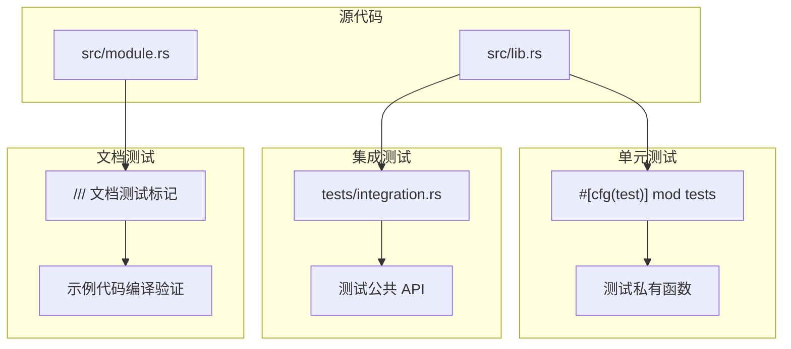
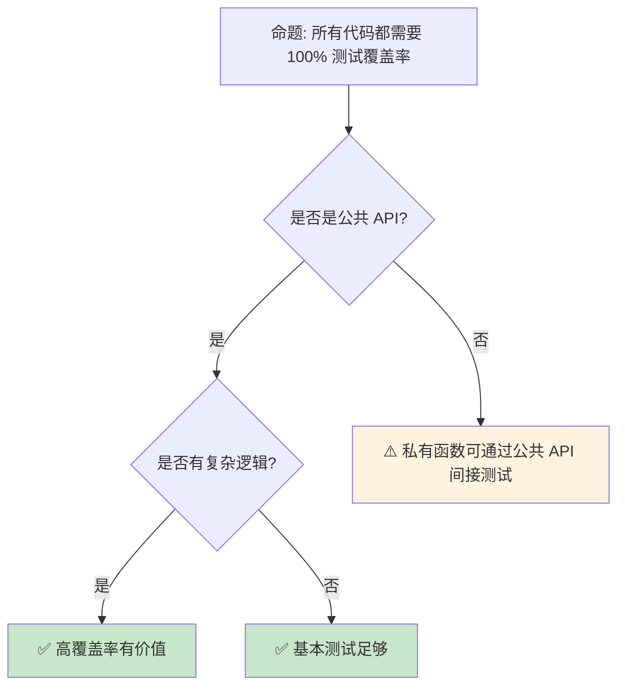

> **内容分级**: [综述级]
>
> **定理链**: N/A — 描述性/综述性/导航性文档，不涉及形式化定理链
>
# 测试生态：单元测试、集成测试与验证策略
>
> **EN**: Testing
> **Summary**: Testing. Core Rust concept covering testing and verification, ecosystem and tooling.
> **受众**: [进阶]
> **Bloom 层级**: 应用 → 分析
> **A/S/P 标记**: **A+P** — ApplicationProcedure
> **双维定位**: P×App — 测试框架和策略的应用
> **定位**:
> 覆盖 Rust **测试生态**的全景——从内置测试框架（#[test]）、
> mockall [来源: [mockall](https://docs.rs/mockall/latest/mockall/)] 模拟、
> property-based testing（proptest [来源: [proptest](https://docs.rs/proptest/latest/proptest/)]）到模糊测试（cargo-fuzz），
> 分析 Rust 的类型系统如何与测试策略协同实现"编译即验证"的工程学理念。
> **前置概念**:
> [Error Handling](../02_intermediate/04_error_handling.md) ·
> [Macros](../03_advanced/04_macros.md)
> **后置概念**:
> [Miri](../03_advanced/03_unsafe.md) ·
> [Formal Methods](../07_future/02_formal_methods.md)

---

> **来源**: [Rust Test Organization](https://doc.rust-lang.org/book/ch11-03-test-organization.html) ·
> [mockall crate](https://docs.rs/mockall/latest/mockall/) ·
> [proptest crate](https://docs.rs/proptest/latest/proptest/) ·
> [cargo-fuzz](https://github.com/rust-fuzz/cargo-fuzz) ·
> [Miri](https://github.com/rust-lang/miri) ·
> [Rust [RFC 2318](https://rust-lang.github.io/rfcs/2318.html) — Custom Test Frameworks](<https://github.com/rust-lang/rfcs/pull/2318>)

> **前置依赖**: [Type Theory](../04_formal/02_type_theory.md)

> **前置依赖**: [Rust vs C++](../05_comparative/01_rust_vs_cpp.md)

## 📑 目录

- [测试生态：单元测试、集成测试与验证策略](#测试生态单元测试集成测试与验证策略)
  - [📑 目录](#-目录)
  - [一、核心概念](#一核心概念)
    - [1.1 Rust 的内置测试框架](#11-rust-的内置测试框架)
    - [1.2 测试组织层次](#12-测试组织层次)
    - [1.3 编译即验证](#13-编译即验证)
  - [二、技术细节](#二技术细节)
    - [2.1 属性测试（Property-Based Testing）](#21-属性测试property-based-testing)
    - [2.2 Mock 与依赖注入](#22-mock-与依赖注入)
    - [2.3 模糊测试（Fuzzing）](#23-模糊测试fuzzing)
  - [三、测试策略矩阵](#三测试策略矩阵)
  - [四、反命题与边界分析](#四反命题与边界分析)
    - [4.1 反命题树](#41-反命题树)
    - [4.2 边界极限](#42-边界极限)
  - [五、常见陷阱](#五常见陷阱)
  - [六、来源与延伸阅读](#六来源与延伸阅读)
  - [相关概念文件](#相关概念文件)
  - [权威来源索引](#权威来源索引)
  - [十、边界测试：测试的编译错误](#十边界测试测试的编译错误)
    - [10.1 边界测试：`cargo test` 的编译失败与测试失败的区分](#101-边界测试cargo-test-的编译失败与测试失败的区分)
    - [10.2 边界测试：mock 对象的 trait 约束（编译错误）](#102-边界测试mock-对象的-trait-约束编译错误)
    - [10.3 边界测试：`cargo test` 的测试名称冲突（编译错误）](#103-边界测试cargo-test-的测试名称冲突编译错误)
    - [10.4 边界测试：doc test 中的 `no_run` 与 `compile_fail` 的误用（编译错误/测试失败）](#104-边界测试doc-test-中的-no_run-与-compile_fail-的误用编译错误测试失败)
    - [补充定理链](#补充定理链)
  - [嵌入式测验（Embedded Quiz）](#嵌入式测验embedded-quiz)
    - [测验 1：`cargo test` 运行单元测试、集成测试和文档测试的顺序是什么？（理解层）](#测验-1cargo-test-运行单元测试集成测试和文档测试的顺序是什么理解层)
    - [测验 2：`tests/` 目录中的集成测试与 `src/` 中 `#[cfg(test)]` 的单元测试在可见性上有什么区别？（理解层）](#测验-2tests-目录中的集成测试与-src-中-cfgtest-的单元测试在可见性上有什么区别理解层)
    - [测验 3：`#[ignore]` 属性的作用是什么？如何只运行被忽略的测试？（理解层）](#测验-3ignore-属性的作用是什么如何只运行被忽略的测试理解层)
    - [测验 4：`cargo test -- --nocapture` 与默认行为有什么不同？（理解层）](#测验-4cargo-test------nocapture-与默认行为有什么不同理解层)
    - [测验 5：`nextest` 相比内置 `cargo test` 的主要改进是什么？（理解层）](#测验-5nextest-相比内置-cargo-test-的主要改进是什么理解层)
  - [认知路径](#认知路径)
    - [核心推理链](#核心推理链)
    - [反命题与边界](#反命题与边界)

---

## 一、核心概念
>
>

### 1.1 Rust 的内置测试框架
>

```text
Rust 测试的三种内置形式:

  1. 单元测试（Unit Tests）
     ├── 放在与被测代码相同的文件中
     ├── #[cfg(test)] 模块内
     └── 可访问私有函数

  2. 集成测试（Integration Tests）
     ├── 放在 tests/ 目录下
     ├── 每个文件是一个独立的 crate
     └── 只能测试公共 API

  3. 文档测试（Doc Tests）
     ├── 放在 /// 注释中的 ``` 代码块
     ├── cargo test [来源: [Cargo Test](https://doc.rust-lang.org/cargo/commands/cargo-test.html)] --doc 运行
     └── 确保示例代码始终可编译

  测试属性:
  ├── #[test]: 标记测试函数
  ├── #[ignore]: 忽略测试（需显式运行）
  ├── #[should_panic]: 期望 panic
  ├── #[bench] (nightly): 基准测试
  └── #[test_case] (第三方): 参数化测试
```

**可编译示例**:

```rust
// 单元测试写在同一个文件中
pub fn add(a: i32, b: i32) -> i32 { a + b }

#[cfg(test)]
mod tests {
    use super::*;

    #[test]
    fn test_add() {
        assert_eq!(add(2, 3), 5);
    }

    #[test]
    #[should_panic(expected = "divide by zero")]
    fn test_divide_by_zero() {
        let _ = 1 / 0;
    }

    #[test]
    #[ignore = "expensive computation"]
    fn test_expensive() {
        // 运行: cargo test -- --ignored
        assert!(true);
    }
}
```

> **认知功能**: Rust 的测试框架是**语言内置**的——不需要外部依赖即可写测试。这与 JavaScript（需要 Jest/Mocha）或 Java（需要 JUnit）形成对比。
> [来源: [TRPL — Testing]]
> **关键洞察**: `#[cfg(test)]` 条件编译使测试代码在生产构建中**完全消除**——零运行时开销。
> [来源: [TRPL Ch11 — Testing](https://doc.rust-lang.org/book/ch11-00-testing.html)]

---

### 1.2 测试组织层次
>



> **认知功能**: 此图展示 Rust 测试的**三层组织**。单元测试验证内部逻辑，集成测试验证公共契约，文档测试验证示例正确性。
> **使用建议**: 优先写单元测试（快速、定位精确），补充集成测试（验证 API 契约），维护文档测试（保证示例有效）。
> [来源: [Rust Test Organization](https://doc.rust-lang.org/book/ch11-03-test-organization.html)]

---

### 1.3 编译即验证
>

```text
Rust 类型系统作为验证工具:

  编译期验证（无需测试）:
  ├── 空指针: Option<T> 强制处理 None
  ├── 数据竞争: Send/Sync 编译期检查
  ├── 悬垂指针: 借用检查器防止
  ├── 未初始化变量: 编译错误
  ├── 模式匹配遗漏: 穷尽性检查
  └── 资源泄漏: RAII + Drop 保证

  需要测试验证的运行时行为:
  ├── 业务逻辑正确性
  ├── 算法边界条件
  ├── 并发交互顺序
  ├── 性能特征
  └── unsafe 代码的安全性

  测试覆盖率的局限性:
  ├── 高覆盖率 ≠ 无 bug
  ├── 类型系统已消除整类错误
  └── 测试应聚焦于**业务逻辑**和**边界条件**
```

> **编译即验证洞察**: Rust 的**类型系统是最大的测试套件**——它在编译期消除了其他语言需要大量测试才能发现的错误。这使得 Rust 的测试可以**聚焦于业务价值**而非语言安全。
> [来源: [Rust Type System as Verification](https://doc.rust-lang.org/reference/type-system.html)]

---

## 二、技术细节

### 2.1 属性测试（Property-Based Testing）
>

```rust,ignore
use proptest::prelude::*;

// 传统测试: 只验证特定输入
#[test]
fn test_add() {
    assert_eq!(add(2, 3), 5);
}

// 属性测试: 验证所有输入的性质
proptest! {
    #[test]
    fn test_add_commutative(a in 0..1000i32, b in 0..1000i32) {
        // 验证加法交换律: a + b == b + a
        prop_assert_eq!(add(a, b), add(b, a));
    }

    #[test]
    fn test_reverse_reverse(a in "[a-zA-Z0-9]*") {
        // 验证: reverse(reverse(s)) == s
        let reversed: String = a.chars().rev().collect();
        let double_reversed: String = reversed.chars().rev().collect();
        prop_assert_eq!(a, double_reversed);
    }
}

// proptest 的优势:
// - 自动生成大量随机输入
// - 发现边界情况（如空字符串、极大值）
// - 失败时自动缩小（shrinking）到最小反例
```

> **属性测试洞察**: 属性测试是**生成式验证**——它自动发现程序员没想到的边界情况，比手写测试用例更全面地覆盖输入空间。
> [来源: [proptest Book](https://docs.rs/proptest/latest/proptest/)]

---

### 2.2 Mock 与依赖注入
>

```rust,ignore
use mockall::{mock, predicate::*};

// 定义 Trait
#[automock]
trait Database {
    fn get_user(&self, id: u64) -> Option<String>;
    fn save_user(&mut self, id: u64, name: &str) -> Result<(), String>;
}

// 使用 Mock 测试
#[test]
fn test_user_service() {
    let mut mock_db = MockDatabase::new();

    // 设置期望
    mock_db
        .expect_get_user()
        .with(eq(42))
        .times(1)
        .returning(|_| Some("Alice".to_string()));

    let service = UserService::new(mock_db);
    let user = service.get_user_name(42);

    assert_eq!(user, Some("Alice".to_string()));
}

// mockall 的优势:
// - 自动生成 Mock 实现
// - 支持期望设置（调用次数、参数匹配）
// - 支持序列和状态机
```

> **Mock 洞察**: `mockall` 通过**过程宏**自动生成 Mock 实现——这是 Rust 宏系统的强大应用，避免了手动编写 mock 的繁琐。
> [来源: [mockall Documentation](https://docs.rs/mockall/latest/mockall/)]

---

### 2.3 模糊测试（Fuzzing）
>

```text
cargo-fuzz: 基于 libFuzzer 的模糊测试

  工作流程:
  1. 定义 fuzz target（模糊测试目标函数）
  2. cargo fuzz run target_name
  3. 工具自动生成随机输入
  4. 监控 panic/崩溃/内存错误
  5. 发现 crash 时保存输入作为复现用例

  Rust 模糊测试的优势:
  ├── 编译期安全消除整类崩溃
  ├── 模糊测试聚焦于 unsafe / 解析逻辑
  ├── 与 Miri 结合可检测未定义行为
  └── 与 AddressSanitizer 结合检测内存错误

  典型应用场景:
  ├── 解析器（JSON/XML/协议）
  ├── 图像/视频编解码
  ├── 文件格式处理
  └── 网络协议实现
```

> **模糊测试洞察**: 模糊测试是**暴力发现边界情况**的方法——它通过大量随机输入发现程序员没想到的漏洞。Rust 的类型安全使模糊测试可以聚焦于真正的业务边界。
> [来源: [cargo-fuzz](https://github.com/rust-fuzz/cargo-fuzz)] · [来源: [Rust Fuzz Book](https://rust-fuzz.github.io/book/)]

---

## 三、测试策略矩阵

```text
场景 → 测试类型 → 工具

业务逻辑验证:
  → 单元测试
  → #[test] + assert!

API 契约验证:
  → 集成测试
  → tests/ 目录 + 外部调用

边界条件发现:
  → 属性测试
  → proptest

外部依赖隔离:
  → Mock 测试
  → mockall

安全漏洞发现:
  → 模糊测试
  → cargo-fuzz + Miri

性能回归检测:
  → 基准测试
  → Criterion

unsafe 代码验证:
  → Miri + 模糊测试
  → miri test + cargo-fuzz

并发 bug 检测:
  → Loom (并发模拟)
  → loom::model
```

> **策略矩阵**: Rust 的测试生态是**分层验证**——从编译期类型检查到运行时模糊测试，每层针对不同类型的错误。
> [来源: [Rust Testing Guide](https://doc.rust-lang.org/rust-by-example/testing.html)] · [来源: [Cargo Book](https://doc.rust-lang.org/cargo/)]

---

## 四、反命题与边界分析

### 4.1 反命题树
>



> **认知功能**: 此决策树展示测试投入的**优先级**。核心原则是：**公共 API + 复杂逻辑优先**。
> **关键洞察**: Rust 的类型系统已消除了许多需要测试的"错误类"——测试应聚焦于**业务逻辑**而非**语言安全**。
> [来源: [Rust API Guidelines — Testing](https://rust-lang.github.io/api-guidelines/testing.html)]

---

### 4.2 边界极限
>

```text
边界 1: 异步测试的复杂度
├── async fn 的测试需要运行时
├── #[tokio::test] 或 Tokio 测试属性
├── 模拟时间（tokio::time::pause）增加复杂度
└── 异步 mock 需要额外支持

边界 2: 全局状态的测试
├── Rust 不鼓励全局可变状态
├── 但某些场景（如日志配置）难以避免
├── 测试并行执行时全局状态冲突
└── 缓解: 使用 thread_local 或测试串行化

边界 3: 外部服务的测试
├── 数据库、网络服务的集成测试
├── 需要 Docker / testcontainers
├── 测试执行时间显著增加
└── 缓解: 分层测试（单元 → 集成 → E2E）

边界 4: unsafe 代码的测试局限
├── Miri 可检测部分 UB，但不是全部
├── 模糊测试发现崩溃，不证明正确性
├── 形式化验证（Kani）可证安全，但复杂
└── unsafe 代码需要组合多种验证手段

边界 5: 测试编译时间
├── 大量测试增加编译时间
├── #[cfg(test)] 代码在生产构建中消除
├── 但 CI 中测试编译时间影响反馈速度
└── 缓解: 测试并行化、选择性测试
```

> **边界要点**: 测试生态的边界主要与**异步复杂性**、**全局状态**、**外部依赖**、**unsafe 验证**和**编译时间**相关。
> [来源: [Rust Test Attributes](https://doc.rust-lang.org/reference/attributes/testing.html)]

---

## 五、常见陷阱
>

```text
陷阱 1: 忽略测试结果中的 flakiness
  ❌ 测试偶尔失败，但不调查原因
     // 可能是时序问题、随机数、全局状态

  ✅ 使用 loom 模拟并发时序
     // 或: 消除测试中的非确定性

陷阱 2: 过度 mock
  ❌ 对所有依赖使用 mock
     // 测试变成"验证 mock 行为"而非"验证代码"

  ✅ 对稳定的外部服务使用真实调用
     // 只对不稳定/慢速依赖使用 mock

陷阱 3: 在测试中忽略错误
  ❌ let _ = function_that_may_fail();
     // 测试通过但可能隐藏问题

  ✅ function_that_may_fail().unwrap();
     // 或: prop_assert!(result.is_ok())

陷阱 4: 测试与实现耦合
  ❌ 测试验证具体实现细节（如内部状态）
     // 重构时测试频繁失败

  ✅ 测试验证公共行为和输出
     // 黑盒测试优于白盒测试

陷阱 5: 忘记测试错误路径
  ❌ 只测试成功场景
     // 错误处理往往包含 bug

  ✅ 使用 #[should_panic] 和 Result 测试错误
     // 属性测试自动生成边界输入
```

> **陷阱总结**: 测试的陷阱主要与**flakiness**、**过度 mock**、**错误忽略**、**实现耦合**和**成功路径偏见**相关。
> [来源: [Rust Testing Best Practices](https://doc.rust-lang.org/rustc-guide/tests/intro.html)]

---

## 六、来源与延伸阅读

| 来源 | 可信度 | 说明 |
|:---|:---:|:---|
| [Rust Reference](https://doc.rust-lang.org/reference/) | ✅ 一级 | 语言参考 |
| [TRPL Ch11 — Testing](https://doc.rust-lang.org/book/ch11-00-testing.html) | ✅ 一级 | 测试入门 |
| [Rust Standard Library](https://doc.rust-lang.org/std/) | ✅ 一级 | 标准库参考 |
| [Rust By Example](https://doc.rust-lang.org/rust-by-example/) | ✅ 一级 | 交互式教程 |
| [RFC Book](https://rust-lang.github.io/rfcs/) | ✅ 一级 | RFC 文档 |
| [Rust Cookbook](https://rust-lang-nursery.github.io/rust-cookbook/) | ✅ 二级 | 实践配方 |
| [This Week in Rust](https://this-week-in-rust.org/) | ✅ 二级 | 社区动态 |
| [mockall](https://docs.rs/mockall/latest/mockall/) | ✅ 一级 | Mock 框架 |
| [proptest](https://docs.rs/proptest/latest/proptest/) | ✅ 一级 | 属性测试 |
| [cargo-fuzz](https://github.com/rust-fuzz/cargo-fuzz) | ✅ 一级 | 模糊测试 |
| [Miri](https://github.com/rust-lang/miri) | ✅ 一级 | UB 检测 |
| [loom](https://docs.rs/loom/latest/loom/) | ✅ 一级 | 并发测试 |
| [Rust Testing Guide](https://doc.rust-lang.org/rust-by-example/testing.html) | ✅ 一级 | 测试指南 |

---

## 相关概念文件

- [Error Handling](../02_intermediate/04_error_handling.md) — 错误处理
- [Unsafe](../03_advanced/03_unsafe.md) — unsafe 代码测试
- [Documentation](./14_documentation.md) — 文档测试

---

> **权威来源**: [Rust Reference](https://doc.rust-lang.org/reference/), [The Rust Programming Language](https://doc.rust-lang.org/book/)
>
> **权威来源对齐变更日志**: 2026-05-22 创建 [来源: Authority Source Sprint Batch 9]

**文档版本**: 1.0
**对应 Rust 版本**: 1.96.0+ (Edition 2024)
**最后更新**: 2026-05-22
**状态**: ✅ 概念文件创建完成

---

## 权威来源索引

>
>
>
>
>
>
>

---

---

---

## 十、边界测试：测试的编译错误

### 10.1 边界测试：`cargo test` 的编译失败与测试失败的区分

```rust,ignore
#[test]
fn broken_test() {
    // ❌ 编译错误: 测试代码本身编译失败
    let x: i32 = "hello"; // 类型不匹配
}
```

> **修正**:
> `cargo test` 首先编译测试代码（包括 `#[test]` 函数和 `tests/` 目录），然后运行测试。
> 编译错误导致**无测试运行**——这与测试失败（assertion 失败）不同。
> CI 系统需要区分"编译失败"（代码错误）和"测试失败"（逻辑错误）。
> Rust 的测试框架在编译期检查测试代码的类型安全，确保测试本身无 bug。
> 这与 Python 的动态测试（测试代码错误在运行时发现）或 Java 的反射测试（运行时方法查找）不同——Rust 的测试在编译期就验证完整性。
> [来源: [The Rust Programming Language](https://doc.rust-lang.org/book/)]

### 10.2 边界测试：mock 对象的 trait 约束（编译错误）

```rust,ignore
#[cfg(test)]
mod tests {
    use super::*;

    struct MockDb;

    // ❌ 编译错误: MockDb 未实现 Database trait
    // fn test_query() {
    //     let service = Service::new(MockDb);
    // }
}

trait Database {
    fn query(&self, sql: &str) -> Vec<String>;
}

struct Service<T: Database> {
    db: T,
}

impl<T: Database> Service<T> {
    fn new(db: T) -> Self { Self { db } }
}
```

> **修正**:
> Rust 的 mock 对象必须**显式实现**被模拟的 trait。这与 Python 的 `unittest.mock`（动态创建 mock）或 Java 的 Mockito（运行时字节码生成）不同——Rust 没有运行时反射，mock 必须在编译期存在。
> `mockall` crate 通过过程宏自动生成 mock 实现，但底层仍是"为 trait 生成 struct 并实现"。
> 这增加了测试代码的样板，但保证类型安全——mock 对象的方法签名必须与 trait 完全一致，编译器拒绝不一致的 mock。
> [来源: [mockall Documentation](https://docs.rs/mockall/)]

### 10.3 边界测试：`cargo test` 的测试名称冲突（编译错误）

```rust,ignore
#[cfg(test)]
mod tests {
    #[test]
    fn test_add() {}
}

#[cfg(test)]
mod more_tests {
    #[test]
    fn test_add() {}
    // ❌ 编译错误: 同一 crate 中测试函数名冲突？
    // 实际上不冲突，因为模块路径不同: tests::test_add vs more_tests::test_add
}
```

> **修正**:
> Rust 的测试函数名在**模块路径层面**唯一：`tests::test_add` 和 `more_tests::test_add` 是不同的测试。
> 但 `cargo test` 的过滤器 `--test test_add` 会匹配两者，同时运行。
> 真正的命名冲突：
>
> 1) `#[test]` 函数与 `#[bench]` 函数同名（不冲突，不同命名空间）；
> 2) 集成测试文件（`tests/` 目录）中的模块名与 lib 中的模块名（可能解析歧义）；
> 3) doc test 中的示例函数名与单元测试冲突（罕见）。
> `cargo test` 的输出显示完整路径，帮助区分。
> 这与 Java 的 JUnit（方法名 + 类名唯一）或 Python 的 `pytest`（模块路径 + 函数名唯一）类似——Rust 的测试命名空间是层次化的，冲突风险低但过滤器匹配需小心。
> [来源: [The Rust Programming Language](https://doc.rust-lang.org/book/ch11-01-writing-tests.html)] ·
> [来源: [Cargo Test Documentation](https://doc.rust-lang.org/cargo/commands/cargo-test.html)]

### 10.4 边界测试：doc test 中的 `no_run` 与 `compile_fail` 的误用（编译错误/测试失败）

```rust,ignore
/// ```no_run
/// let x = 1 / 0; // 运行时 panic，但 doc test 不执行
/// ```
///
/// ```compile_fail
/// let x: String = 42; // 应编译错误，若实际编译通过则测试失败
/// ```
fn documented() {}
```

> **修正**:
> Rust 的 doc test 支持多种属性：
>
> 1) ` ```rust`（默认，编译 + 运行）；
> 2) ` ```no_run`（编译但不运行，适合有副作用的示例）；
> 3) ` ```compile_fail`（期望编译失败，若编译通过则测试失败）；
> 4) ` ```ignore`（完全忽略）；
> 5) ` ```edition2024`（指定 Edition）。
>
> 常见误用：
>
> 1) 将 `compile_fail` 用于运行时错误（应使用 `no_run` 或 `should_panic`）；
> 2) 将 `no_run` 用于纯计算示例（失去运行验证）；
> 3) `compile_fail` 示例因编译器版本变化而意外通过（不稳定）。
> doc test 是 Rust 的"可执行文档"特性：示例代码在 CI 中自动测试，保证文档与代码同步。
> 这与 Python 的 `doctest`（类似）或 Java 的 Javadoc（无执行验证）不同——Rust 的 doc test 是质量保证的重要工具。
> [来源: [Rustdoc Documentation](https://doc.rust-lang.org/rustdoc/write-documentation/documentation-tests.html)] ·
> [来源: [The Rust Programming Language](https://doc.rust-lang.org/book/ch14-02-publishing-to-crates-io.html)]
> **过渡**: 测试生态：单元测试、集成测试与验证策略 的深入理解需要结合具体代码实践，建议通过编写测试用例验证边界行为。

### 补充定理链

- **定理**: 测试生态：单元测试、集成测试与验证策略 定义 ⟹ 类型安全保证

## 嵌入式测验（Embedded Quiz）

### 测验 1：`cargo test` 运行单元测试、集成测试和文档测试的顺序是什么？（理解层）

**题目**: `cargo test` 运行单元测试、集成测试和文档测试的顺序是什么？

<details>
<summary>✅ 答案与解析</summary>

先运行单元测试（`#[cfg(test)]` 模块），再运行集成测试（`tests/` 目录下的每个文件作为独立 crate），最后运行文档测试（`rustdoctest`）。
</details>

---

### 测验 2：`tests/` 目录中的集成测试与 `src/` 中 `#[cfg(test)]` 的单元测试在可见性上有什么区别？（理解层）

**题目**: `tests/` 目录中的集成测试与 `src/` 中 `#[cfg(test)]` 的单元测试在可见性上有什么区别？

<details>
<summary>✅ 答案与解析</summary>

集成测试只能访问 `pub` API，像外部用户一样使用 crate。单元测试在同一文件中，可访问私有项。
</details>

---

### 测验 3：`#[ignore]` 属性的作用是什么？如何只运行被忽略的测试？（理解层）

**题目**: `#[ignore]` 属性的作用是什么？如何只运行被忽略的测试？

<details>
<summary>✅ 答案与解析</summary>

标记测试在默认情况下跳过。运行被忽略的测试：`cargo test -- --ignored`。常用于耗时测试或平台特定测试。
</details>

---

### 测验 4：`cargo test -- --nocapture` 与默认行为有什么不同？（理解层）

**题目**: `cargo test -- --nocapture` 与默认行为有什么不同？

<details>
<summary>✅ 答案与解析</summary>

默认情况下测试输出被捕获，测试失败时才打印。`--nocapture` 实时打印所有输出，便于调试并发测试的输出交错问题。
</details>

---

### 测验 5：`nextest` 相比内置 `cargo test` 的主要改进是什么？（理解层）

**题目**: `nextest` 相比内置 `cargo test` 的主要改进是什么？

<details>
<summary>✅ 答案与解析</summary>

`nextest` 提供更快的测试执行（更好的并行调度）、更清晰的输出格式、基于先前运行的测试过滤、Junit XML 报告等。适合大型项目的 CI 场景。
</details>

## 认知路径

> **认知路径**: 从 Rust 核心语言特性出发，经由 **测试生态：单元测试、集成测试与验证策略** 的生态/前沿实践，通向系统化工程能力与未来语言演进方向。

### 核心推理链

| 定理 | 前提 | 结论 | 置信度 |
| :--- | :--- | :--- | :--- |
| 测试生态：单元测试、集成测试与验证策略 基础原理 ⟹ 正确选型 | 理解核心概念与适用边界 | 能在实际项目中做出合理决策 | 高 |
| 测试生态：单元测试、集成测试与验证策略 选型实践 ⟹ 常见陷阱 | 忽视版本兼容性与生态成熟度 | 技术债务或迁移成本 | 中 |
| 测试生态：单元测试、集成测试与验证策略 陷阱规避 ⟹ 深度掌握 | 持续跟踪社区演进与最佳实践 | 能进行架构设计与技术预研 | 高 |

> **过渡**: 掌握 测试生态：单元测试、集成测试与验证策略 的基础概念后，建议通过实际案例与源码阅读加深理解，建立从理论到实践的桥梁。
> **过渡**: 在工程实践中应用 测试生态：单元测试、集成测试与验证策略 时，务必评估生态成熟度、社区支持与长期维护风险，避免过度依赖实验性技术。
> **过渡**: 测试生态：单元测试、集成测试与验证策略 反映了 Rust 生态系统的演进趋势与语言设计哲学，理解这些趋势有助于预判未来发展方向并做出前瞻性技术决策。

### 反命题与边界

> **反命题**: "测试生态：单元测试、集成测试与验证策略 是万能解决方案，适用于所有场景" —— 错误。
> 任何技术选择都有权衡，需根据具体需求、团队能力与项目约束综合评估。
