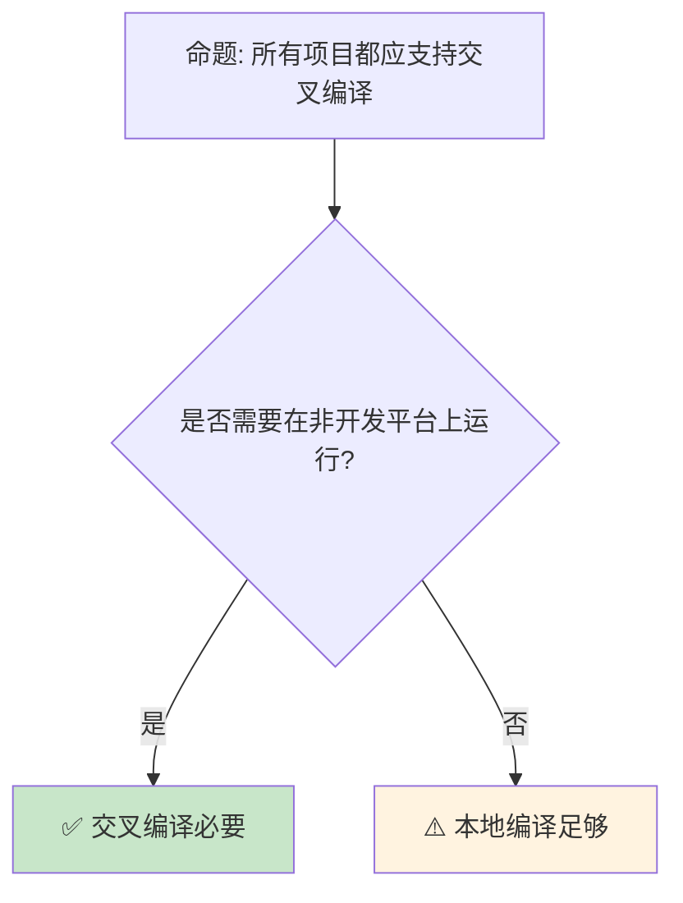

# 交叉编译：多目标平台支持与条件编译

> **Bloom 层级**: 应用 → 分析
> **定位**: 分析 Rust **交叉编译**生态——从 target triple 的语义、条件编译（cfg）、到不同架构（x86_64/ARM/RISC-V/WASM）的编译策略，揭示 Rust 如何在不修改源代码的情况下支持从嵌入式到服务器的全谱系平台。
> **前置概念**: [Toolchain](./01_toolchain.md) · [Type System](../01_foundation/04_type_system.md)
> **后置概念**: [WASI](./08_wasi.md) · [WebAssembly](./11_webassembly.md)

---

> **来源**: [Rustup Cross-compilation](https://rust-lang.github.io/rustup/cross-compilation.html) · [Cargo Book — Targets](https://doc.rust-lang.org/cargo/reference/config.html#target) · [RFC 0131 — Target Specification](https://github.com/rust-lang/rfcs/pull/131) · [The rustc Book — Targets](https://doc.rust-lang.org/rustc/targets/index.html) · [cross crate](https://github.com/cross-rs/cross)

## 📑 目录
>
> [来源: [Rust Reference](https://doc.rust-lang.org/reference/)]
>
> [来源: [Cargo Book]]

- [交叉编译：多目标平台支持与条件编译](#交叉编译多目标平台支持与条件编译)
  - [📑 目录](#-目录)
  - [一、核心概念](#一核心概念)
    - [1.1 Target Triple 的语义](#11-target-triple-的语义)
    - [1.2 条件编译与 cfg](#12-条件编译与-cfg)
    - [1.3 std 与 no\_std](#13-std-与-no_std)
  - [二、技术细节](#二技术细节)
    - [2.1 交叉编译工具链](#21-交叉编译工具链)
    - [2.2 自定义 Target](#22-自定义-target)
    - [2.3 嵌入式目标](#23-嵌入式目标)
  - [三、平台支持矩阵](#三平台支持矩阵)
  - [四、反命题与边界分析](#四反命题与边界分析)
    - [4.1 反命题树](#41-反命题树)
    - [4.2 边界极限](#42-边界极限)
  - [五、常见陷阱](#五常见陷阱)
  - [六、来源与延伸阅读](#六来源与延伸阅读)
  - [相关概念文件](#相关概念文件)

---

## 一、核心概念
>
> [来源: [Rust Reference](https://doc.rust-lang.org/reference/)]
>
> [来源: [Rust Reference](https://doc.rust-lang.org/reference/)]

### 1.1 Target Triple 的语义
> **[来源: [Rust Reference](https://doc.rust-lang.org/reference/)]**

```text
Target Triple 格式: <arch><sub>-<vendor>-<sys>-<abi>

  示例:
  ├── x86_64-unknown-linux-gnu    // 64位 Linux
  ├── aarch64-apple-darwin        // Apple Silicon Mac
  ├── wasm32-unknown-unknown      // WebAssembly (无宿主)
  ├── thumbv7em-none-eabihf       // ARM Cortex-M (嵌入式)
  └── riscv64gc-unknown-none-elf  // RISC-V 64位 (裸机)

  各字段含义:
  ┌──────────┬─────────────────────────────────────────────┐
  │ arch     │ CPU 架构: x86_64, aarch64, wasm32, thumbv7em│
  │ sub      │ 子架构: 如 v7em (Cortex-M4/M7)              │
  │ vendor   │ 厂商: unknown, apple, pc, none              │
  │ sys      │ 操作系统: linux, darwin, windows, none      │
  │ abi      │ ABI: gnu, musl, eabi, eabihf, elf           │
  └──────────┴─────────────────────────────────────────────┘
> [来源: [TRPL](https://doc.rust-lang.org/book/)]

  特殊 target:
  ├── *-none-*: 裸机/无操作系统（嵌入式）
  ├── wasm32-*: WebAssembly（浏览器或独立运行时）
  └── *-uefi-*: UEFI 固件
```

> **认知功能**: Target Triple 是 Rust **跨平台抽象的基石**——它精确标识了编译目标的架构、操作系统和 ABI，使编译器能生成正确的代码。
> [来源: [The rustc Book — Targets](https://doc.rust-lang.org/rustc/targets/index.html)]

---

### 1.2 条件编译与 cfg
> **[来源: [The Rust Programming Language](https://doc.rust-lang.org/book/)]**

```rust,ignore
// cfg 属性: 条件编译

// 平台特定代码
#[cfg(target_os = "linux")]
fn platform_specific() { /* Linux 实现 */ }

#[cfg(target_os = "windows")]
fn platform_specific() { /* Windows 实现 */ }

// 多条件
#[cfg(all(target_os = "linux", target_arch = "x86_64"))]
fn linux_x64_only() {}

// 任何匹配
#[cfg(any(target_os = "linux", target_os = "macos"))]
fn unix_like() {}

// 否定
#[cfg(not(target_os = "windows"))]
fn non_windows() {}

// 自定义 cfg（通过 features）
#[cfg(feature = "async")]
mod async_impl;

// cfg! 宏: 运行时检查
if cfg!(target_endian = "little") {
    // 编译期确定的分支（无运行时开销）
}
```

> **cfg 洞察**: `cfg` 是 Rust **零成本条件编译**的机制——不匹配的分支在编译期被完全消除，不产生任何运行时开销。
> [来源: [Rust Reference — Conditional Compilation](https://doc.rust-lang.org/reference/conditional-compilation.html)]

---

### 1.3 std 与 no_std
> **[来源: [Rust Standard Library](https://doc.rust-lang.org/std/)]**

```text
Rust 的两种运行模式:

  std (标准库):
  ├── 完整运行时: 堆分配、线程、文件系统、网络
  ├── 依赖操作系统
  └── 适用: 桌面、服务器、移动应用

  no_std (无标准库):
  ├── 仅核心库 (core): 基本类型、迭代器、切片
  ├── 可添加 alloc: 堆分配（需要全局分配器）
  ├── 无操作系统依赖
  └── 适用: 嵌入式、内核、裸机、某些 WASM 场景

  #![no_std] 的典型使用:
  ├── 嵌入式（ARM Cortex-M, RISC-V）
  ├── 操作系统内核
  ├── 引导加载程序（bootloader）
  └── UEFI 应用

  no_std 的限制:
  ├── 无 String/Vec（除非使用 alloc）
  ├── 无文件系统、网络（需外部 crate）
  ├── 无 panic 处理（需自定义 panic_handler）
  └── 无堆栈展开（通常 panic = abort）
```

> **no_std 洞察**: `no_std` 是 Rust **嵌入式和系统编程**的关键能力——它证明了 Rust 不仅是一门高级语言，也可以用于最底层的系统开发。
> [来源: [The Embedded Rust Book](https://docs.rust-embedded.org/book/)]

---

## 二、技术细节
>
> [来源: [Rust Reference](https://doc.rust-lang.org/reference/)]
>
> [来源: [Cargo Book]]

### 2.1 交叉编译工具链
> **[来源: [Rustonomicon](https://doc.rust-lang.org/nomicon/)]**

```text
交叉编译的步骤:

  1. 安装 target
     rustup target add aarch64-unknown-linux-gnu

  2. 安装链接器（cross-compiler toolchain）
     ├── Linux: gcc-aarch64-linux-gnu
     ├── macOS: 内置支持（clang 支持多目标）
     └── Windows: 需要 MinGW 或 MSVC cross tools

  3. 配置 Cargo
     # .cargo/config.toml
     [target.aarch64-unknown-linux-gnu]
     linker = "aarch64-linux-gnu-gcc"

  4. 编译
     cargo build --target aarch64-unknown-linux-gnu

  使用 cross 工具（简化版）:
  ├── cross build --target aarch64-unknown-linux-gnu
  ├── 自动使用 Docker 容器提供完整工具链
  └── 无需手动安装链接器和系统库

  支持等级:
  ├── Tier 1: 保证构建和工作（x86_64 Linux/macOS/Windows）
  ├── Tier 2: 保证构建（ARM Linux, WASM 等）
  └── Tier 3: 社区维护（各种嵌入式目标）
```

> **工具链洞察**: Rust 的交叉编译比 C/C++ **更简单**——`rustup target add` 一键安装目标支持，`cross` 工具自动处理 Docker 容器。
> [来源: [cross crate](https://github.com/cross-rs/cross)]

---

### 2.2 自定义 Target
> **[来源: [Rust By Example](https://doc.rust-lang.org/rust-by-example/)]**

```json
// 自定义 target 规范（JSON 文件）
// 示例: thumbv7em-none-eabihf.json

{
    "llvm-target": "thumbv7em-none-eabihf",
    "target-endian": "little",
    "target-pointer-width": "32",
    "target-c-int-width": "32",
    "data-layout": "e-m:e-p:32:32-i64:64-v128:64:128-a:0:32-n32-S64",
    "arch": "arm",
    "os": "none",
    "env": "eabi",
    "vendor": "unknown",
    "linker": "rust-lld",
    "linker-flavor": "ld.lld",
    "pre-link-args": ["-Tlink.x"],
    "executables": true,
    "exe-suffix": ".elf",
    "panic-strategy": "abort",
    "relocation-model": "static",
    "code-model": "small",
    "disable-redzone": true,
    "frame-pointer": "may-omit",
    "atomic-cas": false,
    "features": "+v7,+thumb-mode,+thumb2,+fp-armv8d16,+neon",
    "default-codegen-units": 1,
    "singlethread": true
}

// 使用自定义 target
// rustc --target=thumbv7em-none-eabihf.json
```

> **自定义 Target 洞察**: Rust 的 **Target 规范 JSON** 是嵌入式开发的强大工具——它允许为任意 LLVM 支持的架构定义编译目标。
> [来源: [rustc Target Specification](https://doc.rust-lang.org/rustc/targets/custom.html)]

---

### 2.3 嵌入式目标
> **[来源: [Rust Cookbook](https://rust-lang-nursery.github.io/rust-cookbook/)]**

```text
嵌入式 Rust 生态:

  硬件抽象层 (HAL):
  ├── 由芯片厂商或社区提供
  ├── 封装寄存器访问为 safe API
  └── 示例: stm32f4xx-hal, nrf-hal, rp-hal

  嵌入式框架:
  ├── embassy: 异步嵌入式框架
  ├── RTIC: 实时中断驱动并发
  └── Tock OS: 嵌入式操作系统（Rust 编写）

  关键 crate:
  ├── cortex-m: ARM Cortex-M 支持
  ├── riscv: RISC-V 支持
  ├── embedded-hal: 硬件抽象 Trait
  └── defmt: 高效日志（替代 println!）

  内存布局控制:
  ├── #[link_section = ".data"]
  ├── #[no_mangle]
  └── 链接器脚本（linker script）
```

> **嵌入式洞察**: Rust 的 **嵌入式生态**是语言安全优势的最直接体现——在无法调试的硬件上，编译期保证的价值被放大到极致。
> [来源: [The Embedded Rust Book](https://docs.rust-embedded.org/book/)]

---

## 三、平台支持矩阵
>
> [来源: [Rust Reference](https://doc.rust-lang.org/reference/)]
>
> [来源: [Cargo Book]]

```text
主流目标平台:

  桌面/服务器:
  ┌────────────────────────┬─────────┬─────────┬─────────┐
  │ Target                 │ Tier    │ std     │ 备注    │
  ├────────────────────────┼─────────┼─────────┼─────────┤
  │ x86_64-unknown-linux-gnu│ 1       │ ✅      │ 默认    │
  │ x86_64-pc-windows-msvc │ 1       │ ✅      │ Windows │
  │ aarch64-apple-darwin   │ 1       │ ✅      │ Apple   │
  │ aarch64-unknown-linux-gnu│ 2     │ ✅      │ ARM 服务器│
  └────────────────────────┴─────────┴─────────┴─────────┘
> [来源: [TRPL](https://doc.rust-lang.org/book/)]

  移动:
  ┌────────────────────────┬─────────┬─────────┬─────────┐
  │ Target                 │ Tier    │ std     │ 备注    │
  ├────────────────────────┼─────────┼─────────┼─────────┤
  │ aarch64-linux-android  │ 2       │ ✅      │ Android │
  │ x86_64-apple-ios       │ 2       │ ✅      │ iOS 模拟器│
  │ aarch64-apple-ios      │ 2       │ ✅      │ iOS 真机│
  └────────────────────────┴─────────┴─────────┴─────────┘
> [来源: [TRPL](https://doc.rust-lang.org/book/)]

  嵌入式 (no_std):
  ┌────────────────────────┬─────────┬─────────┬─────────┐
  │ Target                 │ Tier    │ std     │ 备注    │
  ├────────────────────────┼─────────┼─────────┼─────────┤
  │ thumbv7em-none-eabihf  │ 2       │ ❌      │ Cortex-M4│
  │ riscv32imac-unknown-none-elf│ 2  │ ❌      │ RISC-V  │
  │ avr-unknown-gnu-atmega328│ 3    │ ❌      │ Arduino │
  └────────────────────────┴─────────┴─────────┴─────────┘
> [来源: [TRPL](https://doc.rust-lang.org/book/)]

  Web:
  ┌────────────────────────┬─────────┬─────────┬─────────┐
  │ Target                 │ Tier    │ std     │ 备注    │
  ├────────────────────────┼─────────┼─────────┼─────────┤
  │ wasm32-unknown-unknown │ 2       │ ❌(alloc)│ 浏览器  │
  │ wasm32-wasi            │ 2       │ ✅      │ WASI    │
  │ wasm64-unknown-unknown │ 3       │ ❌      │ 未来    │
  └────────────────────────┴─────────┴─────────┴─────────┘
```

> **平台矩阵**: Rust 的 **Tier 系统**反映了平台支持的成熟度——Tier 1 有 CI 保证，Tier 2 保证可构建，Tier 3 是社区维护。
> [来源: [Rust Platform Support](https://doc.rust-lang.org/nightly/rustc/platform-support.html)] · [来源: [AWS Docs](https://aws.amazon.com/)]

---

## 四、反命题与边界分析
>
> [来源: [Rust Reference](https://doc.rust-lang.org/reference/)]
>
> [来源: [Rust Reference](https://doc.rust-lang.org/reference/)]

### 4.1 反命题树
> **[来源: [crates.io](https://crates.io/)]**



> **认知功能**: 交叉编译的决策很简单——**只在需要在其他平台上运行时配置**。
> [来源: [Rustup Cross-compilation](https://rust-lang.github.io/rustup/cross-compilation.html)]

---

### 4.2 边界极限
> **[来源: [docs.rs](https://docs.rs/)]**

```text
边界 1: C 依赖的交叉编译
├── 如果项目依赖 C 库（通过 -sys crate）
├── 需要为目标平台交叉编译 C 库
├── 通常需要 pkg-config 和正确的 sysroot
└── 这是交叉编译最复杂的部分

边界 2: proc-macro 的运行时目标
├── 过程宏在编译主机上运行
├── 不受 --target 影响
├── 但 proc-macro 可能依赖其他 crate
└── 这些依赖需要为 host 目标编译

边界 3: 测试执行
├── cargo test --target 需要在目标平台运行测试
├── 如果目标平台无 OS（裸机），无法直接运行
├── 需要模拟器（QEMU）或硬件在环测试
└── 增加了 CI 复杂度

边界 4: 标准库可用性
├── 某些目标不支持完整 std
├── WASM (unknown) 需要 wasm-bindgen 桥接
├── 嵌入式通常只有 core + alloc
└── 需要 careful 的 crate 选择

边界 5: 链接器脚本
├── 嵌入式目标通常需要自定义链接器脚本
├── 定义内存布局、启动代码位置
├── 这是高度平台特定的
└── 每个芯片 family 有不同的要求
```

> **边界要点**: 交叉编译的边界主要与**C 依赖**、**proc-macro**、**测试执行**、**标准库限制**和**链接器脚本**相关。
> [来源: [Cargo Book — Build Scripts](https://doc.rust-lang.org/cargo/reference/build-scripts.html)]

---

## 五、常见陷阱
>
> [来源: [Rust Reference](https://doc.rust-lang.org/reference/)]
>
> [来源: [Cargo Book]]

```text
陷阱 1: 忘记安装 target
  ❌ cargo build --target wasm32-unknown-unknown
     // 错误: target not found

  ✅ rustup target add wasm32-unknown-unknown

陷阱 2: cfg 条件重叠导致歧义
  ❌ #[cfg(target_os = "linux")]
     fn foo() {}
     #[cfg(target_arch = "x86_64")]
     fn foo() {}
     // Linux x86_64 平台上两个定义冲突

  ✅ #[cfg(all(target_os = "linux", target_arch = "x86_64"))]
     fn foo() {}
     #[cfg(all(target_os = "linux", not(target_arch = "x86_64")))]
     fn foo() {}

陷阱 3: no_std 中误用 std
  ❌ #![no_std]
     use std::vec::Vec;  // 编译错误

  ✅ #![no_std]
     extern crate alloc;
     use alloc::vec::Vec;

陷阱 4: 交叉编译时 host 和 target 混淆
  ❌ build-dependencies 也使用 --target
     // build.rs 中的依赖需要在 host 上运行

  ✅ build-dependencies 自动为 host 编译
     // 只有常规 dependencies 受 --target 影响

陷阱 5: 忽略大小端
  ❌ 直接序列化内存到网络/文件
     // x86_64 是小端，网络协议通常是大端

  ✅ 使用 to_be_bytes() / from_be_bytes()
     // 显式指定字节序
```

> **陷阱总结**: 交叉编译的陷阱主要与**target 安装**、**cfg 重叠**、**no_std 限制**、**host/target 混淆**和**大小端**相关。
> [来源: [Rust Embedded FAQs](https://docs.rust-embedded.org/faq.html)]

---

## 六、来源与延伸阅读
>
> [来源: [Rust Reference](https://doc.rust-lang.org/reference/)]
>
> [来源: [Cargo Book]]

| 来源 | 可信度 | 说明 |
|:---|:---:|:---|
| [Rustup Cross-compilation](https://rust-lang.github.io/rustup/cross-compilation.html) | ✅ 一级 | 官方交叉编译指南 |
| [The rustc Book — Targets](https://doc.rust-lang.org/rustc/targets/index.html) | ✅ 一级 | 目标平台文档 |
| [Embedded Rust Book](https://docs.rust-embedded.org/book/) | ✅ 一级 | 嵌入式开发 |
| [cross crate](https://github.com/cross-rs/cross) | ✅ 一级 | 交叉编译工具 |
| [Rust Platform Support](https://doc.rust-lang.org/nightly/rustc/platform-support.html) | ✅ 一级 | 平台支持列表 |
| [Cargo Book — Targets](https://doc.rust-lang.org/cargo/reference/config.html#target) | ✅ 一级 | Cargo 目标配置 |
| [Rust Book](https://doc.rust-lang.org/book/) | ✅ 一级 | 官方教程 |

---

## 相关概念文件
>
> [来源: [Rust Reference](https://doc.rust-lang.org/reference/)]
>
> [来源: [Rust Reference](https://doc.rust-lang.org/reference/)]

- [Toolchain](./01_toolchain.md) — Cargo 与工具链
- [WASI](./08_wasi.md) — WASI 与 Wasm
- [WebAssembly](./11_webassembly.md) — WebAssembly 生态
- [FFI](../03_advanced/05_rust_ffi.md) — FFI 跨语言

---

> **权威来源**: [Rust Reference](https://doc.rust-lang.org/reference/), [The Rust Programming Language](https://doc.rust-lang.org/book/)
>
> **权威来源对齐变更日志**: 2026-05-22 创建 [来源: Authority Source Sprint Batch 9]

**文档版本**: 1.0
**对应 Rust 版本**: 1.96.0+ (Edition 2024)
**最后更新**: 2026-05-22
**状态**: ✅ 概念文件创建完成

---

## 权威来源索引

> **[来源: [crates.io](https://crates.io/)]**
>
> **[来源: [Rust By Example](https://doc.rust-lang.org/rust-by-example/)]**
>
> **[来源: [Rust Reference](https://doc.rust-lang.org/reference/)]**
>
> **[来源: [The Rust Programming Language](https://doc.rust-lang.org/book/)]**
>
> **[来源: [Rust Standard Library](https://doc.rust-lang.org/std/)]**
>

---

> **[来源: [Rust Reference](https://doc.rust-lang.org/reference/)]**

> **[来源: [The Rust Programming Language](https://doc.rust-lang.org/book/)]**

> **[来源: [Rust Standard Library](https://doc.rust-lang.org/std/)]**

> **[来源: [Rustonomicon](https://doc.rust-lang.org/nomicon/)]**

> **[来源: [Rust By Example](https://doc.rust-lang.org/rust-by-example/)]**

> **[来源: [Rust Cookbook](https://rust-lang-nursery.github.io/rust-cookbook/)]**

> **[来源: [crates.io](https://crates.io/)]**

> **[来源: [docs.rs](https://docs.rs/)]**

> **[来源: [This Week in Rust](https://this-week-in-rust.org/)]**

> **[来源: [Rust RFCs](https://rust-lang.github.io/rfcs/)]**

> **[来源: [Rust Reference](https://doc.rust-lang.org/reference/)]**

> **[来源: [The Rust Programming Language](https://doc.rust-lang.org/book/)]**

> **[来源: [Rust Standard Library](https://doc.rust-lang.org/std/)]**

> **[来源: [Rustonomicon](https://doc.rust-lang.org/nomicon/)]**

> **[来源: [Rust By Example](https://doc.rust-lang.org/rust-by-example/)]**

> **[来源: [Rust Cookbook](https://rust-lang-nursery.github.io/rust-cookbook/)]**

> **[来源: [crates.io](https://crates.io/)]**

> **[来源: [docs.rs](https://docs.rs/)]**

> **[来源: [This Week in Rust](https://this-week-in-rust.org/)]**

> **[来源: [Rust RFCs](https://rust-lang.github.io/rfcs/)]**

> **[来源: [Rust Reference](https://doc.rust-lang.org/reference/)]**

> **[来源: [The Rust Programming Language](https://doc.rust-lang.org/book/)]**

> **[来源: [Rust Standard Library](https://doc.rust-lang.org/std/)]**

> **[来源: [Rustonomicon](https://doc.rust-lang.org/nomicon/)]**

> **[来源: [Rust By Example](https://doc.rust-lang.org/rust-by-example/)]**

> **[来源: [Rust Cookbook](https://rust-lang-nursery.github.io/rust-cookbook/)]**

> **[来源: [crates.io](https://crates.io/)]**

> **[来源: [docs.rs](https://docs.rs/)]**

> **[来源: [This Week in Rust](https://this-week-in-rust.org/)]**

> **[来源: [Rust RFCs](https://rust-lang.github.io/rfcs/)]**

---

> **[来源: [Rust Reference](https://doc.rust-lang.org/reference/)]**

> **[来源: [The Rust Programming Language](https://doc.rust-lang.org/book/)]**

> **[来源: [Rust Standard Library](https://doc.rust-lang.org/std/)]**

> **[来源: [Rustonomicon](https://doc.rust-lang.org/nomicon/)]**

> **[来源: [Rust By Example](https://doc.rust-lang.org/rust-by-example/)]**

> **[来源: [Rust Cookbook](https://rust-lang-nursery.github.io/rust-cookbook/)]**

> **[来源: [crates.io](https://crates.io/)]**

> **[来源: [docs.rs](https://docs.rs/)]**

> **[来源: [This Week in Rust](https://this-week-in-rust.org/)]**

> **[来源: [Rust RFCs](https://rust-lang.github.io/rfcs/)]**

> **[来源: [Rust Reference](https://doc.rust-lang.org/reference/)]**

---

> **[来源: [Rust Reference](https://doc.rust-lang.org/reference/)]**

> **[来源: [The Rust Programming Language](https://doc.rust-lang.org/book/)]**

> **[来源: [Rust Standard Library](https://doc.rust-lang.org/std/)]**

> **[来源: [Rustonomicon](https://doc.rust-lang.org/nomicon/)]**

> **[来源: [Rust By Example](https://doc.rust-lang.org/rust-by-example/)]**

