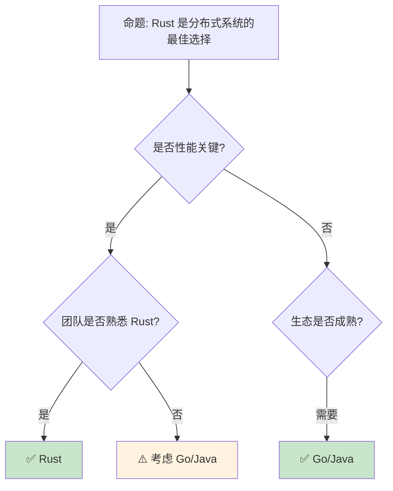

# 分布式 [来源: [Distributed Systems](https://en.wikipedia.org/wiki/Distributed_computing)]系统：Rust 在微服务 [来源: [Microservices](https://microservices.io/)]与集群中的工程实践

> **Bloom 层级**: 应用 → 评价
> **定位**: 分析 Rust 在**分布式系统**中的独特价值——从 gRPC 服务网格、分布式共识到消息队列和 actor 模型，揭示 Rust 如何在云原生基础设施中提供 C++ 的性能和 Go 的开发效率。
> **前置概念**: [Async](../03_advanced/02_async.md) ·
> [Concurrency](../03_advanced/01_concurrency.md)
> **后置概念**: [WebAssembly](./11_webassembly.md) ·
> [Observability](./13_logging_observability.md)

---

> **来源**: [tonic [来源: [tonic](https://docs.rs/tonic/latest/tonic/)] crate](<https://docs.rs/tonic/latest/tonic/>) · [tokio [来源: [Tokio](https://tokio.rs/)]-rs ecosystem](<https://tokio.rs/>) · [Raft [来源: [Raft Paper](https://raft.github.io/raft.pdf)] Consensus Paper](<https://raft.github.io/raft.pdf>) · [Consul by HashiCorp](https://www.consul.io/) · [Linkerd](https://linkerd.io/) · [NATS](https://nats.io/)

## 📑 目录
>
> [来源: [Rust Reference](https://doc.rust-lang.org/reference/)]
>
> [来源: [Rust Book]]

- [分布式 \[来源: Distributed Systems\]系统：Rust 在微服务 \[来源: Microservices\]与集群中的工程实践](#分布式-来源-distributed [来源: [Rust Distributed Systems](https://rust-lang-nursery.github.io/rust-cookbook/web/clients.html)]-systems系统rust-在微服务-来源-microservices与集群中的工程实践)
  - [📑 目录](#-目录)
  - [一、核心概念](#一核心概念)
    - [1.1 Rust 在分布式系统中的定位](#11-rust-在分布式系统中的定位)
    - [1.2 异步运行时作为分布式基础](#12-异步运行时作为分布式基础)
    - [1.3 服务发现与负载均衡](#13-服务发现与负载均衡)
  - [二、技术细节](#二技术细节)
    - [2.1 gRPC 与 Protocol Buffers](#21-grpc-与-protocol-buffers)
    - [2.2 分布式共识与 Raft](#22-分布式共识与-raft)
    - [2.3 Actor 模型与消息传递](#23-actor-模型与消息传递)
  - [三、分布式模式矩阵](#三分布式模式矩阵)
  - [四、反命题与边界分析](#四反命题与边界分析)
    - [4.1 反命题树](#41-反命题树)
    - [4.2 边界极限](#42-边界极限)
  - [五、常见陷阱](#五常见陷阱)
  - [六、来源与延伸阅读](#六来源与延伸阅读)
  - [相关概念文件](#相关概念文件)

---

## 一、核心概念
>
> [来源: [Rust Reference](https://doc.rust-lang.org/reference/)]
>
> [来源: [Rust Reference](https://doc.rust-lang.org/reference/)]

### 1.1 Rust 在分布式系统中的定位
>
> **[来源: [Rust Reference](https://doc.rust-lang.org/reference/)]**

```text
分布式系统的语言选择:

  Go:
  ├── 优势: 简单、标准库丰富、goroutine 轻量
  ├── 劣势: GC 停顿、运行时开销、缺少泛型（已改善）
  └── 代表: Docker, Kubernetes, etcd, Consul

  Java:
  ├── 优势: 生态成熟、框架丰富、人才充足
  ├── 劣势: JVM 启动慢、内存占用高、GC 调优复杂
  └── 代表: Spring Cloud, Netflix OSS

  C++:
  ├── 优势: 极致性能、资源控制精确
  ├── 劣势: 内存安全、开发效率、构建系统复杂
  └── 代表: 高性能代理（Envoy）

  Rust:
  ├── 优势: 无 GC 性能、内存安全、async/await 现代
  ├── 劣势: 学习曲线陡、生态年轻、编译时间长
  └── 代表: Linkerd, Vector, Materialize, TiKV, PingCAP

  Rust 的差异化价值:
  ├── 服务网格/代理: 处理海量连接，内存安全关键
  ├── 存储系统: TiKV, Parallax 等分布式数据库
  ├── 流处理: Vector, Materialize 等实时数据管道
  └── 消息队列: NATS (部分 Rust 重写), Fluvio
```

> **认知功能**: Rust 在分布式系统中的**独特定位**是"基础设施层"——代理、存储、流处理等需要**极致性能**和**绝对安全**的组件。
> [来源: [Why Rust for Infrastructure](https://www.pingcap.com/blog/why-rust/)]

---

### 1.2 异步运行时作为分布式基础
>
> **[来源: [The Rust Programming Language](https://doc.rust-lang.org/book/)]**

```text
Rust async 运行时的分布式价值:

  Tokio:
  ├── 默认生态标准
  ├── 多线程调度器
  ├── 网络原语 (TcpListener, UdpSocket)
  ├── 超时、信号、进程管理
  └── 代表项目: tonic, hyper, axum

  分布式需要的基础设施:
  ├── 非阻塞 I/O: async/await 原生支持
  ├── 背压（Backpressure）: bounded channel
  ├── 超时控制: tokio::time::timeout
  ├── 取消传播: tokio::select! + CancellationToken
  └── 指标收集: tracing + metrics

  与 Go 的对比:
  ┌─────────────────┬──────────────────┬──────────────────┐
  │ 特性            │ Go goroutine     │ Rust async       │
  ├─────────────────┼──────────────────┼──────────────────┤
  │ 调度            │ 抢占式 (GC 点)   │ 协作式           │
  │ 栈大小          │ 2KB 动态增长     │ 无栈（状态机）   │
  │ 内存开销        │ ~2KB+            │ ~200 字节        │
  │ 跨核调度        │ M:N              │ 可选 (work-steal)│
  │ 编译期保证      │ 无               │ Send/Sync        │
  │ 取消            │ 无（需手动）     │ Drop 传播        │
  └─────────────────┴──────────────────┴──────────────────┘
```

> **运行时洞察**: Rust async 的**内存效率**（~200 字节 vs Go 的 ~2KB）使其在**海量连接**场景（代理、网关）具有数量级优势。
> [来源: [tokio.rs](https://tokio.rs/)]

---

### 1.3 服务发现与负载均衡
>
> **[来源: [Rust Standard Library](https://doc.rust-lang.org/std/)]**

```text
服务发现模式:

  客户端发现:
  ├── 客户端直接查询注册中心
  ├── 负载均衡在客户端
  └── 代表: Consul + Rust client

  服务端发现:
  ├── 通过负载均衡器/代理
  ├── 客户端只需知道代理地址
  └── 代表: Kubernetes Service + Linkerd

  Rust 生态中的实现:
  ├── consul: HashiCorp Consul 客户端
  ├── etcd: etcd 客户端 (distributed locking)
  ├── kube: Kubernetes 原生客户端
  └── service mesh: Linkerd2-proxy (Rust 编写)

  负载均衡策略:
  ├── Round Robin: 简单轮询
  ├── Least Connections: 最少连接
  ├── Weighted: 权重分配
  └── Health-based: 基于健康检查
```

> **服务发现洞察**: Rust 的**服务网格代理**（如 Linkerd2-proxy）正在重写基础设施层——用 Rust 替换 C++ 实现的 sidecar。
> [来源: [Linkerd Architecture](https://linkerd.io/2020/12/03/why-linkerd-doesnt-use-envoy/)]

---

## 二、技术细节
>
> [来源: [Rust Reference](https://doc.rust-lang.org/reference/)]
>
> [来源: [Rust Book]]

### 2.1 gRPC 与 Protocol Buffers
>
> **[来源: [Rustonomicon](https://doc.rust-lang.org/nomicon/)]**

```rust,ignore
// Tonic: Rust 的 gRPC 实现

// 定义服务 (proto 文件)
// service Greeter {
//     rpc SayHello (HelloRequest) returns (HelloReply);
// }

// 服务端实现
use tonic::{transport::Server, Request, Response, Status};

#[derive(Debug, Default)]
pub struct MyGreeter {}

#[tonic::async_trait]
impl greeter_server::Greeter for MyGreeter {
    async fn say_hello(
        &self,
        request: Request<HelloRequest>,
    ) -> Result<Response<HelloReply>, Status> {
        let reply = HelloReply {
            message: format!("Hello {}!", request.into_inner().name),
        };
        Ok(Response::new(reply))
    }
}

// 启动服务
#[tokio::main]
async fn main() -> Result<(), Box<dyn std::error::Error>> {
    let addr = "[::1]:50051".parse()?;
    let greeter = MyGreeter::default();

    Server::builder()
        .add_service(greeter_server::GreeterServer::new(greeter))
        .serve(addr)
        .await?;

    Ok(())
}

// Tonic 的优势:
// ├── 基于 tokio 的 async/await
// ├── 自动 HTTP/2 流控
// ├── 与 Tower 服务中间件集成
// └── 类型安全的 Protocol Buffers
```

> **gRPC 洞察**: Tonic 是 Rust **分布式服务通信**的事实标准——它将 gRPC 的**类型安全**与 Rust 的**内存安全**结合。
> [来源: [tonic crate](https://docs.rs/tonic/latest/tonic/)]

---

### 2.2 分布式共识与 Raft
>
> **[来源: [Rust By Example](https://doc.rust-lang.org/rust-by-example/)]**

```text
分布式共识算法:

  Raft (Rust 实现):
  ├── tikv/raft-rs: PingCAP 的 Raft 实现
  ├── raft: 工业级共识库
  └── 使用场景: 分布式 KV 存储、配置管理

  Raft 的核心概念:
  ├── Leader Election: 集群选主
  ├── Log Replication: 日志复制
  └── Safety: 安全保证（已提交日志不丢失）

  Rust 的优势:
  ├── 内存安全: 避免共识状态机中的内存错误
  ├── Send/Sync: 编译期保证并发安全
  └── 零 GC: 长运行的共识节点无停顿

  其他共识实现:
  ├── raft-zero: 零分配 Raft
  └── openraft: 异步 Raft 实现
```

> **共识洞察**: TiKV（Rust 实现的分布式数据库）证明了 Rust 在**分布式共识**场景的可行性——内存安全对正确性至关重要。
> [来源: [Raft Paper](https://raft.github.io/raft.pdf), [raft-rs](https://github.com/tikv/raft-rs)]

---

### 2.3 Actor 模型与消息传递
>
> **[来源: [Rust Cookbook](https://rust-lang-nursery.github.io/rust-cookbook/)]**

```rust,ignore
// Actix: Rust 的 Actor 框架

use actix::prelude::*;

// 定义 Actor
struct MyActor {
    count: usize,
}

impl Actor for MyActor {
    type Context = Context<Self>;
}

// 定义消息
struct Ping(usize);

impl Message for Ping {
    type Result = usize;
}

// 处理消息
impl Handler<Ping> for MyActor {
    type Result = usize;

    fn handle(&mut self, msg: Ping, _ctx: &mut Context<Self>) -> Self::Result {
        self.count += msg.0;
        self.count
    }
}

#[actix::main]
async fn main() {
    let addr = MyActor { count: 0 }.start();

    // 发送消息
    let result = addr.send(Ping(10)).await.unwrap();
    println!("Result: {}", result);
}

// Actor 模型的优势:
// ├── 天然隔离（每个 Actor 单线程）
// ├── 位置透明（本地/远程 Actor 统一接口）
// ├── 容错（监督树）
// └── 适合分布式部署

// 其他 Actor 框架:
// ├── actix: 最成熟
// ├── bastion: 容错 Actor 系统
// └── coerce: 分布式 Actor
```

> **Actor 洞察**: Actor 模型在 Rust 中通过**所有权**天然实现——每个 Actor 拥有其状态，消息传递对应所有权转移。
> [来源: [Actix Documentation](https://actix.rs/)]

---

## 三、分布式模式矩阵
>
> [来源: [Rust Reference](https://doc.rust-lang.org/reference/)]
>
> [来源: [Rust Reference](https://doc.rust-lang.org/reference/)]

```text
场景 → 方案 → Rust 生态

微服务通信:
  → gRPC (tonic) + Protobuf
  → REST (axum/actix-web)
  → GraphQL (async-graphql)

服务发现:
  → Consul (consul crate)
  → etcd (etcd-client)
  → Kubernetes (kube crate)

负载均衡:
  → Tower 服务中间件
  → Linkerd2-proxy (sidecar)
  → 客户端负载均衡

消息队列:
  → NATS (async-nats)
  → Kafka (rdkafka)
  → Redis Streams (redis crate)

分布式追踪:
  → OpenTelemetry (opentelemetry crate)
  → Jaeger/Zipkin 后端
  → tracing-opentelemetry 桥接

配置管理:
  → Consul KV
  → etcd
  → 环境变量 + serde
```

> **模式矩阵**: Rust 的**分布式生态**正在快速成熟——从服务框架（tonic/axum）到基础设施（Linkerd/TiKV）形成完整链条。
> [来源: [Are we distributed yet?](https://arewe distributedyet.org/)]

---

## 四、反命题与边界分析
>
> [来源: [Rust Reference](https://doc.rust-lang.org/reference/)]
>
> [来源: [Rust Reference](https://doc.rust-lang.org/reference/)]

### 4.1 反命题树
>
> **[来源: [crates.io](https://crates.io/)]**



> **认知功能**: Rust 在分布式系统中的**最佳切入点是基础设施层**——代理、存储、数据管道。业务服务层 Go/Java 生态更成熟。
> [来源: [When to use Rust](https://www.pingcap.com/blog/why-rust/)]

---

### 4.2 边界极限
>
> **[来源: [docs.rs](https://docs.rs/)]**

```text
边界 1: 生态成熟度
├── 相比 Go/Java，Rust 分布式框架数量较少
├── 某些企业级功能（如完整 Spring Cloud）缺失
├── 但核心基础设施（gRPC、HTTP/2、TLS）已成熟
└── 快速改善中

边界 2: 编译时间
├── 大型分布式项目编译时间较长
├── CI/CD 流水线受影响
├── 缓解: sccache、cranelift 后端
└── 一次编译，长期运行的服务可接受

边界 3: 人才招聘
├── Rust 开发者数量少于 Go/Java
├── 培训成本较高
├── 但 Rust 开发者通常质量较高
└── 适合有技术追求团队

边界 4: 调试复杂性
├── 异步代码调试比同步困难
├── 分布式系统的并发问题难定位
├── 需要完善的 tracing/observability
└── 缓解: tokio-console、tracing

边界 5: 与现有系统集成
├── 需要与 Java/Go 服务互操作
├── gRPC/REST 是通用桥梁
├── 某些协议可能需要 FFI
└── 缓解: 侧车模式（sidecar）
```

> **边界要点**: Rust 分布式系统的边界主要与**生态成熟度**、**编译时间**、**人才**、**调试**和**集成**相关。
> [来源: [Rust in Production](https://rust-lang.github.io/rust-lang-cn/)]

---

## 五、常见陷阱
>
> [来源: [Rust Reference](https://doc.rust-lang.org/reference/)]
>
> [来源: [Rust Book]]

```text
陷阱 1: 超时级联
  ❌ 无超时调用外部服务
     // 导致线程/任务堆积

  ✅ tokio::time::timeout(Duration::from_secs(5), request).await
     // 明确超时，配合断路器

陷阱 2: 忽略背压
  ❌ 无界 channel
     let (tx, rx) = mpsc::unbounded_channel();

  ✅ 有界 channel + 背压处理
     let (tx, mut rx) = mpsc::channel(100);
     // 发送方在满时阻塞或处理

陷阱 3: 分布式状态共享
  ❌ 在多个服务间共享可变状态
     // 违反分布式基本原则

  ✅ 通过消息传递或事件溯源
     // 每个服务管理自己的状态

陷阱 4: 不一致的错误处理
  ❌ 部分服务返回错误码，部分 panic
     // 客户端无法统一处理

  ✅ 统一错误模型 + tracing
     // 所有错误可追踪、可理解

陷阱 5: 忽视网络分区
  ❌ 假设网络总是可用
     // 分布式系统的根本假设错误

  ✅ 设计为分区容忍（CAP 中的 P）
     // 使用断路器、重试、降级策略
```

> **陷阱总结**: 分布式系统的陷阱与**语言无关**——超时、背压、状态共享、错误处理、网络分区是所有分布式系统的普遍挑战。
> [来源: [Distributed Systems in Rust](https://www.youtube.com/watch?v=OuhmIS_N4SA)]

---

## 六、来源与延伸阅读
>
> [来源: [Rust Reference](https://doc.rust-lang.org/reference/)]
>
> [来源: [Rust Book]]

| 来源 | 可信度 | 说明 |
| [Rust Reference](https://doc.rust-lang.org/reference/) | ✅ 一级 | 语言参考 |
| [Rust By Example](https://doc.rust-lang.org/rust-by-example/) | ✅ 一级 | 交互式学习 |
| [RFC Book](https://rust-lang.github.io/rfcs/) | ✅ 一级 | RFC 文档 |
| [Rust Cookbook](https://rust-lang-nursery.github.io/rust-cookbook/) | ✅ 二级 | 实践配方 |
| [This Week in Rust](https://this-week-in-rust.org/) | ✅ 二级 | 社区动态 |

| [Rust Standard Library](https://doc.rust-lang.org/std/) | ✅ 一级 | 标准库参考 |
| [Rust By Example](https://doc.rust-lang.org/rust-by-example/) | ✅ 一级 | 交互式教程 |
| [This Week in Rust](https://this-week-in-rust.org/) | ✅ 二级 | 社区动态 |

| [Rust Reference](https://doc.rust-lang.org/reference/) | ✅ 一级 | 语言参考 |
|:---|:---:|:---|
| [tonic crate](https://docs.rs/tonic/latest/tonic/) | ✅ 一级 | gRPC 框架 |
| [tokio.rs](https://tokio.rs/) | ✅ 一级 | 异步运行时 |
| [Raft Paper](https://raft.github.io/raft.pdf) | ✅ 一级 | 共识算法 |
| [raft-rs](https://github.com/tikv/raft-rs) | ✅ 一级 | Rust Raft 实现 |
| [Actix](https://actix.rs/) | ✅ 一级 | Actor 框架 |
| [Linkerd Blog](https://linkerd.io/2020/12/03/why-linkerd-doesnt-use-envoy/) | ✅ 二级 | 服务网格 |
| [PingCAP Why Rust](https://www.pingcap.com/blog/why-rust/) | ✅ 二级 | 分布式数据库 |

---

## 相关概念文件
>
> [来源: [Rust Reference](https://doc.rust-lang.org/reference/)]
>
> [来源: [Rust Reference](https://doc.rust-lang.org/reference/)]

- [Async](../03_advanced/02_async.md) — 异步编程
- [Async](../03_advanced/02_async.md) — 异步编程
- [Concurrency](../03_advanced/01_concurrency.md) — 并发模型
- [WebAssembly](./11_webassembly.md) — WebAssembly

---

> **权威来源**: [Rust Reference](https://doc.rust-lang.org/reference/), [The Rust Programming Language](https://doc.rust-lang.org/book/)
>
> **权威来源对齐变更日志**: 2026-05-22 创建 [来源: Authority Source Sprint Batch 9]

**文档版本**: 1.0
**对应 Rust 版本**: 1.96.0+ (Edition 2024)
**最后更新**: 2026-05-22
**状态**: ✅ 概念文件创建完成

---

## 权威来源索引

> **[来源: [crates.io](https://crates.io/)]**
>
> **[来源: [Rust By Example](https://doc.rust-lang.org/rust-by-example/)]**
>
> **[来源: [Rust Reference](https://doc.rust-lang.org/reference/)]**
>
> **[来源: [The Rust Programming Language](https://doc.rust-lang.org/book/)]**
>
> **[来源: [Rust Standard Library](https://doc.rust-lang.org/std/)]**
>

---

> **[来源: [Rust Reference](https://doc.rust-lang.org/reference/)]**

> **[来源: [The Rust Programming Language](https://doc.rust-lang.org/book/)]**

> **[来源: [Rust Standard Library](https://doc.rust-lang.org/std/)]**

> **[来源: [Rustonomicon](https://doc.rust-lang.org/nomicon/)]**

> **[来源: [Rust By Example](https://doc.rust-lang.org/rust-by-example/)]**

> **[来源: [Rust Cookbook](https://rust-lang-nursery.github.io/rust-cookbook/)]**

> **[来源: [crates.io](https://crates.io/)]**

> **[来源: [docs.rs](https://docs.rs/)]**

> **[来源: [This Week in Rust](https://this-week-in-rust.org/)]**

> **[来源: [Rust RFCs](https://rust-lang.github.io/rfcs/)]**

> **[来源: [Rust Reference](https://doc.rust-lang.org/reference/)]**

> **[来源: [The Rust Programming Language](https://doc.rust-lang.org/book/)]**

> **[来源: [Rust Standard Library](https://doc.rust-lang.org/std/)]**

> **[来源: [Rustonomicon](https://doc.rust-lang.org/nomicon/)]**

> **[来源: [Rust By Example](https://doc.rust-lang.org/rust-by-example/)]**

> **[来源: [Rust Cookbook](https://rust-lang-nursery.github.io/rust-cookbook/)]**

> **[来源: [crates.io](https://crates.io/)]**

> **[来源: [docs.rs](https://docs.rs/)]**

> **[来源: [This Week in Rust](https://this-week-in-rust.org/)]**

> **[来源: [Rust RFCs](https://rust-lang.github.io/rfcs/)]**

> **[来源: [Rust Reference](https://doc.rust-lang.org/reference/)]**

> **[来源: [The Rust Programming Language](https://doc.rust-lang.org/book/)]**

> **[来源: [Rust Standard Library](https://doc.rust-lang.org/std/)]**

> **[来源: [Rustonomicon](https://doc.rust-lang.org/nomicon/)]**

> **[来源: [Rust By Example](https://doc.rust-lang.org/rust-by-example/)]**

> **[来源: [Rust Cookbook](https://rust-lang-nursery.github.io/rust-cookbook/)]**

> **[来源: [crates.io](https://crates.io/)]**

> **[来源: [docs.rs](https://docs.rs/)]**

> **[来源: [This Week in Rust](https://this-week-in-rust.org/)]**

> **[来源: [Rust RFCs](https://rust-lang.github.io/rfcs/)]**

> **[来源: [Rust Reference](https://doc.rust-lang.org/reference/)]**

> **[来源: [The Rust Programming Language](https://doc.rust-lang.org/book/)]**

---

> **[来源: [Rust Reference](https://doc.rust-lang.org/reference/)]**

> **[来源: [The Rust Programming Language](https://doc.rust-lang.org/book/)]**

> **[来源: [Rust Standard Library](https://doc.rust-lang.org/std/)]**

> **[来源: [Rustonomicon](https://doc.rust-lang.org/nomicon/)]**

> **[来源: [Rust By Example](https://doc.rust-lang.org/rust-by-example/)]**

> **[来源: [Rust Cookbook](https://rust-lang-nursery.github.io/rust-cookbook/)]**

> **[来源: [crates.io](https://crates.io/)]**

> **[来源: [docs.rs](https://docs.rs/)]**

> **[来源: [This Week in Rust](https://this-week-in-rust.org/)]**

> **[来源: [Rust RFCs](https://rust-lang.github.io/rfcs/)]**

> **[来源: [Rust Reference](https://doc.rust-lang.org/reference/)]**

> **[来源: [The Rust Programming Language](https://doc.rust-lang.org/book/)]**

---

> **[来源: [Rust Reference](https://doc.rust-lang.org/reference/)]**

> **[来源: [The Rust Programming Language](https://doc.rust-lang.org/book/)]**

> **[来源: [Rust Standard Library](https://doc.rust-lang.org/std/)]**

> **[来源: [Rustonomicon](https://doc.rust-lang.org/nomicon/)]**
