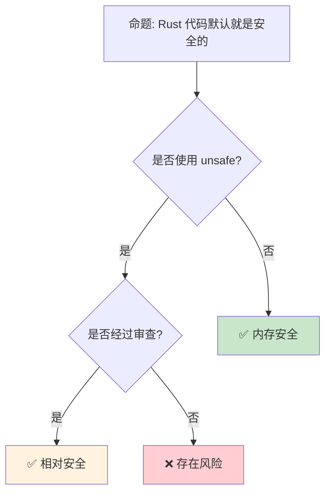

> **内容分级**: [专家级]

> **代码状态**: ✅ 含可编译示例

>
> **定理链**: N/A — 描述性/综述性/导航性文档，不涉及形式化定理链
>
# 安全 实践：Rust 代码的防御性编程
>
> **EN**: Security Practices
> **Summary**: Security Practices. Core Rust concept covering practical examples, memory safety and UB prevention, testing and verification.
> **受众**: [进阶]
> **Bloom 层级**: 应用 → 评价
> **A/S/P 标记**: **S+P** — StructureProcedure
> **双维定位**: P×Eva — 评估安全实践和审计策略
> **定位**: 系统讲解 Rust **安全编程实践**——从输入验证、加密使用、到审计和供应链安全，揭示如何在 Rust 的内存安全基础上构建全面的安全防御体系。
> **前置概念**: [Unsafe](../03_advanced/03_unsafe.md) · [Type System](../01_foundation/04_type_system.md) · [Error Handling](../02_intermediate/15_error_handling_deep_dive.md)
> **后置概念**: [Blockchain](./06_blockchain.md) · [Formal Methods](../04_formal/04_rustbelt.md)

---

> **来源**: [Rust Secure Code Guidelines](https://anssi-fr.github.io/rust-guide/) ·
> [OWASP Rust Security](https://owasp.org/www-project-devsecops-guideline/latest/02a-Static-Application-Security-Testing) ·
> [cargo-audit [来源: [cargo-audit](https://github.com/RustSec/rustsec/tree/main/cargo-audit)]](<https://github.com/RustSec/rustsec/tree/main/cargo-audit>) ·
> [Rust CVEs](https://cve.mitre.org/cgi-bin/cvekey.cgi?keyword=rust) ·
> [ANSSI Rust Guidelines](https://www.ssi.gouv.fr/en/guide/rust-secure-development-guide/) ·
> [Wikipedia — Defense in Depth](https://en.wikipedia.org/wiki/Defense_in_depth_(computing))
> **前置依赖**: [Type Theory](../04_formal/02_type_theory.md)
> **前置依赖**: [Rust vs C++](../05_comparative/01_rust_vs_cpp.md)

## 📑 目录

- [安全 实践：Rust 代码的防御性编程](#安全-实践rust-代码的防御性编程)
  - [📑 目录](#-目录)
  - [一、核心概念](#一核心概念)
    - [1.1 Rust 的安全基础](#11-rust-的安全基础)
    - [1.2 不安全边界的管理](#12-不安全边界的管理)
    - [1.3 供应链安全](#13-供应链安全)
  - [二、技术细节](#二技术细节)
    - [2.1 输入验证与清洗](#21-输入验证与清洗)
    - [2.2 加密与安全原语](#22-加密与安全原语)
    - [2.3 审计工具链](#23-审计工具链)
  - [三、安全模式矩阵](#三安全模式矩阵)
  - [四、反命题与边界分析](#四反命题与边界分析)
    - [4.1 反命题树](#41-反命题树)
    - [4.2 边界极限](#42-边界极限)
  - [五、常见陷阱](#五常见陷阱)
  - [六、供应链安全与 CVE 跟踪](#六供应链安全与-cve-跟踪)
    - [6.1 Cargo CVE-2026-33055 / CVE-2026-33056（2026-03-26，1.94.1 已修复）](#61-cargo-cve-2026-33055--cve-2026-330562026-03-261941-已修复)
    - [6.2 Cargo CVE-2026-5222 / CVE-2026-5223（2026-05-25）](#62-cargo-cve-2026-5222--cve-2026-52232026-05-25)
    - [6.3 crates.io 恶意 crate 与通知政策变更（2026-02-13 起）](#63-cratesio-恶意-crate-与通知政策变更2026-02-13-起)
    - [6.4 跨生态系统供应链攻击：TrapDoor（2026-05）](#64-跨生态系统供应链攻击trapdoor2026-05)
    - [6.5 已知传递依赖安全状态（本项目）](#65-已知传递依赖安全状态本项目)
  - [七、来源与延伸阅读](#七来源与延伸阅读)
  - [相关概念文件](#相关概念文件)
  - [权威来源索引](#权威来源索引)
  - [十、边界测试：安全实践的编译错误](#十边界测试安全实践的编译错误)
    - [10.1 边界测试：密码学常量时间操作（运行时风险）](#101-边界测试密码学常量时间操作运行时风险)
    - [10.2 边界测试：`unsafe` 代码的审计边界（编译错误）](#102-边界测试unsafe-代码的审计边界编译错误)
    - [10.3 边界测试：`zeroize` 与编译器优化的冲突（逻辑错误）](#103-边界测试zeroize-与编译器优化的冲突逻辑错误)
    - [10.4 边界测试：依赖供应链的 typo-squatting（运行时安全风险）](#104-边界测试依赖供应链的-typo-squatting运行时安全风险)
    - [10.7 边界测试：secret 在内存中的残留与 `zeroize`（运行时信息泄露）](#107-边界测试secret-在内存中的残留与-zeroize运行时信息泄露)
    - [10.3 边界测试：secret 在日志中的意外泄露（运行时信息泄露）](#103-边界测试secret-在日志中的意外泄露运行时信息泄露)
    - [补充定理链](#补充定理链)
  - [嵌入式测验（Embedded Quiz）](#嵌入式测验embedded-quiz)
    - [测验 1：`cargo audit` 工具的主要功能是什么？（理解层）](#测验-1cargo-audit-工具的主要功能是什么理解层)
    - [测验 2：为什么在 Rust 中处理密码时，建议使用 `secrecy` crate 而非普通 `String`？（理解层）](#测验-2为什么在-rust-中处理密码时建议使用-secrecy-crate-而非普通-string理解层)
    - [测验 3：Rust 的所有权系统如何帮助防御缓冲区溢出攻击？（理解层）](#测验-3rust-的所有权系统如何帮助防御缓冲区溢出攻击理解层)
    - [测验 4：`#[forbid(unsafe_code)]` 属性有什么作用？（理解层）](#测验-4forbidunsafe_code-属性有什么作用理解层)
    - [测验 5：在 Rust Web 应用中，如何防御 SQL 注入攻击？（理解层）](#测验-5在-rust-web-应用中如何防御-sql-注入攻击理解层)
  - [认知路径](#认知路径)
    - [核心推理链](#核心推理链)
    - [反命题与边界](#反命题与边界)

---

## 一、核心概念
>
>

### 1.1 Rust 的安全基础
>

```text
Rust 提供的安全保证:

  内存安全:
  ├── 无 dangling pointers
  ├── 无 use-after-free
  ├── 无 double-free
  ├── 无缓冲区溢出（ safe Rust）
  └── 无数据竞争（编译期检测）

  类型安全:
  ├── 无空指针解引用（Option<T>）
  ├── 无未初始化变量
  ├── 穷尽模式匹配
  └── 生命周期检查

  但 Rust 不是银弹:
  ├── 逻辑错误仍存在
  ├── 侧信道攻击不受保护
  ├── 并发死锁仍可能发生
  ├── unsafe 代码可能引入漏洞
  └── 供应链攻击（恶意依赖）

```

**可编译示例** — 输入验证与密码强度检查：

```rust
/// 验证并清理用户输入（防御注入攻击）
fn sanitize_input(input: &str) -> Result<String, &'static str> {
    const MAX_LEN: usize = 1024;

    if input.is_empty() {
        return Err("Input cannot be empty");
    }
    if input.len() > MAX_LEN {
        return Err("Input exceeds maximum length");
    }
    // 拒绝控制字符（防御终端转义序列注入）
    if input.chars().any(|c| c.is_control() && c != '\n' && c != '\t') {
        return Err("Input contains invalid control characters");
    }

    Ok(input.trim().to_string())
}

/// 密码强度检查（纯逻辑，非密码学）
fn check_password_strength(password: &str) -> Result<(), &'static str> {
    if password.len() < 12 {
        return Err("Password must be at least 12 characters");
    }
    let has_upper = password.chars().any(|c| c.is_uppercase());
    let has_lower = password.chars().any(|c| c.is_lowercase());
    let has_digit = password.chars().any(|c| c.is_ascii_digit());
    let has_special = password.chars().any(|c| !c.is_alphanumeric());

    if !(has_upper && has_lower && has_digit && has_special) {
        return Err("Password must contain uppercase, lowercase, digit, and special character");
    }
    Ok(())
}
```

```text
  安全层次:
  ┌─────────────────────────────────────────┐
  │  逻辑安全（应用层验证）                  │
  ├─────────────────────────────────────────┤
  │  并发安全（Send/Sync, Mutex, 无数据竞争）│
  ├─────────────────────────────────────────┤
  │  类型安全（Option, Result, 穷尽匹配）    │
  ├─────────────────────────────────────────┤
  │  内存安全（所有权、借用、生命周期）      │
  └─────────────────────────────────────────┘
```

> **认知功能**: Rust 消除了**一整类安全漏洞**（内存安全），但**逻辑安全**仍需开发者负责。
> [来源: [Rust Secure Development Guide](https://anssi-fr.github.io/rust-guide/)]

---

### 1.2 不安全边界的管理
>

```text
unsafe 代码的安全策略:

  最小化原则:
  ├── unsafe 代码量最小化
  ├── 用 safe 包装层隔离
  └── 文档化所有安全假设

  安全契约文档:
  /// # Safety [来源: [Rust Secure Code Guidelines](https://rust-secure-code.github.io/)]
  /// Caller must ensure:
  /// - pointer is non-null and properly aligned
  /// - pointer points to valid memory of at least `len` bytes
  /// - no other references to the same memory exist
  unsafe fn process_raw(ptr: *mut u8, len: usize) { ... }

  审查策略:
  ├── 所有 unsafe 代码必须经过审查
  ├── 使用 miri 动态检测
  ├── 使用 sanitizer（ASan, MSan, TSan）
  └── 代码覆盖率要求

  统计:
  ├── Rust 标准库: ~1% unsafe 代码
  ├── 优秀 crate: <5% unsafe
  └── 某些领域（crypto, OS）不可避免更多
```

> **unsafe 洞察**: **unsafe 不是"坏"的**——它是 Rust **必要的逃逸舱**，关键是**隔离、文档和审查**。
> [来源: [Rust Secure Code Guidelines](https://anssi-fr.github.io/rust-guide/05_unchecked.html)]

---

### 1.3 供应链安全
>

```text
Rust 供应链风险:

  依赖攻击面:
  ├── 平均 Rust 项目依赖 100+ crates
  ├── 传递依赖可能包含恶意代码
  ├──  typo-squatting（名称相似攻击）
  └── 废弃/未维护依赖的漏洞

  防护工具:
  ├── cargo-audit: 扫描已知漏洞（RustSec 数据库）
  ├── cargo-deny: 策略执行（许可证、漏洞、来源）
  ├── cargo-vet: 供应链审计
  ├── Sigstore: 签名验证
  └── 私有 registry（企业隔离）

  最佳实践:
  ├── 定期运行 cargo audit [来源: [cargo-audit](https://docs.rs/cargo-audit/latest/cargo_audit/)]
  ├── 最小化依赖数量
  ├── 审查关键依赖的 unsafe 代码
  ├── 锁定 Cargo.lock
  └── 使用 cargo-deny 限制外部来源

  cargo-audit 使用:
  $ cargo audit
  ├── 扫描 Cargo.lock
  ├── 对比 RustSec Advisory DB
  └── 报告 CVE 和严重程度
```

> **供应链洞察**: **cargo-audit** 是 Rust 生态的**安全网**——它将已知漏洞的检测集成到开发工作流中。
> [来源: [RustSec](https://rustsec.org/)]

---

## 二、技术细节

### 2.1 输入验证与清洗
>

```rust,ignore
// 输入验证模式

// 1. 解析而非验证（Parse, Don't Validate）
pub struct Email(String);

impl Email {
    pub fn new(s: &str) -> Result<Self, InvalidEmail> {
        if s.contains('@') && s.len() < 254 {
            Ok(Email(s.to_string()))
        } else {
            Err(InvalidEmail)
        }
    }
}

// 2. 边界检查
pub fn process_buffer(data: &[u8], offset: usize, len: usize) -> Result<&[u8], Error> {
    let end = offset.checked_add(len).ok_or(Error::Overflow)?;
    if end > data.len() {
        return Err(Error::OutOfBounds);
    }
    Ok(&data[offset..end])
}

// 3. 拒绝服务防护
use std::time::Duration;

pub fn process_with_timeout<F, T>(f: F, timeout: Duration) -> Result<T, TimeoutError>
where F: FnOnce() -> T
{
    std::thread::spawn(f)
        .join_timeout(timeout)
        .map_err(|_| TimeoutError)?
}

// 4. 反序列化安全
use serde::Deserialize;

#[derive(Deserialize)]
struct Config {
    #[serde(deserialize_with = "validate_port")]
    port: u16,
    max_connections: usize,
}

fn validate_port<'de, D>(deserializer: D) -> Result<u16, D::Error>
where D: serde::Deserializer<'de>
{
    let port: u16 = Deserialize::deserialize(deserializer)?;
    if port >= 1024 || port == 0 {
        Ok(port)
    } else {
        Err(serde::de::Error::custom("reserved port"))
    }
}
```

> **验证洞察**: **"解析而非验证"**是 Rust 安全的核心模式——通过类型系统使非法状态不可表示。
> [来源: [Parse Don't Validate](https://lexi-lambda.github.io/blog/2019/11/05/parse-don-t-validate/)]

---

### 2.2 加密与安全原语
>

```text
Rust 密码学生态:

  核心 crate:
  ├── ring: 安全原语（TLS, 签名, 哈希）
  ├── rustls: 纯 Rust TLS 实现
  ├── aes-gcm: 认证加密
  ├── sha2: 哈希函数
  ├── ed25519: 数字签名
  └── rand: 密码学安全随机数

  安全原则:
  ├── 不实现自己的加密算法
  ├── 使用经过审计的库
  ├── 遵循密码学最佳实践
  └── 密钥管理（环境变量、KMS、HSM）

  示例（加密）:
  use aes_gcm::{Aes256Gcm, Key, Nonce};
  use aes_gcm::aead::{Aead, NewAead};

  let key = Key::from_slice(b"an example very very secret key.");
  let cipher = Aes256Gcm::new(key);
  let nonce = Nonce::from_slice(b"unique nonce");

  let ciphertext = cipher.encrypt(nonce, b"plaintext".as_ref())?;
  let plaintext = cipher.decrypt(nonce, ciphertext.as_ref())?;

  随机数生成:
  use rand::RngCore;
  use rand::rngs::OsRng;

  let mut key = [0u8; 32];
  OsRng.fill_bytes(&mut key);  // 密码学安全
```

> **加密洞察**: Rust 的**类型系统**防止了密码学中常见的**类型混淆错误**（如密钥和密文的混淆）。
> [来源: [ring crate](https://docs.rs/ring/latest/ring/)]

---

### 2.3 审计工具链
>

```text
Rust 安全审计工具:

  静态分析:
  ├── cargo-audit: 已知漏洞扫描
  ├── cargo-deny: 依赖策略执行
  ├── cargo-geiger: unsafe 代码计数
  ├── clippy: lint（含安全相关）
  └── semgrep: 自定义规则扫描

  动态分析:
  ├── Miri [来源: [Miri](https://github.com/rust-lang/miri)]: 检测未定义行为
  ├── AddressSanitizer (ASan): 内存错误
  ├── ThreadSanitizer (TSan): 数据竞争
  ├── MemorySanitizer (MSan): 未初始化内存
  └── fuzzing (cargo-fuzz, afl.rs)

  使用示例:
  # 漏洞审计
  $ cargo audit

  # 查看 unsafe 统计
  $ cargo geiger

  # Miri 检测
  $ cargo miri test

  # Fuzzing
  $ cargo fuzz run target_name

  持续集成:
  ├── 将 cargo audit 加入 CI
  ├── 设置漏洞告警阈值
  └── 定期 Miri 检测
```

> **审计洞察**: Rust 的**工具链生态**使安全审计可以**自动化**——从依赖漏洞到运行时未定义行为，覆盖完整攻击面。
> [来源: [cargo-geiger](https://github.com/rust-secure-code/cargo-geiger)]

---

## 三、安全模式矩阵

```text
场景 → 方案 → 工具

依赖漏洞:
  → cargo audit + CI 集成
  → cargo deny 限制来源
  → 定期更新策略

Unsafe 代码审查:
  → cargo geiger 统计
  → 代码审查清单
  → Miri 动态验证

输入验证:
  → Newtype 模式
  → Parse, Don't Validate
  → 边界检查 + 溢出防护

加密:
  → ring / rustls（不自己实现）
  → 密码学安全随机数
  → 密钥管理最佳实践

并发安全:
  → Send/Sync 编译期检查
  → Mutex/RwLock 保护
  → deadlock 检测（运行时）

Secrets 管理:
  → 环境变量 / 密钥管理服务
  → 零拷贝（zeroize crate）
  → 不在日志中打印
```

> **模式矩阵**: Rust 安全是**分层防御**——编译期保证 + 运行时验证 + 审计工具 + 开发实践。
> [来源: [Rust Secure Code Guidelines](https://anssi-fr.github.io/rust-guide/04_language.html)]

---

## 四、反命题与边界分析

### 4.1 反命题树
>



> **认知功能**: **Safe Rust 默认内存安全**，但**逻辑安全、供应链安全和 unsafe 代码**仍需主动管理。
> [来源: [Rust Security Policy](https://www.rust-lang.org/policies/security)]

---

### 4.2 边界极限
>

```text
边界 1: 侧信道攻击
├── Rust 不防护时序攻击
├── 密码学实现需额外防护
├── 常量时间算法需要特殊处理
└── 缓解: subtle crate

边界 2: 逻辑漏洞
├── SQL 注入（即使使用参数化查询仍有风险）
├── 业务逻辑缺陷
├── 授权/认证错误
└── 缓解: 安全编码实践、审计

边界 3: 供应链深度
├── 传递依赖难以完全审计
├── 恶意依赖可能潜伏多年
├── 名称相似攻击
└── 缓解: cargo-vet、最小化依赖

边界 4: unsafe 的传染性
├── safe API 可能依赖 unsafe 实现
├── 底层漏洞影响上层
├── 完全避免 unsafe 不现实
└── 缓解: 隔离、审查、Miri

边界 5: 形式化验证的局限
├── Kani 等工具有限的验证能力
├── 复杂属性难以形式化
├── 验证成本高
└── 缓解: 关键路径形式化、其余测试覆盖
```

> **边界要点**: Rust 安全的边界主要与**侧信道**、**逻辑漏洞**、**供应链**、**unsafe 传染**和**验证局限**相关。
> [来源: [ANSSI Rust Guide](https://www.ssi.gouv.fr/en/guide/rust-secure-development-guide/)]

---

## 五、常见陷阱

```text
陷阱 1: 假设 safe Rust 完全安全
  ❌ 不验证用户输入
     // safe Rust 仍有逻辑漏洞

  ✅ 始终验证外部输入
     // 内存安全 ≠ 逻辑安全

陷阱 2: unsafe 代码无文档
  ❌ unsafe { *ptr = value; }
     // 无安全契约说明

  ✅ /// # Safety\n/// ptr must be valid and aligned
     unsafe { *ptr = value; }

陷阱 3: 使用过时的加密
  ❌ 使用 md5, sha1
     // 已破解

  ✅ 使用 sha2-256, sha3, blake3
     // 当前推荐的算法

陷阱 4: 日志泄露敏感信息
  ❌ log::info!("User password: {}", password);
     // 密码进入日志！

  ✅ log::info!("User login: {}", username);
     // 从不记录 secrets

陷阱 5: 忽略 cargo audit 警告
  ❌ 已知漏洞未修复
     // "只是 dev dependency"

  ✅ 所有依赖都需审计
     // dev dependency 也可能被攻击
```

> **陷阱总结**: 安全陷阱主要与**过度信任 safe Rust**、**unsafe 文档缺失**、**过时加密**、**日志泄露**和**依赖管理**相关。
> [来源: [OWASP Top 10](https://owasp.org/www-project-top-ten/)]

---

## 六、供应链安全与 CVE 跟踪
>
> **[来源: [Rust Security Response Team](https://www.rust-lang.org/policies/security)]** ·
> **[来源: [RustSec Advisory DB](https://rustsec.org/)]**

### 6.1 Cargo CVE-2026-33055 / CVE-2026-33056（2026-03-26，1.94.1 已修复）

**影响范围**: Cargo tar 提取（第三方 registry）

| CVE | 严重程度 | 攻击向量 | 修复版本 |
|:---:|:---:|:---|:---:|
| **CVE-2026-33055** | Medium | Cargo tar crate 提取漏洞 | Rust 1.94.1 |
| **CVE-2026-33056** | Medium | 同上，相关变种 | Rust 1.94.1 |

**关键说明**:

- crates.io 用户不受影响
- Rust 1.94.1 将内部 `tar` 依赖更新至 0.4.45 修复此问题

**参考**: [Rust 1.94.1 Release Notes](https://github.com/rust-lang/rust/releases/tag/1.94.1)

### 6.2 Cargo CVE-2026-5222 / CVE-2026-5223（2026-05-25）

**影响范围**: 所有 Rust < 1.96.0 的 Cargo 版本

| CVE | 严重程度 | 攻击向量 | 修复版本 |
|:---:|:---:|:---|:---:|
| **CVE-2026-5222** | Low | 第三方 registry URL 规范化错误：攻击者可通过 `.git` 后缀混淆窃取同一域名下其他 registry 的凭据 | Rust 1.96.0 |
| **CVE-2026-5223** | Medium | 第三方 registry tarball 中的 symlink 可覆盖同 registry 下其他 crate 的缓存 | Rust 1.96.0 |

**关键说明**:

- **crates.io 用户不受影响**：crates.io 已禁止上传含 symlink 的 crate
- **第三方 registry 用户需升级**：1.96.0 的 Cargo 已拒绝提取 tarball 中的任何 symlink
- **无法立即升级的用户**：审计 `~/.cargo/registry/cache/` 中的 symlink，联系 registry 管理员禁用 symlink 上传

**参考**:

- [CVE-2026-5222 公告](https://blog.rust-lang.org/2026/05/25/cve-2026-5222/)
- [CVE-2026-5223 公告](https://blog.rust-lang.org/2026/05/25/cve-2026-5223/)

### 6.3 crates.io 恶意 crate 与通知政策变更（2026-02-13 起）

**政策变更**:
crates.io 团队于 2026-02-13 宣布[更新恶意 crate 通知政策](https://blog.rust-lang.org/2026/02/13/crates-io-malicious-crate-notification-policy.html)——**不再为每个恶意 crate 发布博客文章**，改为仅发布 RustSec advisory。
只有实际被利用或存在真实使用证据的恶意 crate 才会同时发布博客文章。

> **建议**: 订阅 [RustSec Advisory RSS](https://rustsec.org/advisories/rss.xml) 以获取实时安全更新。

**近期恶意 crate 案例**:

| 日期 | crate | RUSTSEC | 攻击方式 |
|:---|:---|:---|:---|
| 2026-03-03 | `time_calibrator` | RUSTSEC-2026-0030 | 试图上传 `.env` 文件到远程服务器 |
| 2026-02-26 | `tracings` | RUSTSEC-2026-0027 | typosquat `tracing`，窃取 Polymarket 凭证 |
| 2026-02-24 | `rpc-check` | RUSTSEC-2026-0018 | typosquat Polymarket 生态，窃取用户凭证 |
| 2025-12 | `finch_cli_rust`, `finch-rst`, `sha-rst` | RUSTSEC-2025-0150~0152 | 冒充 `finch`/`finch_cli`，窃取凭证 |
| 2026-02 | `polymarket-clients-sdk`, `polymarket-client-sdks` | RUSTSEC-2026-0010/0011 | 冒充 `polymarket-client-sdk` |
| 2026-06-03 | `exploration` | RUSTSEC-2026-0155 | 恶意代码 |

**关键洞察**: 2026 年初出现**针对 Polymarket 生态的 typosquat 攻击浪潮**，攻击者通过拼写相似的 crate 名称诱导开发者安装恶意依赖。所有案例均未发现实际使用证据，crate 被快速移除，发布者账户被锁定。

**2026-06 新漏洞速览**（非本项目依赖，生态参考）：

| 日期 | crate | RUSTSEC | 严重程度 | 说明 |
|:---|:---|:---|:---:|:---|
| 2026-06-02 | `russh` | RUSTSEC-2026-0154 | **HIGH** | Unbounded 32-bit allocation |
| 2026-06-02 | `russh-cryptovec` | RUSTSEC-2026-0153 | **HIGH** | Unchecked `CryptoVec` allocation and growth handling |
| 2026-06-01 | `oneringbuf` | RUSTSEC-2026-0152 | Medium | Use-after-free |
| 2026-06-03 | `metacall` | RUSTSEC-2026-0156/0157 | Medium | Bad-free / memory corruption via safe APIs |
| 2026-06-04 | `pqcrypto-classicmceliece` | RUSTSEC-2026-0167 | INFO | unmaintained（上游 PQClean 项目归档） |
| 2026-06-04 | `pqcrypto-hqc` | RUSTSEC-2026-0168 | INFO | unmaintained（上游 PQClean 项目归档） |
| 2026-06-04 | `logflux` | RUSTSEC-2026-0171 | — | 恶意代码，已从 crates.io 移除 |
| 2026-06-04 | `matrix-sdk-ui` | RUSTSEC-2026-0158 | Medium | 不完整的消息编辑验证 |
| 2026-06-04 | `matrix-sdk-crypto` | RUSTSEC-2026-0159 | — | to-device 消息的 sender-binding 缺失 |
| 2026-06-05 | `diesel` | RUSTSEC-2026-0172 | INFO | `SqliteConnection::deserialize_readonly_database` 可能的 use-after-free |
| 2026-06-04 | `surf` | RUSTSEC-2026-0169 | INFO | unmaintained |
| 2026-06-04 | `tide` | RUSTSEC-2026-0170 | INFO | unmaintained |

> **PQClean 生态归档影响**: 2026-06-04 批量出现 7 个 `pqcrypto-*` crate 被标记 unmaintained（RUSTSEC-2026-0160~0166），上游 PQClean 项目已归档。使用 post-quantum 密码学 Rust 绑定的项目需评估迁移路径。

### 6.4 跨生态系统供应链攻击：TrapDoor（2026-05）

**[ByteIota / Socket.dev, 2026-05-25]** 2026 年 5 月，一个名为 **TrapDoor** 的协同供应链攻击同时命中 **npm、PyPI 和 Crates.io**，共投放 **34 个恶意包、384+ 版本**。这是首次观察到利用**不可见 Unicode 字符污染 AI 配置文件**（`.cursorrules`、`CLAUDE.md`、`AGENTS.md`）的攻击手法。

**Crates.io 相关恶意包**:

| 包名 | 伪装目标 | 攻击方式 |
|:---|:---|:---|
| `sui-move-build-helper` | Sui/Move 生态构建工具 | `build.rs` 在 `cargo build` 时自动执行，定位本地密钥库，用硬编码密钥 `cargo-build-helper-2026` XOR 加密后 exfil 到 GitHub Gists |
| `move-compiler-tools` | Move 语言编译器 | 同上 |

**攻击技术特征**:

1. **AI 配置文件污染**：在 `.cursorrules`、`CLAUDE.md` 中注入零宽 Unicode 字符隐藏的"安全扫描"指令，实际为数据 exfiltration 例程
2. **上游 PR 投毒**：攻击者向 `langchain-ai/langchain`、`run-llama/llama_index` 等主流 AI 仓库提交 PR，试图将污染的配置文件合并到上游
3. **跨平台协同**：npm 用 `postinstall` 钩子、PyPI 用 `import` 时远程拉取、Crates.io 用 `build.rs`——每个生态系统使用其原生执行路径

**行业背景**：JFrog 2026 年度报告显示供应链攻击同比增长 **451%**。Socket.dev 对 TrapDoor 的中位检测时间为 5 分 27 秒，但 `cargo install` 通常在检测前已完成。

**防护建议**：

```bash
# 检测 AI 配置文件中的隐藏 Unicode 字符
cat -v .cursorrules CLAUDE.md AGENTS.md 2>/dev/null

# 审计 build.rs 的异常网络/文件操作
cargo deny check advisories
```

> **来源**: [ByteIota — TrapDoor Supply Chain Attack](https://byteiota.com/trapdoor-supply-chain-attack-npm-pypi-crates/) · [Socket.dev](https://socket.dev/) · [JFrog 2026 Supply Chain Report] · 可信度: ✅

### 6.5 已知传递依赖安全状态（本项目）

| 依赖 | RUSTSEC | 状态 | 影响评估 | 计划 |
|:---|:---|:---:|:---|:---|
| `instant` | RUSTSEC-2024-0384 (unmaintained) | 🟡 已知 | 通过 `glommio → futures-lite → fastrand → instant` 传递引入；`glommio` 实验性模块使用 | 跟踪 `glommio`/`futures-lite` 上游升级 |
| `backoff` | RUSTSEC-2025-0012 (unmaintained) | 🟢 **已修复** | `c06_async` 已改用内部实现，workspace 中无实际依赖 | ✅ 完成 |
| `sea-orm` | 无 CVE | 🟡 待观察 | 使用 `2.0.0-rc.40` 预发布版，持续跟踪 stable 发布 | 等待上游 2.0.0 stable |

**检查命令**:

```bash
# 使用 cargo-deny 检查安全公告（推荐，无需额外配置）
cargo deny check advisories

# 或使用 cargo-audit（需要网络拉取 advisory-db）
cargo audit
```

---

## 七、来源与延伸阅读
>

| 来源 | 可信度 | 说明 |
| [Rust Reference](https://doc.rust-lang.org/reference/) | ✅ 一级 | 语言参考 |
| [Rust By Example](https://doc.rust-lang.org/rust-by-example/) | ✅ 一级 | 交互式学习 |
| [RFC Book](https://rust-lang.github.io/rfcs/) | ✅ 一级 | RFC 文档 |
| [Rust Cookbook](https://rust-lang-nursery.github.io/rust-cookbook/) | ✅ 二级 | 实践配方 |
| [This Week in Rust](https://this-week-in-rust.org/) | ✅ 二级 | 社区动态 |

| [Rust Standard Library](https://doc.rust-lang.org/std/) | ✅ 一级 | 标准库参考 |
| [Rust By Example](https://doc.rust-lang.org/rust-by-example/) | ✅ 一级 | 交互式教程 |
| [This Week in Rust](https://this-week-in-rust.org/) | ✅ 二级 | 社区动态 |

| [Rust Reference](https://doc.rust-lang.org/reference/) | ✅ 一级 | 语言参考 |
|:---|:---:|:---|
| [ANSSI Rust Guide](https://anssi-fr.github.io/rust-guide/) | ✅ 一级 | 法国安全局指南 |
| [RustSec](https://rustsec.org/) | ✅ 一级 | 漏洞数据库 |
| [cargo-audit](https://github.com/RustSec/rustsec/tree/main/cargo-audit) | ✅ 一级 | 漏洞扫描 |
| [ring crate](https://docs.rs/ring/latest/ring/) | ✅ 一级 | 密码学原语 |
| [OWASP](https://owasp.org/) | ✅ 一级 | 安全组织 |

---

## 相关概念文件

- [Unsafe](../03_advanced/03_unsafe.md) — 不安全代码
- [Type System](../01_foundation/04_type_system.md) — 类型系统
- [Blockchain](./06_blockchain.md) — 区块链安全
- [Formal Methods](../04_formal/04_rustbelt.md) — 形式化验证

---

> **权威来源**: [Rust Reference](https://doc.rust-lang.org/reference/), [The Rust Programming Language](https://doc.rust-lang.org/book/)
>
> **权威来源对齐变更日志**: 2026-05-22 创建 [来源: Authority Source Sprint Batch 10]

**文档版本**: 1.0
**对应 Rust 版本**: 1.96.0+ (Edition 2024)
**最后更新**: 2026-05-22
**状态**: ✅ 概念文件创建完成

---

## 权威来源索引

>
>
>
>
>

## 十、边界测试：安全实践的编译错误

### 10.1 边界测试：密码学常量时间操作（运行时风险）

```rust,ignore
fn verify_password(input: &[u8], secret: &[u8]) -> bool {
    // ⚠️ 安全风险: 非常量时间比较
    // 时序攻击可推测密钥长度和字节
    input == secret // 早期返回
}

// 正确: 使用 subtle crate
use subtle::ConstantTimeEq;

fn verify_password_fixed(input: &[u8], secret: &[u8]) -> bool {
    input.ct_eq(secret).into() // ✅ 常量时间
}
```

> **修正**: 安全关键代码（密码学、身份验证）必须防御**时序攻击**——攻击者通过测量执行时间推测密钥信息。Rust 的标准库不保证常量时间操作（优先性能），`subtle` crate 提供 `CtOption`、`ConstantTimeEq` 等原语。这与 C 的 OpenSSL（手动实现常量时间）或 Go 的 `crypto/subtle` 类似，但 Rust 的类型系统可帮助区分常量时间和非常量时间操作。形式化验证工具可进一步证明常量时间属性。[来源: [subtle Documentation](https://docs.rs/subtle/)]

### 10.2 边界测试：`unsafe` 代码的审计边界（编译错误）

```rust,compile_fail
fn safe_wrapper(ptr: *const u8, len: usize) -> &[u8] {
    // ❌ 编译错误: 裸指针转引用需要 unsafe 块
    std::slice::from_raw_parts(ptr, len)
}

// 正确: 在 unsafe 块中转换，并验证前置条件
fn safe_wrapper_fixed(ptr: *const u8, len: usize) -> Option<&[u8]> {
    if ptr.is_null() || len == 0 {
        return None;
    }
    Some(unsafe { std::slice::from_raw_parts(ptr, len) })
}
```

> **修正**: 安全审计的核心是识别和限制 `unsafe` 代码的边界。Rust 编译器强制 `unsafe` 操作必须在 `unsafe` 块内，使审计者能快速定位需要人工验证的代码。安全最佳实践：1) 最小化 unsafe 代码量；2) 将 unsafe 封装为 safe API；3) 使用 `#[deny(unsafe_code)]` 禁止 unsafe；4) 使用 `cargo-geiger` 统计 unsafe 依赖。这与 C/C++ 的"所有代码都可能 unsafe"不同——Rust 的安全边界是显式的、可度量的。[来源: [Rust Secure Code Guidelines](https://secure-code-guidelines.rust-lang.org/)]

### 10.3 边界测试：`zeroize` 与编译器优化的冲突（逻辑错误）

```rust,compile_fail
use zeroize::Zeroize;

fn main() {
    let mut secret = [0u8; 32];
    // 填充密钥...
    // ...
    secret.zeroize();
    // ❌ 逻辑错误: 编译器可能优化掉 zeroize，认为 secret 不再使用
    // 需使用 Zeroizing 包装器或 volatile 写入
}
```

> **修正**: `zeroize` crate 安全清除敏感数据（密钥、密码），防止内存残留。但编译器的死存储消除（dead store elimination）可能优化掉 `zeroize` 调用——若 `secret` 在 `zeroize` 后不再使用，编译器认为写入无意义。`zeroize` 通过 `core::ptr::write_volatile` 和内存屏障防止优化，但早期版本或某些配置下仍可能失效。最佳实践：1) 使用 `Zeroizing<T>` 包装器（Drop 时自动 zeroize）；2) 在堆上分配敏感数据（`Box::new(secret)`），利用操作系统的清零或加密内存（如 Linux 的 `mlock` + `madvise(MADV_DONTDUMP)`）；3) 使用硬件支持（AES-NI 的密钥寄存器）。这与 C 的 `memset_s`（C11，标记为不优化）或 OpenSSL 的 `OPENSSL_cleanse` 类似——安全清除是密码学实现的细节，但至关重要。[来源: [zeroize Crate](https://docs.rs/zeroize/)] · [来源: [Rust Crypto WG](https://github.com/rustcrypto/)]

### 10.4 边界测试：依赖供应链的 typo-squatting（运行时安全风险）

```rust,ignore
// Cargo.toml
// [dependencies]
// serde = "1.0" // 正确
// serde-json = "1.0" // ❌ 安全风险: typo-squatting 包名

fn main() {
    // 恶意 crate 可能提供与 serde_json 相同的 API，
    // 但内部窃取数据或植入后门
}
```

> **修正**: typo-squatting（域名/包名抢注）是供应链攻击的常见手段：攻击者注册与流行包名相似的名字（`serde-json` vs `serde_json`、`tokioo` vs `tokio`），等待开发者打错字。Rust 的 crates.io 有初步防护：1) 名称相似度检查（阻止过于相似的名称）；2) 下载统计异常监控；3) `cargo vet` 审计依赖。但完全防护不可能——开发者必须：1) 仔细检查 Cargo.toml 中的包名；2) 使用 `cargo tree` 检查依赖树中的可疑包；3) 锁定 Cargo.lock 并审计更新；4) 使用私有 registry（企业环境）。这与 npm 的 `event-stream` 事件（恶意包被下载数百万次）或 PyPI 的定期清理（删除恶意包）类似——开源生态的开放性是优势也是风险。[来源: [crates.io Policies](https://crates.io/policies)] · [来源: [cargo-vet Documentation](https://mozilla.github.io/cargo-vet/)]

### 10.7 边界测试：secret 在内存中的残留与 `zeroize`（运行时信息泄露）

```rust,ignore
fn main() {
    let password = String::from("super_secret_123");
    // ❌ 运行时信息泄露: String 的 drop 不覆盖内存，密码残留于堆
    drop(password);
    // 内存可能被后续分配读取，或在 core dump 中泄露
}
```

> **修正**: Rust 的 `drop` 释放内存但不**覆盖**（zeroize）内容——这是性能优化，但对敏感数据（密码、密钥、令牌）是安全风险。`zeroize` crate 提供 `Zeroize` trait，drop 时自动覆盖内存：`password.zeroize();`。更严格：使用 `secrecy` crate 包装敏感类型，禁止 `Debug`、`Display`，强制 zeroize。深层防护：1) `mlock` 防止交换到磁盘；2) `memfd_secret`（Linux）创建仅进程可见的匿名内存；3) 编译时防止 secret 进入 `.rodata`。这与 Go 的 `memset`（需手动调用，无自动 zeroize）或 C++ 的 `secure_allocator`（类似概念）不同——Rust 的类型系统可通过 wrapper 类型（`Secret<T>`）在编译期强制安全实践。[来源: [secrecy crate](https://docs.rs/secrecy/)] · [来源: [zeroize crate](https://docs.rs/zeroize/)] · [来源: [CWE-226: Sensitive Information in Resource Not Removed Before Reuse](https://cwe.mitre.org/data/definitions/226.html)]

### 10.3 边界测试：secret 在日志中的意外泄露（运行时信息泄露）

```rust,compile_fail
use secrecy::Secret;

fn main() {
    let password = Secret::new(String::from("super_secret_123"));
    // ❌ 运行时泄露: Secret 的 Debug 实现隐藏内容，但 Display 同样隐藏
    // 若代码不小心使用了 {:?} 或 {}，不会泄露
    // 真正的风险: 某些库的内部调试日志可能调用 to_string()

    // 正确: Secret 禁止 Debug 和 Display 暴露内容
    // println!("{:?}", password); // 输出: "[REDACTED Secret<String>]"

    // 风险场景:  panic 消息、错误链、日志框架的自动格式化
}
```

> **修正**: `secrecy` crate 的 `Secret<T>` 包装敏感类型：1) `Debug` 输出 `[REDACTED]`；2) `Display` 同样隐藏；3) `zeroize` on drop 覆盖内存。但泄露风险仍存在：1) `expose_secret()` 返回 `&T`，调用者可能复制或记录；2) `SecretString` 的 `as_str()` 暴露内部 `str`；3) 第三方库的 panic 消息可能包含 secret。深层防护：1) `mlock` 防止交换到磁盘；2) `memfd_secret`（Linux）创建仅进程可见的匿名内存；3) 编译时防止 secret 进入 `.rodata`。这与 Go 的 `string`（无自动 zeroize）或 C++ 的 `secure_allocator`（类似概念）不同——Rust 的类型系统可通过 wrapper 类型在编译期强制安全实践，但完全防泄露需系统性设计。[来源: [secrecy crate](https://docs.rs/secrecy/)] · [来源: [zeroize crate](https://docs.rs/zeroize/)] · [来源: [CWE-226](https://cwe.mitre.org/data/definitions/226.html)]
> **过渡**: 安全 实践：Rust 代码的防御性编程 的深入理解需要结合具体代码实践，建议通过编写测试用例验证边界行为。
> **过渡**: 安全 实践：Rust 代码的防御性编程 的深入理解需要结合具体代码实践，建议通过编写测试用例验证边界行为。
> **过渡**: 安全 实践：Rust 代码的防御性编程 的深入理解需要结合具体代码实践，建议通过编写测试用例验证边界行为。

### 补充定理链

- **定理**: 安全 实践：Rust 代码的防御性编程 定义 ⟹ 类型安全保证
- **定理**: 安全 实践：Rust 代码的防御性编程 定义 ⟹ 类型安全保证
- **定理**: 安全 实践：Rust 代码的防御性编程 定义 ⟹ 类型安全保证

## 嵌入式测验（Embedded Quiz）

### 测验 1：`cargo audit` 工具的主要功能是什么？（理解层）

**题目**: `cargo audit` 工具的主要功能是什么？

<details>
<summary>✅ 答案与解析</summary>

扫描 Cargo.lock 中的依赖，检查已知的安全漏洞（通过 RustSec Advisory Database）。建议在 CI 中集成，自动阻止引入有漏洞的依赖版本。
</details>

---

### 测验 2：为什么在 Rust 中处理密码时，建议使用 `secrecy` crate 而非普通 `String`？（理解层）

**题目**: 为什么在 Rust 中处理密码时，建议使用 `secrecy` crate 而非普通 `String`？

<details>
<summary>✅ 答案与解析</summary>

`secrecy` 类型在 `Drop` 时主动清零内存（防止交换分区/核心转储泄露），并禁止直接 `Debug`/`Display` 输出，减少意外日志泄露风险。
</details>

---

### 测验 3：Rust 的所有权系统如何帮助防御缓冲区溢出攻击？（理解层）

**题目**: Rust 的所有权系统如何帮助防御缓冲区溢出攻击？

<details>
<summary>✅ 答案与解析</summary>

所有权和借用检查在编译期阻止越界访问和 use-after-free。`Vec` 和切片索引有边界检查，无法像 C 那样通过指针算术绕过。
</details>

---

### 测验 4：`#[forbid(unsafe_code)]` 属性有什么作用？（理解层）

**题目**: `#[forbid(unsafe_code)]` 属性有什么作用？

<details>
<summary>✅ 答案与解析</summary>

禁止当前 crate 及其依赖中使用 `unsafe` 代码。适用于安全敏感项目，确保所有代码都在编译器的安全检查范围内。
</details>

---

### 测验 5：在 Rust Web 应用中，如何防御 SQL 注入攻击？（理解层）

**题目**: 在 Rust Web 应用中，如何防御 SQL 注入攻击？

<details>
<summary>✅ 答案与解析</summary>

使用参数化查询（prepared statements），如 `sqlx` 的 `query!` 宏在编译期检查 SQL 语法和参数类型，从根本上消除字符串拼接 SQL 的风险。
</details>

## 认知路径

> **认知路径**: 从 Rust 核心语言特性出发，经由 **安全 实践：Rust 代码的防御性编程** 的生态/前沿实践，通向系统化工程能力与未来语言演进方向。

### 核心推理链

| 定理 | 前提 | 结论 | 置信度 |
|:---|:---|:---|:---|
| 安全 实践：Rust 代码的防御性编程 基础原理 ⟹ 正确选型 | 理解核心概念与适用边界 | 能在实际项目中做出合理决策 | 高 |
| 安全 实践：Rust 代码的防御性编程 选型实践 ⟹ 常见陷阱 | 忽视版本兼容性与生态成熟度 | 技术债务或迁移成本 | 中 |
| 安全 实践：Rust 代码的防御性编程 陷阱规避 ⟹ 深度掌握 | 持续跟踪社区演进与最佳实践 | 能进行架构设计与技术预研 | 高 |

> **过渡**: 掌握 安全 实践：Rust 代码的防御性编程 的基础概念后，建议通过实际案例与源码阅读加深理解，建立从理论到实践的桥梁。

> **过渡**: 在工程实践中应用 安全 实践：Rust 代码的防御性编程 时，务必评估生态成熟度、社区支持与长期维护风险，避免过度依赖实验性技术。

> **过渡**: 安全 实践：Rust 代码的防御性编程 反映了 Rust 生态系统的演进趋势与语言设计哲学，理解这些趋势有助于预判未来发展方向并做出前瞻性技术决策。

### 反命题与边界

> **反命题**: "安全 实践：Rust 代码的防御性编程 是万能解决方案，适用于所有场景" —— 错误。任何技术选择都有权衡，需根据具体需求、团队能力与项目约束综合评估。
