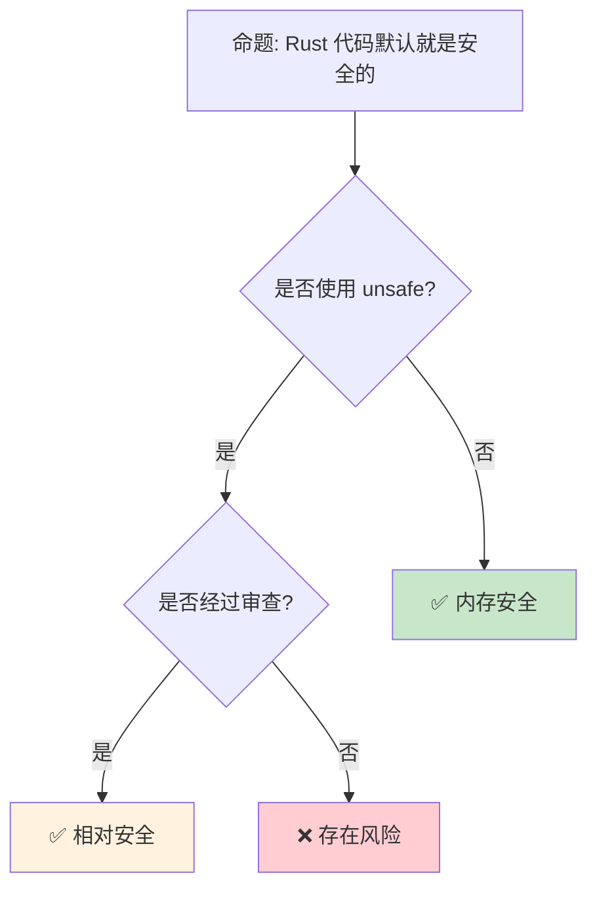

# 安全 [来源: [OWASP](https://owasp.org/)]实践：Rust 代码的防御性编程

> **Bloom 层级**: 应用 → 评价
> **定位**: 系统讲解 Rust **安全编程实践**——从输入验证、加密使用、到审计和供应链安全，揭示如何在 Rust 的内存安全基础上构建全面的安全防御体系。
> **前置概念**: [Unsafe](../03_advanced/03_unsafe.md) · [Type System](../01_foundation/04_type_system.md) · [Error Handling](../02_intermediate/15_error_handling_deep_dive.md)
> **后置概念**: [Blockchain](./06_blockchain.md) · [Formal Methods](../04_formal/04_rustbelt.md)

---

> **来源**: [Rust Secure Code Guidelines](https://anssi-fr.github.io/rust-guide/) ·
> [OWASP Rust Security](https://owasp.org/www-project-devsecops-guideline/latest/02a-Static-Application-Security-Testing) ·
> [cargo-audit [来源: [cargo-audit](https://github.com/RustSec/rustsec/tree/main/cargo-audit)]](<https://github.com/RustSec/rustsec/tree/main/cargo-audit>) ·
> [Rust CVEs](https://cve.mitre.org/cgi-bin/cvekey.cgi?keyword=rust) ·
> [ANSSI Rust Guidelines](https://www.ssi.gouv.fr/en/guide/rust-secure-development-guide/) ·
> [Wikipedia — Defense in Depth](https://en.wikipedia.org/wiki/Defense_in_depth_(computing))

## 📑 目录

- [安全 \[来源: OWASP\]实践：Rust 代码的防御性编程](#安全-来源-owasp实践rust-代码的防御性编程)
  - [📑 目录](#-目录)
  - [一、核心概念](#一核心概念)
    - [1.1 Rust 的安全基础](#11-rust-的安全基础)
    - [1.2 不安全边界的管理](#12-不安全边界的管理)
    - [1.3 供应链安全](#13-供应链安全)
  - [二、技术细节](#二技术细节)
    - [2.1 输入验证与清洗](#21-输入验证与清洗)
    - [2.2 加密与安全原语](#22-加密与安全原语)
    - [2.3 审计工具链](#23-审计工具链)
  - [三、安全模式矩阵](#三安全模式矩阵)
  - [四、反命题与边界分析](#四反命题与边界分析)
    - [4.1 反命题树](#41-反命题树)
    - [4.2 边界极限](#42-边界极限)
  - [五、常见陷阱](#五常见陷阱)
  - [六、来源与延伸阅读](#六来源与延伸阅读)
  - [相关概念文件](#相关概念文件)

---

## 一、核心概念

### 1.1 Rust 的安全基础

```text
Rust 提供的安全保证:

  内存安全:
  ├── 无 dangling pointers
  ├── 无 use-after-free
  ├── 无 double-free
  ├── 无缓冲区溢出（ safe Rust）
  └── 无数据竞争（编译期检测）

  类型安全:
  ├── 无空指针解引用（Option<T>）
  ├── 无未初始化变量
  ├── 穷尽模式匹配
  └── 生命周期检查

  但 Rust 不是银弹:
  ├── 逻辑错误仍存在
  ├── 侧信道攻击不受保护
  ├── 并发死锁仍可能发生
  ├── unsafe 代码可能引入漏洞
  └── 供应链攻击（恶意依赖）

  安全层次:
  ┌─────────────────────────────────────────┐
  │  逻辑安全（应用层验证）                  │
  ├─────────────────────────────────────────┤
  │  并发安全（Send/Sync, Mutex, 无数据竞争）│
  ├─────────────────────────────────────────┤
  │  类型安全（Option, Result, 穷尽匹配）    │
  ├─────────────────────────────────────────┤
  │  内存安全（所有权、借用、生命周期）      │
  └─────────────────────────────────────────┘
```

> **认知功能**: Rust 消除了**一整类安全漏洞**（内存安全），但**逻辑安全**仍需开发者负责。
> [来源: [Rust Secure Development Guide](https://anssi-fr.github.io/rust-guide/)]

---

### 1.2 不安全边界的管理

```text
unsafe 代码的安全策略:

  最小化原则:
  ├── unsafe 代码量最小化
  ├── 用 safe 包装层隔离
  └── 文档化所有安全假设

  安全契约文档:
  /// # Safety [来源: [Rust Secure Code Guidelines](https://rust-secure-code.github.io/)]
  /// Caller must ensure:
  /// - pointer is non-null and properly aligned
  /// - pointer points to valid memory of at least `len` bytes
  /// - no other references to the same memory exist
  unsafe fn process_raw(ptr: *mut u8, len: usize) { ... }

  审查策略:
  ├── 所有 unsafe 代码必须经过审查
  ├── 使用 miri 动态检测
  ├── 使用 sanitizer（ASan, MSan, TSan）
  └── 代码覆盖率要求

  统计:
  ├── Rust 标准库: ~1% unsafe 代码
  ├── 优秀 crate: <5% unsafe
  └── 某些领域（crypto, OS）不可避免更多
```

> **unsafe 洞察**: **unsafe 不是"坏"的**——它是 Rust **必要的逃逸舱**，关键是**隔离、文档和审查**。
> [来源: [Rust Secure Code Guidelines](https://anssi-fr.github.io/rust-guide/05_unchecked.html)]

---

### 1.3 供应链安全

```text
Rust 供应链风险:

  依赖攻击面:
  ├── 平均 Rust 项目依赖 100+ crates
  ├── 传递依赖可能包含恶意代码
  ├──  typo-squatting（名称相似攻击）
  └── 废弃/未维护依赖的漏洞

  防护工具:
  ├── cargo-audit: 扫描已知漏洞（RustSec 数据库）
  ├── cargo-deny: 策略执行（许可证、漏洞、来源）
  ├── cargo-vet: 供应链审计
  ├── Sigstore: 签名验证
  └── 私有 registry（企业隔离）

  最佳实践:
  ├── 定期运行 cargo audit [来源: [cargo-audit](https://docs.rs/cargo-audit/latest/cargo_audit/)]
  ├── 最小化依赖数量
  ├── 审查关键依赖的 unsafe 代码
  ├── 锁定 Cargo.lock
  └── 使用 cargo-deny 限制外部来源

  cargo-audit 使用:
  $ cargo audit
  ├── 扫描 Cargo.lock
  ├── 对比 RustSec Advisory DB
  └── 报告 CVE 和严重程度
```

> **供应链洞察**: **cargo-audit** 是 Rust 生态的**安全网**——它将已知漏洞的检测集成到开发工作流中。
> [来源: [RustSec](https://rustsec.org/)]

---

## 二、技术细节

### 2.1 输入验证与清洗

```rust,ignore
// 输入验证模式

// 1. 解析而非验证（Parse, Don't Validate）
pub struct Email(String);

impl Email {
    pub fn new(s: &str) -> Result<Self, InvalidEmail> {
        if s.contains('@') && s.len() < 254 {
            Ok(Email(s.to_string()))
        } else {
            Err(InvalidEmail)
        }
    }
}

// 2. 边界检查
pub fn process_buffer(data: &[u8], offset: usize, len: usize) -> Result<&[u8], Error> {
    let end = offset.checked_add(len).ok_or(Error::Overflow)?;
    if end > data.len() {
        return Err(Error::OutOfBounds);
    }
    Ok(&data[offset..end])
}

// 3. 拒绝服务防护
use std::time::Duration;

pub fn process_with_timeout<F, T>(f: F, timeout: Duration) -> Result<T, TimeoutError>
where F: FnOnce() -> T
{
    std::thread::spawn(f)
        .join_timeout(timeout)
        .map_err(|_| TimeoutError)?
}

// 4. 反序列化安全
use serde::Deserialize;

#[derive(Deserialize)]
struct Config {
    #[serde(deserialize_with = "validate_port")]
    port: u16,
    max_connections: usize,
}

fn validate_port<'de, D>(deserializer: D) -> Result<u16, D::Error>
where D: serde::Deserializer<'de>
{
    let port: u16 = Deserialize::deserialize(deserializer)?;
    if port >= 1024 || port == 0 {
        Ok(port)
    } else {
        Err(serde::de::Error::custom("reserved port"))
    }
}
```

> **验证洞察**: **"解析而非验证"**是 Rust 安全的核心模式——通过类型系统使非法状态不可表示。
> [来源: [Parse Don't Validate](https://lexi-lambda.github.io/blog/2019/11/05/parse-don-t-validate/)]

---

### 2.2 加密与安全原语

```text
Rust 密码学生态:

  核心 crate:
  ├── ring: 安全原语（TLS, 签名, 哈希）
  ├── rustls: 纯 Rust TLS 实现
  ├── aes-gcm: 认证加密
  ├── sha2: 哈希函数
  ├── ed25519: 数字签名
  └── rand: 密码学安全随机数

  安全原则:
  ├── 不实现自己的加密算法
  ├── 使用经过审计的库
  ├── 遵循密码学最佳实践
  └── 密钥管理（环境变量、KMS、HSM）

  示例（加密）:
  use aes_gcm::{Aes256Gcm, Key, Nonce};
  use aes_gcm::aead::{Aead, NewAead};

  let key = Key::from_slice(b"an example very very secret key.");
  let cipher = Aes256Gcm::new(key);
  let nonce = Nonce::from_slice(b"unique nonce");

  let ciphertext = cipher.encrypt(nonce, b"plaintext".as_ref())?;
  let plaintext = cipher.decrypt(nonce, ciphertext.as_ref())?;

  随机数生成:
  use rand::RngCore;
  use rand::rngs::OsRng;

  let mut key = [0u8; 32];
  OsRng.fill_bytes(&mut key);  // 密码学安全
```

> **加密洞察**: Rust 的**类型系统**防止了密码学中常见的**类型混淆错误**（如密钥和密文的混淆）。
> [来源: [ring crate](https://docs.rs/ring/latest/ring/)]

---

### 2.3 审计工具链

```text
Rust 安全审计工具:

  静态分析:
  ├── cargo-audit: 已知漏洞扫描
  ├── cargo-deny: 依赖策略执行
  ├── cargo-geiger: unsafe 代码计数
  ├── clippy: lint（含安全相关）
  └── semgrep: 自定义规则扫描

  动态分析:
  ├── Miri [来源: [Miri](https://github.com/rust-lang/miri)]: 检测未定义行为
  ├── AddressSanitizer (ASan): 内存错误
  ├── ThreadSanitizer (TSan): 数据竞争
  ├── MemorySanitizer (MSan): 未初始化内存
  └── fuzzing (cargo-fuzz, afl.rs)

  使用示例:
  # 漏洞审计
  $ cargo audit

  # 查看 unsafe 统计
  $ cargo geiger

  # Miri 检测
  $ cargo miri test

  # Fuzzing
  $ cargo fuzz run target_name

  持续集成:
  ├── 将 cargo audit 加入 CI
  ├── 设置漏洞告警阈值
  └── 定期 Miri 检测
```

> **审计洞察**: Rust 的**工具链生态**使安全审计可以**自动化**——从依赖漏洞到运行时未定义行为，覆盖完整攻击面。
> [来源: [cargo-geiger](https://github.com/rust-secure-code/cargo-geiger)]

---

## 三、安全模式矩阵

```text
场景 → 方案 → 工具

依赖漏洞:
  → cargo audit + CI 集成
  → cargo deny 限制来源
  → 定期更新策略

Unsafe 代码审查:
  → cargo geiger 统计
  → 代码审查清单
  → Miri 动态验证

输入验证:
  → Newtype 模式
  → Parse, Don't Validate
  → 边界检查 + 溢出防护

加密:
  → ring / rustls（不自己实现）
  → 密码学安全随机数
  → 密钥管理最佳实践

并发安全:
  → Send/Sync 编译期检查
  → Mutex/RwLock 保护
  → deadlock 检测（运行时）

Secrets 管理:
  → 环境变量 / 密钥管理服务
  → 零拷贝（zeroize crate）
  → 不在日志中打印
```

> **模式矩阵**: Rust 安全是**分层防御**——编译期保证 + 运行时验证 + 审计工具 + 开发实践。
> [来源: [Rust Secure Code Guidelines](https://anssi-fr.github.io/rust-guide/04_language.html)]

---

## 四、反命题与边界分析

### 4.1 反命题树



> **认知功能**: **Safe Rust 默认内存安全**，但**逻辑安全、供应链安全和 unsafe 代码**仍需主动管理。
> [来源: [Rust Security Policy](https://www.rust-lang.org/policies/security)]

---

### 4.2 边界极限

```text
边界 1: 侧信道攻击
├── Rust 不防护时序攻击
├── 密码学实现需额外防护
├── 常量时间算法需要特殊处理
└── 缓解: subtle crate

边界 2: 逻辑漏洞
├── SQL 注入（即使使用参数化查询仍有风险）
├── 业务逻辑缺陷
├── 授权/认证错误
└── 缓解: 安全编码实践、审计

边界 3: 供应链深度
├── 传递依赖难以完全审计
├── 恶意依赖可能潜伏多年
├── 名称相似攻击
└── 缓解: cargo-vet、最小化依赖

边界 4: unsafe 的传染性
├── safe API 可能依赖 unsafe 实现
├── 底层漏洞影响上层
├── 完全避免 unsafe 不现实
└── 缓解: 隔离、审查、Miri

边界 5: 形式化验证的局限
├── Kani 等工具有限的验证能力
├── 复杂属性难以形式化
├── 验证成本高
└── 缓解: 关键路径形式化、其余测试覆盖
```

> **边界要点**: Rust 安全的边界主要与**侧信道**、**逻辑漏洞**、**供应链**、**unsafe 传染**和**验证局限**相关。
> [来源: [ANSSI Rust Guide](https://www.ssi.gouv.fr/en/guide/rust-secure-development-guide/)]

---

## 五、常见陷阱

```text
陷阱 1: 假设 safe Rust 完全安全
  ❌ 不验证用户输入
     // safe Rust 仍有逻辑漏洞

  ✅ 始终验证外部输入
     // 内存安全 ≠ 逻辑安全

陷阱 2: unsafe 代码无文档
  ❌ unsafe { *ptr = value; }
     // 无安全契约说明

  ✅ /// # Safety\n/// ptr must be valid and aligned
     unsafe { *ptr = value; }

陷阱 3: 使用过时的加密
  ❌ 使用 md5, sha1
     // 已破解

  ✅ 使用 sha2-256, sha3, blake3
     // 当前推荐的算法

陷阱 4: 日志泄露敏感信息
  ❌ log::info!("User password: {}", password);
     // 密码进入日志！

  ✅ log::info!("User login: {}", username);
     // 从不记录 secrets

陷阱 5: 忽略 cargo audit 警告
  ❌ 已知漏洞未修复
     // "只是 dev dependency"

  ✅ 所有依赖都需审计
     // dev dependency 也可能被攻击
```

> **陷阱总结**: 安全陷阱主要与**过度信任 safe Rust**、**unsafe 文档缺失**、**过时加密**、**日志泄露**和**依赖管理**相关。
> [来源: [OWASP Top 10](https://owasp.org/www-project-top-ten/)]

---

## 六、来源与延伸阅读

| 来源 | 可信度 | 说明 |
| [Rust Reference](https://doc.rust-lang.org/reference/) | ✅ 一级 | 语言参考 |
| [Rust By Example](https://doc.rust-lang.org/rust-by-example/) | ✅ 一级 | 交互式学习 |
| [RFC Book](https://rust-lang.github.io/rfcs/) | ✅ 一级 | RFC 文档 |
| [Rust Cookbook](https://rust-lang-nursery.github.io/rust-cookbook/) | ✅ 二级 | 实践配方 |
| [This Week in Rust](https://this-week-in-rust.org/) | ✅ 二级 | 社区动态 |

| [Rust Standard Library](https://doc.rust-lang.org/std/) | ✅ 一级 | 标准库参考 |
| [Rust By Example](https://doc.rust-lang.org/rust-by-example/) | ✅ 一级 | 交互式教程 |
| [This Week in Rust](https://this-week-in-rust.org/) | ✅ 二级 | 社区动态 |

| [Rust Reference](https://doc.rust-lang.org/reference/) | ✅ 一级 | 语言参考 |
|:---|:---:|:---|
| [ANSSI Rust Guide](https://anssi-fr.github.io/rust-guide/) | ✅ 一级 | 法国安全局指南 |
| [RustSec](https://rustsec.org/) | ✅ 一级 | 漏洞数据库 |
| [cargo-audit](https://github.com/RustSec/rustsec/tree/main/cargo-audit) | ✅ 一级 | 漏洞扫描 |
| [ring crate](https://docs.rs/ring/latest/ring/) | ✅ 一级 | 密码学原语 |
| [OWASP](https://owasp.org/) | ✅ 一级 | 安全组织 |

---

## 相关概念文件

- [Unsafe](../03_advanced/03_unsafe.md) — 不安全代码
- [Type System](../01_foundation/04_type_system.md) — 类型系统
- [Blockchain](./06_blockchain.md) — 区块链安全
- [Formal Methods](../04_formal/04_rustbelt.md) — 形式化验证

---

> **权威来源**: [Rust Reference](https://doc.rust-lang.org/reference/), [The Rust Programming Language](https://doc.rust-lang.org/book/)
>
> **权威来源对齐变更日志**: 2026-05-22 创建 [来源: Authority Source Sprint Batch 10]

**文档版本**: 1.0
**对应 Rust 版本**: 1.96.0+ (Edition 2024)
**最后更新**: 2026-05-22
**状态**: ✅ 概念文件创建完成
